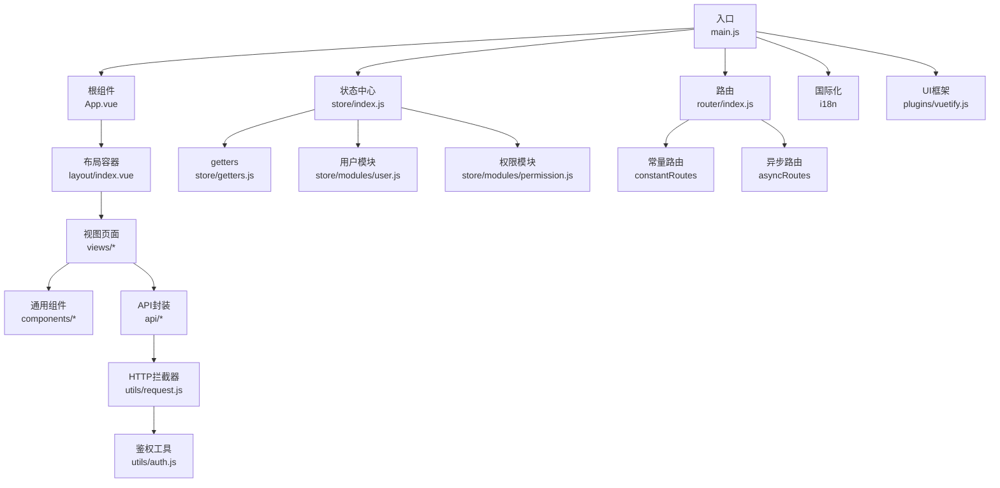
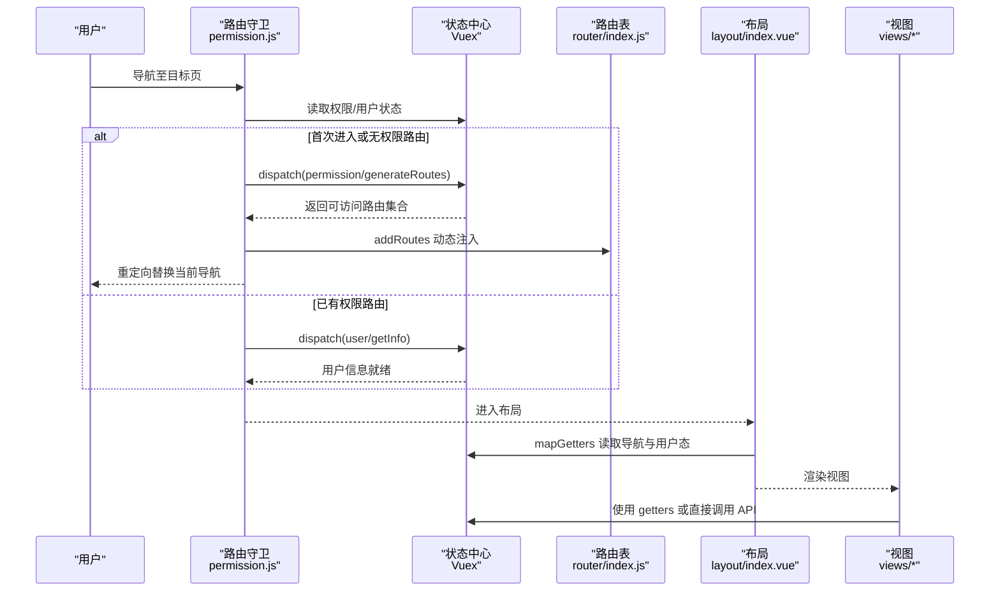
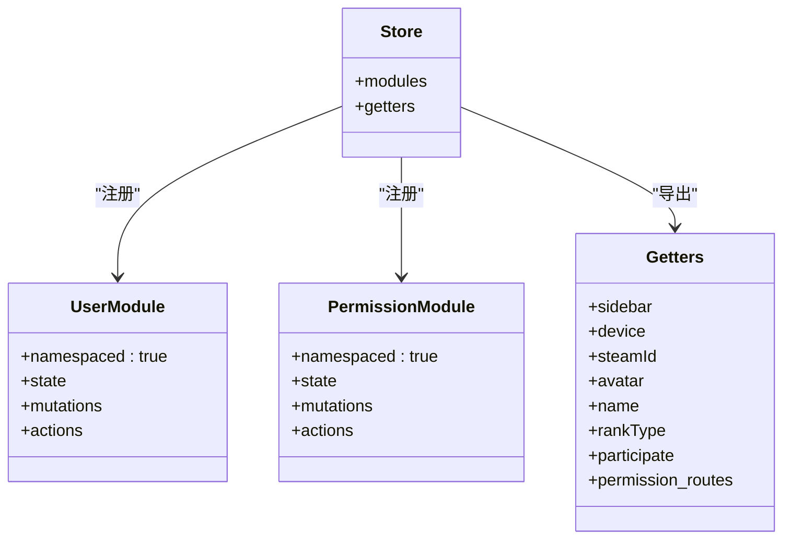
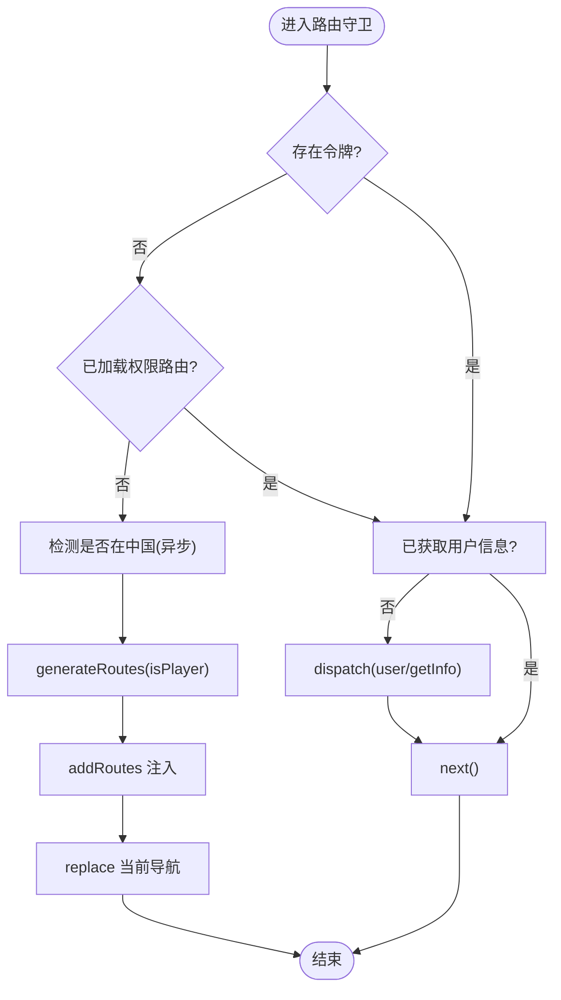
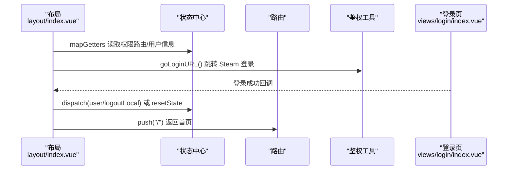
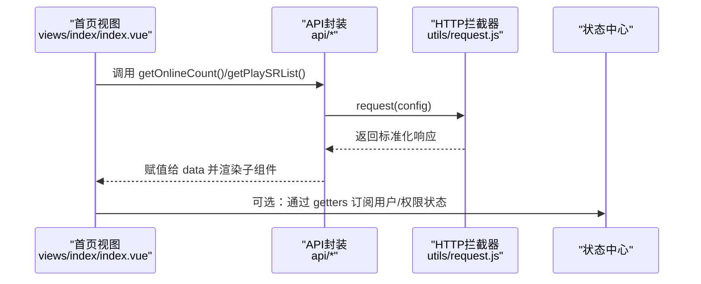
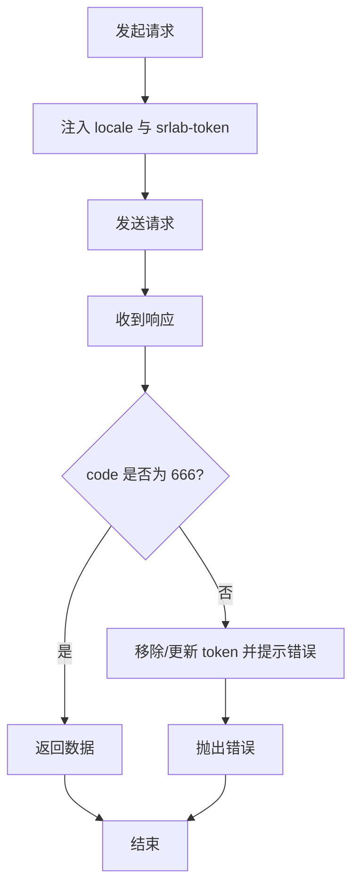
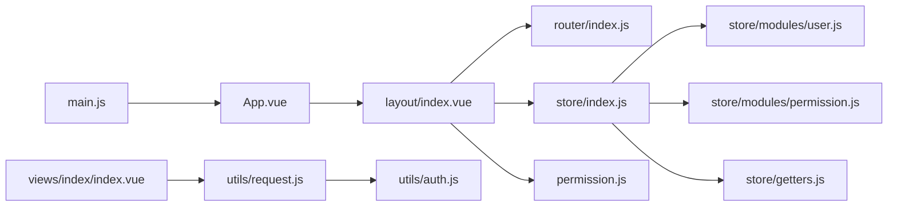

# 组件通信

<cite>
**本文引用的文件**
- [main.js](file://SpeedRunners.UI/src/main.js)
- [App.vue](file://SpeedRunners.UI/src/App.vue)
- [router/index.js](file://SpeedRunners.UI/src/router/index.js)
- [store/index.js](file://SpeedRunners.UI/src/store/index.js)
- [store/getters.js](file://SpeedRunners.UI/src/store/getters.js)
- [store/modules/user.js](file://SpeedRunners.UI/src/store/modules/user.js)
- [store/modules/permission.js](file://SpeedRunners.UI/src/store/modules/permission.js)
- [permission.js](file://SpeedRunners.UI/src/permission.js)
- [layout/index.vue](file://SpeedRunners.UI/src/layout/index.vue)
- [views/index/index.vue](file://SpeedRunners.UI/src/views/index/index.vue)
- [views/login/index.vue](file://SpeedRunners.UI/src/views/login/index.vue)
- [utils/request.js](file://SpeedRunners.UI/src/utils/request.js)
- [utils/auth.js](file://SpeedRunners.UI/src/utils/auth.js)
- [api/user.js](file://SpeedRunners.UI/src/api/user.js)
- [components/XCard/index.vue](file://SpeedRunners.UI/src/components/XCard/index.vue)
- [package.json](file://SpeedRunners.UI/package.json)
</cite>

## 目录
1. [引言](#引言)
2. [项目结构](#项目结构)
3. [核心组件](#核心组件)
4. [架构总览](#架构总览)
5. [详细组件分析](#详细组件分析)
6. [依赖关系分析](#依赖关系分析)
7. [性能考量](#性能考量)
8. [故障排查指南](#故障排查指南)
9. [结论](#结论)
10. [附录](#附录)

## 引言
本文件系统性梳理 SpeedRunnersLab 前端（Vue 2）的组件通信机制与状态管理模式，覆盖父子组件通信、兄弟/跨层级通信、Vuex 状态管理（模块化、命名空间、getters 订阅）、路由守卫与权限控制如何影响组件可见性与数据流，并给出调试方法、最佳实践与性能优化建议。读者可据此理解应用如何通过统一的状态中心与路由守卫实现“按权限渲染 + 按需加载”的组件通信闭环。

## 项目结构
SpeedRunners.UI 前端采用标准的单页应用结构：入口文件初始化全局插件与路由/状态；布局层负责导航、侧边栏、主题/语言切换与用户态展示；视图层承载业务页面；工具层封装请求拦截器与鉴权逻辑；API 层对接后端接口；组件层提供通用 UI 片段。

图表来源
- [main.js](file://SpeedRunners.UI/src/main.js#L1-L30)
- [App.vue](file://SpeedRunners.UI/src/App.vue#L1-L31)
- [router/index.js](file://SpeedRunners.UI/src/router/index.js#L1-L133)
- [store/index.js](file://SpeedRunners.UI/src/store/index.js#L1-L25)
- [store/getters.js](file://SpeedRunners.UI/src/store/getters.js#L1-L11)
- [store/modules/user.js](file://SpeedRunners.UI/src/store/modules/user.js#L1-L88)
- [store/modules/permission.js](file://SpeedRunners.UI/src/store/modules/permission.js#L1-L42)
- [utils/request.js](file://SpeedRunners.UI/src/utils/request.js#L1-L82)
- [utils/auth.js](file://SpeedRunners.UI/src/utils/auth.js#L1-L45)

章节来源
- [main.js](file://SpeedRunners.UI/src/main.js#L1-L30)
- [router/index.js](file://SpeedRunners.UI/src/router/index.js#L1-L133)
- [store/index.js](file://SpeedRunners.UI/src/store/index.js#L1-L25)

## 核心组件
- 入口与根组件：负责注入全局插件、挂载根实例、设置 SEO 元信息。
- 路由系统：定义常量路由与异步路由，提供动态添加路由能力与重置能力。
- 状态中心：自动扫描 modules 目录，按命名空间组织 user/permission 等模块，提供 getters。
- 权限守卫：基于路由元信息与用户态，动态生成可访问路由并注入导航。
- 布局容器：聚合导航、侧边栏、主题/语言切换、用户态与页脚，作为跨组件通信中枢。
- 视图与通用组件：视图内组合子组件，通用组件通过属性/事件/插槽实现复用与通信。

章节来源
- [App.vue](file://SpeedRunners.UI/src/App.vue#L1-L31)
- [router/index.js](file://SpeedRunners.UI/src/router/index.js#L33-L133)
- [store/index.js](file://SpeedRunners.UI/src/store/index.js#L8-L25)
- [store/getters.js](file://SpeedRunners.UI/src/store/getters.js#L1-L11)
- [permission.js](file://SpeedRunners.UI/src/permission.js#L13-L60)
- [layout/index.vue](file://SpeedRunners.UI/src/layout/index.vue#L260-L335)

## 架构总览
下图展示从用户进入应用到组件渲染的关键交互路径：路由守卫决定可访问路由集合，布局读取权限路由与用户信息，视图组件通过 API 与状态完成数据拉取与展示。

图表来源
- [permission.js](file://SpeedRunners.UI/src/permission.js#L13-L60)
- [router/index.js](file://SpeedRunners.UI/src/router/index.js#L96-L133)
- [store/modules/permission.js](file://SpeedRunners.UI/src/store/modules/permission.js#L21-L35)
- [store/modules/user.js](file://SpeedRunners.UI/src/store/modules/user.js#L37-L81)
- [layout/index.vue](file://SpeedRunners.UI/src/layout/index.vue#L281-L294)

## 详细组件分析

### Vuex 状态管理与模块化
- 自动模块注册：通过 require.context 扫描 modules 目录，按文件名作为模块名注册，避免手动引入。
- 命名空间：各模块以 namespaced: true 组织，避免命名冲突，便于跨组件安全访问。
- getters：集中暴露常用派生状态（如用户信息、权限路由），供组件以 mapGetters 计算属性形式订阅。
- user 模块：包含用户信息获取、本地登出、状态重置等动作与变更；对外提供异步 API 调用。
- permission 模块：根据用户角色生成可访问路由集合，合并常量路由与异步路由，并处理 404 放置。

图表来源
- [store/index.js](file://SpeedRunners.UI/src/store/index.js#L8-L25)
- [store/modules/user.js](file://SpeedRunners.UI/src/store/modules/user.js#L83-L88)
- [store/modules/permission.js](file://SpeedRunners.UI/src/store/modules/permission.js#L37-L42)
- [store/getters.js](file://SpeedRunners.UI/src/store/getters.js#L1-L11)

章节来源
- [store/index.js](file://SpeedRunners.UI/src/store/index.js#L1-L25)
- [store/modules/user.js](file://SpeedRunners.UI/src/store/modules/user.js#L1-L88)
- [store/modules/permission.js](file://SpeedRunners.UI/src/store/modules/permission.js#L1-L42)
- [store/getters.js](file://SpeedRunners.UI/src/store/getters.js#L1-L11)

### 路由守卫与权限控制
- 守卫逻辑：在 beforeEach 中根据是否存在令牌与是否已加载权限路由决定是否生成并注入异步路由；对未登录用户尝试拉取用户信息并处理异常。
- 动态路由：根据 isInChina 或已持有令牌决定是否加载“玩家区”异步路由，最终将 404 路由置于末位。
- 页面标题与进度条：结合国际化与 NProgress 更新页面标题与加载状态。

图表来源
- [permission.js](file://SpeedRunners.UI/src/permission.js#L13-L60)
- [router/index.js](file://SpeedRunners.UI/src/router/index.js#L96-L116)
- [store/modules/permission.js](file://SpeedRunners.UI/src/store/modules/permission.js#L21-L35)
- [utils/auth.js](file://SpeedRunners.UI/src/utils/auth.js#L24-L45)

章节来源
- [permission.js](file://SpeedRunners.UI/src/permission.js#L1-L69)
- [router/index.js](file://SpeedRunners.UI/src/router/index.js#L1-L133)
- [store/modules/permission.js](file://SpeedRunners.UI/src/store/modules/permission.js#L1-L42)
- [utils/auth.js](file://SpeedRunners.UI/src/utils/auth.js#L1-L45)

### 布局层组件通信枢纽
- 导航与侧边栏：根据权限路由动态拼接主导航与侧边栏项，支持隐藏/显示控制。
- 用户态展示：根据用户头像/昵称/等级显示登录入口或隐私设置入口。
- 主题与语言：通过 vuetify 主题开关与 i18n 切换，持久化到本地存储。
- 登录流程：触发 Steam OpenID 登录，登录成功后自动初始化用户数据并跳转首页。

图表来源
- [layout/index.vue](file://SpeedRunners.UI/src/layout/index.vue#L281-L335)
- [utils/auth.js](file://SpeedRunners.UI/src/utils/auth.js#L18-L22)
- [views/login/index.vue](file://SpeedRunners.UI/src/views/login/index.vue#L66-L97)
- [store/modules/user.js](file://SpeedRunners.UI/src/store/modules/user.js#L62-L81)

章节来源
- [layout/index.vue](file://SpeedRunners.UI/src/layout/index.vue#L1-L355)
- [views/login/index.vue](file://SpeedRunners.UI/src/views/login/index.vue#L1-L97)
- [utils/auth.js](file://SpeedRunners.UI/src/utils/auth.js#L1-L45)
- [store/modules/user.js](file://SpeedRunners.UI/src/store/modules/user.js#L1-L88)

### 视图组件的数据流与通信
- 首页视图：组合多个子组件（图表、赞助、计数器等），在 mounted 生命周期内分别调用 API 拉取在线人数与玩家列表，更新本地 data。
- 子组件复用：通过 props 传递数据，通过事件向上反馈，或通过插槽扩展内容。
- 通用卡片组件：XCard 通过透传属性/事件与插槽，实现灵活布局与行为扩展。

图表来源
- [views/index/index.vue](file://SpeedRunners.UI/src/views/index/index.vue#L75-L82)
- [utils/request.js](file://SpeedRunners.UI/src/utils/request.js#L14-L80)
- [store/getters.js](file://SpeedRunners.UI/src/store/getters.js#L1-L11)

章节来源
- [views/index/index.vue](file://SpeedRunners.UI/src/views/index/index.vue#L1-L84)
- [components/XCard/index.vue](file://SpeedRunners.UI/src/components/XCard/index.vue#L1-L102)
- [utils/request.js](file://SpeedRunners.UI/src/utils/request.js#L1-L82)
- [store/getters.js](file://SpeedRunners.UI/src/store/getters.js#L1-L11)

### API 与鉴权工具
- 请求拦截器：统一注入 locale 与 srlab-token 头部；根据服务端返回 code 决定是否抛错、刷新 token 或提示错误。
- 响应拦截器：对非 666 状态码统一错误处理，必要时触发用户状态重置与页面刷新。
- 鉴权工具：提供 Cookie 令牌的增删查、Steam 登录跳转 URL 生成、地域判断（是否在中国）。

图表来源
- [utils/request.js](file://SpeedRunners.UI/src/utils/request.js#L14-L80)
- [utils/auth.js](file://SpeedRunners.UI/src/utils/auth.js#L6-L16)
- [api/user.js](file://SpeedRunners.UI/src/api/user.js#L1-L77)

章节来源
- [utils/request.js](file://SpeedRunners.UI/src/utils/request.js#L1-L82)
- [utils/auth.js](file://SpeedRunners.UI/src/utils/auth.js#L1-L45)
- [api/user.js](file://SpeedRunners.UI/src/api/user.js#L1-L77)

## 依赖关系分析
- 组件耦合：布局层对状态中心与路由具有强依赖，视图层通过 API 与状态解耦；通用组件通过插槽与属性降低耦合度。
- 数据流向：自上而下的 props 传递为主，配合事件向上传递；跨层级通过 Vuex getters 订阅与路由守卫驱动。
- 外部依赖：Axios、Vuex、Vue Router、Vuetify、NProgress、vue-i18n、js-cookie 等。

图表来源
- [main.js](file://SpeedRunners.UI/src/main.js#L1-L30)
- [App.vue](file://SpeedRunners.UI/src/App.vue#L1-L31)
- [layout/index.vue](file://SpeedRunners.UI/src/layout/index.vue#L260-L335)
- [router/index.js](file://SpeedRunners.UI/src/router/index.js#L1-L133)
- [store/index.js](file://SpeedRunners.UI/src/store/index.js#L1-L25)
- [permission.js](file://SpeedRunners.UI/src/permission.js#L1-L69)
- [utils/request.js](file://SpeedRunners.UI/src/utils/request.js#L1-L82)
- [utils/auth.js](file://SpeedRunners.UI/src/utils/auth.js#L1-L45)
- [store/modules/user.js](file://SpeedRunners.UI/src/store/modules/user.js#L1-L88)
- [store/modules/permission.js](file://SpeedRunners.UI/src/store/modules/permission.js#L1-L42)
- [store/getters.js](file://SpeedRunners.UI/src/store/getters.js#L1-L11)

章节来源
- [package.json](file://SpeedRunners.UI/package.json#L15-L32)

## 性能考量
- 模块懒加载：路由采用动态 import，减少首屏体积。
- 路由重置：resetRouter 避免重复注入导致的内存泄漏与重复监听。
- 请求去抖与并发：在视图层合理控制 API 调用频率，避免重复请求与竞态。
- 组件缓存：利用 keep-alive 缓存热点视图，减少重复渲染。
- 图表与大列表：对重型组件（如图表）采用按需渲染与虚拟滚动策略（如适用）。
- 本地存储：主题与语言偏好写入 localStorage，避免每次渲染计算。

## 故障排查指南
- 登录后无法进入“玩家区”：检查 isInChina 判断与 generateRoutes 分支，确认令牌是否正确携带与服务端返回 code。
- 用户信息不更新：确认 permission.js 中是否在获取用户信息后继续 next()，以及 user/getInfo 是否成功返回数据。
- 404 路由未生效：确认 asyncRoutes 与 add404Router 合并顺序，确保 404 在末尾。
- 请求失败与弹窗：查看 utils/request 的响应拦截器，定位错误码并核对后端返回结构。
- 令牌过期：拦截器会自动移除/更新 token 并提示错误，必要时触发用户状态重置与页面刷新。

章节来源
- [permission.js](file://SpeedRunners.UI/src/permission.js#L13-L60)
- [utils/request.js](file://SpeedRunners.UI/src/utils/request.js#L32-L80)
- [router/index.js](file://SpeedRunners.UI/src/router/index.js#L112-L116)
- [store/modules/permission.js](file://SpeedRunners.UI/src/store/modules/permission.js#L21-L35)

## 结论
SpeedRunnersLab 前端通过“路由守卫 + Vuex 模块化 + 组件插槽/属性”的组合，实现了清晰的组件通信与状态管理：布局层承担跨组件协调职责，视图层聚焦业务渲染，通用组件提供可复用能力。配合请求拦截器与鉴权工具，形成从路由到状态再到 UI 的完整通信闭环。遵循本文最佳实践与性能建议，可进一步提升可维护性与用户体验。

## 附录
- 组件通信方式选择建议
  - 父子通信：props/event；兄弟/跨层级：Vuex getters + actions；远距离共享：Vuex 模块化 + 命名空间。
- 最佳实践
  - 明确职责边界，尽量通过状态中心解耦。
  - 使用命名空间避免冲突，合理拆分模块。
  - 在路由守卫中统一处理权限与用户态，避免在组件内分散处理。
  - 对重型请求与渲染进行节流/防抖与缓存。
- 调试技巧
  - 使用浏览器开发者工具观察网络请求与响应，关注拦截器日志。
  - 在 permission.js 与 store modules 中加入关键节点的日志输出。
  - 利用 Vue DevTools 观察组件树、状态变化与路由匹配情况。