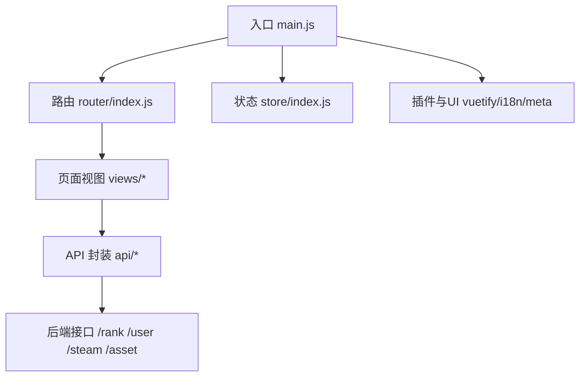
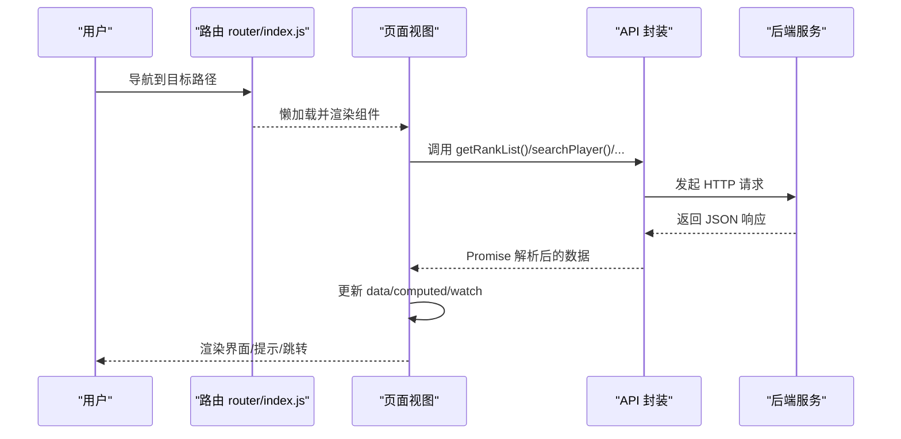
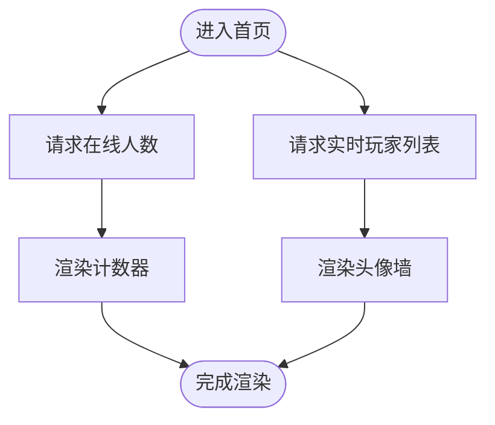
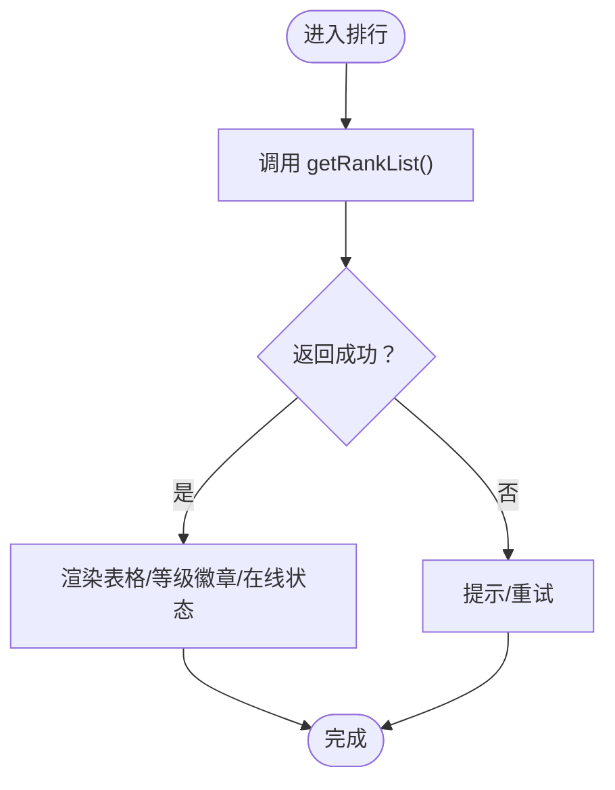
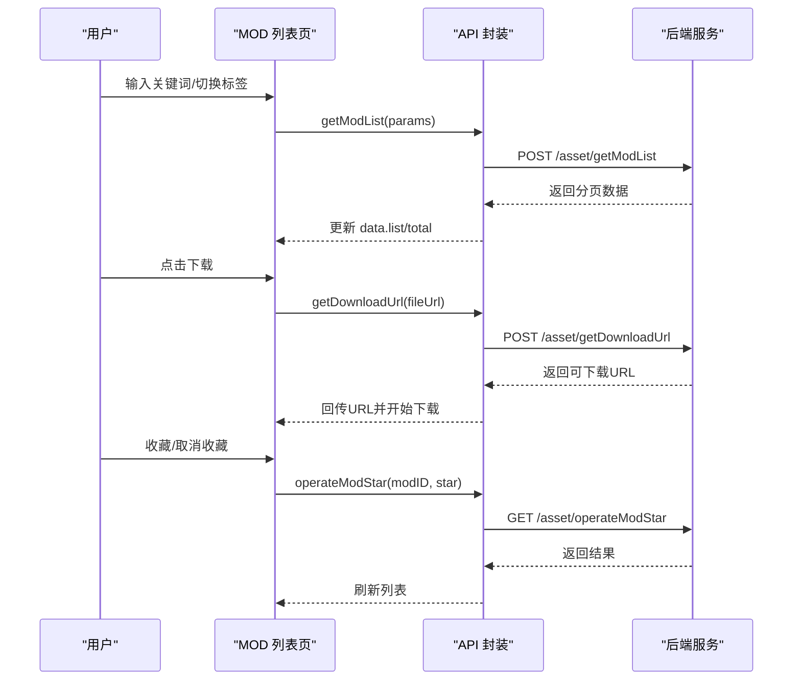
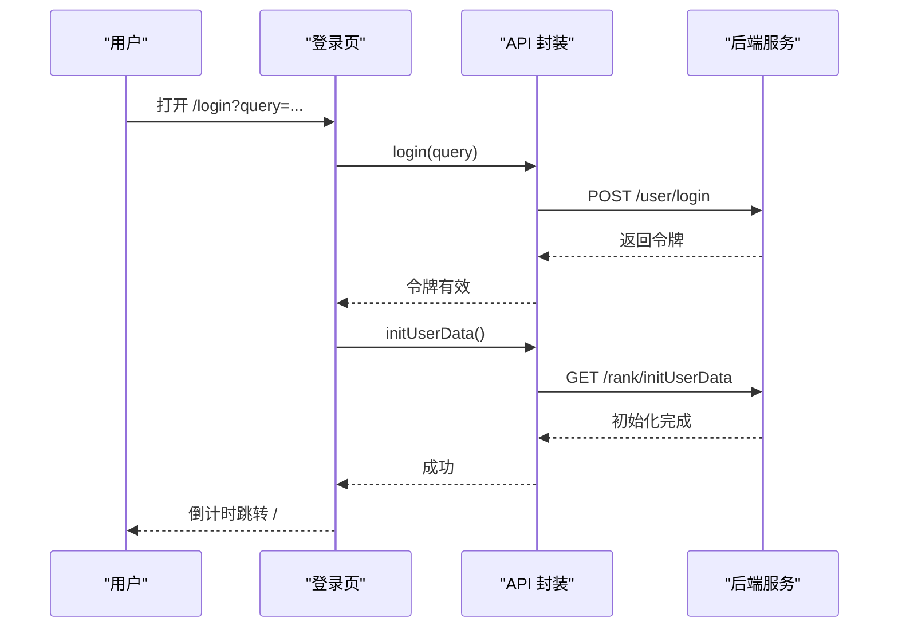
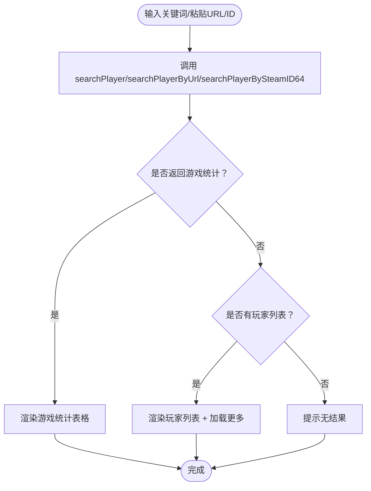
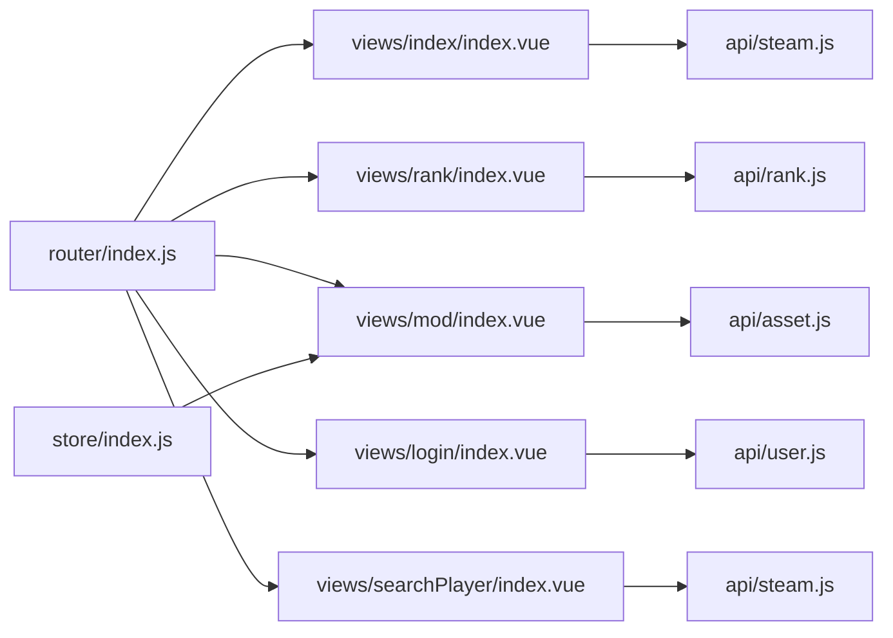

# 页面组件

<cite>
**本文引用的文件**
- [main.js](file://SpeedRunners.UI/src/main.js)
- [router/index.js](file://SpeedRunners.UI/src/router/index.js)
- [store/index.js](file://SpeedRunners.UI/src/store/index.js)
- [package.json](file://SpeedRunners.UI/package.json)
- [vue.config.js](file://SpeedRunners.UI/vue.config.js)
- [views/index/index.vue](file://SpeedRunners.UI/src/views/index/index.vue)
- [views/rank/index.vue](file://SpeedRunners.UI/src/views/rank/index.vue)
- [views/mod/index.vue](file://SpeedRunners.UI/src/views/mod/index.vue)
- [views/login/index.vue](file://SpeedRunners.UI/src/views/login/index.vue)
- [views/plaza/index.vue](file://SpeedRunners.UI/src/views/plaza/index.vue)
- [views/searchPlayer/index.vue](file://SpeedRunners.UI/src/views/searchPlayer/index.vue)
- [api/rank.js](file://SpeedRunners.UI/src/api/rank.js)
- [api/user.js](file://SpeedRunners.UI/src/api/user.js)
- [api/steam.js](file://SpeedRunners.UI/src/api/steam.js)
- [api/asset.js](file://SpeedRunners.UI/src/api/asset.js)
</cite>

## 目录
1. [简介](#简介)
2. [项目结构](#项目结构)
3. [核心组件](#核心组件)
4. [架构总览](#架构总览)
5. [详细组件分析](#详细组件分析)
6. [依赖关系分析](#依赖关系分析)
7. [性能考量](#性能考量)
8. [故障排查指南](#故障排查指南)
9. [结论](#结论)
10. [附录](#附录)

## 简介
本文件面向 SpeedRunnersLab 前端页面组件，系统性梳理基于 Vue.js 的页面级组件设计与实现，覆盖首页、排行榜、MOD 管理、登录、广场、玩家搜索等页面。重点说明：
- 路由集成与页面导航
- 数据获取与状态管理（Vuex）
- 用户交互与加载/错误处理
- 与后端 API 的集成方式
- 响应式设计与移动端适配
- 开发最佳实践与性能优化建议

## 项目结构
前端采用 Vue CLI 3.x 搭建，核心入口在 main.js 中初始化 Vue 实例，注册路由、状态管理、国际化、权限控制与 Vuetify 插件；路由通过 router/index.js 定义常量路由与异步路由；状态通过 store/index.js 自动加载模块；页面组件集中在 views 下按功能划分。

图表来源
- [main.js](file://SpeedRunners.UI/src/main.js#L1-L30)
- [router/index.js](file://SpeedRunners.UI/src/router/index.js#L1-L133)
- [store/index.js](file://SpeedRunners.UI/src/store/index.js#L1-L25)

章节来源
- [main.js](file://SpeedRunners.UI/src/main.js#L1-L30)
- [router/index.js](file://SpeedRunners.UI/src/router/index.js#L1-L133)
- [store/index.js](file://SpeedRunners.UI/src/store/index.js#L1-L25)
- [package.json](file://SpeedRunners.UI/package.json#L1-L76)
- [vue.config.js](file://SpeedRunners.UI/vue.config.js#L1-L129)

## 核心组件
- 首页：展示在线人数、实时玩家头像墙、新增玩家趋势与赞助信息，使用 Odometer 计数器与图表组件。
- 排行榜：表格展示玩家天梯等级、分数变化与在线状态，支持主题色与响应式列宽。
- MOD 管理：列表展示 MOD，支持分页、标签筛选、关键词搜索、收藏星标、分享链接、删除与下载进度反馈。
- 登录：三步流程：验证令牌 -> 初始化用户数据 -> 成功跳转首页。
- 广场：当前为“建设中”占位页。
- 玩家搜索：支持关键词搜索、Steam 公开资料或 ID 查询、分页加载更多结果。

章节来源
- [views/index/index.vue](file://SpeedRunners.UI/src/views/index/index.vue#L1-L84)
- [views/rank/index.vue](file://SpeedRunners.UI/src/views/rank/index.vue#L1-L309)
- [views/mod/index.vue](file://SpeedRunners.UI/src/views/mod/index.vue#L1-L427)
- [views/login/index.vue](file://SpeedRunners.UI/src/views/login/index.vue#L1-L97)
- [views/plaza/index.vue](file://SpeedRunners.UI/src/views/plaza/index.vue#L1-L12)
- [views/searchPlayer/index.vue](file://SpeedRunners.UI/src/views/searchPlayer/index.vue#L1-L169)

## 架构总览
页面组件通过路由懒加载引入，统一在 Layout 包裹下渲染；数据层通过 API 模块封装请求方法，页面组件在生命周期内发起请求并更新本地状态；全局状态通过 Vuex 模块化管理（如用户信息、权限、设置等）；UI 使用 Vuetify 组件库与 Material Design 图标，Meta 插件用于 SEO 关键词注入。

图表来源
- [router/index.js](file://SpeedRunners.UI/src/router/index.js#L33-L94)
- [views/rank/index.vue](file://SpeedRunners.UI/src/views/rank/index.vue#L61-L96)
- [views/searchPlayer/index.vue](file://SpeedRunners.UI/src/views/searchPlayer/index.vue#L104-L155)
- [api/rank.js](file://SpeedRunners.UI/src/api/rank.js#L1-L64)
- [api/steam.js](file://SpeedRunners.UI/src/api/steam.js#L1-L36)

## 详细组件分析

### 首页组件（views/index/index.vue）
- 结构与布局：两列卡片布局，左侧包含在线人数计数器、实时玩家头像墙、新增趋势图与赞助模块；右侧为小时在线趋势图。
- 数据获取：进入页面时并行请求在线人数与实时玩家列表，分别写入响应式数据。
- 交互与样式：使用 Odometer 数字滚动组件与自定义图表组件；头像使用 Tooltip 展示昵称；视频链接与标题来自多语言配置。
- SEO：通过 metaInfo 注入关键词。

图表来源
- [views/index/index.vue](file://SpeedRunners.UI/src/views/index/index.vue#L56-L84)
- [api/steam.js](file://SpeedRunners.UI/src/api/steam.js#L31-L36)
- [api/rank.js](file://SpeedRunners.UI/src/api/rank.js#L24-L29)

章节来源
- [views/index/index.vue](file://SpeedRunners.UI/src/views/index/index.vue#L1-L84)
- [api/steam.js](file://SpeedRunners.UI/src/api/steam.js#L1-L36)
- [api/rank.js](file://SpeedRunners.UI/src/api/rank.js#L1-L64)

### 排行榜组件（views/rank/index.vue）
- 表格渲染：骨架屏占位，加载完成后渲染玩家列表；根据屏幕宽度切换列宽与样式类。
- 在线状态与头像边框：依据玩家状态动态设置边框颜色；在线即为游戏 ID 判断。
- 天梯等级：通过背景裁剪实现等级徽章动画效果；等级名称映射多语言。
- 分数变化：计算与上期差值，正数显示上升箭头与增量。
- 主题适配：深色/浅色主题下交替行颜色不同。
- SEO：metaInfo 注入关键词。

图表来源
- [views/rank/index.vue](file://SpeedRunners.UI/src/views/rank/index.vue#L61-L166)
- [api/rank.js](file://SpeedRunners.UI/src/api/rank.js#L3-L8)

章节来源
- [views/rank/index.vue](file://SpeedRunners.UI/src/views/rank/index.vue#L1-L309)
- [api/rank.js](file://SpeedRunners.UI/src/api/rank.js#L1-L64)

### MOD 管理组件（views/mod/index.vue）
- 功能概览：侧边标签筛选、关键词搜索、分页列表、MOD 卡片悬停下载、收藏星标、分享链接、删除确认弹窗、上传抽屉。
- 状态与参数：本地维护搜索参数（标签、页码、每页大小、关键词）、分页总数、列表数据与删除对话框状态。
- 权限与鉴权：通过 Vuex getter 获取用户名与 Steam ID，未登录时拦截部分操作并提示登录。
- 交互流程：关键词/标签变更触发重新拉取；下载前先获取下载地址并以原生 XHR 监听进度；星标切换与删除均调用对应 API。
- 路由联动：支持分享模式（带 id 参数），直接展示单个 MOD。
- SEO：metaInfo 注入关键词。

图表来源
- [views/mod/index.vue](file://SpeedRunners.UI/src/views/mod/index.vue#L215-L414)
- [api/asset.js](file://SpeedRunners.UI/src/api/asset.js#L1-L54)

章节来源
- [views/mod/index.vue](file://SpeedRunners.UI/src/views/mod/index.vue#L1-L427)
- [api/asset.js](file://SpeedRunners.UI/src/api/asset.js#L1-L54)

### 登录组件（views/login/index.vue）
- 流程：接收路由 query 参数作为登录凭据，依次执行登录与初始化用户数据，最后倒计时跳转首页。
- 步骤提示：根据步骤动态更新标题与步骤文案，使用进度条指示等待阶段。
- 跳转：登录成功后定时器递减，结束后跳转根路径。

图表来源
- [views/login/index.vue](file://SpeedRunners.UI/src/views/login/index.vue#L34-L96)
- [api/user.js](file://SpeedRunners.UI/src/api/user.js#L10-L22)
- [api/rank.js](file://SpeedRunners.UI/src/api/rank.js#L17-L22)

章节来源
- [views/login/index.vue](file://SpeedRunners.UI/src/views/login/index.vue#L1-L97)
- [api/user.js](file://SpeedRunners.UI/src/api/user.js#L1-L77)
- [api/rank.js](file://SpeedRunners.UI/src/api/rank.js#L1-L64)

### 广场组件（views/plaza/index.vue）
- 当前为占位页，仅渲染“建设中”组件，后续可扩展活动、公告或社交功能。

章节来源
- [views/plaza/index.vue](file://SpeedRunners.UI/src/views/plaza/index.vue#L1-L12)

### 玩家搜索组件（views/searchPlayer/index.vue）
- 搜索入口：支持关键词、Steam 公开资料 URL 或 64 位 Steam ID 三种输入方式。
- 结果展示：若返回游戏统计则以简单表格展示；若返回玩家列表则以列表项展示，支持“加载更多”。
- 加载状态：搜索与“加载更多”阶段显示骨架屏与加载指示。
- 错误提示：当无结果或为空时切换提示文案。

图表来源
- [views/searchPlayer/index.vue](file://SpeedRunners.UI/src/views/searchPlayer/index.vue#L69-L169)
- [api/steam.js](file://SpeedRunners.UI/src/api/steam.js#L3-L29)

章节来源
- [views/searchPlayer/index.vue](file://SpeedRunners.UI/src/views/searchPlayer/index.vue#L1-L169)
- [api/steam.js](file://SpeedRunners.UI/src/api/steam.js#L1-L36)

## 依赖关系分析
- 组件与路由：各页面通过路由懒加载引入，常量路由包含首页、匹配、排行、MOD、搜索、登录等；异步路由包含广场。
- 组件与 API：页面组件集中调用 api/* 下的方法，统一通过 utils/request 封装网络请求。
- 组件与状态：MOD 页面通过 mapGetters 获取用户信息；全局状态通过 store/modules/* 管理应用设置、用户信息等。
- 构建与优化：webpack 配置启用 splitChunks、runtimeChunk、SVG Sprite Loader、预加载/预取禁用等策略提升首屏与缓存表现。

图表来源
- [router/index.js](file://SpeedRunners.UI/src/router/index.js#L33-L110)
- [views/mod/index.vue](file://SpeedRunners.UI/src/views/mod/index.vue#L216-L224)
- [store/index.js](file://SpeedRunners.UI/src/store/index.js#L1-L25)

章节来源
- [router/index.js](file://SpeedRunners.UI/src/router/index.js#L1-L133)
- [store/index.js](file://SpeedRunners.UI/src/store/index.js#L1-L25)
- [vue.config.js](file://SpeedRunners.UI/vue.config.js#L58-L127)

## 性能考量
- 路由懒加载：所有页面组件均采用动态导入，减少初始包体积。
- 代码分割：webpack splitChunks 将第三方库与公共组件拆分，runtimeChunk 单独提取。
- 图标与资源：SVG Sprite Loader 减少请求次数；图片资源按需加载。
- 列表渲染：排行榜与 MOD 列表使用骨架屏与条件渲染，避免空 DOM。
- 进度反馈：MOD 下载使用原生 XHR 监听进度，提升用户体验。
- 主题与样式：深色/浅色主题切换通过 Vuetify 主题变量控制，减少重复样式。

章节来源
- [vue.config.js](file://SpeedRunners.UI/vue.config.js#L58-L127)
- [views/rank/index.vue](file://SpeedRunners.UI/src/views/rank/index.vue#L4-L10)
- [views/mod/index.vue](file://SpeedRunners.UI/src/views/mod/index.vue#L95-L96)

## 故障排查指南
- 登录失败或初始化异常
  - 现象：登录页停留在第二步或无跳转。
  - 排查：检查 /user/login 与 /rank/initUserData 是否返回成功码；确认 query 参数正确传递。
  - 参考
    - [views/login/index.vue](file://SpeedRunners.UI/src/views/login/index.vue#L66-L96)
    - [api/user.js](file://SpeedRunners.UI/src/api/user.js#L10-L22)
    - [api/rank.js](file://SpeedRunners.UI/src/api/rank.js#L17-L22)

- MOD 列表为空或无法分页
  - 现象：列表为空或分页按钮无效。
  - 排查：确认 /asset/getModList 返回 total 与 list；检查页码与每页大小参数；确认 onlyStar 与 tag 切换逻辑。
  - 参考
    - [views/mod/index.vue](file://SpeedRunners.UI/src/views/mod/index.vue#L279-L331)
    - [api/asset.js](file://SpeedRunners.UI/src/api/asset.js#L22-L27)

- 下载进度不更新或下载失败
  - 现象：点击下载无进度、下载后无法保存。
  - 排查：确认 /asset/getDownloadUrl 返回可用 URL；检查 XHR responseType 与 onprogress/onload 回调；确保 URL 对应文件存在。
  - 参考
    - [views/mod/index.vue](file://SpeedRunners.UI/src/views/mod/index.vue#L375-L401)
    - [api/asset.js](file://SpeedRunners.UI/src/api/asset.js#L9-L14)

- 排行榜等级徽章错位
  - 现象：等级图标裁剪位置异常。
  - 排查：检查 getLevelStyle 中的尺寸与偏移计算；确认窗口宽度变化时是否重新计算。
  - 参考
    - [views/rank/index.vue](file://SpeedRunners.UI/src/views/rank/index.vue#L112-L126)

- 玩家搜索无结果
  - 现象：输入关键词/URL/ID 后无任何输出。
  - 排查：确认 /steam/searchPlayer* 返回结构；检查空结果时的提示文案切换；确认“加载更多”逻辑。
  - 参考
    - [views/searchPlayer/index.vue](file://SpeedRunners.UI/src/views/searchPlayer/index.vue#L104-L155)
    - [api/steam.js](file://SpeedRunners.UI/src/api/steam.js#L3-L29)

## 结论
本项目页面组件围绕路由懒加载、API 封装与状态管理形成清晰的分层架构，首页与排行榜强调数据可视化与响应式体验，MOD 管理提供完整的 CRUD 与交互反馈，登录流程保证用户数据初始化一致性，玩家搜索覆盖多种输入场景。结合构建配置与 UI 库，整体具备良好的可维护性与性能基础。

## 附录
- 最佳实践
  - 页面组件尽量保持“轻渲染、重数据”的职责边界，复杂逻辑抽取至工具函数或计算属性。
  - 对长列表与大图使用骨架屏与懒加载，提升感知性能。
  - 对高频交互（如搜索、分页）进行防抖/节流与错误兜底。
  - 使用 metaInfo 注入 SEO 关键词，提升搜索引擎可见性。
- 性能优化建议
  - 复用通用组件（如 Skeleton、Toast、Pagination）降低重复开发成本。
  - 对静态资源启用 CDN 与缓存策略，结合版本戳避免缓存问题。
  - 对第三方库进行按需引入与 Tree Shaking，减少打包体积。