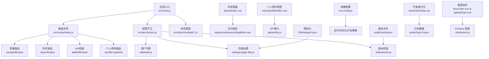
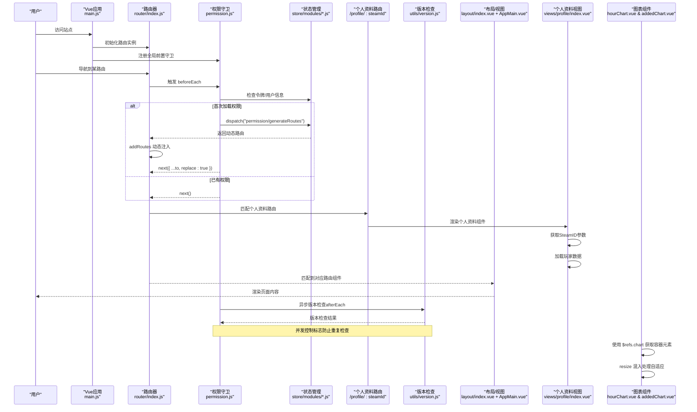
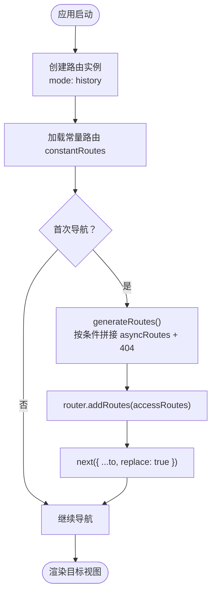
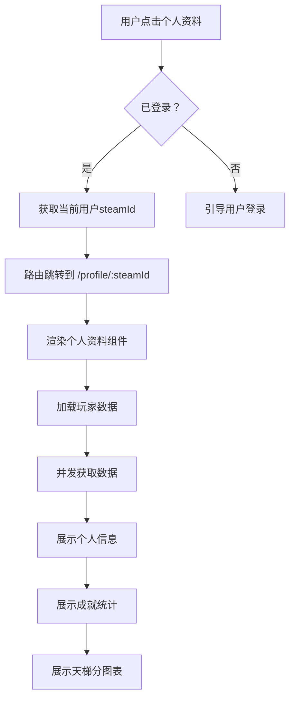
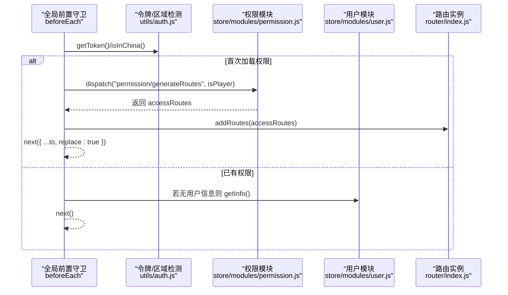
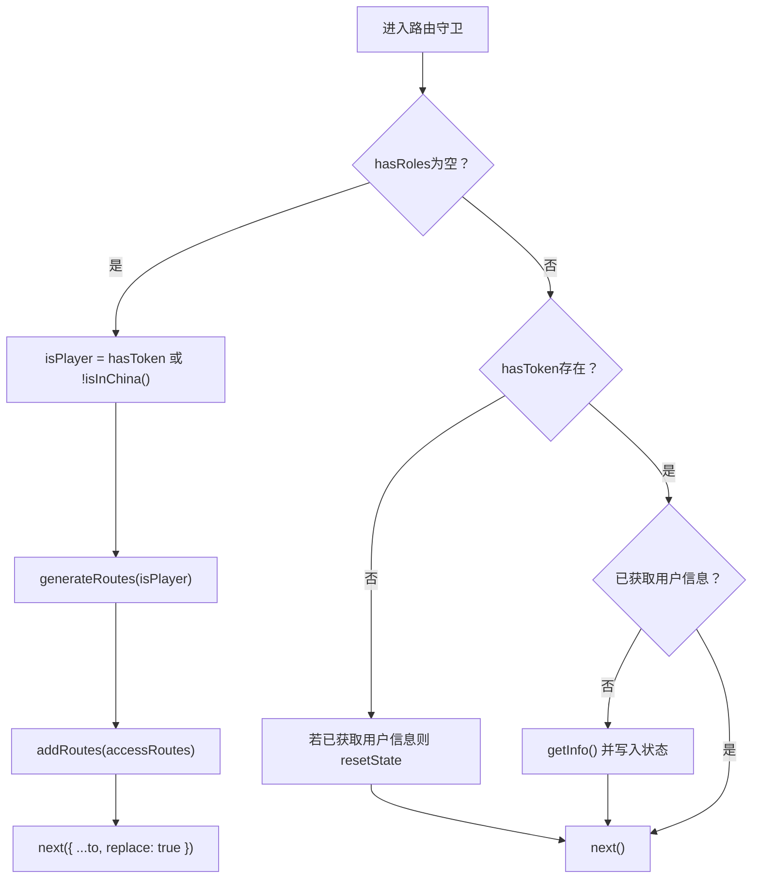
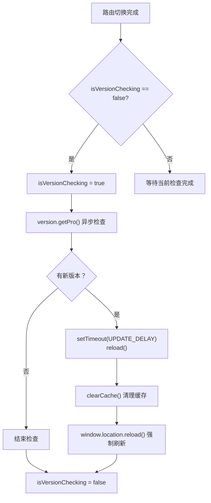
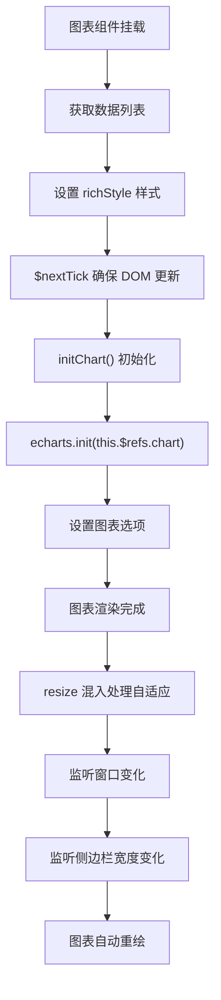
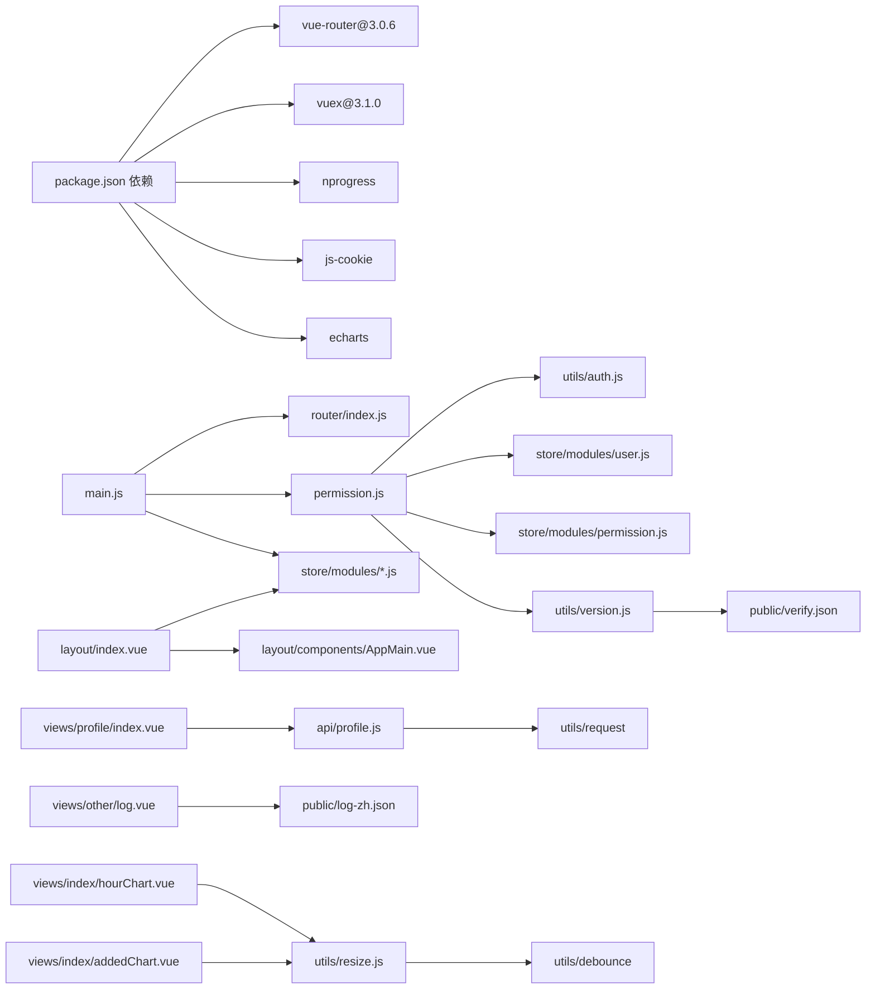

# 路由导航

<cite>
**本文引用的文件**
- [package.json](file://SpeedRunners.UI/package.json)
- [router/index.js](file://SpeedRunners.UI/src/router/index.js)
- [main.js](file://SpeedRunners.UI/src/main.js)
- [permission.js](file://SpeedRunners.UI/src/permission.js)
- [layout/index.vue](file://SpeedRunners.UI/src/layout/index.vue)
- [layout/components/AppMain.vue](file://SpeedRunners.UI/src/layout/components/AppMain.vue)
- [store/modules/permission.js](file://SpeedRunners.UI/src/store/modules/permission.js)
- [store/modules/user.js](file://SpeedRunners.UI/src/store/modules/user.js)
- [utils/auth.js](file://SpeedRunners.UI/src/utils/auth.js)
- [utils/get-page-title.js](file://SpeedRunners.UI/src/utils/get-page-title.js)
- [utils/version.js](file://SpeedRunners.UI/src/utils/version.js)
- [utils/resize.js](file://SpeedRunners.UI/src/utils/resize.js)
- [views/index/hourChart.vue](file://SpeedRunners.UI/src/views/index/hourChart.vue)
- [views/index/addedChart.vue](file://SpeedRunners.UI/src/views/index/addedChart.vue)
- [views/other/log.vue](file://SpeedRunners.UI/src/views/other/log.vue)
- [views/profile/index.vue](file://SpeedRunners.UI/src/views/profile/index.vue)
- [api/profile.js](file://SpeedRunners.UI/src/api/profile.js)
- [public/verify.json](file://SpeedRunners.UI/public/verify.json)
- [public/log-zh.json](file://SpeedRunners.UI/public/log-zh.json)
- [i18n/lang/zh.json](file://SpeedRunners.UI/src/i18n/lang/zh.json)
- [vue.config.js](file://SpeedRunners.UI/vue.config.js)
- [settings.js](file://SpeedRunners.UI/src/settings.js)
</cite>

## 目录
1. [简介](#简介)
2. [项目结构](#项目结构)
3. [核心组件](#核心组件)
4. [架构总览](#架构总览)
5. [详细组件分析](#详细组件分析)
6. [依赖关系分析](#依赖关系分析)
7. [性能考量](#性能考量)
8. [故障排查指南](#故障排查指南)
9. [结论](#结论)
10. [附录](#附录)

## 简介
本文件面向 SpeedRunnersLab 前端的路由导航系统，基于 Vue Router 3.0.6 实现。内容涵盖路由表组织（基础路由、嵌套路由、动态路由）、路由守卫（全局前置守卫、路由独享守卫、组件内守卫）与权限控制的结合、路由懒加载与性能优化、路由参数与查询参数处理、路由跳转实践，以及调试与问题排查方法。文档同时给出与实际源码映射的架构与流程图示，帮助读者快速理解并高效维护。

**更新** 本版本新增了异步版本检查机制，包括并发控制标志、可见性检测和性能优化策略。同时，新增了个人资料路由功能，支持通过 `/profile/:steamId` 直接访问玩家个人资料页面，改善了导航体验。图表组件从 `this.$el` 改进为使用 `this.$refs.chart` 来获取 ECharts 容器元素，提升了代码的健壮性和可维护性。

## 项目结构
SpeedRunners.UI 中与路由导航密切相关的目录与文件如下：
- 路由配置：src/router/index.js
- 权限守卫：src/permission.js
- 应用入口：src/main.js
- 布局与主内容区：src/layout/index.vue、src/layout/components/AppMain.vue
- 状态管理（权限与用户）：src/store/modules/permission.js、src/store/modules/user.js
- 个人资料功能：src/views/profile/index.vue、src/api/profile.js
- 工具函数：src/utils/auth.js、src/utils/get-page-title.js、src/utils/version.js、src/utils/resize.js
- 版本检查：src/utils/version.js、public/verify.json
- 图表组件：src/views/index/hourChart.vue、src/views/index/addedChart.vue
- 开发者日志：src/views/other/log.vue、public/log-zh.json
- 国际化与标题：src/i18n/lang/zh.json、src/settings.js
- 构建配置：vue.config.js

**图表来源**
- [main.js](file://SpeedRunners.UI/src/main.js#L1-L30)
- [router/index.js](file://SpeedRunners.UI/src/router/index.js#L1-L139)
- [permission.js](file://SpeedRunners.UI/src/permission.js#L1-L103)
- [layout/index.vue](file://SpeedRunners.UI/src/layout/index.vue#L1-L355)
- [layout/components/AppMain.vue](file://SpeedRunners.UI/src/layout/components/AppMain.vue#L1-L36)
- [store/modules/permission.js](file://SpeedRunners.UI/src/store/modules/permission.js#L1-L42)
- [store/modules/user.js](file://SpeedRunners.UI/src/store/modules/user.js#L1-L88)
- [views/profile/index.vue](file://SpeedRunners.UI/src/views/profile/index.vue#L1-L760)
- [api/profile.js](file://SpeedRunners.UI/src/api/profile.js#L1-L26)
- [utils/auth.js](file://SpeedRunners.UI/src/utils/auth.js#L1-L45)
- [utils/get-page-title.js](file://SpeedRunners.UI/src/utils/get-page-title.js#L1-L11)
- [utils/version.js](file://SpeedRunners.UI/src/utils/version.js#L1-L195)
- [utils/resize.js](file://SpeedRunners.UI/src/utils/resize.js#L1-L55)
- [views/index/hourChart.vue](file://SpeedRunners.UI/src/views/index/hourChart.vue#L1-L171)
- [views/index/addedChart.vue](file://SpeedRunners.UI/src/views/index/addedChart.vue#L1-L158)
- [views/other/log.vue](file://SpeedRunners.UI/src/views/other/log.vue#L1-L180)
- [public/verify.json](file://SpeedRunners.UI/public/verify.json#L1-L1)
- [public/log-zh.json](file://SpeedRunners.UI/public/log-zh.json#L1-L364)
- [vue.config.js](file://SpeedRunners.UI/vue.config.js#L1-L129)

**章节来源**
- [main.js](file://SpeedRunners.UI/src/main.js#L1-L30)
- [router/index.js](file://SpeedRunners.UI/src/router/index.js#L1-L139)
- [permission.js](file://SpeedRunners.UI/src/permission.js#L1-L103)
- [vue.config.js](file://SpeedRunners.UI/vue.config.js#L1-L129)

## 核心组件
- 路由器实例与路由表
  - constantRoutes：无需权限的基础路由集合，包含首页、赛事、排行、MOD、搜索玩家、登录、日志、**个人资料**等。
  - asyncRoutes：按权限动态加载的路由集合（如广场）。
  - add404Router：兜底 404 路由，必须置于路由表末尾。
  - resetRouter：重置路由匹配器，用于登出后清理动态路由。
- **个人资料路由**
  - `/profile/:steamId`：支持通过 SteamID 直接访问玩家个人资料页面，隐藏在侧边栏中，提供完整的玩家数据分析和成就展示。
- 权限模块
  - generateRoutes：根据 isPlayer（是否为玩家）决定加载 asyncRoutes，并拼接 404。
  - SET_ROUTES：合并常量路由与动态路由，形成最终可渲染菜单的路由树。
- 用户模块
  - getInfo：拉取用户信息并写入状态。
  - logoutLocal：登出时重置路由并清空用户状态。
- 权限守卫
  - beforeEach：全局前置守卫，负责进度条、页面标题、令牌校验、首次加载权限路由、用户信息补全等。
  - afterEach：全局后置钩子，完成进度条与异步版本兼容检查。
- 版本检查机制
  - isVersionChecking：并发控制标志，防止重复的版本检查请求。
  - getPro：异步版本检查，检测新版本并自动刷新。
  - visibilitychange：页面可见性检测，用户返回页面时自动检查更新。
- 布局与导航
  - layout/index.vue：顶部导航栏、侧边栏、主内容区容器 AppMain。
  - AppMain：通过 <router-view> 渲染当前路由组件，配合过渡动画。
- 图表组件
  - hourChart.vue & addedChart.vue：基于 ECharts 的图表组件，使用 ref 方式获取 DOM 元素。
  - resize.js：图表自适应混入，处理窗口大小变化和侧边栏宽度变化。

**章节来源**
- [router/index.js](file://SpeedRunners.UI/src/router/index.js#L27-L139)
- [store/modules/permission.js](file://SpeedRunners.UI/src/store/modules/permission.js#L21-L34)
- [store/modules/user.js](file://SpeedRunners.UI/src/store/modules/user.js#L37-L80)
- [permission.js](file://SpeedRunners.UI/src/permission.js#L13-L103)
- [layout/index.vue](file://SpeedRunners.UI/src/layout/index.vue#L281-L294)
- [layout/components/AppMain.vue](file://SpeedRunners.UI/src/layout/components/AppMain.vue#L1-L21)
- [utils/version.js](file://SpeedRunners.UI/src/utils/version.js#L1-L195)
- [utils/resize.js](file://SpeedRunners.UI/src/utils/resize.js#L1-L55)
- [views/index/hourChart.vue](file://SpeedRunners.UI/src/views/index/hourChart.vue#L108-L108)
- [views/index/addedChart.vue](file://SpeedRunners.UI/src/views/index/addedChart.vue#L97-L97)

## 架构总览
下图展示了从应用启动到路由导航、权限控制与页面渲染的关键交互，包括新增的版本检查机制、个人资料路由功能和图表组件的优化：

**图表来源**
- [main.js](file://SpeedRunners.UI/src/main.js#L13-L13)
- [router/index.js](file://SpeedRunners.UI/src/router/index.js#L118-L139)
- [permission.js](file://SpeedRunners.UI/src/permission.js#L13-L103)
- [store/modules/permission.js](file://SpeedRunners.UI/src/store/modules/permission.js#L21-L34)
- [layout/index.vue](file://SpeedRunners.UI/src/layout/index.vue#L281-L294)
- [layout/components/AppMain.vue](file://SpeedRunners.UI/src/layout/components/AppMain.vue#L1-L21)
- [views/profile/index.vue](file://SpeedRunners.UI/src/views/profile/index.vue#L215-L380)
- [utils/version.js](file://SpeedRunners.UI/src/utils/version.js#L1-L195)
- [utils/resize.js](file://SpeedRunners.UI/src/utils/resize.js#L1-L55)
- [views/index/hourChart.vue](file://SpeedRunners.UI/src/views/index/hourChart.vue#L108-L108)
- [views/index/addedChart.vue](file://SpeedRunners.UI/src/views/index/addedChart.vue#L97-L97)

## 详细组件分析

### 路由表组织与嵌套路由
- 基础路由（constantRoutes）
  - 根路径 "/" 下包含多个子路由，作为默认导航项显示在顶部标签与侧边栏中。
  - 子路由通过 meta 字段配置标题、图标、隐藏等属性，用于菜单渲染与面包屑控制。
  - **新增个人资料路由**：`/profile/:steamId` 支持动态参数 `steamId`，隐藏在侧边栏中，提供完整的玩家数据分析功能。
- 动态路由（asyncRoutes）
  - 根据用户角色/状态决定是否注入，如"广场"等。
- 404 路由
  - 必须放置在路由表末尾，确保兜底生效。
- 路由重置
  - 登出后调用 resetRouter，重建匹配器，避免残留动态路由影响后续登录。

**图表来源**
- [router/index.js](file://SpeedRunners.UI/src/router/index.js#L118-L139)
- [store/modules/permission.js](file://SpeedRunners.UI/src/store/modules/permission.js#L21-L34)
- [permission.js](file://SpeedRunners.UI/src/permission.js#L26-L32)

**章节来源**
- [router/index.js](file://SpeedRunners.UI/src/router/index.js#L27-L139)
- [store/modules/permission.js](file://SpeedRunners.UI/src/store/modules/permission.js#L1-L42)
- [store/modules/user.js](file://SpeedRunners.UI/src/store/modules/user.js#L63-L72)
- [permission.js](file://SpeedRunners.UI/src/permission.js#L13-L60)

### 个人资料路由与功能实现
- **路由配置**
  - 路由路径：`/profile/:steamId`
  - 组件：`@/views/profile/index`
  - 隐藏属性：`hidden: true`（不显示在侧边栏中）
  - 参数：`:steamId` 动态参数，支持任意 SteamID
- **个人资料视图功能**
  - **玩家信息展示**：头像、昵称、在线状态、段位等级等
  - **核心统计数据**：总游戏时长、最近两周时长、近期新增天梯分
  - **成就系统**：完整的成就解锁状态展示，支持 tooltip 详情
  - **天梯分热力图**：展示玩家每日天梯分变化趋势
  - **Steam 集成**：提供 Steam 社区链接跳转
  - **响应式设计**：适配不同屏幕尺寸的布局
- **数据获取与处理**
  - 通过 `getProfileData()`、`getDailyScoreHistory()`、`getAchievements()` API 获取数据
  - 支持并发数据加载，提升用户体验
  - 完善的错误处理和加载状态管理
- **导航集成**
  - 布局右侧抽屉中提供"我的个人主页"快捷入口
  - 自动获取当前登录用户的 SteamID 进行跳转

**图表来源**
- [layout/index.vue](file://SpeedRunners.UI/src/layout/index.vue#L471-L476)
- [views/profile/index.vue](file://SpeedRunners.UI/src/views/profile/index.vue#L215-L380)
- [api/profile.js](file://SpeedRunners.UI/src/api/profile.js#L1-L26)

**章节来源**
- [router/index.js](file://SpeedRunners.UI/src/router/index.js#L80-L84)
- [layout/index.vue](file://SpeedRunners.UI/src/layout/index.vue#L153-L168)
- [layout/index.vue](file://SpeedRunners.UI/src/layout/index.vue#L471-L476)
- [views/profile/index.vue](file://SpeedRunners.UI/src/views/profile/index.vue#L1-L760)
- [api/profile.js](file://SpeedRunners.UI/src/api/profile.js#L1-L26)

### 路由守卫实现与使用场景
- 全局前置守卫（beforeEach）
  - 启动进度条、设置页面标题、检查令牌与用户信息、首次加载权限路由、二次导航时补全用户信息。
  - 使用 replace: true 避免历史记录重复。
- 全局后置守卫（afterEach）
  - 结束进度条；执行异步版本兼容检查，使用并发控制标志防止重复检查。
- 路由独享守卫与组件内守卫
  - 当前项目未使用路由独享守卫与组件内守卫，权限与导航逻辑集中在全局守卫与状态管理中。

**更新** 新增异步版本检查机制，包括并发控制和可见性检测：

**图表来源**
- [permission.js](file://SpeedRunners.UI/src/permission.js#L13-L103)
- [utils/auth.js](file://SpeedRunners.UI/src/utils/auth.js#L24-L45)
- [store/modules/permission.js](file://SpeedRunners.UI/src/store/modules/permission.js#L21-L34)
- [store/modules/user.js](file://SpeedRunners.UI/src/store/modules/user.js#L37-L60)
- [router/index.js](file://SpeedRunners.UI/src/router/index.js#L118-L139)

**章节来源**
- [permission.js](file://SpeedRunners.UI/src/permission.js#L1-L103)
- [utils/auth.js](file://SpeedRunners.UI/src/utils/auth.js#L1-L45)
- [store/modules/permission.js](file://SpeedRunners.UI/src/store/modules/permission.js#L1-L42)
- [store/modules/user.js](file://SpeedRunners.UI/src/store/modules/user.js#L1-L88)

### 权限控制与路由结合
- 角色判定
  - 通过 isInChina 与令牌存在与否综合判断是否为"玩家"，从而决定是否加载动态路由。
- 动态注入
  - generateRoutes 返回 asyncRoutes + 404，commit 合并至最终路由树。
- 菜单渲染
  - layout/index.vue 通过 permission_routes 计算顶部标签与侧边栏项，过滤 hidden 控制显示。

**图表来源**
- [permission.js](file://SpeedRunners.UI/src/permission.js#L13-L60)
- [utils/auth.js](file://SpeedRunners.UI/src/utils/auth.js#L24-L45)
- [store/modules/permission.js](file://SpeedRunners.UI/src/store/modules/permission.js#L21-L34)
- [store/modules/user.js](file://SpeedRunners.UI/src/store/modules/user.js#L37-L60)
- [layout/index.vue](file://SpeedRunners.UI/src/layout/index.vue#L288-L293)

**章节来源**
- [permission.js](file://SpeedRunners.UI/src/permission.js#L13-L60)
- [layout/index.vue](file://SpeedRunners.UI/src/layout/index.vue#L288-L293)

### 版本检查机制与优化
- 并发控制
  - isVersionChecking：全局并发控制标志，防止重复的版本检查请求。
  - 在 afterEach 守卫中检查该标志，确保同一时间只有一个版本检查在进行。
- 异步版本检查
  - getPro：异步版本检查函数，检测新版本并自动刷新。
  - 使用 Promise 和 async/await 确保非阻塞的用户体验。
- 可见性检测
  - visibilitychange 事件监听：当用户从其他标签页返回时自动检查版本更新。
  - 静默处理错误：版本检测失败时不阻塞用户操作。
- 缓存与持久化
  - localStorage：存储当前版本号和首次访问标记。
  - 防 CDN 缓存：通过时间戳参数避免缓存问题。
- 自动刷新策略
  - UPDATE_DELAY：3秒延迟自动刷新，给用户足够时间处理当前操作。
  - clearCache：刷新前清理缓存，保留登录相关信息。

**新增** 版本检查机制的完整实现：

**图表来源**
- [permission.js](file://SpeedRunners.UI/src/permission.js#L65-L103)
- [utils/version.js](file://SpeedRunners.UI/src/utils/version.js#L35-L118)

**章节来源**
- [permission.js](file://SpeedRunners.UI/src/permission.js#L13-L103)
- [utils/version.js](file://SpeedRunners.UI/src/utils/version.js#L1-L195)

### 路由懒加载与性能优化
- 路由懒加载
  - 所有视图组件均采用动态导入（路由级代码分割），减少首屏体积。
  - **个人资料组件**：通过 `() => import("@/views/profile/index")` 实现按需加载。
- 构建优化
  - 关闭生产环境 source map，提升安全性与体积。
  - 分包策略：第三方库与公共组件独立分包，提升缓存命中率。
  - 运行时分块：runtimeChunk 单独提取，便于长期缓存。
  - 删除 preload/prefetch 插件，避免对首屏收益有限的预取。
- 页面过渡
  - AppMain 使用过渡动画，改善路由切换体验。
- 版本检查优化
  - 异步非阻塞：版本检查不会阻塞页面渲染。
  - 并发控制：防止重复的版本检查请求。
  - 可见性检测：智能时机检查，提升用户体验。
- 图表组件优化
  - 使用 $refs.chart 替代 this.$el，提升 DOM 元素获取的可靠性。
  - resize 混入：统一处理窗口大小变化和侧边栏宽度变化的响应式适配。

**章节来源**
- [router/index.js](file://SpeedRunners.UI/src/router/index.js#L33-L139)
- [vue.config.js](file://SpeedRunners.UI/vue.config.js#L48-L126)
- [layout/components/AppMain.vue](file://SpeedRunners.UI/src/layout/components/AppMain.vue#L1-L21)
- [permission.js](file://SpeedRunners.UI/src/permission.js#L65-L103)
- [utils/version.js](file://SpeedRunners.UI/src/utils/version.js#L71-L118)
- [utils/resize.js](file://SpeedRunners.UI/src/utils/resize.js#L1-L55)
- [views/index/hourChart.vue](file://SpeedRunners.UI/src/views/index/hourChart.vue#L108-L108)
- [views/index/addedChart.vue](file://SpeedRunners.UI/src/views/index/addedChart.vue#L97-L97)

### 路由参数传递、查询参数处理与跳转
- 路由参数
  - 通过 path-to-regexp 支持动态段（例如 /mod/:id），在组件内通过 $route.params 获取。
  - **个人资料路由**：`/profile/:steamId` 支持通过 `this.$route.params.steamId` 获取 SteamID。
- 查询参数
  - 通过 $route.query 获取查询字符串参数；在登录路由中可通过 props 透传 fullPath 的查询部分。
- 跳转方式
  - 编程式导航：$router.push('/path')、$router.replace(...)、$router.go(-1) 等。
  - 声明式导航：<router-link :to="..."> 或 <router-link :to="{name:'xxx'}">。
  - **个人资料跳转**：通过 `this.$router.push(`/profile/${this.steamId}`)` 实现。
- 布局中的导航
  - 顶部标签与侧边栏项直接绑定到路由 path，实现无侵入跳转。
  - **个人资料快捷入口**：布局右侧抽屉提供"我的个人主页"按钮。

**章节来源**
- [router/index.js](file://SpeedRunners.UI/src/router/index.js#L68-L72)
- [layout/index.vue](file://SpeedRunners.UI/src/layout/index.vue#L59-L95)
- [layout/index.vue](file://SpeedRunners.UI/src/layout/index.vue#L471-L476)
- [views/profile/index.vue](file://SpeedRunners.UI/src/views/profile/index.vue#L236-L238)

### 页面标题与国际化集成
- 页面标题
  - 通过 getPageTitle 组合当前路由 meta.title 与全局标题，结合 i18n 设置文档标题。
  - **个人资料路由**：meta.title 为 "profile"，通过国际化文件映射为"个人主页"。
- 国际化
  - routes.* 键值用于多语言菜单与标题渲染，布局中通过 $t(`routes.${meta.title}`) 显示本地化文本。
  - **个人资料路由**：在国际化文件中配置了 "profile" 对应的中文翻译。

**章节来源**
- [permission.js](file://SpeedRunners.UI/src/permission.js#L18-L18)
- [utils/get-page-title.js](file://SpeedRunners.UI/src/utils/get-page-title.js#L1-L11)
- [i18n/lang/zh.json](file://SpeedRunners.UI/src/i18n/lang/zh.json#L46-L46)
- [layout/index.vue](file://SpeedRunners.UI/src/layout/index.vue#L59-L62)

### 图表组件与 ECharts 集成
- 图表容器获取
  - 使用 ref 属性定义图表容器：`
`
  - 通过 `this.$refs.chart` 获取 DOM 元素，替代传统的 `this.$el` 方式
  - 提升代码的健壮性和可维护性，避免直接操作根元素可能带来的副作用
- ECharts 初始化
  - 在 initChart 方法中使用 `echarts.init(this.$refs.chart)` 创建图表实例
  - 支持动态数据加载和实时更新
- 响应式适配
  - 通过 resize 混入处理窗口大小变化
  - 监听侧边栏宽度变化，确保图表正确重绘
  - 使用防抖函数优化 resize 性能

**更新** 图表组件的优化实现：

**图表来源**
- [views/index/hourChart.vue](file://SpeedRunners.UI/src/views/index/hourChart.vue#L77-L95)
- [views/index/addedChart.vue](file://SpeedRunners.UI/src/views/index/addedChart.vue#L71-L86)
- [utils/resize.js](file://SpeedRunners.UI/src/utils/resize.js#L10-L32)

**章节来源**
- [views/index/hourChart.vue](file://SpeedRunners.UI/src/views/index/hourChart.vue#L1-L171)
- [views/index/addedChart.vue](file://SpeedRunners.UI/src/views/index/addedChart.vue#L1-L158)
- [utils/resize.js](file://SpeedRunners.UI/src/utils/resize.js#L1-L55)

## 依赖关系分析
- 外部依赖
  - Vue Router 3.0.6、Vuex 3.1.0、NProgress、js-cookie、echarts 等。
- 内部依赖
  - main.js 引入路由、权限守卫、状态管理与插件。
  - permission.js 依赖 utils/auth.js、utils/version.js 与 store/modules/user.js。
  - layout/index.vue 依赖 store 的 permission_routes 与用户信息，渲染导航菜单。
  - **个人资料路由**：views/profile/index.vue 依赖 api/profile.js 提供的数据接口。
  - 图表组件依赖 utils/resize.js 混入和 ECharts 库。

**图表来源**
- [package.json](file://SpeedRunners.UI/package.json#L15-L32)
- [main.js](file://SpeedRunners.UI/src/main.js#L1-L30)
- [router/index.js](file://SpeedRunners.UI/src/router/index.js#L1-L139)
- [permission.js](file://SpeedRunners.UI/src/permission.js#L1-L103)
- [store/modules/permission.js](file://SpeedRunners.UI/src/store/modules/permission.js#L1-L42)
- [store/modules/user.js](file://SpeedRunners.UI/src/store/modules/user.js#L1-L88)
- [utils/auth.js](file://SpeedRunners.UI/src/utils/auth.js#L1-L45)
- [utils/version.js](file://SpeedRunners.UI/src/utils/version.js#L1-L195)
- [utils/resize.js](file://SpeedRunners.UI/src/utils/resize.js#L1-L55)
- [views/profile/index.vue](file://SpeedRunners.UI/src/views/profile/index.vue#L217-L224)
- [api/profile.js](file://SpeedRunners.UI/src/api/profile.js#L1-L26)
- [layout/index.vue](file://SpeedRunners.UI/src/layout/index.vue#L260-L334)
- [layout/components/AppMain.vue](file://SpeedRunners.UI/src/layout/components/AppMain.vue#L1-L36)
- [views/other/log.vue](file://SpeedRunners.UI/src/views/other/log.vue#L1-L180)

**章节来源**
- [package.json](file://SpeedRunners.UI/package.json#L15-L32)
- [main.js](file://SpeedRunners.UI/src/main.js#L1-L30)

## 性能考量
- 代码分割
  - 路由级动态导入与分包策略显著降低首屏 JS 体积，提升加载速度。
  - **个人资料组件**：按需加载，避免不必要的资源消耗。
- 运行时优化
  - 提取 runtimeChunk，减少重复代码；合理拆分第三方库与公共组件。
- 进度与过渡
  - NProgress 提升感知性能；过渡动画减少突兀跳转。
- 生产优化
  - 关闭 source map，避免泄露源码与增大体积。
- 版本检查优化
  - 异步非阻塞：版本检查不会阻塞页面渲染。
  - 并发控制：防止重复的版本检查请求。
  - 可见性检测：智能时机检查，提升用户体验。
  - 防缓存策略：避免 CDN 缓存影响版本检测准确性。
- 图表组件优化
  - 使用 $refs.chart 替代 this.$el，提升 DOM 元素获取的可靠性。
  - resize 混入统一处理响应式适配，避免重复代码。
  - 防抖优化：debounce 函数减少 resize 事件频繁触发的影响。
- **个人资料路由优化**
  - 路由懒加载：个人资料组件按需加载，提升首屏性能。
  - 并发数据加载：多个 API 请求并发执行，提升数据加载效率。
  - 响应式设计：适配不同设备，提升用户体验。

**章节来源**
- [router/index.js](file://SpeedRunners.UI/src/router/index.js#L33-L139)
- [vue.config.js](file://SpeedRunners.UI/vue.config.js#L48-L126)
- [layout/components/AppMain.vue](file://SpeedRunners.UI/src/layout/components/AppMain.vue#L1-L21)
- [permission.js](file://SpeedRunners.UI/src/permission.js#L65-L103)
- [utils/version.js](file://SpeedRunners.UI/src/utils/version.js#L71-L118)
- [utils/resize.js](file://SpeedRunners.UI/src/utils/resize.js#L1-L55)
- [views/index/hourChart.vue](file://SpeedRunners.UI/src/views/index/hourChart.vue#L108-L108)
- [views/index/addedChart.vue](file://SpeedRunners.UI/src/views/index/addedChart.vue#L97-L97)
- [views/profile/index.vue](file://SpeedRunners.UI/src/views/profile/index.vue#L339-L353)

## 故障排查指南
- 登录后仍提示无权限或无法访问
  - 检查权限守卫是否正确触发 generateRoutes，确认 isPlayer 判定逻辑与 isInChina 的网络探测。
  - 确认 addRoutes 是否执行且 next({ replace: true }) 是否生效。
- 登出后仍保留动态路由
  - 确认 logoutLocal 是否调用了 resetRouter 与 resetState。
- 页面标题未更新
  - 检查 meta.title 是否存在于 i18n 的 routes.*，以及 getPageTitle 的组合逻辑。
- 404 不生效
  - 确认 add404Router 是否位于路由表末尾。
- 预加载导致首屏卡顿
  - 确认已删除 preload/prefetch 插件，或评估是否需要保留某些关键资源的预取。
- 版本检查问题
  - 检查 isVersionChecking 并发控制标志是否正常工作。
  - 确认 visibilitychange 事件监听是否正确设置。
  - 验证 public/verify.json 文件是否存在且格式正确。
  - 检查网络请求是否被 CDN 缓存拦截。
- 自动刷新异常
  - 确认 UPDATE_DELAY 延迟设置是否合理。
  - 检查 clearCache 函数是否正确保留必要的登录信息。
- 图表组件问题
  - 检查 $refs.chart 是否正确初始化，确保 DOM 元素可用。
  - 确认 resize 混入是否正确处理窗口大小变化。
  - 验证 ECharts 实例是否正确销毁，避免内存泄漏。
- ECharts 初始化失败
  - 检查图表容器的尺寸是否正确设置。
  - 确认 ECharts 库是否正确引入和初始化。
  - 验证数据格式是否符合 ECharts 要求。
- **个人资料路由问题**
  - 检查路由参数 `:steamId` 是否正确传递。
  - 确认个人资料组件是否正确处理 SteamID 参数。
  - 验证 API 接口 `/profile/getData/${steamId}` 是否正常工作。
  - 检查并发数据加载是否正常，特别是 `getDailyScoreHistory` 和 `getAchievements`。
  - 确认布局中的"我的个人主页"按钮是否正确获取当前用户的 SteamID。

**章节来源**
- [permission.js](file://SpeedRunners.UI/src/permission.js#L13-L103)
- [store/modules/user.js](file://SpeedRunners.UI/src/store/modules/user.js#L63-L72)
- [utils/auth.js](file://SpeedRunners.UI/src/utils/auth.js#L24-L45)
- [router/index.js](file://SpeedRunners.UI/src/router/index.js#L113-L116)
- [utils/get-page-title.js](file://SpeedRunners.UI/src/utils/get-page-title.js#L1-L11)
- [utils/version.js](file://SpeedRunners.UI/src/utils/version.js#L1-L195)
- [utils/resize.js](file://SpeedRunners.UI/src/utils/resize.js#L1-L55)
- [views/index/hourChart.vue](file://SpeedRunners.UI/src/views/index/hourChart.vue#L97-L103)
- [views/index/addedChart.vue](file://SpeedRunners.UI/src/views/index/addedChart.vue#L88-L94)
- [vue.config.js](file://SpeedRunners.UI/vue.config.js#L58-L61)
- [layout/index.vue](file://SpeedRunners.UI/src/layout/index.vue#L471-L476)
- [views/profile/index.vue](file://SpeedRunners.UI/src/views/profile/index.vue#L236-L238)
- [api/profile.js](file://SpeedRunners.UI/src/api/profile.js#L1-L26)

## 结论
SpeedRunnersLab 的路由导航系统以 Vue Router 3.0.6 为核心，结合 Vuex 状态管理与全局守卫，实现了"按区域与令牌动态生成路由"的权限控制方案。通过路由懒加载与构建期分包策略，兼顾了首屏性能与长期缓存收益。**新增的版本检查机制进一步提升了系统的现代化程度**，包括异步非阻塞检查、并发控制、可见性检测等优化，确保了良好的用户体验。

**最新的优化改进**包括：
- **个人资料路由功能**：新增 `/profile/:steamId` 路由，支持直接访问玩家个人资料页面，提供完整的数据分析和成就展示功能。
- 图表组件从 `this.$el` 改进为使用 `this.$refs.chart`，提升了代码的健壮性和可维护性
- resize 混入提供了统一的响应式适配解决方案
- 版本检查机制的并发控制和自动刷新策略得到进一步优化

整体架构清晰、职责分离明确，适合在多页面、多角色场景下扩展与维护。

## 附录
- 关键配置参考
  - 路由模式：history
  - 进度条：NProgress
  - 国际化：vue-i18n
  - UI 框架：Vuetify
  - 版本检查：异步非阻塞，带并发控制
  - 图表库：ECharts，支持响应式适配
  - **个人资料路由**：支持动态参数 `:steamId`，隐藏在侧边栏中
- 常用操作建议
  - 新增路由：优先在 constantRoutes 或 asyncRoutes 中添加，配合 meta 标签完善菜单与标题。
  - 修改权限：调整 generateRoutes 的条件分支与 isPlayer 判定。
  - 登录/登出：统一通过 user 模块与 permission 模块协作，确保路由与状态一致。
  - 版本管理：通过 public/verify.json 管理版本号，配合 utils/version.js 实现智能更新。
  - 图表开发：使用 $refs.chart 获取容器元素，集成 resize 混入处理响应式适配。
  - **个人资料开发**：通过 `this.$route.params.steamId` 获取参数，使用 `Promise.all` 并发加载数据。