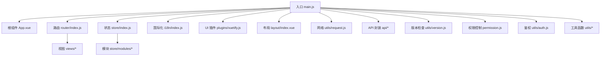
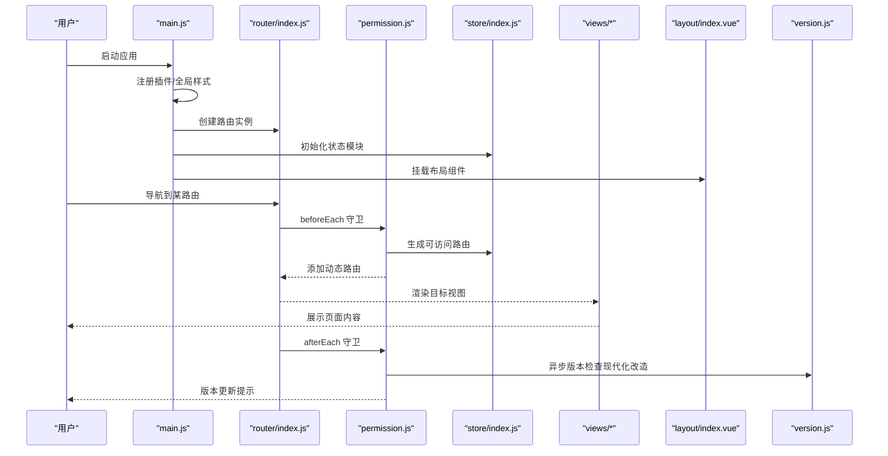
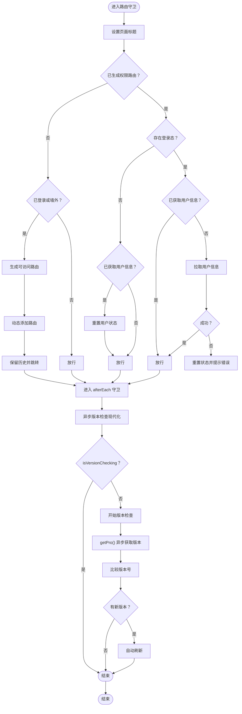
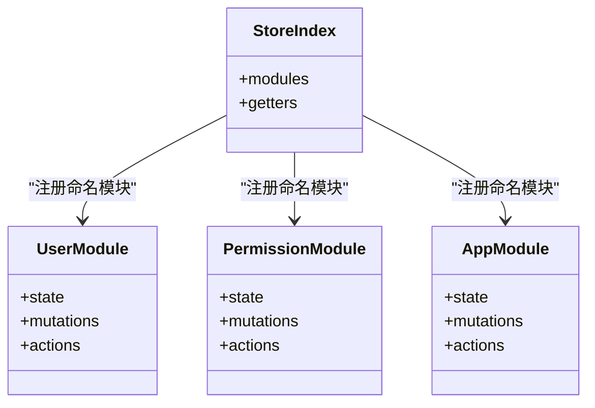
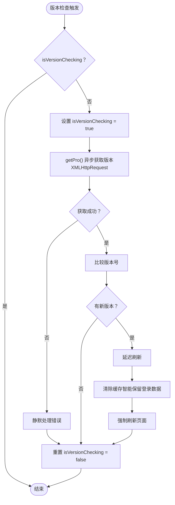
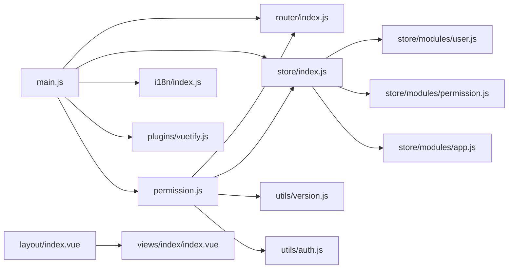

# 项目结构

<cite>
**本文引用的文件**
- [package.json](file://SpeedRunners.UI/package.json)
- [vue.config.js](file://SpeedRunners.UI/vue.config.js)
- [main.js](file://SpeedRunners.UI/src/main.js)
- [App.vue](file://SpeedRunners.UI/src/App.vue)
- [router/index.js](file://SpeedRunners.UI/src/router/index.js)
- [store/index.js](file://SpeedRunners.UI/src/store/index.js)
- [settings.js](file://SpeedRunners.UI/src/settings.js)
- [permission.js](file://SpeedRunners.UI/src/permission.js)
- [layout/index.vue](file://SpeedRunners.UI/src/layout/index.vue)
- [store/modules/user.js](file://SpeedRunners.UI/src/store/modules/user.js)
- [store/modules/app.js](file://SpeedRunners.UI/src/store/modules/app.js)
- [store/modules/permission.js](file://SpeedRunners.UI/src/store/modules/permission.js)
- [i18n/index.js](file://SpeedRunners.UI/src/i18n/index.js)
- [plugins/vuetify.js](file://SpeedRunners.UI/src/plugins/vuetify.js)
- [utils/request.js](file://SpeedRunners.UI/src/utils/request.js)
- [utils/version.js](file://SpeedRunners.UI/src/utils/version.js)
- [utils/auth.js](file://SpeedRunners.UI/src/utils/auth.js)
- [utils/get-page-title.js](file://SpeedRunners.UI/src/utils/get-page-title.js)
- [utils/validate.js](file://SpeedRunners.UI/src/utils/validate.js)
- [utils/resize.js](file://SpeedRunners.UI/src/utils/resize.js)
- [utils/index.js](file://SpeedRunners.UI/src/utils/index.js)
- [views/index/index.vue](file://SpeedRunners.UI/src/views/index/index.vue)
- [api/user.js](file://SpeedRunners.UI/src/api/user.js)
</cite>

## 更新摘要
**变更内容**
- 版本检查系统完全现代化改造，从Node.js版本迁移到纯浏览器版本
- 权限处理系统完成ES6模块化改造，统一使用import/export语法
- 新增版本检查状态管理和并发控制机制
- 完善版本检查的异步处理和错误处理逻辑
- 增加页面可见性变化时的版本检查机制
- 优化版本检查的缓存策略和性能表现

## 目录
1. [简介](#简介)
2. [项目结构](#项目结构)
3. [核心组件](#核心组件)
4. [架构总览](#架构总览)
5. [详细组件分析](#详细组件分析)
6. [依赖关系分析](#依赖关系分析)
7. [性能与构建优化](#性能与构建优化)
8. [故障排查指南](#故障排查指南)
9. [结论](#结论)
10. [附录](#附录)

## 简介
本文件系统性梳理 SpeedRunnersLab 前端项目（基于 Vue CLI 3.6.0）的工程化结构与实现细节，重点覆盖 src 目录下各核心子目录的职责与命名规范，入口文件 main.js 的初始化流程，根组件 App.vue 的设计与布局，以及 package.json、vue.config.js 的关键配置项。文档同时提供启动、开发调试与生产构建的操作指引，并通过多种图示帮助读者快速理解模块间的数据流与控制流。

**更新** 项目已完成版本检查系统的现代化改造和权限处理的ES6模块化升级，提升了代码的现代性和可维护性。

## 项目结构
前端代码位于 SpeedRunners.UI 目录，采用典型的 Vue 单页应用分层组织方式：
- src/api：封装与后端交互的接口方法
- src/assets：静态资源（图片、背景等）
- src/components：可复用的通用组件
- src/i18n：国际化语言包与初始化逻辑
- src/layout：布局容器与导航骨架
- src/plugins：第三方插件（如 Vuetify）的统一配置
- src/router：路由定义与权限控制
- src/store：Vuex 状态管理（模块化）
- src/styles：全局样式与变量
- src/utils：工具函数（请求、鉴权、尺寸适配、版本检查等）
- src/views：页面级视图组件
- 根目录下包含入口文件 main.js、根组件 App.vue、构建配置 vue.config.js、依赖清单 package.json 等

**图表来源**
- [main.js](file://SpeedRunners.UI/src/main.js#L1-L30)
- [App.vue](file://SpeedRunners.UI/src/App.vue#L1-L31)
- [router/index.js](file://SpeedRunners.UI/src/router/index.js#L1-L133)
- [store/index.js](file://SpeedRunners.UI/src/store/index.js#L1-L25)
- [i18n/index.js](file://SpeedRunners.UI/src/i18n/index.js#L1-L35)
- [plugins/vuetify.js](file://SpeedRunners.UI/src/plugins/vuetify.js#L1-L33)
- [layout/index.vue](file://SpeedRunners.UI/src/layout/index.vue#L1-L355)
- [utils/request.js](file://SpeedRunners.UI/src/utils/request.js#L1-L82)
- [utils/version.js](file://SpeedRunners.UI/src/utils/version.js#L1-L195)
- [permission.js](file://SpeedRunners.UI/src/permission.js#L1-L103)
- [utils/auth.js](file://SpeedRunners.UI/src/utils/auth.js#L1-L61)
- [utils/index.js](file://SpeedRunners.UI/src/utils/index.js#L1-L192)

**章节来源**
- [package.json](file://SpeedRunners.UI/package.json#L1-L76)
- [vue.config.js](file://SpeedRunners.UI/vue.config.js#L1-L135)

## 核心组件
- 入口与根组件
  - main.js：创建 Vue 实例，注册插件（Meta、i18n、Vuetify），注入路由与状态，挂载根组件 App.vue
  - App.vue：顶层容器，内嵌 v-app、全局描述与关键词 meta 注入、路由出口
- 路由与权限
  - router/index.js：定义常量路由与异步路由，使用 history 模式，提供重置路由能力
  - permission.js：全局前置守卫，结合 store 的 permission/user 模块生成可访问路由，处理登录态与用户信息拉取，集成现代化版本检查系统
- 状态管理
  - store/index.js：自动扫描 modules 下的命名模块，集中注册
  - user 模块：用户信息、登出、重置状态
  - permission 模块：根据角色生成路由并合并到根菜单
  - app 模块：侧边栏开关、设备类型等
- 国际化与主题
  - i18n/index.js：根据浏览器语言与本地存储初始化语言，提供中英双语
  - plugins/vuetify.js：按需引入组件与 Toast，设置语言、图标字体与主题深色模式
- 布局与页面
  - layout/index.vue：顶部栏、右侧抽屉、底部社交链接、回到顶部按钮；集成主题切换、语言切换、登录/退出
  - views/index/index.vue：首页聚合卡片、实时在线人数、玩家头像墙、图表与赞助模块
- 版本检查系统
  - utils/version.js：**现代化改造**的纯浏览器版本检查工具，使用原生XMLHttpRequest替代Node.js模块
  - permission.js：集成版本检查到路由守卫，实现异步检测与状态管理
- 鉴权系统
  - utils/auth.js：**ES6模块化改造**的鉴权工具，提供Token管理与地域判断功能

**章节来源**
- [main.js](file://SpeedRunners.UI/src/main.js#L1-L30)
- [App.vue](file://SpeedRunners.UI/src/App.vue#L1-L31)
- [router/index.js](file://SpeedRunners.UI/src/router/index.js#L1-L133)
- [permission.js](file://SpeedRunners.UI/src/permission.js#L1-L103)
- [store/index.js](file://SpeedRunners.UI/src/store/index.js#L1-L25)
- [store/modules/user.js](file://SpeedRunners.UI/src/store/modules/user.js#L1-L88)
- [store/modules/permission.js](file://SpeedRunners.UI/src/store/modules/permission.js#L1-L42)
- [store/modules/app.js](file://SpeedRunners.UI/src/store/modules/app.js#L1-L48)
- [i18n/index.js](file://SpeedRunners.UI/src/i18n/index.js#L1-L35)
- [plugins/vuetify.js](file://SpeedRunners.UI/src/plugins/vuetify.js#L1-L33)
- [layout/index.vue](file://SpeedRunners.UI/src/layout/index.vue#L1-L355)
- [views/index/index.vue](file://SpeedRunners.UI/src/views/index/index.vue#L1-L84)
- [utils/version.js](file://SpeedRunners.UI/src/utils/version.js#L1-L195)
- [utils/auth.js](file://SpeedRunners.UI/src/utils/auth.js#L1-L61)

## 架构总览
下图展示从入口到页面渲染的关键调用链，体现插件注册、路由守卫、状态生成、现代化版本检查与页面渲染的协作关系。

**图表来源**
- [main.js](file://SpeedRunners.UI/src/main.js#L1-L30)
- [router/index.js](file://SpeedRunners.UI/src/router/index.js#L118-L133)
- [permission.js](file://SpeedRunners.UI/src/permission.js#L13-L103)
- [store/index.js](file://SpeedRunners.UI/src/store/index.js#L1-L25)
- [layout/index.vue](file://SpeedRunners.UI/src/layout/index.vue#L1-L355)
- [utils/version.js](file://SpeedRunners.UI/src/utils/version.js#L17-L45)

## 详细组件分析

### 入口与初始化流程（main.js）
- 职责与流程
  - 引入全局样式与图标字体
  - 注入 vue-meta、i18n、Vuetify
  - 引入权限控制与图标库
  - 创建 Vue 实例，注入 router、store、i18n、vuetify，并渲染 App.vue
- 关键点
  - 生产提示关闭
  - 全局 keywords 注入，便于 SEO
  - 统一 UI 框架与样式入口

**章节来源**
- [main.js](file://SpeedRunners.UI/src/main.js#L1-L30)

### 根组件（App.vue）
- 设计要点
  - v-app 包裹，确保 Vuetify 样式生效
  - 使用 vue-meta 注入页面描述与关键词
  - 路由出口承载页面视图
- SEO 友好
  - 动态 meta 注入，提升搜索引擎识别度

**章节来源**
- [App.vue](file://SpeedRunners.UI/src/App.vue#L1-L31)

### 路由与权限（router/index.js 与 permission.js）
- 路由设计
  - constantRoutes：无需权限的基础路由（404、首页、榜单、MOD、搜索、登录、日志）
  - asyncRoutes：按权限动态加载的路由（如社区广场）
  - add404Router：兜底 404 路由，必须置于末位
  - history 模式 + 滚动行为归零
- 权限控制
  - permission.js 在 beforeEach 中：
    - 设置页面标题
    - 判断是否已生成权限路由
    - 若未生成：根据登录态或地域判定生成并动态添加
    - 登录态缺失时尝试拉取用户信息，异常则重置状态并提示
  - afterEach 中进行现代化版本兼容检查（通过 utils/version）
  - **新增**：版本检查状态管理，防止并发检查
  - **新增**：页面可见性变化时的版本检查机制
  - **新增**：ES6模块化导入导出语法

**图表来源**
- [permission.js](file://SpeedRunners.UI/src/permission.js#L16-L103)
- [router/index.js](file://SpeedRunners.UI/src/router/index.js#L96-L133)
- [store/modules/permission.js](file://SpeedRunners.UI/src/store/modules/permission.js#L21-L34)
- [store/modules/user.js](file://SpeedRunners.UI/src/store/modules/user.js#L37-L80)
- [utils/version.js](file://SpeedRunners.UI/src/utils/version.js#L17-L45)

**章节来源**
- [router/index.js](file://SpeedRunners.UI/src/router/index.js#L1-L133)
- [permission.js](file://SpeedRunners.UI/src/permission.js#L1-L103)

### 状态管理（store/index.js 与模块）
- 自动化模块注册
  - 使用 require.context 扫描 modules 下的命名模块，统一注册为命名空间模块
- 核心模块
  - user：用户信息拉取、登出、重置状态
  - permission：根据 isPlayer 生成路由并合并至根菜单
  - app：侧边栏开关、设备类型

**图表来源**
- [store/index.js](file://SpeedRunners.UI/src/store/index.js#L1-L25)
- [store/modules/user.js](file://SpeedRunners.UI/src/store/modules/user.js#L1-L88)
- [store/modules/permission.js](file://SpeedRunners.UI/src/store/modules/permission.js#L1-L42)
- [store/modules/app.js](file://SpeedRunners.UI/src/store/modules/app.js#L1-L48)

**章节来源**
- [store/index.js](file://SpeedRunners.UI/src/store/index.js#L1-L25)
- [store/modules/user.js](file://SpeedRunners.UI/src/store/modules/user.js#L1-L88)
- [store/modules/permission.js](file://SpeedRunners.UI/src/store/modules/permission.js#L1-L42)
- [store/modules/app.js](file://SpeedRunners.UI/src/store/modules/app.js#L1-L48)

### 国际化与主题（i18n/index.js 与 plugins/vuetify.js）
- i18n
  - 根据浏览器语言与本地存储确定当前语言
  - 提供中英双语包，支持运行时切换
- Vuetify
  - 按需引入组件与 Toast
  - 设置语言、图标字体（Material Design Icons）、主题深色模式
  - 读取本地主题偏好

**章节来源**
- [i18n/index.js](file://SpeedRunners.UI/src/i18n/index.js#L1-L35)
- [plugins/vuetify.js](file://SpeedRunners.UI/src/plugins/vuetify.js#L1-L33)

### 布局与页面（layout/index.vue 与 views/index/index.vue）
- layout/index.vue
  - 顶部栏：Logo、主题切换、语言切换、主导航标签
  - 右侧抽屉：头像/昵称、侧边导航、隐私设置入口、登出
  - 底部：社交链接、版权信息、回到顶部
  - 集成主题、语言、登录/退出、滚动回到顶部等交互
- views/index/index.vue
  - 首页聚合卡片：在线人数、玩家头像墙、图表、赞助
  - 通过 API 拉取数据并在 mounted 生命周期中更新

**章节来源**
- [layout/index.vue](file://SpeedRunners.UI/src/layout/index.vue#L1-L355)
- [views/index/index.vue](file://SpeedRunners.UI/src/views/index/index.vue#L1-L84)

### 网络请求与 API 封装（utils/request.js 与 api/user.js）
- utils/request.js
  - 基于 axios 创建服务实例，设置基础 URL、超时
  - 请求拦截器：注入语言与令牌
  - 响应拦截器：统一处理 token 更新、业务码校验与错误提示
- api/user.js
  - 对用户相关接口进行封装，统一通过 request 发起请求

**章节来源**
- [utils/request.js](file://SpeedRunners.UI/src/utils/request.js#L1-L82)
- [api/user.js](file://SpeedRunners.UI/src/api/user.js#L1-L77)

### 版本检查系统（utils/version.js 与 permission.js 集成）
**更新** 版本检查系统已完成完全现代化改造，从Node.js版本迁移到纯浏览器版本：

- **现代化核心功能**
  - 版本号生成：在构建时生成唯一版本戳，解决浏览器缓存问题
  - 版本获取：**使用原生XMLHttpRequest替代Node.js的fs模块**，异步获取服务器版本号，支持防CDN缓存
  - 版本比较：对比本地与服务器版本号，判断是否需要更新
  - 自动刷新：检测到新版本后延迟自动刷新页面
- **ES6模块化改造**
  - 使用export default和具名导出语法
  - 支持按需导入特定函数
- **路由守卫集成**
  - 在 afterEach 钩子中进行异步版本检查
  - 使用 isVersionChecking 状态变量防止并发检查
  - 页面可见性变化时的版本检查机制
  - 静默错误处理，不影响用户体验
- **缓存策略优化**
  - 使用localStorage存储版本号
  - 首次访问标记机制
  - 智能缓存清理策略
- **错误处理与重试机制**
  - 网络请求失败时自动重试
  - 解析版本数据失败时抛出错误
  - 静默处理版本检查失败，避免影响主流程

**图表来源**
- [permission.js](file://SpeedRunners.UI/src/permission.js#L65-L103)
- [utils/version.js](file://SpeedRunners.UI/src/utils/version.js#L17-L45)

**章节来源**
- [utils/version.js](file://SpeedRunners.UI/src/utils/version.js#L1-L195)
- [permission.js](file://SpeedRunners.UI/src/permission.js#L1-L103)

### 鉴权系统（utils/auth.js ES6模块化改造）
**更新** 鉴权系统已完成ES6模块化改造：

- **ES6模块化语法**
  - 使用export default导出默认函数
  - 使用具名导出语法（export function）
  - 支持按需导入特定函数
- **Token管理**
  - getToken()：获取JWT Token
  - setToken()：设置JWT Token，支持过期时间配置
  - removeToken()：移除JWT Token
- **地域判断**
  - isInChina()：判断用户是否在中国大陆
  - 使用XMLHttpRequest调用Facebook Graph API
  - 超时2秒，提高判断稳定性
  - 支持多种网络异常场景处理
- **Steam登录**
  - goLoginURL()：生成Steam OpenID登录URL
  - 自动拼接回调地址

**章节来源**
- [utils/auth.js](file://SpeedRunners.UI/src/utils/auth.js#L1-L61)

## 依赖关系分析
- 入口依赖
  - main.js 依赖 router、store、i18n、vuetify、permission、icons、App.vue
- 路由与权限耦合
  - permission.js 依赖 router、store 的 permission/user 模块、utils/version、utils/auth
- 状态模块内聚
  - store/index.js 通过 require.context 自动聚合 modules
- 视图与布局
  - layout/index.vue 作为根布局，承载 views 下的页面组件
- 插件与全局样式
  - main.js 注入全局样式、图标、Meta、i18n、Vuetify
- 版本检查系统
  - permission.js 集成现代化版本检查功能，utils/version 提供核心 API
- 工具函数模块化
  - 所有工具函数均采用ES6模块化语法，支持按需导入

**图表来源**
- [main.js](file://SpeedRunners.UI/src/main.js#L1-L30)
- [router/index.js](file://SpeedRunners.UI/src/router/index.js#L1-L133)
- [store/index.js](file://SpeedRunners.UI/src/store/index.js#L1-L25)
- [i18n/index.js](file://SpeedRunners.UI/src/i18n/index.js#L1-L35)
- [plugins/vuetify.js](file://SpeedRunners.UI/src/plugins/vuetify.js#L1-L33)
- [permission.js](file://SpeedRunners.UI/src/permission.js#L1-L103)
- [utils/version.js](file://SpeedRunners.UI/src/utils/version.js#L1-L195)
- [utils/auth.js](file://SpeedRunners.UI/src/utils/auth.js#L1-L61)
- [store/modules/user.js](file://SpeedRunners.UI/src/store/modules/user.js#L1-L88)
- [store/modules/permission.js](file://SpeedRunners.UI/src/store/modules/permission.js#L1-L42)
- [store/modules/app.js](file://SpeedRunners.UI/src/store/modules/app.js#L1-L48)
- [layout/index.vue](file://SpeedRunners.UI/src/layout/index.vue#L1-L355)
- [views/index/index.vue](file://SpeedRunners.UI/src/views/index/index.vue#L1-L84)

## 性能与构建优化
- 路径别名与外部依赖
  - 配置 @ 指向 src，减少相对路径书写成本
  - 外部依赖 jquery 以 CDN 方式引入，避免打包体积增加
- 开发体验
  - publicPath 默认 "/"，outputDir 为 dist，assetsDir 为 static
  - devServer 支持端口配置与错误覆盖显示
- Webpack 优化
  - 删除 preload/prefetch 插件（待验证）
  - SVG 图标使用 svg-sprite-loader，统一管理
  - 保留空白字符以提升可读性
  - 开发环境使用 cheap-source-map
  - 生产环境启用 ScriptExtHtmlWebpackPlugin 内联运行时脚本
  - splitChunks 拆分第三方库与公共组件，runtimeChunk 单独提取
- 语言与图标
  - transpileDependencies 包含 vuetify，确保按需编译
- **新增**：构建时自动生成版本文件，解决缓存问题
  - 在构建过程中自动创建 verify.json 版本文件
- **新增**：ES6模块化优化
  - 支持Tree Shaking，按需导入减少打包体积
  - 提升代码可维护性和开发体验

**章节来源**
- [vue.config.js](file://SpeedRunners.UI/vue.config.js#L23-L135)
- [utils/version.js](file://SpeedRunners.UI/src/utils/version.js#L20-L26)

## 故障排查指南
- 登录态失效或被顶号
  - 响应拦截器检测到特定业务码时触发用户状态重置并刷新页面
  - 建议在开发阶段关注网络面板与控制台错误提示
- 路由无法访问或 404
  - 确认动态路由已通过 permission/generateRoutes 成功添加
  - 确保 404 路由位于路由表末尾
- 主题与语言不持久
  - 主题偏好与语言偏好分别写入 localStorage，刷新后仍生效
- 构建产物缓存问题
  - 构建前生成版本戳，有助于解决浏览器缓存导致的更新不生效
- **新增**：版本检查问题排查
  - 检查 isVersionChecking 状态变量是否正确重置
  - 确认服务器 verify.json 文件可访问且格式正确
  - 验证网络请求是否被 CDN 缓存
  - 查看控制台错误日志，确认重试机制正常工作
  - **新增**：检查XMLHttpRequest请求是否成功
  - **新增**：验证localStorage缓存是否正常工作
- **新增**：ES6模块化问题排查
  - 确认import/export语法正确
  - 检查模块路径是否正确
  - 验证具名导出与默认导出的使用

**章节来源**
- [utils/request.js](file://SpeedRunners.UI/src/utils/request.js#L44-L79)
- [permission.js](file://SpeedRunners.UI/src/permission.js#L13-L103)
- [store/modules/user.js](file://SpeedRunners.UI/src/store/modules/user.js#L62-L80)
- [utils/version.js](file://SpeedRunners.UI/src/utils/version.js#L53-L100)
- [utils/auth.js](file://SpeedRunners.UI/src/utils/auth.js#L25-L61)
- [vue.config.js](file://SpeedRunners.UI/vue.config.js#L4-L8)

## 结论
本项目遵循 Vue CLI 的约定式工程化实践，通过模块化的 store、清晰的路由与权限控制、完善的国际化与主题体系，以及合理的构建优化策略，实现了可维护、可扩展的前端架构。入口文件 main.js 作为控制中枢，串联起路由、状态、国际化与 UI 插件；布局组件与页面组件职责明确，配合 API 封装与网络拦截器，形成完整的数据流闭环。

**更新后的版本检查系统**进一步增强了应用的健壮性和用户体验，通过现代化的纯浏览器版本检查、ES6模块化改造、状态管理和错误处理机制，确保用户始终能够获取到最新的应用版本，同时不影响正常的页面渲染和用户操作。ES6模块化改造提升了代码的现代性和可维护性，支持Tree Shaking优化，减少了打包体积。

## 附录

### 目录职责与命名规范
- api：按功能域划分（asset、rank、steam、user），导出函数封装请求
- assets：静态资源（图片、背景、图标素材）
- components：通用组件（如 SvgIcon、Odometer、XCard 等）
- i18n：语言包与初始化逻辑（lang 目录存放 zh/en JSON）
- layout：布局容器与导航骨架（index.vue 为主布局）
- plugins：第三方插件统一配置（如 vuetify）
- router：路由定义（常量路由、异步路由、重置路由）
- store：模块化状态管理（modules 下按领域拆分）
- styles：全局样式与变量（SCSS）
- utils：**ES6模块化改造**的工具函数（auth、request、resize、validate、version、getPageTitle、index）
- views：页面级视图（按功能域划分子目录）

**章节来源**
- [package.json](file://SpeedRunners.UI/package.json#L1-L76)
- [vue.config.js](file://SpeedRunners.UI/vue.config.js#L1-L135)

### 启动与构建步骤
- 安装依赖
  - 使用包管理器安装依赖（建议使用与项目引擎匹配的 Node 版本）
- 开发调试
  - 开发环境：执行开发命令，自动打开浏览器
  - 环境变量：可通过 .env.* 文件配置 API 基础地址等
- 预览
  - 预览构建产物（非生产部署）
- 生产构建
  - 生产构建：输出 dist 目录，静态资源位于 static 子目录
  - 阶段构建：支持 staging 模式
  - **新增**：构建时自动生成版本文件，解决缓存问题
- 代码质量
  - ESLint：对 .js/.vue 进行语法检查
  - 单元测试：Jest 测试套件
- **新增**：ES6模块化支持
  - 支持现代JavaScript语法特性
  - Tree Shaking优化打包体积

**章节来源**
- [package.json](file://SpeedRunners.UI/package.json#L6-L13)
- [vue.config.js](file://SpeedRunners.UI/vue.config.js#L45-L57)
- [utils/version.js](file://SpeedRunners.UI/src/utils/version.js#L20-L26)