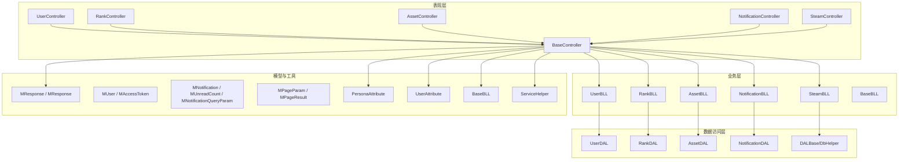
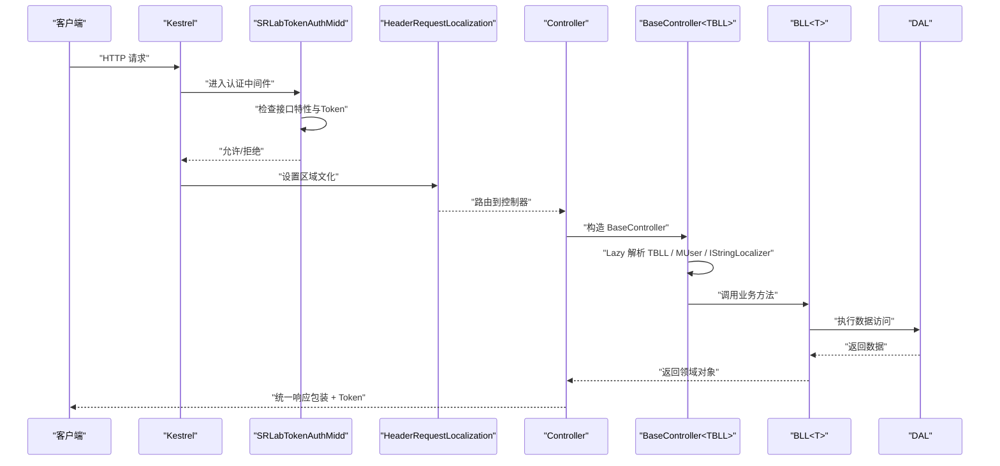
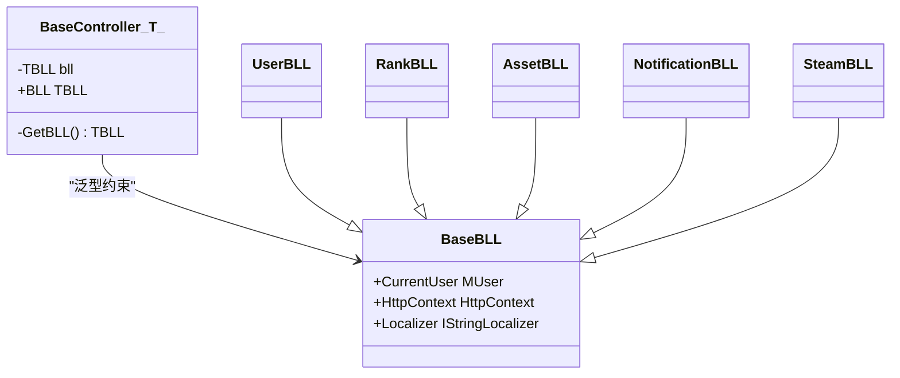
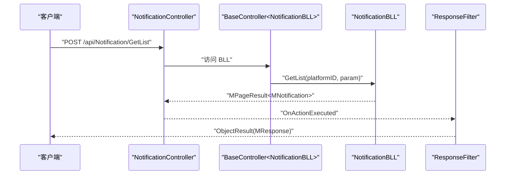
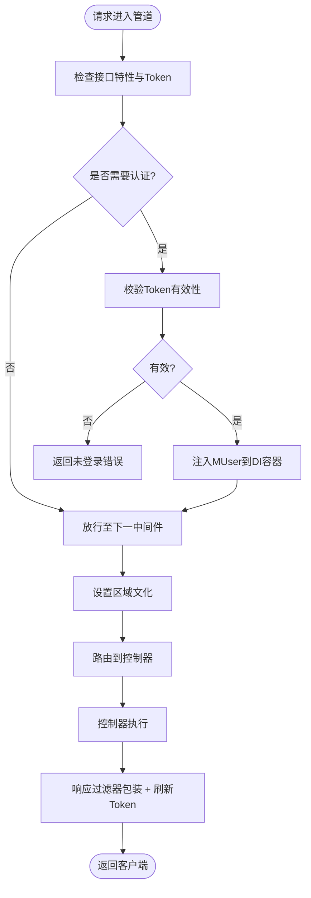
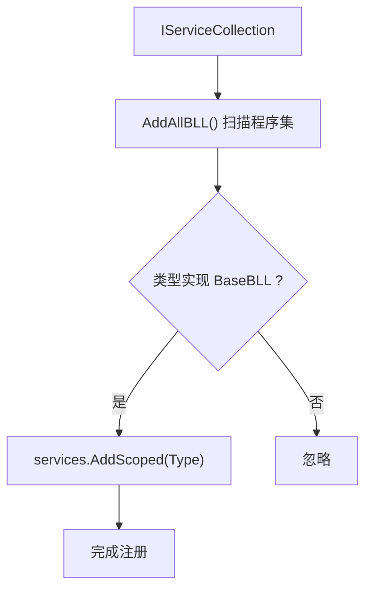
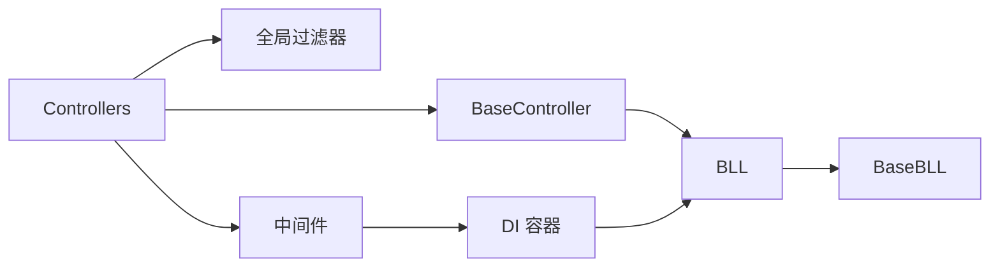

# API 架构设计

<cite>
**本文档引用的文件**
- [Program.cs](file://SpeedRunners.API/SpeedRunners/Program.cs)
- [Startup.cs](file://SpeedRunners.API/SpeedRunners/Startup.cs)
- [BaseController.cs](file://SpeedRunners.API/SpeedRunners/Controllers/BaseController.cs)
- [UserController.cs](file://SpeedRunners.API/SpeedRunners/Controllers/UserController.cs)
- [RankController.cs](file://SpeedRunners.API/SpeedRunners/Controllers/RankController.cs)
- [AssetController.cs](file://SpeedRunners.API/SpeedRunners/Controllers/AssetController.cs)
- [SteamController.cs](file://SpeedRunners.API/SpeedRunners/Controllers/SteamController.cs)
- [NotificationController.cs](file://SpeedRunners.API/SpeedRunners/Controllers/NotificationController.cs)
- [GlobalExceptionsFilter.cs](file://SpeedRunners.API/SpeedRunners/Filter/GlobalExceptionsFilter.cs)
- [ResponseFilter.cs](file://SpeedRunners.API/SpeedRunners/Filter/ResponseFilter.cs)
- [SRLabTokenAuthMidd.cs](file://SpeedRunners.API/SpeedRunners/Middleware/SRLabTokenAuthMidd.cs)
- [LocaleHeaderRequestCultureProvider.cs](file://SpeedRunners.API/SpeedRunners/Service/LocaleHeaderRequestCultureProvider.cs)
- [ServiceHelper.cs](file://SpeedRunners.API/SpeedRunners/Service/ServiceHelper.cs)
- [MResponse.cs](file://SpeedRunners.API/SpeedRunners.Model/MResponse.cs)
- [BaseBLL.cs](file://SpeedRunners.API/SpeedRunners.Utils/BaseBLL.cs)
- [PersonaAttribute.cs](file://SpeedRunners.API/SpeedRunners.Model/PersonaAttribute.cs)
- [UserAttribute.cs](file://SpeedRunners.API/SpeedRunners.Model/UserAttribute.cs)
- [NotificationBLL.cs](file://SpeedRunners.API/SpeedRunners.BLL/NotificationBLL.cs)
- [NotificationDAL.cs](file://SpeedRunners.API/SpeedRunners.DAL/NotificationDAL.cs)
- [MNotification.cs](file://SpeedRunners.API/SpeedRunners.Model/User/MNotification.cs)
- [MPageParam.cs](file://SpeedRunners.API/SpeedRunners.Model/MPageParam.cs)
- [MPageResult.cs](file://SpeedRunners.API/SpeedRunners.Model/MPageResult.cs)
</cite>

## 更新摘要
**所做更改**
- 新增通知系统数据模型说明，包括 MNotification、MUnreadCount、MNotificationQueryParam 等模型定义
- 更新通知系统控制器和业务逻辑的详细说明
- 完善通知系统的数据库访问层实现细节
- 扩展模型层文档以包含通知系统的完整数据结构

## 目录
1. [引言](#引言)
2. [项目结构](#项目结构)
3. [核心组件](#核心组件)
4. [架构总览](#架构总览)
5. [组件详解](#组件详解)
6. [依赖关系分析](#依赖关系分析)
7. [性能与可维护性](#性能与可维护性)
8. [故障排查指南](#故障排查指南)
9. [结论](#结论)
10. [附录](#附录)

## 引言
本文件面向 SpeedRunnersLab 的 API 层，系统化阐述基于 ASP.NET Core MVC 的分层架构与设计原则，重点覆盖：
- 表现层（Controllers）、业务层（BLL）、数据访问层（DAL）的职责边界与协作方式
- BaseController 基类的泛型依赖注入与懒加载模式
- RESTful 接口设计、HTTP 方法语义、URL 路径规范与统一响应/状态码策略
- 中间件管道、过滤器机制与全局异常处理
- 架构图与组件交互示例，帮助开发者快速理解整体技术决策

**更新** 新增通知系统的完整数据模型说明，包括消息通知实体、查询参数和统计模型，完善系统的消息推送功能。

## 项目结构
API 工程采用典型的三层分层与控制器-业务-模型-工具的模块化组织：
- 控制器层：按领域划分（用户、排行、资源、通知、Steam），统一继承 BaseController
- 业务层：封装领域逻辑，调用 DAL 完成数据操作
- 数据访问层：封装数据库访问细节
- 模型层：统一响应体、领域模型与元数据（如权限特性）
- 工具层：通用工具、BLL 基类、扩展方法等
- 启动与中间件：注册服务、构建管道、认证与本地化

**图表来源**
- [BaseController.cs](file://SpeedRunners.API/SpeedRunners/Controllers/BaseController.cs#L10-L24)
- [UserController.cs](file://SpeedRunners.API/SpeedRunners/Controllers/UserController.cs#L12-L16)
- [RankController.cs](file://SpeedRunners.API/SpeedRunners/Controllers/RankController.cs#L13-L17)
- [AssetController.cs](file://SpeedRunners.API/SpeedRunners/Controllers/AssetController.cs#L14-L18)
- [SteamController.cs](file://SpeedRunners.API/SpeedRunners/Controllers/SteamController.cs#L10-L13)
- [NotificationController.cs](file://SpeedRunners.API/SpeedRunners/Controllers/NotificationController.cs#L10-L48)
- [BaseBLL.cs](file://SpeedRunners.API/SpeedRunners.Utils/BaseBLL.cs#L7-L15)
- [MResponse.cs](file://SpeedRunners.API/SpeedRunners.Model/MResponse.cs#L3-L27)
- [MNotification.cs](file://SpeedRunners.API/SpeedRunners.Model/User/MNotification.cs#L24-L90)
- [MPageParam.cs](file://SpeedRunners.API/SpeedRunners.Model/MPageParam.cs#L3-L13)
- [MPageResult.cs](file://SpeedRunners.API/SpeedRunners.Model/MPageResult.cs#L7-L11)
- [PersonaAttribute.cs](file://SpeedRunners.API/SpeedRunners.Model/PersonaAttribute.cs#L9-L11)
- [UserAttribute.cs](file://SpeedRunners.API/SpeedRunners.Model/UserAttribute.cs#L9-L11)
- [ServiceHelper.cs](file://SpeedRunners.API/SpeedRunners/Service/ServiceHelper.cs#L14-L24)

**章节来源**
- [Program.cs](file://SpeedRunners.API/SpeedRunners/Program.cs#L14-L30)
- [Startup.cs](file://SpeedRunners.API/SpeedRunners/Startup.cs#L33-L62)

## 核心组件
- BaseController<TBLL>：控制器基类，通过泛型约束确保注入的业务对象类型安全；内部使用 Lazy 惰性解析服务，避免重复实例化；同时注入当前用户上下文、本地化器与 HttpContext，便于在业务层直接使用。
- 业务层（BaseBLL）：承载用户上下文、HTTP 上下文与本地化器，作为各领域 BLL 的抽象基类。
- 统一响应体（MResponse / MResponse<T>）：标准化接口返回结构，包含状态码、消息与令牌字段，并提供静态工厂方法。
- 权限特性（PersonaAttribute / UserAttribute）：用于标记接口是否需要登录或仅需"人格化"（未登录返回公共数据，登录返回定制数据）。

**更新** 新增通知系统的完整数据模型，包括消息通知实体、查询参数和统计模型，完善系统的消息推送功能。

**章节来源**
- [BaseController.cs](file://SpeedRunners.API/SpeedRunners/Controllers/BaseController.cs#L10-L24)
- [BaseBLL.cs](file://SpeedRunners.API/SpeedRunners.Utils/BaseBLL.cs#L7-L15)
- [MResponse.cs](file://SpeedRunners.API/SpeedRunners.Model/MResponse.cs#L3-L41)
- [PersonaAttribute.cs](file://SpeedRunners.API/SpeedRunners.Model/PersonaAttribute.cs#L9-L11)
- [UserAttribute.cs](file://SpeedRunners.API/SpeedRunners.Model/UserAttribute.cs#L9-L11)

## 架构总览
ASP.NET Core 管道由 Startup.ConfigureServices 注册服务，再在 Configure 中装配中间件与路由。控制器通过 BaseController 注入对应 BLL，BLL 再调用 DAL 完成持久化。全局过滤器负责统一响应包装与 Token 刷新，全局异常过滤器负责生产环境异常兜底。

**图表来源**
- [Startup.cs](file://SpeedRunners.API/SpeedRunners/Startup.cs#L65-L84)
- [SRLabTokenAuthMidd.cs](file://SpeedRunners.API/SpeedRunners/Middleware/SRLabTokenAuthMidd.cs#L31-L47)
- [BaseController.cs](file://SpeedRunners.API/SpeedRunners/Controllers/BaseController.cs#L14-L23)
- [ResponseFilter.cs](file://SpeedRunners.API/SpeedRunners/Filter/ResponseFilter.cs#L24-L50)

**章节来源**
- [Startup.cs](file://SpeedRunners.API/SpeedRunners/Startup.cs#L33-L62)
- [Program.cs](file://SpeedRunners.API/SpeedRunners/Program.cs#L14-L30)

## 组件详解

### BaseController 泛型基类与懒加载
- 设计要点
  - 泛型约束 TBLL : BaseBLL，保证注入的服务类型安全
  - 使用 Lazy<T> 从 RequestServices 惰性解析，避免重复创建与生命周期问题
  - 在解析时注入当前用户上下文、HttpContext、本地化器，使业务层可直接使用
- 适用场景
  - 所有控制器均继承 BaseController<TBLL>，减少重复代码
  - 业务层无需感知 DI 容器，专注领域逻辑

**图表来源**
- [BaseController.cs](file://SpeedRunners.API/SpeedRunners/Controllers/BaseController.cs#L10-L24)
- [BaseBLL.cs](file://SpeedRunners.API/SpeedRunners.Utils/BaseBLL.cs#L7-L15)

**章节来源**
- [BaseController.cs](file://SpeedRunners.API/SpeedRunners/Controllers/BaseController.cs#L10-L24)

### 控制器层（RESTful 设计）
- URL 路径规范
  - 采用"api/[controller]/[action]"命名约定，清晰表达资源与动作
- HTTP 方法语义
  - GET：查询列表/详情/统计
  - POST：提交数据/变更状态/上传下载
  - 返回值：统一由 ResponseFilter 包装为 MResponse 或 MResponse<T>
- 示例
  - 用户：登录、登出、隐私设置、状态/等级类型设置
  - 排行：排行榜、图表、赞助商、参与状态
  - 资源：上传凭证、下载地址、模组增删改查
  - 通知：获取消息列表、未读数量、标记已读
  - Steam：玩家搜索、在线人数

**更新** 新增通知系统的 RESTful 接口设计，完善控制器层功能。

**图表来源**
- [NotificationController.cs](file://SpeedRunners.API/SpeedRunners/Controllers/NotificationController.cs#L17-L20)
- [ResponseFilter.cs](file://SpeedRunners.API/SpeedRunners/Filter/ResponseFilter.cs#L24-L50)

**章节来源**
- [UserController.cs](file://SpeedRunners.API/SpeedRunners/Controllers/UserController.cs#L10-L58)
- [RankController.cs](file://SpeedRunners.API/SpeedRunners/Controllers/RankController.cs#L11-L48)
- [AssetController.cs](file://SpeedRunners.API/SpeedRunners/Controllers/AssetController.cs#L12-L48)
- [SteamController.cs](file://SpeedRunners.API/SpeedRunners/Controllers/SteamController.cs#L8-L28)
- [NotificationController.cs](file://SpeedRunners.API/SpeedRunners/Controllers/NotificationController.cs#L8-L48)

### 中间件与过滤器机制
- 自定义认证中间件
  - 读取请求头中的 srlab-token，结合接口特性判断是否需要认证
  - 认证失败时返回统一错误响应；认证成功则将用户信息注入 MUser 并放行
- 本地化中间件
  - 从请求头 locale 切换语言
- 全局过滤器
  - 响应过滤器：统一包装响应、注入 Token（按接口特性决定刷新策略）
  - 全局异常过滤器：生产环境统一返回错误码与消息，并记录日志

**图表来源**
- [SRLabTokenAuthMidd.cs](file://SpeedRunners.API/SpeedRunners/Middleware/SRLabTokenAuthMidd.cs#L31-L101)
- [ResponseFilter.cs](file://SpeedRunners.API/SpeedRunners/Filter/ResponseFilter.cs#L57-L83)
- [LocaleHeaderRequestCultureProvider.cs](file://SpeedRunners.API/SpeedRunners/Service/LocaleHeaderRequestCultureProvider.cs#L9-L14)

**章节来源**
- [SRLabTokenAuthMidd.cs](file://SpeedRunners.API/SpeedRunners/Middleware/SRLabTokenAuthMidd.cs#L18-L102)
- [ResponseFilter.cs](file://SpeedRunners.API/SpeedRunners/Filter/ResponseFilter.cs#L14-L113)
- [GlobalExceptionsFilter.cs](file://SpeedRunners.API/SpeedRunners/Filter/GlobalExceptionsFilter.cs#L16-L51)
- [LocaleHeaderRequestCultureProvider.cs](file://SpeedRunners.API/SpeedRunners/Service/LocaleHeaderRequestCultureProvider.cs#L7-L16)

### 服务注册与批量注入
- 批量注册 BLL：通过反射扫描程序集，将所有实现 BaseBLL 的类以 Scoped 注册
- 注册全局配置、本地化、跨域、JSON 序列化、异常与响应过滤器

**图表来源**
- [ServiceHelper.cs](file://SpeedRunners.API/SpeedRunners/Service/ServiceHelper.cs#L14-L24)

**章节来源**
- [Startup.cs](file://SpeedRunners.API/SpeedRunners/Startup.cs#L33-L62)
- [ServiceHelper.cs](file://SpeedRunners.API/SpeedRunners/Service/ServiceHelper.cs#L8-L26)

### 通知系统控制器
- 功能概述
  - 提供消息通知的完整 CRUD 操作
  - 支持未读消息统计和批量标记已读
  - 集成消息去重机制，防止重复通知
- 接口设计
  - GetList：POST 获取消息列表，支持分页查询
  - GetUnreadCount：GET 获取未读消息数量
  - MarkAsRead：POST 标记消息为已读

**更新** 新增通知系统控制器作为独立的控制器组件，完善消息推送功能。

**章节来源**
- [NotificationController.cs](file://SpeedRunners.API/SpeedRunners/Controllers/NotificationController.cs#L10-L48)
- [NotificationBLL.cs](file://SpeedRunners.API/SpeedRunners.BLL/NotificationBLL.cs#L9-L106)
- [NotificationDAL.cs](file://SpeedRunners.API/SpeedRunners.DAL/NotificationDAL.cs#L10-L154)

### 通知系统数据模型
- MNotification：消息通知实体，包含发送方信息、消息类型、关联内容和状态字段
- MNotificationQueryParam：消息查询参数，支持类型过滤和已读状态过滤
- MUnreadCount：未读消息数量统计，包含不同类型消息的统计信息
- MMarkReadParam：标记已读参数，支持批量标记和类型过滤

**新增** 通知系统完整的数据模型定义，包括实体、查询参数和统计模型。

**章节来源**
- [MNotification.cs](file://SpeedRunners.API/SpeedRunners.Model/User/MNotification.cs#L24-L143)
- [MPageParam.cs](file://SpeedRunners.API/SpeedRunners.Model/MPageParam.cs#L3-L13)
- [MPageResult.cs](file://SpeedRunners.API/SpeedRunners.Model/MPageResult.cs#L7-L11)

### 通知系统业务逻辑层
- 功能概述
  - 提供消息列表查询、未读统计和标记已读功能
  - 实现消息去重机制，防止24小时内重复通知
  - 支持回复消息和点赞消息两种类型的通知
- 核心方法
  - GetList：根据接收者ID和查询参数获取消息列表
  - GetUnreadCount：统计未读消息数量
  - MarkAsRead：批量标记消息为已读
  - AddReplyNotification：添加回复消息通知
  - AddLikeNotification：添加点赞消息通知

**更新** 新增通知系统业务逻辑层的详细说明，包括消息去重和清理机制。

**章节来源**
- [NotificationBLL.cs](file://SpeedRunners.API/SpeedRunners.BLL/NotificationBLL.cs#L9-L106)

### 通知系统数据访问层
- 功能概述
  - 实现消息的增删改查操作
  - 支持分页查询和条件过滤
  - 提供未读统计和消息清理功能
- 核心方法
  - GetList：根据接收者ID和查询参数获取消息列表
  - GetUnreadCount：统计未读消息数量
  - Add：添加新消息
  - MarkAsRead：批量标记已读
  - DeleteExpired：清理30天前的过期消息
  - Exists：检查消息是否存在（防重复）

**更新** 新增通知系统数据访问层的详细实现，包括SQL查询和参数绑定。

**章节来源**
- [NotificationDAL.cs](file://SpeedRunners.API/SpeedRunners.DAL/NotificationDAL.cs#L10-L154)

## 依赖关系分析
- 控制器依赖 BaseController<TBLL>，间接依赖对应 BLL
- BLL 继承 BaseBLL，持有 CurrentUser、HttpContext、Localizer
- 控制器与过滤器、中间件通过 ASP.NET Core 管道解耦
- 服务注册通过扩展方法集中管理，降低分散配置风险

**图表来源**
- [BaseController.cs](file://SpeedRunners.API/SpeedRunners/Controllers/BaseController.cs#L10-L24)
- [BaseBLL.cs](file://SpeedRunners.API/SpeedRunners.Utils/BaseBLL.cs#L7-L15)
- [ResponseFilter.cs](file://SpeedRunners.API/SpeedRunners/Filter/ResponseFilter.cs#L14-L22)
- [SRLabTokenAuthMidd.cs](file://SpeedRunners.API/SpeedRunners/Middleware/SRLabTokenAuthMidd.cs#L24-L29)

**章节来源**
- [BaseController.cs](file://SpeedRunners.API/SpeedRunners/Controllers/BaseController.cs#L10-L24)
- [BaseBLL.cs](file://SpeedRunners.API/SpeedRunners.Utils/BaseBLL.cs#L7-L15)
- [ResponseFilter.cs](file://SpeedRunners.API/SpeedRunners/Filter/ResponseFilter.cs#L14-L22)
- [SRLabTokenAuthMidd.cs](file://SpeedRunners.API/SpeedRunners/Middleware/SRLabTokenAuthMidd.cs#L24-L29)

## 性能与可维护性
- 惰性注入（Lazy）降低初始化成本，避免不必要的对象创建
- 批量注册 BLL 减少重复样板代码，提升可维护性
- 统一响应包装与异常处理，简化客户端适配与排障
- 通过特性标记接口权限，明确边界，便于横向治理
- 新增的通知系统遵循统一设计模式，保持架构一致性

**更新** 新增的通知系统保持了原有的架构设计原则，通过统一的 BaseController 模式实现了功能扩展，确保了系统的可维护性和一致性。

## 故障排查指南
- 生产环境异常
  - 现象：统一返回错误码与提示
  - 处理：查看日志输出，定位接口、参数与堆栈
- 未登录访问受限接口
  - 现象：返回未登录错误
  - 处理：确认请求头携带 srlab-token，或移除接口上的用户特性
- Token 刷新策略
  - 现象：频繁刷新或不刷新
  - 处理：检查配置项 Refresh，确认当前 Token 创建时间与过期阈值
- 通知系统问题
  - 现象：消息重复或无法接收
  - 处理：检查去重机制和消息清理任务，确认数据库连接和定时任务

**更新** 新增通知系统的故障排查指导，帮助开发者快速定位和解决消息推送相关问题。

**章节来源**
- [GlobalExceptionsFilter.cs](file://SpeedRunners.API/SpeedRunners/Filter/GlobalExceptionsFilter.cs#L31-L51)
- [ResponseFilter.cs](file://SpeedRunners.API/SpeedRunners/Filter/ResponseFilter.cs#L57-L111)
- [SRLabTokenAuthMidd.cs](file://SpeedRunners.API/SpeedRunners/Middleware/SRLabTokenAuthMidd.cs#L54-L101)
- [NotificationBLL.cs](file://SpeedRunners.API/SpeedRunners.BLL/NotificationBLL.cs#L47-L95)
- [NotificationDAL.cs](file://SpeedRunners.API/SpeedRunners.DAL/NotificationDAL.cs#L141-L152)

## 结论
该 API 架构以 BaseController 泛型基类为核心，结合 Lazy 惰性注入与统一响应包装，形成清晰的分层与低耦合的控制流。通过特性驱动的权限控制、中间件与过滤器机制，实现了认证、本地化、异常与响应的一致性治理。新增的通知系统进一步完善了三层架构的功能完整性，增强了消息推送能力。整体设计兼顾了开发效率与运行稳定性，适合持续演进与团队协作。

**更新** 新增的通知系统组件保持了原有的架构设计原则，通过统一的 BaseController 模式实现了功能扩展，确保了系统的可维护性和一致性。

## 附录
- 统一响应体字段说明
  - Code：业务状态码（成功=666，失败=-1）
  - Message：描述信息
  - Token：当前会话令牌（按接口特性刷新）
  - Data：泛型数据载体（MResponse<T>）
- 通知系统模型说明
  - MNotification：消息通知实体，包含发送方信息、消息类型、关联内容和状态字段
  - MNotificationQueryParam：消息查询参数，支持类型过滤和已读状态过滤
  - MUnreadCount：未读消息数量统计，包含不同类型消息的统计信息
  - MMarkReadParam：标记已读参数，支持批量标记和类型过滤
  - NotificationType：消息通知类型枚举，包含回复和点赞两种类型
- 分页模型说明
  - MPageParam：分页查询参数，包含页码、页面大小和偏移量计算
  - MPageResult<T>：分页结果模型，包含总数和数据列表

**更新** 新增通知系统的完整模型说明，帮助开发者理解数据结构和使用方式。

**章节来源**
- [MResponse.cs](file://SpeedRunners.API/SpeedRunners.Model/MResponse.cs#L3-L41)
- [MNotification.cs](file://SpeedRunners.API/SpeedRunners.Model/User/MNotification.cs#L24-L143)
- [MPageParam.cs](file://SpeedRunners.API/SpeedRunners.Model/MPageParam.cs#L3-L13)
- [MPageResult.cs](file://SpeedRunners.API/SpeedRunners.Model/MPageResult.cs#L7-L11)