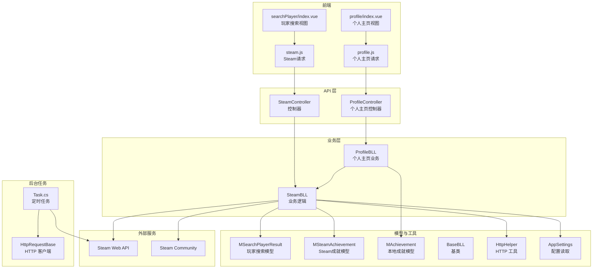
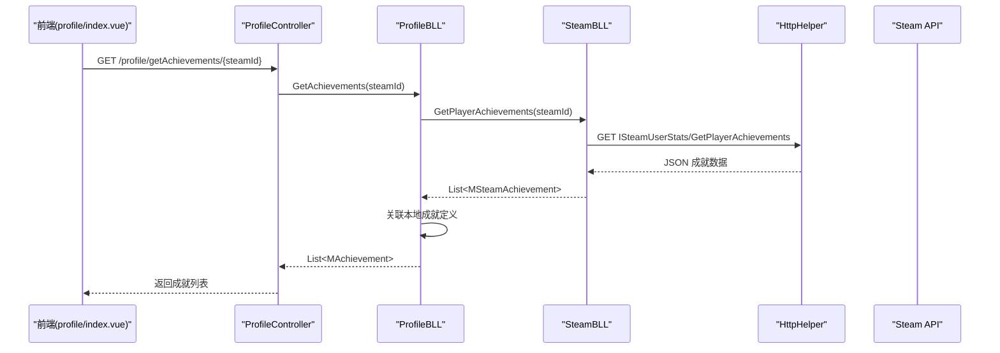
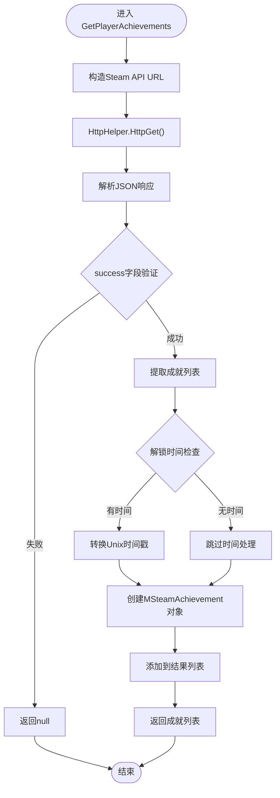
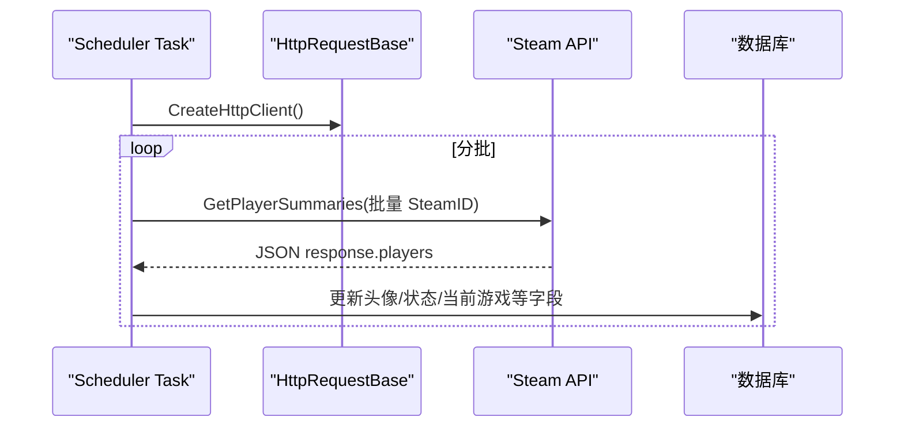
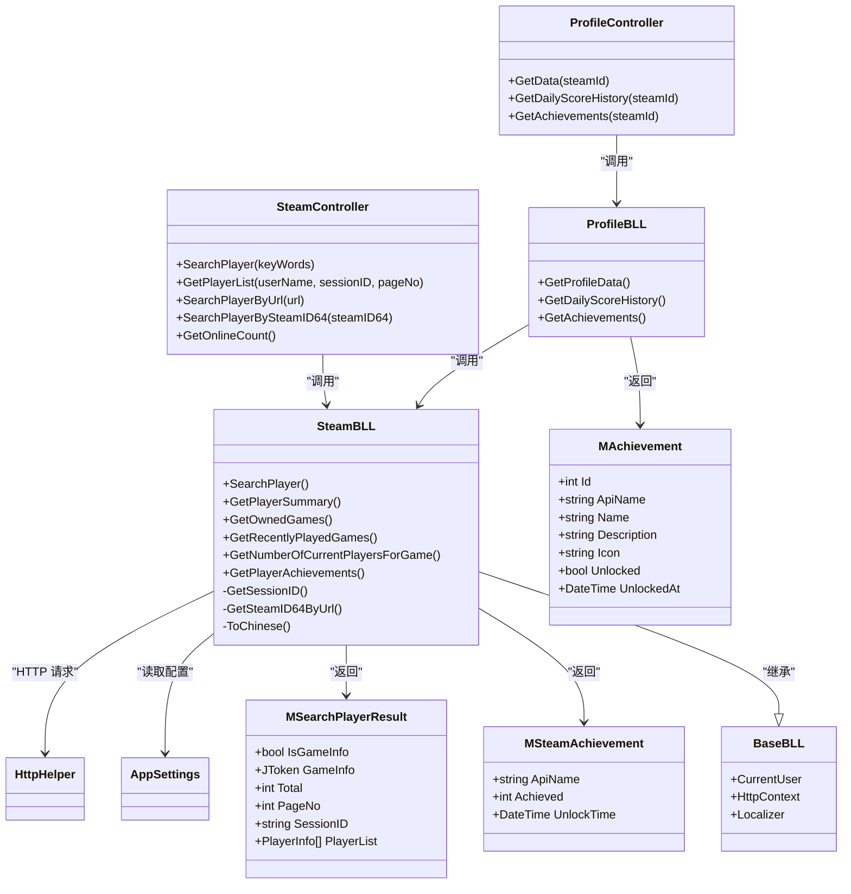

# Steam 集成模块

<cite>
**本文引用的文件**
- [SteamBLL.cs](file://SpeedRunners.API/SpeedRunners.BLL/SteamBLL.cs)
- [SteamController.cs](file://SpeedRunners.API/SpeedRunners/Controllers/SteamController.cs)
- [ProfileController.cs](file://SpeedRunners.API/SpeedRunners/Controllers/ProfileController.cs)
- [ProfileBLL.cs](file://SpeedRunners.API/SpeedRunners.BLL/ProfileBLL.cs)
- [MSteamAchievement.cs](file://SpeedRunners.API/SpeedRunners.Model/Steam/MSteamAchievement.cs)
- [MSearchPlayerResult.cs](file://SpeedRunners.API/SpeedRunners.Model/Steam/MSearchPlayerResult.cs)
- [MAchievement.cs](file://SpeedRunners.API/SpeedRunners.Model/Profile/MAchievement.cs)
- [BaseBLL.cs](file://SpeedRunners.API/SpeedRunners.Utils/BaseBLL.cs)
- [Startup.cs](file://SpeedRunners.API/SpeedRunners/Startup.cs)
- [appsettings.json](file://SpeedRunners.API/SpeedRunners/appsettings.json)
- [HttpHelper.cs](file://SpeedRunners.API/SpeedRunners.Utils/HttpHelper.cs)
- [SRLabTokenAuthMidd.cs](file://SpeedRunners.API/SpeedRunners/Middleware/SRLabTokenAuthMidd.cs)
- [UserBLL.cs](file://SpeedRunners.API/SpeedRunners.BLL/UserBLL.cs)
- [MUser.cs](file://SpeedRunners.API/SpeedRunners.Model/MUser.cs)
- [steam.js](file://SpeedRunners.UI/src/api/steam.js)
- [profile.js](file://SpeedRunners.UI/src/api/profile.js)
- [index.vue](file://SpeedRunners.UI/src/views/searchPlayer/index.vue)
- [index.vue](file://SpeedRunners.UI/src/views/profile/index.vue)
- [Task.cs](file://SpeedRunners.Scheduler/Task.cs)
- [HttpRequestBase.cs](file://SpeedRunners.Scheduler/HttpRequestBase.cs)
</cite>

## 更新摘要
**变更内容**
- 新增Steam成就数据获取功能，包括 `GetPlayerAchievements` 方法和 `MSteamAchievement` 模型类
- 完善Steam API集成能力，支持成就数据的获取、解析和展示
- 在Profile模块中集成Steam成就与本地成就定义的关联处理
- 增强前端成就展示功能，支持解锁状态和解锁时间显示

## 目录
1. [简介](#简介)
2. [项目结构](#项目结构)
3. [核心组件](#核心组件)
4. [架构总览](#架构总览)
5. [组件详解](#组件详解)
6. [依赖关系分析](#依赖关系分析)
7. [性能与限流](#性能与限流)
8. [故障排查指南](#故障排查指南)
9. [结论](#结论)
10. [附录：API 接口规范](#附录api-接口规范)

## 简介
本技术文档聚焦于 SpeedRunners 项目中的 Steam 集成模块，系统性阐述以下内容：
- Steam Web API 的集成方案与数据同步机制
- 玩家信息查询、游戏数据获取、好友/社区玩家列表处理的实现原理
- **新增**：Steam成就数据获取与解析功能
- SteamBLL 业务逻辑层如何封装第三方 API 调用、处理 API 限制与错误重试
- Steam 认证流程、API 密钥管理与安全防护
- 完整的 API 接口规范（含路径、参数、响应结构与异常处理）
- 前后端调用示例与最佳实践

## 项目结构
围绕 Steam 集成的关键文件分布如下：
- 控制器层：SteamController 和 ProfileController 提供对外 REST 接口
- 业务逻辑层：SteamBLL 和 ProfileBLL 封装 Steam API 调用与数据转换
- 模型层：MSearchPlayerResult、MSteamAchievement、MAchievement 等用于前后端数据契约
- 工具与配置：AppSettings、HttpHelper、Startup 中的中间件与本地化
- 前端：UI 层通过 steam.js 和 profile.js 发起请求，index.vue 展示结果
- 后台任务：Scheduler 中定时批量拉取 Steam 数据并写入数据库

**图表来源**
- [SteamController.cs](file://SpeedRunners.API/SpeedRunners/Controllers/SteamController.cs#L1-L28)
- [ProfileController.cs](file://SpeedRunners.API/SpeedRunners/Controllers/ProfileController.cs#L1-L40)
- [SteamBLL.cs](file://SpeedRunners.API/SpeedRunners.BLL/SteamBLL.cs#L1-L505)
- [ProfileBLL.cs](file://SpeedRunners.API/SpeedRunners.BLL/ProfileBLL.cs#L108-L146)
- [MSteamAchievement.cs](file://SpeedRunners.API/SpeedRunners.Model/Steam/MSteamAchievement.cs#L1-L15)
- [MAchievement.cs](file://SpeedRunners.API/SpeedRunners.Model/Profile/MAchievement.cs#L1-L42)

**章节来源**
- [SteamController.cs](file://SpeedRunners.API/SpeedRunners/Controllers/SteamController.cs#L1-L28)
- [ProfileController.cs](file://SpeedRunners.API/SpeedRunners/Controllers/ProfileController.cs#L1-L40)
- [SteamBLL.cs](file://SpeedRunners.API/SpeedRunners.BLL/SteamBLL.cs#L1-L505)
- [ProfileBLL.cs](file://SpeedRunners.API/SpeedRunners.BLL/ProfileBLL.cs#L108-L146)
- [MSteamAchievement.cs](file://SpeedRunners.API/SpeedRunners.Model/Steam/MSteamAchievement.cs#L1-L15)
- [MAchievement.cs](file://SpeedRunners.API/SpeedRunners.Model/Profile/MAchievement.cs#L1-L42)

## 核心组件
- SteamController：暴露 REST 接口，路由形如 api/steam/{action}
- **新增**：ProfileController：提供个人主页相关接口，包括成就获取
- SteamBLL：封装 Steam API 调用，包含玩家信息、游戏数据、在线人数、玩家搜索、社区列表和**新增的成就数据获取**等方法
- **新增**：ProfileBLL：整合Steam成就与本地成就定义，提供成就状态关联
- MSearchPlayerResult：统一返回结构，支持"游戏统计"和"玩家列表"两种模式
- **新增**：MSteamAchievement：Steam成就数据模型，包含成就名称、解锁状态和解锁时间
- **新增**：MAchievement：本地成就模型，扩展Steam成就数据，包含显示名称、描述、图标等
- BaseBLL：提供当前用户上下文、HttpContext、本地化等基础能力
- HttpHelper/AppSettings：统一 HTTP 请求与配置读取（含 API Key）
- 前端 steam.js、profile.js 与 index.vue：发起请求并渲染结果
- Scheduler Task：定时批量抓取 Steam 用户信息并写库

**章节来源**
- [SteamController.cs](file://SpeedRunners.API/SpeedRunners/Controllers/SteamController.cs#L1-L28)
- [ProfileController.cs](file://SpeedRunners.API/SpeedRunners/Controllers/ProfileController.cs#L1-L40)
- [SteamBLL.cs](file://SpeedRunners.API/SpeedRunners.BLL/SteamBLL.cs#L1-L505)
- [ProfileBLL.cs](file://SpeedRunners.API/SpeedRunners.BLL/ProfileBLL.cs#L108-L146)
- [MSearchPlayerResult.cs](file://SpeedRunners.API/SpeedRunners.Model/Steam/MSearchPlayerResult.cs#L1-L38)
- [MSteamAchievement.cs](file://SpeedRunners.API/SpeedRunners.Model/Steam/MSteamAchievement.cs#L1-L15)
- [MAchievement.cs](file://SpeedRunners.API/SpeedRunners.Model/Profile/MAchievement.cs#L1-L42)

## 架构总览
Steam 集成采用"控制器 → 业务层 → 第三方 API"的分层设计。业务层通过 SteamWebAPI2 库与 Steam Web API 交互，并在必要时回退到自建 HTTP 请求（如社区搜索）。**新增的成就数据获取通过直接HTTP请求Steam Web API的GetPlayerAchievements接口**。控制器负责参数绑定与返回包装，前端通过 axios 风格封装进行调用。

**图表来源**
- [ProfileController.cs](file://SpeedRunners.API/SpeedRunners/Controllers/ProfileController.cs#L32-L39)
- [ProfileBLL.cs](file://SpeedRunners.API/SpeedRunners.BLL/ProfileBLL.cs#L110-L142)
- [SteamBLL.cs](file://SpeedRunners.API/SpeedRunners.BLL/SteamBLL.cs#L108-L163)
- [MSteamAchievement.cs](file://SpeedRunners.API/SpeedRunners.Model/Steam/MSteamAchievement.cs#L8-L13)
- [MAchievement.cs](file://SpeedRunners.API/SpeedRunners.Model/Profile/MAchievement.cs#L8-L41)

## 组件详解

### SteamBLL 业务逻辑层
- 关键职责
  - 封装 Steam Web API 调用（用户摘要、拥有游戏、最近游戏、在线人数）
  - **新增**：GetPlayerAchievements 方法，通过 Steam Web API 获取玩家成就数据
  - 封装社区搜索（解析 HTML 提取玩家列表），并注入 Cookie 与国家信息
  - 玩家搜索多路并行策略：优先 SteamID64 或 CustomURL，否则回退社区用户列表
  - 游戏统计中文名映射（按游戏术语表替换）
  - 天梯分查询（对接自有服务，分批请求）
- **新增**：GetPlayerAchievements 实现细节
  - 构造 Steam Web API GetPlayerAchievements 请求URL
  - 解析返回的JSON数据，提取成就列表
  - 将 Unix 时间戳转换为 DateTime 格式
  - 返回 MSteamAchievement 对象列表
- 错误处理
  - 对 HTTP 请求进行 try/catch，失败返回空以避免中断整体流程
  - 对社区搜索返回 success 字段校验，确保数据有效性
  - 对成就数据解析进行健壮性检查
- 性能优化
  - 使用分组批量请求（每批最多 99 个 ID）减少第三方调用次数
  - 并行执行多个搜索分支，缩短首字节时间

**图表来源**
- [SteamBLL.cs](file://SpeedRunners.API/SpeedRunners.BLL/SteamBLL.cs#L108-L163)
- [MSteamAchievement.cs](file://SpeedRunners.API/SpeedRunners.Model/Steam/MSteamAchievement.cs#L8-L13)

**章节来源**
- [SteamBLL.cs](file://SpeedRunners.API/SpeedRunners.BLL/SteamBLL.cs#L1-L505)

### ProfileBLL 业务逻辑层
- **新增**：GetAchievements 方法实现
  - 获取本地成就定义列表
  - 调用 SteamBLL 获取玩家Steam成就状态
  - 将Steam成就状态与本地成就定义进行关联
  - 设置解锁状态和解锁时间
  - 返回完整的成就列表

**章节来源**
- [ProfileBLL.cs](file://SpeedRunners.API/SpeedRunners.BLL/ProfileBLL.cs#L110-L142)

### 控制器与路由
- 路由约定：api/steam/{action} 和 api/profile/{action}
- **新增**：ProfileController 支持的动作
  - GetAchievements(steamId)：获取玩家成就列表
- 支持动作
  - SearchPlayer(keyWords)
  - GetPlayerList(userName, sessionID, pageNo)
  - SearchPlayerByUrl(url)
  - SearchPlayerBySteamID64(steamID64)
  - GetOnlineCount()

**章节来源**
- [SteamController.cs](file://SpeedRunners.API/SpeedRunners/Controllers/SteamController.cs#L1-L28)
- [ProfileController.cs](file://SpeedRunners.API/SpeedRunners/Controllers/ProfileController.cs#L1-L40)

### 模型与数据契约
- MSearchPlayerResult
  - IsGameInfo：是否返回游戏统计
  - GameInfo：JSON 游戏统计（含 stats 数组）
  - PlayerList：玩家列表（头像、用户名、ProfilesOrID、ContentOfID）
  - Total/PageNo/SessionID：社区列表分页与会话信息
- **新增**：MSteamAchievement
  - ApiName：Steam成就API名称
  - Achieved：解锁状态（0或1）
  - UnlockTime：解锁时间（可为空）
- **新增**：MAchievement
  - Id：本地成就ID
  - ApiName：Steam成就API名称
  - Name：成就显示名称
  - Description：成就描述
  - Icon：图标名称
  - Unlocked：是否已解锁
  - UnlockedAt：解锁时间

**章节来源**
- [MSearchPlayerResult.cs](file://SpeedRunners.API/SpeedRunners.Model/Steam/MSearchPlayerResult.cs#L1-L38)
- [MSteamAchievement.cs](file://SpeedRunners.API/SpeedRunners.Model/Steam/MSteamAchievement.cs#L1-L15)
- [MAchievement.cs](file://SpeedRunners.API/SpeedRunners.Model/Profile/MAchievement.cs#L1-L42)

### 前端集成
- steam.js：封装 GET 请求到各 SteamController 动作
- **新增**：profile.js：封装 GET 请求到 ProfileController 的个人主页相关接口
- index.vue（搜索页面）：输入关键词触发搜索，支持点击列表项进一步按 SteamID64 或 CustomURL 查询
- **新增**：index.vue（个人主页）：显示玩家成就，支持解锁状态和解锁时间展示
- 本地化：通过请求头 locale 决定游戏统计字段中文名映射

**章节来源**
- [steam.js](file://SpeedRunners.UI/src/api/steam.js#L1-L36)
- [profile.js](file://SpeedRunners.UI/src/api/profile.js#L1-L25)
- [index.vue](file://SpeedRunners.UI/src/views/searchPlayer/index.vue#L1-L169)
- [index.vue](file://SpeedRunners.UI/src/views/profile/index.vue#L1-L760)

### 后台任务与数据同步
- 定时任务 Task：周期性批量抓取 Steam 用户信息（头像、状态、当前游戏等）
- 批处理策略：按 100 人一组分批请求，解析 JSON 并写入数据库
- HTTP 客户端：HttpRequestBase 创建带超时与代理的 HttpClient

**图表来源**
- [Task.cs](file://SpeedRunners.Scheduler/Task.cs#L295-L328)
- [HttpRequestBase.cs](file://SpeedRunners.Scheduler/HttpRequestBase.cs#L11-L18)

**章节来源**
- [Task.cs](file://SpeedRunners.Scheduler/Task.cs#L1-L330)
- [HttpRequestBase.cs](file://SpeedRunners.Scheduler/HttpRequestBase.cs#L1-L42)

## 依赖关系分析
- 控制器依赖业务层，业务层依赖工具类与配置
- **新增**：ProfileController 依赖 ProfileBLL，ProfileBLL 依赖 SteamBLL
- 业务层同时依赖 SteamWebAPI2 与自建 HttpHelper
- 前端依赖控制器提供的 REST 接口
- 后台任务独立于 API 层，直接访问 Steam API

**图表来源**
- [SteamController.cs](file://SpeedRunners.API/SpeedRunners/Controllers/SteamController.cs#L1-L28)
- [ProfileController.cs](file://SpeedRunners.API/SpeedRunners/Controllers/ProfileController.cs#L1-L40)
- [SteamBLL.cs](file://SpeedRunners.API/SpeedRunners.BLL/SteamBLL.cs#L1-L505)
- [ProfileBLL.cs](file://SpeedRunners.API/SpeedRunners.BLL/ProfileBLL.cs#L108-L146)
- [MSearchPlayerResult.cs](file://SpeedRunners.API/SpeedRunners.Model/Steam/MSearchPlayerResult.cs#L1-L38)
- [MSteamAchievement.cs](file://SpeedRunners.API/SpeedRunners.Model/Steam/MSteamAchievement.cs#L1-L15)
- [MAchievement.cs](file://SpeedRunners.API/SpeedRunners.Model/Profile/MAchievement.cs#L1-L42)
- [BaseBLL.cs](file://SpeedRunners.API/SpeedRunners.Utils/BaseBLL.cs#L1-L17)
- [HttpHelper.cs](file://SpeedRunners.API/SpeedRunners.Utils/HttpHelper.cs#L37-L76)
- [appsettings.json](file://SpeedRunners.API/SpeedRunners/appsettings.json#L1-L21)

**章节来源**
- [SteamController.cs](file://SpeedRunners.API/SpeedRunners/Controllers/SteamController.cs#L1-L28)
- [ProfileController.cs](file://SpeedRunners.API/SpeedRunners/Controllers/ProfileController.cs#L1-L40)
- [SteamBLL.cs](file://SpeedRunners.API/SpeedRunners.BLL/SteamBLL.cs#L1-L505)
- [ProfileBLL.cs](file://SpeedRunners.API/SpeedRunners.BLL/ProfileBLL.cs#L108-L146)
- [MSearchPlayerResult.cs](file://SpeedRunners.API/SpeedRunners.Model/Steam/MSearchPlayerResult.cs#L1-L38)
- [MSteamAchievement.cs](file://SpeedRunners.API/SpeedRunners.Model/Steam/MSteamAchievement.cs#L1-L15)
- [MAchievement.cs](file://SpeedRunners.API/SpeedRunners.Model/Profile/MAchievement.cs#L1-L42)
- [BaseBLL.cs](file://SpeedRunners.API/SpeedRunners.Utils/BaseBLL.cs#L1-L17)
- [HttpHelper.cs](file://SpeedRunners.API/SpeedRunners.Utils/HttpHelper.cs#L37-L76)
- [appsettings.json](file://SpeedRunners.API/SpeedRunners/appsettings.json#L1-L21)

## 性能与限流
- 批量请求：天梯分与后台任务均采用分组批量请求，降低 API 调用次数
- 并行搜索：玩家搜索同时尝试多种路径，缩短等待时间
- **新增**：成就数据获取的错误处理机制，确保API调用失败不影响整体功能
- 超时与代理：后台任务客户端设置超时与代理，提升稳定性
- 建议
  - 在高并发场景下，可引入令牌桶/漏桶限流与指数退避重试
  - 对社区搜索增加缓存与去重，避免重复解析 HTML
  - 对 Steam API 限流阈值进行监控与告警
  - **新增**：考虑为成就数据获取添加缓存机制，减少频繁API调用

**章节来源**
- [SteamBLL.cs](file://SpeedRunners.API/SpeedRunners.BLL/SteamBLL.cs#L55-L56)
- [Task.cs](file://SpeedRunners.Scheduler/Task.cs#L299-L306)
- [HttpRequestBase.cs](file://SpeedRunners.Scheduler/HttpRequestBase.cs#L11-L18)
- [ProfileBLL.cs](file://SpeedRunners.API/SpeedRunners.BLL/ProfileBLL.cs#L118-L142)

## 故障排查指南
- API 密钥问题
  - 确认 appsettings.json 中 ApiKey 配置正确且可访问
  - 若密钥无效，Steam API 返回失败，业务层会返回空结果
- 社区搜索失败
  - 检查 sessionid 与 steamCountry Cookie 是否注入
  - 确认 g_sessionID 正则匹配成功
- **新增**：成就数据获取失败
  - 检查 Steam Web API 的 GetPlayerAchievements 接口是否可用
  - 确认 steamID 参数格式正确（必须为64位数字）
  - 验证游戏ID（AppId）配置是否正确
- HTTP 超时/代理
  - 后台任务客户端默认启用代理与短超时，必要时调整
- 认证与权限
  - 前端需携带有效 Token，后端中间件会校验平台 ID
  - 登录成功后返回 Token，后续请求需附带

**章节来源**
- [appsettings.json](file://SpeedRunners.API/SpeedRunners/appsettings.json#L14-L14)
- [SteamBLL.cs](file://SpeedRunners.API/SpeedRunners.BLL/SteamBLL.cs#L146-L158)
- [SteamBLL.cs](file://SpeedRunners.API/SpeedRunners.BLL/SteamBLL.cs#L289-L306)
- [ProfileBLL.cs](file://SpeedRunners.API/SpeedRunners.BLL/ProfileBLL.cs#L118-L142)
- [HttpRequestBase.cs](file://SpeedRunners.Scheduler/HttpRequestBase.cs#L11-L18)
- [SRLabTokenAuthMidd.cs](file://SpeedRunners.API/SpeedRunners/Middleware/SRLabTokenAuthMidd.cs#L68-L101)
- [UserBLL.cs](file://SpeedRunners.API/SpeedRunners.BLL/UserBLL.cs#L95-L120)
- [MUser.cs](file://SpeedRunners.API/SpeedRunners.Model/MUser.cs#L1-L35)

## 结论
该模块通过清晰的分层设计与稳健的错误处理，实现了对 Steam Web API 的稳定集成。**新增的成就数据获取功能进一步完善了Steam API集成能力，通过Profile模块实现了Steam成就与本地成就定义的关联处理**。业务层封装了多种查询路径与数据转换逻辑，前端与后台任务分别满足实时查询与批量同步需求。建议在生产环境中补充更完善的限流、缓存与可观测性策略，以进一步提升可靠性与性能。

## 附录：API 接口规范

### 基础信息
- 基础路径：/api/steam/{action} 和 /api/profile/{action}
- 认证：需要 Token（后端中间件校验）
- 语言：通过请求头 locale 切换游戏统计字段中文名映射

### 接口一览
- **SteamController 接口**
  - 搜索玩家
    - 方法：GET
    - 路径：/api/steam/SearchPlayer/{keyWords}
    - 参数：keyWords（字符串）
    - 返回：MSearchPlayerResult
  - 获取玩家列表（社区）
    - 方法：GET
    - 路径：/api/steam/GetPlayerList/{userName}/{sessionID}/{pageNo}
    - 参数：userName（字符串）、sessionID（字符串）、pageNo（整数）
    - 返回：MSearchPlayerResult（包含玩家列表）
  - 通过 CustomURL 查询
    - 方法：GET
    - 路径：/api/steam/SearchPlayerByUrl/{url}
    - 参数：url（字符串）
    - 返回：MSearchPlayerResult（若命中游戏统计则 IsGameInfo=true）
  - 通过 SteamID64 查询
    - 方法：GET
    - 路径：/api/steam/SearchPlayerBySteamID64/{steamID64}
    - 参数：steamID64（字符串）
    - 返回：MSearchPlayerResult（IsGameInfo=true）
  - 获取在线人数
    - 方法：GET
    - 路径：/api/steam/GetOnlineCount
    - 返回：uint（当前在线人数）

- **ProfileController 接口**
  - 获取玩家成就
    - 方法：GET
    - 路径：/api/profile/GetAchievements/{steamId}
    - 参数：steamId（字符串）
    - 返回：List<MAchievement>

### 响应数据结构
- MSearchPlayerResult
  - 字段：IsGameInfo（布尔）、GameInfo（JSON 游戏统计）、Total（整数）、PageNo（整数）、SessionID（字符串）、PlayerList（列表）
- PlayerInfo
  - 字段：Avatar（字符串）、UserName（字符串）、ProfilesOrID（字符串，值为 profiles 或 ID）、ContentOfID（字符串，CustomURL 或 SteamID64）
- **新增**：MSteamAchievement
  - 字段：ApiName（字符串）、Achieved（整数，0或1）、UnlockTime（DateTime，可为空）
- **新增**：MAchievement
  - 字段：Id（整数）、ApiName（字符串）、Name（字符串）、Description（字符串）、Icon（字符串）、Unlocked（布尔）、UnlockedAt（DateTime，可为空）

### 异常与错误处理
- HTTP 请求异常：业务层捕获并返回空，避免中断
- 社区搜索 success 校验：非 1 时返回空
- 天梯分查询：仅当返回包含 score 字段时解析
- **新增**：成就数据获取异常：Steam API调用失败时返回空列表
- 认证失败：中间件返回未授权

### 调用示例（前端）
- 搜索玩家：调用 steam.js 的 searchPlayer(keyWords)
- 获取玩家列表：调用 getPlayerList(userName, sessionID, pageNo)
- 通过 URL 查询：调用 searchPlayerByUrl(url)
- 通过 SteamID64 查询：调用 searchPlayerBySteamID64(steamID64)
- 获取在线人数：调用 getOnlineCount()
- **新增**：获取玩家成就：调用 profile.js 的 getAchievements(steamId)

**章节来源**
- [SteamController.cs](file://SpeedRunners.API/SpeedRunners/Controllers/SteamController.cs#L12-L26)
- [ProfileController.cs](file://SpeedRunners.API/SpeedRunners/Controllers/ProfileController.cs#L32-L39)
- [MSearchPlayerResult.cs](file://SpeedRunners.API/SpeedRunners.Model/Steam/MSearchPlayerResult.cs#L6-L36)
- [MSteamAchievement.cs](file://SpeedRunners.API/SpeedRunners.Model/Steam/MSteamAchievement.cs#L8-L13)
- [MAchievement.cs](file://SpeedRunners.API/SpeedRunners.Model/Profile/MAchievement.cs#L8-L41)
- [steam.js](file://SpeedRunners.UI/src/api/steam.js#L3-L36)
- [profile.js](file://SpeedRunners.UI/src/api/profile.js#L19-L25)
- [index.vue](file://SpeedRunners.UI/src/views/searchPlayer/index.vue#L104-L155)
- [index.vue](file://SpeedRunners.UI/src/views/profile/index.vue#L334-L364)