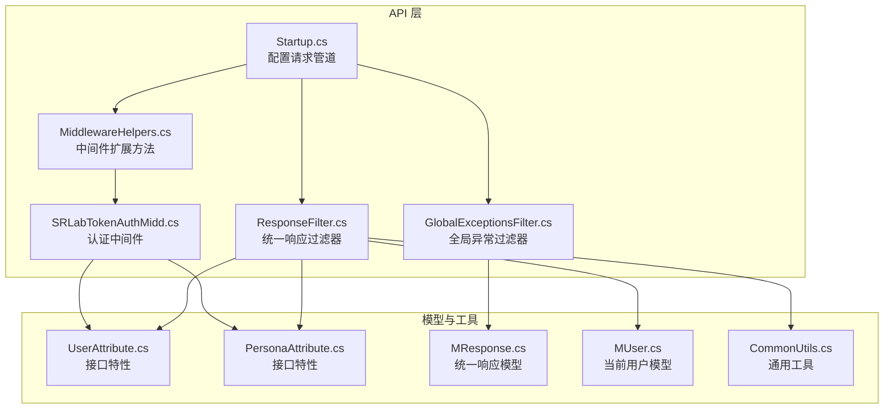
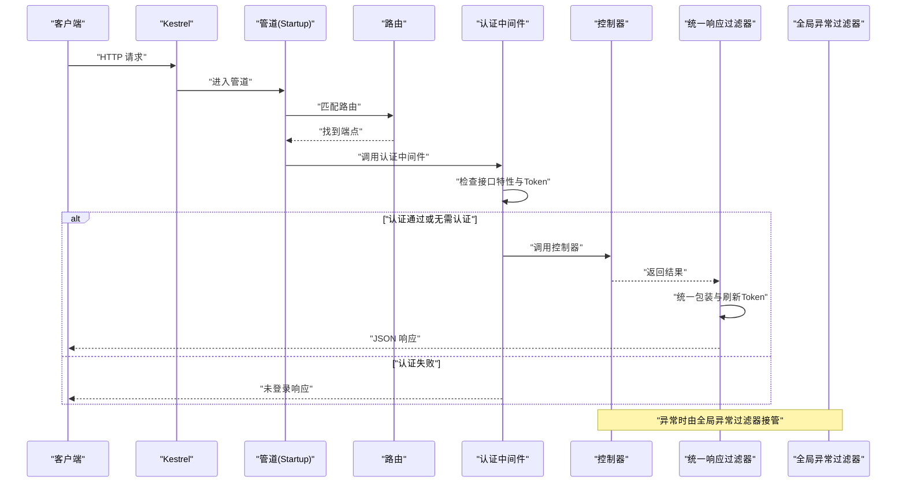
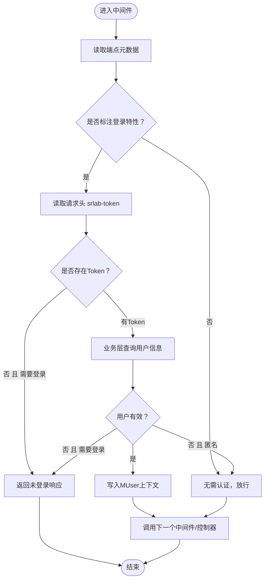
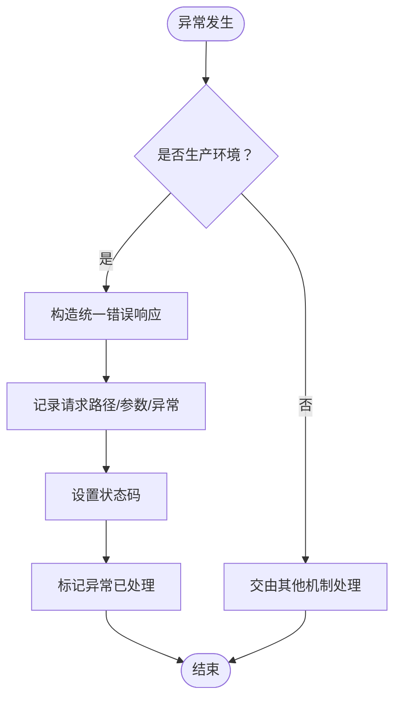
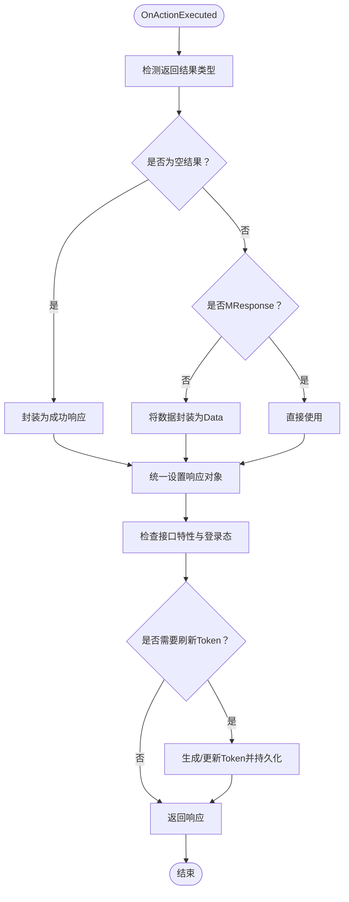
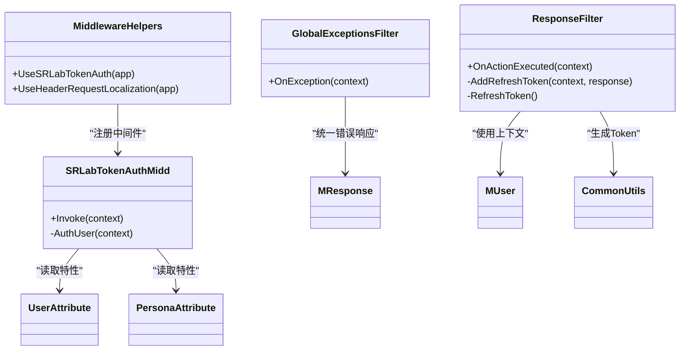

# 中间件与过滤器

<cite>
**本文引用的文件**
- [SRLabTokenAuthMidd.cs](file://SpeedRunners.API/SpeedRunners/Middleware/SRLabTokenAuthMidd.cs)
- [MiddlewareHelpers.cs](file://SpeedRunners.API/SpeedRunners/Middleware/MiddlewareHelpers.cs)
- [GlobalExceptionsFilter.cs](file://SpeedRunners.API/SpeedRunners/Filter/GlobalExceptionsFilter.cs)
- [ResponseFilter.cs](file://SpeedRunners.API/SpeedRunners/Filter/ResponseFilter.cs)
- [Startup.cs](file://SpeedRunners.API/SpeedRunners/Startup.cs)
- [UserAttribute.cs](file://SpeedRunners.API/SpeedRunners.Model/UserAttribute.cs)
- [PersonaAttribute.cs](file://SpeedRunners.API/SpeedRunners.Model/PersonaAttribute.cs)
- [MResponse.cs](file://SpeedRunners.API/SpeedRunners.Model/MResponse.cs)
- [MUser.cs](file://SpeedRunners.API/SpeedRunners.Model/MUser.cs)
- [CommonUtils.cs](file://SpeedRunners.API/SpeedRunners.Utils/CommonUtils.cs)
</cite>

## 目录
1. [简介](#简介)
2. [项目结构](#项目结构)
3. [核心组件](#核心组件)
4. [架构总览](#架构总览)
5. [详细组件分析](#详细组件分析)
6. [依赖关系分析](#依赖关系分析)
7. [性能考量](#性能考量)
8. [故障排查指南](#故障排查指南)
9. [结论](#结论)
10. [附录](#附录)

## 简介
本文件面向中间件与过滤器系统的使用者与维护者，系统性阐述以下内容：
- 自定义中间件的实现原理与执行顺序
- SRLabTokenAuthMidd 认证中间件的 Token 验证、权限检查与请求拦截逻辑
- 全局过滤器的架构设计：异常处理、统一响应格式化、Token 刷新策略与日志记录
- MiddlewareHelpers 提供的扩展方法与装配入口
- 中间件链路图与典型请求执行流程示例
- 自定义中间件开发指南、性能优化建议与调试技巧

## 项目结构
中间件与过滤器位于 API 层（SpeedRunners.API），通过 Startup 在管道中装配；认证中间件与过滤器均使用依赖注入容器提供的服务。

图表来源
- [Startup.cs](file://SpeedRunners.API/SpeedRunners/Startup.cs#L64-L84)
- [MiddlewareHelpers.cs](file://SpeedRunners.API/SpeedRunners/Middleware/MiddlewareHelpers.cs#L9-L39)
- [SRLabTokenAuthMidd.cs](file://SpeedRunners.API/SpeedRunners/Middleware/SRLabTokenAuthMidd.cs#L13-L102)
- [GlobalExceptionsFilter.cs](file://SpeedRunners.API/SpeedRunners/Filter/GlobalExceptionsFilter.cs#L11-L52)
- [ResponseFilter.cs](file://SpeedRunners.API/SpeedRunners/Filter/ResponseFilter.cs#L9-L113)
- [UserAttribute.cs](file://SpeedRunners.API/SpeedRunners.Model/UserAttribute.cs#L5-L11)
- [PersonaAttribute.cs](file://SpeedRunners.API/SpeedRunners.Model/PersonaAttribute.cs#L5-L11)
- [MResponse.cs](file://SpeedRunners.API/SpeedRunners.Model/MResponse.cs#L3-L41)
- [MUser.cs](file://SpeedRunners.API/SpeedRunners.Model/MUser.cs#L5-L34)
- [CommonUtils.cs](file://SpeedRunners.API/SpeedRunners.Utils/CommonUtils.cs#L8-L35)

章节来源
- [Startup.cs](file://SpeedRunners.API/SpeedRunners/Startup.cs#L64-L84)

## 核心组件
- 认证中间件：负责在请求进入控制器之前进行 Token 校验与用户上下文注入，并根据接口特性决定是否放行或直接返回未登录响应。
- 全局异常过滤器：集中捕获未处理异常，生产环境统一返回安全的错误响应并记录日志。
- 统一响应过滤器：对控制器返回值进行统一包装，按接口特性刷新 Token 并回传给客户端。
- 中间件扩展方法：提供 UseSRLabTokenAuth 与本地化中间件的便捷装配入口。
- 接口特性：UserAttribute 与 PersonaAttribute 标注接口是否需要登录或区分登录态返回数据。
- 统一响应模型与当前用户模型：规范输出结构与用户上下文字段。

章节来源
- [SRLabTokenAuthMidd.cs](file://SpeedRunners.API/SpeedRunners/Middleware/SRLabTokenAuthMidd.cs#L13-L123)
- [GlobalExceptionsFilter.cs](file://SpeedRunners.API/SpeedRunners/Filter/GlobalExceptionsFilter.cs#L11-L54)
- [ResponseFilter.cs](file://SpeedRunners.API/SpeedRunners/Filter/ResponseFilter.cs#L9-L114)
- [MiddlewareHelpers.cs](file://SpeedRunners.API/SpeedRunners/Middleware/MiddlewareHelpers.cs#L9-L42)
- [UserAttribute.cs](file://SpeedRunners.API/SpeedRunners.Model/UserAttribute.cs#L5-L11)
- [PersonaAttribute.cs](file://SpeedRunners.API/SpeedRunners.Model/PersonaAttribute.cs#L5-L11)
- [MResponse.cs](file://SpeedRunners.API/SpeedRunners.Model/MResponse.cs#L3-L41)
- [MUser.cs](file://SpeedRunners.API/SpeedRunners.Model/MUser.cs#L5-L34)

## 架构总览
下图展示了请求在 ASP.NET Core 管道中的典型流转：路由 → 跨域 → 认证中间件 → 控制器 → 统一响应过滤器 → 全局异常过滤器（仅在异常路径）。

图表来源
- [Startup.cs](file://SpeedRunners.API/SpeedRunners/Startup.cs#L64-L84)
- [SRLabTokenAuthMidd.cs](file://SpeedRunners.API/SpeedRunners/Middleware/SRLabTokenAuthMidd.cs#L31-L47)
- [ResponseFilter.cs](file://SpeedRunners.API/SpeedRunners/Filter/ResponseFilter.cs#L24-L50)
- [GlobalExceptionsFilter.cs](file://SpeedRunners.API/SpeedRunners/Filter/GlobalExceptionsFilter.cs#L31-L51)

## 详细组件分析

### 认证中间件 SRLabTokenAuthMidd
- 职责
  - 在请求到达控制器前进行 Token 验证
  - 根据接口特性决定是否需要登录（UserAttribute）或允许匿名（PersonaAttribute）
  - 将当前用户上下文注入到请求服务容器，供后续组件使用
  - 对未登录且需要登录的请求直接返回统一失败响应
- 关键流程
  - 读取端点元数据，判断是否标注 UserAttribute 或 PersonaAttribute
  - 从请求头读取 srlab-token
  - 通过业务层查询用户信息，校验平台标识
  - 将浏览器、TokenID、Token、PlatformID、LoginDate 写入 MUser
  - 返回认证结果枚举（DontNeed/AuthFail/AuthSuccess）

图表来源
- [SRLabTokenAuthMidd.cs](file://SpeedRunners.API/SpeedRunners/Middleware/SRLabTokenAuthMidd.cs#L31-L101)
- [UserAttribute.cs](file://SpeedRunners.API/SpeedRunners.Model/UserAttribute.cs#L5-L11)
- [PersonaAttribute.cs](file://SpeedRunners.API/SpeedRunners.Model/PersonaAttribute.cs#L5-L11)

章节来源
- [SRLabTokenAuthMidd.cs](file://SpeedRunners.API/SpeedRunners/Middleware/SRLabTokenAuthMidd.cs#L31-L101)

### 全局异常过滤器 GlobalExceptionsFilter
- 职责
  - 捕获未处理异常，生产环境统一返回安全错误响应
  - 记录请求路径、请求体与异常堆栈到日志
- 行为特征
  - 仅在生产环境生效
  - 将响应状态码设置为服务器内部错误
  - 标记异常已处理，避免框架重复处理

图表来源
- [GlobalExceptionsFilter.cs](file://SpeedRunners.API/SpeedRunners/Filter/GlobalExceptionsFilter.cs#L31-L51)

章节来源
- [GlobalExceptionsFilter.cs](file://SpeedRunners.API/SpeedRunners/Filter/GlobalExceptionsFilter.cs#L16-L52)

### 统一响应过滤器 ResponseFilter
- 职责
  - 统一包装控制器返回值为 MResponse
  - 根据接口特性与登录态刷新并回传 Token
- 关键逻辑
  - 识别 EmptyResult 与 ObjectResult
  - 若返回值已是 MResponse 则直接使用
  - 否则将数据封装为 MResponse.Data
  - 根据端点特性与当前用户上下文决定是否刷新 Token
  - 通过业务层更新过期 Token 并返回最新 Token

图表来源
- [ResponseFilter.cs](file://SpeedRunners.API/SpeedRunners/Filter/ResponseFilter.cs#L24-L111)
- [UserAttribute.cs](file://SpeedRunners.API/SpeedRunners.Model/UserAttribute.cs#L5-L11)
- [PersonaAttribute.cs](file://SpeedRunners.API/SpeedRunners.Model/PersonaAttribute.cs#L5-L11)
- [MResponse.cs](file://SpeedRunners.API/SpeedRunners.Model/MResponse.cs#L3-L41)
- [CommonUtils.cs](file://SpeedRunners.API/SpeedRunners.Utils/CommonUtils.cs#L24-L28)

章节来源
- [ResponseFilter.cs](file://SpeedRunners.API/SpeedRunners/Filter/ResponseFilter.cs#L14-L113)

### 中间件扩展方法 MiddlewareHelpers
- 职责
  - 提供 UseSRLabTokenAuth 扩展方法，简化认证中间件的注册
  - 提供 UseHeaderRequestLocalization 扩展方法，基于请求头选择语言
- 语言配置
  - 支持语言：英文、中文
  - 默认语言：英文
  - 使用自定义 LocaleHeaderRequestCultureProvider 解析语言

章节来源
- [MiddlewareHelpers.cs](file://SpeedRunners.API/SpeedRunners/Middleware/MiddlewareHelpers.cs#L9-L42)

### 接口特性与统一响应模型
- 接口特性
  - UserAttribute：标注该接口需要登录后才能访问
  - PersonaAttribute：标注该接口允许匿名访问，但登录用户会返回个性化数据
- 统一响应模型
  - MResponse：包含 Code、Message、Token 字段
  - MResponse<T>：泛型版本，携带 Data
  - MResponseMethod：提供 Success 扩展方法

章节来源
- [UserAttribute.cs](file://SpeedRunners.API/SpeedRunners.Model/UserAttribute.cs#L5-L11)
- [PersonaAttribute.cs](file://SpeedRunners.API/SpeedRunners.Model/PersonaAttribute.cs#L5-L11)
- [MResponse.cs](file://SpeedRunners.API/SpeedRunners.Model/MResponse.cs#L3-L41)

## 依赖关系分析
- 认证中间件依赖
  - 通过 HttpContext 的 RequestServices 获取业务层与模型实例
  - 依赖接口特性判断是否需要认证
- 统一响应过滤器依赖
  - 依赖 MUser 当前用户上下文
  - 依赖业务层更新 Token
  - 依赖 AppSettings 读取刷新阈值
- 全局异常过滤器依赖
  - 依赖运行环境判断是否生产模式
  - 依赖日志记录器输出错误详情

图表来源
- [SRLabTokenAuthMidd.cs](file://SpeedRunners.API/SpeedRunners/Middleware/SRLabTokenAuthMidd.cs#L18-L101)
- [GlobalExceptionsFilter.cs](file://SpeedRunners.API/SpeedRunners/Filter/GlobalExceptionsFilter.cs#L16-L52)
- [ResponseFilter.cs](file://SpeedRunners.API/SpeedRunners/Filter/ResponseFilter.cs#L14-L113)
- [MiddlewareHelpers.cs](file://SpeedRunners.API/SpeedRunners/Middleware/MiddlewareHelpers.cs#L9-L39)
- [UserAttribute.cs](file://SpeedRunners.API/SpeedRunners.Model/UserAttribute.cs#L5-L11)
- [PersonaAttribute.cs](file://SpeedRunners.API/SpeedRunners.Model/PersonaAttribute.cs#L5-L11)
- [MResponse.cs](file://SpeedRunners.API/SpeedRunners.Model/MResponse.cs#L3-L41)
- [MUser.cs](file://SpeedRunners.API/SpeedRunners.Model/MUser.cs#L5-L34)
- [CommonUtils.cs](file://SpeedRunners.API/SpeedRunners.Utils/CommonUtils.cs#L8-L35)

## 性能考量
- 异步优先：中间件与过滤器均采用异步方法，避免阻塞线程
- 最小化 IO：认证中间件仅做必要查询，避免冗余数据库访问
- 统一响应：减少控制器重复封装，降低序列化开销
- 语言切换：本地化中间件仅在请求头存在时生效，避免不必要的文化解析
- 生产环境异常：全局异常过滤器在生产环境统一返回，避免框架默认页面带来的额外开销

## 故障排查指南
- 未登录即被拦截
  - 检查接口是否标注了 UserAttribute
  - 确认请求头是否包含有效的 srlab-token
  - 查看认证中间件的日志输出
- Token 未刷新
  - 检查接口特性与当前用户上下文是否正确注入
  - 确认 AppSettings 中 Refresh 配置项是否合理
  - 观察业务层更新 Token 的调用是否成功
- 统一响应格式异常
  - 确认控制器返回值类型是否符合预期
  - 检查 ResponseFilter 是否被正确注册
- 生产环境看不到详细错误
  - 全局异常过滤器在生产环境会屏蔽详细信息，查看日志文件定位问题

章节来源
- [SRLabTokenAuthMidd.cs](file://SpeedRunners.API/SpeedRunners/Middleware/SRLabTokenAuthMidd.cs#L31-L47)
- [ResponseFilter.cs](file://SpeedRunners.API/SpeedRunners/Filter/ResponseFilter.cs#L24-L50)
- [GlobalExceptionsFilter.cs](file://SpeedRunners.API/SpeedRunners/Filter/GlobalExceptionsFilter.cs#L31-L51)

## 结论
本系统通过“认证中间件 + 全局异常过滤器 + 统一响应过滤器”的组合，实现了清晰的横切关注点分离：认证在进入控制器前完成，异常在统一出口处理，响应在统一出口标准化。接口特性与上下文模型使策略控制简单明确，扩展性强。建议在新增中间件时遵循现有模式，保持管道顺序与职责边界清晰。

## 附录

### 中间件链路与执行顺序
- Startup.Configure 中的装配顺序决定了请求在管道中的执行顺序
- 跨域 → 认证中间件 → 控制器 → 统一响应过滤器 → 全局异常过滤器（异常路径）

章节来源
- [Startup.cs](file://SpeedRunners.API/SpeedRunners/Startup.cs#L64-L84)

### 自定义中间件开发指南
- 设计原则
  - 保持无状态，避免在中间件中存储请求上下文
  - 明确职责边界，尽量单一职责
  - 优先使用异步方法，避免阻塞
- 实现步骤
  - 定义 RequestDelegate 参数的构造函数
  - 在 Invoke 中先处理前置逻辑，再调用 _next(context)
  - 如需短路，直接写入响应并返回
  - 通过扩展方法在 Startup 中注册
- 参考实现
  - 认证中间件与扩展方法的实现可作为模板

章节来源
- [SRLabTokenAuthMidd.cs](file://SpeedRunners.API/SpeedRunners/Middleware/SRLabTokenAuthMidd.cs#L18-L47)
- [MiddlewareHelpers.cs](file://SpeedRunners.API/SpeedRunners/Middleware/MiddlewareHelpers.cs#L16-L19)