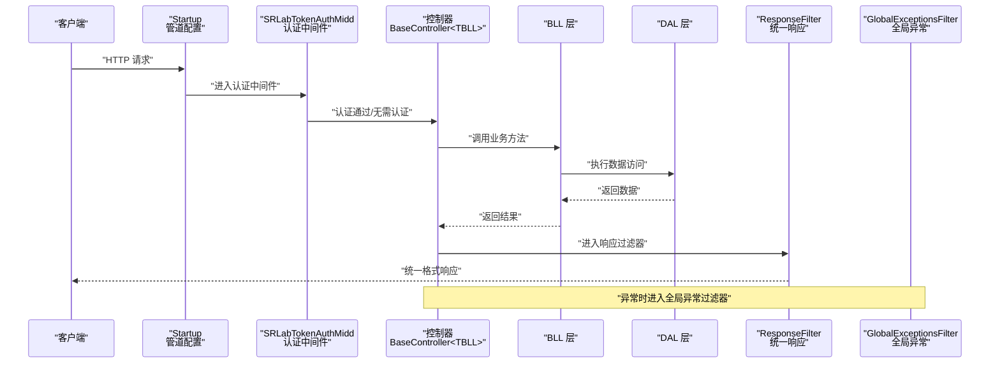
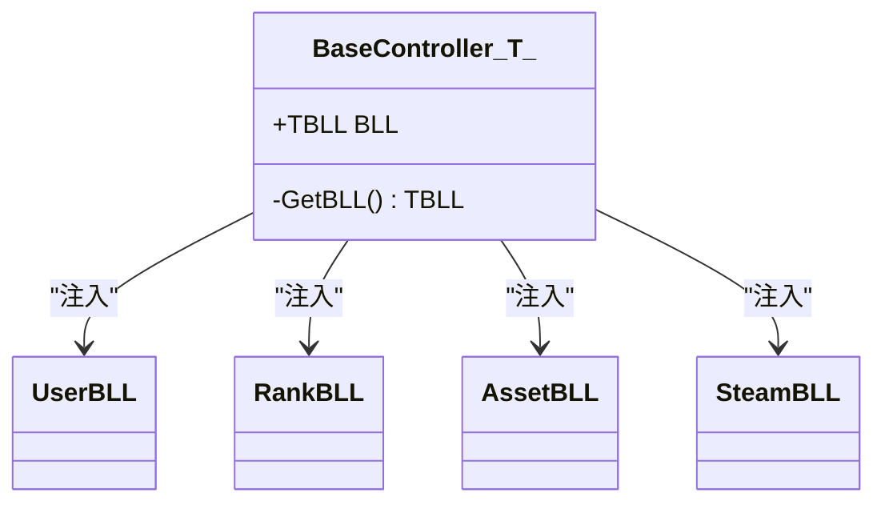
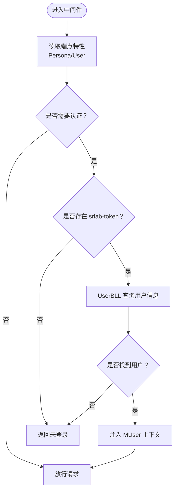
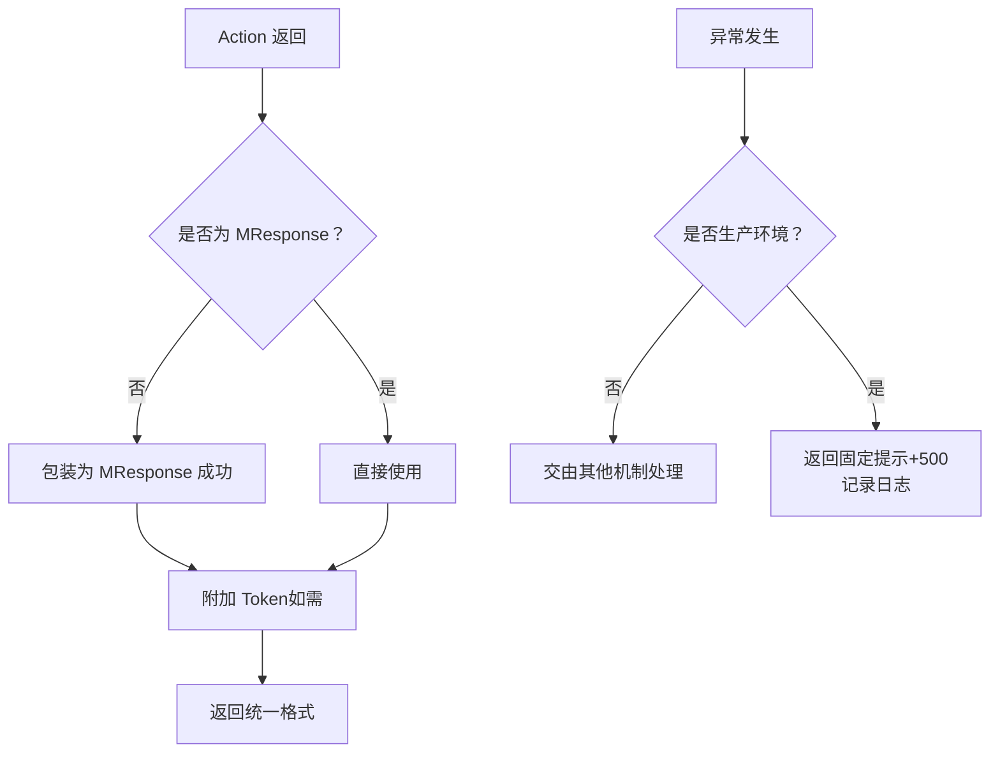
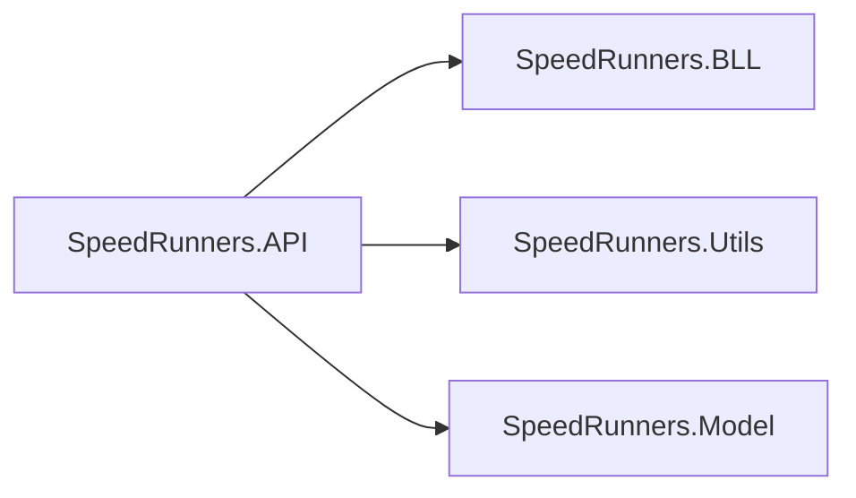

# 后端 API 服务

<cite>
**本文引用的文件**
- [SpeedRunners.API/SpeedRunners/Controllers/BaseController.cs](file://SpeedRunners.API/SpeedRunners/Controllers/BaseController.cs)
- [SpeedRunners.API/SpeedRunners/Controllers/UserController.cs](file://SpeedRunners.API/SpeedRunners/Controllers/UserController.cs)
- [SpeedRunners.API/SpeedRunners/Controllers/RankController.cs](file://SpeedRunners.API/SpeedRunners/Controllers/RankController.cs)
- [SpeedRunners.API/SpeedRunners/Controllers/AssetController.cs](file://SpeedRunners.API/SpeedRunners/Controllers/AssetController.cs)
- [SpeedRunners.API/SpeedRunners/Controllers/SteamController.cs](file://SpeedRunners.API/SpeedRunners/Controllers/SteamController.cs)
- [SpeedRunners.API/SpeedRunners/Startup.cs](file://SpeedRunners.API/SpeedRunners/Startup.cs)
- [SpeedRunners.API/SpeedRunners/Program.cs](file://SpeedRunners.API/SpeedRunners/Program.cs)
- [SpeedRunners.API/SpeedRunners/Filter/GlobalExceptionsFilter.cs](file://SpeedRunners.API/SpeedRunners/Filter/GlobalExceptionsFilter.cs)
- [SpeedRunners.API/SpeedRunners/Filter/ResponseFilter.cs](file://SpeedRunners.API/SpeedRunners/Filter/ResponseFilter.cs)
- [SpeedRunners.API/SpeedRunners/Middleware/SRLabTokenAuthMidd.cs](file://SpeedRunners.API/SpeedRunners/Middleware/SRLabTokenAuthMidd.cs)
- [SpeedRunners.API/SpeedRunners/SpeedRunners.csproj](file://SpeedRunners.API/SpeedRunners/SpeedRunners.csproj)
</cite>

## 目录
1. [简介](#简介)
2. [项目结构](#项目结构)
3. [核心组件](#核心组件)
4. [架构总览](#架构总览)
5. [详细组件分析](#详细组件分析)
6. [依赖分析](#依赖分析)
7. [性能考虑](#性能考虑)
8. [故障排查指南](#故障排查指南)
9. [结论](#结论)
10. [附录](#附录)

## 简介
本文件面向后端开发者，系统性梳理 SpeedRunnersLab 后端 API 的 ASP.NET Core MVC 架构与分层设计，阐明控制器层、业务逻辑层（BLL）、数据访问层（DAL）的职责边界与交互关系；深入解析 BaseController 基类的设计理念与通用能力；总结认证授权、参数校验、错误处理与统一响应格式化的实现；并提供用户管理、排名统计、MOD 管理、Steam 集成等模块的完整接口规范与最佳实践。

## 项目结构
后端 API 采用经典的三层架构（表现层/控制器层、业务逻辑层、数据访问层），配合中间件与过滤器完成认证、响应统一封装与异常拦截。项目以 SpeedRunners.API 为核心，通过项目引用依赖 BLL 与 Utils、Model 层，形成清晰的分层与解耦。

```mermaid
graph TB
subgraph "表现层API 控制器"
UC["UserController"]
RC["RankController"]
AC["AssetController"]
SC["SteamController"]
BC["BaseController<TBLL>"]
end
subgraph "业务逻辑层BLL"
UBLL["UserBLL"]
RBLL["RankBLL"]
ABLL["AssetBLL"]
SBLL["SteamBLL"]
end
subgraph "数据访问层DAL"
UDAL["UserDAL"]
R DAL["RankDAL"]
ADAL["AssetDAL"]
end
subgraph "基础设施"
MW["SRLabTokenAuthMidd"]
GF["GlobalExceptionsFilter"]
RF["ResponseFilter"]
ST["Startup"]
end
UC --> BC --> UBLL --> UDAL
RC --> BC --> RBLL --> R DAL
AC --> BC --> ABLL --> ADAL
SC --> BC --> SBLL
ST --> MW --> RF --> GF
```

图表来源
- [SpeedRunners.API/SpeedRunners/Controllers/BaseController.cs](file://SpeedRunners.API/SpeedRunners/Controllers/BaseController.cs#L1-L26)
- [SpeedRunners.API/SpeedRunners/Controllers/UserController.cs](file://SpeedRunners.API/SpeedRunners/Controllers/UserController.cs#L1-L58)
- [SpeedRunners.API/SpeedRunners/Controllers/RankController.cs](file://SpeedRunners.API/SpeedRunners/Controllers/RankController.cs#L1-L48)
- [SpeedRunners.API/SpeedRunners/Controllers/AssetController.cs](file://SpeedRunners.API/SpeedRunners/Controllers/AssetController.cs#L1-L48)
- [SpeedRunners.API/SpeedRunners/Controllers/SteamController.cs](file://SpeedRunners.API/SpeedRunners/Controllers/SteamController.cs#L1-L28)
- [SpeedRunners.API/SpeedRunners/Startup.cs](file://SpeedRunners.API/SpeedRunners/Startup.cs#L33-L84)
- [SpeedRunners.API/SpeedRunners/Middleware/SRLabTokenAuthMidd.cs](file://SpeedRunners.API/SpeedRunners/Middleware/SRLabTokenAuthMidd.cs#L1-L123)
- [SpeedRunners.API/SpeedRunners/Filter/GlobalExceptionsFilter.cs](file://SpeedRunners.API/SpeedRunners/Filter/GlobalExceptionsFilter.cs#L1-L54)
- [SpeedRunners.API/SpeedRunners/Filter/ResponseFilter.cs](file://SpeedRunners.API/SpeedRunners/Filter/ResponseFilter.cs#L1-L114)

章节来源
- [SpeedRunners.API/SpeedRunners/SpeedRunners.csproj](file://SpeedRunners.API/SpeedRunners/SpeedRunners.csproj#L1-L33)

## 核心组件
- BaseController<TBLL>：控制器基类，负责按需从 DI 容器解析具体 BLL 实例，并注入当前用户上下文、本地化资源与 HttpContext，减少控制器重复代码。
- 控制器层：各模块控制器（UserController、RankController、AssetController、SteamController）仅承担路由、参数绑定与调用 BLL 的职责，保持薄控制器。
- 过滤器：全局异常过滤器与响应过滤器分别负责异常拦截与统一响应封装。
- 中间件：自定义令牌认证中间件，基于端点特性判断是否需要认证，校验 srlab-token 并注入当前用户上下文。

章节来源
- [SpeedRunners.API/SpeedRunners/Controllers/BaseController.cs](file://SpeedRunners.API/SpeedRunners/Controllers/BaseController.cs#L1-L26)
- [SpeedRunners.API/SpeedRunners/Controllers/UserController.cs](file://SpeedRunners.API/SpeedRunners/Controllers/UserController.cs#L1-L58)
- [SpeedRunners.API/SpeedRunners/Controllers/RankController.cs](file://SpeedRunners.API/SpeedRunners/Controllers/RankController.cs#L1-L48)
- [SpeedRunners.API/SpeedRunners/Controllers/AssetController.cs](file://SpeedRunners.API/SpeedRunners/Controllers/AssetController.cs#L1-L48)
- [SpeedRunners.API/SpeedRunners/Controllers/SteamController.cs](file://SpeedRunners.API/SpeedRunners/Controllers/SteamController.cs#L1-L28)
- [SpeedRunners.API/SpeedRunners/Filter/GlobalExceptionsFilter.cs](file://SpeedRunners.API/SpeedRunners/Filter/GlobalExceptionsFilter.cs#L1-L54)
- [SpeedRunners.API/SpeedRunners/Filter/ResponseFilter.cs](file://SpeedRunners.API/SpeedRunners/Filter/ResponseFilter.cs#L1-L114)
- [SpeedRunners.API/SpeedRunners/Middleware/SRLabTokenAuthMidd.cs](file://SpeedRunners.API/SpeedRunners/Middleware/SRLabTokenAuthMidd.cs#L1-L123)

## 架构总览
下图展示请求在启动配置、中间件、控制器与 BLL 之间的流转过程，以及统一响应与异常拦截的处理链路。



图表来源
- [SpeedRunners.API/SpeedRunners/Startup.cs](file://SpeedRunners.API/SpeedRunners/Startup.cs#L64-L84)
- [SpeedRunners.API/SpeedRunners/Middleware/SRLabTokenAuthMidd.cs](file://SpeedRunners.API/SpeedRunners/Middleware/SRLabTokenAuthMidd.cs#L31-L47)
- [SpeedRunners.API/SpeedRunners/Filter/ResponseFilter.cs](file://SpeedRunners.API/SpeedRunners/Filter/ResponseFilter.cs#L24-L50)
- [SpeedRunners.API/SpeedRunners/Filter/GlobalExceptionsFilter.cs](file://SpeedRunners.API/SpeedRunners/Filter/GlobalExceptionsFilter.cs#L31-L51)

## 详细组件分析

### BaseController 基类设计
- 设计理念：通过泛型约束 TBLL : BaseBLL，使控制器可按需注入对应 BLL；延迟解析避免一次性加载所有 BLL；同时注入当前用户上下文、本地化与 HttpContext，便于在 BLL 内部进行权限、日志与国际化处理。
- 关键点：
  - 使用 Lazy<T> 从 DI 解析 BLL 与 IStringLocalizer，按需实例化。
  - 将 MUser 注入 BLL，携带 TokenID、PlatformID、Browser、LoginDate 等上下文信息。
  - 将 HttpContext 赋予 BLL，便于读取请求头、查询字符串等。



图表来源
- [SpeedRunners.API/SpeedRunners/Controllers/BaseController.cs](file://SpeedRunners.API/SpeedRunners/Controllers/BaseController.cs#L10-L23)

章节来源
- [SpeedRunners.API/SpeedRunners/Controllers/BaseController.cs](file://SpeedRunners.API/SpeedRunners/Controllers/BaseController.cs#L1-L26)

### 认证授权与中间件
- 端点特性驱动：通过 PersonaAttribute 与 UserAttribute 标注端点是否需要认证；中间件根据特性与请求头 srlab-token 判断放行或返回未登录提示。
- 当认证通过时，中间件从 UserBLL 查询 Token 对应用户信息，填充 MUser 上下文（含 TokenID、PlatformID、Browser、LoginDate），供后续流程使用。
- 未认证且为用户接口时直接拒绝；非用户接口则允许匿名访问。



图表来源
- [SpeedRunners.API/SpeedRunners/Middleware/SRLabTokenAuthMidd.cs](file://SpeedRunners.API/SpeedRunners/Middleware/SRLabTokenAuthMidd.cs#L54-L101)

章节来源
- [SpeedRunners.API/SpeedRunners/Middleware/SRLabTokenAuthMidd.cs](file://SpeedRunners.API/SpeedRunners/Middleware/SRLabTokenAuthMidd.cs#L1-L123)

### 统一响应与异常处理
- 统一响应：ResponseFilter 在 ActionExecuted 阶段将任意返回值包装为 MResponse，支持 EmptyResult、ObjectResult 与已为 MResponse 的结果；并根据端点特性刷新 Token。
- 异常处理：GlobalExceptionsFilter 在生产环境捕获未处理异常，返回固定提示与 500 状态码，并记录日志（含请求路径、Body 与堆栈）。



图表来源
- [SpeedRunners.API/SpeedRunners/Filter/ResponseFilter.cs](file://SpeedRunners.API/SpeedRunners/Filter/ResponseFilter.cs#L24-L50)
- [SpeedRunners.API/SpeedRunners/Filter/GlobalExceptionsFilter.cs](file://SpeedRunners.API/SpeedRunners/Filter/GlobalExceptionsFilter.cs#L31-L51)

章节来源
- [SpeedRunners.API/SpeedRunners/Filter/ResponseFilter.cs](file://SpeedRunners.API/SpeedRunners/Filter/ResponseFilter.cs#L1-L114)
- [SpeedRunners.API/SpeedRunners/Filter/GlobalExceptionsFilter.cs](file://SpeedRunners.API/SpeedRunners/Filter/GlobalExceptionsFilter.cs#L1-L54)

### 控制器层职责与交互
- UserController：用户信息、隐私设置、状态与等级类型、登录登出、多端 Token 管理等。
- RankController：排行榜列表、新增分数趋势、小时榜、异步拉取 SR 数据、初始化用户数据、参与活动、赞助商与参与列表。
- AssetController：七牛云上传 Token、下载 URL、MOD 删除、MOD 列表与详情、新增 MOD、点赞与取消、赞助信息。
- SteamController：玩家搜索、玩家列表、URL/SteamID 搜索、在线人数。

章节来源
- [SpeedRunners.API/SpeedRunners/Controllers/UserController.cs](file://SpeedRunners.API/SpeedRunners/Controllers/UserController.cs#L1-L58)
- [SpeedRunners.API/SpeedRunners/Controllers/RankController.cs](file://SpeedRunners.API/SpeedRunners/Controllers/RankController.cs#L1-L48)
- [SpeedRunners.API/SpeedRunners/Controllers/AssetController.cs](file://SpeedRunners.API/SpeedRunners/Controllers/AssetController.cs#L1-L48)
- [SpeedRunners.API/SpeedRunners/Controllers/SteamController.cs](file://SpeedRunners.API/SpeedRunners/Controllers/SteamController.cs#L1-L28)

### RESTful 设计与最佳实践
- 路由风格：控制器上使用 [Route("api/[controller]/[action]")]，接口名即动词 + 动作，语义明确。
- 方法选择：GET 用于查询，POST 用于提交数据；布尔参数通过路径或请求体传递。
- 参数命名：优先使用路径参数与查询参数表达简单值；复杂对象使用 [FromBody]。
- 响应一致性：统一返回 MResponse，包含 Code、Message、Data 与 Token 字段；空结果视为成功。
- 错误处理：异常统一拦截，生产环境返回友好提示；开发环境可通过启动配置启用详细异常页。

章节来源
- [SpeedRunners.API/SpeedRunners/Controllers/UserController.cs](file://SpeedRunners.API/SpeedRunners/Controllers/UserController.cs#L10-L58)
- [SpeedRunners.API/SpeedRunners/Controllers/RankController.cs](file://SpeedRunners.API/SpeedRunners/Controllers/RankController.cs#L11-L48)
- [SpeedRunners.API/SpeedRunners/Controllers/AssetController.cs](file://SpeedRunners.API/SpeedRunners/Controllers/AssetController.cs#L12-L48)
- [SpeedRunners.API/SpeedRunners/Controllers/SteamController.cs](file://SpeedRunners.API/SpeedRunners/Controllers/SteamController.cs#L8-L28)
- [SpeedRunners.API/SpeedRunners/Filter/ResponseFilter.cs](file://SpeedRunners.API/SpeedRunners/Filter/ResponseFilter.cs#L24-L50)
- [SpeedRunners.API/SpeedRunners/Filter/GlobalExceptionsFilter.cs](file://SpeedRunners.API/SpeedRunners/Filter/GlobalExceptionsFilter.cs#L31-L51)

## 依赖分析
- 项目引用：API 层引用 BLL、Utils、Model 三个子项目，形成清晰的分层依赖。
- 服务注册：Startup 中注册 CORS、全局过滤器、BLL 批量注册、本地化与代理设置。
- 运行时：Program 中配置日志（Log4Net）与 Kestrel 选项。



图表来源
- [SpeedRunners.API/SpeedRunners/SpeedRunners.csproj](file://SpeedRunners.API/SpeedRunners/SpeedRunners.csproj#L26-L29)
- [SpeedRunners.API/SpeedRunners/Startup.cs](file://SpeedRunners.API/SpeedRunners/Startup.cs#L33-L62)
- [SpeedRunners.API/SpeedRunners/Program.cs](file://SpeedRunners.API/SpeedRunners/Program.cs#L14-L30)

章节来源
- [SpeedRunners.API/SpeedRunners/SpeedRunners.csproj](file://SpeedRunners.API/SpeedRunners/SpeedRunners.csproj#L1-L33)
- [SpeedRunners.API/SpeedRunners/Startup.cs](file://SpeedRunners.API/SpeedRunners/Startup.cs#L33-L62)
- [SpeedRunners.API/SpeedRunners/Program.cs](file://SpeedRunners.API/SpeedRunners/Program.cs#L1-L33)

## 性能考虑
- 延迟解析：BaseController 使用 Lazy<T> 按需解析 BLL，降低启动时内存占用与初始化成本。
- 过滤器与中间件：统一响应与异常处理在管线末端执行，避免重复封装与异常扩散。
- IO 配置：Startup 中允许同步 IO，便于兼容部分第三方库；建议在可控范围内评估异步替代方案。
- 日志：生产环境使用 Log4Net 记录异常，注意磁盘 IO 与日志轮转策略。

章节来源
- [SpeedRunners.API/SpeedRunners/Controllers/BaseController.cs](file://SpeedRunners.API/SpeedRunners/Controllers/BaseController.cs#L14-L23)
- [SpeedRunners.API/SpeedRunners/Startup.cs](file://SpeedRunners.API/SpeedRunners/Startup.cs#L54-L57)
- [SpeedRunners.API/SpeedRunners/Filter/GlobalExceptionsFilter.cs](file://SpeedRunners.API/SpeedRunners/Filter/GlobalExceptionsFilter.cs#L42-L49)

## 故障排查指南
- 未登录访问受限接口：检查 srlab-token 是否存在与有效；确认端点是否标注 User 或 Persona 特性。
- 统一响应未生效：确认 ResponseFilter 是否注册并处于管线正确位置；检查控制器返回类型是否被正确识别。
- 生产环境异常无详情：确认 GlobalExceptionsFilter 是否在生产环境启用；查看日志输出定位异常堆栈。
- Token 刷新问题：检查 Refresh 配置项与 MAccessToken 更新逻辑；确认浏览器与服务端时间一致。

章节来源
- [SpeedRunners.API/SpeedRunners/Middleware/SRLabTokenAuthMidd.cs](file://SpeedRunners.API/SpeedRunners/Middleware/SRLabTokenAuthMidd.cs#L54-L101)
- [SpeedRunners.API/SpeedRunners/Filter/ResponseFilter.cs](file://SpeedRunners.API/SpeedRunners/Filter/ResponseFilter.cs#L57-L111)
- [SpeedRunners.API/SpeedRunners/Filter/GlobalExceptionsFilter.cs](file://SpeedRunners.API/SpeedRunners/Filter/GlobalExceptionsFilter.cs#L31-L51)

## 结论
本项目通过 BaseController 抽象、中间件与过滤器的协同，实现了清晰的分层架构与统一的响应/异常处理机制。控制器层薄而专注，BLL 层承担业务编排，DAL 层隔离数据访问细节。结合端点特性驱动的认证策略与统一响应格式，整体具备良好的可维护性与扩展性。

## 附录

### API 接口规范（按模块）

- 用户管理（UserController）
  - 获取用户信息
    - 方法：GET
    - 路由：/api/User/GetInfo
    - 权限：Persona
    - 返回：MResponse 包裹 MRankInfo
  - 获取隐私设置
    - 方法：GET
    - 路由：/api/User/GetPrivacySettings
    - 权限：Persona
    - 返回：MResponse 包裹 MPrivacySettings
  - 设置状态
    - 方法：POST
    - 路由：/api/User/SetState
    - 权限：User
    - 请求体：包含 value（整数）
    - 返回：MResponse
  - 设置等级类型
    - 方法：POST
    - 路由：/api/User/SetRankType
    - 权限：User
    - 请求体：包含 value（整数）
    - 返回：MResponse
  - 设置周游玩时长可见性
    - 方法：POST
    - 路由：/api/User/SetShowWeekPlayTime
    - 权限：User
    - 请求体：包含 value（整数）
    - 返回：MResponse
  - 设置请求排行数据
    - 方法：POST
    - 路由：/api/User/SetRequestRankData
    - 权限：User
    - 请求体：包含 value（整数）
    - 返回：MResponse
  - 设置加分可见性
    - 方法：POST
    - 路由：/api/User/SetShowAddScore
    - 权限：User
    - 请求体：包含 value（整数）
    - 返回：MResponse
  - 登录
    - 方法：POST
    - 路由：/api/User/Login
    - 权限：匿名
    - 请求体：包含 query（字符串）
    - 返回：MResponse
  - 下线其他设备
    - 方法：GET
    - 路由：/api/User/LogoutOther/{tokenID}
    - 权限：User
    - 返回：MResponse
  - 本地上线
    - 方法：GET
    - 路由：/api/User/LogoutLocal
    - 权限：User
    - 返回：MResponse

- 排名统计（RankController）
  - 获取排行榜列表
    - 方法：GET
    - 路由：/api/Rank/GetRankList
    - 权限：Persona
    - 返回：MResponse 包裹 List<MRankInfo>
  - 获取新增分数趋势
    - 方法：GET
    - 路由：/api/Rank/GetAddedChart
    - 权限：匿名
    - 返回：MResponse 包裹 List<MRankInfo>
  - 获取小时榜
    - 方法：GET
    - 路由：/api/Rank/GetHourChart
    - 权限：Persona
    - 返回：MResponse 包裹 List<MRankInfo>
  - 异步拉取 SR 数据
    - 方法：GET
    - 路由：/api/Rank/AsyncSRData
    - 权限：User
    - 返回：MResponse
  - 初始化用户数据
    - 方法：GET
    - 路由：/api/Rank/InitUserData
    - 权限：User
    - 返回：MResponse
  - 获取游玩 SR 列表
    - 方法：GET
    - 路由：/api/Rank/GetPlaySRList
    - 权限：Persona
    - 返回：MResponse 包裹 List<MRankInfo>
  - 更新参与状态
    - 方法：GET
    - 路由：/api/Rank/UpdateParticipate/{participate}
    - 权限：User
    - 返回：MResponse
  - 获取赞助商
    - 方法：GET
    - 路由：/api/Rank/GetSponsor
    - 权限：匿名
    - 返回：MResponse 包裹 List<MSponsor>
  - 获取参与列表
    - 方法：GET
    - 路由：/api/Rank/GetParticipateList
    - 权限：匿名
    - 返回：MResponse 包裹 List<MParticipateList>

- MOD 管理（AssetController）
  - 获取上传 Token
    - 方法：GET
    - 路由：/api/Asset/GetUploadToken
    - 权限：User
    - 返回：MResponse 包裹字符串数组
  - 获取下载地址
    - 方法：POST
    - 路由：/api/Asset/GetDownloadUrl
    - 权限：User
    - 请求体：包含 fileName（字符串）
    - 返回：MResponse 包裹字符串
  - 删除 MOD
    - 方法：POST
    - 路由：/api/Asset/DeleteMod
    - 权限：User
    - 请求体：MDeleteMod
    - 返回：MResponse
  - 获取 MOD 列表
    - 方法：POST
    - 路由：/api/Asset/GetModList
    - 权限：Persona
    - 请求体：MModPageParam
    - 返回：MResponse 包裹 MPageResult<MModOut>
  - 获取 MOD 详情
    - 方法：GET
    - 路由：/api/Asset/GetMod/{modID}
    - 权限：Persona
    - 返回：MResponse 包裹 MModOut
  - 新增 MOD
    - 方法：POST
    - 路由：/api/Asset/AddMod
    - 权限：User
    - 请求体：MMod
    - 返回：MResponse
  - 操作 MOD 点赞
    - 方法：GET
    - 路由：/api/Asset/OperateModStar/{modID}/{star}
    - 权限：User
    - 返回：MResponse
  - 获取赞助信息
    - 方法：GET
    - 路由：/api/Asset/GetAfdianSponsor
    - 权限：匿名
    - 返回：MResponse

- Steam 集成（SteamController）
  - 搜索玩家
    - 方法：GET
    - 路由：/api/Steam/SearchPlayer/{keyWords}
    - 权限：匿名
    - 返回：MResponse 包裹 MSearchPlayerResult
  - 获取玩家列表
    - 方法：GET
    - 路由：/api/Steam/GetPlayerList/{userName}/{sessionID}/{pageNo}
    - 权限：匿名
    - 返回：MResponse 包裹 MSearchPlayerResult
  - 通过 URL 搜索玩家
    - 方法：GET
    - 路由：/api/Steam/SearchPlayerByUrl/{url}
    - 权限：匿名
    - 返回：MResponse 包裹 MSearchPlayerResult
  - 通过 SteamID64 搜索玩家
    - 方法：GET
    - 路由：/api/Steam/SearchPlayerBySteamID64/{steamID64}
    - 权限：匿名
    - 返回：MResponse 包裹 MSearchPlayerResult
  - 获取在线人数
    - 方法：GET
    - 路由：/api/Steam/GetOnlineCount
    - 权限：匿名
    - 返回：MResponse 包裹 uint

章节来源
- [SpeedRunners.API/SpeedRunners/Controllers/UserController.cs](file://SpeedRunners.API/SpeedRunners/Controllers/UserController.cs#L10-L58)
- [SpeedRunners.API/SpeedRunners/Controllers/RankController.cs](file://SpeedRunners.API/SpeedRunners/Controllers/RankController.cs#L11-L48)
- [SpeedRunners.API/SpeedRunners/Controllers/AssetController.cs](file://SpeedRunners.API/SpeedRunners/Controllers/AssetController.cs#L12-L48)
- [SpeedRunners.API/SpeedRunners/Controllers/SteamController.cs](file://SpeedRunners.API/SpeedRunners/Controllers/SteamController.cs#L8-L28)