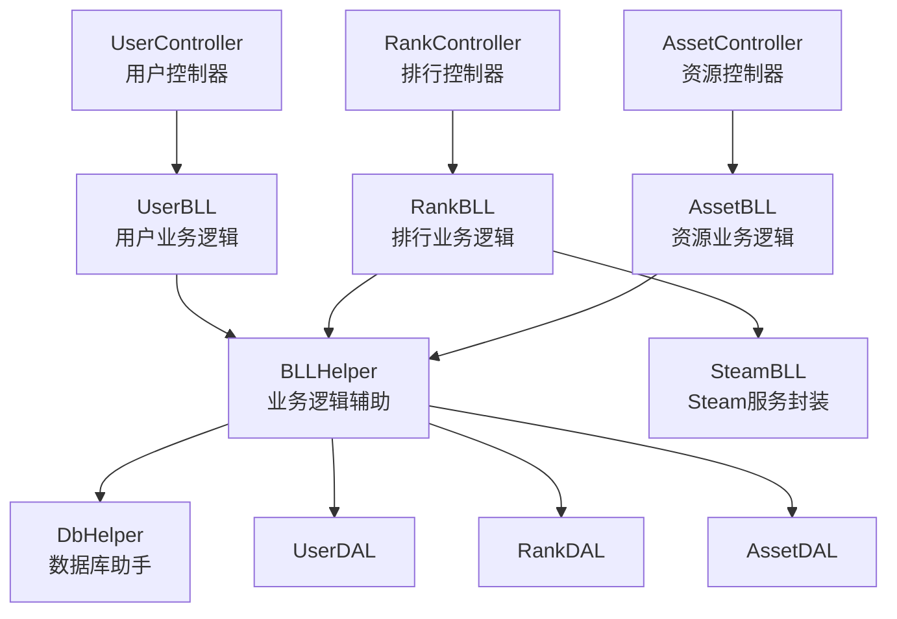
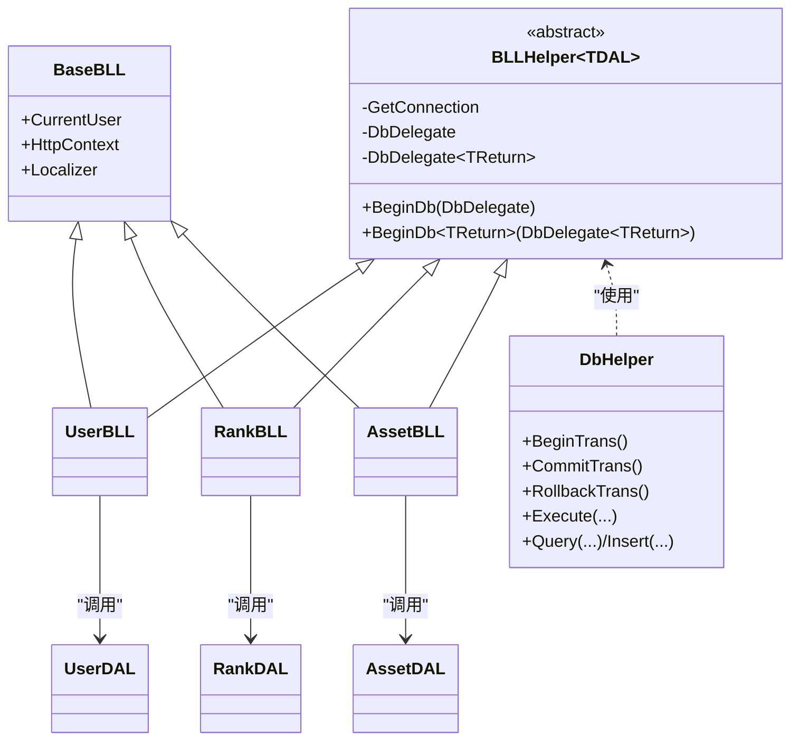
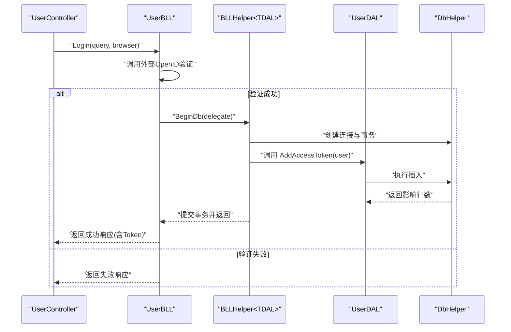
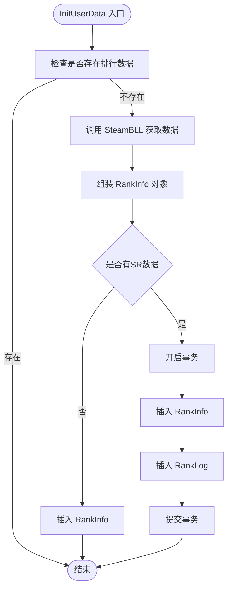
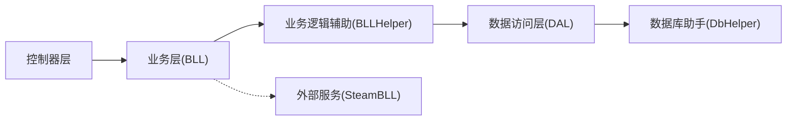

# 业务逻辑辅助

<cite>
**本文引用的文件**
- [BLLHelper.cs](file://SpeedRunners.API/SpeedRunners.Utils/BLLHelper.cs)
- [BaseBLL.cs](file://SpeedRunners.API/SpeedRunners.Utils/BaseBLL.cs)
- [DbHelper.cs](file://SpeedRunners.API/SpeedRunners.Utils/DbHelper.cs)
- [CommonUtils.cs](file://SpeedRunners.API/SpeedRunners.Utils/CommonUtils.cs)
- [UserBLL.cs](file://SpeedRunners.API/SpeedRunners.BLL/UserBLL.cs)
- [RankBLL.cs](file://SpeedRunners.API/SpeedRunners.BLL/RankBLL.cs)
- [AssetBLL.cs](file://SpeedRunners.API/SpeedRunners.BLL/AssetBLL.cs)
- [UserDAL.cs](file://SpeedRunners.API/SpeedRunners.DAL/UserDAL.cs)
- [RankDAL.cs](file://SpeedRunners.API/SpeedRunners.DAL/RankDAL.cs)
- [AssetDAL.cs](file://SpeedRunners.API/SpeedRunners.DAL/AssetDAL.cs)
- [UserController.cs](file://SpeedRunners.API/SpeedRunners/Controllers/UserController.cs)
- [RankController.cs](file://SpeedRunners.API/SpeedRunners/Controllers/RankController.cs)
- [AssetController.cs](file://SpeedRunners.API/SpeedRunners/Controllers/AssetController.cs)
- [SteamBLL.cs](file://SpeedRunners.API/SpeedRunners.BLL/SteamBLL.cs)
</cite>

## 目录
1. [简介](#简介)
2. [项目结构](#项目结构)
3. [核心组件](#核心组件)
4. [架构总览](#架构总览)
5. [组件详解](#组件详解)
6. [依赖关系分析](#依赖关系分析)
7. [性能考量](#性能考量)
8. [故障排查指南](#故障排查指南)
9. [结论](#结论)
10. [附录](#附录)

## 简介
本文围绕 BLLHelper 业务逻辑辅助类展开，系统梳理其在业务层的封装职责与协作机制，重点覆盖以下方面：
- 业务规则验证、数据转换与流程控制的实现方式
- 与 DAL 层的交互模式与数据传递路径
- 通用方法（如数据校验、格式转换、状态管理）的设计与复用策略
- 错误处理与事务回滚机制
- 可扩展性与可维护性建议
- 实际使用示例与最佳实践

## 项目结构
该项目采用典型的三层架构：控制器层负责请求入口与鉴权标注，业务层（BLL）封装业务规则与流程，数据访问层（DAL）负责数据库操作，工具层（Utils）提供通用能力（如数据库助手、公共工具、签名工具等）。BLLHelper 作为抽象基类，统一了业务方法的数据库访问模板与异常处理。

图表来源
- [UserController.cs](file://SpeedRunners.API/SpeedRunners/Controllers/UserController.cs#L1-L58)
- [RankController.cs](file://SpeedRunners.API/SpeedRunners/Controllers/RankController.cs#L1-L48)
- [AssetController.cs](file://SpeedRunners.API/SpeedRunners/Controllers/AssetController.cs#L1-L48)
- [UserBLL.cs](file://SpeedRunners.API/SpeedRunners.BLL/UserBLL.cs#L1-L153)
- [RankBLL.cs](file://SpeedRunners.API/SpeedRunners.BLL/RankBLL.cs#L1-L210)
- [AssetBLL.cs](file://SpeedRunners.API/SpeedRunners.BLL/AssetBLL.cs#L1-L203)
- [BLLHelper.cs](file://SpeedRunners.API/SpeedRunners.Utils/BLLHelper.cs#L1-L73)
- [DbHelper.cs](file://SpeedRunners.API/SpeedRunners.Utils/DbHelper.cs#L1-L283)
- [UserDAL.cs](file://SpeedRunners.API/SpeedRunners.DAL/UserDAL.cs#L1-L85)
- [RankDAL.cs](file://SpeedRunners.API/SpeedRunners.DAL/RankDAL.cs#L1-L175)
- [AssetDAL.cs](file://SpeedRunners.API/SpeedRunners.DAL/AssetDAL.cs#L1-L134)
- [SteamBLL.cs](file://SpeedRunners.API/SpeedRunners.BLL/SteamBLL.cs#L1-L448)

章节来源
- [BLLHelper.cs](file://SpeedRunners.API/SpeedRunners.Utils/BLLHelper.cs#L1-L73)
- [BaseBLL.cs](file://SpeedRunners.API/SpeedRunners.Utils/BaseBLL.cs#L1-L17)
- [DbHelper.cs](file://SpeedRunners.API/SpeedRunners.Utils/DbHelper.cs#L1-L283)

## 核心组件
- BLLHelper<TDAL>：以泛型约束限定具体 DAL 类型，提供统一的数据库访问模板（无返回值与有返回值两种 BeginDb 方法），内置连接创建、事务包装与异常回滚。
- BaseBLL：提供当前用户上下文、HTTP 上下文与本地化器，便于业务层进行权限与国际化处理。
- DbHelper：基于 Dapper 的数据库助手，封装连接、事务、查询与插入等常用操作，支持参数化 SQL 与多结果集查询。
- CommonUtils：提供通用工具方法，如深拷贝、令牌生成、条件拼接等。

章节来源
- [BLLHelper.cs](file://SpeedRunners.API/SpeedRunners.Utils/BLLHelper.cs#L7-L71)
- [BaseBLL.cs](file://SpeedRunners.API/SpeedRunners.Utils/BaseBLL.cs#L7-L15)
- [DbHelper.cs](file://SpeedRunners.API/SpeedRunners.Utils/DbHelper.cs#L11-L281)
- [CommonUtils.cs](file://SpeedRunners.API/SpeedRunners.Utils/CommonUtils.cs#L8-L35)

## 架构总览
BLLHelper 将业务层与数据访问层解耦，通过委托回调的方式将具体业务逻辑注入到数据库访问模板中，确保：
- 统一的连接生命周期管理
- 自动化的异常捕获与事务回滚
- 一致的返回值处理（有/无返回值）
- 易于扩展的泛型约束，适配不同 DAL 类型

图表来源
- [BaseBLL.cs](file://SpeedRunners.API/SpeedRunners.Utils/BaseBLL.cs#L7-L15)
- [BLLHelper.cs](file://SpeedRunners.API/SpeedRunners.Utils/BLLHelper.cs#L7-L71)
- [DbHelper.cs](file://SpeedRunners.API/SpeedRunners.Utils/DbHelper.cs#L11-L281)
- [UserBLL.cs](file://SpeedRunners.API/SpeedRunners.BLL/UserBLL.cs#L16-L24)
- [RankBLL.cs](file://SpeedRunners.API/SpeedRunners.BLL/RankBLL.cs#L14-L21)
- [AssetBLL.cs](file://SpeedRunners.API/SpeedRunners.BLL/AssetBLL.cs#L16-L21)
- [UserDAL.cs](file://SpeedRunners.API/SpeedRunners.DAL/UserDAL.cs#L9-L11)
- [RankDAL.cs](file://SpeedRunners.API/SpeedRunners.DAL/RankDAL.cs#L11-L13)
- [AssetDAL.cs](file://SpeedRunners.API/SpeedRunners.DAL/AssetDAL.cs#L13-L15)

## 组件详解

### BLLHelper 抽象基类
- 泛型约束：TDAL 必须继承自 DALBase，确保所有业务类共享一致的 DAL 契约。
- 数据库委托：
  - 无返回值委托：用于执行 INSERT/UPDATE/DELETE 等操作。
  - 有返回值委托：用于执行 SELECT 查询或需要返回结果的业务逻辑。
- 连接与事务：
  - 通过 AppSettings 获取连接字符串，创建 MySqlConnection 并交由 DbHelper 管理。
  - 在 BeginDb 中自动创建 TDAL 实例，将 DbHelper 注入其中。
  - 异常时统一回滚并释放资源，避免泄漏。
- 适用场景：所有业务类（UserBLL、RankBLL、AssetBLL）均通过该基类统一流程控制。

章节来源
- [BLLHelper.cs](file://SpeedRunners.API/SpeedRunners.Utils/BLLHelper.cs#L7-L71)

### 数据库助手 DbHelper
- 事务管理：BeginTrans/CommitTrans/RollbackTrans 提供显式事务控制。
- Dapper 封装：提供 Insert、Execute、Query、QueryMultiple 等常用方法，支持参数化与多结果集。
- 生命周期：实现 IDisposable，在 Dispose 中关闭连接并清理事务，防止资源泄露。

章节来源
- [DbHelper.cs](file://SpeedRunners.API/SpeedRunners.Utils/DbHelper.cs#L11-L281)

### 业务层实现与协作

#### 用户模块（UserBLL）
- 权限与隐私设置：通过 BeginDb 调用 UserDAL 完成隐私设置与状态/等级类型的更新。
- 登录流程：调用外部 HTTP 接口验证 OpenID，成功后通过 BeginDb 写入访问令牌。
- 令牌管理：根据过期策略判断是否需要刷新，失败时返回标准化响应。
- 删除令牌：校验权限与登录日期，确保仅能删除自身或低权限会话。

图表来源
- [UserController.cs](file://SpeedRunners.API/SpeedRunners/Controllers/UserController.cs#L42-L47)
- [UserBLL.cs](file://SpeedRunners.API/SpeedRunners.BLL/UserBLL.cs#L60-L93)
- [BLLHelper.cs](file://SpeedRunners.API/SpeedRunners.Utils/BLLHelper.cs#L30-L45)
- [UserDAL.cs](file://SpeedRunners.API/SpeedRunners.DAL/UserDAL.cs#L63-L67)
- [DbHelper.cs](file://SpeedRunners.API/SpeedRunners.Utils/DbHelper.cs#L34-L54)

章节来源
- [UserBLL.cs](file://SpeedRunners.API/SpeedRunners.BLL/UserBLL.cs#L26-L151)
- [UserDAL.cs](file://SpeedRunners.API/SpeedRunners.DAL/UserDAL.cs#L13-L82)
- [UserController.cs](file://SpeedRunners.API/SpeedRunners/Controllers/UserController.cs#L14-L56)

#### 排行模块（RankBLL）
- 数据初始化：检查是否存在排行数据，不存在则拉取 Steam 数据并批量写入 RankInfo 与 RankLog，使用事务保证一致性。
- 异步同步：从外部接口获取天梯分，若无则标记为未注册；若有则计算周游玩时长与综合评分，写入日志。
- 列表聚合：对参与排行的玩家进行综合评分排序，处理同名显示问题。

图表来源
- [RankBLL.cs](file://SpeedRunners.API/SpeedRunners.BLL/RankBLL.cs#L102-L155)
- [RankDAL.cs](file://SpeedRunners.API/SpeedRunners.DAL/RankDAL.cs#L121-L147)
- [DbHelper.cs](file://SpeedRunners.API/SpeedRunners.Utils/DbHelper.cs#L34-L54)
- [SteamBLL.cs](file://SpeedRunners.API/SpeedRunners.BLL/SteamBLL.cs#L52-L82)

章节来源
- [RankBLL.cs](file://SpeedRunners.API/SpeedRunners.BLL/RankBLL.cs#L36-L208)
- [RankDAL.cs](file://SpeedRunners.API/SpeedRunners.DAL/RankDAL.cs#L17-L172)
- [RankController.cs](file://SpeedRunners.API/SpeedRunners/Controllers/RankController.cs#L15-L47)

#### 资源模块（AssetBLL）
- 上传令牌：基于七牛云 SDK 生成图片与 Mod 的上传令牌。
- 下载链接：生成私有下载地址并更新下载计数。
- 列表与详情：支持分页列表、星标统计、新内容标识等格式转换。
- 删除资源：先删除数据库记录，再调用七牛云删除文件，失败时返回标准化错误。

章节来源
- [AssetBLL.cs](file://SpeedRunners.API/SpeedRunners.BLL/AssetBLL.cs#L22-L201)
- [AssetDAL.cs](file://SpeedRunners.API/SpeedRunners.DAL/AssetDAL.cs#L16-L131)
- [AssetController.cs](file://SpeedRunners.API/SpeedRunners/Controllers/AssetController.cs#L16-L46)

### 业务规则与数据转换
- 规则验证：
  - 用户令牌删除时校验平台 ID、登录时间与权限等级，避免越权删除。
  - Mod 删除时校验作者身份或管理员权限。
- 数据转换：
  - 排行列表中将周游玩时长与总游玩时长从分钟级转换为小时级展示。
  - 同名处理：对重名玩家添加空格区分，提升可读性。
  - 下载链接与图片 URL 前缀拼接，统一静态资源访问。
- 状态管理：
  - 隐私设置联动 RankType 更新，确保数据一致性。
  - 令牌过期策略：基于创建时间与配置的刷新间隔判断是否失效。

章节来源
- [UserBLL.cs](file://SpeedRunners.API/SpeedRunners.BLL/UserBLL.cs#L121-L150)
- [RankBLL.cs](file://SpeedRunners.API/SpeedRunners.BLL/RankBLL.cs#L44-L60)
- [AssetBLL.cs](file://SpeedRunners.API/SpeedRunners.BLL/AssetBLL.cs#L38-L91)

### 与 DAL 层的交互与数据传递
- 通过 TDAL 实例直接调用 DAL 方法，避免在业务层直接拼接 SQL。
- DAL 层使用 DbHelper 执行参数化查询与批量操作，减少 SQL 注入风险。
- 多结果集查询（如分页查询）通过 DbHelper.QueryMultiple 实现，提升性能与可读性。

章节来源
- [UserBLL.cs](file://SpeedRunners.API/SpeedRunners.BLL/UserBLL.cs#L28-L32)
- [RankBLL.cs](file://SpeedRunners.API/SpeedRunners.BLL/RankBLL.cs#L38-L42)
- [AssetBLL.cs](file://SpeedRunners.API/SpeedRunners.BLL/AssetBLL.cs#L52-L61)
- [UserDAL.cs](file://SpeedRunners.API/SpeedRunners.DAL/UserDAL.cs#L13-L35)
- [RankDAL.cs](file://SpeedRunners.API/SpeedRunners.DAL/RankDAL.cs#L43-L78)
- [AssetDAL.cs](file://SpeedRunners.API/SpeedRunners.DAL/AssetDAL.cs#L43-L72)

### 通用方法与复用策略
- 重复代码提取：
  - 数据库访问模板统一由 BLLHelper 提供，避免每个业务方法重复创建连接、事务与异常处理。
  - 令牌生成与深拷贝等通用逻辑放入 CommonUtils，便于跨模块复用。
- 格式转换与状态管理：
  - 通过 DAL 层完成数据转换（如分钟转小时、同名处理），业务层专注规则与流程。
  - 隐私设置联动 RankType 更新，减少分散的更新点。
- 扩展性：
  - 泛型约束 TDAL 使新增业务类只需继承 BLLHelper 并实现业务方法，无需重复模板代码。

章节来源
- [CommonUtils.cs](file://SpeedRunners.API/SpeedRunners.Utils/CommonUtils.cs#L8-L35)
- [BLLHelper.cs](file://SpeedRunners.API/SpeedRunners.Utils/BLLHelper.cs#L30-L70)

## 依赖关系分析
- 控制器层依赖业务层：控制器仅负责路由与鉴权标注，实际业务逻辑由对应 BLL 执行。
- 业务层依赖辅助层与数据访问层：BLL 通过 BLLHelper 调用 DAL，DAL 通过 DbHelper 执行数据库操作。
- 外部服务集成：SteamBLL 提供 Steam API 封装，供 RankBLL 使用。

图表来源
- [UserController.cs](file://SpeedRunners.API/SpeedRunners/Controllers/UserController.cs#L10-L56)
- [RankController.cs](file://SpeedRunners.API/SpeedRunners/Controllers/RankController.cs#L13-L47)
- [AssetController.cs](file://SpeedRunners.API/SpeedRunners/Controllers/AssetController.cs#L14-L46)
- [UserBLL.cs](file://SpeedRunners.API/SpeedRunners.BLL/UserBLL.cs#L16-L24)
- [RankBLL.cs](file://SpeedRunners.API/SpeedRunners.BLL/RankBLL.cs#L14-L21)
- [AssetBLL.cs](file://SpeedRunners.API/SpeedRunners.BLL/AssetBLL.cs#L16-L21)
- [SteamBLL.cs](file://SpeedRunners.API/SpeedRunners.BLL/SteamBLL.cs#L18-L23)

章节来源
- [UserBLL.cs](file://SpeedRunners.API/SpeedRunners.BLL/UserBLL.cs#L16-L24)
- [RankBLL.cs](file://SpeedRunners.API/SpeedRunners.BLL/RankBLL.cs#L14-L21)
- [AssetBLL.cs](file://SpeedRunners.API/SpeedRunners.BLL/AssetBLL.cs#L16-L21)

## 性能考量
- 参数化查询：DbHelper 与 DAL 均使用参数化 SQL，降低 SQL 注入风险并提升缓存命中率。
- 事务批处理：在需要强一致性的场景（如初始化用户数据）使用事务，减少中间态数据。
- 分页与多结果集：使用 QueryMultiple 一次性返回总数与列表，减少往返次数。
- 外部接口调用：对 Steam API 的调用采用异步方式，避免阻塞主线程。

[本节为通用指导，不直接分析具体文件]

## 故障排查指南
- 数据库连接失败：
  - 检查连接字符串配置是否正确。
  - 关注 BeginDb 中的异常捕获与回滚逻辑，确认事务已正确回滚。
- 事务未提交或回滚：
  - 确认业务流程中是否显式调用了 BeginTrans/CommitTrans/RollbackTrans。
  - 检查异常是否被上抛导致提前退出。
- 外部接口调用失败：
  - 用户登录与 Steam 查询均可能因网络或鉴权失败而返回失败响应，需结合日志定位。
- 权限校验失败：
  - 删除令牌时需严格校验平台 ID、登录时间与权限等级，避免误删。

章节来源
- [BLLHelper.cs](file://SpeedRunners.API/SpeedRunners.Utils/BLLHelper.cs#L35-L44)
- [UserBLL.cs](file://SpeedRunners.API/SpeedRunners.BLL/UserBLL.cs#L121-L140)
- [DbHelper.cs](file://SpeedRunners.API/SpeedRunners.Utils/DbHelper.cs#L34-L54)

## 结论
BLLHelper 通过统一的数据库访问模板与事务管理，显著提升了业务层的可维护性与一致性。配合 DAL 层的参数化查询与 DbHelper 的事务封装，形成清晰的职责边界与高效的协作机制。通过将通用逻辑（如令牌生成、深拷贝、条件拼接）下沉至工具层，进一步降低了重复代码与出错概率。建议在后续扩展中保持：
- 严格的异常与事务处理规范
- 明确的业务规则与数据转换边界
- 对外部服务调用的降级与重试策略

[本节为总结性内容，不直接分析具体文件]

## 附录

### 使用示例（路径指引）
- 用户登录并写入令牌
  - 控制器入口：[UserController.cs](file://SpeedRunners.API/SpeedRunners/Controllers/UserController.cs#L42-L47)
  - 业务逻辑：[UserBLL.cs](file://SpeedRunners.API/SpeedRunners.BLL/UserBLL.cs#L60-L93)
  - 数据访问：[UserDAL.cs](file://SpeedRunners.API/SpeedRunners.DAL/UserDAL.cs#L63-L67)
- 初始化用户排行数据
  - 业务逻辑：[RankBLL.cs](file://SpeedRunners.API/SpeedRunners.BLL/RankBLL.cs#L102-L155)
  - 数据访问：[RankDAL.cs](file://SpeedRunners.API/SpeedRunners.DAL/RankDAL.cs#L121-L147)
- 获取 Mod 列表并转换格式
  - 业务逻辑：[AssetBLL.cs](file://SpeedRunners.API/SpeedRunners.BLL/AssetBLL.cs#L49-L91)
  - 数据访问：[AssetDAL.cs](file://SpeedRunners.API/SpeedRunners.DAL/AssetDAL.cs#L16-L72)

### 最佳实践
- 所有数据库操作统一通过 BLLHelper.BeginDb 包裹，避免遗漏事务与异常处理。
- 数据转换尽量放在 DAL 层，业务层仅关注规则与流程。
- 对外部接口调用增加超时与重试策略，确保用户体验与稳定性。
- 严格遵循最小权限原则，删除令牌等敏感操作必须进行多重校验。

[本节为通用指导，不直接分析具体文件]