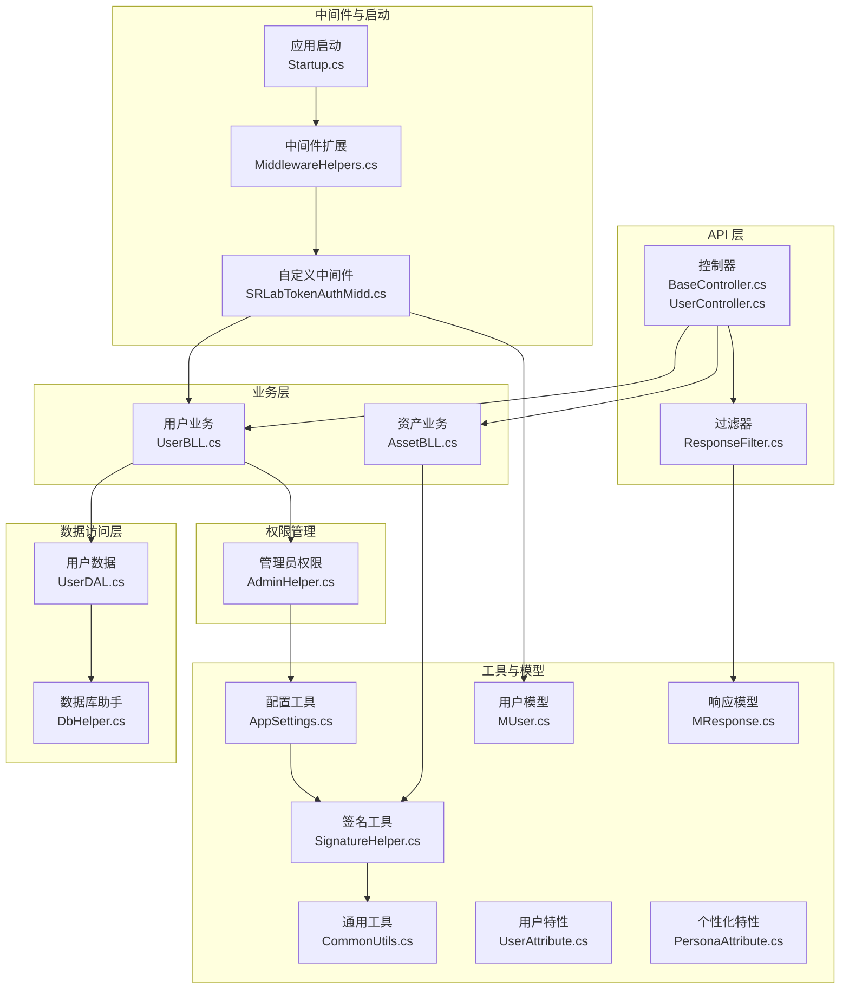
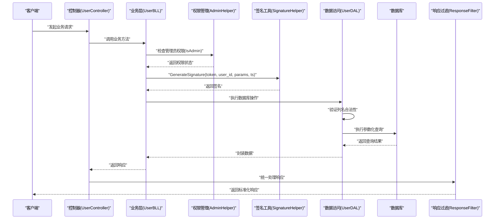
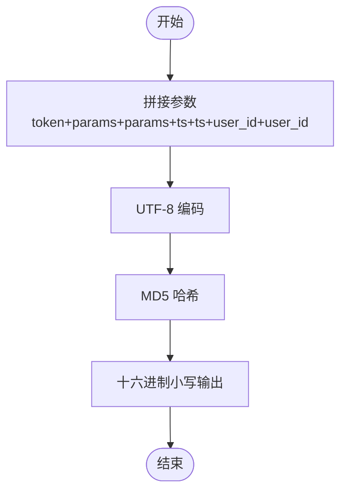
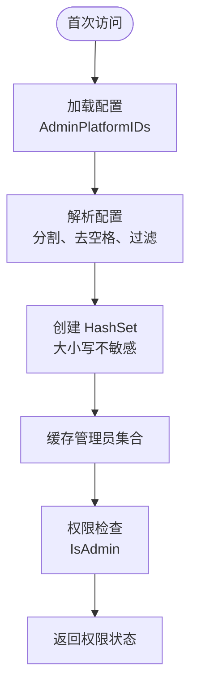
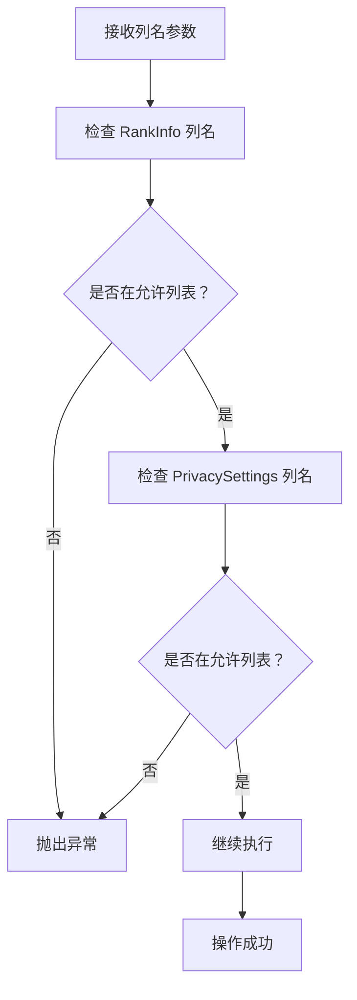
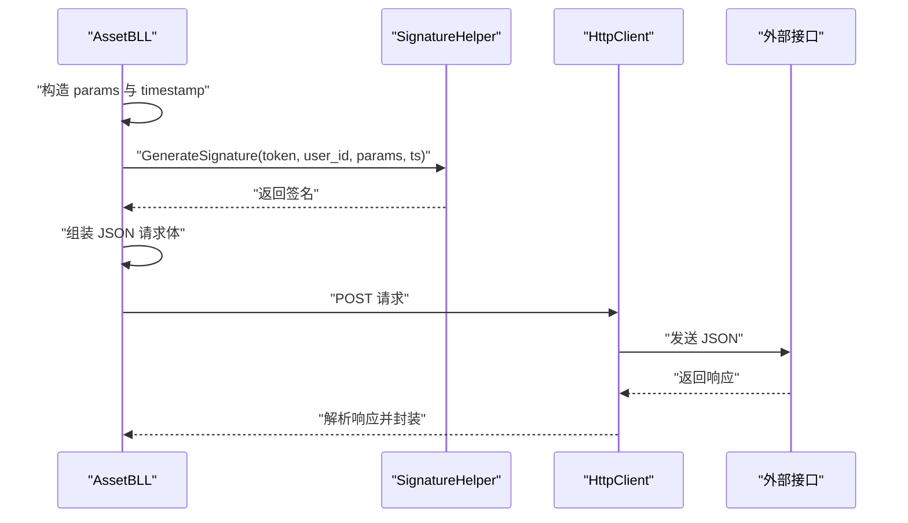
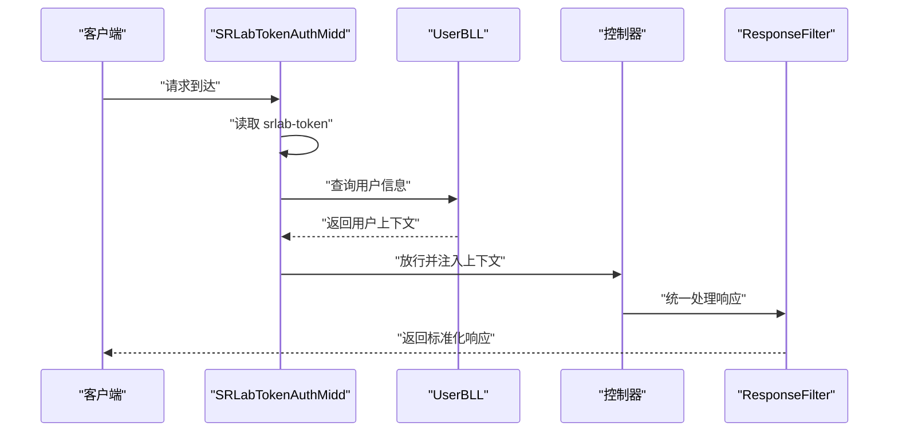
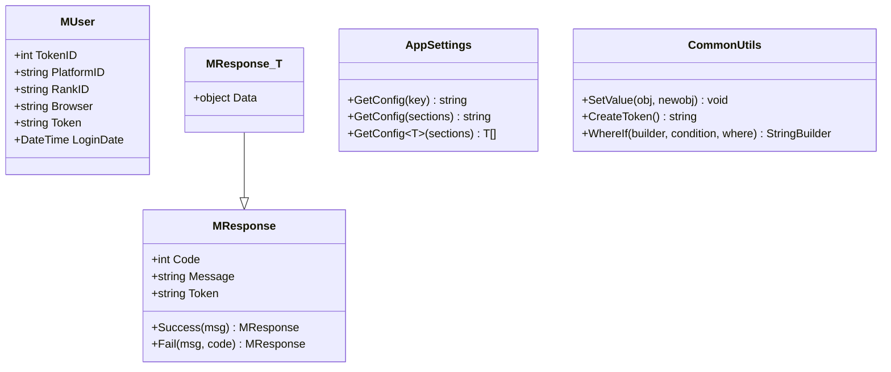
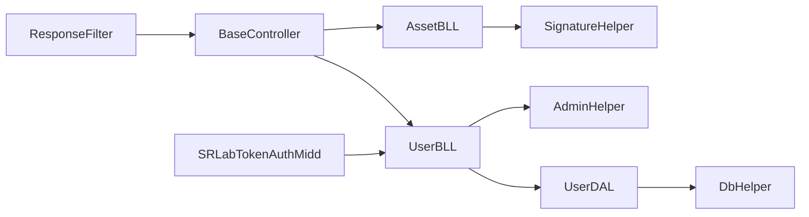

# 安全加密工具

<cite>
**本文引用的文件**
- [SignatureHelper.cs](file://SpeedRunners.API/SpeedRunners.Utils/SignatureHelper.cs)
- [AdminHelper.cs](file://SpeedRunners.API/SpeedRunners.Utils/AdminHelper.cs)
- [AssetBLL.cs](file://SpeedRunners.API/SpeedRunners.BLL/AssetBLL.cs)
- [UserBLL.cs](file://SpeedRunners.API/SpeedRunners.BLL/UserBLL.cs)
- [UserDAL.cs](file://SpeedRunners.API/SpeedRunners.DAL/UserDAL.cs)
- [DbHelper.cs](file://SpeedRunners.API/SpeedRunners.Utils/DbHelper.cs)
- [SRLabTokenAuthMidd.cs](file://SpeedRunners.API/SpeedRunners\Middleware/SRLabTokenAuthMidd.cs)
- [MiddlewareHelpers.cs](file://SpeedRunners.API/SpeedRunners\Middleware/MiddlewareHelpers.cs)
- [Startup.cs](file://SpeedRunners.API/SpeedRunners/Startup.cs)
- [BaseController.cs](file://SpeedRunners.API/SpeedRunners/Controllers/BaseController.cs)
- [UserController.cs](file://SpeedRunners.API/SpeedRunners/Controllers/UserController.cs)
- [ResponseFilter.cs](file://SpeedRunners.API/SpeedRunners/Filter/ResponseFilter.cs)
- [AppSettings.cs](file://SpeedRunners.API/SpeedRunners.Utils/AppSettings.cs)
- [CommonUtils.cs](file://SpeedRunners.API/SpeedRunners.Utils/CommonUtils.cs)
- [MUser.cs](file://SpeedRunners.API/SpeedRunners.Model/MUser.cs)
- [MResponse.cs](file://SpeedRunners.API/SpeedRunners.Model/MResponse.cs)
- [UserAttribute.cs](file://SpeedRunners.API/SpeedRunners.Model/UserAttribute.cs)
- [PersonaAttribute.cs](file://SpeedRunners.API/SpeedRunners.Model/PersonaAttribute.cs)
</cite>

## 更新摘要
**所做更改**
- 新增 AdminHelper 集中式管理员权限检查组件
- 新增 Column Name Validation 防止 SQL 注入的安全机制
- 更新权限管理和安全验证章节
- 新增管理员权限检查的最佳实践

## 目录
1. [简介](#简介)
2. [项目结构](#项目结构)
3. [核心组件](#核心组件)
4. [架构总览](#架构总览)
5. [详细组件分析](#详细组件分析)
6. [依赖关系分析](#依赖关系分析)
7. [性能考量](#性能考量)
8. [故障排查指南](#故障排查指南)
9. [结论](#结论)
10. [附录：使用示例与最佳实践](#附录使用示例与最佳实践)

## 简介
本文件围绕 SignatureHelper 签名验证与安全加密工具进行系统化技术说明，重点涵盖：
- 签名生成算法：参数排序、字符串拼接与哈希计算流程
- 加密解密与摘要算法：MD5 的使用场景与局限性
- 安全验证机制：请求签名验证、响应数据保护与会话管理
- 权限管理增强：新增集中式管理员权限检查
- SQL 注入防护：列名验证机制
- 算法选择与配置：MD5、SHA、AES 等算法的适用性与替代建议
- 实际使用示例：在 API 接口中的签名生成与传递方式
- 安全最佳实践、性能优化与兼容性考虑

## 项目结构
本项目采用分层架构，安全相关逻辑主要集中在 Utils 层（签名工具、权限管理）、BLL 层（业务调用）与 Middleware 层（会话与权限控制）。下图展示了与签名与安全相关的关键模块及其交互。

**图表来源**
- [BaseController.cs:1-26](file://SpeedRunners.API/SpeedRunners/Controllers/BaseController.cs#L1-L26)
- [UserController.cs:1-62](file://SpeedRunners.API/SpeedRunners/Controllers/UserController.cs#L1-L62)
- [ResponseFilter.cs:41-78](file://SpeedRunners.API/SpeedRunners/Filter/ResponseFilter.cs#L41-L78)
- [AssetBLL.cs:160-203](file://SpeedRunners.API/SpeedRunners.BLL/AssetBLL.cs#L160-L203)
- [UserBLL.cs:69-77](file://SpeedRunners.API/SpeedRunners.BLL/UserBLL.cs#L69-L77)
- [AdminHelper.cs:1-38](file://SpeedRunners.API/SpeedRunners.Utils/AdminHelper.cs#L1-L38)
- [UserDAL.cs:12-21](file://SpeedRunners.API/SpeedRunners.DAL/UserDAL.cs#L12-L21)
- [DbHelper.cs:1-200](file://SpeedRunners.API/SpeedRunners.Utils/DbHelper.cs#L1-L200)
- [SRLabTokenAuthMidd.cs:1-123](file://SpeedRunners.API/SpeedRunners\Middleware/SRLabTokenAuthMidd.cs#L1-L123)
- [MiddlewareHelpers.cs:1-41](file://SpeedRunners.API/SpeedRunners\Middleware/MiddlewareHelpers.cs#L1-L41)
- [Startup.cs:64-84](file://SpeedRunners.API/SpeedRunners/Startup.cs#L64-L84)
- [SignatureHelper.cs:1-29](file://SpeedRunners.API/SpeedRunners.Utils/SignatureHelper.cs#L1-L29)
- [AppSettings.cs:1-55](file://SpeedRunners.API/SpeedRunners.Utils/AppSettings.cs#L1-L55)
- [CommonUtils.cs:1-36](file://SpeedRunners.API/SpeedRunners.Utils/CommonUtils.cs#L1-L36)
- [MUser.cs:1-35](file://SpeedRunners.API/SpeedRunners.Model/MUser.cs#L1-L35)
- [MResponse.cs:1-42](file://SpeedRunners.API/SpeedRunners.Model/MResponse.cs#L1-L42)
- [UserAttribute.cs:1-13](file://SpeedRunners.API/SpeedRunners.Model/UserAttribute.cs#L1-L13)
- [PersonaAttribute.cs:1-13](file://SpeedRunners.API/SpeedRunners.Model/PersonaAttribute.cs#L1-L13)

**章节来源**
- [Startup.cs:64-84](file://SpeedRunners.API/SpeedRunners/Startup.cs#L64-L84)
- [MiddlewareHelpers.cs:1-41](file://SpeedRunners.API/SpeedRunners\Middleware/MiddlewareHelpers.cs#L1-L41)

## 核心组件
- SignatureHelper：提供签名生成与 MD5 哈希计算能力，用于对外部接口请求进行签名保护。
- AdminHelper：新增集中式管理员权限检查工具，支持从配置中加载管理员列表并进行权限验证。
- AssetBLL：在调用外部开放接口时，使用 SignatureHelper 生成签名，并将签名随请求体一起发送。
- UserBLL：集成管理员权限检查，在获取用户信息时标记管理员身份。
- UserDAL：实现列名验证机制，防止 SQL 注入攻击。
- SRLabTokenAuthMidd：基于中间件的会话与权限控制，负责从请求头读取令牌、校验用户状态并注入当前用户上下文。
- ResponseFilter：统一处理响应，按接口特性决定是否返回令牌，实现会话管理与响应数据保护。
- MUser、MResponse：用户上下文与统一响应模型，支撑会话与返回数据的标准化。

**章节来源**
- [SignatureHelper.cs:1-29](file://SpeedRunners.API/SpeedRunners.Utils/SignatureHelper.cs#L1-L29)
- [AdminHelper.cs:1-38](file://SpeedRunners.API/SpeedRunners.Utils/AdminHelper.cs#L1-L38)
- [AssetBLL.cs:160-203](file://SpeedRunners.API/SpeedRunners.BLL/AssetBLL.cs#L160-L203)
- [UserBLL.cs:69-77](file://SpeedRunners.API/SpeedRunners.BLL/UserBLL.cs#L69-L77)
- [UserDAL.cs:12-21](file://SpeedRunners.API/SpeedRunners.DAL/UserDAL.cs#L12-L21)
- [SRLabTokenAuthMidd.cs:1-123](file://SpeedRunners.API/SpeedRunners\Middleware/SRLabTokenAuthMidd.cs#L1-L123)
- [ResponseFilter.cs:41-78](file://SpeedRunners.API/SpeedRunners/Filter/ResponseFilter.cs#L41-L78)
- [MUser.cs:1-35](file://SpeedRunners.API/SpeedRunners.Model/MUser.cs#L1-L35)
- [MResponse.cs:1-42](file://SpeedRunners.API/SpeedRunners.Model/MResponse.cs#L1-L42)

## 架构总览
下图展示了"请求签名生成—外部接口调用—响应处理"以及"管理员权限检查—SQL 注入防护"的端到端流程，突出相关安全组件的作用。

**图表来源**
- [UserController.cs:14-77](file://SpeedRunners.API/SpeedRunners/Controllers/UserController.cs#L14-L77)
- [UserBLL.cs:69-77](file://SpeedRunners.API/SpeedRunners.BLL/UserBLL.cs#L69-L77)
- [AdminHelper.cs:27-28](file://SpeedRunners.API/SpeedRunners.Utils/AdminHelper.cs#L27-L28)
- [SignatureHelper.cs:8-12](file://SpeedRunners.API/SpeedRunners.Utils/SignatureHelper.cs#L8-L12)
- [UserDAL.cs:60-73](file://SpeedRunners.API/SpeedRunners.DAL/UserDAL.cs#L60-L73)
- [ResponseFilter.cs:41-78](file://SpeedRunners.API/SpeedRunners/Filter/ResponseFilter.cs#L41-L78)

## 详细组件分析

### SignatureHelper：签名生成与 MD5 哈希
- 参数与拼接规则
  - 输入参数：token、user_id、params（JSON 字符串）、timestamp（秒级时间戳）
  - 拼接格式：将各字段按固定顺序与标识符拼接为待签名字符串
- 哈希计算
  - 使用 MD5 对拼接后的字符串进行哈希
  - 将字节数组转为十六进制小写字符串作为最终签名
- 复杂度与性能
  - 时间复杂度：O(n)，n 为拼接字符串长度
  - 空间复杂度：O(n)
- 安全性评估
  - MD5 已被广泛认为不适合安全用途，易受碰撞攻击
  - 建议在生产环境中替换为 SHA-256 或更高强度的摘要算法

**图表来源**
- [SignatureHelper.cs:8-27](file://SpeedRunners.API/SpeedRunners.Utils/SignatureHelper.cs#L8-L27)

**章节来源**
- [SignatureHelper.cs:1-29](file://SpeedRunners.API/SpeedRunners.Utils/SignatureHelper.cs#L1-L29)

### AdminHelper：集中式管理员权限检查
- 配置管理
  - 从 AppSettings 中读取 AdminPlatformIDs 配置项
  - 支持逗号分隔的多个管理员平台 ID
  - 自动去除空白字符并过滤空值
- 权限验证
  - IsAdmin 方法进行大小写不敏感的权限检查
  - 支持动态配置更新，首次访问时初始化管理员集合
  - 提供 OverrideAdminIdsForTesting 方法用于单元测试覆盖
- 性能优化
  - 使用 HashSet 存储管理员 ID，提供 O(1) 查找性能
  - 延迟初始化，仅在首次使用时加载配置

**图表来源**
- [AdminHelper.cs:11-28](file://SpeedRunners.API/SpeedRunners.Utils/AdminHelper.cs#L11-L28)

**章节来源**
- [AdminHelper.cs:1-38](file://SpeedRunners.API/SpeedRunners.Utils/AdminHelper.cs#L1-L38)
- [UserBLL.cs:74-75](file://SpeedRunners.API/SpeedRunners.BLL/UserBLL.cs#L74-L75)

### Column Name Validation：SQL 注入防护
- 列名白名单机制
  - AllowedRankInfoCols：RankInfo 表允许的列名集合（State、RankType）
  - AllowedPrivacyCols：PrivacySettings 表允许的列名集合（ShowProfile、ShowWeekPlayTime、RequestRankData、ShowAddScore）
- 验证流程
  - 在执行数据库更新前检查列名是否在允许列表中
  - 不在允许列表中的列名抛出 ArgumentException 异常
  - 支持大小写不敏感的比较
- 安全效果
  - 有效防止 SQL 注入攻击
  - 确保只允许预定义的安全列名进行数据库操作

**图表来源**
- [UserDAL.cs:12-21](file://SpeedRunners.API/SpeedRunners.DAL/UserDAL.cs#L12-L21)
- [UserDAL.cs:60-73](file://SpeedRunners.API/SpeedRunners.DAL/UserDAL.cs#L60-L73)

**章节来源**
- [UserDAL.cs:12-21](file://SpeedRunners.API/SpeedRunners.DAL/UserDAL.cs#L12-L21)
- [UserDAL.cs:60-73](file://SpeedRunners.API/SpeedRunners.DAL/UserDAL.cs#L60-L73)

### 调用方实现：AssetBLL 中的签名使用
- 生成参数
  - 构造 JSON 字符串形式的 params
  - 生成当前时间戳
  - 调用 SignatureHelper 生成签名
- 组装请求体
  - 将 user_id、params、ts、sign 组装为 JSON 并发送
- 错误处理
  - 对外部接口返回的状态码进行判断，封装统一响应

**图表来源**
- [AssetBLL.cs:160-203](file://SpeedRunners.API/SpeedRunners.BLL/AssetBLL.cs#L160-L203)
- [SignatureHelper.cs:8-12](file://SpeedRunners.API/SpeedRunners.Utils/SignatureHelper.cs#L8-L12)

**章节来源**
- [AssetBLL.cs:160-203](file://SpeedRunners.API/SpeedRunners.BLL/AssetBLL.cs#L160-L203)

### 会话与权限控制：中间件与响应过滤
- 中间件 SRLabTokenAuthMidd
  - 从请求头读取令牌
  - 通过特性判断是否需要认证
  - 查询用户信息并注入当前用户上下文
- 响应过滤 ResponseFilter
  - 根据接口特性决定是否返回令牌
  - 统一刷新返回 Token，保障会话一致性

**图表来源**
- [SRLabTokenAuthMidd.cs:31-101](file://SpeedRunners.API/SpeedRunners\Middleware/SRLabTokenAuthMidd.cs#L31-L101)
- [ResponseFilter.cs:41-78](file://SpeedRunners.API/SpeedRunners/Filter/ResponseFilter.cs#L41-L78)
- [UserBLL.cs:114-152](file://SpeedRunners.API/SpeedRunners.BLL/UserBLL.cs#L114-L152)

**章节来源**
- [SRLabTokenAuthMidd.cs:1-123](file://SpeedRunners.API/SpeedRunners\Middleware/SRLabTokenAuthMidd.cs#L1-L123)
- [ResponseFilter.cs:41-78](file://SpeedRunners.API/SpeedRunners/Filter/ResponseFilter.cs#L41-L78)
- [UserBLL.cs:114-152](file://SpeedRunners.API/SpeedRunners.BLL/UserBLL.cs#L114-L152)

### 数据模型与配置
- MUser：承载当前用户上下文（令牌 ID、平台 ID、浏览器、令牌、登录时间等）
- MResponse：统一响应结构（Code、Message、Token、Data），配合扩展方法实现链式调用
- AppSettings：集中读取配置项，便于在签名与业务中使用
- CommonUtils：提供通用工具方法，如令牌生成等

**图表来源**
- [MUser.cs:1-35](file://SpeedRunners.API/SpeedRunners.Model/MUser.cs#L1-L35)
- [MResponse.cs:1-42](file://SpeedRunners.API/SpeedRunners.Model/MResponse.cs#L1-L42)
- [AppSettings.cs:1-55](file://SpeedRunners.API/SpeedRunners.Utils/AppSettings.cs#L1-L55)
- [CommonUtils.cs:1-36](file://SpeedRunners.API/SpeedRunners.Utils/CommonUtils.cs#L1-L36)

**章节来源**
- [MUser.cs:1-35](file://SpeedRunners.API/SpeedRunners.Model/MUser.cs#L1-L35)
- [MResponse.cs:1-42](file://SpeedRunners.API/SpeedRunners.Model/MResponse.cs#L1-L42)
- [AppSettings.cs:1-55](file://SpeedRunners.API/SpeedRunners.Utils/AppSettings.cs#L1-L55)
- [CommonUtils.cs:1-36](file://SpeedRunners.API/SpeedRunners.Utils/CommonUtils.cs#L1-L36)

## 依赖关系分析
- 调用链
  - 控制器 -> 业务层 -> 签名工具 -> 外部接口
  - 中间件 -> 用户服务 -> 控制器
  - 过滤器 -> 控制器 -> 客户端
  - 业务层 -> 权限管理 -> 数据访问层
- 关键耦合点
  - AssetBLL 依赖 SignatureHelper 生成签名
  - UserBLL 依赖 AdminHelper 进行权限检查
  - UserDAL 依赖列名验证机制防止 SQL 注入
  - 中间件依赖 UserBLL 查询用户信息
  - 过滤器依赖接口特性决定是否返回令牌
- 可能的循环依赖
  - 未发现直接循环依赖；若后续扩展 BLL 与中间件互相调用需谨慎设计

**图表来源**
- [BaseController.cs:1-26](file://SpeedRunners.API/SpeedRunners/Controllers/BaseController.cs#L1-L26)
- [AssetBLL.cs:160-203](file://SpeedRunners.API/SpeedRunners.BLL/AssetBLL.cs#L160-L203)
- [SignatureHelper.cs:1-29](file://SpeedRunners.API/SpeedRunners.Utils/SignatureHelper.cs#L1-L29)
- [UserBLL.cs:69-77](file://SpeedRunners.API/SpeedRunners.BLL/UserBLL.cs#L69-L77)
- [AdminHelper.cs:1-38](file://SpeedRunners.API/SpeedRunners.Utils/AdminHelper.cs#L1-L38)
- [UserDAL.cs:12-21](file://SpeedRunners.API/SpeedRunners.DAL/UserDAL.cs#L12-L21)
- [DbHelper.cs:1-200](file://SpeedRunners.API/SpeedRunners.Utils/DbHelper.cs#L1-L200)
- [SRLabTokenAuthMidd.cs:1-123](file://SpeedRunners.API/SpeedRunners\Middleware/SRLabTokenAuthMidd.cs#L1-L123)
- [ResponseFilter.cs:41-78](file://SpeedRunners.API/SpeedRunners/Filter/ResponseFilter.cs#L41-L78)

**章节来源**
- [BaseController.cs:1-26](file://SpeedRunners.API/SpeedRunners/Controllers/BaseController.cs#L1-L26)
- [AssetBLL.cs:160-203](file://SpeedRunners.API/SpeedRunners.BLL/AssetBLL.cs#L160-L203)
- [SignatureHelper.cs:1-29](file://SpeedRunners.API/SpeedRunners.Utils/SignatureHelper.cs#L1-L29)
- [UserBLL.cs:69-77](file://SpeedRunners.API/SpeedRunners.BLL/UserBLL.cs#L69-L77)
- [AdminHelper.cs:1-38](file://SpeedRunners.API/SpeedRunners.Utils/AdminHelper.cs#L1-L38)
- [UserDAL.cs:12-21](file://SpeedRunners.API/SpeedRunners.DAL/UserDAL.cs#L12-L21)
- [DbHelper.cs:1-200](file://SpeedRunners.API/SpeedRunners.Utils/DbHelper.cs#L1-L200)
- [SRLabTokenAuthMidd.cs:1-123](file://SpeedRunners.API/SpeedRunners\Middleware/SRLabTokenAuthMidd.cs#L1-L123)
- [ResponseFilter.cs:41-78](file://SpeedRunners.API/SpeedRunners/Filter/ResponseFilter.cs#L41-L78)

## 性能考量
- 签名生成
  - MD5 计算开销极低，适合高频调用
  - 若替换为 SHA-256，CPU 开销将显著增加，需评估吞吐量与延迟
- 权限检查
  - AdminHelper 使用 HashSet 进行 O(1) 查找，性能优异
  - 延迟初始化避免不必要的配置加载
- SQL 注入防护
  - 列名验证在执行数据库操作前进行，开销极小
  - 白名单机制比正则表达式更高效
- 字符串拼接与编码
  - UTF-8 编码与十六进制拼接均为常数因子，整体线性
- I/O 与网络
  - 外部接口调用为主要瓶颈，建议结合连接池、超时与重试策略
- 内存占用
  - 建议复用 StringBuilder 与 HttpClient，避免频繁分配

## 故障排查指南
- 签名不匹配
  - 检查参数顺序与标识符是否一致
  - 确认时间戳是否为秒级且未过期
  - 核对 token 与 user_id 是否正确
- 令牌无效或过期
  - 中间件返回未登录时，检查请求头是否包含 srlab-token
  - 确认用户令牌在数据库中存在且未被删除
- 响应未返回令牌
  - 检查接口是否标注了用户特性，未标注则不会返回令牌
- 外部接口调用失败
  - 查看响应状态码与错误信息，确认签名与请求体格式
- 权限检查失败
  - 确认 AdminPlatformIDs 配置是否正确
  - 检查管理员 ID 是否区分大小写
  - 验证配置文件格式（逗号分隔）
- SQL 注入防护触发
  - 检查数据库操作中使用的列名是否在允许列表中
  - 确认列名大小写是否正确
  - 验证数据库表结构是否包含该列

**章节来源**
- [SRLabTokenAuthMidd.cs:31-101](file://SpeedRunners.API/SpeedRunners\Middleware/SRLabTokenAuthMidd.cs#L31-L101)
- [ResponseFilter.cs:41-78](file://SpeedRunners.API/SpeedRunners/Filter/ResponseFilter.cs#L41-L78)
- [AssetBLL.cs:160-203](file://SpeedRunners.API/SpeedRunners.BLL/AssetBLL.cs#L160-L203)
- [AdminHelper.cs:17-28](file://SpeedRunners.API/SpeedRunners.Utils/AdminHelper.cs#L17-L28)
- [UserDAL.cs:60-73](file://SpeedRunners.API/SpeedRunners.DAL/UserDAL.cs#L60-L73)

## 结论
- SignatureHelper 提供了简单可靠的签名生成能力，适用于轻量级安全场景
- 新增的 AdminHelper 实现了集中式的管理员权限检查，提高了权限管理的可维护性
- Column Name Validation 机制有效防止了 SQL 注入攻击，增强了数据库安全性
- 生产环境建议将 MD5 替换为 SHA-256 或更高强度的摘要算法
- 会话与权限控制通过中间件与过滤器实现，具备良好的可维护性
- 建议结合外部接口的签名规范，统一参数命名与时间戳策略

## 附录：使用示例与最佳实践

### 使用示例：在 API 中正确实现签名验证与数据加密
- 生成签名
  - 准备参数：token、user_id、params（JSON 字符串）、timestamp（秒级）
  - 调用签名工具生成 sign
  - 将 sign 与其它参数一起放入请求体发送
- 接收方验证
  - 重新按相同规则拼接字符串
  - 计算哈希并与请求中的签名比对
  - 校验时间戳有效期与用户身份

**章节来源**
- [AssetBLL.cs:160-203](file://SpeedRunners.API/SpeedRunners.BLL/AssetBLL.cs#L160-L203)
- [SignatureHelper.cs:8-12](file://SpeedRunners.API/SpeedRunners.Utils/SignatureHelper.cs#L8-L12)

### 管理员权限检查最佳实践
- 配置管理
  - 在配置文件中维护 AdminPlatformIDs，使用逗号分隔多个管理员 ID
  - 支持大小写不敏感的权限检查
  - 定期审查和更新管理员列表
- 权限验证
  - 在关键操作前调用 AdminHelper.IsAdmin 进行权限验证
  - 对于敏感操作，建议同时检查用户身份和权限级别
  - 在日志中记录权限检查结果，便于审计

**章节来源**
- [AdminHelper.cs:17-28](file://SpeedRunners.API/SpeedRunners.Utils/AdminHelper.cs#L17-L28)
- [UserBLL.cs:74-75](file://SpeedRunners.API/SpeedRunners.BLL/UserBLL.cs#L74-L75)

### SQL 注入防护最佳实践
- 列名验证
  - 为每个数据库表维护允许的列名白名单
  - 使用大小写不敏感的比较确保安全性
  - 在执行数据库操作前始终进行列名验证
- 参数化查询
  - 确保所有数据库操作都使用参数化查询
  - 避免动态拼接 SQL 语句
  - 使用 ORM 或数据库助手类进行安全的数据访问

**章节来源**
- [UserDAL.cs:12-21](file://SpeedRunners.API/SpeedRunners.DAL/UserDAL.cs#L12-L21)
- [UserDAL.cs:60-73](file://SpeedRunners.API/SpeedRunners.DAL/UserDAL.cs#L60-L73)
- [DbHelper.cs:103-106](file://SpeedRunners.API/SpeedRunners.Utils/DbHelper.cs#L103-L106)

### 安全最佳实践
- 算法升级
  - 将 MD5 替换为 SHA-256 或更高强度摘要算法
  - 如需防篡改与防重放，引入随机 nonce 与有效期控制
- 密钥与令牌管理
  - 严格保密 token，限制其作用域与有效期
  - 定期轮换密钥，启用撤销机制
- 传输安全
  - 使用 HTTPS 传输，防止中间人攻击
  - 对敏感字段进行最小化暴露
- 日志与监控
  - 记录签名验证失败事件，设置告警阈值
  - 监控外部接口调用成功率与延迟
  - 记录权限检查和 SQL 注入防护事件

### 性能优化
- 复用资源
  - 复用 HttpClient 与 StringBuilder，减少 GC 压力
- 批处理与缓存
  - 对外部接口的重复请求进行缓存，降低调用频率
- 异步与并发
  - 使用异步 I/O 与合理并发，避免阻塞主线程
- 权限缓存
  - AdminHelper 已内置缓存机制，避免重复配置加载

### 兼容性考虑
- 字符集与编码
  - 统一使用 UTF-8 编码，避免不同平台差异
- 时间戳与时区
  - 明确时间戳单位（秒/毫秒），确保双方一致
- 版本演进
  - 保持签名规则稳定，必要时通过版本号区分
- 配置兼容
  - AdminPlatformIDs 配置支持空格和重复值的自动清理
  - 列名验证机制向后兼容现有数据库操作