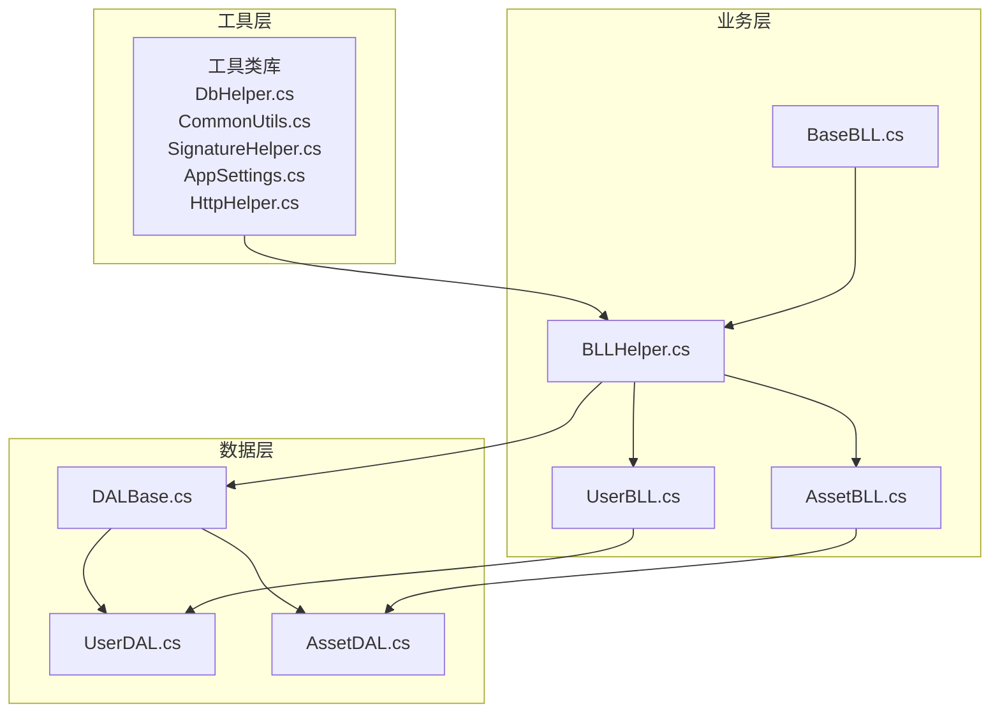
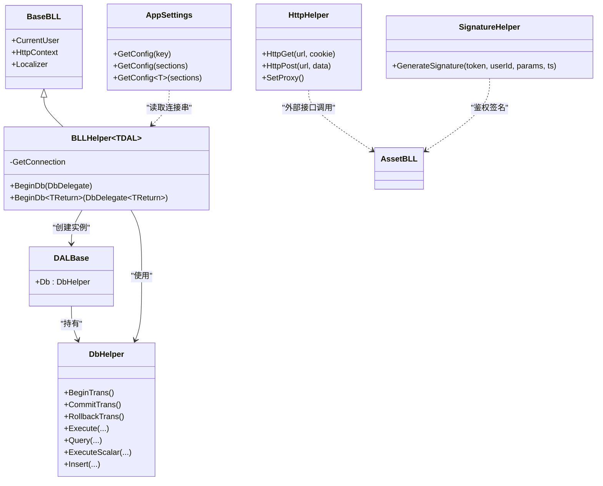
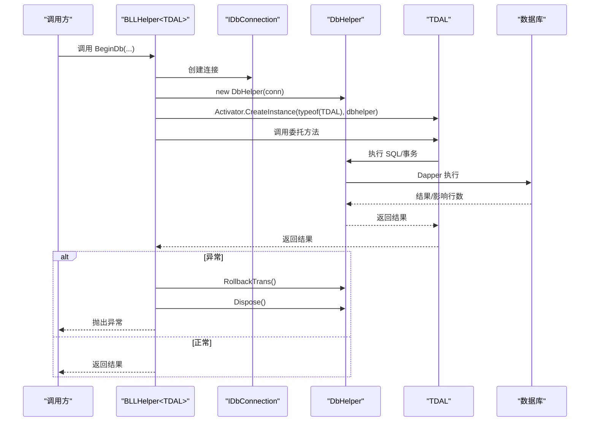
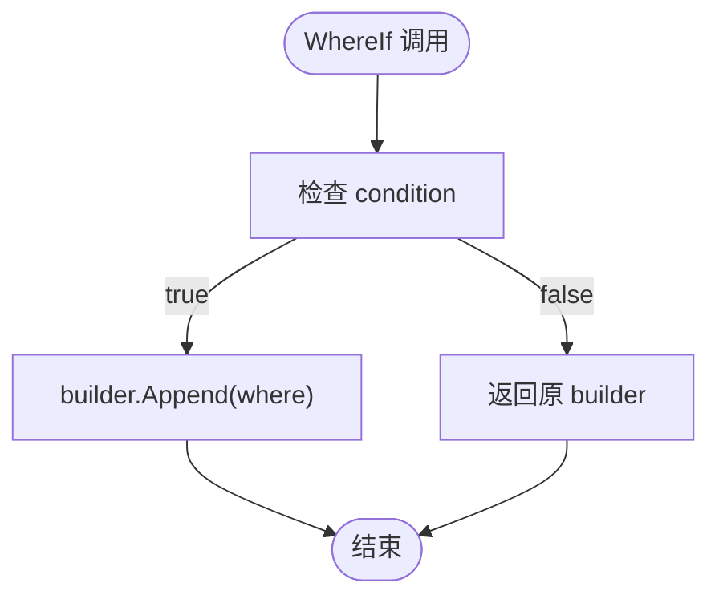
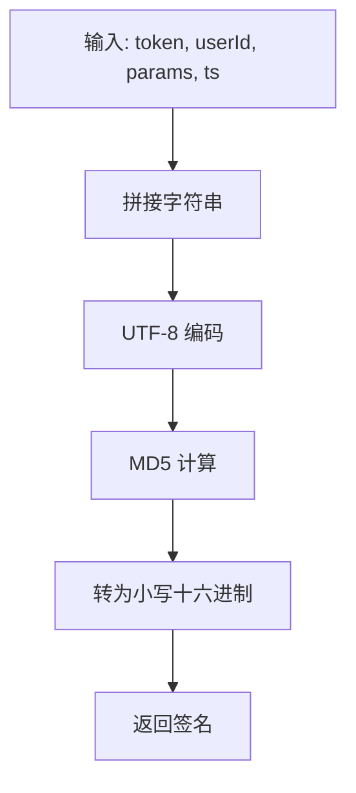
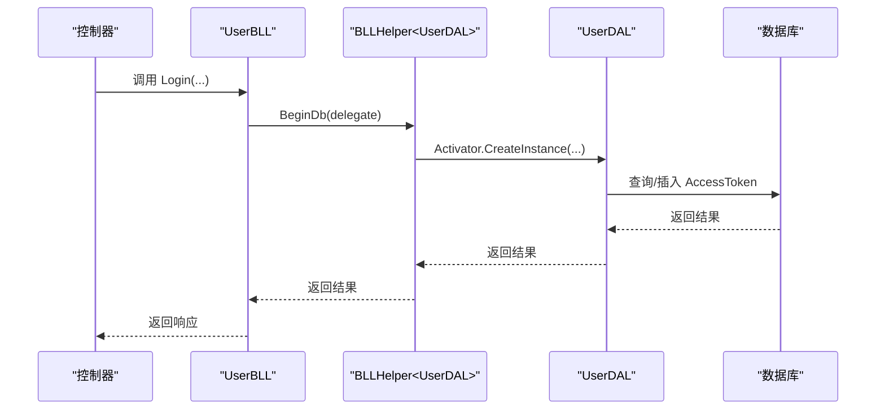
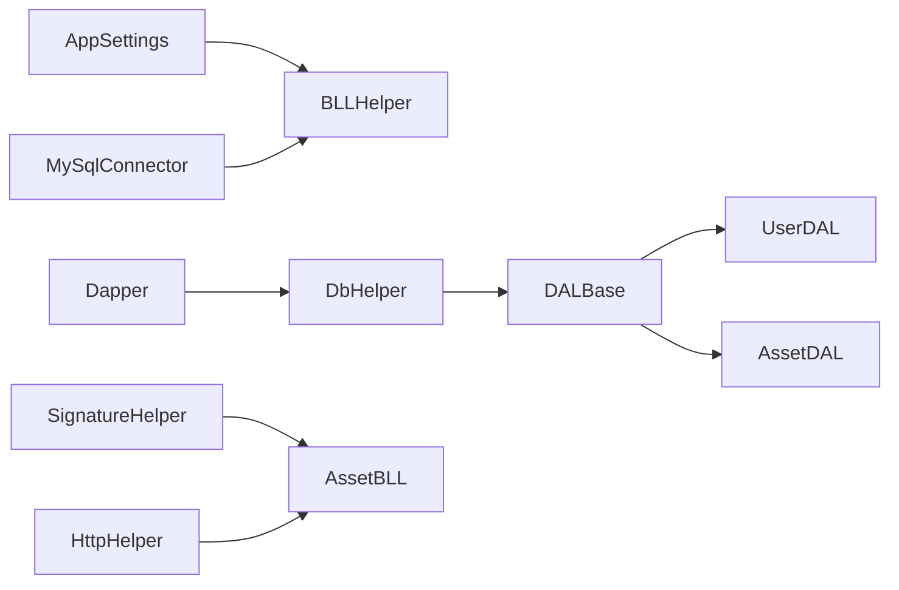

# 工具类库

<cite>
**本文引用的文件**
- [DbHelper.cs](file://SpeedRunners.API/SpeedRunners.Utils/DbHelper.cs)
- [CommonUtils.cs](file://SpeedRunners.API/SpeedRunners.Utils/CommonUtils.cs)
- [SignatureHelper.cs](file://SpeedRunners.API/SpeedRunners.Utils/SignatureHelper.cs)
- [BLLHelper.cs](file://SpeedRunners.API/SpeedRunners.Utils/BLLHelper.cs)
- [DALBase.cs](file://SpeedRunners.API/SpeedRunners.Utils/DALBase.cs)
- [BaseBLL.cs](file://SpeedRunners.API/SpeedRunners.Utils/BaseBLL.cs)
- [AppSettings.cs](file://SpeedRunners.API/SpeedRunners.Utils/AppSettings.cs)
- [HttpHelper.cs](file://SpeedRunners.API/SpeedRunners.Utils/HttpHelper.cs)
- [UserBLL.cs](file://SpeedRunners.API/SpeedRunners.BLL/UserBLL.cs)
- [AssetBLL.cs](file://SpeedRunners.API/SpeedRunners.BLL/AssetBLL.cs)
- [UserDAL.cs](file://SpeedRunners.API/SpeedRunners.DAL/UserDAL.cs)
- [AssetDAL.cs](file://SpeedRunners.API/SpeedRunners.DAL/AssetDAL.cs)
</cite>

## 目录
1. [简介](#简介)
2. [项目结构](#项目结构)
3. [核心组件](#核心组件)
4. [架构总览](#架构总览)
5. [组件详解](#组件详解)
6. [依赖关系分析](#依赖关系分析)
7. [性能考量](#性能考量)
8. [故障排查指南](#故障排查指南)
9. [结论](#结论)
10. [附录](#附录)

## 简介
本文件面向工具类库的使用者与维护者，系统性解析以下关键模块：
- DbHelper：数据库连接管理、事务控制与 SQL 执行封装（基于 Dapper）
- CommonUtils：通用工具方法（深拷贝、令牌生成、条件拼接）
- SignatureHelper：签名验证机制与安全加密（MD5）
- BLLHelper 与 DALBase：业务层与数据层基类设计模式与复用策略
- AppSettings 与 HttpHelper：配置读取与 HTTP 请求辅助

文档提供架构图、调用流程图、复杂逻辑流程图、最佳实践与扩展建议，帮助开发者正确使用并二次开发。

## 项目结构
工具类库位于 SpeedRunners.API/SpeedRunners.Utils，围绕“业务层-数据层-基础工具”的分层组织，配合 BLLHelper/DALBase 形成可复用的 CRUD 与事务封装。

图表来源
- [DbHelper.cs](file://SpeedRunners.API/SpeedRunners.Utils/DbHelper.cs#L1-L283)
- [CommonUtils.cs](file://SpeedRunners.API/SpeedRunners.Utils/CommonUtils.cs#L1-L36)
- [SignatureHelper.cs](file://SpeedRunners.API/SpeedRunners.Utils/SignatureHelper.cs#L1-L29)
- [BLLHelper.cs](file://SpeedRunners.API/SpeedRunners.Utils/BLLHelper.cs#L1-L73)
- [DALBase.cs](file://SpeedRunners.API/SpeedRunners.Utils/DALBase.cs#L1-L13)
- [BaseBLL.cs](file://SpeedRunners.API/SpeedRunners.Utils/BaseBLL.cs#L1-L17)
- [AppSettings.cs](file://SpeedRunners.API/SpeedRunners.Utils/AppSettings.cs#L1-L55)
- [HttpHelper.cs](file://SpeedRunners.API/SpeedRunners.Utils/HttpHelper.cs#L1-L146)
- [UserBLL.cs](file://SpeedRunners.API/SpeedRunners.BLL/UserBLL.cs#L1-L153)
- [AssetBLL.cs](file://SpeedRunners.API/SpeedRunners.BLL/AssetBLL.cs#L1-L203)
- [UserDAL.cs](file://SpeedRunners.API/SpeedRunners.DAL/UserDAL.cs#L1-L85)
- [AssetDAL.cs](file://SpeedRunners.API/SpeedRunners.DAL/AssetDAL.cs#L1-L134)

章节来源
- [DbHelper.cs](file://SpeedRunners.API/SpeedRunners.Utils/DbHelper.cs#L1-L283)
- [BLLHelper.cs](file://SpeedRunners.API/SpeedRunners.Utils/BLLHelper.cs#L1-L73)
- [DALBase.cs](file://SpeedRunners.API/SpeedRunners.Utils/DALBase.cs#L1-L13)
- [BaseBLL.cs](file://SpeedRunners.API/SpeedRunners.Utils/BaseBLL.cs#L1-L17)
- [AppSettings.cs](file://SpeedRunners.API/SpeedRunners.Utils/AppSettings.cs#L1-L55)
- [HttpHelper.cs](file://SpeedRunners.API/SpeedRunners.Utils/HttpHelper.cs#L1-L146)
- [UserBLL.cs](file://SpeedRunners.API/SpeedRunners.BLL/UserBLL.cs#L1-L153)
- [AssetBLL.cs](file://SpeedRunners.API/SpeedRunners.BLL/AssetBLL.cs#L1-L203)
- [UserDAL.cs](file://SpeedRunners.API/SpeedRunners.DAL/UserDAL.cs#L1-L85)
- [AssetDAL.cs](file://SpeedRunners.API/SpeedRunners.DAL/AssetDAL.cs#L1-L134)

## 核心组件
- DbHelper：对 Dapper 的轻量封装，统一暴露 Execute/Query/ExecuteScalar 等方法，并内置事务生命周期管理。
- CommonUtils：提供深拷贝、令牌生成、条件拼接等常用工具。
- SignatureHelper：基于 MD5 的签名生成器，用于外部接口鉴权。
- BLLHelper<TDAL>：业务层基类，负责连接创建、事务控制、异常回滚与资源释放。
- DALBase：数据层基类，持有 DbHelper 实例，便于在 DAL 中直接执行 SQL。
- AppSettings：集中读取配置，支持键路径与集合绑定。
- HttpHelper：HTTP GET/POST 与代理配置辅助。

章节来源
- [DbHelper.cs](file://SpeedRunners.API/SpeedRunners.Utils/DbHelper.cs#L1-L283)
- [CommonUtils.cs](file://SpeedRunners.API/SpeedRunners.Utils/CommonUtils.cs#L1-L36)
- [SignatureHelper.cs](file://SpeedRunners.API/SpeedRunners.Utils/SignatureHelper.cs#L1-L29)
- [BLLHelper.cs](file://SpeedRunners.API/SpeedRunners.Utils/BLLHelper.cs#L1-L73)
- [DALBase.cs](file://SpeedRunners.API/SpeedRunners.Utils/DALBase.cs#L1-L13)
- [BaseBLL.cs](file://SpeedRunners.API/SpeedRunners.Utils/BaseBLL.cs#L1-L17)
- [AppSettings.cs](file://SpeedRunners.API/SpeedRunners.Utils/AppSettings.cs#L1-L55)
- [HttpHelper.cs](file://SpeedRunners.API/SpeedRunners.Utils/HttpHelper.cs#L1-L146)

## 架构总览
工具类库采用“业务层-数据层-工具层”的分层设计，BLL 层通过 BLLHelper 统一管理连接与事务，DAL 层通过 DbHelper 执行 SQL，工具层提供配置、HTTP 与签名能力。

图表来源
- [BaseBLL.cs](file://SpeedRunners.API/SpeedRunners.Utils/BaseBLL.cs#L1-L17)
- [BLLHelper.cs](file://SpeedRunners.API/SpeedRunners.Utils/BLLHelper.cs#L1-L73)
- [DALBase.cs](file://SpeedRunners.API/SpeedRunners.Utils/DALBase.cs#L1-L13)
- [DbHelper.cs](file://SpeedRunners.API/SpeedRunners.Utils/DbHelper.cs#L1-L283)
- [AppSettings.cs](file://SpeedRunners.API/SpeedRunners.Utils/AppSettings.cs#L1-L55)
- [HttpHelper.cs](file://SpeedRunners.API/SpeedRunners.Utils/HttpHelper.cs#L1-L146)
- [SignatureHelper.cs](file://SpeedRunners.API/SpeedRunners.Utils/SignatureHelper.cs#L1-L29)

## 组件详解

### DbHelper：数据库连接与事务封装
- 连接与事务
  - 构造时接收 IDbConnection，内部持有连接与当前事务句柄。
  - 提供 BeginTrans/CommitTrans/RollbackTrans 生命周期管理，确保异常时自动回滚并释放事务。
- SQL 执行封装
  - 对 Dapper 的 Execute/Query/ExecuteScalar/QueryMultiple 等方法进行轻量封装，统一传入当前事务上下文。
  - 支持泛型查询、多表映射、GridReader 多结果集读取。
- 动态插入
  - Insert<T> 基于反射遍历模型属性，动态拼接列与值，支持移除字段列表，返回自增主键。
- 资源管理
  - 实现 IDisposable，在 Dispose 中关闭连接、释放事务，避免连接泄漏。

图表来源
- [BLLHelper.cs](file://SpeedRunners.API/SpeedRunners.Utils/BLLHelper.cs#L30-L70)
- [DbHelper.cs](file://SpeedRunners.API/SpeedRunners.Utils/DbHelper.cs#L34-L54)
- [UserBLL.cs](file://SpeedRunners.API/SpeedRunners.BLL/UserBLL.cs#L79-L87)

章节来源
- [DbHelper.cs](file://SpeedRunners.API/SpeedRunners.Utils/DbHelper.cs#L11-L283)

### CommonUtils：通用工具方法
- 深拷贝
  - 通过反射遍历属性，将新对象的值赋给旧对象，实现浅拷贝式属性复制。
- 令牌生成
  - 生成包含时间戳的字符串作为临时令牌，便于会话或凭证管理。
- 条件拼接
  - WhereIf 扩展方法，按布尔条件追加 SQL 片段，简化动态条件拼接。

图表来源
- [CommonUtils.cs](file://SpeedRunners.API/SpeedRunners.Utils/CommonUtils.cs#L30-L33)

章节来源
- [CommonUtils.cs](file://SpeedRunners.API/SpeedRunners.Utils/CommonUtils.cs#L1-L36)

### SignatureHelper：签名验证与安全加密
- 签名生成
  - 输入 token、userId、参数字符串、时间戳，按固定顺序拼接后计算 MD5，输出小写十六进制字符串。
- 安全建议
  - 当前使用 MD5，建议结合 HTTPS 传输与强随机 token，必要时升级为更安全的哈希算法（如 SHA-256）以增强抗碰撞能力。

图表来源
- [SignatureHelper.cs](file://SpeedRunners.API/SpeedRunners.Utils/SignatureHelper.cs#L8-L27)

章节来源
- [SignatureHelper.cs](file://SpeedRunners.API/SpeedRunners.Utils/SignatureHelper.cs#L1-L29)

### BLLHelper 与 DALBase：设计模式与复用策略
- 设计要点
  - 泛型约束 TDAL : DALBase，确保业务层只与数据层基类交互。
  - 使用委托封装数据库操作，BLLHelper 在 BeginDb 中负责连接创建、事务控制与异常回滚。
  - DALBase 持有 DbHelper，所有 DAL 方法直接通过 Db 执行 SQL。
- 生命周期
  - 连接与 DbHelper 在 BeginDb 内部 using 管理，确保异常时自动释放。
  - 事务在 BeginTrans/CommitTrans/RollbackTrans 之间受控，避免跨方法泄露。
- 使用示例
  - 用户登录：BLL 调用 BeginDb，内部创建 DAL 并执行插入/查询，异常自动回滚。
  - 资源下载统计：先生成私有链接，再调用 BeginDb 更新下载次数。

图表来源
- [UserBLL.cs](file://SpeedRunners.API/SpeedRunners.BLL/UserBLL.cs#L60-L93)
- [BLLHelper.cs](file://SpeedRunners.API/SpeedRunners.Utils/BLLHelper.cs#L30-L70)
- [UserDAL.cs](file://SpeedRunners.API/SpeedRunners.DAL/UserDAL.cs#L63-L67)

章节来源
- [BLLHelper.cs](file://SpeedRunners.API/SpeedRunners.Utils/BLLHelper.cs#L1-L73)
- [DALBase.cs](file://SpeedRunners.API/SpeedRunners.Utils/DALBase.cs#L1-L13)
- [UserBLL.cs](file://SpeedRunners.API/SpeedRunners.BLL/UserBLL.cs#L1-L153)
- [UserDAL.cs](file://SpeedRunners.API/SpeedRunners.DAL/UserDAL.cs#L1-L85)

### AppSettings：配置读取
- 单键读取：GetConfig(key)
- 路径读取：GetConfig(sections...)，支持冒号分隔的层级键
- 集合绑定：GetConfig<T>(sections...)，通过配置绑定读取数组

章节来源
- [AppSettings.cs](file://SpeedRunners.API/SpeedRunners.Utils/AppSettings.cs#L1-L55)

### HttpHelper：HTTP 请求辅助
- GET/POST：支持超时、Cookie、代理配置
- 代理开关：通过配置 Proxy:Enable 与 Proxy:Address 控制
- 默认 TLS：强制启用 TLS 协议

章节来源
- [HttpHelper.cs](file://SpeedRunners.API/SpeedRunners.Utils/HttpHelper.cs#L1-L146)

## 依赖关系分析
- 组件耦合
  - BLLHelper 依赖 AppSettings 读取连接串，依赖 MySqlConnector 创建连接。
  - DALBase 依赖 DbHelper，所有 DAL 方法通过 DbHelper 执行 SQL。
  - BLL 层通过委托调用 DAL，避免直接依赖具体 DAL 类型。
- 外部依赖
  - Dapper：DbHelper 对其 API 的轻量封装。
  - MySqlConnector：连接提供者。
  - System.Security.Cryptography：SignatureHelper 的 MD5 计算。
- 循环依赖
  - 未发现循环依赖，分层清晰。

图表来源
- [BLLHelper.cs](file://SpeedRunners.API/SpeedRunners.Utils/BLLHelper.cs#L22-L22)
- [DbHelper.cs](file://SpeedRunners.API/SpeedRunners.Utils/DbHelper.cs#L1-L10)
- [UserDAL.cs](file://SpeedRunners.API/SpeedRunners.DAL/UserDAL.cs#L1-L5)
- [AssetDAL.cs](file://SpeedRunners.API/SpeedRunners.DAL/AssetDAL.cs#L1-L9)
- [SignatureHelper.cs](file://SpeedRunners.API/SpeedRunners.Utils/SignatureHelper.cs#L1-L4)
- [HttpHelper.cs](file://SpeedRunners.API/SpeedRunners.Utils/HttpHelper.cs#L1-L6)

章节来源
- [BLLHelper.cs](file://SpeedRunners.API/SpeedRunners.Utils/BLLHelper.cs#L1-L73)
- [DbHelper.cs](file://SpeedRunners.API/SpeedRunners.Utils/DbHelper.cs#L1-L283)
- [UserDAL.cs](file://SpeedRunners.API/SpeedRunners.DAL/UserDAL.cs#L1-L85)
- [AssetDAL.cs](file://SpeedRunners.API/SpeedRunners.DAL/AssetDAL.cs#L1-L134)
- [SignatureHelper.cs](file://SpeedRunners.API/SpeedRunners.Utils/SignatureHelper.cs#L1-L29)
- [HttpHelper.cs](file://SpeedRunners.API/SpeedRunners.Utils/HttpHelper.cs#L1-L146)

## 性能考量
- 连接与事务
  - 使用 using 管理连接与 DbHelper，避免连接泄漏；事务仅在必要时开启，减少锁竞争。
- SQL 执行
  - 优先使用参数化查询，避免拼接 SQL；批量更新/插入尽量合并为单条语句。
- 反射开销
  - Insert<T> 使用反射遍历属性，建议在高频场景下缓存属性元数据或改用显式映射。
- 网络请求
  - HttpHelper 设置超时与代理，建议在高并发场景下限制并发数并复用 HttpClient。

[本节为通用指导，无需特定文件引用]

## 故障排查指南
- 事务未提交/回滚
  - 确认在异常分支调用 RollbackTrans 并 Dispose；检查 BeginDb 是否被 try/catch 包裹。
- 连接泄漏
  - 确保 DbHelper.Dispose 在 finally 或 using 中被调用；避免在外部持有连接。
- 参数化查询无效
  - 检查 SQL 中是否使用了正确的参数占位符；确认 DynamicParameters 传入正确。
- 签名不匹配
  - 确认拼接顺序与大小写一致；校验时间戳与 token 的有效性。
- HTTP 请求失败
  - 检查 Proxy:Enable 与 Proxy:Address 配置；确认 TLS 协议启用。

章节来源
- [DbHelper.cs](file://SpeedRunners.API/SpeedRunners.Utils/DbHelper.cs#L25-L54)
- [BLLHelper.cs](file://SpeedRunners.API/SpeedRunners.Utils/BLLHelper.cs#L35-L44)
- [SignatureHelper.cs](file://SpeedRunners.API/SpeedRunners.Utils/SignatureHelper.cs#L8-L12)
- [HttpHelper.cs](file://SpeedRunners.API/SpeedRunners.Utils/HttpHelper.cs#L28-L34)

## 结论
该工具类库通过 DbHelper 对 Dapper 的轻量封装，结合 BLLHelper/DALBase 的分层设计，提供了简洁可靠的数据库访问与事务控制能力；CommonUtils、SignatureHelper、AppSettings、HttpHelper 则分别覆盖了常用算法、安全签名、配置读取与网络请求。遵循本文的最佳实践与扩展建议，可有效提升系统的稳定性与可维护性。

[本节为总结，无需特定文件引用]

## 附录

### 使用示例与最佳实践
- 登录流程（令牌生成与持久化）
  - 业务层：调用 BeginDb 执行插入 AccessToken；使用 CommonUtils.CreateToken 生成令牌。
  - 数据层：使用 Db.Insert 动态插入，避免硬编码列名。
  - 参考路径：[UserBLL.cs](file://SpeedRunners.API/SpeedRunners.BLL/UserBLL.cs#L77-L87)、[UserDAL.cs](file://SpeedRunners.API/SpeedRunners.DAL/UserDAL.cs#L63-L67)
- 动态条件拼接
  - 使用 CommonUtils.WhereIf 按需拼接 WHERE 条件，避免空条件导致的 SQL 错误。
  - 参考路径：[AssetDAL.cs](file://SpeedRunners.API/SpeedRunners.DAL/AssetDAL.cs#L18-L41)
- 签名验证
  - 调用 SignatureHelper.GenerateSignature 生成签名，配合外部接口鉴权。
  - 参考路径：[AssetBLL.cs](file://SpeedRunners.API/SpeedRunners.BLL/AssetBLL.cs#L167-L175)
- HTTP 请求
  - 通过 HttpHelper.HttpPost 发送表单数据，支持代理与超时控制。
  - 参考路径：[HttpHelper.cs](file://SpeedRunners.API/SpeedRunners.Utils/HttpHelper.cs#L77-L129)

### 扩展指南
- 新增业务层
  - 继承 BLLHelper<TDAL>，在 TDAL 中实现具体数据访问方法，使用 DbHelper 执行 SQL。
  - 参考路径：[UserBLL.cs](file://SpeedRunners.API/SpeedRunners.BLL/UserBLL.cs#L16-L24)
- 新增数据层
  - 继承 DALBase，构造函数注入 DbHelper，所有方法通过 Db 执行。
  - 参考路径：[UserDAL.cs](file://SpeedRunners.API/SpeedRunners.DAL/UserDAL.cs#L9-L11)
- 配置扩展
  - 通过 AppSettings.GetConfig 读取新配置项，避免硬编码。
  - 参考路径：[AppSettings.cs](file://SpeedRunners.API/SpeedRunners.Utils/AppSettings.cs#L16-L52)
- 安全增强
  - 将 SignatureHelper 的 MD5 替换为更强的哈希算法，并引入随机盐值。
  - 参考路径：[SignatureHelper.cs](file://SpeedRunners.API/SpeedRunners.Utils/SignatureHelper.cs#L14-L27)