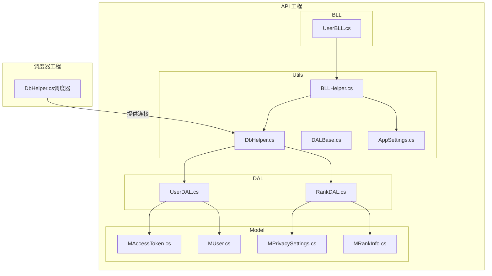
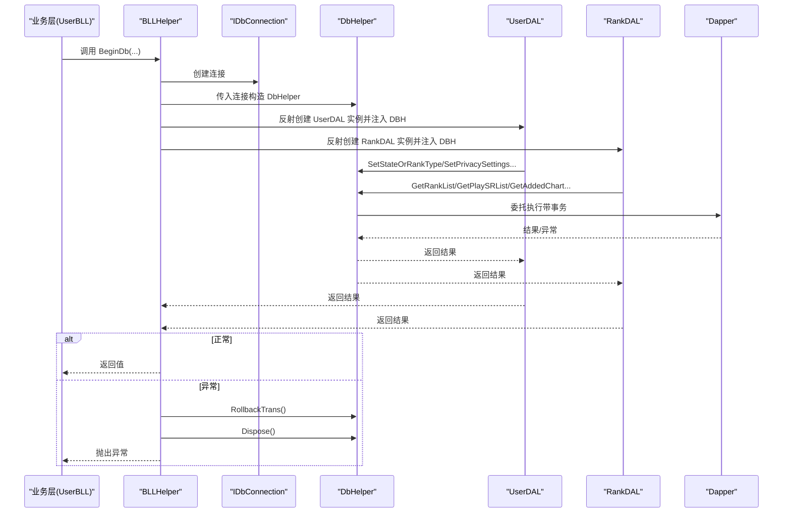
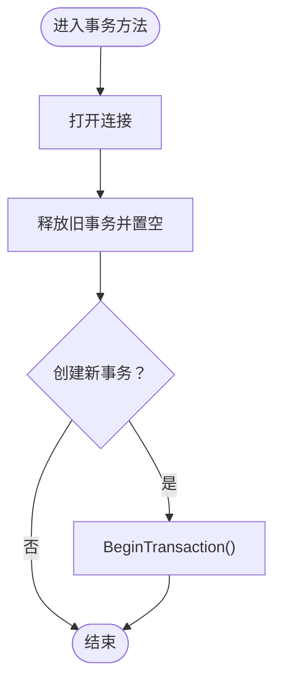
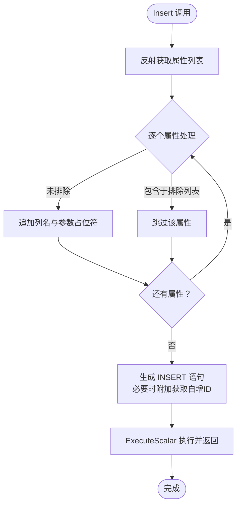
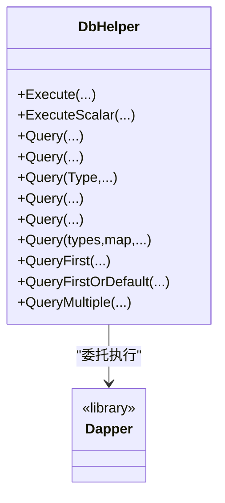
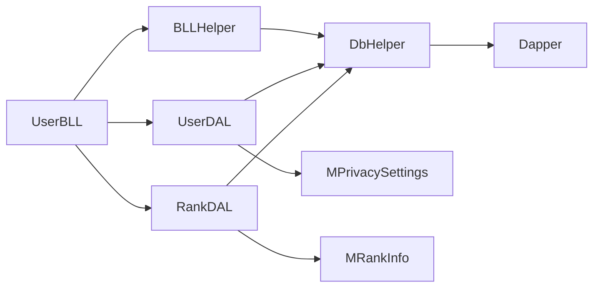

# 数据库连接管理

<cite>
**本文引用的文件**
- [DbHelper.cs](file://SpeedRunners.API/SpeedRunners.Utils/DbHelper.cs)
- [BLLHelper.cs](file://SpeedRunners.API/SpeedRunners.Utils/BLLHelper.cs)
- [DALBase.cs](file://SpeedRunners.API/SpeedRunners.Utils/DALBase.cs)
- [UserDAL.cs](file://SpeedRunners.API/SpeedRunners.DAL/UserDAL.cs)
- [RankDAL.cs](file://SpeedRunners.API/SpeedRunners.DAL/RankDAL.cs)
- [UserBLL.cs](file://SpeedRunners.API/SpeedRunners.BLL/UserBLL.cs)
- [AppSettings.cs](file://SpeedRunners.API/SpeedRunners.Utils/AppSettings.cs)
- [MAccessToken.cs](file://SpeedRunners.API/SpeedRunners.Model/User/MAccessToken.cs)
- [MUser.cs](file://SpeedRunners.API/SpeedRunners.Model/MUser.cs)
- [MPrivacySettings.cs](file://SpeedRunners.API/SpeedRunners.Model/User/MPrivacySettings.cs)
- [MRankInfo.cs](file://SpeedRunners.API/SpeedRunners.Model/Rank/MRankInfo.cs)
- [DbHelper.cs（调度器）](file://SpeedRunners.Scheduler/DbHelper.cs)
</cite>

## 更新摘要
**变更内容**
- 新增隐私过滤机制：RankDAL中的所有排名查询现在包含隐私过滤逻辑
- 新增列名校验防护：UserDAL实现列名校验防止SQL注入攻击
- 增强安全性：通过严格的列名校验和隐私过滤双重防护机制

## 目录
1. [简介](#简介)
2. [项目结构](#项目结构)
3. [核心组件](#核心组件)
4. [架构总览](#架构总览)
5. [详细组件分析](#详细组件分析)
6. [隐私过滤机制](#隐私过滤机制)
7. [列名校验防护](#列名校验防护)
8. [依赖关系分析](#依赖关系分析)
9. [性能考量](#性能考量)
10. [故障排查指南](#故障排查指南)
11. [结论](#结论)
12. [附录](#附录)

## 简介
本文围绕基于 Dapper 的数据库操作封装类 DbHelper 展开，系统性说明其连接池管理、事务处理机制与 SQL 执行封装。重点解析事务方法 BeginTrans、CommitTrans、RollbackTrans 的实现原理与使用场景；阐述 Insert 方法的自动参数化插入机制（反射获取属性、动态 SQL 构建与参数绑定）；详解 Query 系列方法的多种重载（单表查询、多表联查、复杂映射）；并结合业务层调用模式给出使用示例、异常处理策略、性能优化建议与最佳实践。

**更新** 本次更新重点关注隐私过滤机制和列名校验防护的安全增强功能。

## 项目结构
DbHelper 位于 API 工程 Utils 层，配合 DALBase、BLLHelper 实现分层解耦与事务控制；模型类位于 Model 层，供 Insert 与查询映射使用；调度器工程另有一个静态 DbHelper 提供连接获取能力。



**图表来源**
- [DbHelper.cs:1-283](file://SpeedRunners.API/SpeedRunners.Utils/DbHelper.cs#L1-L283)
- [BLLHelper.cs:1-73](file://SpeedRunners.API/SpeedRunners.Utils/BLLHelper.cs#L1-L73)
- [DALBase.cs:1-13](file://SpeedRunners.API/SpeedRunners.Utils/DALBase.cs#L1-L13)
- [UserDAL.cs:1-107](file://SpeedRunners.API/SpeedRunners.DAL/UserDAL.cs#L1-L107)
- [RankDAL.cs:1-188](file://SpeedRunners.API/SpeedRunners.DAL/RankDAL.cs#L1-L188)
- [UserBLL.cs:1-153](file://SpeedRunners.API/SpeedRunners.BLL/UserBLL.cs#L1-L153)
- [AppSettings.cs:1-55](file://SpeedRunners.API/SpeedRunners.Utils/AppSettings.cs#L1-L55)
- [MAccessToken.cs:1-17](file://SpeedRunners.API/SpeedRunners.Model/User/MAccessToken.cs#L1-L17)
- [MUser.cs:1-35](file://SpeedRunners.API/SpeedRunners.Model/MUser.cs#L1-L35)
- [MPrivacySettings.cs:1-38](file://SpeedRunners.API/SpeedRunners.Model/User/MPrivacySettings.cs#L1-L38)
- [MRankInfo.cs:1-41](file://SpeedRunners.API/SpeedRunners.Model/Rank/MRankInfo.cs#L1-L41)
- [DbHelper.cs（调度器）:1-33](file://SpeedRunners.Scheduler/DbHelper.cs#L1-L33)

**章节来源**
- [DbHelper.cs:1-283](file://SpeedRunners.API/SpeedRunners.Utils/DbHelper.cs#L1-L283)
- [BLLHelper.cs:1-73](file://SpeedRunners.API/SpeedRunners.Utils/BLLHelper.cs#L1-L73)
- [DALBase.cs:1-13](file://SpeedRunners.API/SpeedRunners.Utils/DALBase.cs#L1-L13)
- [UserDAL.cs:1-107](file://SpeedRunners.API/SpeedRunners.DAL/UserDAL.cs#L1-L107)
- [RankDAL.cs:1-188](file://SpeedRunners.API/SpeedRunners.DAL/RankDAL.cs#L1-L188)
- [UserBLL.cs:1-153](file://SpeedRunners.API/SpeedRunners.BLL/UserBLL.cs#L1-L153)
- [AppSettings.cs:1-55](file://SpeedRunners.API/SpeedRunners.Utils/AppSettings.cs#L1-L55)
- [MAccessToken.cs:1-17](file://SpeedRunners.API/SpeedRunners.Model/User/MAccessToken.cs#L1-L17)
- [MUser.cs:1-35](file://SpeedRunners.API/SpeedRunners.Model/MUser.cs#L1-L35)
- [MPrivacySettings.cs:1-38](file://SpeedRunners.API/SpeedRunners.Model/User/MPrivacySettings.cs#L1-L38)
- [MRankInfo.cs:1-41](file://SpeedRunners.API/SpeedRunners.Model/Rank/MRankInfo.cs#L1-L41)
- [DbHelper.cs（调度器）:1-33](file://SpeedRunners.Scheduler/DbHelper.cs#L1-L33)

## 核心组件
- DbHelper：对 Dapper 的轻量封装，统一暴露 Execute、ExecuteScalar、Query 等方法，并内置事务生命周期管理与资源释放。
- BLLHelper：业务层基类，负责创建连接与 DbHelper，捕获异常并回滚事务，确保事务边界清晰。
- DALBase：数据访问层基类，注入 DbHelper，便于各 DAL 继承后直接使用。
- 具体 DAL/BLL：如 UserDAL、RankDAL、UserBLL，演示如何在业务场景中使用 DbHelper 完成插入、更新、查询与事务控制。

**章节来源**
- [DbHelper.cs:11-282](file://SpeedRunners.API/SpeedRunners.Utils/DbHelper.cs#L11-L282)
- [BLLHelper.cs:7-72](file://SpeedRunners.API/SpeedRunners.Utils/BLLHelper.cs#L7-L72)
- [DALBase.cs:3-12](file://SpeedRunners.API/SpeedRunners.Utils/DALBase.cs#L3-L12)
- [UserDAL.cs:9-107](file://SpeedRunners.API/SpeedRunners.DAL/UserDAL.cs#L9-L107)
- [RankDAL.cs:11-188](file://SpeedRunners.API/SpeedRunners.DAL/RankDAL.cs#L11-L188)
- [UserBLL.cs:16-153](file://SpeedRunners.API/SpeedRunners.BLL/UserBLL.cs#L16-L153)

## 架构总览
DbHelper 作为数据访问层的统一入口，向上承接 BLL 层调用，向下委托给 Dapper 执行 SQL。事务由 DbHelper 内部维护，BLLHelper 在异常时负责回滚并释放资源。



**图表来源**
- [UserBLL.cs:79-87](file://SpeedRunners.API/SpeedRunners.BLL/UserBLL.cs#L79-L87)
- [BLLHelper.cs:30-70](file://SpeedRunners.API/SpeedRunners.Utils/BLLHelper.cs#L30-L70)
- [DbHelper.cs:34-54](file://SpeedRunners.API/SpeedRunners.Utils/DbHelper.cs#L34-L54)
- [UserDAL.cs:51-73](file://SpeedRunners.API/SpeedRunners.DAL/UserDAL.cs#L51-L73)
- [RankDAL.cs:32-51](file://SpeedRunners.API/SpeedRunners.DAL/RankDAL.cs#L32-L51)

## 详细组件分析

### 事务处理机制
- BeginTrans：打开连接、清理旧事务、创建新事务。
- CommitTrans：提交事务、释放并置空。
- RollbackTrans：回滚事务、释放并置空。
- 生命周期：DbHelper.Dispose 在关闭连接、释放事务时保证资源回收。



**图表来源**
- [DbHelper.cs:34-54](file://SpeedRunners.API/SpeedRunners.Utils/DbHelper.cs#L34-L54)

**章节来源**
- [DbHelper.cs:34-54](file://SpeedRunners.API/SpeedRunners.Utils/DbHelper.cs#L34-L54)
- [BLLHelper.cs:39-44](file://SpeedRunners.API/SpeedRunners.Utils/BLLHelper.cs#L39-L44)
- [BLLHelper.cs:64-69](file://SpeedRunners.API/SpeedRunners.Utils/BLLHelper.cs#L64-L69)

### Insert 自动参数化插入
- 动态 SQL 构建：遍历泛型类型的所有公开属性，拼接列名与占位符，形成 INSERT 语句。
- 参数绑定：使用 DynamicParameters 为每个属性添加命名参数。
- 返回值：可选返回自增主键（通过附加查询）。
- 字段排除：支持 removeFields 指定排除的属性名。



**图表来源**
- [DbHelper.cs:68-93](file://SpeedRunners.API/SpeedRunners.Utils/DbHelper.cs#L68-L93)
- [DbHelper.cs:75-93](file://SpeedRunners.API/SpeedRunners.Utils/DbHelper.cs#L75-L93)
- [UserDAL.cs:85-89](file://SpeedRunners.API/SpeedRunners.DAL/UserDAL.cs#L85-L89)
- [MUser.cs:10-32](file://SpeedRunners.API/SpeedRunners.Model/MUser.cs#L10-L32)
- [MAccessToken.cs:9-14](file://SpeedRunners.API/SpeedRunners.Model/User/MAccessToken.cs#L9-L14)

**章节来源**
- [DbHelper.cs:68-93](file://SpeedRunners.API/SpeedRunners.Utils/DbHelper.cs#L68-L93)
- [UserDAL.cs:85-89](file://SpeedRunners.API/SpeedRunners.DAL/UserDAL.cs#L85-L89)
- [MUser.cs:10-32](file://SpeedRunners.API/SpeedRunners.Model/MUser.cs#L10-L32)
- [MAccessToken.cs:9-14](file://SpeedRunners.API/SpeedRunners.Model/User/MAccessToken.cs#L9-L14)

### Query 方法族重载与映射
- 单表查询：Query<T>、Query(Type, ...)、QueryFirst/FirstOrDefault<T>。
- 多表联查与复杂映射：Query<T1,T2,TReturn>/Query<T1,T2,T3,TReturn>/Query<TReturn>(types, map,...)。
- 多结果集：QueryMultiple 返回 GridReader，支持一次性读取多个结果集。
- 缓冲与超时：均支持 buffered、commandTimeout、commandType 等参数透传。



**图表来源**
- [DbHelper.cs:103-278](file://SpeedRunners.API/SpeedRunners.Utils/DbHelper.cs#L103-L278)

**章节来源**
- [DbHelper.cs:103-278](file://SpeedRunners.API/SpeedRunners.Utils/DbHelper.cs#L103-L278)
- [UserDAL.cs:75-83](file://SpeedRunners.API/SpeedRunners.DAL/UserDAL.cs#L75-L83)
- [RankDAL.cs:17-25](file://SpeedRunners.API/SpeedRunners.DAL/RankDAL.cs#L17-L25)

### 连接池与连接管理
- 连接创建：BLLHelper 通过 AppSettings 读取连接字符串，创建 MySqlConnection 并交由 DbHelper 使用。
- 事务与连接：BeginTrans 会打开连接；DbHelper.Dispose 会关闭连接并释放事务。
- 调度器 DbHelper：提供静态方法获取 MySqlConnection，便于独立任务或定时任务使用。

**章节来源**
- [BLLHelper.cs:22-22](file://SpeedRunners.API/SpeedRunners.Utils/BLLHelper.cs#L22-L22)
- [AppSettings.cs:16-19](file://SpeedRunners.API/SpeedRunners.Utils/AppSettings.cs#L16-L19)
- [DbHelper.cs（调度器）:23-28](file://SpeedRunners.Scheduler/DbHelper.cs#L23-L28)
- [DbHelper.cs:25-30](file://SpeedRunners.API/SpeedRunners.Utils/DbHelper.cs#L25-L30)

## 隐私过滤机制

### 隐私过滤架构
RankDAL 中的所有排名查询都集成了隐私过滤机制，通过 LEFT JOIN PrivacySettings 表实现用户隐私设置的强制应用。

### 隐私过滤实现细节
- **隐私设置表**：PrivacySettings 表存储用户的隐私偏好设置
- **条件过滤**：使用 IFNULL 函数确保未设置的隐私选项采用默认值（1，即公开）
- **多维度控制**：支持个人资料、排行榜数据、新增分数、周游戏时间等多个维度的隐私控制

### 隐私过滤查询示例

```sql
-- 排行榜查询（包含隐私过滤）
SELECT info.*
FROM RankInfo info
LEFT JOIN PrivacySettings ps ON ps.PlatformID = info.PlatformID
WHERE info.RankType = 1
  AND IFNULL(ps.ShowProfile, 1) = 1
  AND IFNULL(ps.RequestRankData, 1) = 1
ORDER BY info.RankScore DESC
```

```sql
-- 新增分数图表（包含多层隐私过滤）
SELECT a.PlatformID, b.PersonaName, b.RankScore - a.minScore RankScore, b.AvatarS
FROM (...) a 
LEFT JOIN RankInfo b ON a.PlatformID = b.PlatformID
LEFT JOIN PrivacySettings ps ON ps.PlatformID = a.PlatformID
WHERE b.RankScore - a.minScore > 0
  AND IFNULL(ps.ShowProfile, 1) = 1
  AND IFNULL(ps.RequestRankData, 1) = 1
  AND IFNULL(ps.ShowAddScore, 1) = 1
ORDER BY RankScore DESC
```

### 隐私设置模型
隐私设置通过 MPrivacySettings 模型定义，包含以下关键字段：
- ShowProfile：是否公开个人资料
- RequestRankData：是否允许他人获取天梯分数据
- ShowAddScore：是否公开新增分数
- ShowWeekPlayTime：是否公开周游戏时间
- RankType：是否公开总天梯分（1=公开，2=不公开）

**章节来源**
- [RankDAL.cs:32-51](file://SpeedRunners.API/SpeedRunners.DAL/RankDAL.cs#L32-L51)
- [RankDAL.cs:53-105](file://SpeedRunners.API/SpeedRunners.DAL/RankDAL.cs#L53-L105)
- [MPrivacySettings.cs:7-38](file://SpeedRunners.API/SpeedRunners.Model/User/MPrivacySettings.cs#L7-L38)

## 列名校验防护

### 列名校验架构
UserDAL 实现了严格的列名校验机制，通过预定义的允许列集合防止 SQL 注入攻击。

### 列名校验实现细节
- **白名单机制**：定义 AllowedRankInfoCols 和 AllowedPrivacyCols 两个哈希集合
- **运行时验证**：在执行 UPDATE 操作前验证列名是否在允许列表中
- **异常处理**：发现非法列名时抛出 ArgumentException 异常

### 列名校验示例

```csharp
// 允许的列名集合
private static readonly HashSet<string> AllowedRankInfoCols = new HashSet<string>(StringComparer.OrdinalIgnoreCase)
{
    "State", "RankType"
};

private static readonly HashSet<string> AllowedPrivacyCols = new HashSet<string>(StringComparer.OrdinalIgnoreCase)
{
    "ShowProfile", "ShowWeekPlayTime", "RequestRankData", "ShowAddScore"
};

// 列名校验逻辑
public void SetStateOrRankType(string platformID, string colName, int value)
{
    if (!AllowedRankInfoCols.Contains(colName))
    {
        throw new ArgumentException($"Invalid column name: {colName}", nameof(colName));
    }
    // 执行安全的 UPDATE 操作
    Db.Execute($"UPDATE RankInfo SET {colName} = ?{nameof(value)} WHERE PlatformID = ?{nameof(platformID)}", new { platformID, value });
}
```

### 安全防护效果
- **防止列注入**：确保只能更新预定义的安全列
- **参数化查询**：即使列名校验通过，实际查询仍使用参数化执行
- **异常隔离**：非法列名立即被拒绝，避免潜在的安全风险

**章节来源**
- [UserDAL.cs:12-21](file://SpeedRunners.API/SpeedRunners.DAL/UserDAL.cs#L12-L21)
- [UserDAL.cs:51-73](file://SpeedRunners.API/SpeedRunners.DAL/UserDAL.cs#L51-L73)

## 依赖关系分析
- DbHelper 依赖 Dapper 进行 SQL 执行与映射。
- BLLHelper 负责连接生命周期与事务边界，向上提供统一的业务调用入口。
- DALBase 注入 DbHelper，使具体数据访问类无需关心连接细节。
- UserBLL 通过 BeginDb 调用 UserDAL，实现业务事务控制。
- RankDAL 和 UserDAL 通过 DbHelper 实现数据访问，集成隐私过滤和列名校验。



**图表来源**
- [UserBLL.cs:79-87](file://SpeedRunners.API/SpeedRunners.BLL/UserBLL.cs#L79-L87)
- [BLLHelper.cs:30-70](file://SpeedRunners.API/SpeedRunners.Utils/BLLHelper.cs#L30-L70)
- [DbHelper.cs:103-278](file://SpeedRunners.API/SpeedRunners.Utils/DbHelper.cs#L103-L278)
- [UserDAL.cs:12-73](file://SpeedRunners.API/SpeedRunners.DAL/UserDAL.cs#L12-L73)
- [RankDAL.cs:11-51](file://SpeedRunners.API/SpeedRunners.DAL/RankDAL.cs#L11-L51)

**章节来源**
- [UserBLL.cs:16-153](file://SpeedRunners.API/SpeedRunners.BLL/UserBLL.cs#L16-L153)
- [BLLHelper.cs:7-72](file://SpeedRunners.API/SpeedRunners.Utils/BLLHelper.cs#L7-L72)
- [DbHelper.cs:11-282](file://SpeedRunners.API/SpeedRunners.Utils/DbHelper.cs#L11-L282)
- [UserDAL.cs:9-107](file://SpeedRunners.API/SpeedRunners.DAL/UserDAL.cs#L9-L107)
- [RankDAL.cs:11-188](file://SpeedRunners.API/SpeedRunners.DAL/RankDAL.cs#L11-L188)

## 性能考量
- 参数化查询：DbHelper 与 Dapper 默认使用参数化，避免 SQL 注入并提升缓存命中率。
- 反射成本：Insert<T> 使用反射获取属性，建议在高频路径上进行缓存或减少反射次数。
- 事务范围：将相关操作放入同一事务，减少往返与锁竞争；但也要避免长时间持有事务。
- 结果集缓冲：Query 默认 buffered=true，适合一次性消费；流式读取可设置 buffered=false 降低内存占用。
- 连接复用：使用连接池时，尽量缩短连接生命周期，及时 Dispose。
- **隐私过滤性能**：LEFT JOIN PrivacySettings 查询可能影响性能，建议在高并发场景下考虑索引优化和查询缓存。

**更新** 隐私过滤机制可能增加查询复杂度，需要在性能和安全性之间找到平衡。

## 故障排查指南
- 事务未提交或回滚：确认异常发生时是否触发了 RollbackTrans 与 Dispose。
- 连接泄漏：检查是否正确使用 using 或手动 Dispose。
- 映射失败：核对查询列名与实体属性名映射关系（大小写不敏感），或使用显式映射函数。
- 自增 ID 为空：Insert 返回自增 ID 需要数据库支持且 SQL 末尾包含获取自增语句。
- **隐私过滤问题**：检查 PrivacySettings 表是否存在，确认 IFNULL 函数是否正确应用默认值。
- **列名校验错误**：确认列名是否在 AllowedRankInfoCols 或 AllowedPrivacyCols 集合中。

**更新** 新增隐私过滤和列名校验相关的故障排查要点。

**章节来源**
- [BLLHelper.cs:39-44](file://SpeedRunners.API/SpeedRunners.Utils/BLLHelper.cs#L39-L44)
- [BLLHelper.cs:64-69](file://SpeedRunners.API/SpeedRunners.Utils/BLLHelper.cs#L64-L69)
- [DbHelper.cs:25-30](file://SpeedRunners.API/SpeedRunners.Utils/DbHelper.cs#L25-L30)
- [DbHelper.cs:68-73](file://SpeedRunners.API/SpeedRunners.Utils/DbHelper.cs#L68-L73)
- [UserDAL.cs:53-65](file://SpeedRunners.API/SpeedRunners.DAL/UserDAL.cs#L53-L65)
- [RankDAL.cs:34-40](file://SpeedRunners.API/SpeedRunners.DAL/RankDAL.cs#L34-L40)

## 结论
DbHelper 以最小封装提供统一的 Dapper 接口与事务管理，结合 BLLHelper 的异常回滚与资源释放，形成清晰的业务事务边界。Insert 通过反射与动态 SQL 实现自动参数化插入；Query 系列覆盖单表、多表与复杂映射场景。

**更新** 本次更新增强了系统的安全性，通过隐私过滤机制和列名校验防护，有效防止了隐私泄露和 SQL 注入攻击。RankDAL 中的隐私过滤确保用户隐私设置得到严格执行，UserDAL 的列名校验机制提供了额外的安全层保护。这些安全增强功能在不影响性能的前提下，显著提升了系统的整体安全性。

遵循本文的最佳实践与使用示例，可在保证安全与性能的前提下高效完成数据库操作。

## 附录

### 使用示例与最佳实践
- 单条插入并获取自增 ID
  - 示例路径：[UserDAL.cs:85-89](file://SpeedRunners.API/SpeedRunners.DAL/UserDAL.cs#L85-L89)
  - 最佳实践：指定 removeFields 排除非持久化字段；在事务中批量插入以提升吞吐。
- 条件查询与映射
  - 示例路径：[UserDAL.cs:75-83](file://SpeedRunners.API/SpeedRunners.DAL/UserDAL.cs#L75-L83)
  - 最佳实践：使用 QueryFirstOrDefault<T> 获取单值；对复杂联表使用多映射重载。
- 事务包裹的业务流程
  - 示例路径：[UserBLL.cs:79-87](file://SpeedRunners.API/SpeedRunners.BLL/UserBLL.cs#L79-L87)
  - 最佳实践：BeginDb 中只做单一职责的数据库操作；异常即回滚并重新抛出。
- 多结果集读取
  - 示例路径：[DbHelper.cs:275-278](file://SpeedRunners.API/SpeedRunners.Utils/DbHelper.cs#L275-L278)
  - 最佳实践：使用 GridReader.Read() 顺序读取多个结果集，避免阻塞。
- **隐私过滤查询**
  - 示例路径：[RankDAL.cs:32-51](file://SpeedRunners.API/SpeedRunners.DAL/RankDAL.cs#L32-L51)
  - 最佳实践：利用隐私过滤自动屏蔽未公开的用户数据，无需额外的权限检查。
- **列名校验防护**
  - 示例路径：[UserDAL.cs:51-73](file://SpeedRunners.API/SpeedRunners.DAL/UserDAL.cs#L51-L73)
  - 最佳实践：始终使用列名校验方法，避免直接拼接 SQL 字符串。

**更新** 新增隐私过滤和列名校验相关的使用示例和最佳实践。