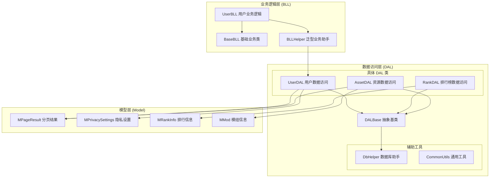
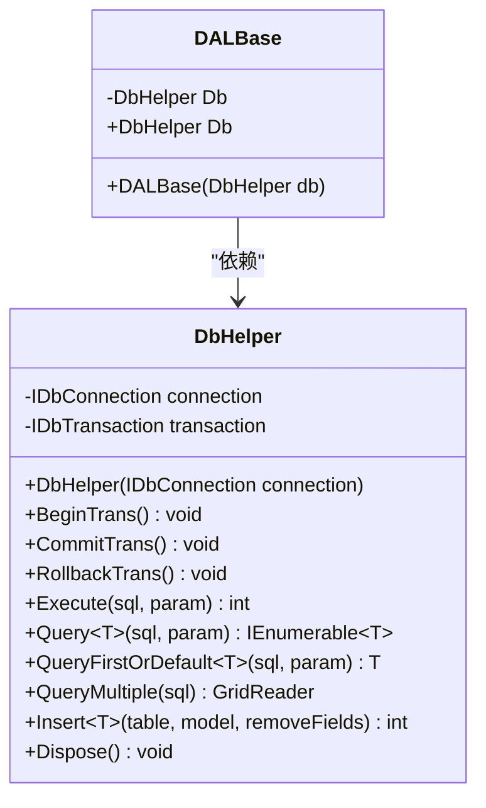
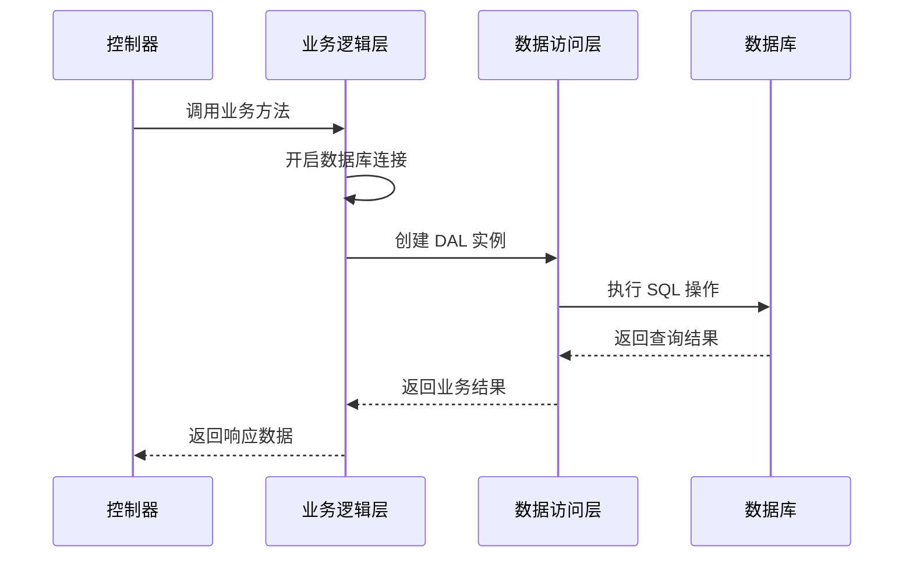
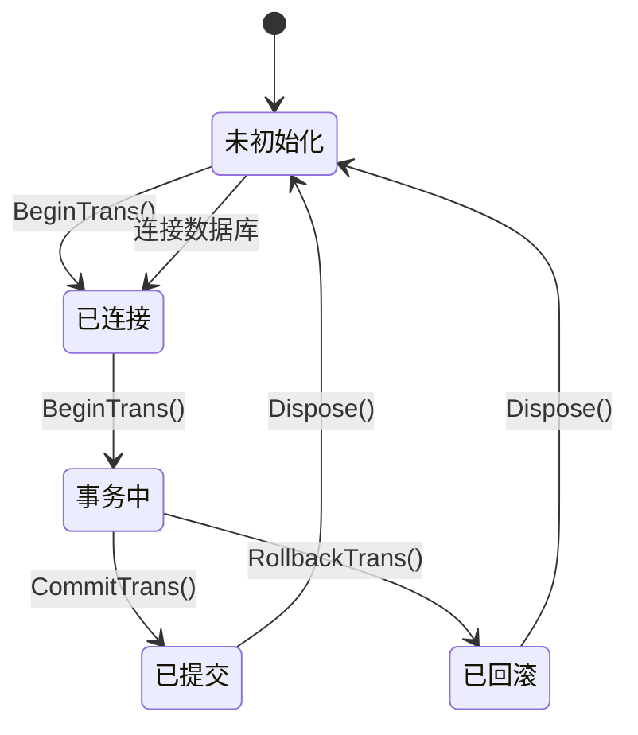
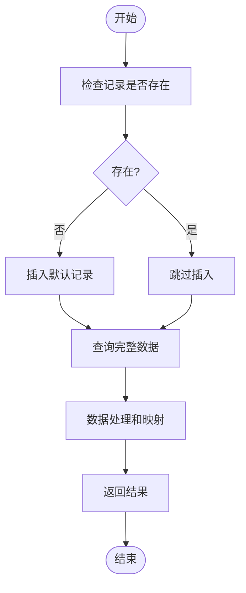
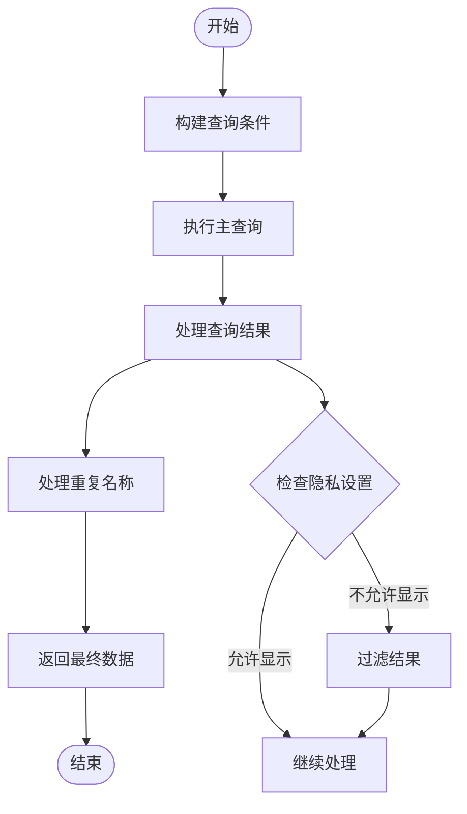
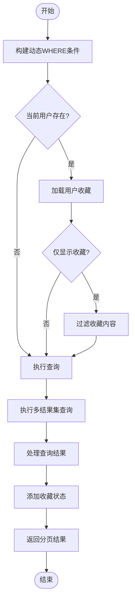
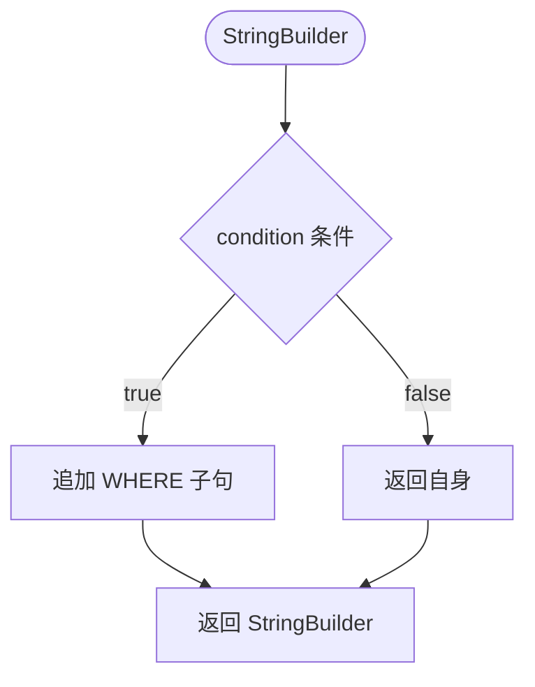
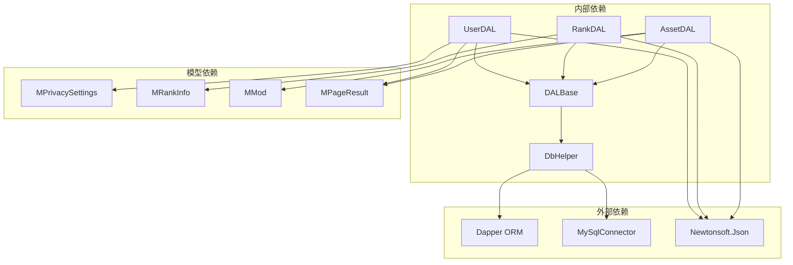

# 数据访问基类

<cite>
**本文档引用的文件**
- [DALBase.cs](file://SpeedRunners.API/SpeedRunners.Utils/DALBase.cs)
- [DbHelper.cs](file://SpeedRunners.API/SpeedRunners.Utils/DbHelper.cs)
- [UserDAL.cs](file://SpeedRunners.API/SpeedRunners.DAL/UserDAL.cs)
- [RankDAL.cs](file://SpeedRunners.API/SpeedRunners.DAL/RankDAL.cs)
- [AssetDAL.cs](file://SpeedRunners.API/SpeedRunners.DAL/AssetDAL.cs)
- [CommonUtils.cs](file://SpeedRunners.API/SpeedRunners.Utils/CommonUtils.cs)
- [BLLHelper.cs](file://SpeedRunners.API/SpeedRunners.Utils/BLLHelper.cs)
- [BaseBLL.cs](file://SpeedRunners.API/SpeedRunners.Utils/BaseBLL.cs)
- [UserBLL.cs](file://SpeedRunners.API/SpeedRunners.BLL/UserBLL.cs)
- [MPageResult.cs](file://SpeedRunners.API/SpeedRunners.Model/MPageResult.cs)
- [MPrivacySettings.cs](file://SpeedRunners.API/SpeedRunners.Model/User/MPrivacySettings.cs)
- [MRankInfo.cs](file://SpeedRunners.API/SpeedRunners.Model/Rank/MRankInfo.cs)
- [MMod.cs](file://SpeedRunners.API/SpeedRunners.Model/Asset/MMod.cs)
</cite>

## 目录
1. [简介](#简介)
2. [项目结构](#项目结构)
3. [核心组件](#核心组件)
4. [架构概览](#架构概览)
5. [详细组件分析](#详细组件分析)
6. [依赖关系分析](#依赖关系分析)
7. [性能考虑](#性能考虑)
8. [故障排除指南](#故障排除指南)
9. [结论](#结论)

## 简介

DALBase 是 SpeedRunnersLab 项目中数据访问层的核心基类，采用抽象基类设计模式为所有具体数据访问类提供统一的基础设施。该基类通过依赖注入的方式接收 DbHelper 实例，实现了数据访问层的标准化和代码复用。

该项目基于 .NET Core 和 Dapper ORM，采用分层架构设计，其中数据访问层（DAL）负责与数据库的交互，业务逻辑层（BLL）处理业务规则，控制器层（API）提供 Web API 接口。

## 项目结构

数据访问层采用按功能模块划分的组织方式，每个模块都有独立的 DAL 类：

**图表来源**
- [DALBase.cs](file://SpeedRunners.API/SpeedRunners.Utils/DALBase.cs#L1-L13)
- [DbHelper.cs](file://SpeedRunners.API/SpeedRunners.Utils/DbHelper.cs#L1-L283)
- [UserDAL.cs](file://SpeedRunners.API/SpeedRunners.DAL/UserDAL.cs#L1-L85)
- [RankDAL.cs](file://SpeedRunners.API/SpeedRunners.DAL/RankDAL.cs#L1-L175)
- [AssetDAL.cs](file://SpeedRunners.API/SpeedRunners.DAL/AssetDAL.cs#L1-L134)

**章节来源**
- [DALBase.cs](file://SpeedRunners.API/SpeedRunners.Utils/DALBase.cs#L1-L13)
- [DbHelper.cs](file://SpeedRunners.API/SpeedRunners.Utils/DbHelper.cs#L1-L283)

## 核心组件

### DALBase 抽象基类

DALBase 是整个数据访问层的基石，采用最小化设计原则，仅包含必要的依赖注入机制：

**图表来源**
- [DALBase.cs](file://SpeedRunners.API/SpeedRunners.Utils/DALBase.cs#L3-L11)
- [DbHelper.cs](file://SpeedRunners.API/SpeedRunners.Utils/DbHelper.cs#L11-L283)

### 具体 DAL 类实现

项目包含三个主要的数据访问类，每个都继承自 DALBase：

1. **UserDAL** - 处理用户相关数据操作
2. **RankDAL** - 处理排行榜和排名数据
3. **AssetDAL** - 处理模组资源数据

**章节来源**
- [UserDAL.cs](file://SpeedRunners.API/SpeedRunners.DAL/UserDAL.cs#L9-L85)
- [RankDAL.cs](file://SpeedRunners.API/SpeedRunners.DAL/RankDAL.cs#L11-L175)
- [AssetDAL.cs](file://SpeedRunners.API/SpeedRunners.DAL/AssetDAL.cs#L13-L134)

## 架构概览

数据访问层采用分层架构设计，通过抽象基类实现代码复用和标准化：

**图表来源**
- [BLLHelper.cs](file://SpeedRunners.API/SpeedRunners.Utils/BLLHelper.cs#L30-L70)
- [UserBLL.cs](file://SpeedRunners.API/SpeedRunners.BLL/UserBLL.cs#L28-L32)

### 设计模式应用

1. **抽象基类模式** - DALBase 提供统一的接口规范
2. **工厂模式** - BLLHelper 动态创建 DAL 实例
3. **依赖注入模式** - 通过构造函数注入 DbHelper
4. **模板方法模式** - 统一的 CRUD 操作流程

**章节来源**
- [BLLHelper.cs](file://SpeedRunners.API/SpeedRunners.Utils/BLLHelper.cs#L7-L71)

## 详细组件分析

### DbHelper 数据库助手

DbHelper 是数据访问层的核心工具类，封装了 Dapper ORM 的所有数据库操作：

#### 事务管理

**图表来源**
- [DbHelper.cs](file://SpeedRunners.API/SpeedRunners.Utils/DbHelper.cs#L34-L54)

#### 数据操作方法

DbHelper 提供了丰富的数据操作方法，涵盖 CRUD 操作的各个方面：

| 方法类别 | 主要方法 | 功能描述 |
|---------|---------|----------|
| 插入操作 | Insert<T>(), AddParamAndGetInsertSql() | 插入单行数据并返回自增ID |
| 更新操作 | Execute(), ExecuteScalar() | 执行参数化SQL更新操作 |
| 查询操作 | Query<T>(), QueryFirstOrDefault<T>() | 查询数据并映射到实体对象 |
| 多结果集 | QueryMultiple() | 支持多表联查和批量操作 |
| 事务操作 | BeginTrans(), CommitTrans(), RollbackTrans() | 完整的事务生命周期管理 |

**章节来源**
- [DbHelper.cs](file://SpeedRunners.API/SpeedRunners.Utils/DbHelper.cs#L68-L283)

### 具体 DAL 类实现分析

#### UserDAL 用户数据访问

UserDAL 展示了典型的 CRUD 操作模式：

**图表来源**
- [UserDAL.cs](file://SpeedRunners.API/SpeedRunners.DAL/UserDAL.cs#L13-L35)

#### RankDAL 排行榜数据访问

RankDAL 展现了复杂查询和数据处理逻辑：

**图表来源**
- [RankDAL.cs](file://SpeedRunners.API/SpeedRunners.DAL/RankDAL.cs#L44-L92)

#### AssetDAL 资源数据访问

AssetDAL 展示了高级查询和分页处理：

**图表来源**
- [AssetDAL.cs](file://SpeedRunners.API/SpeedRunners.DAL/AssetDAL.cs#L16-L72)

**章节来源**
- [UserDAL.cs](file://SpeedRunners.API/SpeedRunners.DAL/UserDAL.cs#L1-L85)
- [RankDAL.cs](file://SpeedRunners.API/SpeedRunners.DAL/RankDAL.cs#L1-L175)
- [AssetDAL.cs](file://SpeedRunners.API/SpeedRunners.DAL/AssetDAL.cs#L1-L134)

### 通用工具类

#### WhereIf 扩展方法

CommonUtils 中的 WhereIf 扩展方法提供了优雅的条件查询构建能力：

**图表来源**
- [CommonUtils.cs](file://SpeedRunners.API/SpeedRunners.Utils/CommonUtils.cs#L30-L33)

**章节来源**
- [CommonUtils.cs](file://SpeedRunners.API/SpeedRunners.Utils/CommonUtils.cs#L30-L33)

## 依赖关系分析

数据访问层的依赖关系体现了清晰的分层架构：

**图表来源**
- [DALBase.cs](file://SpeedRunners.API/SpeedRunners.Utils/DALBase.cs#L1-L13)
- [DbHelper.cs](file://SpeedRunners.API/SpeedRunners.Utils/DbHelper.cs#L1-L10)
- [UserDAL.cs](file://SpeedRunners.API/SpeedRunners.DAL/UserDAL.cs#L1-L6)

### 错误处理机制

数据访问层采用了多层次的错误处理策略：

1. **连接管理** - 自动连接关闭和资源释放
2. **事务回滚** - 异常发生时自动回滚事务
3. **异常传播** - 保持异常信息的完整性
4. **资源清理** - 确保所有数据库资源得到正确释放

**章节来源**
- [DbHelper.cs](file://SpeedRunners.API/SpeedRunners.Utils/DbHelper.cs#L25-L30)
- [BLLHelper.cs](file://SpeedRunners.API/SpeedRunners.Utils/BLLHelper.cs#L39-L44)

## 性能考虑

### 连接池优化

- 使用 `using` 语句确保连接及时释放
- 通过 `IDisposable` 模式管理数据库资源
- 避免长时间持有数据库连接

### 查询优化

- 采用参数化查询防止 SQL 注入
- 使用 Dapper 的高性能 ORM 特性
- 合理使用索引和查询条件

### 内存管理

- 使用 `GridReader` 处理多结果集查询
- 控制查询结果集的大小
- 及时释放大对象和集合

## 故障排除指南

### 常见问题及解决方案

1. **连接超时问题**
   - 检查连接字符串配置
   - 验证数据库服务状态
   - 调整连接超时时间

2. **事务冲突问题**
   - 确保事务正确提交或回滚
   - 避免长时间持有事务
   - 检查死锁情况

3. **内存泄漏问题**
   - 确保所有 `IDisposable` 对象正确释放
   - 检查循环引用
   - 监控内存使用情况

**章节来源**
- [DbHelper.cs](file://SpeedRunners.API/SpeedRunners.Utils/DbHelper.cs#L25-L30)
- [BLLHelper.cs](file://SpeedRunners.API/SpeedRunners.Utils/BLLHelper.cs#L41-L44)

## 结论

DALBase 数据访问基类通过抽象设计为整个数据访问层提供了坚实的基础。其设计特点包括：

1. **简洁性** - 最小化的基类设计，专注于核心功能
2. **可扩展性** - 通过继承机制支持新的数据访问类
3. **一致性** - 统一的接口和操作模式
4. **安全性** - 完善的资源管理和异常处理

该架构成功地将数据访问逻辑与业务逻辑分离，为后续的功能扩展和维护奠定了良好的基础。通过遵循现有的设计模式和最佳实践，开发者可以轻松地创建新的数据访问类并集成到现有系统中。