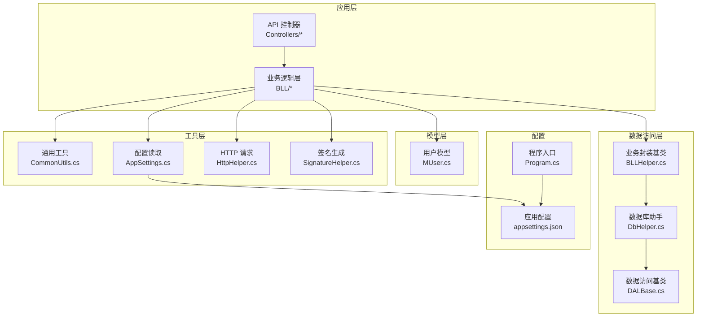
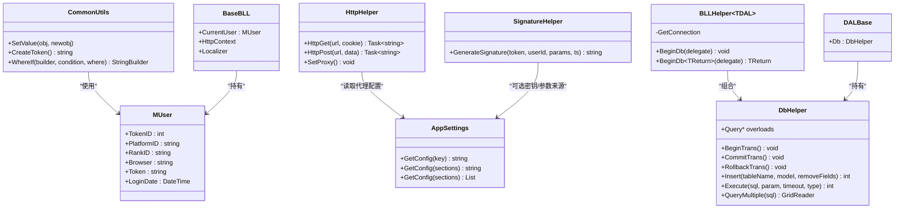
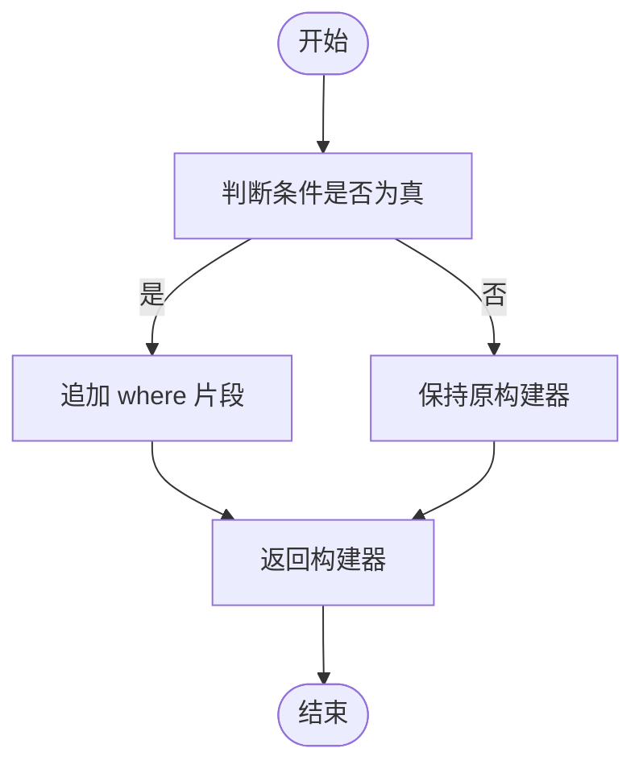
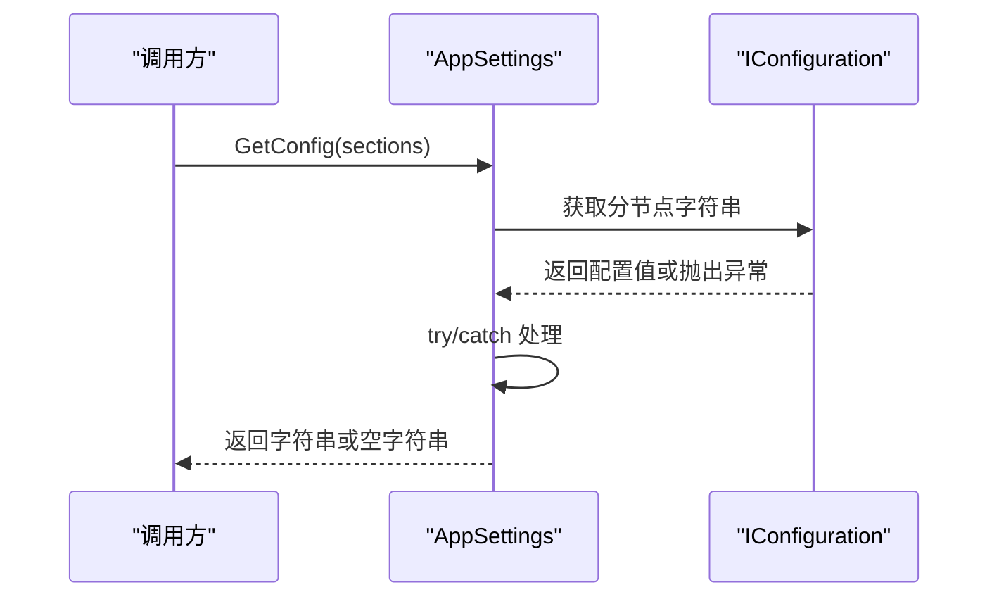
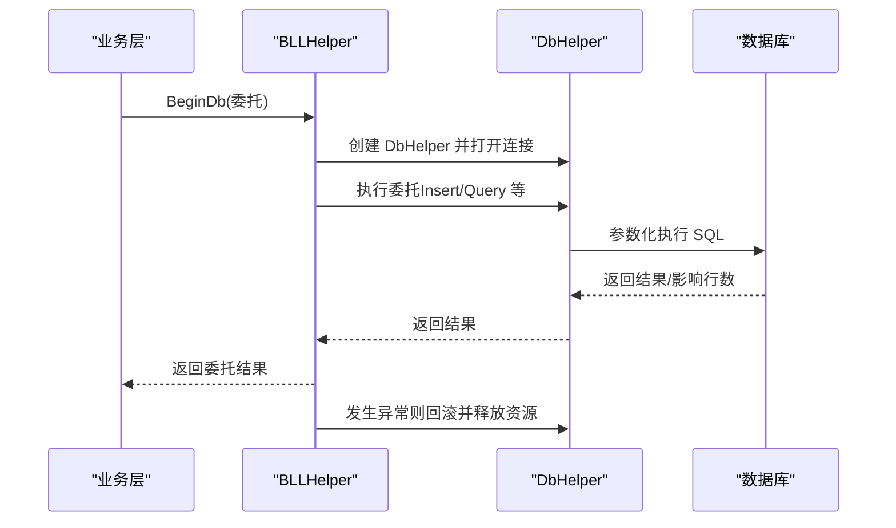
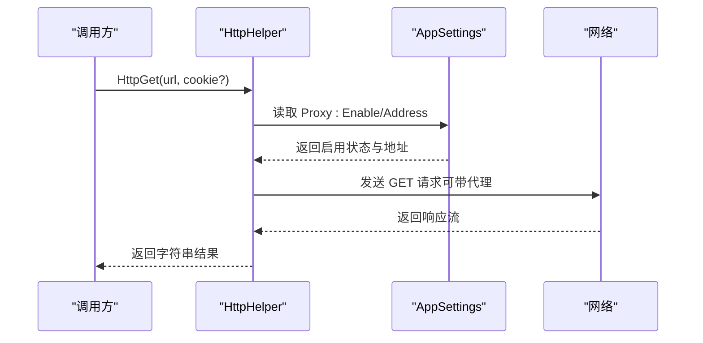
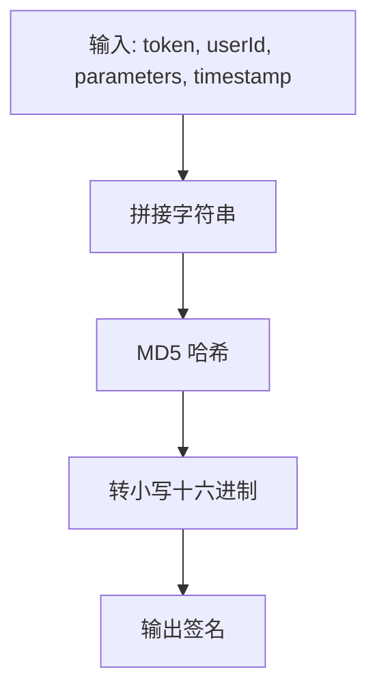
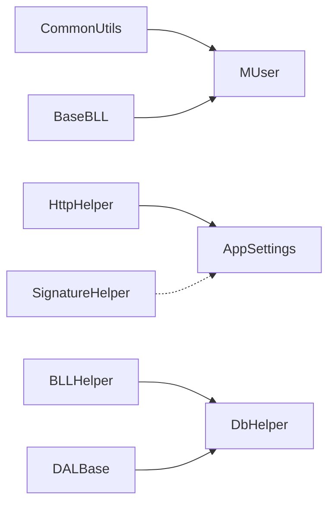

# 通用工具类

<cite>
**本文引用的文件**
- [CommonUtils.cs](file://SpeedRunners.API/SpeedRunners.Utils/CommonUtils.cs)
- [AppSettings.cs](file://SpeedRunners.API/SpeedRunners.Utils/AppSettings.cs)
- [DbHelper.cs](file://SpeedRunners.API/SpeedRunners.Utils/DbHelper.cs)
- [BLLHelper.cs](file://SpeedRunners.API/SpeedRunners.Utils/BLLHelper.cs)
- [HttpHelper.cs](file://SpeedRunners.API/SpeedRunners.Utils/HttpHelper.cs)
- [SignatureHelper.cs](file://SpeedRunners.API/SpeedRunners.Utils/SignatureHelper.cs)
- [BaseBLL.cs](file://SpeedRunners.API/SpeedRunners.Utils/BaseBLL.cs)
- [DALBase.cs](file://SpeedRunners.API/SpeedRunners.Utils/DALBase.cs)
- [MUser.cs](file://SpeedRunners.API/SpeedRunners.Model/MUser.cs)
- [appsettings.json](file://SpeedRunners.API/SpeedRunners/appsettings.json)
- [Program.cs](file://SpeedRunners.API/SpeedRunners/Program.cs)
- [AssetBLL.cs](file://SpeedRunners.API/SpeedRunners.BLL/AssetBLL.cs)
</cite>

## 目录
1. [简介](#简介)
2. [项目结构](#项目结构)
3. [核心组件](#核心组件)
4. [架构总览](#架构总览)
5. [详细组件分析](#详细组件分析)
6. [依赖关系分析](#依赖关系分析)
7. [性能考量](#性能考量)
8. [故障排查指南](#故障排查指南)
9. [结论](#结论)
10. [附录](#附录)

## 简介
本文件面向 SpeedRunnersLab 后端工程中的通用工具类，围绕 CommonUtils 工具类展开，系统梳理其数据验证、字符串处理、日期时间与数值计算、集合与查询辅助等能力，并结合项目内 AppSettings、DbHelper、BLLHelper、HttpHelper、SignatureHelper 等配套模块，给出架构图、流程图、使用示例与最佳实践，帮助开发者高效、安全地使用这些实用工具。

## 项目结构
通用工具类主要位于 SpeedRunners.API/SpeedRunners.Utils 命名空间下，配合 SpeedRunners.Model 中的领域模型，以及 Startup/Program 的配置初始化，形成“配置-工具-业务-数据访问”的分层协作。

图表来源
- [CommonUtils.cs](file://SpeedRunners.API/SpeedRunners.Utils/CommonUtils.cs#L1-L36)
- [AppSettings.cs](file://SpeedRunners.API/SpeedRunners.Utils/AppSettings.cs#L1-L55)
- [HttpHelper.cs](file://SpeedRunners.API/SpeedRunners.Utils/HttpHelper.cs#L1-L146)
- [SignatureHelper.cs](file://SpeedRunners.API/SpeedRunners.Utils/SignatureHelper.cs#L1-L29)
- [BLLHelper.cs](file://SpeedRunners.API/SpeedRunners.Utils/BLLHelper.cs#L1-L73)
- [DbHelper.cs](file://SpeedRunners.API/SpeedRunners.Utils/DbHelper.cs#L1-L283)
- [DALBase.cs](file://SpeedRunners.API/SpeedRunners.Utils/DALBase.cs#L1-L13)
- [MUser.cs](file://SpeedRunners.API/SpeedRunners.Model/MUser.cs#L1-L35)
- [appsettings.json](file://SpeedRunners.API/SpeedRunners/appsettings.json#L1-L21)
- [Program.cs](file://SpeedRunners.API/SpeedRunners/Program.cs#L1-L33)

章节来源
- [CommonUtils.cs](file://SpeedRunners.API/SpeedRunners.Utils/CommonUtils.cs#L1-L36)
- [appsettings.json](file://SpeedRunners.API/SpeedRunners/appsettings.json#L1-L21)

## 核心组件
- CommonUtils：提供对象深拷贝扩展、AccessToken 生成、条件拼接 SQL 片段等便捷方法。
- AppSettings：封装 IConfiguration 的键值读取、层级配置读取与泛型绑定读取。
- DbHelper：基于 Dapper 的数据库操作封装，提供事务、插入、查询、多映射、批量查询等。
- BLLHelper：业务层统一入口，负责连接创建、事务控制、异常回滚与委托执行。
- HttpHelper：HTTP GET/POST 请求封装，支持代理、Cookie、超时与编码处理。
- SignatureHelper：基于 MD5 的签名生成工具，用于外部接口鉴权。
- BaseBLL/DALBase：业务与数据访问基类，承载上下文与 DbHelper 实例。
- MUser：用户上下文模型，承载 Token、平台 ID、浏览器、登录时间等。

章节来源
- [CommonUtils.cs](file://SpeedRunners.API/SpeedRunners.Utils/CommonUtils.cs#L8-L34)
- [AppSettings.cs](file://SpeedRunners.API/SpeedRunners.Utils/AppSettings.cs#L8-L53)
- [DbHelper.cs](file://SpeedRunners.API/SpeedRunners.Utils/DbHelper.cs#L11-L281)
- [BLLHelper.cs](file://SpeedRunners.API/SpeedRunners.Utils/BLLHelper.cs#L7-L71)
- [HttpHelper.cs](file://SpeedRunners.API/SpeedRunners.Utils/HttpHelper.cs#L10-L145)
- [SignatureHelper.cs](file://SpeedRunners.API/SpeedRunners.Utils/SignatureHelper.cs#L6-L28)
- [BaseBLL.cs](file://SpeedRunners.API/SpeedRunners.Utils/BaseBLL.cs#L7-L15)
- [DALBase.cs](file://SpeedRunners.API/SpeedRunners.Utils/DALBase.cs#L3-L11)
- [MUser.cs](file://SpeedRunners.API/SpeedRunners.Model/MUser.cs#L8-L33)

## 架构总览
通用工具类在项目中的定位是“横切关注点”，贯穿于业务层与数据访问层之间，向上提供统一的配置、网络与签名能力，向下提供数据库事务与查询封装。

图表来源
- [CommonUtils.cs](file://SpeedRunners.API/SpeedRunners.Utils/CommonUtils.cs#L8-L34)
- [AppSettings.cs](file://SpeedRunners.API/SpeedRunners.Utils/AppSettings.cs#L8-L53)
- [HttpHelper.cs](file://SpeedRunners.API/SpeedRunners.Utils/HttpHelper.cs#L10-L145)
- [SignatureHelper.cs](file://SpeedRunners.API/SpeedRunners.Utils/SignatureHelper.cs#L6-L28)
- [BaseBLL.cs](file://SpeedRunners.API/SpeedRunners.Utils/BaseBLL.cs#L7-L15)
- [BLLHelper.cs](file://SpeedRunners.API/SpeedRunners.Utils/BLLHelper.cs#L7-L71)
- [DbHelper.cs](file://SpeedRunners.API/SpeedRunners.Utils/DbHelper.cs#L11-L281)
- [DALBase.cs](file://SpeedRunners.API/SpeedRunners.Utils/DALBase.cs#L3-L11)
- [MUser.cs](file://SpeedRunners.API/SpeedRunners.Model/MUser.cs#L8-L33)

## 详细组件分析

### CommonUtils 通用工具类
- 对象深拷贝扩展：通过反射遍历属性，将源对象的值复制到目标对象，适用于 DTO 赋值与对象克隆场景。
- AccessToken 生成：结合 Guid 与当前时间字符串，生成具备时效性的令牌标识，便于会话或临时凭证管理。
- 条件 SQL 片段拼接：根据布尔条件追加 where 片段，简化动态查询构建。

图表来源
- [CommonUtils.cs](file://SpeedRunners.API/SpeedRunners.Utils/CommonUtils.cs#L30-L33)

章节来源
- [CommonUtils.cs](file://SpeedRunners.API/SpeedRunners.Utils/CommonUtils.cs#L8-L34)

### AppSettings 配置读取
- 单键读取：直接按键读取配置值。
- 层级读取：支持以冒号分隔的层级键读取，便于嵌套配置。
- 泛型绑定：将配置节点绑定到 List<T>，适合数组/列表配置读取。

图表来源
- [AppSettings.cs](file://SpeedRunners.API/SpeedRunners.Utils/AppSettings.cs#L26-L38)

章节来源
- [AppSettings.cs](file://SpeedRunners.API/SpeedRunners.Utils/AppSettings.cs#L8-L53)
- [appsettings.json](file://SpeedRunners.API/SpeedRunners/appsettings.json#L1-L21)

### DbHelper 数据库助手
- 事务控制：BeginTrans/CommitTrans/RollbackTrans 提供显式事务生命周期管理。
- 插入与参数化：Insert/Execute/ExecuteScalar 支持参数化 SQL，避免注入风险。
- 查询族：Query/Query<T>/QueryFirst/QueryFirstOrDefault/QueryMultiple 提供丰富的查询能力。
- 动态 SQL 构建：AddParamAndGetInsertSql 反射生成列与参数，支持移除字段。

图表来源
- [BLLHelper.cs](file://SpeedRunners.API/SpeedRunners.Utils/BLLHelper.cs#L30-L70)
- [DbHelper.cs](file://SpeedRunners.API/SpeedRunners.Utils/DbHelper.cs#L68-L120)
- [DbHelper.cs](file://SpeedRunners.API/SpeedRunners.Utils/DbHelper.cs#L145-L202)

章节来源
- [DbHelper.cs](file://SpeedRunners.API/SpeedRunners.Utils/DbHelper.cs#L11-L281)
- [BLLHelper.cs](file://SpeedRunners.API/SpeedRunners.Utils/BLLHelper.cs#L7-L71)

### HttpHelper HTTP 请求
- GET/POST：封装请求、代理、Cookie、超时与编码处理，返回响应文本。
- 代理设置：根据配置开关与地址设置 WebProxy 或 HttpClient.DefaultProxy。
- 容错策略：首次失败尝试取消代理重试，提升跨环境可用性。

图表来源
- [HttpHelper.cs](file://SpeedRunners.API/SpeedRunners.Utils/HttpHelper.cs#L12-L75)
- [AppSettings.cs](file://SpeedRunners.API/SpeedRunners.Utils/AppSettings.cs#L26-L38)

章节来源
- [HttpHelper.cs](file://SpeedRunners.API/SpeedRunners.Utils/HttpHelper.cs#L10-L145)
- [appsettings.json](file://SpeedRunners.API/SpeedRunners/appsettings.json#L2-L5)

### SignatureHelper 签名生成
- 输入规范：将 token、参数、时间戳、用户 ID 按固定顺序拼接。
- 哈希算法：使用 MD5 计算摘要，输出小写十六进制字符串。
- 应用场景：对外部接口（如赞助商查询）进行签名认证。

图表来源
- [SignatureHelper.cs](file://SpeedRunners.API/SpeedRunners.Utils/SignatureHelper.cs#L8-L27)

章节来源
- [SignatureHelper.cs](file://SpeedRunners.API/SpeedRunners.Utils/SignatureHelper.cs#L6-L28)
- [AssetBLL.cs](file://SpeedRunners.API/SpeedRunners.BLL/AssetBLL.cs#L162-L200)

### BaseBLL 与 DALBase 上下文
- BaseBLL：承载当前用户上下文、HTTP 上下文与本地化服务，便于业务层统一访问。
- DALBase：持有 DbHelper 实例，作为数据访问层的基类，统一注入与复用。

章节来源
- [BaseBLL.cs](file://SpeedRunners.API/SpeedRunners.Utils/BaseBLL.cs#L7-L15)
- [DALBase.cs](file://SpeedRunners.API/SpeedRunners.Utils/DALBase.cs#L3-L11)

### MUser 用户模型
- 字段覆盖：RankID 属性在 setter 内部进行解析与容错，确保数据一致性。
- 登录信息：Token、Browser、LoginDate 等字段支撑会话与审计需求。

章节来源
- [MUser.cs](file://SpeedRunners.API/SpeedRunners.Model/MUser.cs#L8-L33)

## 依赖关系分析
- CommonUtils 与 MUser：通过 SetValue 扩展对 MUser 等实体进行赋值，常用于 DTO 到 Model 的映射。
- HttpHelper 与 AppSettings：运行期读取 Proxy 开关与地址，决定是否启用代理。
- SignatureHelper 与 AppSettings：可结合配置读取密钥与参数，增强签名输入的可控性。
- BLLHelper 与 DbHelper：BLL 层通过委托模式统一调度 DAL，DbHelper 提供底层数据库能力。
- BaseBLL/DALBase：为业务与数据访问层提供统一上下文与基础设施。

图表来源
- [CommonUtils.cs](file://SpeedRunners.API/SpeedRunners.Utils/CommonUtils.cs#L8-L34)
- [MUser.cs](file://SpeedRunners.API/SpeedRunners.Model/MUser.cs#L8-L33)
- [HttpHelper.cs](file://SpeedRunners.API/SpeedRunners.Utils/HttpHelper.cs#L10-L145)
- [AppSettings.cs](file://SpeedRunners.API/SpeedRunners.Utils/AppSettings.cs#L8-L53)
- [SignatureHelper.cs](file://SpeedRunners.API/SpeedRunners.Utils/SignatureHelper.cs#L6-L28)
- [BLLHelper.cs](file://SpeedRunners.API/SpeedRunners.Utils/BLLHelper.cs#L7-L71)
- [DbHelper.cs](file://SpeedRunners.API/SpeedRunners.Utils/DbHelper.cs#L11-L281)
- [DALBase.cs](file://SpeedRunners.API/SpeedRunners.Utils/DALBase.cs#L3-L11)
- [BaseBLL.cs](file://SpeedRunners.API/SpeedRunners.Utils/BaseBLL.cs#L7-L15)

章节来源
- [CommonUtils.cs](file://SpeedRunners.API/SpeedRunners.Utils/CommonUtils.cs#L8-L34)
- [AppSettings.cs](file://SpeedRunners.API/SpeedRunners.Utils/AppSettings.cs#L8-L53)
- [HttpHelper.cs](file://SpeedRunners.API/SpeedRunners.Utils/HttpHelper.cs#L10-L145)
- [SignatureHelper.cs](file://SpeedRunners.API/SpeedRunners.Utils/SignatureHelper.cs#L6-L28)
- [BLLHelper.cs](file://SpeedRunners.API/SpeedRunners.Utils/BLLHelper.cs#L7-L71)
- [DbHelper.cs](file://SpeedRunners.API/SpeedRunners.Utils/DbHelper.cs#L11-L281)
- [DALBase.cs](file://SpeedRunners.API/SpeedRunners.Utils/DALBase.cs#L3-L11)
- [BaseBLL.cs](file://SpeedRunners.API/SpeedRunners.Utils/BaseBLL.cs#L7-L15)
- [MUser.cs](file://SpeedRunners.API/SpeedRunners.Model/MUser.cs#L8-L33)

## 性能考量
- 反射开销：CommonUtils 的 SetValue 使用反射遍历属性，建议仅在对象规模较小或非热点路径使用；若频繁调用，可考虑手写映射或缓存 PropertyInfo。
- 数据库参数化：DbHelper 全面采用参数化 SQL，有效避免注入并提升缓存命中率；合理使用 ExecuteScalar/QueryFirstOrDefault 可减少不必要的结果集传输。
- 事务边界：BLLHelper 的 BeginDb 将异常回滚与资源释放放在统一入口，避免长事务占用；尽量缩短事务范围，减少锁竞争。
- HTTP 超时与代理：HttpHelper 设置了固定超时与代理切换策略，建议根据外部服务 SLA 调整超时与并发限制，必要时引入连接池与重试策略。
- 哈希计算：SignatureHelper 使用 MD5，计算快速但安全性较低；对外部接口签名建议评估升级至更安全的哈希算法。

[本节为通用指导，无需列出具体文件来源]

## 故障排查指南
- 配置读取为空：AppSettings 在键不存在或异常时返回空字符串，需检查 appsettings.json 键名与层级是否正确。
- HTTP 请求失败：优先确认 Proxy:Enable 与 Proxy:Address 是否正确；若启用代理后失败，尝试禁用代理或更换代理地址。
- 数据库事务未提交：BLLHelper 在异常时自动回滚并释放资源，检查业务层是否抛出未捕获异常导致回滚。
- 签名不匹配：核对 SignatureHelper 的输入顺序与编码，确保 token、userId、parameters、timestamp 一致且顺序正确。
- 反射赋值异常：CommonUtils.SetValue 依赖属性可写与类型兼容，若出现赋值失败，检查源对象与目标对象的属性名与类型。

章节来源
- [AppSettings.cs](file://SpeedRunners.API/SpeedRunners.Utils/AppSettings.cs#L26-L38)
- [HttpHelper.cs](file://SpeedRunners.API/SpeedRunners.Utils/HttpHelper.cs#L28-L34)
- [BLLHelper.cs](file://SpeedRunners.API/SpeedRunners.Utils/BLLHelper.cs#L35-L44)
- [SignatureHelper.cs](file://SpeedRunners.API/SpeedRunners.Utils/SignatureHelper.cs#L8-L12)
- [CommonUtils.cs](file://SpeedRunners.API/SpeedRunners.Utils/CommonUtils.cs#L16-L22)

## 结论
CommonUtils 与配套工具类在 SpeedRunnersLab 中承担了“横切能力”的角色，通过简洁的 API 与清晰的职责划分，降低了业务层的重复代码与风险。结合 AppSettings 的配置化、DbHelper 的参数化与事务控制、HttpHelper 的代理与容错策略、SignatureHelper 的签名能力，形成了从配置、网络、安全到数据访问的完整工具链。建议在实际使用中遵循性能与安全最佳实践，持续优化热点路径与外部依赖。

[本节为总结性内容，无需列出具体文件来源]

## 附录

### 使用示例与调用路径
- 生成 AccessToken
  - 调用路径：[CommonUtils.cs](file://SpeedRunners.API/SpeedRunners.Utils/CommonUtils.cs#L28)
- 条件拼接 SQL 片段
  - 调用路径：[CommonUtils.cs](file://SpeedRunners.API/SpeedRunners.Utils/CommonUtils.cs#L30-L33)
- 读取配置
  - 单键读取：[AppSettings.cs](file://SpeedRunners.API/SpeedRunners.Utils/AppSettings.cs#L16-L19)
  - 层级读取：[AppSettings.cs](file://SpeedRunners.API/SpeedRunners.Utils/AppSettings.cs#L26-L38)
  - 数组绑定：[AppSettings.cs](file://SpeedRunners.API/SpeedRunners.Utils/AppSettings.cs#L46-L52)
- HTTP 请求
  - GET：[HttpHelper.cs](file://SpeedRunners.API/SpeedRunners.Utils/HttpHelper.cs#L12-L75)
  - POST：[HttpHelper.cs](file://SpeedRunners.API/SpeedRunners.Utils/HttpHelper.cs#L77-L129)
  - 代理设置：[HttpHelper.cs](file://SpeedRunners.API/SpeedRunners.Utils/HttpHelper.cs#L131-L144)
- 签名生成
  - 调用路径：[SignatureHelper.cs](file://SpeedRunners.API/SpeedRunners.Utils/SignatureHelper.cs#L8-L12)
  - 示例调用：[AssetBLL.cs](file://SpeedRunners.API/SpeedRunners.BLL/AssetBLL.cs#L162-L200)
- 数据库操作
  - 事务与查询：[BLLHelper.cs](file://SpeedRunners.API/SpeedRunners.Utils/BLLHelper.cs#L30-L70)
  - 插入与查询：[DbHelper.cs](file://SpeedRunners.API/SpeedRunners.Utils/DbHelper.cs#L68-L120), [DbHelper.cs](file://SpeedRunners.API/SpeedRunners.Utils/DbHelper.cs#L145-L202)
- 用户上下文
  - 调用路径：[BaseBLL.cs](file://SpeedRunners.API/SpeedRunners.Utils/BaseBLL.cs#L12-L14), [MUser.cs](file://SpeedRunners.API/SpeedRunners.Model/MUser.cs#L10-L33)

章节来源
- [CommonUtils.cs](file://SpeedRunners.API/SpeedRunners.Utils/CommonUtils.cs#L8-L34)
- [AppSettings.cs](file://SpeedRunners.API/SpeedRunners.Utils/AppSettings.cs#L8-L53)
- [HttpHelper.cs](file://SpeedRunners.API/SpeedRunners.Utils/HttpHelper.cs#L10-L145)
- [SignatureHelper.cs](file://SpeedRunners.API/SpeedRunners.Utils/SignatureHelper.cs#L6-L28)
- [BLLHelper.cs](file://SpeedRunners.API/SpeedRunners.Utils/BLLHelper.cs#L7-L71)
- [DbHelper.cs](file://SpeedRunners.API/SpeedRunners.Utils/DbHelper.cs#L11-L281)
- [BaseBLL.cs](file://SpeedRunners.API/SpeedRunners.Utils/BaseBLL.cs#L7-L15)
- [MUser.cs](file://SpeedRunners.API/SpeedRunners.Model/MUser.cs#L8-L33)
- [AssetBLL.cs](file://SpeedRunners.API/SpeedRunners.BLL/AssetBLL.cs#L162-L200)