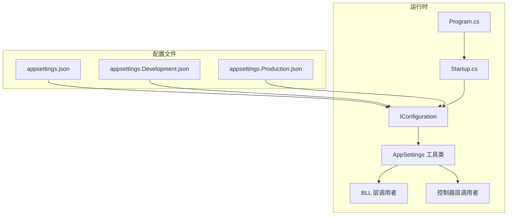
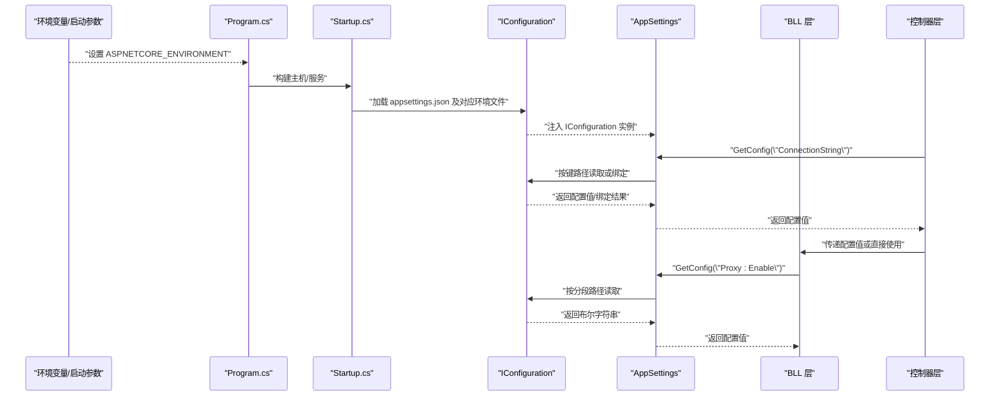
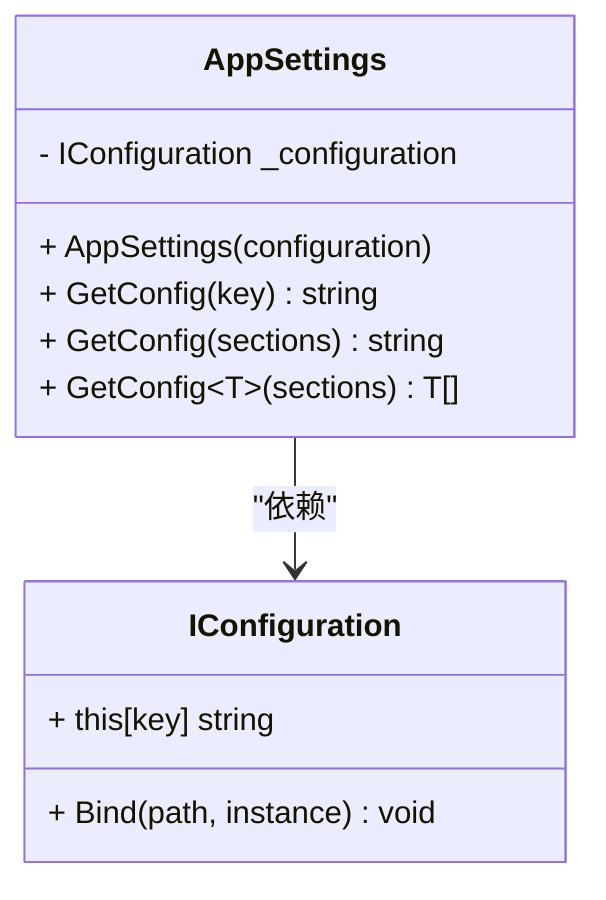
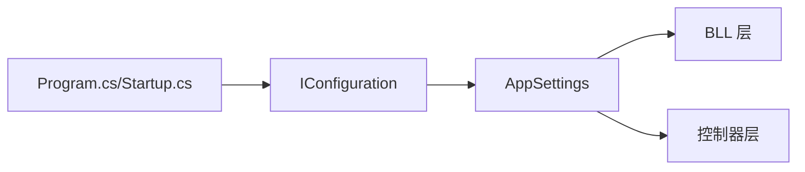

# 配置工具类

<cite>
**本文引用的文件**
- [AppSettings.cs](file://SpeedRunners.API/SpeedRunners.Utils/AppSettings.cs)
- [appsettings.json](file://SpeedRunners.API/SpeedRunners/appsettings.json)
- [appsettings.Development.json](file://SpeedRunners.API/SpeedRunners/appsettings.Development.json)
- [appsettings.Production.json](file://SpeedRunners.API/SpeedRunners/appsettings.Production.json)
- [BLLHelper.cs](file://SpeedRunners.API/SpeedRunners.Utils/BLLHelper.cs)
- [BaseController.cs](file://SpeedRunners.API/SpeedRunners/Controllers/BaseController.cs)
- [Program.cs](file://SpeedRunners.API/SpeedRunners/Program.cs)
- [Startup.cs](file://SpeedRunners.API/SpeedRunners/Startup.cs)
</cite>

## 目录
1. [简介](#简介)
2. [项目结构](#项目结构)
3. [核心组件](#核心组件)
4. [架构总览](#架构总览)
5. [组件详解](#组件详解)
6. [依赖关系分析](#依赖关系分析)
7. [性能与缓存考量](#性能与缓存考量)
8. [故障排除指南](#故障排除指南)
9. [结论](#结论)
10. [附录：使用示例与最佳实践](#附录使用示例与最佳实践)

## 简介
本文件围绕 AppSettings 应用配置工具类进行系统化技术说明，重点覆盖以下方面：
- 配置文件加载与解析机制（含环境选择、合并策略）
- 环境变量读取与优先级
- 配置项访问方式（强类型绑定、动态键值、数组绑定）
- 默认值处理与容错策略
- 在业务层与控制器中的使用范式
- 安全性、性能优化与故障排除建议

## 项目结构
本项目的配置体系由 ASP.NET Core 的 IConfiguration 提供支持，结合多环境配置文件（开发、生产）以及工具类 AppSettings 提供统一访问入口。

图表来源
- [appsettings.json](file://SpeedRunners.API/SpeedRunners/appsettings.json#L1-L21)
- [appsettings.Development.json](file://SpeedRunners.API/SpeedRunners/appsettings.Development.json#L1-L22)
- [appsettings.Production.json](file://SpeedRunners.API/SpeedRunners/appsettings.Production.json#L1-L22)
- [Program.cs](file://SpeedRunners.API/SpeedRunners/Program.cs#L1-L200)
- [Startup.cs](file://SpeedRunners.API/SpeedRunners/Startup.cs#L1-L200)
- [AppSettings.cs](file://SpeedRunners.API/SpeedRunners.Utils/AppSettings.cs#L1-L55)
- [BLLHelper.cs](file://SpeedRunners.API/SpeedRunners.Utils/BLLHelper.cs#L1-L73)
- [BaseController.cs](file://SpeedRunners.API/SpeedRunners/Controllers/BaseController.cs#L1-L26)

章节来源
- [appsettings.json](file://SpeedRunners.API/SpeedRunners/appsettings.json#L1-L21)
- [appsettings.Development.json](file://SpeedRunners.API/SpeedRunners/appsettings.Development.json#L1-L22)
- [appsettings.Production.json](file://SpeedRunners.API/SpeedRunners/appsettings.Production.json#L1-L22)
- [Program.cs](file://SpeedRunners.API/SpeedRunners/Program.cs#L1-L200)
- [Startup.cs](file://SpeedRunners.API/SpeedRunners/Startup.cs#L1-L200)

## 核心组件
- AppSettings 工具类：封装 IConfiguration 的静态访问接口，提供键值读取、分段路径读取、泛型数组绑定等能力。
- 多环境配置文件：通过 appsettings.json 作为基础配置，appsettings.{Environment}.json 进行差异化覆盖。
- 运行时初始化：Program.cs/Startup.cs 负责构建配置源并注入到服务容器，随后由 AppSettings 统一消费。

章节来源
- [AppSettings.cs](file://SpeedRunners.API/SpeedRunners.Utils/AppSettings.cs#L1-L55)
- [appsettings.json](file://SpeedRunners.API/SpeedRunners/appsettings.json#L1-L21)
- [appsettings.Development.json](file://SpeedRunners.API/SpeedRunners/appsettings.Development.json#L1-L22)
- [appsettings.Production.json](file://SpeedRunners.API/SpeedRunners/appsettings.Production.json#L1-L22)
- [Program.cs](file://SpeedRunners.API/SpeedRunners/Program.cs#L1-L200)
- [Startup.cs](file://SpeedRunners.API/SpeedRunners/Startup.cs#L1-L200)

## 架构总览
下图展示了从配置文件到业务层的调用链路与关键决策点（如环境选择、键路径拼接、绑定行为）：

图表来源
- [Program.cs](file://SpeedRunners.API/SpeedRunners/Program.cs#L1-L200)
- [Startup.cs](file://SpeedRunners.API/SpeedRunners/Startup.cs#L1-L200)
- [AppSettings.cs](file://SpeedRunners.API/SpeedRunners.Utils/AppSettings.cs#L1-L55)
- [BLLHelper.cs](file://SpeedRunners.API/SpeedRunners.Utils/BLLHelper.cs#L1-L73)
- [BaseController.cs](file://SpeedRunners.API/SpeedRunners/Controllers/BaseController.cs#L1-L26)

## 组件详解

### AppSettings 工具类
- 设计要点
  - 单例式静态访问：通过构造函数接收 IConfiguration 并保存为静态字段，后续所有读取均基于该实例。
  - 键路径读取：支持单键直取与分段路径拼接（以冒号分隔），便于层级化配置。
  - 泛型数组绑定：利用配置绑定能力将分段路径对应的数组节点绑定为 List<T>。
  - 容错处理：当键不存在或路径无效时，返回空字符串或空列表，避免异常传播。
- 使用场景
  - 基础配置读取：如数据库连接串、第三方 API Key。
  - 分层配置读取：如 Proxy.Enable、Proxy.Address。
  - 数组配置读取：如需要将某节点映射为集合对象。

图表来源
- [AppSettings.cs](file://SpeedRunners.API/SpeedRunners.Utils/AppSettings.cs#L1-L55)

章节来源
- [AppSettings.cs](file://SpeedRunners.API/SpeedRunners.Utils/AppSettings.cs#L1-L55)

### 配置文件加载与解析机制
- 加载顺序与合并规则
  - 基础配置：appsettings.json 作为默认与通用配置。
  - 环境覆盖：appsettings.{Environment}.json 会覆盖同名键，未指定则保留基础值。
  - 环境变量优先级：运行时可通过环境变量对任意键进行覆盖（键名大小写与分隔符规则遵循 IConfiguration 规范）。
- 键路径与分段读取
  - 支持“父:子:孙”形式的分段路径，便于组织复杂配置树。
- 数组绑定
  - 通过绑定器将配置节点映射为集合，适合多目标或多策略场景。

章节来源
- [appsettings.json](file://SpeedRunners.API/SpeedRunners/appsettings.json#L1-L21)
- [appsettings.Development.json](file://SpeedRunners.API/SpeedRunners/appsettings.Development.json#L1-L22)
- [appsettings.Production.json](file://SpeedRunners.API/SpeedRunners/appsettings.Production.json#L1-L22)
- [AppSettings.cs](file://SpeedRunners.API/SpeedRunners.Utils/AppSettings.cs#L46-L52)

### 环境变量读取与默认值处理
- 环境变量覆盖
  - IConfiguration 支持通过环境变量覆盖配置键；键名通常采用“Section:Key”或双冒号分隔的层级形式。
- 默认值策略
  - AppSettings 对于无效键或路径返回空字符串/空列表，可结合调用方进行显式默认值处理。
- 建议
  - 在业务层对关键配置进行二次校验与默认值赋值，确保健壮性。

章节来源
- [AppSettings.cs](file://SpeedRunners.API/SpeedRunners.Utils/AppSettings.cs#L16-L38)

### 配置项访问方法
- 动态键值读取
  - 适用于键名不确定或运行时拼接的场景。
- 分段路径读取
  - 适用于层级化配置，如 Proxy.Enable。
- 强类型绑定
  - 通过泛型绑定将配置节点映射为对象或集合，适合复杂结构。
- 配置缓存
  - AppSettings 依赖 IConfiguration，后者在运行时维护配置快照；建议在高频读取场景避免重复解析，可将常用值缓存至进程内静态变量。

章节来源
- [AppSettings.cs](file://SpeedRunners.API/SpeedRunners.Utils/AppSettings.cs#L16-L52)

### 在业务层与控制器中的使用
- 控制器层
  - 通过依赖注入获取业务对象，必要时可直接调用 AppSettings 获取配置。
- 业务层（BLL）
  - 通过 AppSettings 读取连接串等关键配置，避免硬编码。
- 示例路径
  - 业务层读取连接串：[BLLHelper.cs](file://SpeedRunners.API/SpeedRunners.Utils/BLLHelper.cs#L22)
  - 控制器层延迟初始化业务对象：[BaseController.cs](file://SpeedRunners.API/SpeedRunners/Controllers/BaseController.cs#L14-L23)

章节来源
- [BLLHelper.cs](file://SpeedRunners.API/SpeedRunners.Utils/BLLHelper.cs#L1-L73)
- [BaseController.cs](file://SpeedRunners.API/SpeedRunners/Controllers/BaseController.cs#L1-L26)

### 不同环境下的配置策略
- 开发环境
  - 本地数据库连接串、调试日志级别、代理开关关闭等。
- 生产环境
  - 远程数据库连接串、代理开关开启、更严格的日志级别等。
- 切换方式
  - 通过设置运行时环境变量选择对应配置文件；也可通过命令行参数或容器环境变量覆盖。

章节来源
- [appsettings.Development.json](file://SpeedRunners.API/SpeedRunners/appsettings.Development.json#L1-L22)
- [appsettings.Production.json](file://SpeedRunners.API/SpeedRunners/appsettings.Production.json#L1-L22)

## 依赖关系分析
- 组件耦合
  - AppSettings 仅依赖 IConfiguration，耦合度低，易于替换或扩展。
  - BLL 与控制器通过 AppSettings 间接依赖配置，保持关注点分离。
- 外部依赖
  - IConfiguration 来自 Microsoft.Extensions.Configuration，提供跨平台配置抽象。
- 潜在风险
  - 若未正确初始化 IConfiguration 或未设置环境，可能导致配置缺失或错误覆盖。

图表来源
- [Program.cs](file://SpeedRunners.API/SpeedRunners/Program.cs#L1-L200)
- [Startup.cs](file://SpeedRunners.API/SpeedRunners/Startup.cs#L1-L200)
- [AppSettings.cs](file://SpeedRunners.API/SpeedRunners.Utils/AppSettings.cs#L1-L55)
- [BLLHelper.cs](file://SpeedRunners.API/SpeedRunners.Utils/BLLHelper.cs#L1-L73)
- [BaseController.cs](file://SpeedRunners.API/SpeedRunners/Controllers/BaseController.cs#L1-L26)

## 性能与缓存考量
- 配置读取成本
  - IConfiguration 为内存中的配置快照，读取开销极低；AppSettings 的静态封装几乎无额外成本。
- 缓存建议
  - 对频繁使用的配置值（如连接串、开关标志）可在进程内缓存，减少重复解析。
- 绑定性能
  - 数组/对象绑定在首次发生时有一定开销，建议在应用启动阶段完成必要的绑定，并在后续复用结果。

[本节为通用性能指导，无需列出章节来源]

## 故障排除指南
- 常见问题
  - 键不存在或路径错误：AppSettings 返回空字符串/空列表，需在调用方进行判空与默认值处理。
  - 环境文件未生效：检查运行时环境变量是否正确设置，确认文件命名与路径符合约定。
  - 环境变量覆盖无效：确认键名大小写与分隔符格式（通常为双冒号或冒号分隔）。
- 排查步骤
  - 打印 IConfiguration 中可用键集合，核对键名与路径。
  - 在启动阶段输出当前环境与已加载的配置文件列表，定位加载顺序问题。
  - 对关键配置进行单元测试，验证不同环境下的取值一致性。

章节来源
- [AppSettings.cs](file://SpeedRunners.API/SpeedRunners.Utils/AppSettings.cs#L16-L38)

## 结论
AppSettings 以最小实现提供了统一、稳定的配置访问能力，配合多环境配置文件与 IConfiguration 的强大生态，能够满足从开发到生产的多样化需求。建议在实际工程中结合强类型绑定、显式默认值与进程内缓存，进一步提升可维护性与性能。

[本节为总结性内容，无需列出章节来源]

## 附录：使用示例与最佳实践

### 使用示例（路径指引）
- 读取连接串
  - 在业务层中通过 AppSettings 获取连接串，用于数据库连接。
  - 参考路径：[BLLHelper.cs](file://SpeedRunners.API/SpeedRunners.Utils/BLLHelper.cs#L22)
- 读取代理开关
  - 通过分段路径读取 Proxy.Enable，决定是否启用代理。
  - 参考路径：[AppSettings.cs](file://SpeedRunners.API/SpeedRunners.Utils/AppSettings.cs#L26-L38)
- 绑定数组配置
  - 将某配置节点绑定为集合，用于多目标或多策略场景。
  - 参考路径：[AppSettings.cs](file://SpeedRunners.API/SpeedRunners.Utils/AppSettings.cs#L46-L52)

### 最佳实践
- 配置分类
  - 将配置按功能域拆分（如数据库、第三方服务、日志、代理），便于维护与权限控制。
- 命名规范
  - 使用清晰的层级命名（冒号分隔），避免缩写与歧义。
- 版本控制
  - 将敏感配置移出仓库，使用环境变量或密钥管理服务；保留非敏感默认值在仓库中以便新成员快速上手。
- 环境策略
  - 明确开发、测试、预发布、生产四套配置，严格区分连接串与开关项。
- 安全性
  - 不在代码中硬编码敏感信息；使用环境变量或托管密钥服务；定期轮换密钥。
- 性能优化
  - 对高频读取的配置值进行进程内缓存；避免在热路径中重复绑定复杂对象。
- 可观测性
  - 在启动阶段打印关键配置摘要；对配置变更进行审计与告警。

[本节为实践建议，无需列出章节来源]