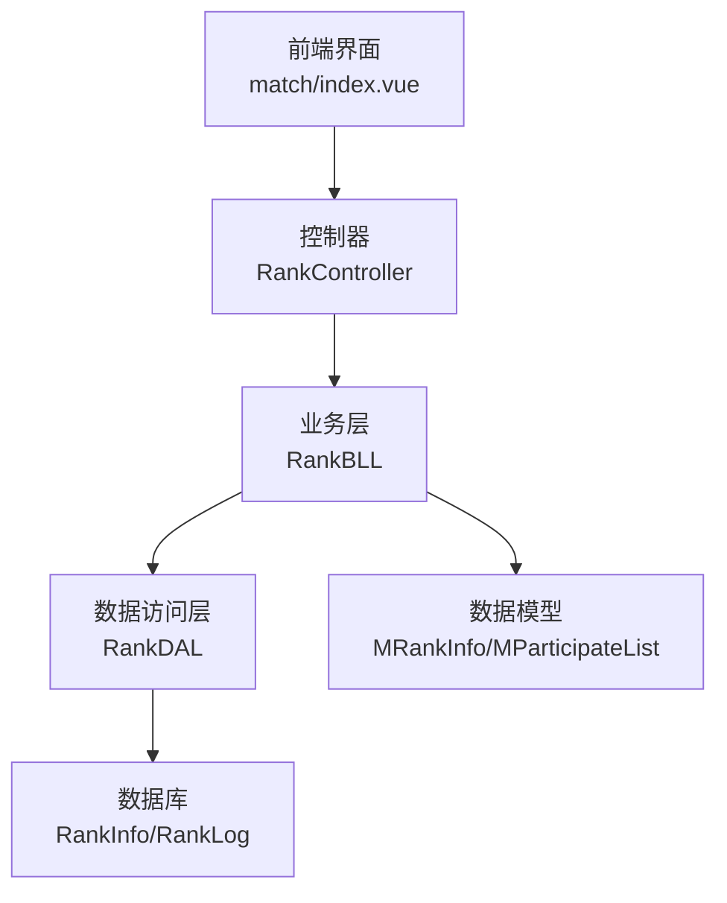
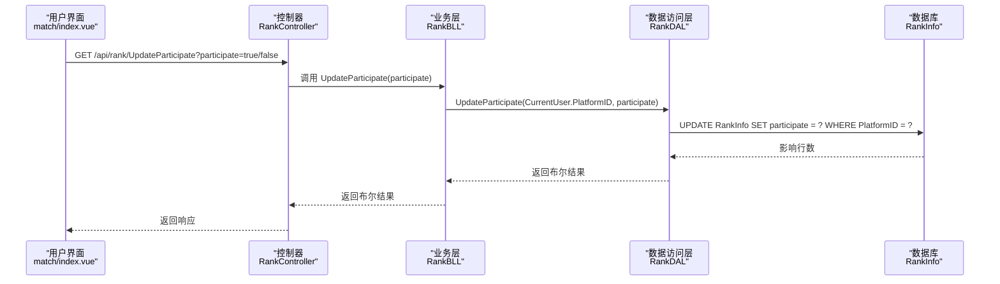
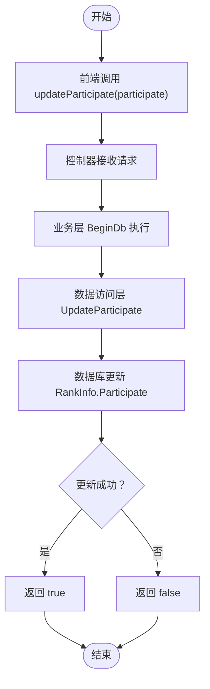
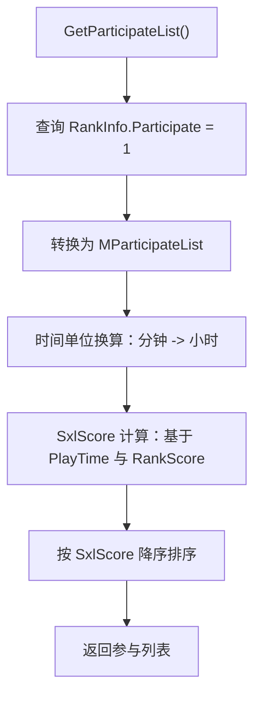
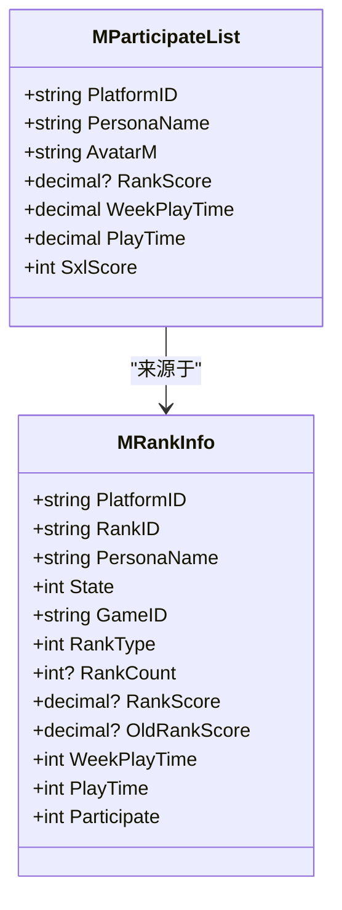
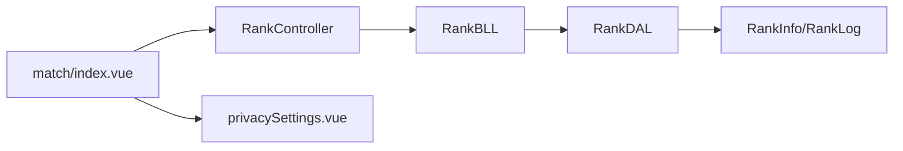

# 参与状态管理

<cite>
**本文引用的文件**
- [RankController.cs](file://SpeedRunners.API/SpeedRunners/Controllers/RankController.cs)
- [RankBLL.cs](file://SpeedRunners.API/SpeedRunners.BLL/RankBLL.cs)
- [RankDAL.cs](file://SpeedRunners.API/SpeedRunners.DAL/RankDAL.cs)
- [MRankInfo.cs](file://SpeedRunners.API/SpeedRunners.Model/Rank/MRankInfo.cs)
- [MParticipateList.cs](file://SpeedRunners.API/SpeedRunners.Model/Rank/MParticipateList.cs)
- [tmdsr.sql](file://mysql-dump/tmdsr.sql)
- [index.vue](file://SpeedRunners.UI/src/views/match/index.vue)
- [privacySettings.vue](file://SpeedRunners.UI/src/views/other/privacySettings.vue)
</cite>

## 目录
1. [引言](#引言)
2. [项目结构](#项目结构)
3. [核心组件](#核心组件)
4. [架构总览](#架构总览)
5. [详细组件分析](#详细组件分析)
6. [依赖关系分析](#依赖关系分析)
7. [性能考虑](#性能考虑)
8. [故障排除指南](#故障排除指南)
9. [结论](#结论)

## 引言
本技术文档围绕“参与状态管理”展开，系统性阐述参与状态的业务逻辑、UpdateParticipate 方法实现、参与列表管理机制、参与状态与排名计算的关系，以及数据模型与数据库操作规范。目标是帮助开发者全面理解参与状态管理的设计思路与实现细节，确保在前端交互与后端数据处理之间保持一致性和可维护性。

## 项目结构
参与状态管理涉及三层架构：
- 表现层（UI）：负责用户交互与调用 API
- 控制器层（API）：暴露 REST 接口，接收请求并委派到业务层
- 业务层（BLL）：封装业务规则，协调数据访问层
- 数据访问层（DAL）：执行数据库操作
- 数据模型（Model）：定义实体结构与字段语义
- 数据库（MySQL）：持久化存储参与状态与排行榜数据

图表来源
- [RankController.cs](file://SpeedRunners.API/SpeedRunners/Controllers/RankController.cs#L1-L48)
- [RankBLL.cs](file://SpeedRunners.API/SpeedRunners.BLL/RankBLL.cs#L1-L210)
- [RankDAL.cs](file://SpeedRunners.API/SpeedRunners.DAL/RankDAL.cs#L1-L175)
- [MRankInfo.cs](file://SpeedRunners.API/SpeedRunners.Model/Rank/MRankInfo.cs#L1-L36)
- [MParticipateList.cs](file://SpeedRunners.API/SpeedRunners.Model/Rank/MParticipateList.cs#L1-L18)
- [tmdsr.sql](file://mysql-dump/tmdsr.sql#L374-L449)

章节来源
- [RankController.cs](file://SpeedRunners.API/SpeedRunners/Controllers/RankController.cs#L1-L48)
- [RankBLL.cs](file://SpeedRunners.API/SpeedRunners.BLL/RankBLL.cs#L1-L210)
- [RankDAL.cs](file://SpeedRunners.API/SpeedRunners.DAL/RankDAL.cs#L1-L175)
- [MRankInfo.cs](file://SpeedRunners.API/SpeedRunners.Model/Rank/MRankInfo.cs#L1-L36)
- [MParticipateList.cs](file://SpeedRunners.API/SpeedRunners.Model/Rank/MParticipateList.cs#L1-L18)
- [tmdsr.sql](file://mysql-dump/tmdsr.sql#L374-L449)

## 核心组件
- 参与状态字段：RankInfo 表中的 Participate 字段用于标记用户是否参与活动或榜单展示。
- 参与列表：通过 GetParticipateList 查询参与状态为 1 的用户，并进行排序与统计口径计算。
- 更新参与状态：通过 UpdateParticipate 将用户参与状态切换为 0 或 1。
- 隐私设置联动：隐私设置会影响榜单可见性与统计口径（如 ShowAddScore、RankType 等）。

章节来源
- [RankBLL.cs](file://SpeedRunners.API/SpeedRunners.BLL/RankBLL.cs#L44-L60)
- [RankDAL.cs](file://SpeedRunners.API/SpeedRunners.DAL/RankDAL.cs#L27-L30)
- [RankDAL.cs](file://SpeedRunners.API/SpeedRunners.DAL/RankDAL.cs#L149-L152)
- [MRankInfo.cs](file://SpeedRunners.API/SpeedRunners.Model/Rank/MRankInfo.cs#L33-L33)
- [tmdsr.sql](file://mysql-dump/tmdsr.sql#L374-L397)

## 架构总览
参与状态管理遵循典型的分层架构，从前端交互到数据库持久化形成闭环。前端通过 match 页面触发报名/取消报名，控制器接收布尔参数并调用业务层，业务层再委派给数据访问层执行数据库更新，最终影响参与列表与统计口径。

图表来源
- [RankController.cs](file://SpeedRunners.API/SpeedRunners/Controllers/RankController.cs#L38-L40)
- [RankBLL.cs](file://SpeedRunners.API/SpeedRunners.BLL/RankBLL.cs#L193-L199)
- [RankDAL.cs](file://SpeedRunners.API/SpeedRunners.DAL/RankDAL.cs#L149-L152)

## 详细组件分析

### UpdateParticipate 方法实现与状态变更流程
- 前端交互：match 页面提供报名/取消报名按钮，点击后调用 updateParticipate 接口，传入布尔参数 participate。
- 控制器映射：控制器将请求路由到 UpdateParticipate，并注入当前用户上下文。
- 业务层处理：业务层封装 BeginDb 事务控制，调用数据访问层更新参与状态。
- 数据访问层：根据当前用户 PlatformID 更新 RankInfo 表的 Participate 字段。
- 结果返回：返回布尔值表示更新是否成功。

图表来源
- [index.vue](file://SpeedRunners.UI/src/views/match/index.vue#L320-L336)
- [RankController.cs](file://SpeedRunners.API/SpeedRunners/Controllers/RankController.cs#L38-L40)
- [RankBLL.cs](file://SpeedRunners.API/SpeedRunners.BLL/RankBLL.cs#L193-L199)
- [RankDAL.cs](file://SpeedRunners.API/SpeedRunners.DAL/RankDAL.cs#L149-L152)

章节来源
- [index.vue](file://SpeedRunners.UI/src/views/match/index.vue#L320-L336)
- [RankController.cs](file://SpeedRunners.API/SpeedRunners/Controllers/RankController.cs#L38-L40)
- [RankBLL.cs](file://SpeedRunners.API/SpeedRunners.BLL/RankBLL.cs#L193-L199)
- [RankDAL.cs](file://SpeedRunners.API/SpeedRunners.DAL/RankDAL.cs#L149-L152)

### 参与列表管理机制
- 查询条件：GetParticipateList 仅查询参与状态为 1 的用户，确保榜单仅显示已报名且符合隐私设置的用户。
- 数据转换：业务层将原始 RankInfo 列表转换为 MParticipateList，进行时间单位换算与 SxlScore 统计口径计算。
- 排序策略：按 SxlScore 降序排列，体现活跃度与贡献度综合评估。

图表来源
- [RankBLL.cs](file://SpeedRunners.API/SpeedRunners.BLL/RankBLL.cs#L44-L60)
- [RankDAL.cs](file://SpeedRunners.API/SpeedRunners.DAL/RankDAL.cs#L27-L30)
- [MParticipateList.cs](file://SpeedRunners.API/SpeedRunners.Model/Rank/MParticipateList.cs#L1-L18)

章节来源
- [RankBLL.cs](file://SpeedRunners.API/SpeedRunners.BLL/RankBLL.cs#L44-L60)
- [RankDAL.cs](file://SpeedRunners.API/SpeedRunners.DAL/RankDAL.cs#L27-L30)
- [MParticipateList.cs](file://SpeedRunners.API/SpeedRunners.Model/Rank/MParticipateList.cs#L1-L18)

### 参与状态与排名计算的关系
- 参与状态直接影响榜单可见性：仅参与状态为 1 的用户进入参与列表。
- 隐私设置影响统计口径：隐私设置中的 ShowAddScore、RankType 等字段会决定新增分数与总分是否对外展示，进而影响排行榜的统计口径。
- 时间维度统计：参与列表中包含周游玩时长与总游玩时长，用于计算 SxlScore，体现活跃度与贡献度。

图表来源
- [MRankInfo.cs](file://SpeedRunners.API/SpeedRunners.Model/Rank/MRankInfo.cs#L1-L36)
- [MParticipateList.cs](file://SpeedRunners.API/SpeedRunners.Model/Rank/MParticipateList.cs#L1-L18)

章节来源
- [MRankInfo.cs](file://SpeedRunners.API/SpeedRunners.Model/Rank/MRankInfo.cs#L22-L33)
- [MParticipateList.cs](file://SpeedRunners.API/SpeedRunners.Model/Rank/MParticipateList.cs#L12-L16)

### 数据模型说明与数据库操作规范
- 数据模型字段语义
  - RankInfo.Participate：参与状态（0/1），决定是否参与榜单展示
  - RankInfo.RankType：参与状态枚举（0无游戏,1上榜,2隐私权限不上榜，3资料隐私）
  - RankInfo.RankScore/OldRankScore：天梯分与昨日天梯分
  - RankInfo.WeekPlayTime/PlayTime：周游玩时长与总游玩时长
  - MParticipateList.SxlScore：综合活跃度指标，由 PlayTime 与 RankScore 决定
- 数据库操作规范
  - 更新参与状态：使用 UPDATE RankInfo SET participate = ? WHERE PlatformID = ?
  - 查询参与列表：WHERE Participate = 1 ORDER BY RankScore DESC
  - 隐私设置联动：当 RequestRankData 开启时，RankType 自动调整为 1 或 2，同时可同步 ShowAddScore

章节来源
- [tmdsr.sql](file://mysql-dump/tmdsr.sql#L374-L397)
- [RankDAL.cs](file://SpeedRunners.API/SpeedRunners.DAL/RankDAL.cs#L149-L152)
- [RankDAL.cs](file://SpeedRunners.API/SpeedRunners.DAL/RankDAL.cs#L27-L30)
- [privacySettings.vue](file://SpeedRunners.UI/src/views/other/privacySettings.vue#L39-L95)

## 依赖关系分析
- 控制器依赖业务层：控制器仅负责参数绑定与路由转发，具体业务逻辑由业务层实现。
- 业务层依赖数据访问层：业务层封装事务与业务规则，数据访问层负责 SQL 执行。
- 数据访问层依赖数据库：直接操作 RankInfo 与 RankLog 表，保证数据一致性。
- 前端依赖控制器：前端通过 API 接口与后端交互，实现报名/取消报名与参与列表展示。

图表来源
- [RankController.cs](file://SpeedRunners.API/SpeedRunners/Controllers/RankController.cs#L1-L48)
- [RankBLL.cs](file://SpeedRunners.API/SpeedRunners.BLL/RankBLL.cs#L1-L210)
- [RankDAL.cs](file://SpeedRunners.API/SpeedRunners.DAL/RankDAL.cs#L1-L175)
- [index.vue](file://SpeedRunners.UI/src/views/match/index.vue#L320-L336)
- [privacySettings.vue](file://SpeedRunners.UI/src/views/other/privacySettings.vue#L39-L95)

章节来源
- [RankController.cs](file://SpeedRunners.API/SpeedRunners/Controllers/RankController.cs#L1-L48)
- [RankBLL.cs](file://SpeedRunners.API/SpeedRunners.BLL/RankBLL.cs#L1-L210)
- [RankDAL.cs](file://SpeedRunners.API/SpeedRunners.DAL/RankDAL.cs#L1-L175)
- [index.vue](file://SpeedRunners.UI/src/views/match/index.vue#L320-L336)
- [privacySettings.vue](file://SpeedRunners.UI/src/views/other/privacySettings.vue#L39-L95)

## 性能考虑
- 查询优化：参与列表查询仅筛选参与状态为 1 的用户，避免全表扫描；建议在 Participate 字段建立索引以提升查询效率。
- 统计口径计算：SxlScore 计算涉及 PlayTime 与 RankScore 的复合运算，建议在业务层进行批量计算并缓存中间结果，减少重复计算。
- 隐私设置影响：新增分数与总分的展示受隐私设置控制，建议在查询阶段统一过滤，避免前端多次过滤导致性能损耗。
- 事务控制：业务层使用 BeginDb 进行事务控制，确保更新参与状态与日志写入的一致性。

## 故障排除指南
- 更新参与状态失败
  - 检查当前用户上下文是否正确传递至业务层
  - 确认数据库连接字符串与权限配置
  - 核对 RankInfo 表是否存在对应 PlatformID 记录
- 参与列表为空
  - 确认至少存在一条参与状态为 1 的记录
  - 检查隐私设置是否限制了新增分数或总分展示
- SxlScore 计算异常
  - 核对 PlayTime 与 RankScore 字段是否为空
  - 检查时间单位换算逻辑是否一致（分钟转小时）

章节来源
- [RankBLL.cs](file://SpeedRunners.API/SpeedRunners.BLL/RankBLL.cs#L44-L60)
- [RankDAL.cs](file://SpeedRunners.API/SpeedRunners.DAL/RankDAL.cs#L27-L30)
- [privacySettings.vue](file://SpeedRunners.UI/src/views/other/privacySettings.vue#L39-L95)

## 结论
参与状态管理通过清晰的分层设计与严格的数据库约束，实现了从用户报名到榜单展示的完整闭环。UpdateParticipate 方法简洁高效，配合参与列表的统计口径与隐私设置联动，确保了数据一致性与用户体验。建议在生产环境中进一步完善索引策略与缓存机制，持续优化查询与计算性能。