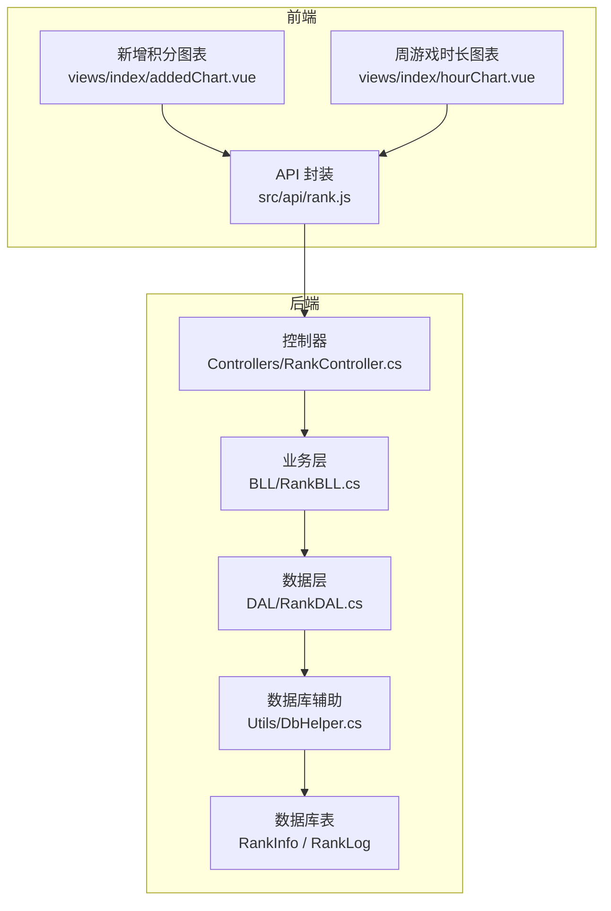
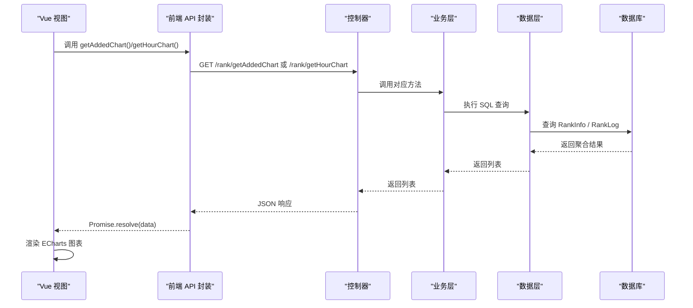
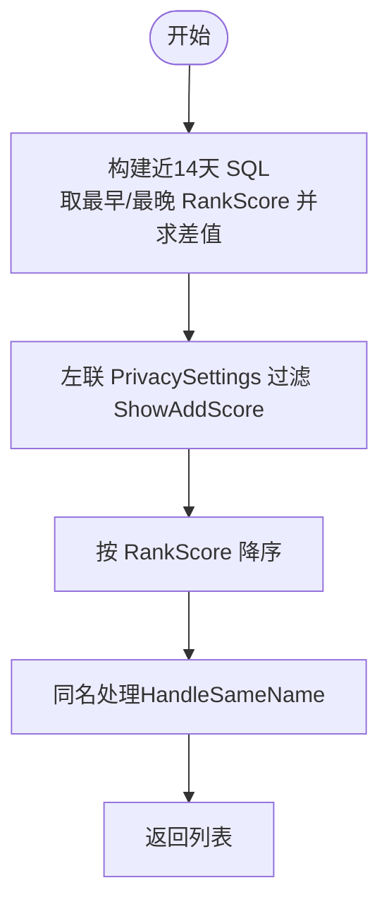
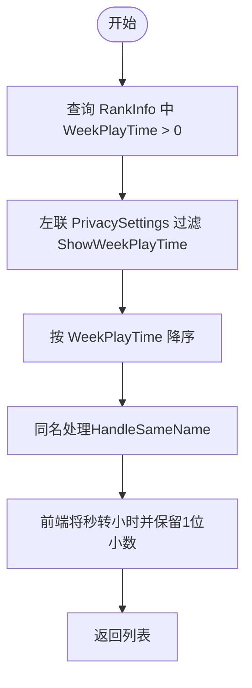
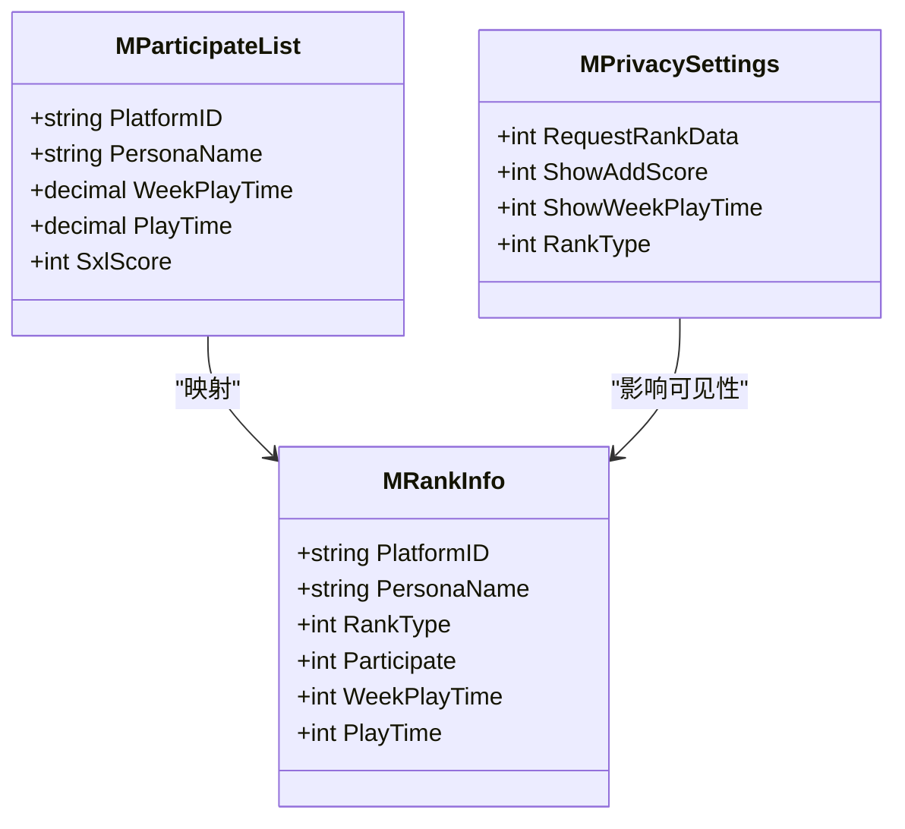
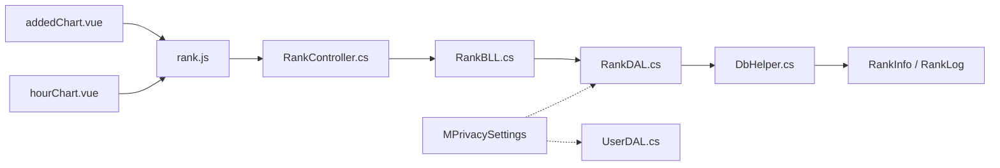

# 图表数据统计

<cite>
**本文引用的文件**
- [RankController.cs](file://SpeedRunners.API/SpeedRunners/Controllers/RankController.cs)
- [RankBLL.cs](file://SpeedRunners.API/SpeedRunners.BLL/RankBLL.cs)
- [RankDAL.cs](file://SpeedRunners.API/SpeedRunners.DAL/RankDAL.cs)
- [DbHelper.cs](file://SpeedRunners.API/SpeedRunners.Utils/DbHelper.cs)
- [rank.js](file://SpeedRunners.UI/src/api/rank.js)
- [addedChart.vue](file://SpeedRunners.UI/src/views/index/addedChart.vue)
- [hourChart.vue](file://SpeedRunners.UI/src/views/index/hourChart.vue)
- [tmdsr.sql](file://mysql-dump/tmdsr.sql)
- [MPrivacySettings.cs](file://SpeedRunners.API/SpeedRunners.Model/User/MPrivacySettings.cs)
- [UserDAL.cs](file://SpeedRunners.API/SpeedRunners.DAL/UserDAL.cs)
- [UserBLL.cs](file://SpeedRunners.API/SpeedRunners.BLL/UserBLL.cs)
- [MParticipateList.cs](file://SpeedRunners.API/SpeedRunners.Model/Rank/MParticipateList.cs)
- [MPrivacySettings.cs](file://SpeedRunners.API/SpeedRunners.Model/User/MPrivacySettings.cs)
</cite>

## 目录
1. [简介](#简介)
2. [项目结构](#项目结构)
3. [核心组件](#核心组件)
4. [架构总览](#架构总览)
5. [详细组件分析](#详细组件分析)
6. [依赖关系分析](#依赖关系分析)
7. [性能考虑](#性能考虑)
8. [故障排查指南](#故障排查指南)
9. [结论](#结论)
10. [附录](#附录)

## 简介
本技术文档聚焦于“图表数据统计”功能，系统性解析后端 GetAddedChart 与 GetHourChart 的实现原理，阐明不同图表数据的生成逻辑、数据聚合方式与隐私控制机制，并给出缓存策略与性能优化建议，以及前后端数据格式规范与前端展示建议，帮助开发者高效理解并正确使用图表统计数据。

## 项目结构
图表数据统计涉及三层：前端视图层（Vue 组件）、前端 API 层（Axios 请求封装）、后端 API 控制器层、业务层（BLL）与数据访问层（DAL），并通过数据库表进行数据持久化。

**图表来源**
- [rank.js](file://SpeedRunners.UI/src/api/rank.js#L31-L43)
- [addedChart.vue](file://SpeedRunners.UI/src/views/index/addedChart.vue#L63-L76)
- [hourChart.vue](file://SpeedRunners.UI/src/views/index/hourChart.vue#L69-L85)
- [RankController.cs](file://SpeedRunners.API/SpeedRunners/Controllers/RankController.cs#L19-L24)
- [RankBLL.cs](file://SpeedRunners.API/SpeedRunners.BLL/RankBLL.cs#L78-L96)
- [RankDAL.cs](file://SpeedRunners.API/SpeedRunners.DAL/RankDAL.cs#L44-L92)
- [DbHelper.cs](file://SpeedRunners.API/SpeedRunners.Utils/DbHelper.cs#L164-L187)
- [tmdsr.sql](file://mysql-dump/tmdsr.sql#L374-L449)

**章节来源**
- [rank.js](file://SpeedRunners.UI/src/api/rank.js#L1-L64)
- [addedChart.vue](file://SpeedRunners.UI/src/views/index/addedChart.vue#L1-L148)
- [hourChart.vue](file://SpeedRunners.UI/src/views/index/hourChart.vue#L1-L161)
- [RankController.cs](file://SpeedRunners.API/SpeedRunners/Controllers/RankController.cs#L1-L48)
- [RankBLL.cs](file://SpeedRunners.API/SpeedRunners.BLL/RankBLL.cs#L1-L210)
- [RankDAL.cs](file://SpeedRunners.API/SpeedRunners.DAL/RankDAL.cs#L1-L175)
- [DbHelper.cs](file://SpeedRunners.API/SpeedRunners.Utils/DbHelper.cs#L152-L282)
- [tmdsr.sql](file://mysql-dump/tmdsr.sql#L360-L559)

## 核心组件
- 前端图表组件
  - 新增积分图表：addedChart.vue
  - 周游戏时长图表：hourChart.vue
- 前端 API 封装：rank.js
- 后端控制器：RankController.cs
- 业务层：RankBLL.cs
- 数据层：RankDAL.cs
- 数据库：RankInfo、RankLog 表
- 隐私设置：MPrivacySettings、UserDAL、UserBLL

**章节来源**
- [addedChart.vue](file://SpeedRunners.UI/src/views/index/addedChart.vue#L1-L148)
- [hourChart.vue](file://SpeedRunners.UI/src/views/index/hourChart.vue#L1-L161)
- [rank.js](file://SpeedRunners.UI/src/api/rank.js#L31-L43)
- [RankController.cs](file://SpeedRunners.API/SpeedRunners/Controllers/RankController.cs#L19-L24)
- [RankBLL.cs](file://SpeedRunners.API/SpeedRunners.BLL/RankBLL.cs#L78-L96)
- [RankDAL.cs](file://SpeedRunners.API/SpeedRunners.DAL/RankDAL.cs#L44-L92)
- [tmdsr.sql](file://mysql-dump/tmdsr.sql#L374-L449)
- [MPrivacySettings.cs](file://SpeedRunners.API/SpeedRunners.Model/User/MPrivacySettings.cs#L1-L22)
- [UserDAL.cs](file://SpeedRunners.API/SpeedRunners.DAL/UserDAL.cs#L13-L35)
- [UserBLL.cs](file://SpeedRunners.API/SpeedRunners.BLL/UserBLL.cs#L26-L33)

## 架构总览
图表数据统计遵循经典的分层架构：前端通过 API 获取数据，后端控制器接收请求，业务层组织数据，数据层执行 SQL 查询，最终返回给前端渲染。

**图表来源**
- [rank.js](file://SpeedRunners.UI/src/api/rank.js#L31-L43)
- [RankController.cs](file://SpeedRunners.API/SpeedRunners/Controllers/RankController.cs#L19-L24)
- [RankBLL.cs](file://SpeedRunners.API/SpeedRunners.BLL/RankBLL.cs#L78-L96)
- [RankDAL.cs](file://SpeedRunners.API/SpeedRunners.DAL/RankDAL.cs#L44-L92)
- [tmdsr.sql](file://mysql-dump/tmdsr.sql#L374-L449)

## 详细组件分析

### GetAddedChart 实现原理与数据聚合
- 功能目标：统计近两周内天梯分增长排行，按平台 ID 聚合，过滤掉无增长或隐私限制的用户。
- SQL 关键点
  - 时间窗口：近 14 天（包含边界）
  - 聚合策略：对每个平台 ID，取其最早一次记录与最近一次记录的差值作为“新增分”
  - 隐私过滤：仅显示允许公开“新增分”的用户
- 数据处理
  - 后端返回 MRankInfo 列表（含 PlatformID、PersonaName、AvatarS、RankScore 差值）
  - 前端 reverse 排序并渲染为横向条形图，支持头像富文本标签
- 隐私控制
  - 通过 PrivacySettings 的 ShowAddScore 字段控制是否对外展示新增分
  - 若用户关闭隐私，则该用户不参与统计

**图表来源**
- [RankDAL.cs](file://SpeedRunners.API/SpeedRunners.DAL/RankDAL.cs#L44-L81)
- [RankBLL.cs](file://SpeedRunners.API/SpeedRunners.BLL/RankBLL.cs#L78-L84)
- [MPrivacySettings.cs](file://SpeedRunners.API/SpeedRunners.Model/User/MPrivacySettings.cs#L14-L16)

**章节来源**
- [RankDAL.cs](file://SpeedRunners.API/SpeedRunners.DAL/RankDAL.cs#L44-L81)
- [RankBLL.cs](file://SpeedRunners.API/SpeedRunners.BLL/RankBLL.cs#L78-L84)
- [addedChart.vue](file://SpeedRunners.UI/src/views/index/addedChart.vue#L63-L76)
- [MPrivacySettings.cs](file://SpeedRunners.API/SpeedRunners.Model/User/MPrivacySettings.cs#L14-L16)

### GetHourChart 实现原理与数据聚合
- 功能目标：统计上周游戏时长排行，按周累计时长降序排列。
- SQL 关键点
  - 条件：WeekPlayTime > 0
  - 隐私过滤：仅显示允许公开“周游戏时长”的用户
- 数据处理
  - 后端返回 MRankInfo 列表（含 PlatformID、PersonaName、AvatarS、WeekPlayTime）
  - 前端 reverse 排序并过滤掉时长为 0 的项，将秒转换为小时并保留一位小数
- 隐私控制
  - 通过 PrivacySettings 的 ShowWeekPlayTime 字段控制是否对外展示周时长

**图表来源**
- [RankDAL.cs](file://SpeedRunners.API/SpeedRunners.DAL/RankDAL.cs#L83-L92)
- [RankBLL.cs](file://SpeedRunners.API/SpeedRunners.BLL/RankBLL.cs#L90-L96)
- [hourChart.vue](file://SpeedRunners.UI/src/views/index/hourChart.vue#L69-L85)
- [MPrivacySettings.cs](file://SpeedRunners.API/SpeedRunners.Model/User/MPrivacySettings.cs#L14-L16)

**章节来源**
- [RankDAL.cs](file://SpeedRunners.API/SpeedRunners.DAL/RankDAL.cs#L83-L92)
- [RankBLL.cs](file://SpeedRunners.API/SpeedRunners.BLL/RankBLL.cs#L90-L96)
- [hourChart.vue](file://SpeedRunners.UI/src/views/index/hourChart.vue#L69-L85)
- [MPrivacySettings.cs](file://SpeedRunners.API/SpeedRunners.Model/User/MPrivacySettings.cs#L14-L16)

### 参与状态统计与活跃用户分析
- 参与状态统计
  - 参与榜单：RankType = 1 的用户
  - 隐私限制：RankType = 2（不参与榜单）或 RankType = 3（资料隐私）
  - 参与开关：Participate 字段用于标记当前是否参与
- 活跃用户分析
  - 基于 WeekPlayTime 与 PlayTime 的差异计算活跃度指标（如 SxlScore 示例）
  - 前端参与列表接口返回参与用户的综合评分与时间维度数据
- 隐私控制
  - 通过 PrivacySettings 的 RequestRankData 与 RankType 控制是否允许他人查看排行榜

**图表来源**
- [MPrivacySettings.cs](file://SpeedRunners.API/SpeedRunners.Model/User/MPrivacySettings.cs#L1-L22)
- [MPrivacySettings.cs](file://SpeedRunners.API/SpeedRunners.Model/User/MPrivacySettings.cs#L1-L22)
- [MParticipateList.cs](file://SpeedRunners.API/SpeedRunners.Model/Rank/MParticipateList.cs#L1-L18)
- [RankBLL.cs](file://SpeedRunners.API/SpeedRunners.BLL/RankBLL.cs#L44-L60)

**章节来源**
- [RankBLL.cs](file://SpeedRunners.API/SpeedRunners.BLL/RankBLL.cs#L44-L60)
- [UserBLL.cs](file://SpeedRunners.API/SpeedRunners.BLL/UserBLL.cs#L26-L33)
- [UserDAL.cs](file://SpeedRunners.API/SpeedRunners.DAL/UserDAL.cs#L13-L35)
- [MParticipateList.cs](file://SpeedRunners.API/SpeedRunners.Model/Rank/MParticipateList.cs#L1-L18)

### 时间维度数据处理
- 新增积分时间窗口：近 14 天，SQL 通过 UNION 合并“近 N 天内最新记录”与“N 天前最大日期记录”，确保跨日期边界也能正确计算差值
- 周游戏时长：直接取 WeekPlayTime 字段，单位为秒，前端转换为小时
- 同名处理：当多人同名时，通过 HandleSameName 在名称后追加空格以区分

**章节来源**
- [RankDAL.cs](file://SpeedRunners.API/SpeedRunners.DAL/RankDAL.cs#L44-L92)
- [RankDAL.cs](file://SpeedRunners.API/SpeedRunners.DAL/RankDAL.cs#L94-L119)
- [hourChart.vue](file://SpeedRunners.UI/src/views/index/hourChart.vue#L70-L72)

## 依赖关系分析
- 前端依赖
  - addedChart.vue 与 hourChart.vue 依赖 src/api/rank.js 提供的 getAddedChart 与 getHourChart
  - ECharts 库负责渲染，dataset/yAxis 使用富文本头像标签
- 后端依赖
  - RankController 依赖 RankBLL
  - RankBLL 依赖 RankDAL
  - RankDAL 依赖 DbHelper 与数据库表（RankInfo、RankLog）
  - 隐私设置通过 UserDAL 与 MPrivacySettings 协作

**图表来源**
- [addedChart.vue](file://SpeedRunners.UI/src/views/index/addedChart.vue#L17-L88)
- [hourChart.vue](file://SpeedRunners.UI/src/views/index/hourChart.vue#L17-L98)
- [rank.js](file://SpeedRunners.UI/src/api/rank.js#L31-L43)
- [RankController.cs](file://SpeedRunners.API/SpeedRunners/Controllers/RankController.cs#L19-L24)
- [RankBLL.cs](file://SpeedRunners.API/SpeedRunners.BLL/RankBLL.cs#L78-L96)
- [RankDAL.cs](file://SpeedRunners.API/SpeedRunners.DAL/RankDAL.cs#L44-L92)
- [DbHelper.cs](file://SpeedRunners.API/SpeedRunners.Utils/DbHelper.cs#L164-L187)
- [tmdsr.sql](file://mysql-dump/tmdsr.sql#L374-L449)
- [MPrivacySettings.cs](file://SpeedRunners.API/SpeedRunners.Model/User/MPrivacySettings.cs#L1-L22)
- [UserDAL.cs](file://SpeedRunners.API/SpeedRunners.DAL/UserDAL.cs#L13-L35)

**章节来源**
- [rank.js](file://SpeedRunners.UI/src/api/rank.js#L1-L64)
- [RankController.cs](file://SpeedRunners.API/SpeedRunners/Controllers/RankController.cs#L1-L48)
- [RankBLL.cs](file://SpeedRunners.API/SpeedRunners.BLL/RankBLL.cs#L1-L210)
- [RankDAL.cs](file://SpeedRunners.API/SpeedRunners.DAL/RankDAL.cs#L1-L175)
- [DbHelper.cs](file://SpeedRunners.API/SpeedRunners.Utils/DbHelper.cs#L152-L282)
- [tmdsr.sql](file://mysql-dump/tmdsr.sql#L360-L559)
- [MPrivacySettings.cs](file://SpeedRunners.API/SpeedRunners.Model/User/MPrivacySettings.cs#L1-L22)
- [UserDAL.cs](file://SpeedRunners.API/SpeedRunners.DAL/UserDAL.cs#L13-L35)

## 性能考虑
- 查询性能
  - 建议在 RankInfo 上建立索引：WeekPlayTime、RankScore、RankType、Participate
  - 在 RankLog 上建立索引：PlatformID、Date，以加速时间窗口聚合
- SQL 优化
  - 使用 EXPLAIN 分析 UNION 与 JOIN 的执行计划，必要时拆分查询或引入临时表
  - 对 HandleSameName 的字符串拼接操作，可在业务层批量处理，减少前端循环
- 缓存策略
  - 对高频访问的图表数据（如近 14 天新增分、周时长）引入 Redis 缓存，设置合理过期时间（如 5-10 分钟）
  - 缓存键建议：chart:added:YYYYMMDD、chart:hour:YYYYMMDD
  - 写入策略：定时任务或数据变更事件触发刷新
- 前端渲染
  - ECharts 使用 dataset + encode，避免手动拼装数组，减少内存占用
  - 对长列表采用虚拟滚动或分页，降低 DOM 压力

[本节为通用性能建议，无需特定文件引用]

## 故障排查指南
- 前端无法加载图表
  - 检查 API 是否返回 200，确认 src/api/rank.js 的请求路径与控制器一致
  - 查看 addedChart.vue/hourChart.vue 的 mounted 生命周期与 ECharts 初始化
- 数据为空或不完整
  - 核对隐私设置：ShowAddScore、ShowWeekPlayTime 是否被关闭
  - 检查数据库中对应字段是否为空或为 0
- SQL 报错或慢查询
  - 使用 EXPLAIN 分析 SQL，确认索引是否命中
  - 检查时间窗口边界与 UNION 逻辑是否正确
- 隐私设置未生效
  - 确认 UserDAL 的 GetPrivacySettings 与 SetPrivacySettings 是否正确写入 PrivacySettings 表
  - 检查 RankDAL 查询是否包含隐私过滤条件

**章节来源**
- [rank.js](file://SpeedRunners.UI/src/api/rank.js#L31-L43)
- [addedChart.vue](file://SpeedRunners.UI/src/views/index/addedChart.vue#L61-L88)
- [hourChart.vue](file://SpeedRunners.UI/src/views/index/hourChart.vue#L67-L98)
- [RankDAL.cs](file://SpeedRunners.API/SpeedRunners.DAL/RankDAL.cs#L44-L92)
- [UserDAL.cs](file://SpeedRunners.API/SpeedRunners.DAL/UserDAL.cs#L13-L35)

## 结论
GetAddedChart 与 GetHourChart 通过明确的时间窗口与隐私过滤，实现了稳定的图表数据输出。结合合理的数据库索引、业务层聚合与前端渲染优化，可在大数据量场景下保持良好的查询与展示性能。建议进一步引入缓存与异步刷新机制，持续提升用户体验。

[本节为总结性内容，无需特定文件引用]

## 附录

### 数据模型与字段说明
- RankInfo
  - PlatformID：平台 ID（SteamID64）
  - PersonaName：游戏昵称
  - AvatarS/M/L：头像地址（小/中/大）
  - RankType：参与状态（0 无游戏，1 上榜，2 不上榜，3 资料隐私）
  - Participate：参与开关
  - WeekPlayTime：周累计游戏时长（秒）
  - PlayTime：总游戏时长（秒）
  - RankScore/OldRankScore：当前/昨日天梯分
- RankLog
  - PlatformID：平台 ID
  - RankScore：记录时的天梯分
  - Date：记录日期
- PrivacySettings
  - RequestRankData：是否允许获取排行榜数据
  - ShowAddScore：是否显示新增分
  - ShowWeekPlayTime：是否显示周游戏时长
  - RankType：排行榜开关（1 开，2 关）

**章节来源**
- [tmdsr.sql](file://mysql-dump/tmdsr.sql#L374-L449)
- [MPrivacySettings.cs](file://SpeedRunners.API/SpeedRunners.Model/User/MPrivacySettings.cs#L1-L22)

### 前后端数据格式规范
- 前端请求
  - getAddedChart(): GET /rank/getAddedChart
  - getHourChart(): GET /rank/getHourChart
- 后端响应
  - 类型：List<MRankInfo>
  - 字段：PlatformID、PersonaName、AvatarS、RankScore（新增分）、WeekPlayTime（周时长，秒）
- 前端展示
  - 新增积分：横向条形图，x 轴为新增分，y 轴为昵称，头像以富文本方式显示
  - 周游戏时长：横向条形图，x 轴为小时数，y 轴为昵称，头像以富文本方式显示

**章节来源**
- [rank.js](file://SpeedRunners.UI/src/api/rank.js#L31-L43)
- [RankController.cs](file://SpeedRunners.API/SpeedRunners/Controllers/RankController.cs#L19-L24)
- [RankBLL.cs](file://SpeedRunners.API/SpeedRunners.BLL/RankBLL.cs#L78-L96)
- [addedChart.vue](file://SpeedRunners.UI/src/views/index/addedChart.vue#L108-L144)
- [hourChart.vue](file://SpeedRunners.UI/src/views/index/hourChart.vue#L121-L157)