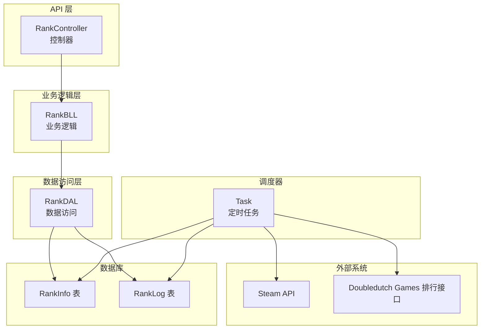
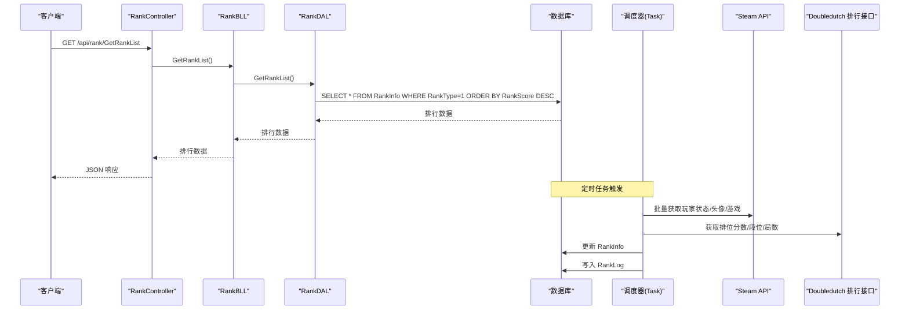
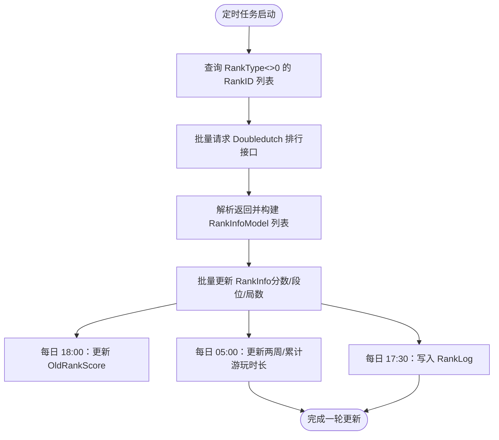
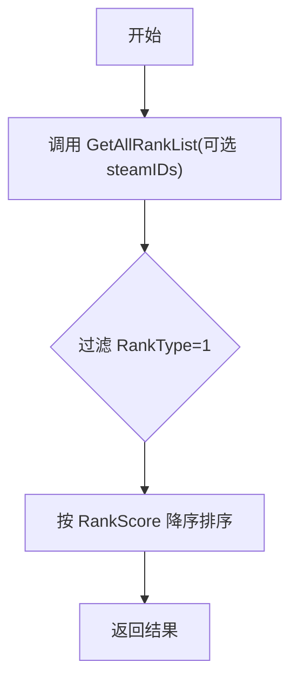
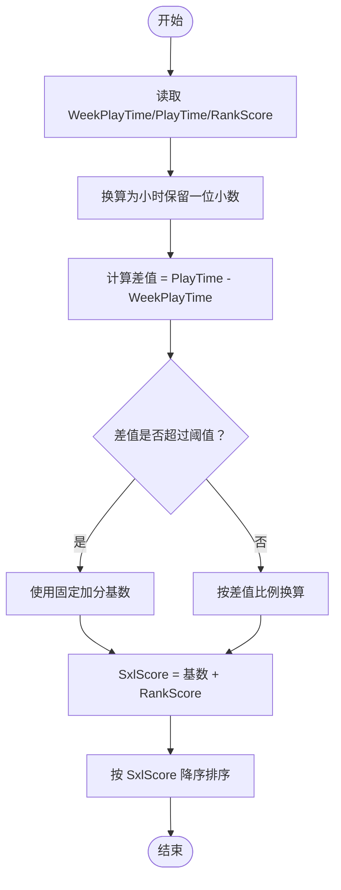
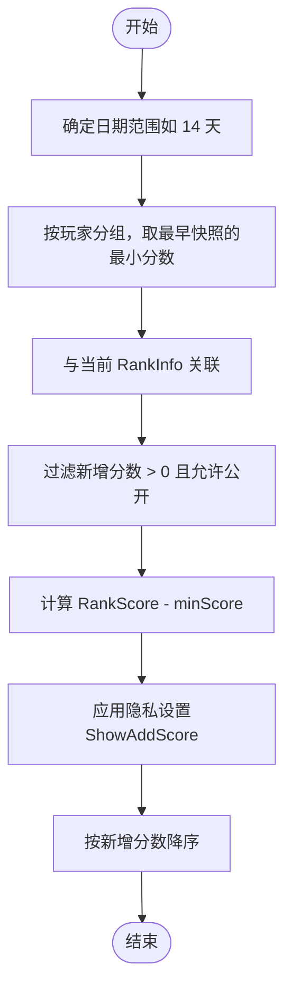
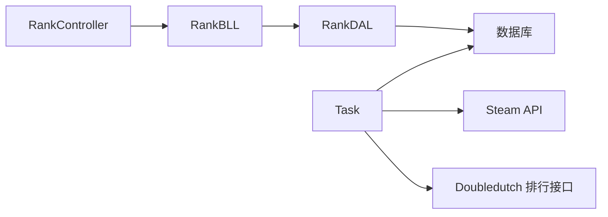

# 排名算法实现

<cite>
**本文档引用的文件**
- [RankBLL.cs](file://SpeedRunners.API/SpeedRunners.BLL/RankBLL.cs)
- [RankDAL.cs](file://SpeedRunners.API/SpeedRunners.DAL/RankDAL.cs)
- [RankController.cs](file://SpeedRunners.API/SpeedRunners/Controllers/RankController.cs)
- [MRankInfo.cs](file://SpeedRunners.API/SpeedRunners.Model/Rank/MRankInfo.cs)
- [MParticipateList.cs](file://SpeedRunners.API/SpeedRunners.Model/Rank/MParticipateList.cs)
- [MRankLog.cs](file://SpeedRunners.API/SpeedRunners.Model/Rank/MRankLog.cs)
- [Task.cs](file://SpeedRunners.Scheduler/Task.cs)
- [RankInfoModel.cs](file://SpeedRunners.Scheduler/RankInfoModel.cs)
- [tmdsr.sql](file://mysql-dump/tmdsr.sql)
- [UserDAL.cs](file://SpeedRunners.API/SpeedRunners.DAL/UserDAL.cs)
</cite>

## 目录
1. [简介](#简介)
2. [项目结构](#项目结构)
3. [核心组件](#核心组件)
4. [架构总览](#架构总览)
5. [详细组件分析](#详细组件分析)
6. [依赖关系分析](#依赖关系分析)
7. [性能考虑](#性能考虑)
8. [故障排除指南](#故障排除指南)
9. [结论](#结论)

## 简介
本技术文档围绕 SpeedRunners 的排名算法实现展开，重点解释以下内容：
- 排名计算的核心算法原理：分数计算公式、权重分配机制与排序规则
- RankBLL 中 GetRankList 方法的实现细节：如何从原始数据中提取有效信息并进行综合评分
- 实时排名更新的数据流处理：数据采集、预处理、计算与缓存更新
- 时间复杂度分析与性能优化策略
- 提供可追溯的代码路径与算法步骤说明，帮助开发者快速理解设计思路与实现细节

## 项目结构
该项目采用典型的三层架构（API 层、业务逻辑层、数据访问层），配合独立的调度器模块完成定时任务与外部数据同步。

图表来源
- [RankController.cs](file://SpeedRunners.API/SpeedRunners/Controllers/RankController.cs#L1-L48)
- [RankBLL.cs](file://SpeedRunners.API/SpeedRunners.BLL/RankBLL.cs#L1-L210)
- [RankDAL.cs](file://SpeedRunners.API/SpeedRunners.DAL/RankDAL.cs#L1-L175)
- [Task.cs](file://SpeedRunners.Scheduler/Task.cs#L1-L349)
- [tmdsr.sql](file://mysql-dump/tmdsr.sql#L374-L449)

章节来源
- [RankController.cs](file://SpeedRunners.API/SpeedRunners/Controllers/RankController.cs#L1-L48)
- [RankBLL.cs](file://SpeedRunners.API/SpeedRunners.BLL/RankBLL.cs#L1-L210)
- [RankDAL.cs](file://SpeedRunners.API/SpeedRunners.DAL/RankDAL.cs#L1-L175)
- [Task.cs](file://SpeedRunners.Scheduler/Task.cs#L1-L349)
- [tmdsr.sql](file://mysql-dump/tmdsr.sql#L374-L449)

## 核心组件
- 排行榜控制器：提供对外 API，封装业务调用
- 排行榜业务逻辑：负责数据聚合、评分计算与参与状态处理
- 排行榜数据访问：封装 SQL 查询与更新操作
- 调度器：定时抓取 Steam 与 Doubledutch 数据，维护 RankInfo 与 RankLog

章节来源
- [RankController.cs](file://SpeedRunners.API/SpeedRunners/Controllers/RankController.cs#L1-L48)
- [RankBLL.cs](file://SpeedRunners.API/SpeedRunners.BLL/RankBLL.cs#L1-L210)
- [RankDAL.cs](file://SpeedRunners.API/SpeedRunners.DAL/RankDAL.cs#L1-L175)
- [Task.cs](file://SpeedRunners.Scheduler/Task.cs#L1-L349)

## 架构总览
下图展示从请求到数据更新的端到端流程：

图表来源
- [RankController.cs](file://SpeedRunners.API/SpeedRunners/Controllers/RankController.cs#L16-L17)
- [RankBLL.cs](file://SpeedRunners.API/SpeedRunners.BLL/RankBLL.cs#L28-L34)
- [RankDAL.cs](file://SpeedRunners.API/SpeedRunners.DAL/RankDAL.cs#L32-L37)
- [Task.cs](file://SpeedRunners.Scheduler/Task.cs#L35-L57)
- [tmdsr.sql](file://mysql-dump/tmdsr.sql#L374-L449)

## 详细组件分析

### 排行榜控制器（RankController）
- 提供 GetRankList、GetAddedChart、GetHourChart、GetPlaySRList、GetParticipateList 等接口
- 使用 BaseController<RankBLL> 注入业务层，统一处理响应

章节来源
- [RankController.cs](file://SpeedRunners.API/SpeedRunners/Controllers/RankController.cs#L1-L48)

### 排行榜业务逻辑（RankBLL）
- GetRankList：筛选 RankType=1 的记录并按 RankScore 降序返回
- GetParticipateList：基于 RankInfo 计算 SxlScore，并按该值降序排序
- AsyncSRData/InitUserData：初始化用户数据，写入 RankInfo 与 RankLog
- 其他图表接口：新增天梯分排行、周游玩时长排行、正在玩 SR 的玩家

章节来源
- [RankBLL.cs](file://SpeedRunners.API/SpeedRunners.BLL/RankBLL.cs#L28-L96)
- [RankBLL.cs](file://SpeedRunners.API/SpeedRunners.BLL/RankBLL.cs#L102-L191)

### 排行榜数据访问（RankDAL）
- GetAllRankList/GetRankList：按条件查询并排序
- GetParticipateList：查询参与玩家并处理重名
- GetAddedChart/GetHourChart：基于 RankLog 与隐私设置生成排行
- UpdateRankInfo/AddRankInfo/UpdateParticipate：维护 RankInfo
- AddRankLog：写入 RankLog

章节来源
- [RankDAL.cs](file://SpeedRunners.API/SpeedRunners.DAL/RankDAL.cs#L17-L92)
- [RankDAL.cs](file://SpeedRunners.API/SpeedRunners.DAL/RankDAL.cs#L121-L172)

### 数据模型（MRankInfo、MParticipateList、MRankLog）
- MRankInfo：包含平台 ID、查分 ID、头像、状态、游戏 ID、参与类型、天梯分、段位、局数、时间统计等
- MParticipateList：用于参与榜单的临时结果，包含 SxlScore 计算字段
- MRankLog：记录每日天梯分快照

章节来源
- [MRankInfo.cs](file://SpeedRunners.API/SpeedRunners.Model/Rank/MRankInfo.cs#L1-L36)
- [MParticipateList.cs](file://SpeedRunners.API/SpeedRunners.Model/Rank/MParticipateList.cs#L1-L18)
- [MRankLog.cs](file://SpeedRunners.API/SpeedRunners.Model/Rank/MRankLog.cs#L1-L12)

### 实时排名更新（调度器 Task）
- 定时任务：
  - 每 10 分钟：UpdateScore（从 Doubledutch 获取分数/段位/局数，批量更新 RankInfo）
  - 每日 18:00：UpdateOldScore（将今日 RankScore 写入 OldRankScore）
  - 每日 05:00：UpdatePlayTime（从 Steam 获取两周/累计游玩时长，更新 RankInfo）
  - 每日 17:30：InsertRankLog（将 RankInfo 中变化的天梯分写入 RankLog）
- 数据来源：
  - Steam API：玩家状态、头像、最近游玩、拥有游戏
  - Doubledutch Games 排行接口：天梯分、段位、局数

图表来源
- [Task.cs](file://SpeedRunners.Scheduler/Task.cs#L35-L79)
- [Task.cs](file://SpeedRunners.Scheduler/Task.cs#L145-L171)
- [Task.cs](file://SpeedRunners.Scheduler/Task.cs#L81-L144)
- [Task.cs](file://SpeedRunners.Scheduler/Task.cs#L67-L79)

章节来源
- [Task.cs](file://SpeedRunners.Scheduler/Task.cs#L1-L349)
- [RankInfoModel.cs](file://SpeedRunners.Scheduler/RankInfoModel.cs#L1-L161)

### GetRankList 方法实现详解
- 输入：无参数或可选 SteamID 过滤
- 步骤：
  1) 通过 RankDAL.GetAllRankList 获取全部记录（可按 SteamID 过滤）
  2) 过滤 RankType=1 的记录
  3) 按 RankScore 降序排序
- 输出：MRankInfo 列表

图表来源
- [RankBLL.cs](file://SpeedRunners.API/SpeedRunners.BLL/RankBLL.cs#L28-L34)
- [RankDAL.cs](file://SpeedRunners.API/SpeedRunners.DAL/RankDAL.cs#L17-L37)

章节来源
- [RankBLL.cs](file://SpeedRunners.API/SpeedRunners.BLL/RankBLL.cs#L28-L34)
- [RankDAL.cs](file://SpeedRunners.API/SpeedRunners.DAL/RankDAL.cs#L17-L37)

### 参与榜单 SxlScore 计算
- 字段来源：WeekPlayTime、PlayTime、RankScore
- 计算规则（来自业务层映射）：
  - 将周游玩时长与累计游玩时长从分钟转换为小时
  - 若累计时长 - 周时长 > 阈值，则加分基数为固定值；否则按差值按比例换算
  - 最终 SxlScore = 上述换算值 + RankScore
- 排序：按 SxlScore 降序

图表来源
- [RankBLL.cs](file://SpeedRunners.API/SpeedRunners.BLL/RankBLL.cs#L44-L60)

章节来源
- [RankBLL.cs](file://SpeedRunners.API/SpeedRunners.BLL/RankBLL.cs#L44-L60)

### 新增天梯分排行（GetAddedChart）算法
- 数据来源：RankLog（每日快照）+ RankInfo（当前分数）
- 计算逻辑：
  - 对每个玩家，取指定日期范围内的最小 RankScore 作为起点
  - 当前分数减去起点即为该周期新增分数
  - 结果按新增分数降序排列
- 隐私控制：仅显示允许公开新增分数的玩家

图表来源
- [RankDAL.cs](file://SpeedRunners.API/SpeedRunners.DAL/RankDAL.cs#L44-L81)

章节来源
- [RankDAL.cs](file://SpeedRunners.API/SpeedRunners.DAL/RankDAL.cs#L44-L81)

### 游戏时间排行（GetHourChart）算法
- 条件：周游玩时长 > 0 且允许公开
- 排序：按周游玩时长降序
- 隐私控制：ShowWeekPlayTime

章节来源
- [RankDAL.cs](file://SpeedRunners.API/SpeedRunners.DAL/RankDAL.cs#L83-L92)

### 数据库表结构与字段含义
- RankInfo：存储玩家基本信息、天梯分、段位、局数与时长统计
- RankLog：存储每日天梯分快照，用于新增分数排行与趋势分析
- 隐私设置：通过 PrivacySettings 控制公开范围

章节来源
- [tmdsr.sql](file://mysql-dump/tmdsr.sql#L374-L449)
- [UserDAL.cs](file://SpeedRunners.API/SpeedRunners.DAL/UserDAL.cs#L13-L36)

## 依赖关系分析
- 控制器依赖业务层，业务层依赖数据访问层
- 调度器直接依赖数据库与外部 API
- 数据模型在业务层与数据访问层之间传递

图表来源
- [RankController.cs](file://SpeedRunners.API/SpeedRunners/Controllers/RankController.cs#L1-L48)
- [RankBLL.cs](file://SpeedRunners.API/SpeedRunners.BLL/RankBLL.cs#L1-L210)
- [RankDAL.cs](file://SpeedRunners.API/SpeedRunners.DAL/RankDAL.cs#L1-L175)
- [Task.cs](file://SpeedRunners.Scheduler/Task.cs#L1-L349)

章节来源
- [RankController.cs](file://SpeedRunners.API/SpeedRunners/Controllers/RankController.cs#L1-L48)
- [RankBLL.cs](file://SpeedRunners.API/SpeedRunners.BLL/RankBLL.cs#L1-L210)
- [RankDAL.cs](file://SpeedRunners.API/SpeedRunners.DAL/RankDAL.cs#L1-L175)
- [Task.cs](file://SpeedRunners.Scheduler/Task.cs#L1-L349)

## 性能考虑
- 查询优化
  - 排行查询：在 RankInfo 上建立合适的索引（如 RankScore、RankType），减少排序成本
  - 新增排行：对 RankLog 的 PlatformID 与 Date 建立联合索引，加速分组与最小值计算
- 批量操作
  - Doubledutch 批量请求：按固定批次大小分组，避免单次请求过大
  - Steam 批量请求：分批并发拉取，适当延迟降低限流风险
- 内存与序列化
  - 使用流式/分页方式处理大量数据，避免一次性加载
- 缓存策略
  - 对静态排行榜结果进行短期缓存，降低数据库压力
- 事务与一致性
  - 初始化与日志写入使用事务，确保数据一致性

## 故障排除指南
- 新增天梯分排行为空
  - 检查 RankLog 是否存在数据，确认日期范围与隐私设置
  - 参考路径：[RankDAL.cs](file://SpeedRunners.API/SpeedRunners.DAL/RankDAL.cs#L44-L81)
- 周游玩时长排行异常
  - 确认 UpdatePlayTime 是否正常执行，检查隐私设置 ShowWeekPlayTime
  - 参考路径：[Task.cs](file://SpeedRunners.Scheduler/Task.cs#L81-L144)，[RankDAL.cs](file://SpeedRunners.API/SpeedRunners.DAL/RankDAL.cs#L83-L92)
- 天梯分未更新
  - 检查 Doubledutch 接口返回与解析逻辑，确认批次大小与延迟配置
  - 参考路径：[Task.cs](file://SpeedRunners.Scheduler/Task.cs#L154-L223)
- 隐私设置导致数据不显示
  - 检查 PrivacySettings 对应字段（RequestRankData、ShowAddScore、ShowWeekPlayTime）
  - 参考路径：[UserDAL.cs](file://SpeedRunners.API/SpeedRunners.DAL/UserDAL.cs#L13-L36)

章节来源
- [RankDAL.cs](file://SpeedRunners.API/SpeedRunners.DAL/RankDAL.cs#L44-L92)
- [Task.cs](file://SpeedRunners.Scheduler/Task.cs#L81-L223)
- [UserDAL.cs](file://SpeedRunners.API/SpeedRunners.DAL/UserDAL.cs#L13-L36)

## 结论
本项目通过清晰的分层架构与定时调度机制，实现了从外部数据源到本地数据库再到前端展示的完整闭环。GetRankList 与参与榜单的计算逻辑简洁明确，新增天梯分与周游玩时长排行充分利用了 RankLog 与隐私设置，既保证了数据的时效性，也兼顾了用户隐私。建议在生产环境中进一步完善索引策略、缓存与监控体系，以提升整体性能与稳定性。