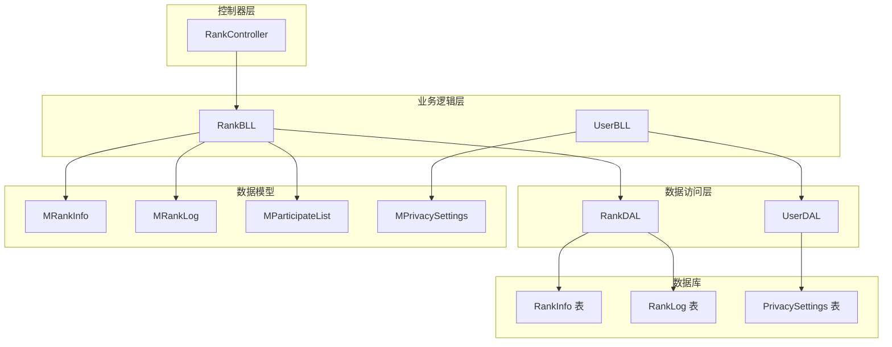
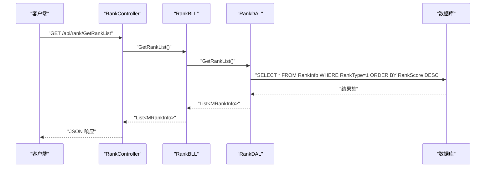
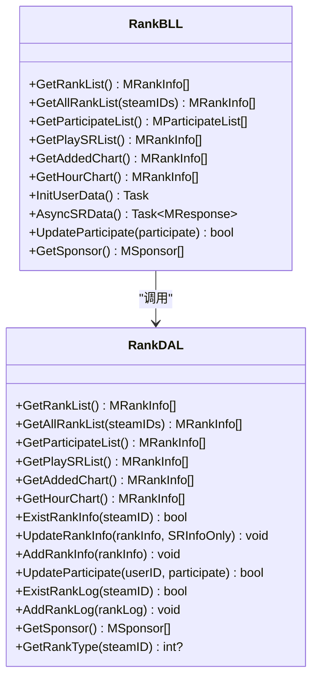
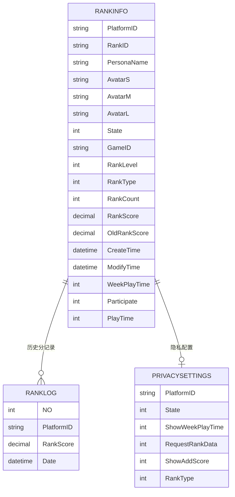
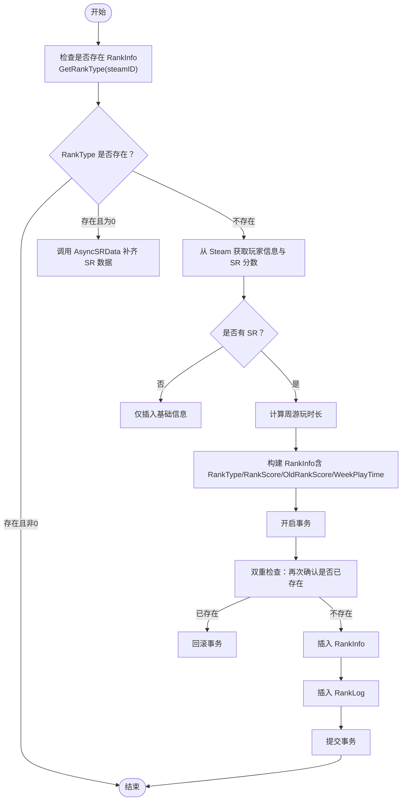
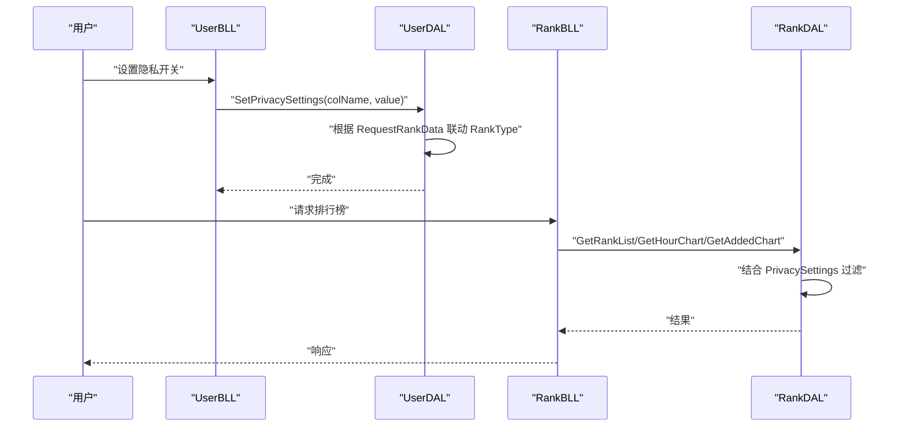
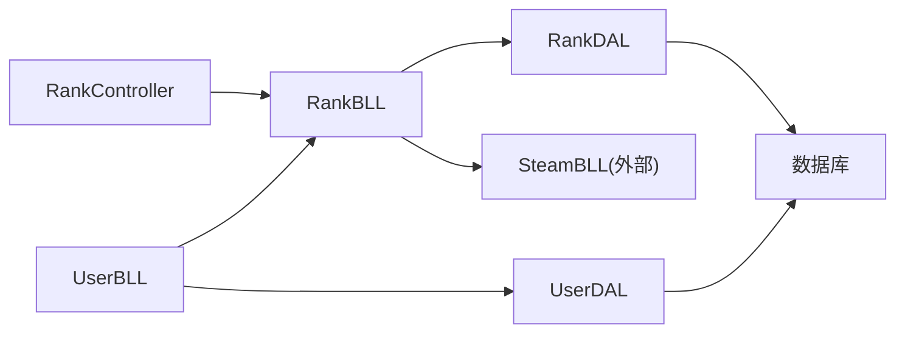

# 排名统计模块

<cite>
**本文引用的文件**
- [RankBLL.cs](file://SpeedRunners.API/SpeedRunners.BLL/RankBLL.cs)
- [RankDAL.cs](file://SpeedRunners.API/SpeedRunners.DAL/RankDAL.cs)
- [RankController.cs](file://SpeedRunners.API/SpeedRunners/Controllers/RankController.cs)
- [MRankInfo.cs](file://SpeedRunners.API/SpeedRunners.Model/Rank/MRankInfo.cs)
- [MParticipateList.cs](file://SpeedRunners.API/SpeedRunners.Model/Rank/MParticipateList.cs)
- [MRankLog.cs](file://SpeedRunners.API/SpeedRunners.Model/Rank/MRankLog.cs)
- [UserBLL.cs](file://SpeedRunners.API/SpeedRunners.BLL/UserBLL.cs)
- [UserDAL.cs](file://SpeedRunners.API/SpeedRunners.DAL/UserDAL.cs)
- [MPrivacySettings.cs](file://SpeedRunners.API/SpeedRunners.Model/User/MPrivacySettings.cs)
- [tmdsr.sql](file://mysql-dump/tmdsr.sql)
</cite>

## 更新摘要
**变更内容**
- 完全重构RankBLL.cs和RankDAL.cs的rank初始化过程，引入事务管理防止并发用户初始化时的重复条目
- 引入返回可空RankType值的改进，支持对初始未拥有游戏用户的优雅处理
- 增强与Steam API响应的正确数据同步机制
- 实现双重检查机制防止并发冲突
- 优化AsyncSRData方法的空壳行处理逻辑

## 目录
1. [简介](#简介)
2. [项目结构](#项目结构)
3. [核心组件](#核心组件)
4. [架构总览](#架构总览)
5. [详细组件分析](#详细组件分析)
6. [依赖关系分析](#依赖关系分析)
7. [性能考量](#性能考量)
8. [故障排查指南](#故障排查指南)
9. [结论](#结论)
10. [附录](#附录)

## 简介
本技术文档围绕"排名统计模块"展开，系统性阐述 RankBLL 业务逻辑层的实现原理、数据更新机制、实时与历史数据处理、参与状态管理、缓存策略、并发控制、API 接口规范、数据模型与 SQL 优化以及错误处理机制。本次更新重点反映了后端逻辑的重大改进：RankBLL.cs和RankDAL.cs的rank初始化过程完全重构，引入事务管理防止并发用户初始化时的重复条目，包括对初始未拥有游戏用户的优雅处理、与Steam API响应的正确数据同步，以及返回可空RankType值的改进。

## 项目结构
排名统计模块位于 SpeedRunners.API 工程中，采用经典的三层架构：
- 控制器层：RankController 提供 REST API
- 业务逻辑层：RankBLL 封装排名相关业务，现已完全重构初始化流程
- 数据访问层：RankDAL 提供数据库操作，支持可空RankType返回
- 模型层：MRankInfo、MParticipateList、MRankLog 等实体定义
- 用户隐私设置：UserBLL/UserDAL 配合隐私开关影响排名展示

**图表来源**
- [RankController.cs:1-48](file://SpeedRunners.API/SpeedRunners/Controllers/RankController.cs#L1-L48)
- [RankBLL.cs:1-236](file://SpeedRunners.API/SpeedRunners.BLL/RankBLL.cs#L1-L236)
- [RankDAL.cs:1-192](file://SpeedRunners.API/SpeedRunners.DAL/RankDAL.cs#L1-L192)
- [UserBLL.cs:1-172](file://SpeedRunners.API/SpeedRunners.BLL/UserBLL.cs#L1-L172)
- [UserDAL.cs:1-107](file://SpeedRunners.API/SpeedRunners.DAL/UserDAL.cs#L1-L107)
- [MRankInfo.cs:1-41](file://SpeedRunners.API/SpeedRunners.Model/Rank/MRankInfo.cs#L1-L41)
- [MRankLog.cs:1-12](file://SpeedRunners.API/SpeedRunners.Model/Rank/MRankLog.cs#L1-L12)
- [MParticipateList.cs:1-18](file://SpeedRunners.API/SpeedRunners.Model/Rank/MParticipateList.cs#L1-L18)
- [MPrivacySettings.cs:1-22](file://SpeedRunners.API/SpeedRunners.Model/User/MPrivacySettings.cs#L1-L22)

**章节来源**
- [RankController.cs:1-48](file://SpeedRunners.API/SpeedRunners/Controllers/RankController.cs#L1-L48)
- [RankBLL.cs:1-236](file://SpeedRunners.API/SpeedRunners.BLL/RankBLL.cs#L1-L236)
- [RankDAL.cs:1-192](file://SpeedRunners.API/SpeedRunners.DAL/RankDAL.cs#L1-L192)
- [UserBLL.cs:1-172](file://SpeedRunners.API/SpeedRunners.BLL/UserBLL.cs#L1-L172)
- [UserDAL.cs:1-107](file://SpeedRunners.API/SpeedRunners.DAL/UserDAL.cs#L1-L107)
- [MRankInfo.cs:1-41](file://SpeedRunners.API/SpeedRunners.Model/Rank/MRankInfo.cs#L1-L41)
- [MRankLog.cs:1-12](file://SpeedRunners.API/SpeedRunners.Model/Rank/MRankLog.cs#L1-L12)
- [MParticipateList.cs:1-18](file://SpeedRunners.API/SpeedRunners.Model/Rank/MParticipateList.cs#L1-L18)
- [MPrivacySettings.cs:1-22](file://SpeedRunners.API/SpeedRunners.Model/User/MPrivacySettings.cs#L1-L22)

## 核心组件
- RankController：暴露排名查询、历史数据、实时榜单、参与状态更新、赞助商排行等接口
- RankBLL：封装排名计算、数据聚合、**已完全重构的初始化与异步同步 SR 基础数据**，支持事务管理和并发控制
- RankDAL：提供 SQL 查询与写入，含历史日志、排行榜、参与列表、隐私设置联动，**支持返回可空RankType值**
- 模型层：MRankInfo（排名主表）、MRankLog（历史日志）、MParticipateList（参与聚合）、MPrivacySettings（隐私开关）
- UserBLL/UserDAL：用户登录、令牌校验、隐私设置读写、状态与排名类型联动

**章节来源**
- [RankController.cs:1-48](file://SpeedRunners.API/SpeedRunners/Controllers/RankController.cs#L1-L48)
- [RankBLL.cs:1-236](file://SpeedRunners.API/SpeedRunners.BLL/RankBLL.cs#L1-L236)
- [RankDAL.cs:1-192](file://SpeedRunners.API/SpeedRunners.DAL/RankDAL.cs#L1-L192)
- [MRankInfo.cs:1-41](file://SpeedRunners.API/SpeedRunners.Model/Rank/MRankInfo.cs#L1-L41)
- [MRankLog.cs:1-12](file://SpeedRunners.API/SpeedRunners.Model/Rank/MRankLog.cs#L1-L12)
- [MParticipateList.cs:1-18](file://SpeedRunners.API/SpeedRunners.Model/Rank/MParticipateList.cs#L1-L18)
- [UserBLL.cs:1-172](file://SpeedRunners.API/SpeedRunners.BLL/UserBLL.cs#L1-L172)
- [UserDAL.cs:1-107](file://SpeedRunners.API/SpeedRunners.DAL/UserDAL.cs#L1-L107)

## 架构总览
排名模块遵循"控制器 -> 业务层 -> 数据访问层"的调用链，业务层通过 BeginDb 统一封装事务与数据库操作，数据访问层使用参数化 SQL 与 Dapper 进行高效读写。**新的架构增强了并发控制和数据一致性保障**。

**图表来源**
- [RankController.cs:16-18](file://SpeedRunners.API/SpeedRunners/Controllers/RankController.cs#L16-L18)
- [RankBLL.cs:28-34](file://SpeedRunners.API/SpeedRunners.BLL/RankBLL.cs#L28-L34)
- [RankDAL.cs:32-37](file://SpeedRunners.API/SpeedRunners.DAL/RankDAL.cs#L32-L37)

## 详细组件分析

### RankBLL 业务逻辑层
- 排行榜查询：GetRankList 返回 RankType=1 的玩家，按 RankScore 降序
- 全量排行：GetAllRankList 支持按 SteamID 过滤，返回所有记录
- 参与列表：GetParticipateList 计算 SxlScore = (周游玩时长差值换算) + 天梯分，排序后返回
- 实时榜单：GetPlaySRList 返回当前正在玩 SR 的玩家
- 新增天梯分排行：GetAddedChart 基于 RankLog 的历史最小分与当前分差生成
- 游戏时长排行：GetHourChart 基于周游玩时长排序
- **初始化用户数据**：**已完全重构** InitUserData 根据 Steam 数据填充 RankInfo，并写入 RankLog，**引入事务管理和双重检查防止并发冲突**
- 异步同步 SR 基础数据：AsyncSRData 判断是否拥有 SR，更新 RankType/分数等，**增强空壳行处理逻辑**
- 参与状态更新：UpdateParticipate 设置参与标记
- 赞助商排行：GetSponsor 查询指定比赛的赞助商

**图表来源**
- [RankBLL.cs:14-236](file://SpeedRunners.API/SpeedRunners.BLL/RankBLL.cs#L14-L236)
- [RankDAL.cs:11-192](file://SpeedRunners.API/SpeedRunners.DAL/RankDAL.cs#L11-L192)

**章节来源**
- [RankBLL.cs:28-236](file://SpeedRunners.API/SpeedRunners.BLL/RankBLL.cs#L28-L236)
- [RankDAL.cs:17-192](file://SpeedRunners.API/SpeedRunners.DAL/RankDAL.cs#L17-L192)

### 数据模型与表结构
- MRankInfo：排名主表字段，包含平台 ID、昵称、头像、状态、游戏 ID、段位、天梯分、旧分、时间戳、周游玩时长、参与标记、总游玩时长等
- MRankLog：历史日志表，记录每日天梯分快照
- MParticipateList：参与聚合视图，包含 SxlScore 计算字段
- MPrivacySettings：隐私设置，影响排行榜可见性（如 ShowAddScore、ShowWeekPlayTime、RequestRankData）

**图表来源**
- [MRankInfo.cs:1-41](file://SpeedRunners.API/SpeedRunners.Model/Rank/MRankInfo.cs#L1-L41)
- [MRankLog.cs:1-12](file://SpeedRunners.API/SpeedRunners.Model/Rank/MRankLog.cs#L1-L12)
- [MPrivacySettings.cs:1-22](file://SpeedRunners.API/SpeedRunners.Model/User/MPrivacySettings.cs#L1-L22)
- [tmdsr.sql:380-462](file://mysql-dump/tmdsr.sql#L380-L462)

**章节来源**
- [MRankInfo.cs:1-41](file://SpeedRunners.API/SpeedRunners.Model/Rank/MRankInfo.cs#L1-L41)
- [MRankLog.cs:1-12](file://SpeedRunners.API/SpeedRunners.Model/Rank/MRankLog.cs#L1-L12)
- [MPrivacySettings.cs:1-22](file://SpeedRunners.API/SpeedRunners.Model/User/MPrivacySettings.cs#L1-L22)
- [tmdsr.sql:380-462](file://mysql-dump/tmdsr.sql#L380-L462)

### 排名算法与数据更新机制
- 实时榜单：基于 RankInfo 中的 GameID 字段筛选正在玩 SR 的玩家
- 历史日志：RankLog 按日记录 RankScore，用于新增天梯分排行
- 参与聚合：SxlScore = (周游玩时长差值换算) + 天梯分，体现活跃度与实力综合
- **初始化流程**：**已完全重构** 若不存在初始数据，则从 Steam 获取玩家信息与 SR 分数，写入 RankInfo 并插入 RankLog，**引入事务管理和双重检查防止并发冲突**
- **同步流程**：AsyncSRData 判断是否拥有 SR，更新 RankType 与分数，避免重复插入日志，**增强空壳行处理逻辑**

**图表来源**
- [RankBLL.cs:102-169](file://SpeedRunners.API/SpeedRunners.BLL/RankBLL.cs#L102-L169)
- [RankDAL.cs:138-141](file://SpeedRunners.API/SpeedRunners.DAL/RankDAL.cs#L138-L141)

**章节来源**
- [RankBLL.cs:102-169](file://SpeedRunners.API/SpeedRunners.BLL/RankBLL.cs#L102-L169)
- [RankDAL.cs:138-141](file://SpeedRunners.API/SpeedRunners.DAL/RankDAL.cs#L138-L141)

### 参与状态管理与隐私控制
- 参与状态：UpdateParticipate 更新 RankInfo 的参与标记
- 隐私设置：UserDAL 提供隐私开关读写，当 RequestRankData 开启时联动 RankType 与 ShowAddScore
- 展示过滤：排行榜查询会结合 PrivacySettings 对 ShowAddScore、ShowWeekPlayTime 等进行过滤

**图表来源**
- [UserBLL.cs:53-63](file://SpeedRunners.API/SpeedRunners.BLL/UserBLL.cs#L53-L63)
- [UserDAL.cs:60-73](file://SpeedRunners.API/SpeedRunners.DAL/UserDAL.cs#L60-L73)
- [RankDAL.cs:32-41](file://SpeedRunners.API/SpeedRunners.DAL/RankDAL.cs#L32-L41)

**章节来源**
- [UserBLL.cs:53-63](file://SpeedRunners.API/SpeedRunners.BLL/UserBLL.cs#L53-L63)
- [UserDAL.cs:60-73](file://SpeedRunners.API/SpeedRunners.DAL/UserDAL.cs#L60-L73)
- [RankDAL.cs:32-41](file://SpeedRunners.API/SpeedRunners.DAL/RankDAL.cs#L32-L41)

### API 接口规范
- 获取实时天梯榜
  - 方法：GET
  - 路径：/api/rank/GetRankList
  - 权限：Persona
  - 返回：List<MRankInfo>
- 获取新增天梯分排行
  - 方法：GET
  - 路径：/api/rank/GetAddedChart
  - 返回：List<MRankInfo>
- 获取周游玩时长排行
  - 方法：GET
  - 路径：/api/rank/GetHourChart
  - 权限：Persona
  - 返回：List<MRankInfo>
- 异步同步 SR 基础数据
  - 方法：GET
  - 路径：/api/rank/AsyncSRData
  - 权限：User
  - 返回：MResponse
- **初始化用户数据**：**已完全重构**
  - 方法：GET
  - 路径：/api/rank/InitUserData
  - 权限：User
  - 返回：void
- 获取正在玩 SR 的玩家
  - 方法：GET
  - 路径：/api/rank/GetPlaySRList
  - 权限：Persona
  - 返回：List<MRankInfo>
- 更新参与状态
  - 方法：GET
  - 路径：/api/rank/UpdateParticipate/{participate}
  - 权限：User
  - 返回：bool
- 获取赞助商排行
  - 方法：GET
  - 路径：/api/rank/GetSponsor
  - 返回：List<MSponsor>
- 获取参与玩家列表
  - 方法：GET
  - 路径：/api/rank/GetParticipateList
  - 权限：Persona
  - 返回：List<MParticipateList>

**章节来源**
- [RankController.cs:16-47](file://SpeedRunners.API/SpeedRunners/Controllers/RankController.cs#L16-L47)

## 依赖关系分析
- RankController 依赖 RankBLL
- RankBLL 依赖 RankDAL 与 SteamBLL（外部 SR 数据源）
- UserBLL 依赖 UserDAL，同时与 RankBLL 协作（如获取用户信息）
- RankDAL 依赖数据库连接与 Dapper 执行 SQL，**支持返回可空RankType值**
- 模型层独立，被业务与数据层共同使用

**图表来源**
- [RankController.cs:1-48](file://SpeedRunners.API/SpeedRunners/Controllers/RankController.cs#L1-L48)
- [RankBLL.cs:16-21](file://SpeedRunners.API/SpeedRunners.BLL/RankBLL.cs#L16-L21)
- [RankDAL.cs:1-13](file://SpeedRunners.API/SpeedRunners.DAL/RankDAL.cs#L1-L13)
- [UserBLL.cs:18-24](file://SpeedRunners.API/SpeedRunners.BLL/UserBLL.cs#L18-L24)
- [UserDAL.cs:1-11](file://SpeedRunners.API/SpeedRunners.DAL/UserDAL.cs#L1-L11)

**章节来源**
- [RankController.cs:1-48](file://SpeedRunners.API/SpeedRunners/Controllers/RankController.cs#L1-L48)
- [RankBLL.cs:16-21](file://SpeedRunners.API/SpeedRunners.BLL/RankBLL.cs#L16-L21)
- [RankDAL.cs:1-13](file://SpeedRunners.API/SpeedRunners.DAL/RankDAL.cs#L1-L13)
- [UserBLL.cs:18-24](file://SpeedRunners.API/SpeedRunners.BLL/UserBLL.cs#L18-L24)
- [UserDAL.cs:1-11](file://SpeedRunners.API/SpeedRunners.DAL/UserDAL.cs#L1-L11)

## 性能考量
- SQL 查询优化
  - 排行查询使用索引列排序（RankScore），建议确保 RankInfo 上存在相应索引
  - GetAddedChart 使用子查询与 UNION 聚合历史分，建议为 RankLog 的 PlatformID、Date 建立复合索引
  - GetHourChart 与隐私设置联表查询，建议为 PrivacySettings 的 PlatformID 建索引
- 缓存策略
  - 建议对高频查询（如 GetRankList、GetHourChart）增加 Redis 缓存，设置合理过期时间（如 1-5 分钟）
  - 历史排行（GetAddedChart）可按日期维度分片缓存，降低复杂计算压力
- 并发控制
  - **已完全重构** InitUserData/AsyncSRData 使用事务保证一致性，避免脏写，**引入双重检查机制防止并发冲突**
  - UpdateParticipate 为单字段更新，建议加分布式锁或乐观锁防止并发覆盖
- 数据聚合
  - 参与列表 SxlScore 计算在服务端完成，建议批量查询后一次性计算，减少往返

## 故障排查指南
- 登录与令牌
  - UserBLL.Login 通过 Steam OpenID 校验，失败时返回特定错误码；检查网络超时与正则匹配
  - GetUserByToken 支持主 Token 与 ExToken，注意刷新窗口与过期判断
- 排行榜为空
  - 检查 RankType 是否为 1，确认隐私设置 ShowAddScore/ShowWeekPlayTime 是否允许展示
  - 确认 Steam 数据是否成功同步（AsyncSRData）
- 历史排行异常
  - 核对 RankLog 是否按日写入，查询区间是否正确
  - 检查 HandleSameName 对同名用户的去重处理
- 参与状态更新失败
  - 确认当前用户与目标用户一致，权限校验通过
  - 检查数据库连接与事务提交
- **初始化流程问题**：**新增故障排查项**
  - 检查 GetRankType 是否正确返回可空值，避免空壳行处理错误
  - 确认事务是否正确提交，检查双重检查机制是否正常工作
  - 验证并发场景下是否出现重复初始化

**章节来源**
- [UserBLL.cs:79-112](file://SpeedRunners.API/SpeedRunners.BLL/UserBLL.cs#L79-L112)
- [UserBLL.cs:114-130](file://SpeedRunners.API/SpeedRunners.BLL/UserBLL.cs#L114-L130)
- [RankBLL.cs:102-169](file://SpeedRunners.API/SpeedRunners.BLL/RankBLL.cs#L102-L169)
- [RankDAL.cs:138-141](file://SpeedRunners.API/SpeedRunners.DAL/RankDAL.cs#L138-L141)

## 结论
排名统计模块通过清晰的三层架构实现了从数据采集、业务计算到展示控制的完整闭环。**经过完全重构的 RankBLL 在业务层面承担了复杂的聚合与计算职责，引入了事务管理和并发控制机制，显著提升了数据一致性和系统稳定性**。配合 RankDAL 的高效 SQL 查询与隐私设置联动，满足了实时、历史与参与态的多维需求。**新的架构通过返回可空RankType值和双重检查机制，优雅地处理了初始未拥有游戏用户的场景，增强了系统的健壮性**。建议在高并发场景引入缓存与索引优化，并完善监控与告警体系，持续提升稳定性与性能。

## 附录

### 数据库表结构摘要
- RankInfo：存储玩家排名主数据，含天梯分、段位、状态、参与标记等
- RankLog：存储每日天梯分快照，支持新增天梯分排行
- PrivacySettings：存储用户隐私开关，影响排行榜展示

**章节来源**
- [tmdsr.sql:380-462](file://mysql-dump/tmdsr.sql#L380-L462)
- [tmdsr.sql:440-462](file://mysql-dump/tmdsr.sql#L440-L462)

### 事务管理与并发控制详解
**新增章节**：详细说明新引入的事务管理和并发控制机制

#### 事务管理机制
- **InitUserData方法中的完整事务流程**：
  1. 开启数据库事务
  2. 双重检查：再次确认用户是否已存在
  3. 如果存在则回滚事务并返回
  4. 如果不存在则执行初始化逻辑
  5. 提交事务或在异常时回滚

#### 并发控制机制
- **双重检查机制**：防止多个并发请求同时初始化同一用户
- **空壳行处理**：对RankType=0的空壳行进行专门处理，避免重复初始化
- **可空RankType返回**：GetRankType方法返回int?类型，支持null值表示不存在

#### 与Steam API的正确数据同步
- **AsyncSRData方法增强**：对没有SR的用户优雅处理，避免覆盖已有数据
- **空壳行逻辑**：只有在RankType=0时才写入空壳数据
- **数据一致性**：确保RankInfo和RankLog的同步更新

**章节来源**
- [RankBLL.cs:102-169](file://SpeedRunners.API/SpeedRunners.BLL/RankBLL.cs#L102-L169)
- [RankDAL.cs:138-141](file://SpeedRunners.API/SpeedRunners.DAL/RankDAL.cs#L138-L141)