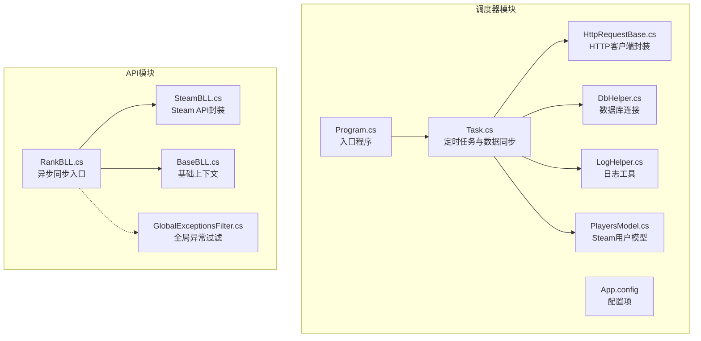
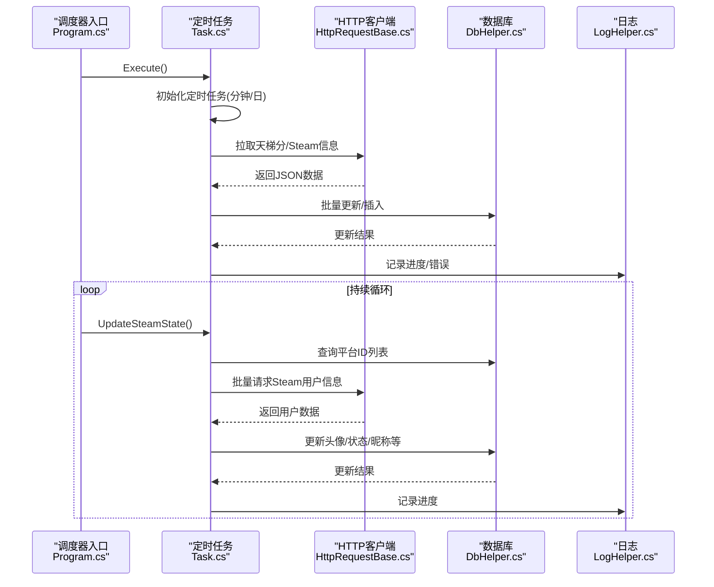
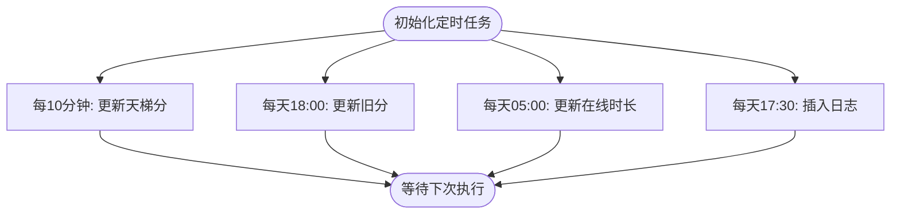
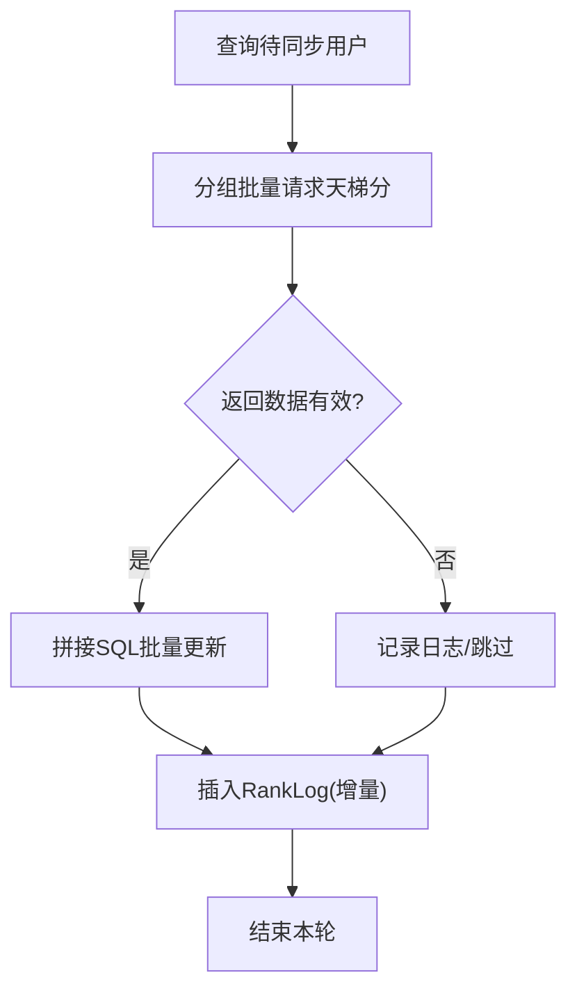
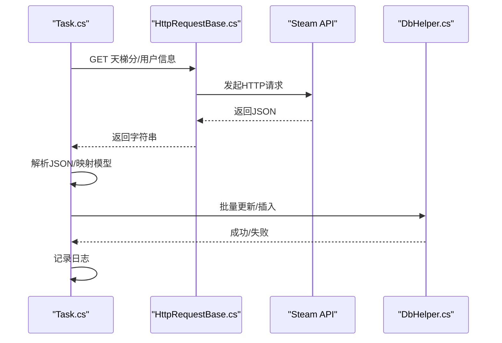
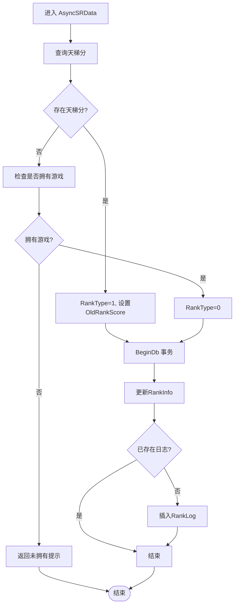
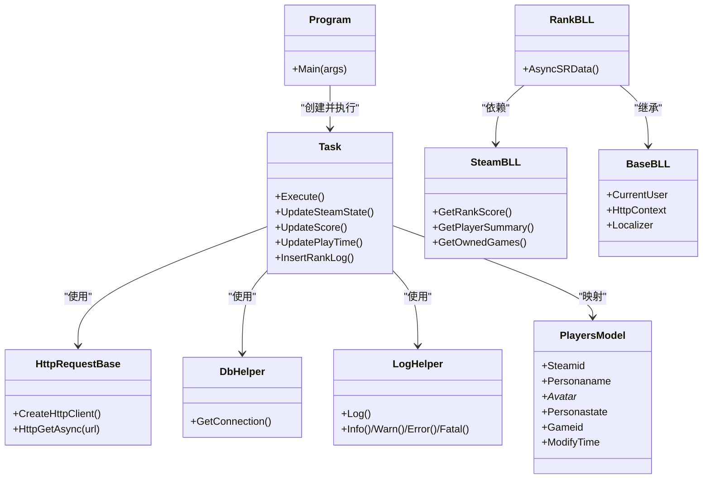

# 数据同步机制

<cite>
**本文引用的文件列表**
- [Program.cs](file://SpeedRunners.Scheduler/Program.cs)
- [Task.cs](file://SpeedRunners.Scheduler/Task.cs)
- [App.config](file://SpeedRunners.Scheduler/App.config)
- [HttpRequestBase.cs](file://SpeedRunners.Scheduler/HttpRequestBase.cs)
- [DbHelper.cs](file://SpeedRunners.Scheduler/DbHelper.cs)
- [LogHelper.cs](file://SpeedRunners.Scheduler/LogHelper.cs)
- [PlayersModel.cs](file://SpeedRunners.Scheduler/PlayersModel.cs)
- [RankBLL.cs](file://SpeedRunners.API/SpeedRunners.BLL/RankBLL.cs)
- [SteamBLL.cs](file://SpeedRunners.API/SpeedRunners.BLL/SteamBLL.cs)
- [BaseBLL.cs](file://SpeedRunners.API/SpeedRunners.Utils/BaseBLL.cs)
- [GlobalExceptionsFilter.cs](file://SpeedRunners.API/SpeedRunners/Filter/GlobalExceptionsFilter.cs)
</cite>

## 目录
1. [简介](#简介)
2. [项目结构](#项目结构)
3. [核心组件](#核心组件)
4. [架构总览](#架构总览)
5. [组件详解](#组件详解)
6. [依赖关系分析](#依赖关系分析)
7. [性能考量](#性能考量)
8. [故障排查指南](#故障排查指南)
9. [结论](#结论)

## 简介
本技术文档围绕数据同步机制展开，重点解释以下方面：
- 实时数据同步的工作原理：定时任务调度、数据拉取策略、增量更新机制
- AsyncSRData 方法的实现与与 Steam API 的数据交换流程
- 错误处理机制、重试策略与数据一致性保证
- Scheduler 服务的任务执行逻辑：调度频率、并发控制与资源管理
- 监控指标与故障排查建议，帮助开发者理解并维护数据同步系统的稳定运行

## 项目结构
本仓库包含两个主要模块：
- 后端 API 模块（SpeedRunners.API）：提供业务逻辑与对外接口，负责与 Steam API 交互、数据持久化与业务处理
- 调度器模块（SpeedRunners.Scheduler）：独立的后台服务，负责定时任务调度与数据同步执行

图表来源
- [Program.cs](file://SpeedRunners.Scheduler/Program.cs#L1-L21)
- [Task.cs](file://SpeedRunners.Scheduler/Task.cs#L1-L349)
- [App.config](file://SpeedRunners.Scheduler/App.config#L1-L14)
- [HttpRequestBase.cs](file://SpeedRunners.Scheduler/HttpRequestBase.cs#L1-L42)
- [DbHelper.cs](file://SpeedRunners.Scheduler/DbHelper.cs#L1-L32)
- [LogHelper.cs](file://SpeedRunners.Scheduler/LogHelper.cs#L1-L652)
- [PlayersModel.cs](file://SpeedRunners.Scheduler/PlayersModel.cs#L1-L20)
- [RankBLL.cs](file://SpeedRunners.API/SpeedRunners.BLL/RankBLL.cs#L160-L210)
- [SteamBLL.cs](file://SpeedRunners.API/SpeedRunners.BLL/SteamBLL.cs#L1-L448)
- [BaseBLL.cs](file://SpeedRunners.API/SpeedRunners.Utils/BaseBLL.cs#L1-L17)
- [GlobalExceptionsFilter.cs](file://SpeedRunners.API/SpeedRunners/Filter/GlobalExceptionsFilter.cs#L40-L53)

章节来源
- [Program.cs](file://SpeedRunners.Scheduler/Program.cs#L1-L21)
- [Task.cs](file://SpeedRunners.Scheduler/Task.cs#L1-L349)
- [App.config](file://SpeedRunners.Scheduler/App.config#L1-L14)

## 核心组件
- 调度器入口与主循环：Program.cs 启动调度器并持续执行状态更新
- 定时任务与同步逻辑：Task.cs 中定义了多种定时任务（天梯分、旧分更新、在线时长、日志插入）以及与 Steam API 的批量数据拉取
- 配置中心：App.config 提供数据库连接、代理、API Key、调度间隔等配置
- HTTP 封装：HttpRequestBase.cs 统一封装 HTTP 请求与超时、代理设置
- 数据库访问：DbHelper.cs 提供 MySQL 连接
- 日志系统：LogHelper.cs 提供多级别日志记录
- API 层同步入口：RankBLL.AsyncSRData 作为业务层入口，协调 SteamBLL 与数据库更新

章节来源
- [Program.cs](file://SpeedRunners.Scheduler/Program.cs#L1-L21)
- [Task.cs](file://SpeedRunners.Scheduler/Task.cs#L26-L66)
- [App.config](file://SpeedRunners.Scheduler/App.config#L3-L13)
- [HttpRequestBase.cs](file://SpeedRunners.Scheduler/HttpRequestBase.cs#L9-L42)
- [DbHelper.cs](file://SpeedRunners.Scheduler/DbHelper.cs#L17-L28)
- [LogHelper.cs](file://SpeedRunners.Scheduler/LogHelper.cs#L10-L652)
- [RankBLL.cs](file://SpeedRunners.API/SpeedRunners.BLL/RankBLL.cs#L160-L210)
- [SteamBLL.cs](file://SpeedRunners.API/SpeedRunners.BLL/SteamBLL.cs#L18-L82)

## 架构总览
数据同步整体流程如下：
- 调度器启动后初始化定时任务，按分钟级频率拉取天梯分，按日级频率执行旧分更新、在线时长更新与日志插入
- 同时，调度器以固定周期对 Steam 用户信息进行批量更新，避免一次性全量请求导致的限流或超时
- API 层提供 AsyncSRData 入口，用于按需触发同步，确保用户拥有游戏且更新其天梯分与日志

图表来源
- [Program.cs](file://SpeedRunners.Scheduler/Program.cs#L7-L18)
- [Task.cs](file://SpeedRunners.Scheduler/Task.cs#L26-L66)
- [Task.cs](file://SpeedRunners.Scheduler/Task.cs#L154-L171)
- [Task.cs](file://SpeedRunners.Scheduler/Task.cs#L225-L246)
- [Task.cs](file://SpeedRunners.Scheduler/Task.cs#L248-L293)
- [HttpRequestBase.cs](file://SpeedRunners.Scheduler/HttpRequestBase.cs#L25-L39)
- [DbHelper.cs](file://SpeedRunners.Scheduler/DbHelper.cs#L23-L28)
- [LogHelper.cs](file://SpeedRunners.Scheduler/LogHelper.cs#L15-L46)

## 组件详解

### 调度器入口与主循环
- 入口程序注册编码提供器，创建 Task 并执行 Execute 初始化定时任务
- 主循环持续调用 UpdateSteamState，按配置的分钟数切片处理平台ID列表，实现“滚动式”批量更新，降低单次请求压力

章节来源
- [Program.cs](file://SpeedRunners.Scheduler/Program.cs#L7-L18)
- [Task.cs](file://SpeedRunners.Scheduler/Task.cs#L225-L246)

### 定时任务与调度频率
- 天梯分更新：启动即执行一次，随后每 10 分钟执行一次
- 旧分更新：每天 18:00 执行，将当前天梯分写入旧分字段
- 在线时长更新：每天 05:00 执行，拉取两周与总时长并入库
- 日志插入：每天 17:30 执行，基于增量条件插入 RankLog

图表来源
- [Task.cs](file://SpeedRunners.Scheduler/Task.cs#L34-L58)

章节来源
- [Task.cs](file://SpeedRunners.Scheduler/Task.cs#L26-L66)

### 数据拉取策略与增量更新
- 天梯分拉取：从数据库查询 RankType 非零且隐私允许的用户，分组批量请求（每批约 99 个），解析 JSON 并拼接 SQL 批量更新
- 在线时长拉取：查询 RankType 非零用户，分别请求“最近游玩”和“拥有游戏”，提取 SpeedRunners 的两周时长与总时长，批量更新
- 增量日志：仅当 RankScore > 0 且与 OldRankScore 不同才插入 RankLog，保证只记录变化

图表来源
- [Task.cs](file://SpeedRunners.Scheduler/Task.cs#L154-L171)
- [Task.cs](file://SpeedRunners.Scheduler/Task.cs#L173-L223)
- [Task.cs](file://SpeedRunners.Scheduler/Task.cs#L67-L79)

章节来源
- [Task.cs](file://SpeedRunners.Scheduler/Task.cs#L154-L171)
- [Task.cs](file://SpeedRunners.Scheduler/Task.cs#L173-L223)
- [Task.cs](file://SpeedRunners.Scheduler/Task.cs#L67-L79)

### 与 Steam API 的数据交换
- 天梯分：调用第三方天梯接口，按分组批量请求，解析 JSON 字段映射为本地模型
- Steam 用户信息：调用 Steam Web API 获取头像、状态、当前游戏等，支持代理与超时控制
- 错误处理：HTTP 请求异常捕获并记录；空响应或无数据时记录日志并跳过该批次

图表来源
- [Task.cs](file://SpeedRunners.Scheduler/Task.cs#L173-L223)
- [Task.cs](file://SpeedRunners.Scheduler/Task.cs#L248-L293)
- [HttpRequestBase.cs](file://SpeedRunners.Scheduler/HttpRequestBase.cs#L25-L39)
- [DbHelper.cs](file://SpeedRunners.Scheduler/DbHelper.cs#L23-L28)

章节来源
- [Task.cs](file://SpeedRunners.Scheduler/Task.cs#L173-L223)
- [Task.cs](file://SpeedRunners.Scheduler/Task.cs#L248-L293)
- [HttpRequestBase.cs](file://SpeedRunners.Scheduler/HttpRequestBase.cs#L9-L42)

### AsyncSRData 方法实现与数据一致性
- 入口：RankBLL.AsyncSRData
- 流程：
  - 优先通过 SteamBLL.GetRankScore 获取天梯分
  - 若为空则检查是否拥有 SpeedRunners 游戏，否则返回未拥有提示
  - 根据是否存在天梯分决定 RankType，并记录 OldRankScore
  - 使用 BeginDb 事务更新 RankInfo，并在不存在日志时插入 RankLog
- 数据一致性：
  - 使用事务包裹更新与日志插入，确保原子性
  - 仅在存在变化时插入日志，避免重复写入

图表来源
- [RankBLL.cs](file://SpeedRunners.API/SpeedRunners.BLL/RankBLL.cs#L160-L191)
- [SteamBLL.cs](file://SpeedRunners.API/SpeedRunners.BLL/SteamBLL.cs#L52-L82)

章节来源
- [RankBLL.cs](file://SpeedRunners.API/SpeedRunners.BLL/RankBLL.cs#L160-L191)
- [SteamBLL.cs](file://SpeedRunners.API/SpeedRunners.BLL/SteamBLL.cs#L52-L82)

### 错误处理机制与重试策略
- 定时任务包装：ScheduleEx 对每个任务执行进行 try-catch 包裹，异常统一记录日志，避免中断调度器
- HTTP 请求：HttpGetAsync 捕获异常并记录时间戳与异常详情
- 批量请求：BatchRequest 对空响应或无数据进行记录并加入重试队列（errIDs）
- API 层异常：GlobalExceptionsFilter 记录接口路径、参数与异常堆栈，便于定位问题

章节来源
- [Task.cs](file://SpeedRunners.Scheduler/Task.cs#L331-L347)
- [HttpRequestBase.cs](file://SpeedRunners.Scheduler/HttpRequestBase.cs#L25-L39)
- [Task.cs](file://SpeedRunners.Scheduler/Task.cs#L295-L328)
- [GlobalExceptionsFilter.cs](file://SpeedRunners.API/SpeedRunners/Filter/GlobalExceptionsFilter.cs#L40-L53)

### 并发控制与资源管理
- 定时任务并发：使用 FluentScheduler 的 Registry 管理多个任务，各自独立执行，互不阻塞
- HTTP 并发：批量请求中对每个分组串行等待（如天梯分请求的秒级延迟），避免触发 API 限流
- 数据库连接：每次操作新建连接，避免长连接占用；批量更新使用 Dapper 的批量参数绑定
- 资源释放：HttpClient 使用 using 作用域管理；日志文件写入使用流的正确关闭

章节来源
- [Task.cs](file://SpeedRunners.Scheduler/Task.cs#L34-L58)
- [Task.cs](file://SpeedRunners.Scheduler/Task.cs#L180-L190)
- [DbHelper.cs](file://SpeedRunners.Scheduler/DbHelper.cs#L23-L28)
- [HttpRequestBase.cs](file://SpeedRunners.Scheduler/HttpRequestBase.cs#L11-L18)

## 依赖关系分析

图表来源
- [Program.cs](file://SpeedRunners.Scheduler/Program.cs#L7-L12)
- [Task.cs](file://SpeedRunners.Scheduler/Task.cs#L26-L66)
- [HttpRequestBase.cs](file://SpeedRunners.Scheduler/HttpRequestBase.cs#L9-L42)
- [DbHelper.cs](file://SpeedRunners.Scheduler/DbHelper.cs#L17-L28)
- [LogHelper.cs](file://SpeedRunners.Scheduler/LogHelper.cs#L10-L652)
- [PlayersModel.cs](file://SpeedRunners.Scheduler/PlayersModel.cs#L7-L19)
- [RankBLL.cs](file://SpeedRunners.API/SpeedRunners.BLL/RankBLL.cs#L160-L191)
- [SteamBLL.cs](file://SpeedRunners.API/SpeedRunners.BLL/SteamBLL.cs#L18-L82)
- [BaseBLL.cs](file://SpeedRunners.API/SpeedRunners.Utils/BaseBLL.cs#L7-L16)

章节来源
- [Program.cs](file://SpeedRunners.Scheduler/Program.cs#L7-L12)
- [Task.cs](file://SpeedRunners.Scheduler/Task.cs#L26-L66)
- [RankBLL.cs](file://SpeedRunners.API/SpeedRunners.BLL/RankBLL.cs#L160-L191)
- [SteamBLL.cs](file://SpeedRunners.API/SpeedRunners.BLL/SteamBLL.cs#L18-L82)

## 性能考量
- 批量请求与分组：天梯分与 Steam 用户信息均采用分组批量请求，减少请求次数与网络开销
- 延迟控制：天梯分请求按配置秒级延迟，Steam 用户请求按需延迟，避免触发 API 限流
- 数据库批量更新：使用 Dapper 的批量参数绑定，减少往返次数
- 日志与监控：统一的日志记录便于性能瓶颈定位与异常追踪
- 建议优化点：
  - 引入指数退避重试与熔断机制
  - 对高频接口增加缓存层（如 Redis）
  - 将日志输出切换至结构化日志系统（如 NLog/ELK）

[本节为通用性能建议，无需特定文件引用]

## 故障排查指南
- 常见问题定位
  - 天梯分拉取失败：检查 App.config 中的 ApiKey 与 Seconds 配置，确认第三方接口可用性
  - Steam 用户信息更新异常：检查 ProxyAddress 与 Timeout 设置，查看日志文件
  - 数据库连接失败：核对 ConnectionString，确认数据库可达
- 关键日志位置
  - 调度器日志：LogHelper 写入的文本日志文件
  - API 异常：GlobalExceptionsFilter 记录接口路径、参数与异常堆栈
- 快速验证步骤
  - 手动执行 UpdateSteamState，观察平台ID切片与更新条数
  - 手动执行 UpdateScore，确认分组请求与数据库更新
  - 检查数据库中 RankInfo 与 RankLog 的增量情况

章节来源
- [App.config](file://SpeedRunners.Scheduler/App.config#L3-L13)
- [LogHelper.cs](file://SpeedRunners.Scheduler/LogHelper.cs#L15-L46)
- [GlobalExceptionsFilter.cs](file://SpeedRunners.API/SpeedRunners/Filter/GlobalExceptionsFilter.cs#L40-L53)
- [Task.cs](file://SpeedRunners.Scheduler/Task.cs#L225-L246)
- [Task.cs](file://SpeedRunners.Scheduler/Task.cs#L154-L171)

## 结论
本数据同步机制通过调度器与 API 层协同工作，实现了对天梯分、在线时长与用户状态的自动化同步。其特点包括：
- 明确的定时任务调度与增量更新策略
- 与 Steam API 的稳健数据交换与错误处理
- 事务保障的数据一致性与日志可追溯性
- 可扩展的配置与日志体系，便于运维与监控

建议后续引入更完善的重试与熔断、缓存与结构化日志，以进一步提升稳定性与可观测性。