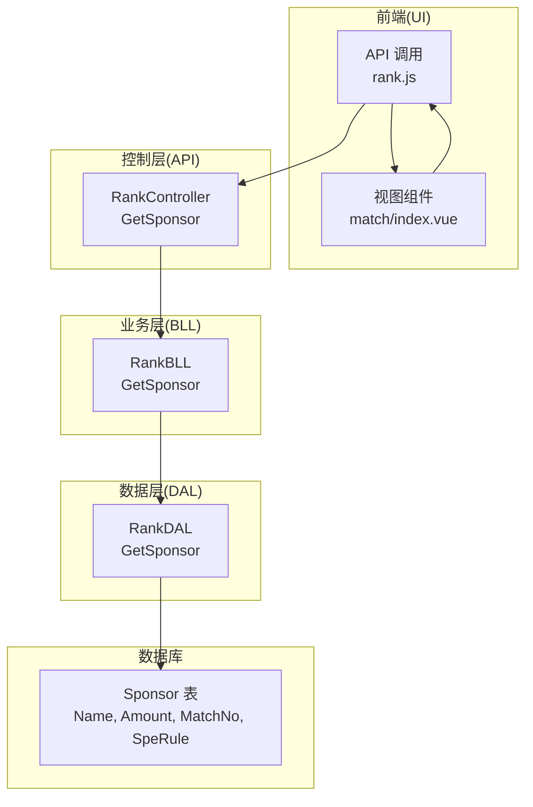
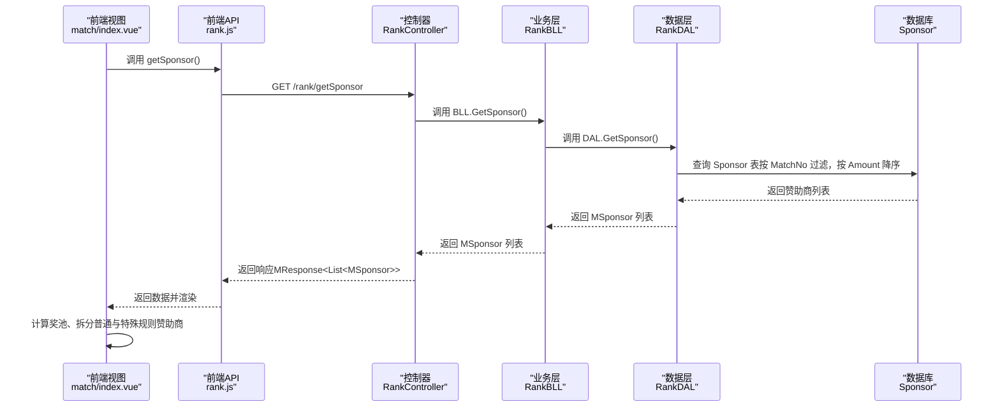
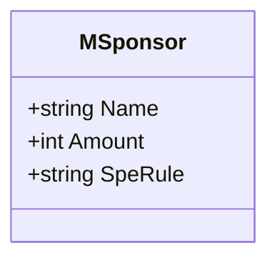
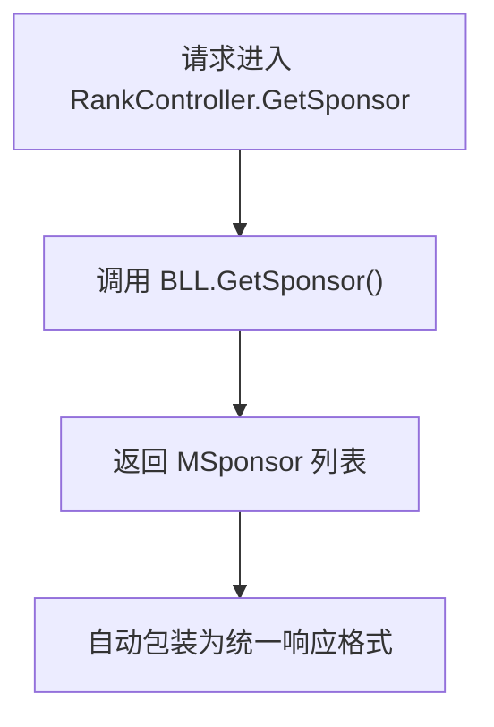
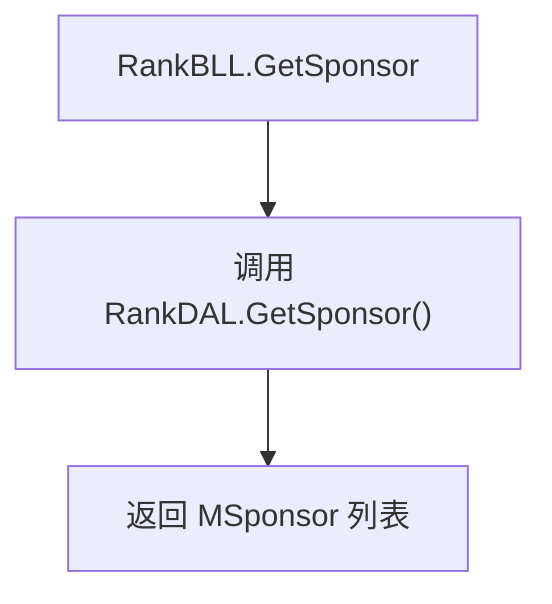
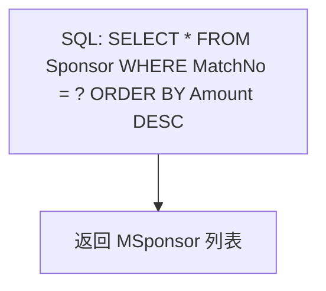
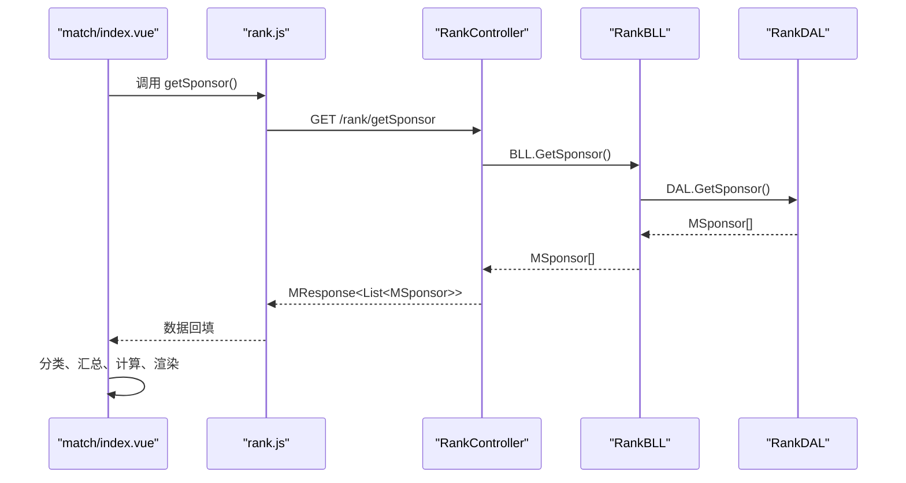
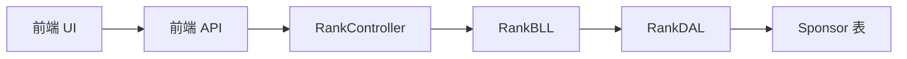

# 赞助商集成

<cite>
**本文引用的文件**
- [MSponsor.cs](file://SpeedRunners.API/SpeedRunners.Model/Sponsor/MSponsor.cs)
- [RankController.cs](file://SpeedRunners.API/SpeedRunners.Controllers/RankController.cs)
- [RankBLL.cs](file://SpeedRunners.API/SpeedRunners.BLL/RankBLL.cs)
- [RankDAL.cs](file://SpeedRunners.API/SpeedRunners.DAL/RankDAL.cs)
- [rank.js](file://SpeedRunners.UI/src/api/rank.js)
- [index.vue（match 页面）](file://SpeedRunners.UI/src/views/match/index.vue)
- [BaseController.cs](file://SpeedRunners.API/SpeedRunners.Controllers/BaseController.cs)
- [MResponse.cs](file://SpeedRunners.API/SpeedRunners.Model/MResponse.cs)
- [tmdsr.sql](file://mysql-dump/tmdsr.sql)
</cite>

## 目录
1. [简介](#简介)
2. [项目结构](#项目结构)
3. [核心组件](#核心组件)
4. [架构总览](#架构总览)
5. [组件详解](#组件详解)
6. [依赖关系分析](#依赖关系分析)
7. [性能考量](#性能考量)
8. [故障排查指南](#故障排查指南)
9. [结论](#结论)
10. [附录](#附录)

## 简介
本技术文档围绕“赞助商集成”功能展开，系统性阐述赞助商信息的获取、处理与展示机制，重点解析 GetSponsor 方法的实现路径与数据流转，并说明赞助商数据在页面中的作用与影响。同时，结合现有代码实现，给出赞助商数据模型与接口规范，帮助开发者理解并扩展该功能。

## 项目结构
围绕赞助商功能的关键文件分布于三层架构：
- 控制层：提供对外 API 接口，负责路由与参数传递
- 业务层：封装业务逻辑，协调数据访问与外部服务
- 数据层：执行数据库查询，返回实体模型
- 前端：通过 API 获取数据并在页面中渲染展示
- 数据库：持久化赞助商记录，包含名称、金额、比赛编号与特殊规则等字段

图表来源
- [RankController.cs](file://SpeedRunners.API/SpeedRunners.Controllers/RankController.cs#L42-L43)
- [RankBLL.cs](file://SpeedRunners.API/SpeedRunners.BLL/RankBLL.cs#L201-L207)
- [RankDAL.cs](file://SpeedRunners.API/SpeedRunners.DAL/RankDAL.cs#L169-L172)
- [rank.js](file://SpeedRunners.UI/src/api/rank.js#L45-L50)
- [index.vue（match 页面）](file://SpeedRunners.UI/src/views/match/index.vue#L287-L305)
- [tmdsr.sql](file://mysql-dump/tmdsr.sql#L524-L531)

章节来源
- [RankController.cs](file://SpeedRunners.API/SpeedRunners.Controllers/RankController.cs#L1-L48)
- [RankBLL.cs](file://SpeedRunners.API/SpeedRunners.BLL/RankBLL.cs#L1-L209)
- [RankDAL.cs](file://SpeedRunners.API/SpeedRunners.DAL/RankDAL.cs#L1-L175)
- [rank.js](file://SpeedRunners.UI/src/api/rank.js#L1-L64)
- [index.vue（match 页面）](file://SpeedRunners.UI/src/views/match/index.vue#L1-L396)
- [tmdsr.sql](file://mysql-dump/tmdsr.sql#L524-L551)

## 核心组件
- 数据模型 MSponsor：承载赞助商名称、金额与特殊规则等字段，用于前后端传输与页面展示
- 控制器 RankController：暴露 GET /rank/getSponsor 接口，供前端调用
- 业务层 RankBLL：封装 GetSponsor 业务方法，协调 DAL 层
- 数据层 RankDAL：执行 SQL 查询，按比赛编号筛选并按金额降序返回赞助商列表
- 前端 API 与视图：通过 rank.js 发起请求，match 页面接收数据并渲染赞助商表格与奖池计算

章节来源
- [MSponsor.cs](file://SpeedRunners.API/SpeedRunners.Model/Sponsor/MSponsor.cs#L1-L13)
- [RankController.cs](file://SpeedRunners.API/SpeedRunners.Controllers/RankController.cs#L42-L43)
- [RankBLL.cs](file://SpeedRunners.API/SpeedRunners.BLL/RankBLL.cs#L201-L207)
- [RankDAL.cs](file://SpeedRunners.API/SpeedRunners.DAL/RankDAL.cs#L169-L172)
- [rank.js](file://SpeedRunners.UI/src/api/rank.js#L45-L50)
- [index.vue（match 页面）](file://SpeedRunners.UI/src/views/match/index.vue#L287-L305)

## 架构总览
下图展示了从前端到数据库的完整调用链路，以及数据在页面中的作用与影响。

图表来源
- [RankController.cs](file://SpeedRunners.API/SpeedRunners.Controllers/RankController.cs#L42-L43)
- [RankBLL.cs](file://SpeedRunners.API/SpeedRunners.BLL/RankBLL.cs#L201-L207)
- [RankDAL.cs](file://SpeedRunners.API/SpeedRunners.DAL/RankDAL.cs#L169-L172)
- [rank.js](file://SpeedRunners.UI/src/api/rank.js#L45-L50)
- [index.vue（match 页面）](file://SpeedRunners.UI/src/views/match/index.vue#L287-L305)
- [MResponse.cs](file://SpeedRunners.API/SpeedRunners.Model/MResponse.cs#L1-L42)

## 组件详解

### 数据模型：MSponsor
- 字段
  - Name：赞助商名称
  - Amount：赞助金额（单位：元）
  - SpeRule：特殊规则描述（可为空）
- 用途
  - 作为前后端传输载体，支撑前端页面渲染与奖池计算
- 复杂度
  - 结构简单，序列化/反序列化开销极低

图表来源
- [MSponsor.cs](file://SpeedRunners.API/SpeedRunners.Model/Sponsor/MSponsor.cs#L7-L12)

章节来源
- [MSponsor.cs](file://SpeedRunners.API/SpeedRunners.Model/Sponsor/MSponsor.cs#L1-L13)

### 控制器：RankController
- 路由与方法
  - GET /rank/getSponsor → 返回 List<MSponsor>
- 权限与上下文
  - 使用 BaseController 注入当前用户与本地化资源，便于后续扩展鉴权或国际化
- 错误处理
  - 返回类型遵循统一响应包装（见 MResponse）

图表来源
- [RankController.cs](file://SpeedRunners.API/SpeedRunners.Controllers/RankController.cs#L42-L43)
- [BaseController.cs](file://SpeedRunners.API/SpeedRunners.Controllers/BaseController.cs#L10-L24)
- [MResponse.cs](file://SpeedRunners.API/SpeedRunners.Model/MResponse.cs#L1-L42)

章节来源
- [RankController.cs](file://SpeedRunners.API/SpeedRunners.Controllers/RankController.cs#L1-L48)
- [BaseController.cs](file://SpeedRunners.API/SpeedRunners.Controllers/BaseController.cs#L1-L26)
- [MResponse.cs](file://SpeedRunners.API/SpeedRunners.Model/MResponse.cs#L1-L42)

### 业务层：RankBLL
- 方法：GetSponsor
  - 通过 BeginDb 委托调用 DAL 层，保持事务与上下文一致性
  - 返回 DAL 查询结果（List<MSponsor>）
- 扩展点
  - 可在此处增加缓存策略、日志记录或异常处理

图表来源
- [RankBLL.cs](file://SpeedRunners.API/SpeedRunners.BLL/RankBLL.cs#L201-L207)
- [RankDAL.cs](file://SpeedRunners.API/SpeedRunners.DAL/RankDAL.cs#L169-L172)

章节来源
- [RankBLL.cs](file://SpeedRunners.API/SpeedRunners.BLL/RankBLL.cs#L1-L209)

### 数据层：RankDAL
- 方法：GetSponsor
  - SQL 查询逻辑：按 MatchNo 过滤，按 Amount 降序排序
  - 返回值：List<MSponsor>
- 数据库表：Sponsor
  - 字段：Name、Amount、MatchNo、SpeRule
  - 索引：对 MatchNo 建有索引，有利于按比赛编号快速检索

图表来源
- [RankDAL.cs](file://SpeedRunners.API/SpeedRunners.DAL/RankDAL.cs#L169-L172)
- [tmdsr.sql](file://mysql-dump/tmdsr.sql#L524-L531)

章节来源
- [RankDAL.cs](file://SpeedRunners.API/SpeedRunners.DAL/RankDAL.cs#L1-L175)
- [tmdsr.sql](file://mysql-dump/tmdsr.sql#L524-L551)

### 前端：API 与视图
- API 调用：通过 rank.js 的 getSponsor 发起 GET 请求
- 视图渲染：match/index.vue 接收数据后
  - 分离普通赞助商与特殊规则赞助商
  - 计算奖池总额
  - 基于规则进行奖金分配与平衡
- 展示内容：赞助商名单与金额、特殊规则说明、联系方式与支付图标

图表来源
- [rank.js](file://SpeedRunners.UI/src/api/rank.js#L45-L50)
- [RankController.cs](file://SpeedRunners.API/SpeedRunners.Controllers/RankController.cs#L42-L43)
- [RankBLL.cs](file://SpeedRunners.API/SpeedRunners.BLL/RankBLL.cs#L201-L207)
- [RankDAL.cs](file://SpeedRunners.API/SpeedRunners.DAL/RankDAL.cs#L169-L172)
- [index.vue（match 页面）](file://SpeedRunners.UI/src/views/match/index.vue#L287-L305)

章节来源
- [rank.js](file://SpeedRunners.UI/src/api/rank.js#L1-L64)
- [index.vue（match 页面）](file://SpeedRunners.UI/src/views/match/index.vue#L1-L396)

### 赞助商与排名系统的集成
- 集成点
  - 赞助商数据不直接参与排名分数计算，但与页面展示密切相关
  - 页面通过赞助数据驱动奖池计算与奖励规则展示，间接影响用户参与体验
- 影响范围
  - 奖池总额决定奖励分配上限
  - 特殊规则影响特定名次段的奖励策略
- 关联模块
  - 排行榜数据（RankInfo）与赞助商数据（Sponsor）分别存储于不同表，无直接关联字段

章节来源
- [RankDAL.cs](file://SpeedRunners.API/SpeedRunners.DAL/RankDAL.cs#L1-L175)
- [tmdsr.sql](file://mysql-dump/tmdsr.sql#L524-L551)

### 缓存策略与更新机制
- 现状
  - 当前实现未发现显式缓存逻辑；每次请求均直连数据库
- 建议
  - 缓存维度：按 MatchNo 缓存赞助商列表，设置合理过期时间（如 10-30 分钟）
  - 更新机制：提供后台任务或手动刷新接口，写入新数据后失效对应缓存键
  - 并发控制：多实例部署时采用分布式缓存（如 Redis），避免脏读
- 影响
  - 提升页面加载速度与接口吞吐量
  - 降低数据库压力，改善高峰时段稳定性

[本节为通用建议，不直接分析具体文件，故无章节来源]

### 接口规范
- 路由与方法
  - GET /rank/getSponsor
- 请求参数
  - 无
- 响应体
  - MResponse<List<MSponsor>>
  - MSponsor：Name、Amount、SpeRule
- 示例
  - 成功响应：Code=666，Message=“成功”，Data 为赞助商数组
  - 失败响应：Code=-1 或其他错误码，Message 为错误信息

章节来源
- [RankController.cs](file://SpeedRunners.API/SpeedRunners.Controllers/RankController.cs#L42-L43)
- [MResponse.cs](file://SpeedRunners.API/SpeedRunners.Model/MResponse.cs#L1-L42)
- [MSponsor.cs](file://SpeedRunners.API/SpeedRunners.Model/Sponsor/MSponsor.cs#L1-L13)

## 依赖关系分析
- 控制层依赖业务层
- 业务层依赖数据层
- 数据层依赖数据库
- 前端依赖控制层提供的 API
- 数据模型在前后端之间复用

图表来源
- [RankController.cs](file://SpeedRunners.API/SpeedRunners.Controllers/RankController.cs#L1-L48)
- [RankBLL.cs](file://SpeedRunners.API/SpeedRunners.BLL/RankBLL.cs#L1-L209)
- [RankDAL.cs](file://SpeedRunners.API/SpeedRunners.DAL/RankDAL.cs#L1-L175)
- [tmdsr.sql](file://mysql-dump/tmdsr.sql#L524-L531)

章节来源
- [RankController.cs](file://SpeedRunners.API/SpeedRunners.Controllers/RankController.cs#L1-L48)
- [RankBLL.cs](file://SpeedRunners.API/SpeedRunners.BLL/RankBLL.cs#L1-L209)
- [RankDAL.cs](file://SpeedRunners.API/SpeedRunners.DAL/RankDAL.cs#L1-L175)
- [tmdsr.sql](file://mysql-dump/tmdsr.sql#L524-L551)

## 性能考量
- 查询优化
  - 已对 MatchNo 建立索引，按比赛编号过滤具备良好性能
- 排序与分页
  - 当前按 Amount 降序返回全部记录；若赞助商数量增长，建议引入分页或限制返回条数
- 缓存
  - 如上节所述，建议引入缓存以减少重复查询
- 并发与一致性
  - 在高并发场景下，建议对关键路径加锁或采用乐观锁策略，避免竞态条件

[本节为通用指导，不直接分析具体文件，故无章节来源]

## 故障排查指南
- 常见问题
  - 接口返回空列表：检查 MatchNo 是否正确、数据库是否存在对应记录
  - 数据库连接异常：确认连接字符串与权限配置
  - 前端渲染空白：检查 API 返回结构与前端字段映射是否一致
- 定位步骤
  - 后端：在 RankBLL/RankDAL 中添加日志，确认 SQL 执行与返回数据
  - 前端：在 match 页面打印收到的数据，核对字段名与类型
- 参考文件
  - 统一响应包装：MResponse
  - 控制器上下文注入：BaseController

章节来源
- [MResponse.cs](file://SpeedRunners.API/SpeedRunners.Model/MResponse.cs#L1-L42)
- [BaseController.cs](file://SpeedRunners.API/SpeedRunners.Controllers/BaseController.cs#L1-L26)

## 结论
- 赞助商集成通过清晰的分层架构实现：前端发起请求，控制器转发，业务层协调，数据层查询数据库，最终在页面完成渲染与规则计算
- GetSponsor 方法简洁高效，直接依赖数据库索引与排序，满足当前需求
- 建议引入缓存与分页策略，以提升性能与可维护性
- 未来可考虑将 MatchNo 参数化或动态配置，增强灵活性

[本节为总结性内容，不直接分析具体文件，故无章节来源]

## 附录

### 数据库表结构（Sponsor）
- 字段
  - Name：varchar(50)
  - Amount：int(11)
  - MatchNo：int(11)
  - SpeRule：varchar(255)
- 索引
  - MatchNo 上建立索引
- 示例记录
  - 包含多条赞助商记录，覆盖不同比赛编号与金额

章节来源
- [tmdsr.sql](file://mysql-dump/tmdsr.sql#L524-L551)