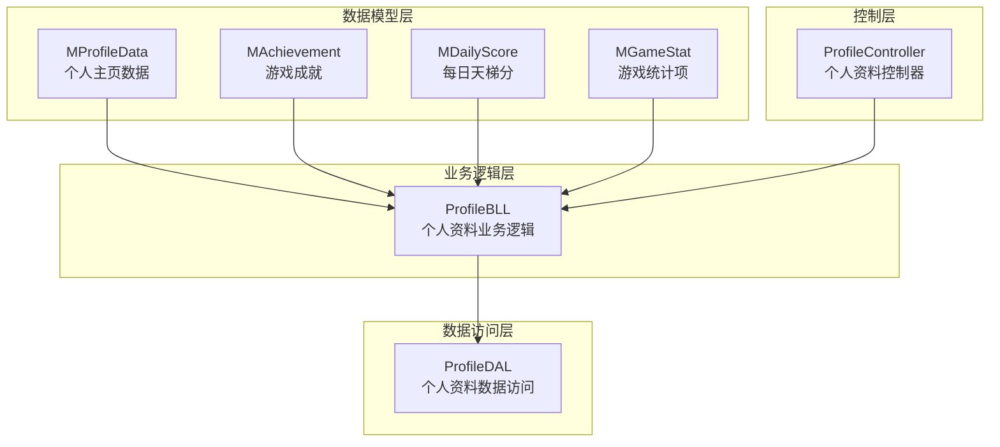
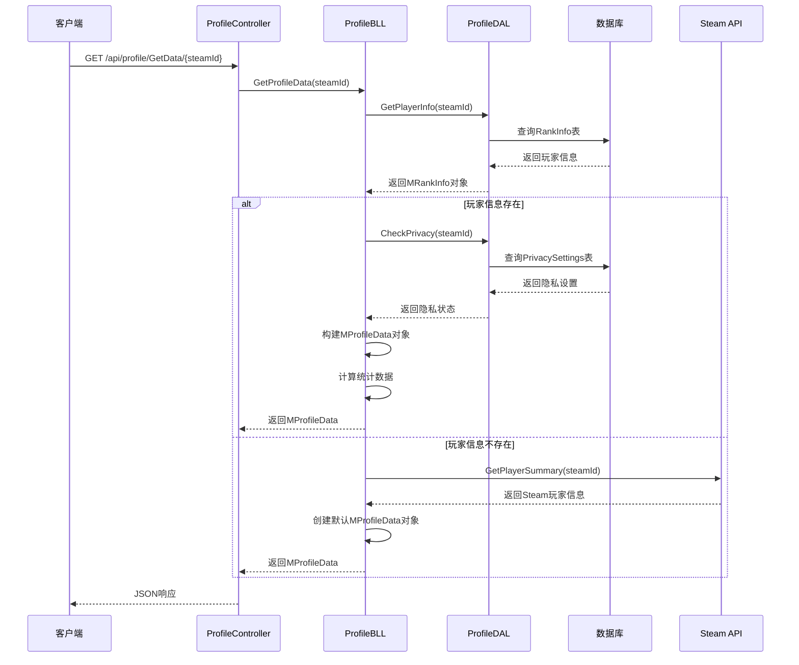
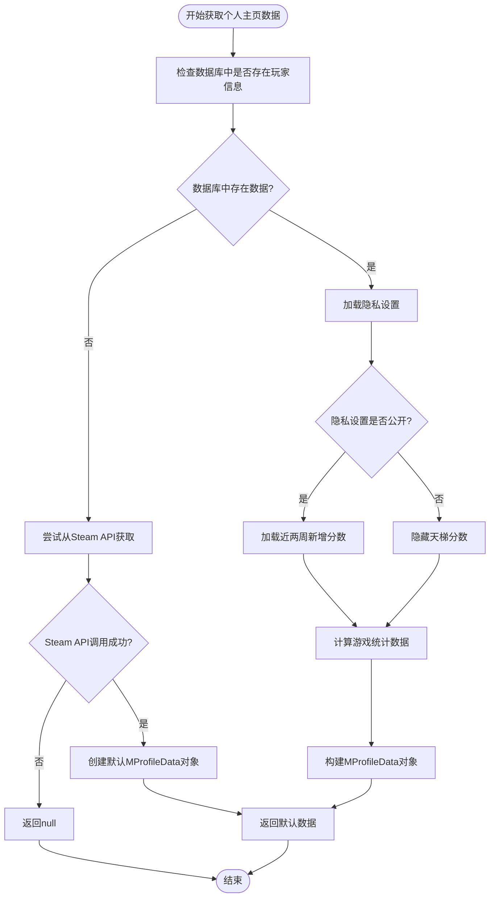
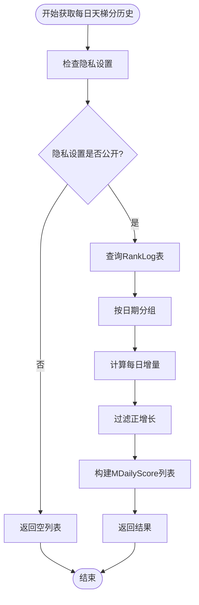
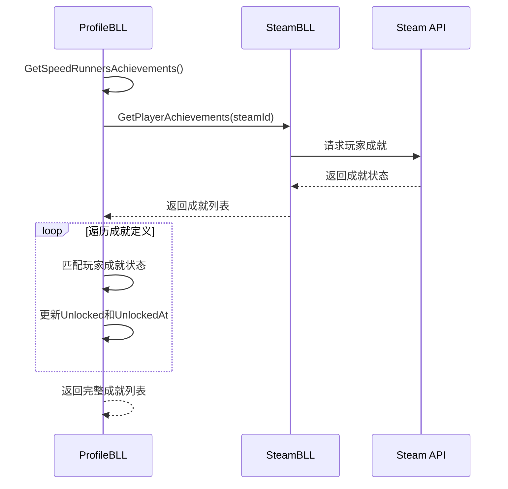
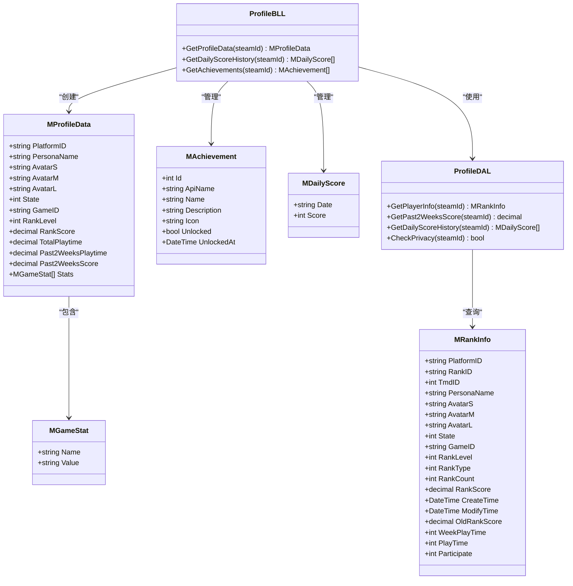
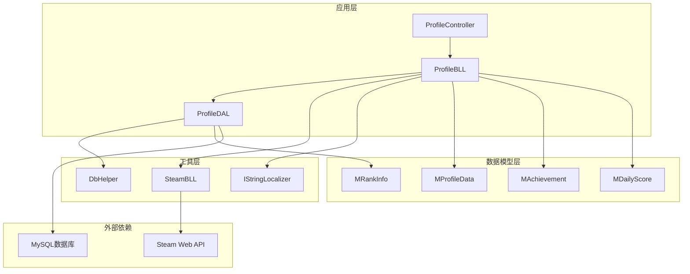

# 个人资料数据模型

<cite>
**本文档引用的文件**
- [MProfileData.cs](file://SpeedRunners.API/SpeedRunners.Model/Profile/MProfileData.cs)
- [MAchievement.cs](file://SpeedRunners.API/SpeedRunners.Model/Profile/MAchievement.cs)
- [MDailyScore.cs](file://SpeedRunners.API/SpeedRunners.Model/Profile/MDailyScore.cs)
- [MGameStat.cs](file://SpeedRunners.API/SpeedRunners.Model/Profile/MGameStat.cs)
- [ProfileBLL.cs](file://SpeedRunners.API/SpeedRunners.BLL/ProfileBLL.cs)
- [ProfileDAL.cs](file://SpeedRunners.API/SpeedRunners.DAL/ProfileDAL.cs)
- [ProfileController.cs](file://SpeedRunners.API/SpeedRunners.Controllers/ProfileController.cs)
- [MUser.cs](file://SpeedRunners.API/SpeedRunners.Model/MUser.cs)
- [MResponse.cs](file://SpeedRunners.API/SpeedRunners.Model/MResponse.cs)
- [PersonaAttribute.cs](file://SpeedRunners.API/SpeedRunners.Model/PersonaAttribute.cs)
- [UserAttribute.cs](file://SpeedRunners.API/SpeedRunners.Model/UserAttribute.cs)
- [MRankInfo.cs](file://SpeedRunners.API/SpeedRunners.Model/Rank/MRankInfo.cs)
- [MRankLog.cs](file://SpeedRunners.API/SpeedRunners.Model/Rank/MRankLog.cs)
</cite>

## 目录
1. [简介](#简介)
2. [项目结构](#项目结构)
3. [核心组件](#核心组件)
4. [架构概览](#架构概览)
5. [详细组件分析](#详细组件分析)
6. [依赖关系分析](#依赖关系分析)
7. [性能考虑](#性能考虑)
8. [故障排除指南](#故障排除指南)
9. [结论](#结论)

## 简介

个人资料数据模型是SpeedRunnersLab项目中的核心数据结构，负责管理玩家的个人主页信息、游戏统计数据、成就系统和隐私设置。该模型采用分层架构设计，通过MVC模式实现数据的获取、处理和展示。

本数据模型主要包含以下关键功能：
- 玩家个人信息展示（头像、昵称、状态等）
- 游戏统计数据聚合（总时长、近期表现等）
- 天梯分历史记录和热度图数据
- 游戏成就系统
- 隐私权限控制
- Steam平台集成

## 项目结构

项目采用典型的三层架构模式，数据模型位于SpeedRunners.Model命名空间下，按照功能模块进行组织：



**图表来源**
- [MProfileData.cs](file://SpeedRunners.API/SpeedRunners.Model/Profile/MProfileData.cs#L9-L56)
- [ProfileBLL.cs](file://SpeedRunners.API/SpeedRunners.BLL/ProfileBLL.cs#L12-L218)
- [ProfileDAL.cs](file://SpeedRunners.API/SpeedRunners.DAL/ProfileDAL.cs#L10-L124)
- [ProfileController.cs](file://SpeedRunners.API/SpeedRunners.Controllers/ProfileController.cs#L14-L40)

**章节来源**
- [MProfileData.cs](file://SpeedRunners.API/SpeedRunners.Model/Profile/MProfileData.cs#L1-L67)
- [ProfileBLL.cs](file://SpeedRunners.API/SpeedRunners.BLL/ProfileBLL.cs#L1-L220)
- [ProfileDAL.cs](file://SpeedRunners.API/SpeedRunners.DAL/ProfileDAL.cs#L1-L126)

## 核心组件

### 数据模型类

#### MProfileData - 个人主页数据模型
个人主页数据模型是整个个人资料系统的核心，包含了玩家的所有基本信息和统计数据。

**关键属性说明：**
- `PlatformID`: 平台唯一标识符
- `PersonaName`: 玩家昵称
- `AvatarS/M/L`: 头像不同尺寸版本
- `State`: 玩家在线状态（-1到6的枚举值）
- `GameID`: 当前游戏ID（SpeedRunners为207140）
- `RankLevel`: 段位等级（0-9）
- `RankScore`: 天梯分数（可为空表示隐私）
- `TotalPlaytime`: 总游戏时长（小时）
- `Past2WeeksPlaytime`: 近两周游戏时长（小时）
- `Past2WeeksScore`: 近两周新增天梯分
- `Stats`: 游戏统计数据列表

#### MAchievement - 游戏成就模型
成就系统的数据结构，支持Steam成就API的集成。

**关键属性说明：**
- `Id`: 成就唯一标识
- `ApiName`: Steam成就API名称
- `Name`: 成就显示名称
- `Description`: 成就描述
- `Icon`: 图标名称（用于前端显示）
- `Unlocked`: 是否已解锁
- `UnlockedAt`: 解锁时间

#### MDailyScore - 每日天梯分模型
用于生成热度图的每日分数变化数据。

**关键属性说明：**
- `Date`: 日期字符串（yyyy-MM-dd格式）
- `Score`: 当日新增分数

**章节来源**
- [MProfileData.cs](file://SpeedRunners.API/SpeedRunners.Model/Profile/MProfileData.cs#L9-L65)
- [MAchievement.cs](file://SpeedRunners.API/SpeedRunners.Model/Profile/MAchievement.cs#L8-L41)
- [MDailyScore.cs](file://SpeedRunners.API/SpeedRunners.Model/Profile/MDailyScore.cs#L8-L19)

## 架构概览

系统采用经典的三层架构设计，实现了关注点分离和职责明确的代码组织：



**图表来源**
- [ProfileController.cs](file://SpeedRunners.API/SpeedRunners.Controllers/ProfileController.cs#L21-L22)
- [ProfileBLL.cs](file://SpeedRunners.API/SpeedRunners.BLL/ProfileBLL.cs#L24-L93)
- [ProfileDAL.cs](file://SpeedRunners.API/SpeedRunners.DAL/ProfileDAL.cs#L17-L22)

**章节来源**
- [ProfileController.cs](file://SpeedRunners.API/SpeedRunners.Controllers/ProfileController.cs#L1-L41)
- [ProfileBLL.cs](file://SpeedRunners.API/SpeedRunners.BLL/ProfileBLL.cs#L1-L220)
- [ProfileDAL.cs](file://SpeedRunners.API/SpeedRunners.DAL/ProfileDAL.cs#L1-L126)

## 详细组件分析

### ProfileBLL - 个人资料业务逻辑层

ProfileBLL是个人资料系统的核心业务逻辑组件，负责协调数据访问和业务规则执行。

#### 主要功能模块

**1. GetProfileData - 获取个人主页数据**
该方法实现了复杂的业务逻辑，包括数据源优先级处理和隐私控制：



**图表来源**
- [ProfileBLL.cs](file://SpeedRunners.API/SpeedRunners.BLL/ProfileBLL.cs#L24-L93)

**2. GetDailyScoreHistory - 获取每日天梯分历史**
该方法专门处理天梯分历史数据的查询和处理：



**图表来源**
- [ProfileBLL.cs](file://SpeedRunners.API/SpeedRunners.BLL/ProfileBLL.cs#L98-L108)
- [ProfileDAL.cs](file://SpeedRunners.API/SpeedRunners.DAL/ProfileDAL.cs#L63-L108)

**3. GetAchievements - 获取玩家成就**
成就系统的实现体现了与Steam API的深度集成：



**图表来源**
- [ProfileBLL.cs](file://SpeedRunners.API/SpeedRunners.BLL/ProfileBLL.cs#L113-L142)

**章节来源**
- [ProfileBLL.cs](file://SpeedRunners.API/SpeedRunners.BLL/ProfileBLL.cs#L12-L218)

### ProfileDAL - 个人资料数据访问层

ProfileDAL实现了数据持久化的具体逻辑，提供了针对个人资料相关数据的CRUD操作。

#### 核心数据访问方法

**1. GetPlayerInfo - 获取玩家基础信息**
通过SQL查询从RankInfo表中获取玩家的基础信息，包括头像、昵称、状态等。

**2. GetPast2WeeksScore - 获取近两周新增分数**
这是一个复杂的SQL查询，使用了子查询和UNION操作来计算指定时间段内的天梯分增长：

```sql
SELECT b.RankScore - a.minScore 
FROM (
    SELECT PlatformID, MIN(RankScore) minScore 
    FROM (
        SELECT PlatformID, RankScore 
        FROM RankLog
        WHERE PlatformID = ?steamId AND Date >= DATE_SUB(CURDATE(), interval 13 day)
        UNION
        SELECT c.PlatformID, d.RankScore
        FROM (
            SELECT PlatformID, MAX(Date) Date
            FROM RankLog
            WHERE PlatformID = ?steamId AND Date < DATE_SUB(CURDATE(), interval 13 day)
            GROUP BY PlatformID
        ) c
        LEFT JOIN RankLog d ON c.PlatformID = d.PlatformID AND c.Date = d.date
    ) e 
    WHERE PlatformID = ?steamId
    GROUP BY PlatformID
) a 
LEFT JOIN RankInfo b ON a.PlatformID = b.PlatformID
WHERE a.PlatformID = ?steamId
```

**3. GetDailyScoreHistory - 获取每日天梯分历史**
查询过去365天的天梯分记录，并按日期分组计算每日增量。

**4. CheckPrivacy - 检查隐私设置**
从PrivacySettings表中查询玩家的隐私设置，默认情况下所有玩家都是公开的。

**章节来源**
- [ProfileDAL.cs](file://SpeedRunners.API/SpeedRunners.DAL/ProfileDAL.cs#L10-L124)

### 数据模型关系图



**图表来源**
- [MProfileData.cs](file://SpeedRunners.API/SpeedRunners.Model/Profile/MProfileData.cs#L9-L65)
- [MAchievement.cs](file://SpeedRunners.API/SpeedRunners.Model/Profile/MAchievement.cs#L8-L41)
- [MDailyScore.cs](file://SpeedRunners.API/SpeedRunners.Model/Profile/MDailyScore.cs#L8-L19)
- [MRankInfo.cs](file://SpeedRunners.API/SpeedRunners.Model/Rank/MRankInfo.cs#L5-L34)
- [ProfileBLL.cs](file://SpeedRunners.API/SpeedRunners.BLL/ProfileBLL.cs#L12-L218)
- [ProfileDAL.cs](file://SpeedRunners.API/SpeedRunners.DAL/ProfileDAL.cs#L10-L124)

**章节来源**
- [MProfileData.cs](file://SpeedRunners.API/SpeedRunners.Model/Profile/MProfileData.cs#L1-L67)
- [MAchievement.cs](file://SpeedRunners.API/SpeedRunners.Model/Profile/MAchievement.cs#L1-L43)
- [MDailyScore.cs](file://SpeedRunners.API/SpeedRunners.Model/Profile/MDailyScore.cs#L1-L21)
- [MRankInfo.cs](file://SpeedRunners.API/SpeedRunners.Model/Rank/MRankInfo.cs#L1-L36)

## 依赖关系分析

系统各层之间的依赖关系清晰明确，遵循了依赖倒置原则：



**图表来源**
- [ProfileController.cs](file://SpeedRunners.API/SpeedRunners.Controllers/ProfileController.cs#L1-L41)
- [ProfileBLL.cs](file://SpeedRunners.API/SpeedRunners.BLL/ProfileBLL.cs#L1-L220)
- [ProfileDAL.cs](file://SpeedRunners.API/SpeedRunners.DAL/ProfileDAL.cs#L1-L126)

**章节来源**
- [ProfileController.cs](file://SpeedRunners.API/SpeedRunners.Controllers/ProfileController.cs#L1-L41)
- [ProfileBLL.cs](file://SpeedRunners.API/SpeedRunners.BLL/ProfileBLL.cs#L1-L220)
- [ProfileDAL.cs](file://SpeedRunners.API/SpeedRunners.DAL/ProfileDAL.cs#L1-L126)

## 性能考虑

### 数据访问优化

1. **SQL查询优化**
   - 使用参数化查询防止SQL注入
   - 合理的索引策略（PlatformID、Date字段）
   - 避免SELECT *，只查询必要字段

2. **缓存策略**
   - Steam API响应可以适当缓存
   - 频繁访问的统计数据可以缓存
   - 隐私设置可以短期缓存

3. **异步处理**
   - 所有I/O操作都使用async/await模式
   - Steam API调用使用异步方式避免阻塞

### 内存管理

1. **对象生命周期**
   - 及时释放数据库连接
   - 合理使用集合类型避免内存泄漏
   - 对大对象使用分页或流式处理

2. **序列化优化**
   - 避免不必要的JSON序列化
   - 使用适当的属性选择性序列化

## 故障排除指南

### 常见问题及解决方案

**1. 数据库连接问题**
- 检查连接字符串配置
- 验证MySQL服务状态
- 确认网络连通性

**2. Steam API调用失败**
- 检查API密钥配置
- 验证网络连接
- 实现重试机制和超时处理

**3. 隐私设置导致的数据缺失**
- 检查PrivacySettings表配置
- 验证用户权限设置
- 提供默认数据降级方案

**4. 性能问题**
- 分析慢查询日志
- 优化SQL查询语句
- 实施适当的缓存策略

**章节来源**
- [ProfileBLL.cs](file://SpeedRunners.API/SpeedRunners.BLL/ProfileBLL.cs#L32-L57)
- [ProfileDAL.cs](file://SpeedRunners.API/SpeedRunners.DAL/ProfileDAL.cs#L29-L55)

## 结论

个人资料数据模型展现了良好的软件架构设计，通过清晰的分层结构和职责分离，实现了功能的模块化和可维护性。该模型的主要优势包括：

1. **架构清晰**：三层架构设计符合最佳实践
2. **扩展性强**：易于添加新的数据字段和业务逻辑
3. **性能优化**：合理的数据访问模式和异步处理
4. **错误处理**：完善的异常处理和降级机制
5. **隐私保护**：灵活的隐私设置控制

该数据模型为SpeedRunnersLab项目提供了坚实的数据基础，支持了完整的个人资料展示、成就系统和数据分析功能。通过持续的优化和维护，该模型能够很好地支持项目的长期发展需求。