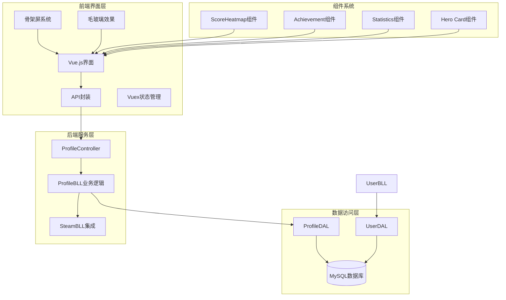
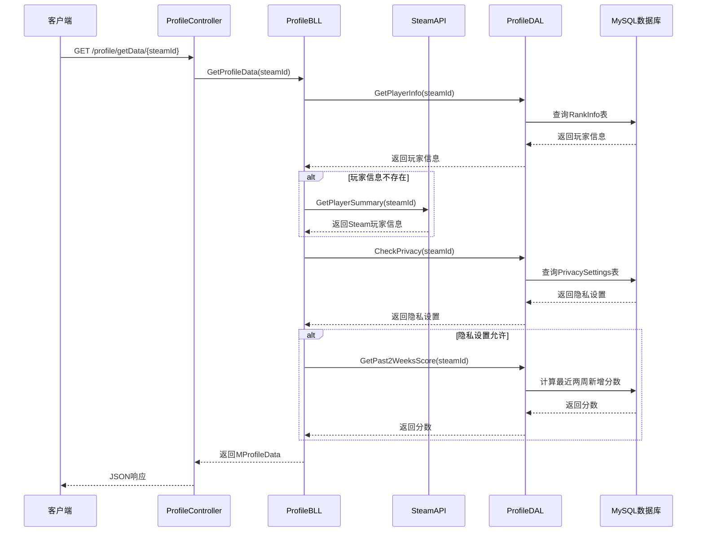
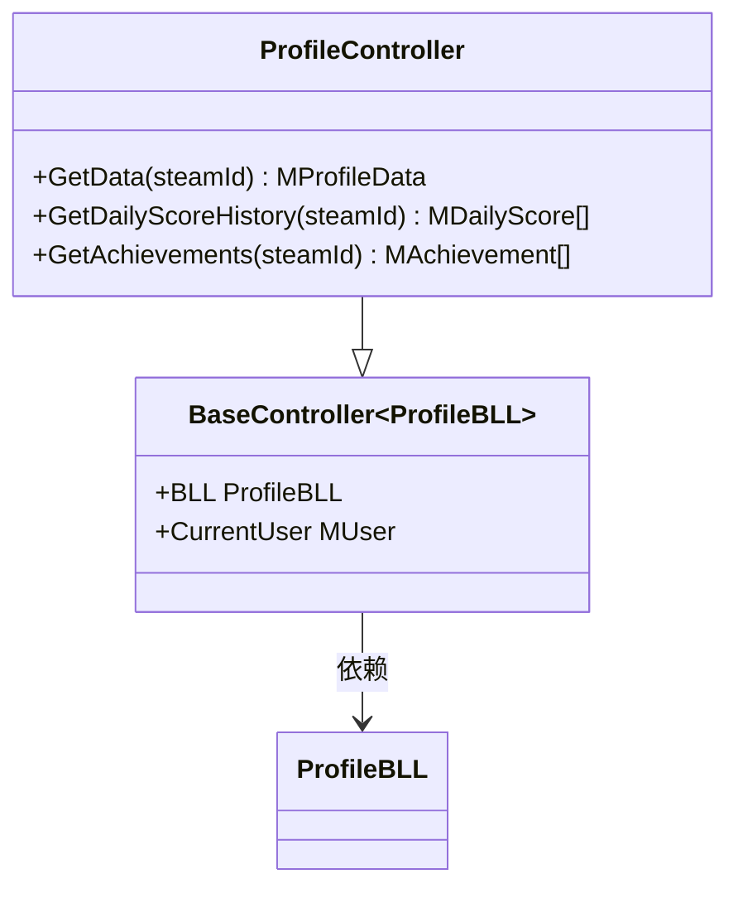
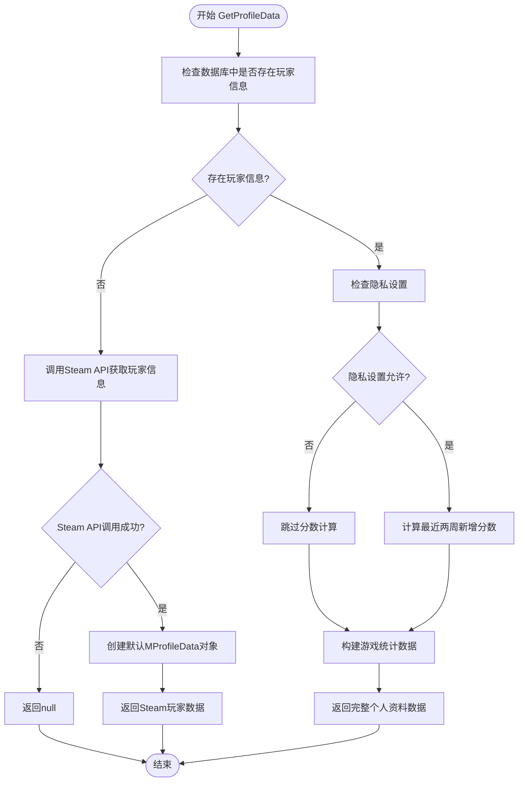
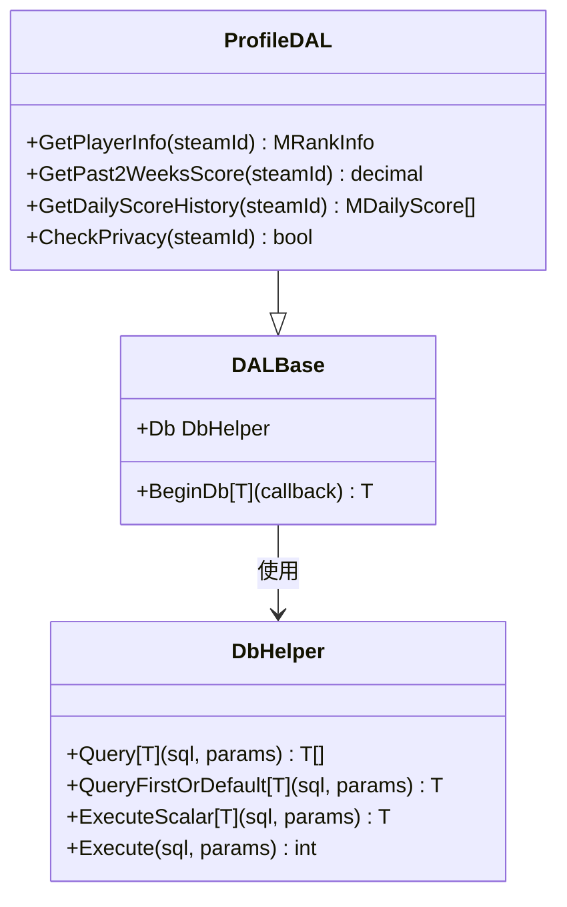
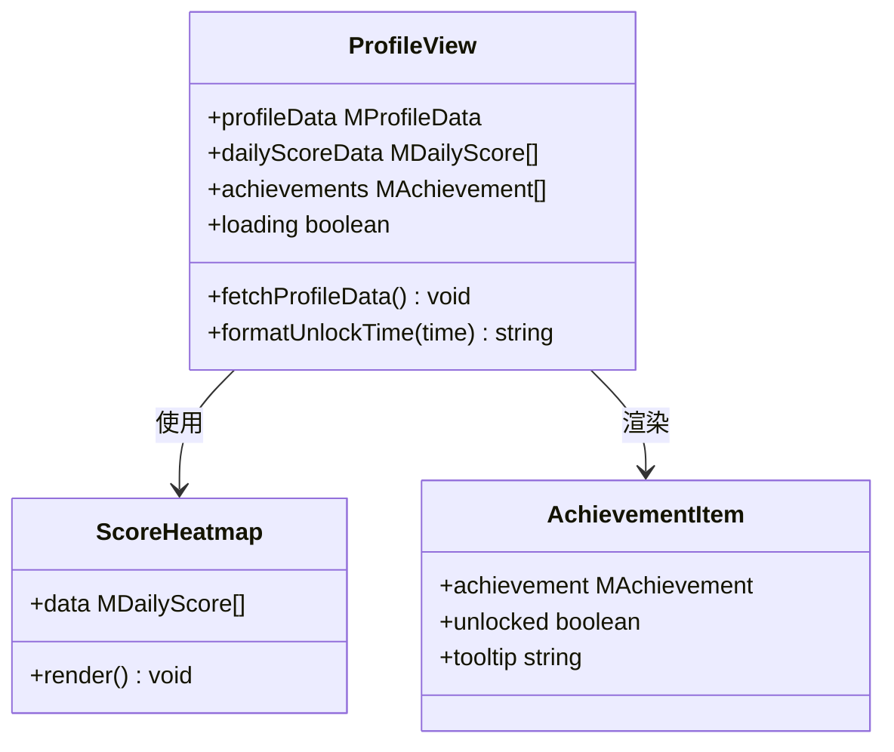
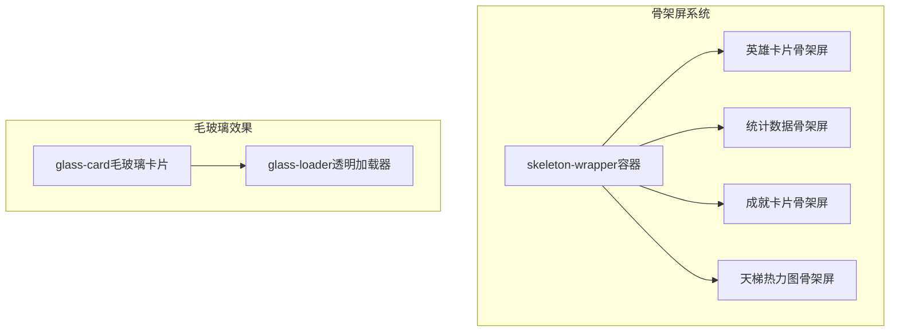
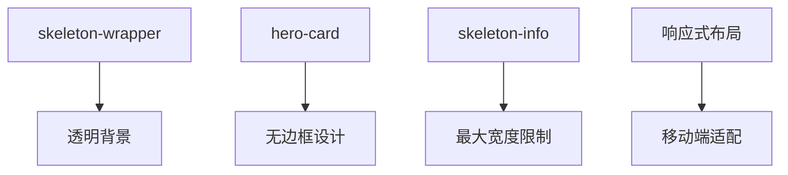
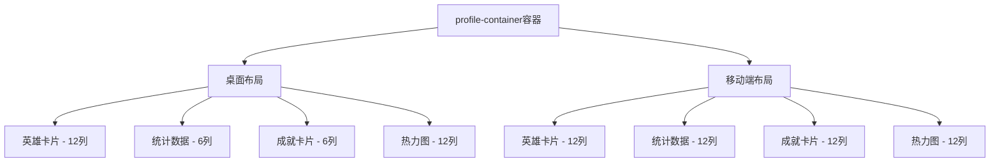

# 个人资料系统

<cite>
**本文档引用的文件**
- [ProfileController.cs](file://SpeedRunners.API/SpeedRunners/Controllers/ProfileController.cs)
- [ProfileBLL.cs](file://SpeedRunners.API/SpeedRunners.BLL/ProfileBLL.cs)
- [ProfileDAL.cs](file://SpeedRunners.API/SpeedRunners.DAL/ProfileDAL.cs)
- [MProfileData.cs](file://SpeedRunners.API/SpeedRunners.Model/Profile/MProfileData.cs)
- [MAchievement.cs](file://SpeedRunners.API/SpeedRunners.Model/Profile/MAchievement.cs)
- [MDailyScore.cs](file://SpeedRunners.API/SpeedRunners.Model/Profile/MDailyScore.cs)
- [MPrivacySettings.cs](file://SpeedRunners.API/SpeedRunners.Model/User/MPrivacySettings.cs)
- [UserBLL.cs](file://SpeedRunners.API/SpeedRunners.BLL/UserBLL.cs)
- [UserDAL.cs](file://SpeedRunners.API/SpeedRunners.DAL/UserDAL.cs)
- [MUser.cs](file://SpeedRunners.API/SpeedRunners.Model/User/MUser.cs)
- [profile.js](file://SpeedRunners.UI/src/api/profile.js)
- [profile/index.vue](file://SpeedRunners.UI/src/views/profile/index.vue)
- [user.js](file://SpeedRunners.UI/src/store/modules/user.js)
- [privacySettings.vue](file://SpeedRunners.UI/src/views/other/privacySettings.vue)
- [ScoreHeatmap/index.vue](file://SpeedRunners.UI/src/components/ScoreHeatmap/index.vue)
- [tmdsr.sql](file://mysql-dump/tmdsr.sql)
</cite>

## 更新摘要
**变更内容**
- 新增四部分骨架屏系统重构：引入英雄卡片、统计数据、成就卡片、天梯热力图四个独立骨架屏组件
- 采用响应式布局设计，支持桌面和移动端自适应
- 引入毛玻璃效果设计，提升视觉体验
- 优化数据加载流程，采用并发API调用策略

## 目录
1. [简介](#简介)
2. [项目结构](#项目结构)
3. [核心组件](#核心组件)
4. [架构概览](#架构概览)
5. [详细组件分析](#详细组件分析)
6. [骨架屏系统重构](#骨架屏系统重构)
7. [响应式布局设计](#响应式布局设计)
8. [毛玻璃效果实现](#毛玻璃效果实现)
9. [依赖关系分析](#依赖关系分析)
10. [性能考虑](#性能考虑)
11. [故障排除指南](#故障排除指南)
12. [结论](#结论)

## 简介

个人资料系统是SpeedRunnersLab项目中的一个核心功能模块，负责为用户提供游戏玩家的个人主页展示。该系统集成了Steam平台数据、游戏统计数据、成就系统和隐私设置管理等功能，为玩家提供全面的游戏数据分析和个人资料展示。

系统采用三层架构设计，包括前端Vue.js界面层、后端.NET Core API服务层和MySQL数据库存储层。通过RESTful API接口实现前后端分离的数据交互，支持实时的游戏数据更新和用户隐私控制。

**更新** 系统现已完成重大重构，引入了现代化的骨架屏加载系统和毛玻璃效果设计，显著提升了用户体验和视觉质量。

## 项目结构

个人资料系统在整个SpeedRunnersLab项目中占据重要地位，主要由以下层次组成：



**图表来源**
- [ProfileController.cs](file://SpeedRunners.API/SpeedRunners/Controllers/ProfileController.cs#L1-L41)
- [ProfileBLL.cs](file://SpeedRunners.API/SpeedRunners.BLL/ProfileBLL.cs#L1-L220)
- [ProfileDAL.cs](file://SpeedRunners.API/SpeedRunners.DAL/ProfileDAL.cs#L1-L126)
- [ScoreHeatmap/index.vue](file://SpeedRunners.UI/src/components/ScoreHeatmap/index.vue#L1-L362)

**章节来源**
- [ProfileController.cs](file://SpeedRunners.API/SpeedRunners/Controllers/ProfileController.cs#L1-L41)
- [ProfileBLL.cs](file://SpeedRunners.API/SpeedRunners.BLL/ProfileBLL.cs#L1-L220)
- [ProfileDAL.cs](file://SpeedRunners.API/SpeedRunners.DAL/ProfileDAL.cs#L1-L126)

## 核心组件

个人资料系统包含多个核心组件，每个组件都有明确的职责分工：

### 数据模型组件
- **MProfileData**: 个人主页数据模型，包含玩家基本信息、游戏统计数据和头像信息
- **MAchievement**: 游戏成就模型，定义成就的显示属性和解锁状态
- **MDailyScore**: 每日天梯分记录模型，用于热度图展示

### 业务逻辑组件
- **ProfileBLL**: 个人资料业务逻辑处理，包含数据聚合、隐私检查和Steam API集成
- **UserBLL**: 用户相关业务逻辑，处理登录认证和隐私设置管理

### 数据访问组件
- **ProfileDAL**: 个人资料数据访问层，负责数据库查询和操作
- **UserDAL**: 用户数据访问层，处理用户信息和令牌管理

### 前端组件系统
- **骨架屏组件**: 四部分独立骨架屏，包括英雄卡片、统计数据、成就卡片、天梯热力图
- **毛玻璃卡片**: 统一的毛玻璃效果卡片组件
- **响应式布局**: 基于Vuetify的响应式网格系统

**章节来源**
- [MProfileData.cs](file://SpeedRunners.API/SpeedRunners.Model/Profile/MProfileData.cs#L1-L67)
- [MAchievement.cs](file://SpeedRunners.API/SpeedRunners.Model/Profile/MAchievement.cs#L1-L43)
- [MDailyScore.cs](file://SpeedRunners.API/SpeedRunners.Model/Profile/MDailyScore.cs#L1-L21)
- [ProfileBLL.cs](file://SpeedRunners.API/SpeedRunners.BLL/ProfileBLL.cs#L1-L220)
- [UserBLL.cs](file://SpeedRunners.API/SpeedRunners.BLL/UserBLL.cs#L1-L153)

## 架构概览

个人资料系统采用经典的三层架构模式，实现了清晰的职责分离和良好的可维护性：



**图表来源**
- [ProfileController.cs](file://SpeedRunners.API/SpeedRunners/Controllers/ProfileController.cs#L19-L22)
- [ProfileBLL.cs](file://SpeedRunners.API/SpeedRunners.BLL/ProfileBLL.cs#L24-L93)
- [ProfileDAL.cs](file://SpeedRunners.API/SpeedRunners.DAL/ProfileDAL.cs#L17-L58)

系统架构特点：
- **分层清晰**: 控制器层、业务逻辑层、数据访问层职责明确
- **接口隔离**: 每个层次通过明确定义的接口进行通信
- **数据持久化**: 使用MySQL数据库存储玩家信息和统计数据
- **API集成**: 与Steam Web API集成获取玩家游戏状态

**章节来源**
- [ProfileController.cs](file://SpeedRunners.API/SpeedRunners/Controllers/ProfileController.cs#L1-L41)
- [ProfileBLL.cs](file://SpeedRunners.API/SpeedRunners.BLL/ProfileBLL.cs#L1-L220)
- [ProfileDAL.cs](file://SpeedRunners.API/SpeedRunners.DAL/ProfileDAL.cs#L1-L126)

## 详细组件分析

### ProfileController - 控制器层

ProfileController作为个人资料系统的入口点，提供了三个核心API接口：



**图表来源**
- [ProfileController.cs](file://SpeedRunners.API/SpeedRunners/Controllers/ProfileController.cs#L14-L39)

控制器的主要职责：
- **数据获取**: 提供个人主页数据、每日分数历史和成就信息的API接口
- **参数验证**: 验证Steam ID参数的有效性
- **响应格式**: 统一返回JSON格式的API响应

**章节来源**
- [ProfileController.cs](file://SpeedRunners.API/SpeedRunners/Controllers/ProfileController.cs#L1-L41)

### ProfileBLL - 业务逻辑层

ProfileBLL是个人资料系统的核心业务逻辑处理单元，实现了复杂的数据聚合和隐私控制逻辑：



**图表来源**
- [ProfileBLL.cs](file://SpeedRunners.API/SpeedRunners.BLL/ProfileBLL.cs#L24-L93)

业务逻辑特点：
- **双重数据源**: 支持本地数据库和Steam API两种数据源
- **隐私控制**: 严格遵守用户的隐私设置，保护敏感数据
- **数据转换**: 将底层数据转换为前端友好的格式
- **异常处理**: 对Steam API调用失败进行优雅降级

**章节来源**
- [ProfileBLL.cs](file://SpeedRunners.API/SpeedRunners.BLL/ProfileBLL.cs#L1-L220)

### ProfileDAL - 数据访问层

ProfileDAL负责与MySQL数据库的直接交互，实现了高效的查询和数据操作：



**图表来源**
- [ProfileDAL.cs](file://SpeedRunners.API/SpeedRunners.DAL/ProfileDAL.cs#L10-L124)

数据访问特点：
- **SQL优化**: 使用复杂的SQL查询计算最近两周的分数增量
- **数据分组**: 对每日分数进行分组计算，生成热度图数据
- **隐私查询**: 通过LEFT JOIN查询隐私设置，确保数据完整性

**章节来源**
- [ProfileDAL.cs](file://SpeedRunners.API/SpeedRunners.DAL/ProfileDAL.cs#L1-L126)

### 前端界面组件

前端使用Vue.js框架构建了丰富的用户界面，实现了响应式的个人资料展示：



**图表来源**
- [profile/index.vue](file://SpeedRunners.UI/src/views/profile/index.vue#L219-L380)

前端界面特点：
- **响应式设计**: 支持桌面和移动设备的自适应布局
- **实时数据**: 使用Promise.all并发加载多个API数据
- **交互体验**: 提供成就解锁时间格式化和状态指示
- **国际化支持**: 支持中英文界面切换

**章节来源**
- [profile/index.vue](file://SpeedRunners.UI/src/views/profile/index.vue#L1-L799)
- [profile.js](file://SpeedRunners.UI/src/api/profile.js#L1-L26)

## 骨架屏系统重构

**更新** 个人资料系统完成了重大重构，引入了四部分骨架屏系统，显著提升了用户体验。

### 骨架屏架构设计



**图表来源**
- [profile/index.vue](file://SpeedRunners.UI/src/views/profile/index.vue#L8-L62)
- [profile/index.vue](file://SpeedRunners.UI/src/views/profile/index.vue#L739-L775)

### 四部分骨架屏结构

#### 英雄卡片骨架屏
- **头像占位符**: 使用圆形头像加载器
- **玩家信息**: 包含昵称和状态信息的文本加载器
- **核心统计数据**: 三列数据的加载器布局

#### 统计数据骨架屏
- **卡片标题**: 文本加载器模拟标题
- **统计表格**: 列表项加载器模拟表格行

#### 成就卡片骨架屏
- **卡片标题**: 文本加载器模拟标题和计数
- **成就网格**: 文本加载器模拟成就图标网格

#### 天梯热力图骨架屏
- **热力图容器**: 图像加载器模拟热力图
- **月份标签**: 文本加载器模拟月份标记

**章节来源**
- [profile/index.vue](file://SpeedRunners.UI/src/views/profile/index.vue#L8-L62)

### 骨架屏适配策略

骨架屏系统采用了专门的CSS适配策略，确保与毛玻璃效果的完美结合：



**图表来源**
- [profile/index.vue](file://SpeedRunners.UI/src/views/profile/index.vue#L739-L775)

**章节来源**
- [profile/index.vue](file://SpeedRunners.UI/src/views/profile/index.vue#L739-L799)

## 响应式布局设计

**更新** 系统采用了现代化的响应式布局设计，支持多种屏幕尺寸的自适应显示。

### 布局架构



**图表来源**
- [profile/index.vue](file://SpeedRunners.UI/src/views/profile/index.vue#L65-L231)

### 响应式特性

#### 桌面端布局
- **网格系统**: 基于Vuetify的12列网格系统
- **英雄卡片**: 占满12列，展示完整玩家信息
- **侧边栏**: 统计数据和成就卡片各占6列
- **热力图**: 独占12列，全宽显示

#### 移动端适配
- **单列布局**: 所有内容垂直排列
- **网格调整**: 成就网格调整为5列布局
- **字体缩放**: 关键数据字体在小屏设备上缩小
- **间距优化**: 适当增加间距以改善触摸体验

**章节来源**
- [profile/index.vue](file://SpeedRunners.UI/src/views/profile/index.vue#L778-L799)

## 毛玻璃效果实现

**更新** 系统引入了现代化的毛玻璃效果设计，提升了整体视觉质量和用户体验。

### 毛玻璃设计原理

```mermaid
graph TB
GlassCard[glass-card毛玻璃卡片] --> Background[半透明背景]
GlassCard --> Blur[背景模糊效果]
GlassCard --> Border[半透明边框]
GlassCard --> Transition[平滑过渡动画]
Background --> RGBA[RGBA颜色值]
Blur --> BackdropFilter[backdrop-filter: blur(16px)]
Border --> BorderColor[border-color: rgba(255,255,255,0.08)]
Transition --> HoverEffect[悬停效果]
```

**图表来源**
- [profile/index.vue](file://SpeedRunners.UI/src/views/profile/index.vue#L462-L474)

### 毛玻璃样式实现

#### 基础样式
- **背景透明度**: `background: rgba(18, 18, 28, 0.88)`
- **模糊效果**: `backdrop-filter: blur(16px)`
- **边框透明**: `border: 1px solid rgba(255, 255, 255, 0.08)`
- **圆角设计**: `border-radius: 6px`

#### 交互效果
- **悬停增强**: `border-color: rgba(255, 255, 255, 0.14)`
- **阴影效果**: `box-shadow: 0 4px 24px rgba(0, 0, 0, 0.3)`
- **过渡动画**: `transition: border-color 0.3s ease, box-shadow 0.3s ease`

#### 暗色遮罩层
- **页面覆盖**: `.page-overlay`覆盖整个页面
- **渐变背景**: `linear-gradient(180deg, rgba(8, 8, 18, 0.35) 0%, rgba(8, 8, 18, 0.82) 100%)`
- **层级控制**: `z-index: 0`确保在内容之下

**章节来源**
- [profile/index.vue](file://SpeedRunners.UI/src/views/profile/index.vue#L432-L474)

## 依赖关系分析

个人资料系统的依赖关系体现了清晰的架构层次和模块化设计：

```mermaid
graph LR
subgraph "外部依赖"
Steam[Steam Web API]
MySQL[MySQL数据库]
Vuetify[Vuetify UI框架]
Vue[Vue.js框架]
End
subgraph "后端模块"
Controller[ProfileController]
BLL[ProfileBLL]
DAL[ProfileDAL]
Model[数据模型]
end
subgraph "前端模块"
Vue[Vue.js应用]
API[API封装]
Store[Vuex状态]
Skeleton[骨架屏组件]
Glass[毛玻璃组件]
Heatmap[ScoreHeatmap组件]
end
Steam --> BLL
MySQL --> DAL
Controller --> BLL
BLL --> DAL
BLL --> Model
Vue --> API
API --> Controller
Store --> Vue
Skeleton --> Vue
Glass --> Vue
Heatmap --> Vue
```

**图表来源**
- [ProfileController.cs](file://SpeedRunners.API/SpeedRunners/Controllers/ProfileController.cs#L1-L41)
- [ProfileBLL.cs](file://SpeedRunners.API/SpeedRunners.BLL/ProfileBLL.cs#L1-L220)
- [ProfileDAL.cs](file://SpeedRunners.API/SpeedRunners.DAL/ProfileDAL.cs#L1-L126)

依赖关系特点：
- **单向依赖**: 从上层到下层的清晰依赖方向
- **接口抽象**: 通过接口定义实现松耦合
- **外部集成**: 与Steam API和MySQL数据库的集成点明确
- **组件化**: 前端采用组件化设计，提高代码复用性

**章节来源**
- [ProfileController.cs](file://SpeedRunners.API/SpeedRunners/Controllers/ProfileController.cs#L1-L41)
- [ProfileBLL.cs](file://SpeedRunners.API/SpeedRunners.BLL/ProfileBLL.cs#L1-L220)
- [ProfileDAL.cs](file://SpeedRunners.API/SpeedRunners.DAL/ProfileDAL.cs#L1-L126)

## 性能考虑

个人资料系统在设计时充分考虑了性能优化和用户体验：

### 数据缓存策略
- **并发API调用**: 前端使用Promise.all同时请求多个数据接口，减少总等待时间
- **数据库查询优化**: ProfileDAL使用预编译SQL语句和适当的索引策略
- **Steam API降级**: 当Steam API不可用时，系统自动使用本地数据

### 内存管理
- **数据模型优化**: 使用轻量级数据模型传输，避免不必要的字段传递
- **懒加载机制**: 成就列表和分数历史按需加载，减少初始页面负载
- **骨架屏优化**: 骨架屏使用轻量级HTML结构，减少DOM节点数量

### 网络优化
- **HTTP缓存**: 合理设置HTTP缓存头，减少重复请求
- **错误重试**: 对临时网络错误实现智能重试机制
- **骨架屏过渡**: 骨架屏到真实内容的平滑过渡动画

### 视觉性能
- **毛玻璃渲染**: 使用CSS backdrop-filter，现代浏览器支持良好
- **响应式图片**: 头像使用合适的尺寸，避免过度加载
- **滚动优化**: 热力图容器使用硬件加速滚动

## 故障排除指南

### 常见问题及解决方案

**1. Steam API连接超时**
- 检查Steam Web API的可用性和限流设置
- 实现重试机制和超时处理
- 提供本地降级数据

**2. 数据库连接问题**
- 验证MySQL连接字符串和凭据
- 检查数据库服务器状态
- 实现连接池管理和自动重连

**3. 隐私设置冲突**
- 确保PrivacySettings表的默认值正确初始化
- 检查用户权限和数据访问控制
- 提供隐私设置的用户界面

**4. 骨架屏显示异常**
- 检查CSS类名是否正确应用
- 验证Vuetify版本兼容性
- 确认响应式断点设置

**5. 毛玻璃效果不生效**
- 检查浏览器对backdrop-filter的支持
- 验证CSS属性拼写和语法
- 确认z-index层级设置

**6. 前端数据加载失败**
- 检查API端点的可达性和响应格式
- 实现错误边界和用户友好的错误提示
- 提供数据加载状态指示器

**章节来源**
- [ProfileBLL.cs](file://SpeedRunners.API/SpeedRunners.BLL/ProfileBLL.cs#L32-L58)
- [UserBLL.cs](file://SpeedRunners.API/SpeedRunners.BLL/UserBLL.cs#L60-L93)
- [profile/index.vue](file://SpeedRunners.UI/src/views/profile/index.vue#L334-L353)

## 结论

个人资料系统展现了现代Web应用开发的最佳实践，通过清晰的分层架构、完善的错误处理和优秀的用户体验设计，为SpeedRunners游戏社区提供了强大的个人资料展示功能。

**更新** 系统的重大重构引入了四部分骨架屏系统、响应式布局设计和毛玻璃效果，显著提升了用户体验和视觉质量。

系统的主要优势包括：
- **架构清晰**: 三层架构设计便于维护和扩展
- **功能完整**: 集成Steam API、游戏统计、成就系统和隐私控制
- **用户体验**: 响应式设计、骨架屏加载和毛玻璃效果
- **性能优化**: 并发数据加载、内存管理和视觉优化
- **现代化设计**: 现代化的UI设计和交互体验

未来可以考虑的功能增强：
- 实时数据更新机制
- 更丰富的统计图表
- 社交功能集成
- 移动端原生应用支持
- 更多的个性化定制选项