# 个人资料系统

<cite>
**本文档引用的文件**
- [ProfileController.cs](file://SpeedRunners.API/SpeedRunners/Controllers/ProfileController.cs)
- [ProfileBLL.cs](file://SpeedRunners.API/SpeedRunners.BLL/ProfileBLL.cs)
- [ProfileDAL.cs](file://SpeedRunners.API/SpeedRunners.DAL/ProfileDAL.cs)
- [MProfileData.cs](file://SpeedRunners.API/SpeedRunners.Model/Profile/MProfileData.cs)
- [MAchievement.cs](file://SpeedRunners.API/SpeedRunners.Model/Profile/MAchievement.cs)
- [MAchievementSchema.cs](file://SpeedRunners.API/SpeedRunners.Model/Steam/MAchievementSchema.cs)
- [MSteamAchievement.cs](file://SpeedRunners.API/SpeedRunners.Model/Steam/MSteamAchievement.cs)
- [MDailyScore.cs](file://SpeedRunners.API/SpeedRunners.Model/Profile/MDailyScore.cs)
- [MPrivacySettings.cs](file://SpeedRunners.API/SpeedRunners.Model/User/MPrivacySettings.cs)
- [UserBLL.cs](file://SpeedRunners.API/SpeedRunners.BLL/UserBLL.cs)
- [UserDAL.cs](file://SpeedRunners.API/SpeedRunners.DAL/UserDAL.cs)
- [MUser.cs](file://SpeedRunners.API/SpeedRunners.Model/User/MUser.cs)
- [AchievementSchemaService.cs](file://SpeedRunners.API/SpeedRunners.BLL/AchievementSchemaService.cs)
- [SteamBLL.cs](file://SpeedRunners.API/SpeedRunners.BLL/SteamBLL.cs)
- [LocaleHeaderRequestCultureProvider.cs](file://SpeedRunners.API/SpeedRunners/Service/LocaleHeaderRequestCultureProvider.cs)
- [ProfileBLL.cs.resx](file://SpeedRunners.API/SpeedRunners.BLL/Resources/ProfileBLL.cs.resx)
- [UserBLL.cs.resx](file://SpeedRunners.API/SpeedRunners.BLL/Resources/UserBLL.cs.resx)
- [profile.js](file://SpeedRunners.UI/src/api/profile.js)
- [profile/index.vue](file://SpeedRunners.UI/src/views/profile/index.vue)
- [user.js](file://SpeedRunners.UI/src/store/modules/user.js)
- [privacySettings.vue](file://SpeedRunners.UI/src/views/other/privacySettings.vue)
- [ScoreHeatmap/index.vue](file://SpeedRunners.UI/src/components/ScoreHeatmap/index.vue)
- [index.js](file://SpeedRunners.UI/src/i18n/index.js)
- [zh.json](file://SpeedRunners.UI/src/i18n/lang/zh.json)
- [en.json](file://SpeedRunners.UI/src/i18n/lang/en.json)
- [tmdsr.sql](file://mysql-dump/tmdsr.sql)
</cite>

## 更新摘要
**变更内容**
- 新增国际化支持：支持22种语言的个人资料页面标题、成就标题、天梯分变化标题、状态显示等本地化功能
- 新增语言检测机制：基于浏览器语言和用户偏好自动选择语言
- 新增后端文化提供程序：支持通过HTTP头部指定语言环境
- 新增多语言资源文件：包含个人资料、成就、排行榜等核心功能的多语言文本
- 新增前端语言包：支持中英德法俄等22种语言的界面文本

## 目录
1. [简介](#简介)
2. [项目结构](#项目结构)
3. [核心组件](#核心组件)
4. [架构概览](#架构概览)
5. [详细组件分析](#详细组件分析)
6. [国际化系统设计](#国际化系统设计)
7. [语言检测与切换机制](#语言检测与切换机制)
8. [多语言资源管理](#多语言资源管理)
9. [前端国际化实现](#前端国际化实现)
10. [后端本地化支持](#后端本地化支持)
11. [成就系统重构](#成就系统重构)
12. [动态图像加载机制](#动态图像加载机制)
13. [缓存策略设计](#缓存策略设计)
14. [错误处理与回退机制](#错误处理与回退机制)
15. [响应式布局设计](#响应式布局设计)
16. [毛玻璃效果实现](#毛玻璃效果实现)
17. [依赖关系分析](#依赖关系分析)
18. [性能考虑](#性能考虑)
19. [故障排除指南](#故障排除指南)
20. [结论](#结论)

## 简介

个人资料系统是SpeedRunnersLab项目中的一个核心功能模块，负责为用户提供游戏玩家的个人主页展示。该系统集成了Steam平台数据、游戏统计数据、成就系统和隐私设置管理等功能，为玩家提供全面的游戏数据分析和个人资料展示。

**更新** 系统现已完成重大重构，引入了现代化的骨架屏加载系统、毛玻璃效果设计和完整的国际化支持。国际化系统支持22种语言，包括中文、英语、德语、法语、俄语、葡萄牙语、日语、韩语等，为全球用户提供本地化的用户体验。

系统采用三层架构设计，包括前端Vue.js界面层、后端.NET Core API服务层和MySQL数据库存储层。通过RESTful API接口实现前后端分离的数据交互，支持实时的游戏数据更新、用户隐私控制和多语言本地化。

## 项目结构

个人资料系统在整个SpeedRunnersLab项目中占据重要地位，主要由以下层次组成：

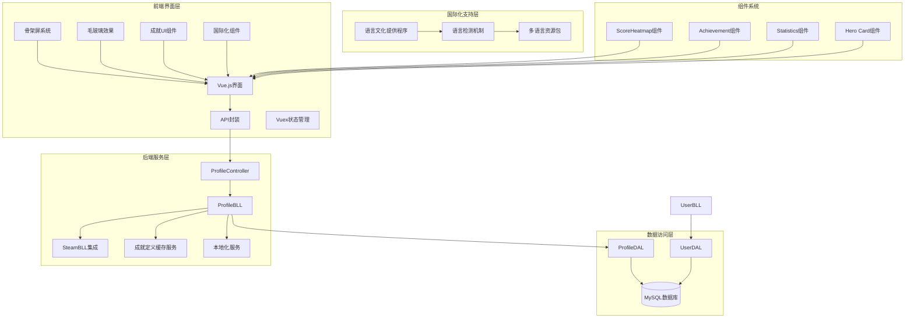

**图表来源**
- [ProfileController.cs:1-41](file://SpeedRunners.API/SpeedRunners/Controllers/ProfileController.cs#L1-L41)
- [ProfileBLL.cs:1-226](file://SpeedRunners.API/SpeedRunners.BLL/ProfileBLL.cs#L1-L226)
- [ProfileDAL.cs:1-126](file://SpeedRunners.API/SpeedRunners.DAL/ProfileDAL.cs#L1-L126)
- [AchievementSchemaService.cs:1-110](file://SpeedRunners.API/SpeedRunners.BLL/AchievementSchemaService.cs#L1-L110)
- [LocaleHeaderRequestCultureProvider.cs:1-17](file://SpeedRunners.API/SpeedRunners/Service/LocaleHeaderRequestCultureProvider.cs#L1-L17)
- [ScoreHeatmap/index.vue:1-362](file://SpeedRunners.UI/src/components/ScoreHeatmap/index.vue#L1-L362)

**章节来源**
- [ProfileController.cs:1-41](file://SpeedRunners.API/SpeedRunners/Controllers/ProfileController.cs#L1-L41)
- [ProfileBLL.cs:1-226](file://SpeedRunners.API/SpeedRunners.BLL/ProfileBLL.cs#L1-L226)
- [ProfileDAL.cs:1-126](file://SpeedRunners.API/SpeedRunners.DAL/ProfileDAL.cs#L1-L126)

## 核心组件

个人资料系统包含多个核心组件，每个组件都有明确的职责分工：

### 数据模型组件
- **MProfileData**: 个人主页数据模型，包含玩家基本信息、游戏统计数据和头像信息
- **MAchievement**: 游戏成就模型，定义成就的显示属性和解锁状态，支持动态图标URL
- **MAchievementSchema**: Steam游戏成就定义，包含已解锁和未解锁状态的图标URL
- **MSteamAchievement**: Steam玩家成就，包含解锁状态和解锁时间信息
- **MDailyScore**: 每日天梯分记录模型，用于热度图展示

### 业务逻辑组件
- **ProfileBLL**: 个人资料业务逻辑处理，包含数据聚合、隐私检查、Steam API集成和本地化支持
- **AchievementSchemaService**: 成就定义缓存服务，管理Steam成就定义的缓存和刷新
- **UserBLL**: 用户相关业务逻辑，处理登录认证、隐私设置管理和本地化错误消息
- **Localizer**: 本地化服务，提供多语言文本支持和文化环境管理

### 数据访问组件
- **ProfileDAL**: 个人资料数据访问层，负责数据库查询和操作
- **UserDAL**: 用户数据访问层，处理用户信息和令牌管理

### 前端组件系统
- **骨架屏组件**: 四部分独立骨架屏，包括英雄卡片、统计数据、成就卡片、天梯热力图
- **毛玻璃卡片**: 统一的毛玻璃效果卡片组件
- **响应式布局**: 基于Vuetify的响应式网格系统
- **国际化组件**: 支持22种语言的界面文本和格式化

**章节来源**
- [MProfileData.cs:1-67](file://SpeedRunners.API/SpeedRunners.Model/Profile/MProfileData.cs#L1-L67)
- [MAchievement.cs:1-50](file://SpeedRunners.API/SpeedRunners.Model/Profile/MAchievement.cs#L1-L50)
- [MAchievementSchema.cs:1-40](file://SpeedRunners.API/SpeedRunners.Model/Steam/MAchievementSchema.cs#L1-L40)
- [MSteamAchievement.cs:1-15](file://SpeedRunners.API/SpeedRunners.Model/Steam/MSteamAchievement.cs#L1-L15)
- [MDailyScore.cs:1-21](file://SpeedRunners.API/SpeedRunners.Model/Profile/MDailyScore.cs#L1-L21)
- [ProfileBLL.cs:1-226](file://SpeedRunners.API/SpeedRunners.BLL/ProfileBLL.cs#L1-L226)
- [AchievementSchemaService.cs:1-110](file://SpeedRunners.API/SpeedRunners.BLL/AchievementSchemaService.cs#L1-L110)
- [UserBLL.cs:1-153](file://SpeedRunners.API/SpeedRunners.BLL/UserBLL.cs#L1-L153)

## 架构概览

个人资料系统采用经典的三层架构模式，实现了清晰的职责分离和良好的可维护性：

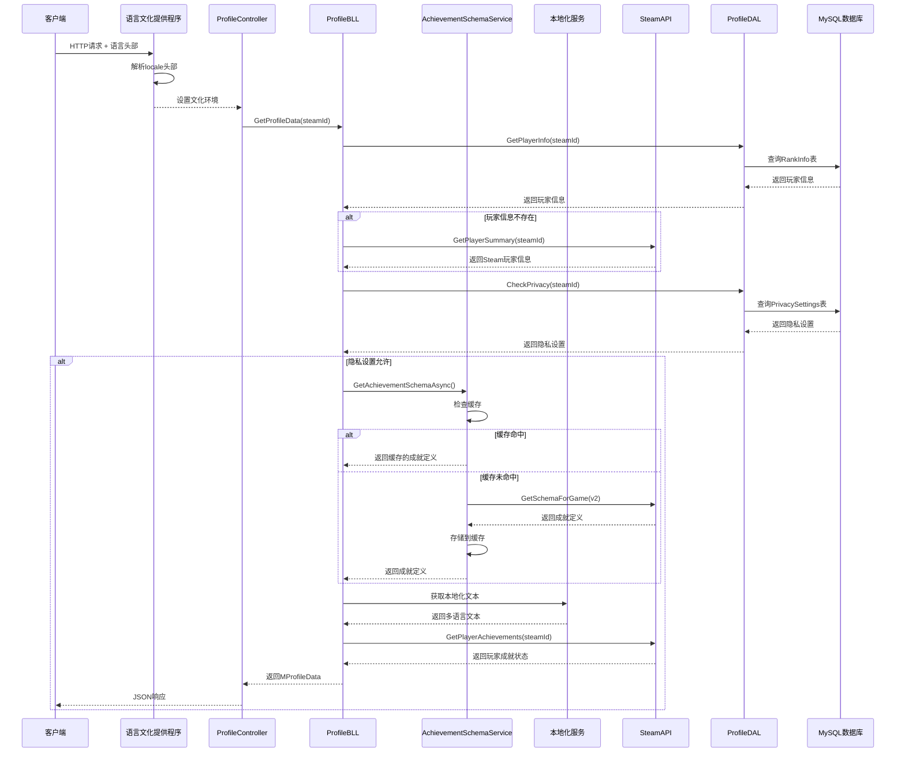

**图表来源**
- [ProfileController.cs:19-38](file://SpeedRunners.API/SpeedRunners/Controllers/ProfileController.cs#L19-L38)
- [ProfileBLL.cs:114-168](file://SpeedRunners.API/SpeedRunners.BLL/ProfileBLL.cs#L114-L168)
- [AchievementSchemaService.cs:34-49](file://SpeedRunners.API/SpeedRunners.BLL/AchievementSchemaService.cs#L34-L49)
- [ProfileDAL.cs:17-58](file://SpeedRunners.API/SpeedRunners.DAL/ProfileDAL.cs#L17-L58)
- [LocaleHeaderRequestCultureProvider.cs:9-14](file://SpeedRunners.API/SpeedRunners/Service/LocaleHeaderRequestCultureProvider.cs#L9-L14)

系统架构特点：
- **分层清晰**: 控制器层、业务逻辑层、数据访问层职责明确
- **接口隔离**: 每个层次通过明确定义的接口进行通信
- **数据持久化**: 使用MySQL数据库存储玩家信息和统计数据
- **API集成**: 与Steam Web API集成获取玩家游戏状态
- **缓存策略**: 成就定义使用内存缓存避免频繁API调用
- **国际化支持**: 完整的多语言本地化系统，支持22种语言

**章节来源**
- [ProfileController.cs:1-41](file://SpeedRunners.API/SpeedRunners/Controllers/ProfileController.cs#L1-L41)
- [ProfileBLL.cs:1-226](file://SpeedRunners.API/SpeedRunners.BLL/ProfileBLL.cs#L1-L226)
- [ProfileDAL.cs:1-126](file://SpeedRunners.API/SpeedRunners.DAL/ProfileDAL.cs#L1-L126)

## 详细组件分析

### ProfileController - 控制器层

ProfileController作为个人资料系统的入口点，提供了三个核心API接口：

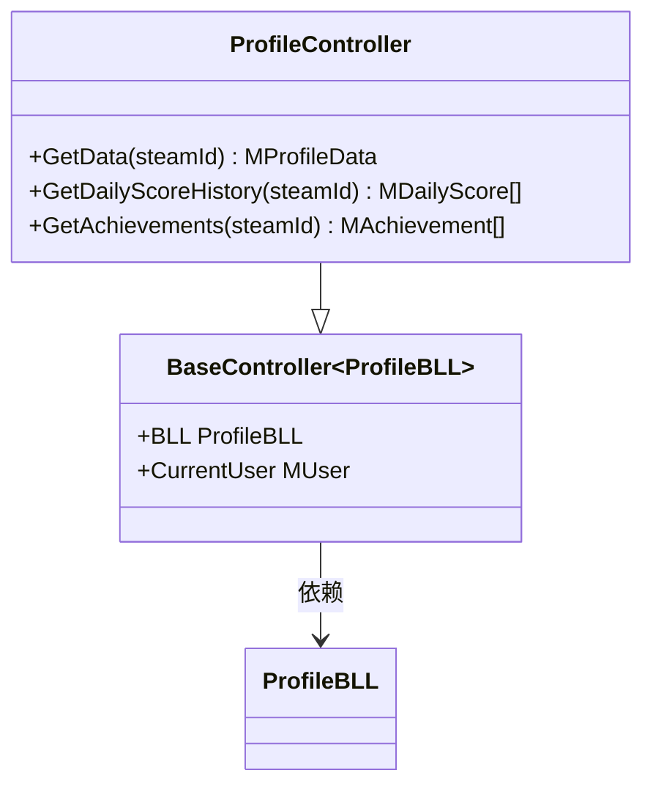

**图表来源**
- [ProfileController.cs:14-39](file://SpeedRunners.API/SpeedRunners/Controllers/ProfileController.cs#L14-L39)

控制器的主要职责：
- **数据获取**: 提供个人主页数据、每日分数历史和成就信息的API接口
- **参数验证**: 验证Steam ID参数的有效性
- **响应格式**: 统一返回JSON格式的API响应

**章节来源**
- [ProfileController.cs:1-41](file://SpeedRunners.API/SpeedRunners/Controllers/ProfileController.cs#L1-L41)

### ProfileBLL - 业务逻辑层

ProfileBLL是个人资料系统的核心业务逻辑处理单元，实现了复杂的数据聚合、隐私控制和本地化逻辑：

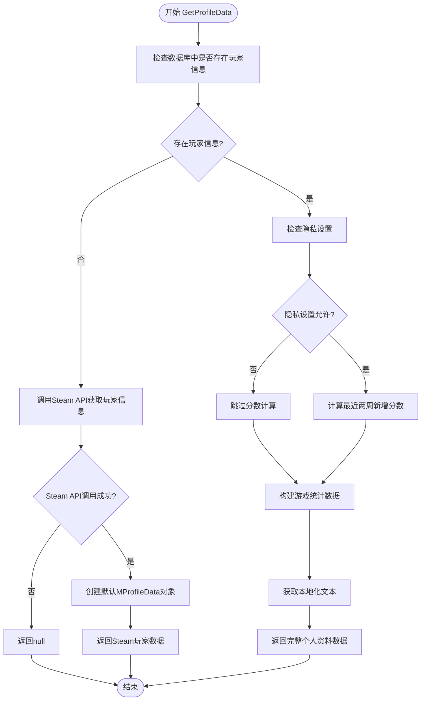

**图表来源**
- [ProfileBLL.cs:24-93](file://SpeedRunners.API/SpeedRunners.BLL/ProfileBLL.cs#L24-L93)

业务逻辑特点：
- **双重数据源**: 支持本地数据库和Steam API两种数据源
- **隐私控制**: 严格遵守用户的隐私设置，保护敏感数据
- **数据转换**: 将底层数据转换为前端友好的格式
- **异常处理**: 对Steam API调用失败进行优雅降级
- **本地化支持**: 集成多语言文本获取和文化环境管理

**章节来源**
- [ProfileBLL.cs:1-226](file://SpeedRunners.API/SpeedRunners.BLL/ProfileBLL.cs#L1-L226)

### ProfileDAL - 数据访问层

ProfileDAL负责与MySQL数据库的直接交互，实现了高效的查询和数据操作：

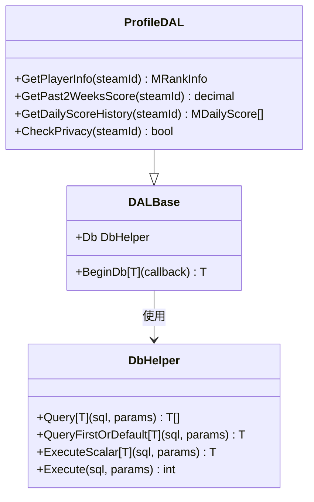

**图表来源**
- [ProfileDAL.cs:10-124](file://SpeedRunners.API/SpeedRunners.DAL/ProfileDAL.cs#L10-L124)

数据访问特点：
- **SQL优化**: 使用复杂的SQL查询计算最近两周的分数增量
- **数据分组**: 对每日分数进行分组计算，生成热度图数据
- **隐私查询**: 通过LEFT JOIN查询隐私设置，确保数据完整性

**章节来源**
- [ProfileDAL.cs:1-126](file://SpeedRunners.API/SpeedRunners.DAL/ProfileDAL.cs#L1-L126)

### 前端界面组件

前端使用Vue.js框架构建了丰富的用户界面，实现了响应式的个人资料展示和国际化支持：

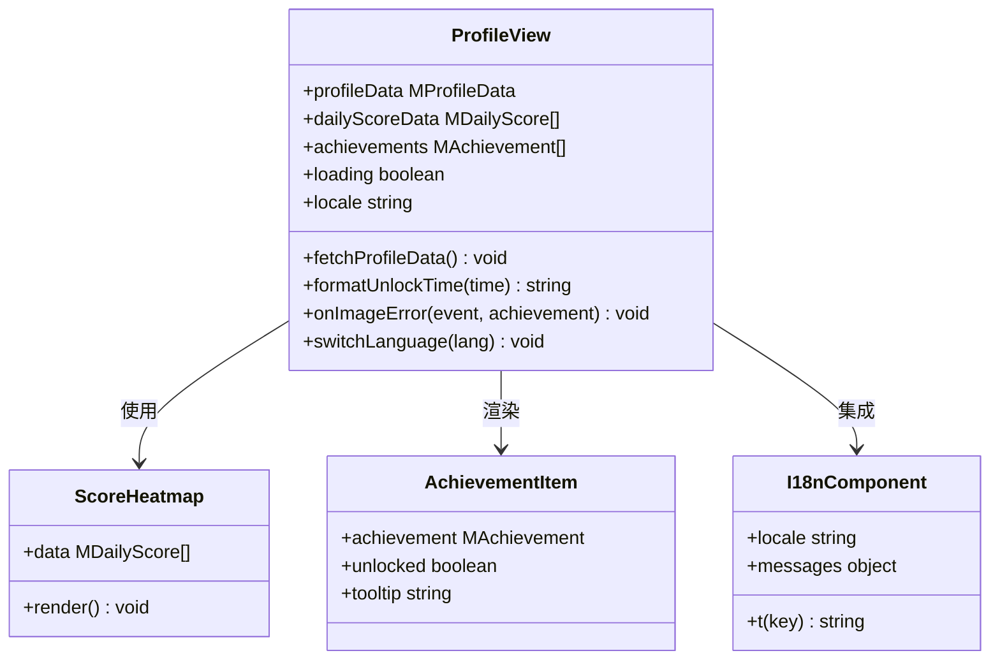

**图表来源**
- [profile/index.vue:219-444](file://SpeedRunners.UI/src/views/profile/index.vue#L219-L444)
- [index.js:1-110](file://SpeedRunners.UI/src/i18n/index.js#L1-L110)

前端界面特点：
- **响应式设计**: 支持桌面和移动设备的自适应布局
- **实时数据**: 使用Promise.all并发加载多个API数据
- **交互体验**: 提供成就解锁时间格式化和状态指示
- **国际化支持**: 支持22种语言的界面切换和文本显示
- **错误处理**: 实现图片加载失败的回退机制

**章节来源**
- [profile/index.vue:1-803](file://SpeedRunners.UI/src/views/profile/index.vue#L1-L803)
- [profile.js:1-26](file://SpeedRunners.UI/src/api/profile.js#L1-L26)

## 国际化系统设计

**更新** 个人资料系统完成了完整的国际化设计，支持22种语言的本地化功能。

### 国际化架构设计

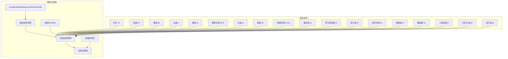

**图表来源**
- [LocaleHeaderRequestCultureProvider.cs:1-17](file://SpeedRunners.API/SpeedRunners/Service/LocaleHeaderRequestCultureProvider.cs#L1-L17)
- [index.js:1-110](file://SpeedRunners.UI/src/i18n/index.js#L1-L110)
- [ProfileBLL.cs.resx:61-115](file://SpeedRunners.API/SpeedRunners.BLL/Resources/ProfileBLL.cs.resx#L61-L115)

### 支持的语言列表

系统目前支持以下22种语言：

| 语言代码 | 语言名称 | 语言代码 | 语言名称 |
|---------|---------|---------|---------|
| zh | 中文 | en | 英语 |
| de | 德语 | fr | 法语 |
| ru | 俄语 | pt-br | 葡萄牙语(巴西) |
| ja | 日语 | ko | 韩语 |
| es-es | 西班牙语(西班牙) | cs | 捷克语 |
| ro | 罗马尼亚语 | nl | 荷兰语 |
| hu | 匈牙利语 | el | 希腊语 |
| no | 挪威语 | tr | 土耳其语 |
| uk | 乌克兰语 | pl | 波兰语 |

**章节来源**
- [index.js:25-68](file://SpeedRunners.UI/src/i18n/index.js#L25-L68)

## 语言检测与切换机制

**更新** 实现了智能的语言检测和切换机制，支持浏览器语言自动识别和用户手动切换。

### 语言检测流程

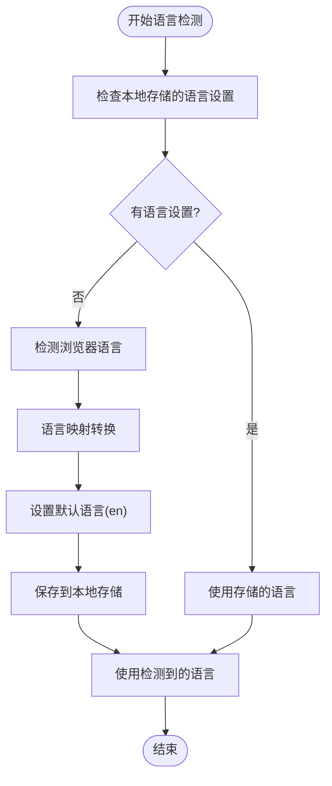

**图表来源**
- [index.js:70-78](file://SpeedRunners.UI/src/i18n/index.js#L70-L78)

### 语言映射机制

系统支持多种浏览器语言代码的映射：

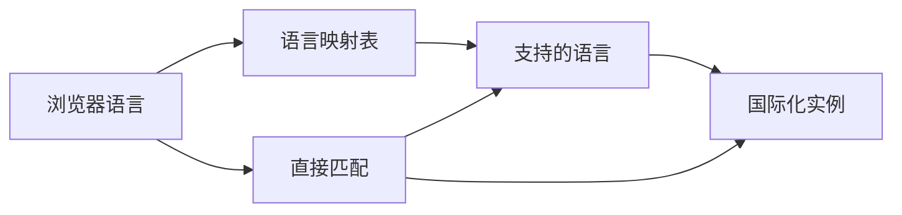

**图表来源**
- [index.js:25-68](file://SpeedRunners.UI/src/i18n/index.js#L25-L68)

语言映射示例：
- 中文系列：`zh`, `zh-cn`, `zh-tw`, `zh-hk` → `zh`
- 英语系列：`en`, `en-us`, `en-gb` → `en`
- 德语系列：`de`, `de-de`, `de-at` → `de`
- 西班牙语系列：`es`, `es-es` → `es-es`
- 葡萄牙语系列：`pt`, `pt-br` → `pt-br`
- 韩语系列：`ko`, `ko-kr` → `ko`
- 荷兰语系列：`nl`, `nl-nl` → `nl`
- 挪威语系列：`no`, `nb`, `nn` → `no`
- 乌克兰语系列：`uk`, `uk-ua` → `uk`
- 波兰语系列：`pl`, `pl-pl` → `pl`

**章节来源**
- [index.js:25-68](file://SpeedRunners.UI/src/i18n/index.js#L25-L68)

## 多语言资源管理

**更新** 实现了完整的多语言资源管理系统，包含后端和前端的本地化资源。

### 后端本地化资源

后端使用RESX文件管理多语言资源，包含个人资料、用户管理等核心功能的本地化文本：

#### ProfileBLL本地化资源
包含个人资料页面的各种文本：
- 排名相关：`rank`, `rankCount`, `totalPlaytime`, `recentPlaytime`
- 游戏统计：`score`, `hours`
- 成就相关：`hiddenAchievement`
- 段位名称：`rank_entry`, `rank_beginner`, `rank_advanced`, `rank_expert`, `rank_bronze`, `rank_silver`, `rank_gold`, `rank_platinum`, `rank_diamond`, `rank_kos`, `rank_unknown`

#### UserBLL本地化资源
包含用户管理相关的错误消息：
- 登录相关：`login_timeout`, `login_fail`
- 登出相关：`logout_already`
- 权限相关：`permission_error`, `low_permission`

**章节来源**
- [ProfileBLL.cs.resx:61-115](file://SpeedRunners.API/SpeedRunners.BLL/Resources/ProfileBLL.cs.resx#L61-L115)
- [UserBLL.cs.resx:61-76](file://SpeedRunners.API/SpeedRunners.BLL/Resources/UserBLL.cs.resx#L61-L76)

### 前端本地化资源

前端使用JSON文件管理多语言资源，包含完整的界面文本：

#### 核心界面文本
- 页面标题：`profile.pageTitle`, `profile.pageTitleDefault`
- 导航菜单：`routes.profile`, `routes.searchplayer`
- 统计数据：`profile.scoreHeatmap`, `profile.recentScore`, `profile.totalAdded`
- 成就系统：`profile.achievements`, `profile.noAchievements`, `profile.unlocked`
- 在线状态：`profile.online`, `profile.offline`, `profile.playingSR`
- 时间格式：`profile.unlockTime`, `profile.heatmapDate`

#### 成就活动分类
- 活动类型：`profile.activity.scoreChange`, `profile.activity.rankUp`, `profile.activity.achievement`, `profile.activity.gameSession`, `profile.activity.other`

#### 排行榜本地化
- 段位名称：`rank.diamond`, `rank.platinum`, `rank.gold`, `rank.silver`, `rank.bronze`, `rank.expert`, `rank.advanced`, `rank.beginner`, `rank.entry`
- 字段名称：`rank.personaName`, `rank.tier`, `rank.score`, `rank.playTime`, `rank.past2weeks`

**章节来源**
- [zh.json:249-287](file://SpeedRunners.UI/src/i18n/lang/zh.json#L249-L287)
- [en.json:249-287](file://SpeedRunners.UI/src/i18n/lang/en.json#L249-L287)

## 前端国际化实现

**更新** 前端实现了完整的VueI18n国际化框架，支持22种语言的界面切换。

### VueI18n配置

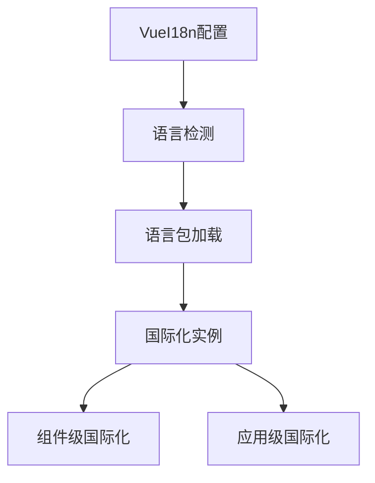

**图表来源**
- [index.js:81-108](file://SpeedRunners.UI/src/i18n/index.js#L81-L108)

前端国际化特点：
- **自动检测**: 基于浏览器语言和用户偏好自动选择语言
- **本地存储**: 记住用户选择的语言设置
- **组件支持**: 支持在Vue组件中使用`$t()`函数进行文本翻译
- **格式化支持**: 支持参数化文本和日期时间格式化

### 语言切换机制

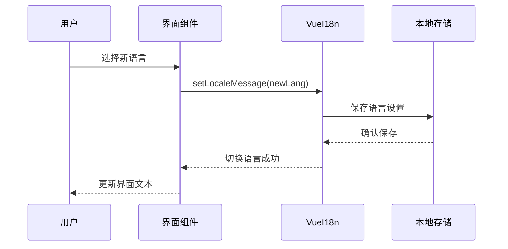

**图表来源**
- [index.js:72-78](file://SpeedRunners.UI/src/i18n/index.js#L72-L78)

**章节来源**
- [index.js:1-110](file://SpeedRunners.UI/src/i18n/index.js#L1-L110)

## 后端本地化支持

**更新** 后端实现了完整的文化环境提供程序，支持通过HTTP头部指定语言。

### 文化提供程序

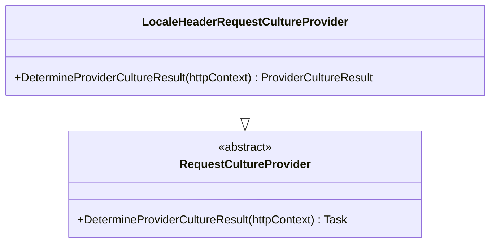

**图表来源**
- [LocaleHeaderRequestCultureProvider.cs:7-15](file://SpeedRunners.API/SpeedRunners/Service/LocaleHeaderRequestCultureProvider.cs#L7-L15)

文化提供程序实现：
- **HTTP头部解析**: 从`locale`请求头中提取语言代码
- **语言映射**: 将特定语言映射到标准语言代码
- **默认处理**: 不支持的语言默认使用英语

### 本地化服务集成

后端本地化服务集成到ProfileBLL中：

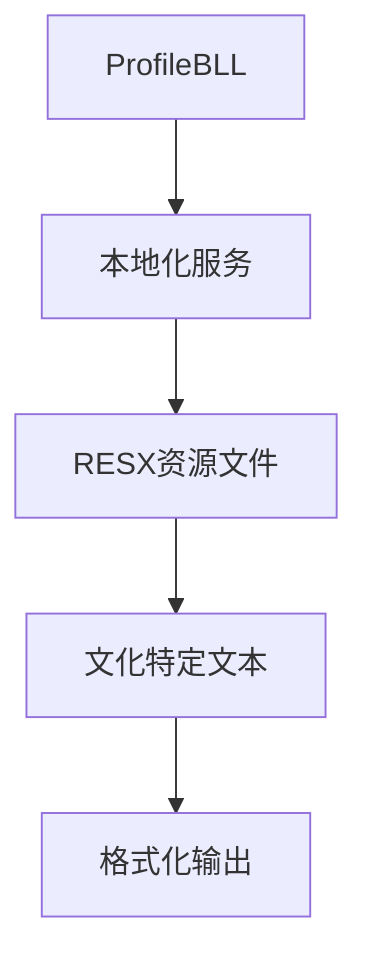

**图表来源**
- [ProfileBLL.cs:1-226](file://SpeedRunners.API/SpeedRunners.BLL/ProfileBLL.cs#L1-L226)

**章节来源**
- [LocaleHeaderRequestCultureProvider.cs:1-17](file://SpeedRunners.API/SpeedRunners/Service/LocaleHeaderRequestCultureProvider.cs#L1-L17)
- [ProfileBLL.cs:1-226](file://SpeedRunners.API/SpeedRunners.BLL/ProfileBLL.cs#L1-L226)

## 成绩系统重构

**更新** 个人资料系统完成了重大重构，成就系统完全重设计，采用动态图像加载替代传统的Material Design图标。

### 成就系统架构设计

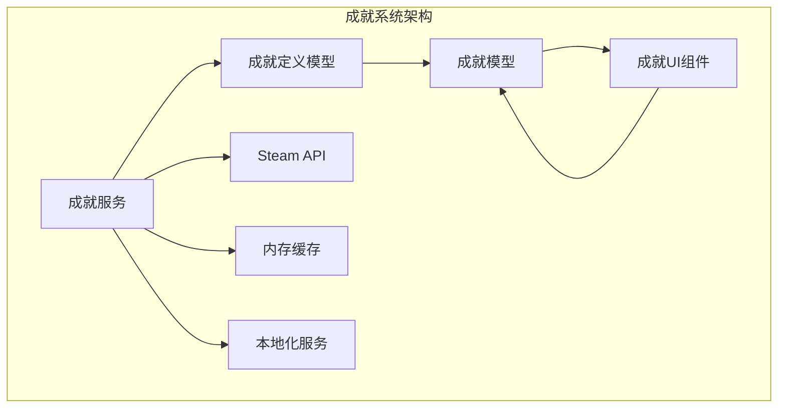

**图表来源**
- [MAchievement.cs:25-33](file://SpeedRunners.API/SpeedRunners.Model/Profile/MAchievement.cs#L25-L33)
- [MAchievementSchema.cs:25-33](file://SpeedRunners.API/SpeedRunners.Model/Steam/MAchievementSchema.cs#L25-L33)
- [profile/index.vue:201-206](file://SpeedRunners.UI/src/views/profile/index.vue#L201-L206)

### 成就数据模型重构

#### MAchievement模型更新
- **IconUrl**: 已解锁成就的彩色图标URL
- **IconGrayUrl**: 未解锁成就的灰色图标URL
- **Unlocked**: 成就解锁状态标识
- **UnlockedAt**: 成就解锁时间戳

#### MAchievementSchema模型更新
- **Icon**: Steam API返回的已解锁图标URL
- **IconGray**: Steam API返回的未解锁图标URL
- **DisplayName**: 成就显示名称（支持多语言）
- **Description**: 成就描述信息（支持多语言）
- **Hidden**: 是否为隐藏成就

**章节来源**
- [MAchievement.cs:1-50](file://SpeedRunners.API/SpeedRunners.Model/Profile/MAchievement.cs#L1-L50)
- [MAchievementSchema.cs:1-40](file://SpeedRunners.API/SpeedRunners.Model/Steam/MAchievementSchema.cs#L1-L40)

### 前端成就渲染机制

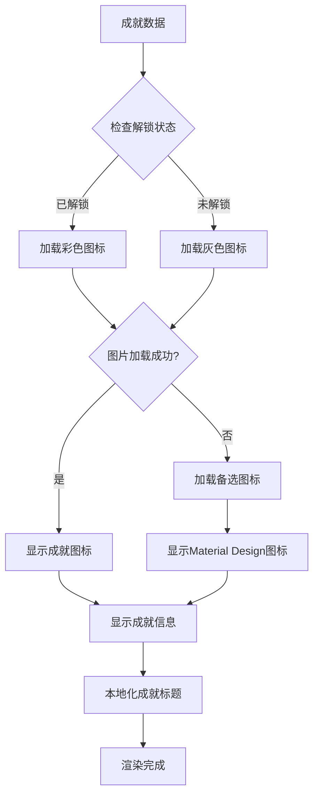

**图表来源**
- [profile/index.vue:201-206](file://SpeedRunners.UI/src/views/profile/index.vue#L201-L206)
- [profile/index.vue:398-410](file://SpeedRunners.UI/src/views/profile/index.vue#L398-L410)

前端实现特点：
- **条件渲染**: 根据成就解锁状态动态选择图标URL
- **错误处理**: 实现图片加载失败的回退机制
- **用户体验**: 提供详细的成就信息和解锁时间显示
- **国际化支持**: 成就标题和描述支持多语言显示

**章节来源**
- [profile/index.vue:187-217](file://SpeedRunners.UI/src/views/profile/index.vue#L187-L217)
- [profile/index.vue:398-410](file://SpeedRunners.UI/src/views/profile/index.vue#L398-L410)

## 动态图像加载机制

**更新** 成功实现动态图像加载机制，替代传统的Material Design图标系统。

### 图像加载策略

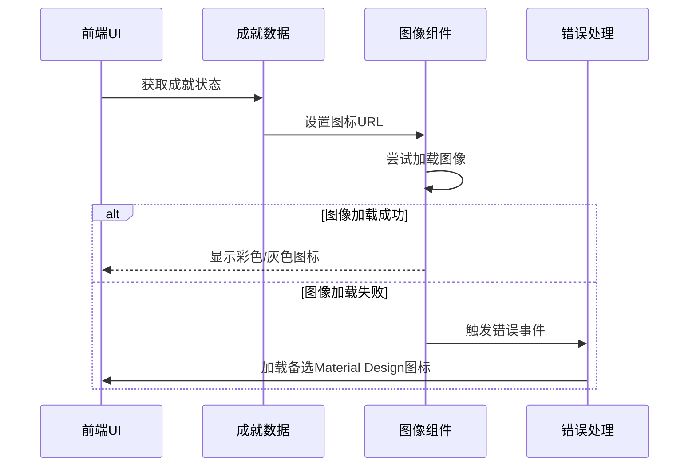

**图表来源**
- [profile/index.vue:201-206](file://SpeedRunners.UI/src/views/profile/index.vue#L201-L206)
- [profile/index.vue:398-410](file://SpeedRunners.UI/src/views/profile/index.vue#L398-L410)

### 图像加载优化

#### 前端优化策略
- **条件加载**: 仅在需要时加载对应状态的图标
- **错误回退**: 图像加载失败时自动切换到备选图标
- **性能监控**: 监控图像加载状态，提供用户反馈

#### 后端数据准备
- **双URL支持**: 同时提供已解锁和未解锁状态的图标URL
- **Steam API集成**: 直接从Steam API获取官方图标资源
- **数据转换**: 将Steam API数据转换为前端友好的格式

**章节来源**
- [ProfileBLL.cs:125-137](file://SpeedRunners.API/SpeedRunners.BLL/ProfileBLL.cs#L125-L137)
- [profile/index.vue:201-206](file://SpeedRunners.UI/src/views/profile/index.vue#L201-L206)

## 缓存策略设计

**更新** 新增成就定义缓存服务，避免频繁调用Steam API，提升系统性能。

### 缓存架构设计

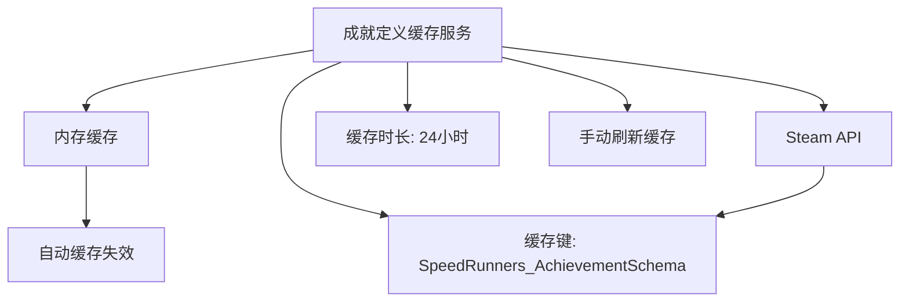

**图表来源**
- [AchievementSchemaService.cs:16-30](file://SpeedRunners.API/SpeedRunners.BLL/AchievementSchemaService.cs#L16-L30)
- [AchievementSchemaService.cs:34-49](file://SpeedRunners.API/SpeedRunners.BLL/AchievementSchemaService.cs#L34-L49)

### 缓存实现细节

#### 缓存配置
- **缓存键**: `SpeedRunners_AchievementSchema`
- **缓存时长**: 24小时（成就定义相对稳定）
- **应用ID**: 207140（SpeedRunners游戏ID）

#### 缓存流程
1. **缓存检查**: 首先检查内存缓存中是否存在成就定义
2. **缓存命中**: 如果存在，直接返回缓存数据
3. **缓存未命中**: 调用Steam API获取最新成就定义
4. **缓存存储**: 将获取的数据存储到内存缓存中
5. **缓存失效**: 24小时后自动失效，重新从Steam API获取

**章节来源**
- [AchievementSchemaService.cs:1-110](file://SpeedRunners.API/SpeedRunners.BLL/AchievementSchemaService.cs#L1-L110)

### 缓存刷新机制

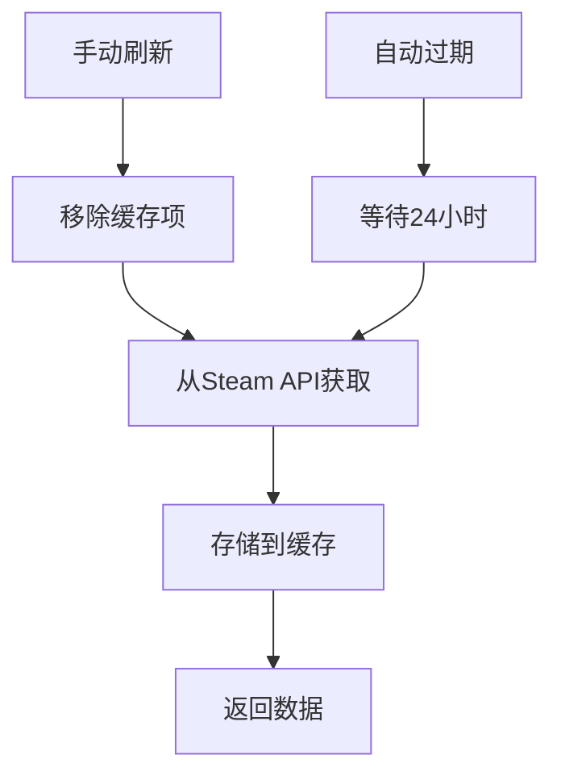

**图表来源**
- [AchievementSchemaService.cs:103-107](file://SpeedRunners.API/SpeedRunners.BLL/AchievementSchemaService.cs#L103-L107)

**章节来源**
- [AchievementSchemaService.cs:100-107](file://SpeedRunners.API/SpeedRunners.BLL/AchievementSchemaService.cs#L100-L107)

## 错误处理与回退机制

**更新** 实现了完整的错误处理和回退机制，确保系统在各种异常情况下都能正常运行。

### 错误处理架构

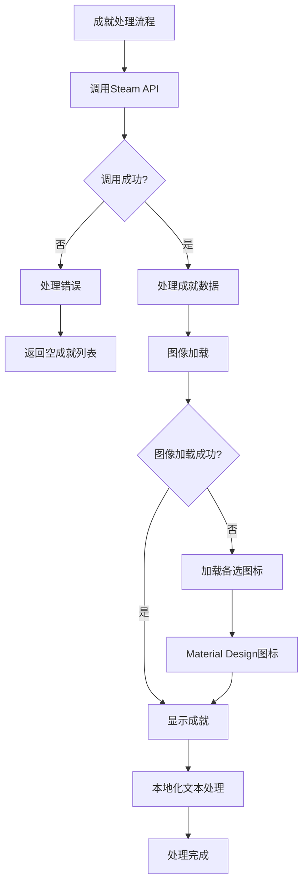

**图表来源**
- [ProfileBLL.cs:157-160](file://SpeedRunners.API/SpeedRunners.BLL/ProfileBLL.cs#L157-L160)
- [profile/index.vue:398-410](file://SpeedRunners.UI/src/views/profile/index.vue#L398-L410)

### 多层错误处理

#### 后端错误处理
- **Steam API调用异常**: 捕获异常并返回空成就列表
- **数据解析错误**: 处理JSON解析异常，确保系统稳定性
- **缓存异常**: 缓存服务异常时降级到直接调用Steam API
- **本地化异常**: 资源文件缺失时使用默认英文文本

#### 前端错误处理
- **图像加载失败**: 实现图片加载错误监听器
- **备选图标显示**: 自动切换到Material Design图标
- **用户反馈**: 提供错误状态的用户界面
- **语言切换**: 语言包加载失败时回退到默认语言

**章节来源**
- [ProfileBLL.cs:157-160](file://SpeedRunners.API/SpeedRunners.BLL/ProfileBLL.cs#L157-L160)
- [profile/index.vue:398-410](file://SpeedRunners.UI/src/views/profile/index.vue#L398-L410)

### 回退机制实现

#### 图像加载回退
- **错误监听**: 使用`@error`事件监听图片加载失败
- **DOM操作**: 动态创建Material Design图标元素
- **样式适配**: 根据成就状态设置图标颜色

#### 用户体验优化
- **渐进式增强**: 先尝试动态图像，失败时使用传统图标
- **一致性保证**: 确保所有成就都显示合适的图标
- **性能考虑**: 避免阻塞主线程，异步处理错误

**章节来源**
- [profile/index.vue:398-410](file://SpeedRunners.UI/src/views/profile/index.vue#L398-L410)

## 响应式布局设计

**更新** 系统采用了现代化的响应式布局设计，支持多种屏幕尺寸的自适应显示。

### 布局架构

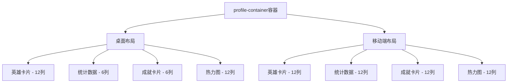

**图表来源**
- [profile/index.vue:65-231](file://SpeedRunners.UI/src/views/profile/index.vue#L65-L231)

### 响应式特性

#### 桌面端布局
- **网格系统**: 基于Vuetify的12列网格系统
- **英雄卡片**: 占满12列，展示完整玩家信息
- **侧边栏**: 统计数据和成就卡片各占6列
- **热力图**: 独占12列，全宽显示

#### 移动端适配
- **单列布局**: 所有内容垂直排列
- **网格调整**: 成就网格调整为5列布局
- **字体缩放**: 关键数据字体在小屏设备上缩小
- **间距优化**: 适当增加间距以改善触摸体验

**章节来源**
- [profile/index.vue:778-803](file://SpeedRunners.UI/src/views/profile/index.vue#L778-L803)

## 毛玻璃效果实现

**更新** 系统引入了现代化的毛玻璃效果设计，提升了整体视觉质量和用户体验。

### 毛玻璃设计原理

```mermaid
graph TB
GlassCard[glass-card毛玻璃卡片] --> Background[半透明背景]
GlassCard --> Blur[背景模糊效果]
GlassCard --> Border[半透明边框]
GlassCard --> Transition[平滑过渡动画]
Background --> RGBA[RGBA颜色值]
Blur --> BackdropFilter[backdrop-filter: blur(16px)]
Border --> BorderColor[border-color: rgba(255,255,255,0.08)]
Transition --> HoverEffect[悬停效果]
```

**图表来源**
- [profile/index.vue:462-474](file://SpeedRunners.UI/src/views/profile/index.vue#L462-L474)

### 毛玻璃样式实现

#### 基础样式
- **背景透明度**: `background: rgba(18, 18, 28, 0.88)`
- **模糊效果**: `backdrop-filter: blur(16px)`
- **边框透明**: `border: 1px solid rgba(255, 255, 255, 0.08)`
- **圆角设计**: `border-radius: 6px`

#### 交互效果
- **悬停增强**: `border-color: rgba(255, 255, 255, 0.14)`
- **阴影效果**: `box-shadow: 0 4px 24px rgba(0, 0, 0, 0.3)`
- **过渡动画**: `transition: border-color 0.3s ease, box-shadow 0.3s ease`

#### 暗色遮罩层
- **页面覆盖**: `.page-overlay`覆盖整个页面
- **渐变背景**: `linear-gradient(180deg, rgba(8, 8, 18, 0.35) 0%, rgba(8, 8, 18, 0.82) 100%)`
- **层级控制**: `z-index: 0`确保在内容之下

**章节来源**
- [profile/index.vue:432-474](file://SpeedRunners.UI/src/views/profile/index.vue#L432-L474)

## 依赖关系分析

个人资料系统的依赖关系体现了清晰的架构层次和模块化设计：

```mermaid
graph LR
subgraph "外部依赖"
Steam[Steam Web API]
MySQL[MySQL数据库]
Vuetify[Vuetify UI框架]
Vue[Vue.js框架]
End
subgraph "后端模块"
Controller[ProfileController]
BLL[ProfileBLL]
DAL[ProfileDAL]
Model[数据模型]
AchievementSchemaService[成就定义缓存服务]
SteamBLL[SteamBLL]
LocaleProvider[语言文化提供程序]
Localizer[本地化服务]
end
subgraph "前端模块"
Vue[Vue.js应用]
API[API封装]
Store[Vuex状态]
Skeleton[骨架屏组件]
Glass[毛玻璃组件]
Heatmap[ScoreHeatmap组件]
AchievementUI[成就UI组件]
I18n[国际化组件]
LangPacks[语言包]
end
Steam --> AchievementSchemaService
Steam --> SteamBLL
MySQL --> DAL
Controller --> BLL
BLL --> DAL
BLL --> AchievementSchemaService
BLL --> Localizer
BLL --> SteamBLL
BLL --> Model
Vue --> API
API --> Controller
Store --> Vue
Skeleton --> Vue
Glass --> Vue
Heatmap --> Vue
AchievementUI --> Vue
I18n --> Vue
LangPacks --> I18n
LocaleProvider --> Controller
Localizer --> BLL
```

**图表来源**
- [ProfileController.cs:1-41](file://SpeedRunners.API/SpeedRunners/Controllers/ProfileController.cs#L1-L41)
- [ProfileBLL.cs:1-226](file://SpeedRunners.API/SpeedRunners.BLL/ProfileBLL.cs#L1-L226)
- [ProfileDAL.cs:1-126](file://SpeedRunners.API/SpeedRunners.DAL/ProfileDAL.cs#L1-L126)
- [AchievementSchemaService.cs:1-110](file://SpeedRunners.API/SpeedRunners.BLL/AchievementSchemaService.cs#L1-L110)
- [LocaleHeaderRequestCultureProvider.cs:1-17](file://SpeedRunners.API/SpeedRunners/Service/LocaleHeaderRequestCultureProvider.cs#L1-L17)

依赖关系特点：
- **单向依赖**: 从上层到下层的清晰依赖方向
- **接口抽象**: 通过接口定义实现松耦合
- **外部集成**: 与Steam API和MySQL数据库的集成点明确
- **组件化**: 前端采用组件化设计，提高代码复用性
- **缓存集成**: 成就定义缓存服务独立于主业务逻辑
- **国际化集成**: 前后端完整的国际化支持体系

**章节来源**
- [ProfileController.cs:1-41](file://SpeedRunners.API/SpeedRunners/Controllers/ProfileController.cs#L1-L41)
- [ProfileBLL.cs:1-226](file://SpeedRunners.API/SpeedRunners.BLL/ProfileBLL.cs#L1-L226)
- [ProfileDAL.cs:1-126](file://SpeedRunners.API/SpeedRunners.DAL/ProfileDAL.cs#L1-L126)

## 性能考虑

个人资料系统在设计时充分考虑了性能优化和用户体验：

### 数据缓存策略
- **并发API调用**: 前端使用Promise.all同时请求多个数据接口，减少总等待时间
- **数据库查询优化**: ProfileDAL使用预编译SQL语句和适当的索引策略
- **Steam API降级**: 当Steam API不可用时，系统自动使用本地数据
- **成就定义缓存**: 使用内存缓存避免频繁调用Steam API
- **语言包缓存**: 前端语言包按需加载，减少初始包体积

### 内存管理
- **数据模型优化**: 使用轻量级数据模型传输，避免不必要的字段传递
- **懒加载机制**: 成就列表和分数历史按需加载，减少初始页面负载
- **骨架屏优化**: 骨架屏使用轻量级HTML结构，减少DOM节点数量
- **图像缓存**: 浏览器自动缓存成就图标，减少重复加载
- **语言包优化**: 仅加载用户选择的语言包，支持动态导入

### 网络优化
- **HTTP缓存**: 合理设置HTTP缓存头，减少重复请求
- **错误重试**: 对临时网络错误实现智能重试机制
- **骨架屏过渡**: 骨架屏到真实内容的平滑过渡动画
- **CDN支持**: 成就图标可通过CDN加速加载
- **语言包CDN**: 语言包文件支持CDN分发

### 视觉性能
- **毛玻璃渲染**: 使用CSS backdrop-filter，现代浏览器支持良好
- **响应式图片**: 头像使用合适的尺寸，避免过度加载
- **滚动优化**: 热力图容器使用硬件加速滚动
- **图像懒加载**: 成就图标在进入视口时才开始加载
- **国际化性能**: 语言切换时只更新相关组件，避免全页面刷新

## 故障排除指南

### 常见问题及解决方案

**1. Steam API连接超时**
- 检查Steam Web API的可用性和限流设置
- 实现重试机制和超时处理
- 提供本地降级数据

**2. 数据库连接问题**
- 验证MySQL连接字符串和凭据
- 检查数据库服务器状态
- 实现连接池管理和自动重连

**3. 隐私设置冲突**
- 确保PrivacySettings表的默认值正确初始化
- 检查用户权限和数据访问控制
- 提供隐私设置的用户界面

**4. 成就图标加载失败**
- 检查Steam API返回的图标URL有效性
- 验证CDN或服务器的可访问性
- 确认浏览器对跨域请求的支持

**5. 缓存数据过期**
- 检查内存缓存配置和时长设置
- 验证缓存键的唯一性和一致性
- 实现缓存刷新机制

**6. 毛玻璃效果不生效**
- 检查浏览器对backdrop-filter的支持
- 验证CSS属性拼写和语法
- 确认z-index层级设置

**7. 前端数据加载失败**
- 检查API端点的可达性和响应格式
- 实现错误边界和用户友好的错误提示
- 提供数据加载状态指示器

**8. 国际化文本显示问题**
- 检查语言包文件的完整性和正确性
- 验证RESX资源文件的编码和格式
- 确认语言检测逻辑的正确性
- 检查HTTP头部locale参数的传递

**9. 语言切换失败**
- 验证语言包的加载和解析
- 检查本地存储的语言设置
- 确认VueI18n实例的正确配置
- 验证语言映射表的完整性

**章节来源**
- [ProfileBLL.cs:157-160](file://SpeedRunners.API/SpeedRunners.BLL/ProfileBLL.cs#L157-L160)
- [AchievementSchemaService.cs:94-97](file://SpeedRunners.API/SpeedRunners.BLL/AchievementSchemaService.cs#L94-L97)
- [profile/index.vue:398-410](file://SpeedRunners.UI/src/views/profile/index.vue#L398-L410)
- [LocaleHeaderRequestCultureProvider.cs:9-14](file://SpeedRunners.API/SpeedRunners/Service/LocaleHeaderRequestCultureProvider.cs#L9-L14)

## 结论

个人资料系统展现了现代Web应用开发的最佳实践，通过清晰的分层架构、完善的错误处理、优秀的用户体验设计和完整的国际化支持，为SpeedRunners游戏社区提供了强大的个人资料展示功能。

**更新** 系统的重大重构引入了四部分骨架屏系统、响应式布局设计、毛玻璃效果、动态图像加载机制、成就定义缓存服务和完整的国际化支持，显著提升了用户体验和视觉质量。

系统的主要优势包括：
- **架构清晰**: 三层架构设计便于维护和扩展
- **功能完整**: 集成Steam API、游戏统计、成就系统、隐私控制和国际化
- **用户体验**: 响应式设计、骨架屏加载、毛玻璃效果、动态图标和多语言界面
- **性能优化**: 并发数据加载、内存缓存、图像懒加载、CDN加速和语言包优化
- **现代化设计**: 现代化的UI设计、交互体验、错误处理机制和国际化支持
- **全球化支持**: 完整的22种语言本地化，支持全球用户需求

未来可以考虑的功能增强：
- 实时数据更新机制
- 更丰富的统计图表
- 社交功能集成
- 移动端原生应用支持
- 更多的个性化定制选项
- 成就分享和社交互动功能
- AI驱动的个性化推荐
- 多平台同步和跨设备体验