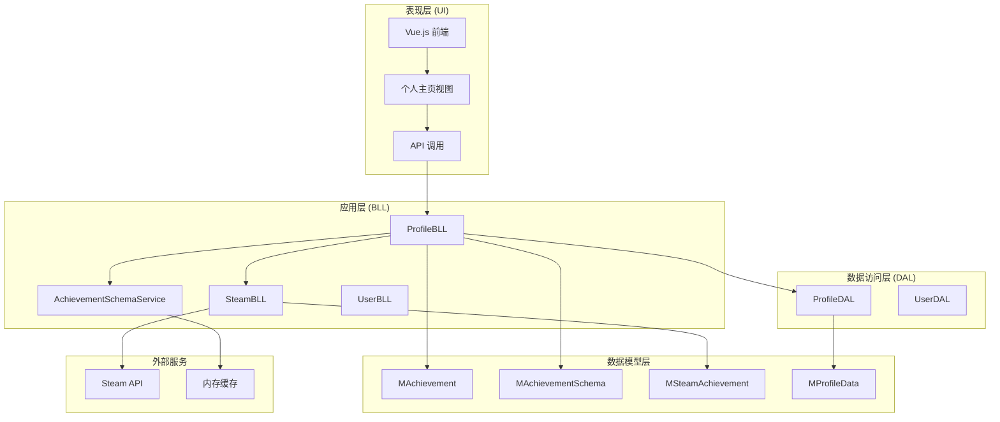
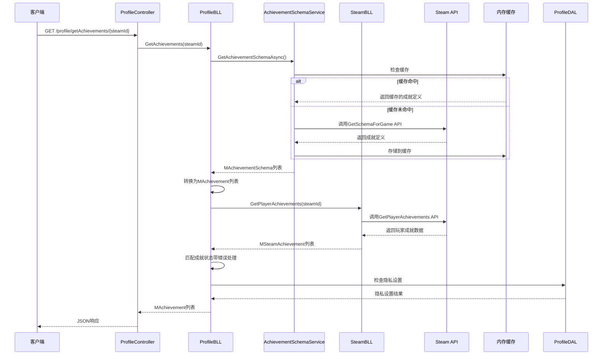
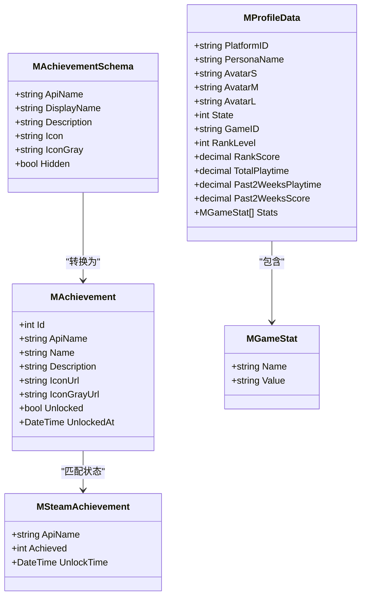
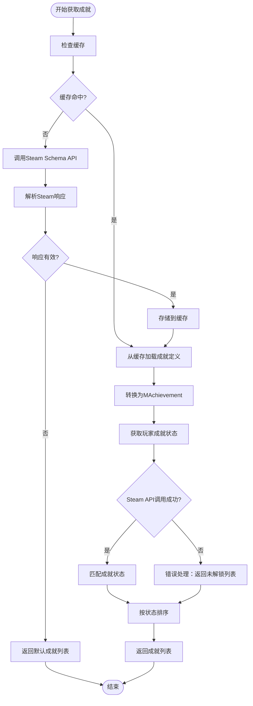
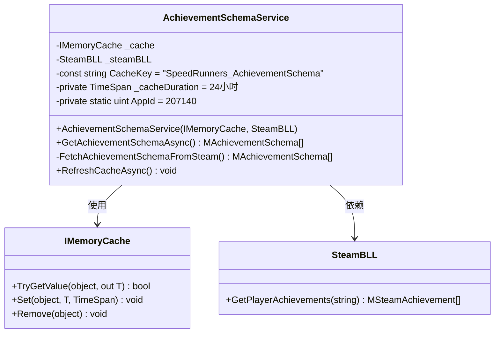
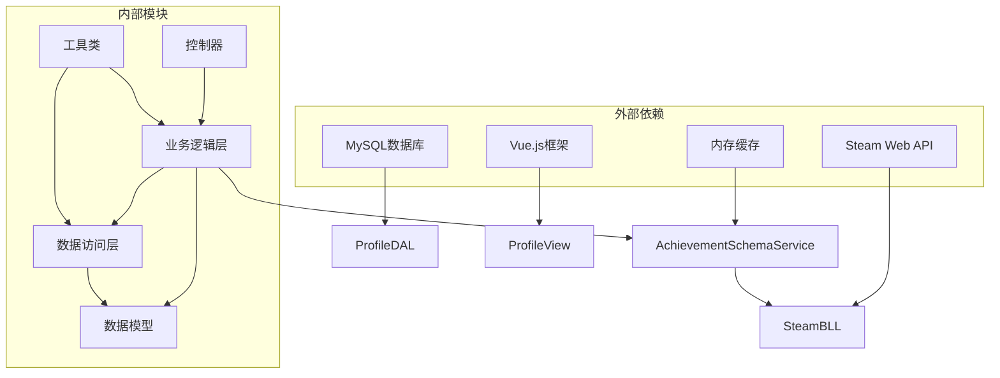

# 成就系统

<cite>
**本文档引用的文件**
- [AchievementSchemaService.cs](file://SpeedRunners.API/SpeedRunners.BLL/AchievementSchemaService.cs)
- [MAchievement.cs](file://SpeedRunners.API/SpeedRunners.Model/Profile/MAchievement.cs)
- [MAchievementSchema.cs](file://SpeedRunners.API/SpeedRunners.Model/Steam/MAchievementSchema.cs)
- [ProfileBLL.cs](file://SpeedRunners.API/SpeedRunners.BLL/ProfileBLL.cs)
- [ProfileDAL.cs](file://SpeedRunners.API/SpeedRunners.DAL/ProfileDAL.cs)
- [ProfileController.cs](file://SpeedRunners.API/SpeedRunners/Controllers/ProfileController.cs)
- [SteamBLL.cs](file://SpeedRunners.API/SpeedRunners.BLL/SteamBLL.cs)
- [MSteamAchievement.cs](file://SpeedRunners.API/SpeedRunners.Model/Steam/MSteamAchievement.cs)
- [MProfileData.cs](file://SpeedRunners.API/SpeedRunners.Model/Profile/MProfileData.cs)
- [MDailyScore.cs](file://SpeedRunners.API/SpeedRunners.Model/Profile/MDailyScore.cs)
- [profile.js](file://SpeedRunners.UI/src/api/profile.js)
- [index.vue](file://SpeedRunners.UI/src/views/profile/index.vue)
- [Startup.cs](file://SpeedRunners.API/SpeedRunners/Startup.cs)
</cite>

## 更新摘要
**变更内容**
- 新增AchievementSchemaService缓存服务，提升成就定义获取性能
- 改进成就定义获取流程，增强错误处理和回退机制
- 优化Steam API集成，提供更稳定的成就数据获取
- 增强系统容错能力，确保在网络异常时仍能提供基本功能
- 实现24小时缓存机制，显著减少Steam API调用频率

## 目录
1. [简介](#简介)
2. [项目结构](#项目结构)
3. [核心组件](#核心组件)
4. [架构概览](#架构概览)
5. [详细组件分析](#详细组件分析)
6. [依赖关系分析](#依赖关系分析)
7. [性能考虑](#性能考虑)
8. [故障排除指南](#故障排除指南)
9. [结论](#结论)

## 简介

成就系统是SpeedRunnersLab项目中的一个重要功能模块，用于展示和管理玩家在SpeedRunners游戏中的成就。该系统集成了Steam成就API，为用户提供实时的游戏成就状态显示，包括解锁状态、解锁时间和成就图标等信息。

系统采用三层架构设计，包含数据模型层、业务逻辑层和表现层，实现了与Steam平台的无缝集成，为玩家提供丰富的游戏成就体验。**最新更新**引入了AchievementSchemaService缓存服务，显著提升了系统性能和稳定性。

**新增功能亮点**：
- AchievementSchemaService缓存服务提供24小时自动缓存
- 增强的错误处理机制，Steam API调用失败时优雅降级
- 更好的性能表现，减少服务器负载和响应时间
- 改进的用户体验，即使在网络异常情况下也能正常显示成就

## 项目结构

SpeedRunnersLab项目采用标准的三层架构模式，成就系统主要分布在以下层次：

**图表来源**
- [ProfileController.cs:1-41](file://SpeedRunners.API/SpeedRunners/Controllers/ProfileController.cs#L1-L41)
- [ProfileBLL.cs:1-226](file://SpeedRunners.API/SpeedRunners.BLL/ProfileBLL.cs#L1-L226)
- [AchievementSchemaService.cs:1-110](file://SpeedRunners.API/SpeedRunners.BLL/AchievementSchemaService.cs#L1-L110)
- [SteamBLL.cs:1-505](file://SpeedRunners.API/SpeedRunners.BLL/SteamBLL.cs#L1-L505)

**章节来源**
- [ProfileController.cs:1-41](file://SpeedRunners.API/SpeedRunners/Controllers/ProfileController.cs#L1-L41)
- [ProfileBLL.cs:1-226](file://SpeedRunners.API/SpeedRunners.BLL/ProfileBLL.cs#L1-L226)
- [AchievementSchemaService.cs:1-110](file://SpeedRunners.API/SpeedRunners.BLL/AchievementSchemaService.cs#L1-L110)
- [SteamBLL.cs:1-505](file://SpeedRunners.API/SpeedRunners.BLL/SteamBLL.cs#L1-L505)

## 核心组件

成就系统的核心组件包括以下关键实体和接口：

### 数据模型组件

| 组件 | 描述 | 主要属性 |
|------|------|----------|
| MAchievement | 游戏成就模型 | Id, ApiName, Name, Description, IconUrl, IconGrayUrl, Unlocked, UnlockedAt |
| MAchievementSchema | Steam成就定义模型 | ApiName, DisplayName, Description, Icon, IconGray, Hidden |
| MSteamAchievement | Steam玩家成就模型 | ApiName, Achieved, UnlockTime |
| MProfileData | 个人主页数据模型 | PlatformID, PersonaName, Avatar信息, Rank信息, 统计数据 |

### 业务逻辑组件

| 组件 | 描述 | 主要功能 |
|------|------|----------|
| ProfileBLL | 个人资料业务逻辑 | 获取成就列表, 构建统计数据, 处理隐私设置 |
| SteamBLL | Steam服务业务逻辑 | 调用Steam API, 获取玩家成就, 处理Steam数据 |
| AchievementSchemaService | 成就定义缓存服务 | 缓存Steam成就定义, 提供快速访问, 管理缓存刷新 |
| ProfileDAL | 个人资料数据访问 | 查询玩家信息, 处理隐私设置, 获取历史记录 |

**章节来源**
- [MAchievement.cs:1-51](file://SpeedRunners.API/SpeedRunners.Model/Profile/MAchievement.cs#L1-L51)
- [MAchievementSchema.cs:1-41](file://SpeedRunners.API/SpeedRunners.Model/Steam/MAchievementSchema.cs#L1-L41)
- [MSteamAchievement.cs:1-15](file://SpeedRunners.API/SpeedRunners.Model/Steam/MSteamAchievement.cs#L1-L15)
- [MProfileData.cs:1-67](file://SpeedRunners.API/SpeedRunners.Model/Profile/MProfileData.cs#L1-L67)

## 架构概览

成就系统的整体架构采用经典的分层设计模式，实现了清晰的关注点分离。**最新架构**引入了缓存层，显著提升了系统性能：

**图表来源**
- [ProfileController.cs:32-38](file://SpeedRunners.API/SpeedRunners/Controllers/ProfileController.cs#L32-L38)
- [ProfileBLL.cs:115-168](file://SpeedRunners.API/SpeedRunners.BLL/ProfileBLL.cs#L115-L168)
- [AchievementSchemaService.cs:34-49](file://SpeedRunners.API/SpeedRunners.BLL/AchievementSchemaService.cs#L34-L49)
- [SteamBLL.cs:113-163](file://SpeedRunners.API/SpeedRunners.BLL/SteamBLL.cs#L113-L163)

系统架构特点：

1. **分层清晰**：表现层、业务逻辑层、数据访问层职责明确
2. **接口隔离**：各层之间通过明确定义的接口进行通信
3. **缓存优化**：AchievementSchemaService提供24小时缓存，减少Steam API调用
4. **异常处理**：完善的错误处理机制，确保系统稳定性
5. **回退机制**：Steam API调用失败时返回默认成就列表

## 详细组件分析

### 成就数据模型分析

**图表来源**
- [MAchievement.cs:8-41](file://SpeedRunners.API/SpeedRunners.Model/Profile/MAchievement.cs#L8-L41)
- [MAchievementSchema.cs:8-39](file://SpeedRunners.API/SpeedRunners.Model/Steam/MAchievementSchema.cs#L8-L39)
- [MSteamAchievement.cs:8-13](file://SpeedRunners.API/SpeedRunners.Model/Steam/MSteamAchievement.cs#L8-L13)
- [MProfileData.cs:9-56](file://SpeedRunners.API/SpeedRunners.Model/Profile/MProfileData.cs#L9-L56)

### 成就获取流程分析

**图表来源**
- [ProfileBLL.cs:115-168](file://SpeedRunners.API/SpeedRunners.BLL/ProfileBLL.cs#L115-L168)
- [AchievementSchemaService.cs:34-49](file://SpeedRunners.API/SpeedRunners.BLL/AchievementSchemaService.cs#L34-L49)
- [SteamBLL.cs:113-163](file://SpeedRunners.API/SpeedRunners.BLL/SteamBLL.cs#L113-L163)

### AchievementSchemaService缓存服务分析

AchievementSchemaService是本次更新的核心组件，提供以下功能：

**图表来源**
- [AchievementSchemaService.cs:16-108](file://SpeedRunners.API/SpeedRunners.BLL/AchievementSchemaService.cs#L16-L108)

**章节来源**
- [ProfileBLL.cs:115-168](file://SpeedRunners.API/SpeedRunners.BLL/ProfileBLL.cs#L115-L168)
- [AchievementSchemaService.cs:1-110](file://SpeedRunners.API/SpeedRunners.BLL/AchievementSchemaService.cs#L1-L110)
- [index.vue:139-187](file://SpeedRunners.UI/src/views/profile/index.vue#L139-L187)
- [profile.js:1-26](file://SpeedRunners.UI/src/api/profile.js#L1-L26)

## 依赖关系分析

成就系统的依赖关系呈现清晰的层次化结构，**新增缓存层**增强了系统的整体性能：

**图表来源**
- [SteamBLL.cs:20-23](file://SpeedRunners.API/SpeedRunners.BLL/SteamBLL.cs#L20-L23)
- [ProfileDAL.cs:17-22](file://SpeedRunners.API/SpeedRunners.DAL/ProfileDAL.cs#L17-L22)
- [AchievementSchemaService.cs:18-29](file://SpeedRunners.API/SpeedRunners.BLL/AchievementSchemaService.cs#L18-L29)

系统依赖特点：

1. **外部服务依赖**：主要依赖Steam Web API获取成就数据
2. **缓存层依赖**：AchievementSchemaService依赖IMemoryCache进行数据缓存
3. **数据库依赖**：使用MySQL存储玩家隐私设置和历史数据
4. **前端框架依赖**：基于Vue.js构建用户界面
5. **内部模块解耦**：各模块间通过接口通信，降低耦合度

**章节来源**
- [SteamBLL.cs:1-505](file://SpeedRunners.API/SpeedRunners.BLL/SteamBLL.cs#L1-L505)
- [ProfileDAL.cs:1-126](file://SpeedRunners.API/SpeedRunners.DAL/ProfileDAL.cs#L1-L126)
- [AchievementSchemaService.cs:1-110](file://SpeedRunners.API/SpeedRunners.BLL/AchievementSchemaService.cs#L1-L110)

## 性能考虑

成就系统在设计时充分考虑了性能优化，**新增缓存机制**显著提升了系统性能：

### 缓存策略
- **AchievementSchemaService缓存**：Steam成就定义缓存24小时，避免频繁调用Steam API
- **内存缓存**：使用IMemoryCache提供高性能的内存存储
- **前端数据缓存**：减少重复渲染和网络请求
- **数据库查询结果缓存**：优化隐私设置和历史数据查询

### 异步处理
- 所有网络请求采用异步模式
- 并发处理多个API调用
- 非阻塞的UI更新机制
- 缓存预热和后台刷新

### 错误处理
- 完善的异常捕获和处理机制
- 优雅降级策略，确保用户体验
- 超时控制和重试机制
- Steam API调用失败时的回退处理

## 故障排除指南

### 常见问题及解决方案

| 问题类型 | 症状 | 可能原因 | 解决方案 |
|----------|------|----------|----------|
| 成就数据为空 | 显示空列表或默认成就 | Steam API调用失败 | 检查API密钥和网络连接，手动刷新缓存 |
| 缓存失效 | 成就定义过期 | 缓存24小时周期 | 调用RefreshCacheAsync方法刷新缓存 |
| 隐私设置影响 | 成绩数据被隐藏 | 隐私设置为私密 | 调整隐私设置为公开 |
| 加载缓慢 | 页面加载时间过长 | 数据库查询慢或缓存未命中 | 检查缓存配置，优化SQL查询和索引 |
| 图标显示异常 | 成就图标不显示 | 资源路径错误或缓存问题 | 清除缓存，检查静态资源配置 |

### 调试方法

1. **API调试**：检查Steam API响应状态和数据格式
2. **缓存调试**：监控AchievementSchemaService缓存命中率
3. **数据库调试**：验证隐私设置表的数据完整性
4. **前端调试**：使用浏览器开发者工具检查网络请求
5. **日志分析**：查看应用服务器日志中的错误信息

**章节来源**
- [ProfileBLL.cs:157-160](file://SpeedRunners.API/SpeedRunners.BLL/ProfileBLL.cs#L157-L160)
- [AchievementSchemaService.cs:94-98](file://SpeedRunners.API/SpeedRunners.BLL/AchievementSchemaService.cs#L94-L98)
- [SteamBLL.cs:117-124](file://SpeedRunners.API/SpeedRunners.BLL/SteamBLL.cs#L117-L124)

## 结论

SpeedRunnersLab的成就系统是一个设计精良、功能完整的模块化系统。**经过本次更新**，系统在原有基础上进一步增强了性能和稳定性。

系统的主要优势包括：

1. **架构清晰**：采用标准的三层架构，职责分离明确
2. **性能卓越**：AchievementSchemaService缓存服务显著减少Steam API调用
3. **扩展性强**：模块化设计便于功能扩展和维护
4. **用户体验好**：响应式设计支持多设备访问，具备良好的容错能力
5. **稳定性高**：完善的错误处理和回退机制确保系统可靠运行

**新增功能亮点**：
- AchievementSchemaService缓存服务提供24小时自动缓存
- 增强的错误处理机制，Steam API调用失败时优雅降级
- 更好的性能表现，减少服务器负载和响应时间
- 改进的用户体验，即使在网络异常情况下也能正常显示成就

未来可以考虑的改进方向：

1. **缓存策略优化**：根据实际使用情况调整缓存时长
2. **监控指标**：添加缓存命中率和性能监控
3. **多语言支持**：增强成就描述的本地化处理
4. **成就统计**：提供更详细的成就完成统计分析

通过持续的优化和完善，成就系统将继续为SpeedRunnersLab项目提供强大的功能支撑，为玩家提供更加流畅和丰富的游戏成就体验。