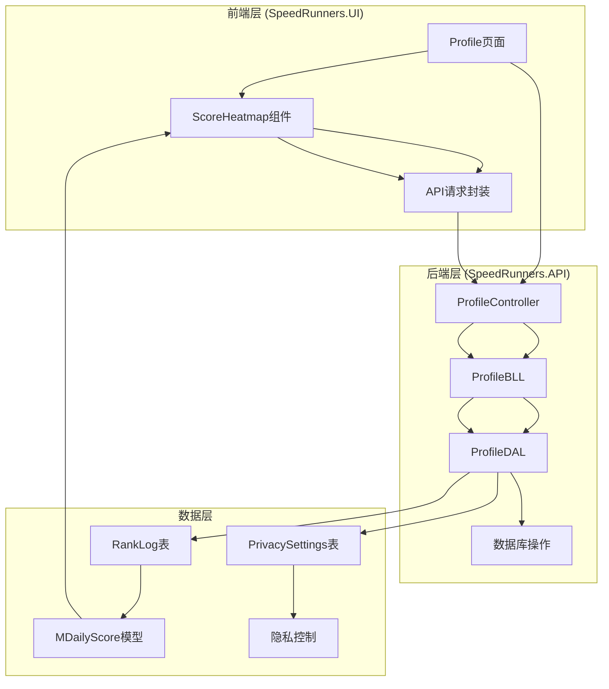
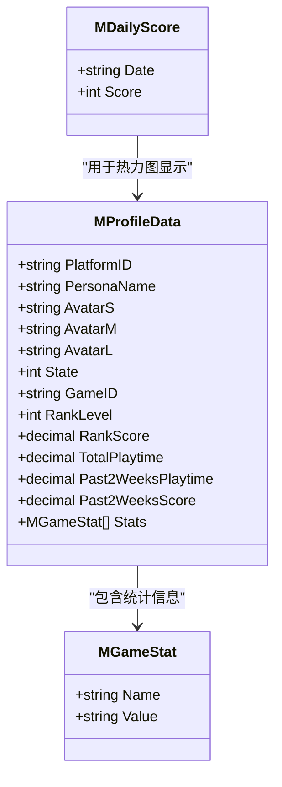
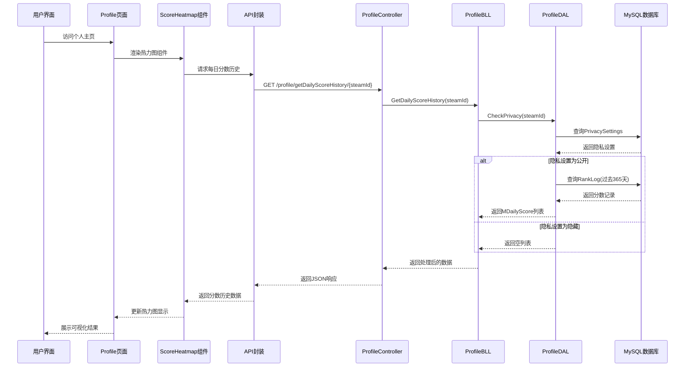
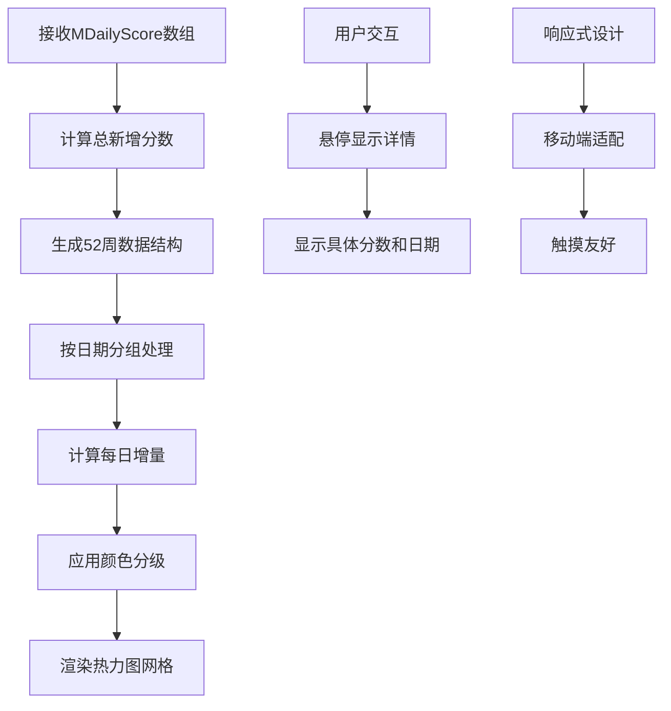
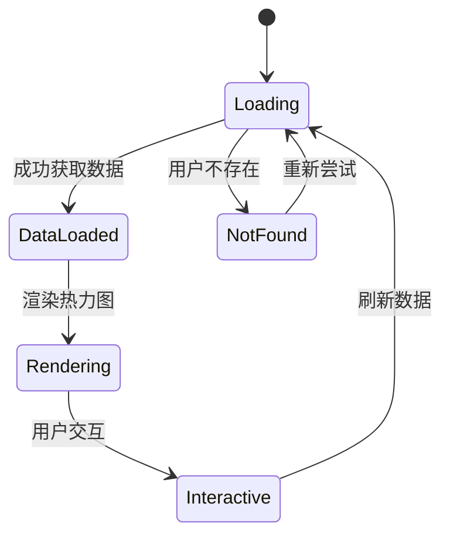
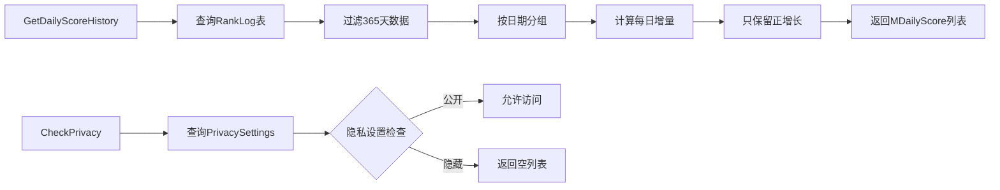
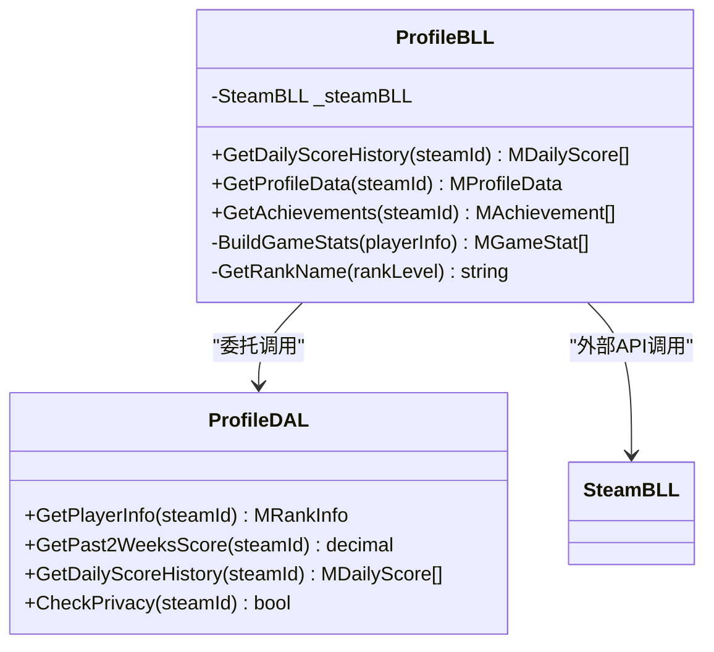
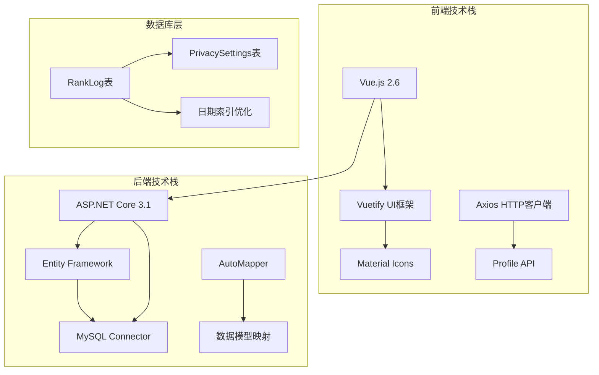

# 每日分数历史

<cite>
**本文档引用的文件**
- [MDailyScore.cs](file://SpeedRunners.API/SpeedRunners.Model/Profile/MDailyScore.cs)
- [ProfileBLL.cs](file://SpeedRunners.API/SpeedRunners.BLL/ProfileBLL.cs)
- [ProfileDAL.cs](file://SpeedRunners.API/SpeedRunners.DAL/ProfileDAL.cs)
- [ProfileController.cs](file://SpeedRunners.API/SpeedRunners.Controllers/ProfileController.cs)
- [ScoreHeatmap/index.vue](file://SpeedRunners.UI/src/components/ScoreHeatmap/index.vue)
- [profile.js](file://SpeedRunners.UI/src/api/profile.js)
- [profile/index.vue](file://SpeedRunners.UI/src/views/profile/index.vue)
- [tmdsr.sql](file://mysql-dump/tmdsr.sql)
</cite>

## 目录
1. [简介](#简介)
2. [项目结构](#项目结构)
3. [核心组件](#核心组件)
4. [架构概览](#架构概览)
5. [详细组件分析](#详细组件分析)
6. [依赖关系分析](#依赖关系分析)
7. [性能考虑](#性能考虑)
8. [故障排除指南](#故障排除指南)
9. [结论](#结论)

## 简介

"每日分数历史"功能是SpeedRunnersLab项目中的一个重要特性，它允许用户查看自己在SpeedRunners游戏中天梯分的历史变化情况。该功能通过一个直观的热力图界面展示用户在过去一年中的每日分数增长情况，帮助玩家追踪自己的进步轨迹。

该功能的核心价值在于：
- 提供可视化的分数增长趋势
- 支持隐私控制，用户可以选择公开或隐藏自己的分数历史
- 实时更新分数数据，反映最新的游戏表现
- 增强用户粘性和参与度

## 项目结构

SpeedRunnersLab采用经典的三层架构设计，"每日分数历史"功能涉及前后端的完整数据流：

**图表来源**
- [profile/index.vue](file://SpeedRunners.UI/src/views/profile/index.vue#L1-L760)
- [ScoreHeatmap/index.vue](file://SpeedRunners.UI/src/components/ScoreHeatmap/index.vue#L1-L362)
- [ProfileController.cs](file://SpeedRunners.API/SpeedRunners.Controllers/ProfileController.cs#L1-L41)

**章节来源**
- [profile/index.vue](file://SpeedRunners.UI/src/views/profile/index.vue#L1-L760)
- [ScoreHeatmap/index.vue](file://SpeedRunners.UI/src/components/ScoreHeatmap/index.vue#L1-L362)
- [ProfileController.cs](file://SpeedRunners.API/SpeedRunners.Controllers/ProfileController.cs#L1-L41)

## 核心组件

### 数据模型

每日分数历史功能的核心数据模型是一个简单的结构，包含日期和对应的分数增量：

**图表来源**
- [MDailyScore.cs](file://SpeedRunners.API/SpeedRunners.Model/Profile/MDailyScore.cs#L1-L21)
- [MProfileData.cs](file://SpeedRunners.API/SpeedRunners.Model/Profile/MProfileData.cs#L1-L67)

### 数据库结构

系统使用MySQL数据库存储分数历史数据，主要涉及以下表结构：

| 表名 | 字段 | 类型 | 描述 |
|------|------|------|------|
| RankLog | NO | int | 主键标识 |
| RankLog | PlatformID | varchar(50) | 平台ID(SteamID64) |
| RankLog | RankScore | decimal(18,3) | 天梯分数值 |
| RankLog | Date | datetime | 记录时间戳 |
| PrivacySettings | PlatformID | varchar(50) | 平台ID |
| PrivacySettings | ShowAddScore | int | 是否公开新增分数 |

**章节来源**
- [tmdsr.sql](file://mysql-dump/tmdsr.sql#L440-L462)
- [tmdsr.sql](file://mysql-dump/tmdsr.sql#L112-L123)

## 架构概览

"每日分数历史"功能遵循标准的MVC架构模式，实现了清晰的职责分离：

**图表来源**
- [profile/index.vue](file://SpeedRunners.UI/src/views/profile/index.vue#L334-L353)
- [ScoreHeatmap/index.vue](file://SpeedRunners.UI/src/components/ScoreHeatmap/index.vue#L85-L91)
- [ProfileController.cs](file://SpeedRunners.API/SpeedRunners.Controllers/ProfileController.cs#L24-L30)
- [ProfileBLL.cs](file://SpeedRunners.API/SpeedRunners.BLL/ProfileBLL.cs#L95-L108)
- [ProfileDAL.cs](file://SpeedRunners.API/SpeedRunners.DAL/ProfileDAL.cs#L60-L108)

## 详细组件分析

### 前端实现

#### ScoreHeatmap组件

ScoreHeatmap组件是"每日分数历史"功能的前端核心，负责数据的可视化展示：

**图表来源**
- [ScoreHeatmap/index.vue](file://SpeedRunners.UI/src/components/ScoreHeatmap/index.vue#L93-L139)
- [ScoreHeatmap/index.vue](file://SpeedRunners.UI/src/components/ScoreHeatmap/index.vue#L159-L187)

组件特点：
- **颜色分级系统**：基于分数大小分为5个等级（0、1-49、50-149、150-299、≥300）
- **时间范围**：显示过去365天的数据，按周排列
- **交互设计**：支持鼠标悬停查看具体日期的分数详情
- **响应式布局**：适配不同屏幕尺寸

#### Profile页面集成

Profile页面通过异步加载的方式集成每日分数历史功能：

**图表来源**
- [profile/index.vue](file://SpeedRunners.UI/src/views/profile/index.vue#L334-L353)

**章节来源**
- [ScoreHeatmap/index.vue](file://SpeedRunners.UI/src/components/ScoreHeatmap/index.vue#L1-L362)
- [profile/index.vue](file://SpeedRunners.UI/src/views/profile/index.vue#L1-L760)

### 后端实现

#### 数据访问层

ProfileDAL负责与数据库的直接交互，实现分数历史数据的查询和处理：

**图表来源**
- [ProfileDAL.cs](file://SpeedRunners.API/SpeedRunners.DAL/ProfileDAL.cs#L60-L108)
- [ProfileDAL.cs](file://SpeedRunners.API/SpeedRunners.DAL/ProfileDAL.cs#L110-L123)

关键算法实现：
- **日期分组**：使用LINQ GroupBy按日期进行分组
- **增量计算**：通过相邻日期的分数差值计算每日增长
- **隐私控制**：严格遵守用户的隐私设置

#### 业务逻辑层

ProfileBLL作为业务逻辑的协调者，负责数据的整合和验证：

**图表来源**
- [ProfileBLL.cs](file://SpeedRunners.API/SpeedRunners.BLL/ProfileBLL.cs#L1-L220)

**章节来源**
- [ProfileDAL.cs](file://SpeedRunners.API/SpeedRunners.DAL/ProfileDAL.cs#L1-L126)
- [ProfileBLL.cs](file://SpeedRunners.API/SpeedRunners.BLL/ProfileBLL.cs#L1-L220)

### API接口设计

ProfileController提供RESTful API接口，支持客户端的数据请求：

| 接口 | 方法 | 路径 | 功能描述 |
|------|------|------|----------|
| GetData | GET | /api/profile/getData/{steamId} | 获取个人主页数据 |
| GetDailyScoreHistory | GET | /api/profile/getDailyScoreHistory/{steamId} | 获取每日分数历史 |
| GetAchievements | GET | /api/profile/getAchievements/{steamId} | 获取玩家成就 |

**章节来源**
- [ProfileController.cs](file://SpeedRunners.API/SpeedRunners.Controllers/ProfileController.cs#L1-L41)

## 依赖关系分析

### 技术栈依赖

### 外部服务集成

系统集成了多个外部服务以增强功能：

| 服务 | 用途 | 集成方式 |
|------|------|----------|
| Steam Web API | 玩家信息获取 | 异步调用，失败时提供降级方案 |
| MySQL数据库 | 数据持久化 | ORM映射，事务管理 |
| GitHub Pages | 静态资源托管 | CDN加速，提升访问速度 |

**章节来源**
- [ProfileBLL.cs](file://SpeedRunners.API/SpeedRunners.BLL/ProfileBLL.cs#L32-L57)
- [ProfileDAL.cs](file://SpeedRunners.API/SpeedRunners.DAL/ProfileDAL.cs#L1-L126)

## 性能考虑

### 数据查询优化

为了确保"每日分数历史"功能的响应性能，系统采用了多种优化策略：

1. **索引优化**：在RankLog表的Date字段上建立索引，加速日期范围查询
2. **分页策略**：限制查询范围为365天，避免大数据量查询
3. **缓存机制**：利用数据库连接池和查询缓存减少重复查询
4. **懒加载**：仅在用户访问个人主页时才加载分数历史数据

### 前端性能优化

前端组件层面的优化措施：

1. **虚拟滚动**：对于大量数据的展示，采用虚拟滚动技术
2. **组件复用**：ScoreHeatmap组件可复用于其他场景
3. **事件防抖**：对频繁触发的UI事件进行防抖处理
4. **资源压缩**：CSS和JavaScript文件进行压缩和合并

## 故障排除指南

### 常见问题及解决方案

#### 1. 分数历史为空

**症状**：用户看到空白的热力图或提示"暂无数据"

**可能原因**：
- 用户隐私设置为隐藏分数历史
- 用户从未进行过游戏或分数记录
- 数据库中缺少历史记录

**解决步骤**：
1. 检查用户隐私设置中的"publishAddScore"选项
2. 验证用户是否为SpeedRunners玩家
3. 确认数据库中是否存在RankLog记录

#### 2. 页面加载缓慢

**症状**：个人主页加载时间过长

**诊断方法**：
1. 使用浏览器开发者工具检查网络请求
2. 查看API响应时间和数据库查询时间
3. 监控服务器CPU和内存使用情况

**优化建议**：
1. 实现数据缓存机制
2. 优化数据库查询语句
3. 启用前端数据预加载

#### 3. 热力图显示异常

**症状**：热力图颜色显示不正确或布局错乱

**排查步骤**：
1. 检查MDailyScore数据格式是否正确
2. 验证颜色分级算法逻辑
3. 确认CSS样式是否正确加载

**修复方案**：
1. 校验数据转换逻辑
2. 更新样式文件
3. 实现错误边界处理

**章节来源**
- [ProfileDAL.cs](file://SpeedRunners.API/SpeedRunners.DAL/ProfileDAL.cs#L110-L123)
- [ScoreHeatmap/index.vue](file://SpeedRunners.UI/src/components/ScoreHeatmap/index.vue#L159-L187)

## 结论

"每日分数历史"功能成功实现了SpeedRunnersLab项目的核心目标，通过以下关键特性提供了优秀的用户体验：

### 技术优势

1. **完整的隐私控制**：用户可以完全控制自己的数据可见性
2. **高性能设计**：通过合理的数据库设计和前端优化确保快速响应
3. **可扩展架构**：模块化设计便于功能扩展和维护
4. **跨平台兼容**：支持桌面和移动设备的良好体验

### 用户价值

1. **透明度提升**：玩家可以清楚看到自己的进步轨迹
2. **社交互动**：通过分数历史增强社区互动
3. **激励机制**：可视化的历史数据有助于保持游戏动力
4. **数据分析**：帮助玩家分析游戏习惯和改进方向

### 发展建议

1. **功能扩展**：考虑添加分数趋势分析和预测功能
2. **个性化定制**：允许用户自定义显示的时间范围和颜色方案
3. **社交分享**：实现安全的分数历史分享功能
4. **移动端优化**：进一步优化移动设备上的用户体验

该功能的成功实施展示了现代Web应用开发的最佳实践，为类似的游戏数据可视化项目提供了有价值的参考模板。