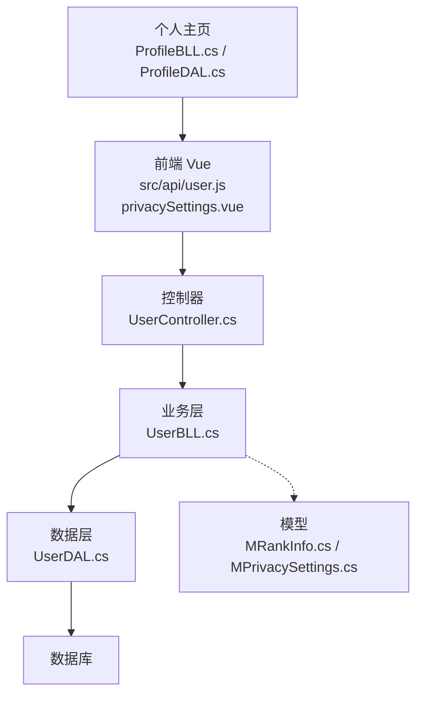
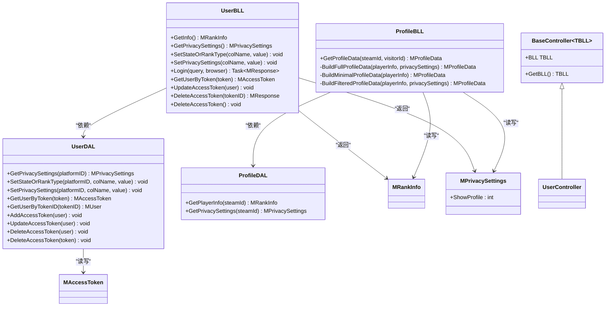
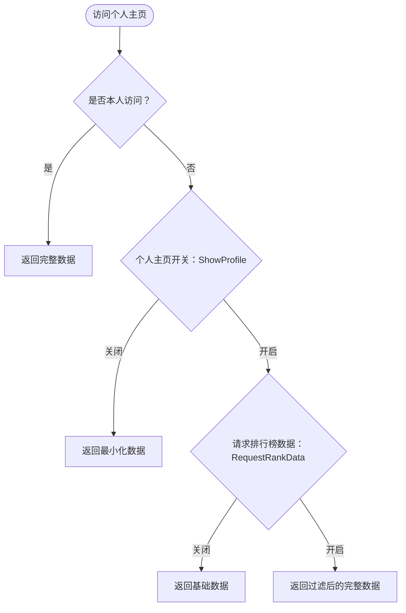
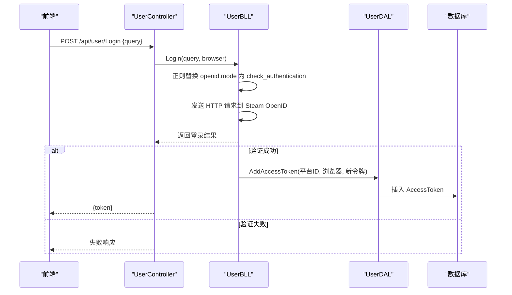
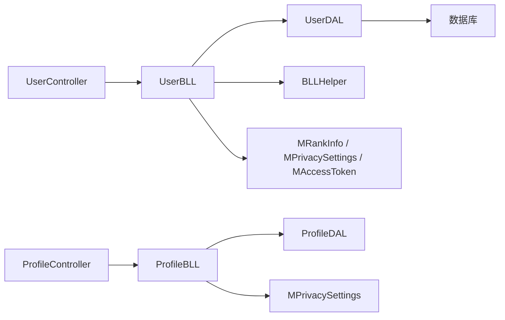

# 用户信息管理

<cite>
**本文引用的文件**
- [SpeedRunners.API/SpeedRunners/Controllers/UserController.cs](file://SpeedRunners.API/SpeedRunners/Controllers/UserController.cs)
- [SpeedRunners.API/SpeedRunners.BLL/UserBLL.cs](file://SpeedRunners.API/SpeedRunners.BLL/UserBLL.cs)
- [SpeedRunners.API/SpeedRunners.DAL/UserDAL.cs](file://SpeedRunners.API/SpeedRunners.DAL/UserDAL.cs)
- [SpeedRunners.API/SpeedRunners/Controllers/BaseController.cs](file://SpeedRunners.API/SpeedRunners/Controllers/BaseController.cs)
- [SpeedRunners.API/SpeedRunners.Utils/BLLHelper.cs](file://SpeedRunners.API/SpeedRunners.Utils/BLLHelper.cs)
- [SpeedRunners.API/SpeedRunners.Model/Rank/MRankInfo.cs](file://SpeedRunners.API/SpeedRunners.Model/Rank/MRankInfo.cs)
- [SpeedRunners.API/SpeedRunners.Model/User/MPrivacySettings.cs](file://SpeedRunners.API/SpeedRunners.Model/User/MPrivacySettings.cs)
- [SpeedRunners.API/SpeedRunners.Model/User/MAccessToken.cs](file://SpeedRunners.API/SpeedRunners.Model/User/MAccessToken.cs)
- [SpeedRunners.UI/src/api/user.js](file://SpeedRunners.UI/src/api/user.js)
- [SpeedRunners.UI/src/store/modules/user.js](file://SpeedRunners.UI/src/store/modules/user.js)
- [SpeedRunners.API/SpeedRunners.BLL/Resources/UserBLL.zh.resx](file://SpeedRunners.API/SpeedRunners.BLL/Resources/UserBLL.zh.resx)
- [SpeedRunners.UI/src/views/other/privacySettings.vue](file://SpeedRunners.UI/src/views/other/privacySettings.vue)
- [SpeedRunners.API/SpeedRunners.BLL/ProfileBLL.cs](file://SpeedRunners.API/SpeedRunners.BLL/ProfileBLL.cs)
- [SpeedRunners.API/SpeedRunners.DAL/ProfileDAL.cs](file://SpeedRunners.API/SpeedRunners.DAL/ProfileDAL.cs)
- [SpeedRunners.UI/src/i18n/lang/zh.json](file://SpeedRunners.UI/src/i18n/lang/zh.json)
</cite>

## 更新摘要
**所做更改**
- 新增 setShowProfile 隐私设置接口文档和实现说明
- 扩展隐私设置数据模型，新增 ShowProfile 字段
- 更新前端隐私设置界面，新增个人主页开关功能
- 完善个人主页访问控制逻辑和数据过滤机制
- 新增隐私设置 API 增强功能说明

## 目录
1. [引言](#引言)
2. [项目结构](#项目结构)
3. [核心组件](#核心组件)
4. [架构总览](#架构总览)
5. [详细组件分析](#详细组件分析)
6. [依赖关系分析](#依赖关系分析)
7. [性能考虑](#性能考虑)
8. [故障排查指南](#故障排查指南)
9. [结论](#结论)
10. [附录](#附录)

## 引言
本技术文档围绕用户信息管理功能展开，覆盖用户基本信息（如用户名、头像、个人简介等）的获取与展示、用户状态与段位类型的设置、隐私设置的更新与一致性保障，以及完整的用户信息 API 接口定义与前后端交互示例路径。本次更新重点反映了隐私设置API的增强功能，包括新增的个人主页开关（setShowProfile）接口、隐私设置数据模型扩展，以及前端隐私设置界面的重大更新。

## 项目结构
用户信息管理功能主要由三层组成：
- 表现层（前端 Vue）：通过 API 模块发起请求，调用用户信息接口并维护本地状态。新增个人主页开关功能，支持用户完全控制个人主页的可见性。
- 控制器层（后端 ASP.NET Core）：暴露 REST 风格的用户接口，接收请求并委派给业务层。新增 setShowProfile 接口，专门处理个人主页隐私设置。
- 业务与数据层（BLL/DAL）：封装数据库访问、事务控制与业务逻辑，确保数据一致性与安全校验。隐私设置数据模型已扩展以支持个人主页开关功能。

**图表来源**
- [SpeedRunners.API/SpeedRunners/Controllers/UserController.cs:10-56](file://SpeedRunners.API/SpeedRunners/Controllers/UserController.cs#L10-L56)
- [SpeedRunners.API/SpeedRunners.BLL/UserBLL.cs:16-151](file://SpeedRunners.API/SpeedRunners.BLL/UserBLL.cs#L16-L151)
- [SpeedRunners.API/SpeedRunners.DAL/UserDAL.cs:9-83](file://SpeedRunners.API/SpeedRunners.DAL/UserDAL.cs#L9-L83)
- [SpeedRunners.API/SpeedRunners.Model/Rank/MRankInfo.cs:5-35](file://SpeedRunners.API/SpeedRunners.Model/Rank/MRankInfo.cs#L5-L35)
- [SpeedRunners.API/SpeedRunners.Model/User/MPrivacySettings.cs:7-22](file://SpeedRunners.API/SpeedRunners.Model/User/MPrivacySettings.cs#L7-L22)
- [SpeedRunners.API/SpeedRunners.BLL/ProfileBLL.cs:24-87](file://SpeedRunners.API/SpeedRunners.BLL/ProfileBLL.cs#L24-L87)
- [SpeedRunners.API/SpeedRunners.DAL/ProfileDAL.cs:15-39](file://SpeedRunners.API/SpeedRunners.DAL/ProfileDAL.cs#L15-L39)

**章节来源**
- [SpeedRunners.API/SpeedRunners/Controllers/UserController.cs:10-56](file://SpeedRunners.API/SpeedRunners/Controllers/UserController.cs#L10-L56)
- [SpeedRunners.API/SpeedRunners.BLL/UserBLL.cs:16-151](file://SpeedRunners.API/SpeedRunners.BLL/UserBLL.cs#L16-L151)
- [SpeedRunners.API/SpeedRunners.DAL/UserDAL.cs:9-83](file://SpeedRunners.API/SpeedRunners.DAL/UserDAL.cs#L9-L83)

## 核心组件
- 控制器：提供用户信息查询、隐私设置查询、状态与段位类型设置、个人主页开关设置、登录、登出等接口。
- 业务层：封装数据库事务、登录验证、令牌刷新与校验、权限检查等。新增隐私设置业务逻辑，支持个人主页开关的完整生命周期管理。
- 数据层：负责读写用户隐私设置、状态与段位类型、访问令牌等表。隐私设置查询已扩展，支持个人主页开关字段的获取和更新。
- 模型：定义用户信息、隐私设置（已扩展支持个人主页开关）、访问令牌等数据结构。
- 前端 API：封装 HTTP 请求，统一调用后端接口并处理响应。新增 setShowProfile 方法，专门处理个人主页开关设置。
- 个人主页模块：新增 ProfileBLL 和 ProfileDAL，负责个人主页数据的访问控制和隐私过滤。

**章节来源**
- [SpeedRunners.API/SpeedRunners/Controllers/UserController.cs:12-56](file://SpeedRunners.API/SpeedRunners/Controllers/UserController.cs#L12-L56)
- [SpeedRunners.API/SpeedRunners.BLL/UserBLL.cs:16-151](file://SpeedRunners.API/SpeedRunners.BLL/UserBLL.cs#L16-L151)
- [SpeedRunners.API/SpeedRunners.DAL/UserDAL.cs:9-83](file://SpeedRunners.API/SpeedRunners.DAL/UserDAL.cs#L9-L83)
- [SpeedRunners.API/SpeedRunners.Model/Rank/MRankInfo.cs:5-35](file://SpeedRunners.API/SpeedRunners.Model/Rank/MRankInfo.cs#L5-L35)
- [SpeedRunners.API/SpeedRunners.Model/User/MPrivacySettings.cs:7-22](file://SpeedRunners.API/SpeedRunners.Model/User/MPrivacySettings.cs#L7-L22)
- [SpeedRunners.API/SpeedRunners.Model/User/MAccessToken.cs:7-15](file://SpeedRunners.API/SpeedRunners.Model/User/MAccessToken.cs#L7-L15)
- [SpeedRunners.UI/src/api/user.js:1-85](file://SpeedRunners.UI/src/api/user.js#L1-L85)
- [SpeedRunners.API/SpeedRunners.BLL/ProfileBLL.cs:13-101](file://SpeedRunners.API/SpeedRunners.BLL/ProfileBLL.cs#L13-L101)
- [SpeedRunners.API/SpeedRunners.DAL/ProfileDAL.cs:11-39](file://SpeedRunners.API/SpeedRunners.DAL/ProfileDAL.cs#L11-L39)

## 架构总览
用户信息管理遵循经典的分层架构，控制器仅负责路由与参数绑定，业务层负责领域逻辑与事务，数据层负责持久化。新增的个人主页功能通过独立的 Profile 模块实现，与用户隐私设置紧密集成，确保访问控制的一致性和安全性。

**图表来源**
- [SpeedRunners.API/SpeedRunners/Controllers/BaseController.cs:10-25](file://SpeedRunners.API/SpeedRunners/Controllers/BaseController.cs#L10-L25)
- [SpeedRunners.API/SpeedRunners/Controllers/UserController.cs:12-56](file://SpeedRunners.API/SpeedRunners/Controllers/UserController.cs#L12-L56)
- [SpeedRunners.API/SpeedRunners.BLL/UserBLL.cs:16-151](file://SpeedRunners.API/SpeedRunners.BLL/UserBLL.cs#L16-L151)
- [SpeedRunners.API/SpeedRunners.DAL/UserDAL.cs:9-83](file://SpeedRunners.API/SpeedRunners.DAL/UserDAL.cs#L9-L83)
- [SpeedRunners.API/SpeedRunners.BLL/ProfileBLL.cs:13-101](file://SpeedRunners.API/SpeedRunners.BLL/ProfileBLL.cs#L13-L101)
- [SpeedRunners.API/SpeedRunners.DAL/ProfileDAL.cs:11-39](file://SpeedRunners.API/SpeedRunners.DAL/ProfileDAL.cs#L11-L39)
- [SpeedRunners.API/SpeedRunners.Model/Rank/MRankInfo.cs:5-35](file://SpeedRunners.API/SpeedRunners.Model/Rank/MRankInfo.cs#L5-L35)
- [SpeedRunners.API/SpeedRunners.Model/User/MPrivacySettings.cs:7-22](file://SpeedRunners.API/SpeedRunners.Model/User/MPrivacySettings.cs#L7-L22)
- [SpeedRunners.API/SpeedRunners.Model/User/MAccessToken.cs:7-15](file://SpeedRunners.API/SpeedRunners.Model/User/MAccessToken.cs#L7-L15)

## 详细组件分析

### 控制器：UserController
- 提供以下接口：
  - GET /api/user/GetInfo：获取当前用户信息（含头像、昵称、状态、段位类型等）
  - GET /api/user/GetPrivacySettings：获取隐私设置（现已支持个人主页开关）
  - POST /api/user/SetState：设置在线状态
  - POST /api/user/SetRankType：设置段位类型
  - POST /api/user/SetShowWeekPlayTime：设置周游玩时间可见性
  - POST /api/user/SetRequestRankData：设置请求排行榜数据开关（同时影响段位类型）
  - POST /api/user/SetShowAddScore：设置加分可见性
  - POST /api/user/SetShowProfile：设置个人主页开关（新增）
  - POST /api/user/Login：Steam OpenID 登录
  - GET /api/user/LogoutOther/{tokenID}：踢掉其他设备登录
  - GET /api/user/LogoutLocal：本地退出登录

**更新** 新增 setShowProfile 接口，专门处理个人主页开关设置，支持用户完全控制个人主页的可见性。

**章节来源**
- [SpeedRunners.API/SpeedRunners/Controllers/UserController.cs:14-56](file://SpeedRunners.API/SpeedRunners/Controllers/UserController.cs#L14-L56)

### 业务层：UserBLL
- 职责：
  - 获取用户信息：基于当前平台 ID 查询段位信息列表并返回第一条
  - 获取隐私设置：读取隐私设置表，不存在则初始化默认值（现已支持个人主页开关）
  - 设置状态/段位类型：直接更新对应字段
  - 设置隐私设置：支持多个字段，其中"请求排行榜数据"会联动更新段位类型
  - 设置个人主页开关：新增业务逻辑，处理个人主页可见性控制
  - 登录流程：构造 Steam OpenID 验证请求，校验成功后生成访问令牌并入库
  - 令牌管理：根据令牌与过期时间判断刷新窗口，提供查询、更新、删除等能力
- 事务与异常：
  - 使用通用帮助类开启数据库连接与事务，异常时回滚并抛出

**更新** 新增 SetPrivacySettings 方法的完整实现，支持个人主页开关字段的设置和联动更新。

**章节来源**
- [SpeedRunners.API/SpeedRunners.BLL/UserBLL.cs:26-151](file://SpeedRunners.API/SpeedRunners.BLL/UserBLL.cs#L26-L151)
- [SpeedRunners.API/SpeedRunners.Utils/BLLHelper.cs:30-70](file://SpeedRunners.API/SpeedRunners.Utils/BLLHelper.cs#L30-L70)

### 数据层：UserDAL
- 职责：
  - 初始化隐私设置记录（若不存在，现已包含个人主页开关默认值）
  - 组合查询用户信息与隐私设置（现已支持个人主页开关字段）
  - 更新状态与段位类型
  - 更新隐私设置，必要时联动更新段位类型
  - 访问令牌的增删改查
- SQL 特性：
  - 使用参数化查询防止注入
  - 使用 IFNULL 与 CASE WHEN 处理默认值与隐私态
  - 新增 ShowProfile 字段的查询和更新支持

**更新** 隐私设置查询和更新逻辑已扩展，支持个人主页开关字段的获取和设置，默认值为1（开启）。

**章节来源**
- [SpeedRunners.API/SpeedRunners.DAL/UserDAL.cs:13-83](file://SpeedRunners.API/SpeedRunners.DAL/UserDAL.cs#L13-L83)

### 模型：MRankInfo、MPrivacySettings、MAccessToken
- MRankInfo：包含平台 ID、昵称、头像（小/中/大）、状态、游戏 ID、段位等级、参与状态、周游玩时间等
- MPrivacySettings：包含状态、段位类型、请求排行榜数据、加分可见性、周游玩时间可见性、**个人主页开关**等
- MAccessToken：包含令牌 ID、平台 ID、浏览器、令牌、登录时间、扩展令牌等

**更新** MPrivacySettings 模型已扩展，新增 ShowProfile 字段，用于控制个人主页的可见性，默认值为1（开启）。

**章节来源**
- [SpeedRunners.API/SpeedRunners.Model/Rank/MRankInfo.cs:5-35](file://SpeedRunners.API/SpeedRunners.Model/Rank/MRankInfo.cs#L5-L35)
- [SpeedRunners.API/SpeedRunners.Model/User/MPrivacySettings.cs:7-22](file://SpeedRunners.API/SpeedRunners.Model/User/MPrivacySettings.cs#L7-L22)
- [SpeedRunners.API/SpeedRunners.Model/User/MAccessToken.cs:7-15](file://SpeedRunners.API/SpeedRunners.Model/User/MAccessToken.cs#L7-L15)

### 前端集成：API 与状态
- API 封装：提供 getInfo、login、logoutOther、logoutLocal、getPrivacySettings、setState、setRankType、setShowWeekPlayTime、setRequestRankData、setShowAddScore、**setShowProfile** 等方法
- 状态管理：Vuex 模块维护 steamId、name、avatar、rankType、participate 等字段，登录后从接口返回填充
- 隐私设置界面：新增个人主页开关功能，支持用户完全控制个人主页的可见性

**更新** 前端 API 已新增 setShowProfile 方法，隐私设置界面已更新，新增个人主页开关控件。

**章节来源**
- [SpeedRunners.UI/src/api/user.js:3-85](file://SpeedRunners.UI/src/api/user.js#L3-L85)
- [SpeedRunners.UI/src/store/modules/user.js:1-55](file://SpeedRunners.UI/src/store/modules/user.js#L1-L55)
- [SpeedRunners.UI/src/views/other/privacySettings.vue:1-200](file://SpeedRunners.UI/src/views/other/privacySettings.vue#L1-L200)

### 个人主页访问控制
新增的个人主页功能通过 ProfileBLL 和 ProfileDAL 实现，提供完整的访问控制和数据过滤机制：

**图表来源**
- [SpeedRunners.API/SpeedRunners.BLL/ProfileBLL.cs:69-87](file://SpeedRunners.API/SpeedRunners.BLL/ProfileBLL.cs#L69-L87)
- [SpeedRunners.API/SpeedRunners.DAL/ProfileDAL.cs:28-39](file://SpeedRunners.API/SpeedRunners.DAL/ProfileDAL.cs#L28-L39)

### 登录流程时序图

**图表来源**
- [SpeedRunners.API/SpeedRunners/Controllers/UserController.cs:42-47](file://SpeedRunners.API/SpeedRunners/Controllers/UserController.cs#L42-L47)
- [SpeedRunners.API/SpeedRunners.BLL/UserBLL.cs:60-93](file://SpeedRunners.API/SpeedRunners.BLL/UserBLL.cs#L60-L93)
- [SpeedRunners.API/SpeedRunners.DAL/UserDAL.cs:63-67](file://SpeedRunners.API/SpeedRunners.DAL/UserDAL.cs#L63-L67)

## 依赖关系分析
- 控制器依赖业务层，业务层依赖数据层与通用帮助类，数据层依赖数据库访问工具。
- 业务层通过通用帮助类统一处理数据库连接与事务，避免重复代码与事务遗漏。
- 模型用于前后端数据交换，保持一致的字段定义。
- **新增** 个人主页模块独立于用户信息模块，通过隐私设置进行访问控制。

**图表来源**
- [SpeedRunners.API/SpeedRunners/Controllers/UserController.cs:12-56](file://SpeedRunners.API/SpeedRunners/Controllers/UserController.cs#L12-L56)
- [SpeedRunners.API/SpeedRunners.BLL/UserBLL.cs:16-151](file://SpeedRunners.API/SpeedRunners.BLL/UserBLL.cs#L16-L151)
- [SpeedRunners.API/SpeedRunners.Utils/BLLHelper.cs:7-73](file://SpeedRunners.API/SpeedRunners.Utils/BLLHelper.cs#L7-L73)
- [SpeedRunners.API/SpeedRunners.DAL/UserDAL.cs:9-83](file://SpeedRunners.API/SpeedRunners.DAL/UserDAL.cs#L9-L83)
- [SpeedRunners.API/SpeedRunners.BLL/ProfileBLL.cs:13-101](file://SpeedRunners.API/SpeedRunners.BLL/ProfileBLL.cs#L13-L101)

**章节来源**
- [SpeedRunners.API/SpeedRunners/Controllers/UserController.cs:12-56](file://SpeedRunners.API/SpeedRunners/Controllers/UserController.cs#L12-L56)
- [SpeedRunners.API/SpeedRunners.BLL/UserBLL.cs:16-151](file://SpeedRunners.API/SpeedRunners.BLL/UserBLL.cs#L16-L151)
- [SpeedRunners.API/SpeedRunners.Utils/BLLHelper.cs:7-73](file://SpeedRunners.API/SpeedRunners.Utils/BLLHelper.cs#L7-L73)
- [SpeedRunners.API/SpeedRunners.DAL/UserDAL.cs:9-83](file://SpeedRunners.API/SpeedRunners.DAL/UserDAL.cs#L9-L83)

## 性能考虑
- 数据库访问：所有数据库操作通过通用帮助类统一管理，减少连接泄漏风险；建议在高频更新场景下评估批量更新策略。
- 参数化查询：SQL 全部采用参数化，有效降低注入风险并提升缓存命中率。
- 前端缓存：建议在前端对用户信息与隐私设置进行本地缓存，减少重复请求。
- 登录流程：Steam OpenID 验证在网络层面存在不确定性，建议增加重试与超时控制。
- **新增** 个人主页访问控制：通过一次查询获取用户信息和隐私设置，避免多次数据库往返。

## 故障排查指南
- 登录超时/失败
  - 现象：登录接口返回"登录超时"或"登录失败"
  - 可能原因：网络波动导致 Steam 验证请求失败；OpenID 参数构造错误
  - 排查步骤：检查请求头中的 User-Agent；确认 Steam 服务可用性；查看资源文件中的本地化错误信息
  - 相关资源
    - [UserBLL.zh.resx:120-125](file://SpeedRunners.API/SpeedRunners.BLL/Resources/UserBLL.zh.resx#L120-L125)
    - [UserBLL.cs:60-93](file://SpeedRunners.API/SpeedRunners.BLL/UserBLL.cs#L60-L93)
- 设备退出后仍提示权限错误
  - 现象：调用"踢掉其他设备登录"返回"权限错误"或"目标设备权限较高"
  - 可能原因：当前登录设备权限低于目标设备；目标设备登录时间晚于当前设备
  - 排查步骤：核对返回的登录时间与权限逻辑；确认调用方是否具备足够权限
  - 相关实现
    - [UserBLL.cs:121-141](file://SpeedRunners.API/SpeedRunners.BLL/UserBLL.cs#L121-L141)
- 隐私设置未生效
  - 现象：更新隐私设置后查询仍为旧值
  - 可能原因：隐私设置表未初始化；并发更新导致覆盖
  - 排查步骤：确认初始化逻辑是否执行；检查并发更新策略
  - 相关实现
    - [UserDAL.cs:13-35](file://SpeedRunners.API/SpeedRunners.DAL/UserDAL.cs#L13-L35)
- **新增** 个人主页访问异常
  - 现象：个人主页无法正常显示或显示不完整
  - 可能原因：个人主页开关设置错误；隐私设置数据不一致；访问权限不足
  - 排查步骤：检查 ShowProfile 字段值；验证隐私设置与个人主页数据的一致性；确认访问控制逻辑

**章节来源**
- [SpeedRunners.API/SpeedRunners.BLL/Resources/UserBLL.zh.resx:120-135](file://SpeedRunners.API/SpeedRunners.BLL/Resources/UserBLL.zh.resx#L120-L135)
- [SpeedRunners.API/SpeedRunners.BLL/UserBLL.cs:60-93](file://SpeedRunners.API/SpeedRunners.BLL/UserBLL.cs#L60-L93)
- [SpeedRunners.API/SpeedRunners.BLL/UserBLL.cs:121-141](file://SpeedRunners.API/SpeedRunners.BLL/UserBLL.cs#L121-L141)
- [SpeedRunners.API/SpeedRunners.DAL/UserDAL.cs:13-35](file://SpeedRunners.API/SpeedRunners.DAL/UserDAL.cs#L13-L35)

## 结论
本系统以清晰的分层架构实现了用户信息管理的核心能力：用户基本信息的获取与展示、状态与段位类型的设置、隐私设置的联动更新与一致性保障，以及基于 Steam 的登录与多设备令牌管理。**本次更新重点增强了隐私设置功能，新增个人主页开关接口（setShowProfile），通过 MPrivacySettings 模型扩展支持个人主页可见性控制，并在前端实现了完整的隐私设置界面。** 新增的个人主页访问控制模块通过 ProfileBLL 和 ProfileDAL 提供了灵活的数据过滤和访问权限管理，确保用户隐私得到充分保护。通过参数化查询与统一事务处理，确保了数据安全与稳定性。前端通过 API 模块与 Vuex 状态管理，提供了良好的用户体验。

## 附录

### 用户信息 API 接口文档

- 获取用户信息
  - 方法：GET
  - 路径：/api/user/GetInfo
  - 权限：需要登录
  - 响应：MRankInfo 对象
  - 示例路径
    - [UserController.cs](file://SpeedRunners.API/SpeedRunners/Controllers/UserController.cs#L16)
    - [user.js:3-8](file://SpeedRunners.UI/src/api/user.js#L3-L8)

- 获取隐私设置
  - 方法：GET
  - 路径：/api/user/GetPrivacySettings
  - 权限：需要登录
  - 响应：MPrivacySettings 对象（现已支持个人主页开关）
  - 示例路径
    - [UserController.cs](file://SpeedRunners.API/SpeedRunners/Controllers/UserController.cs#L20)
    - [user.js:32-37](file://SpeedRunners.UI/src/api/user.js#L32-L37)

- 设置在线状态
  - 方法：POST
  - 路径：/api/user/SetState
  - 权限：需要登录
  - 请求体：{ value: 状态码 }
  - 响应：无
  - 示例路径
    - [UserController.cs](file://SpeedRunners.API/SpeedRunners/Controllers/UserController.cs#L24)
    - [user.js:39-45](file://SpeedRunners.UI/src/api/user.js#L39-L45)

- 设置段位类型
  - 方法：POST
  - 路径：/api/user/SetRankType
  - 权限：需要登录
  - 请求体：{ value: 类型码 }
  - 响应：无
  - 示例路径
    - [UserController.cs](file://SpeedRunners.API/SpeedRunners/Controllers/UserController.cs#L28)
    - [user.js:47-53](file://SpeedRunners.UI/src/api/user.js#L47-L53)

- 设置周游玩时间可见性
  - 方法：POST
  - 路径：/api/user/SetShowWeekPlayTime
  - 权限：需要登录
  - 请求体：{ value: 开关值 }
  - 响应：无
  - 示例路径
    - [UserController.cs](file://SpeedRunners.API/SpeedRunners/Controllers/UserController.cs#L32)
    - [user.js:55-61](file://SpeedRunners.UI/src/api/user.js#L55-L61)

- 设置请求排行榜数据
  - 方法：POST
  - 路径：/api/user/SetRequestRankData
  - 权限：需要登录
  - 请求体：{ value: 开关值 }
  - 响应：无
  - 说明：该操作会联动更新段位类型
  - 示例路径
    - [UserController.cs](file://SpeedRunners.API/SpeedRunners/Controllers/UserController.cs#L36)
    - [user.js:63-69](file://SpeedRunners.UI/src/api/user.js#L63-L69)

- 设置加分可见性
  - 方法：POST
  - 路径：/api/user/SetShowAddScore
  - 权限：需要登录
  - 请求体：{ value: 开关值 }
  - 响应：无
  - 示例路径
    - [UserController.cs](file://SpeedRunners.API/SpeedRunners/Controllers/UserController.cs#L40)
    - [user.js:71-77](file://SpeedRunners.UI/src/api/user.js#L71-L77)

- **新增** 设置个人主页开关
  - 方法：POST
  - 路径：/api/user/SetShowProfile
  - 权限：需要登录
  - 请求体：{ value: 开关值 }
  - 响应：无
  - 说明：控制个人主页的可见性，0为关闭，1为开启
  - 示例路径
    - [UserController.cs](file://SpeedRunners.API/SpeedRunners/Controllers/UserController.cs#L44)
    - [user.js:79-85](file://SpeedRunners.UI/src/api/user.js#L79-L85)

- 登录（Steam OpenID）
  - 方法：POST
  - 路径：/api/user/Login
  - 权限：无需登录
  - 请求体：{ query: Steam OpenID 查询串 }
  - 响应：包含 token 的响应对象
  - 示例路径
    - [UserController.cs:46-51](file://SpeedRunners.API/SpeedRunners/Controllers/UserController.cs#L46-L51)
    - [user.js:10-16](file://SpeedRunners.UI/src/api/user.js#L10-L16)

- 踢掉其他设备登录
  - 方法：GET
  - 路径：/api/user/LogoutOther/{tokenID}
  - 权限：需要登录
  - 响应：通用响应对象
  - 示例路径
    - [UserController.cs:53-55](file://SpeedRunners.API/SpeedRunners/Controllers/UserController.cs#L53-L55)
    - [user.js:18-23](file://SpeedRunners.UI/src/api/user.js#L18-L23)

- 本地退出登录
  - 方法：GET
  - 路径：/api/user/LogoutLocal
  - 权限：需要登录
  - 响应：无
  - 示例路径
    - [UserController.cs:57-59](file://SpeedRunners.API/SpeedRunners/Controllers/UserController.cs#L57-L59)
    - [user.js:25-30](file://SpeedRunners.UI/src/api/user.js#L25-L30)

### 数据模型说明

- MRankInfo 字段
  - 平台 ID、昵称、头像（小/中/大）、状态、游戏 ID、段位等级、参与状态、周游玩时间等
  - 参考
    - [MRankInfo.cs:7-35](file://SpeedRunners.API/SpeedRunners.Model/Rank/MRankInfo.cs#L7-L35)

- **更新** MPrivacySettings 字段
  - 平台 ID、状态、**个人主页开关（ShowProfile）**、请求排行榜数据、加分可见性、周游玩时间可见性、段位类型
  - 个人主页开关：0关闭，1开启（默认）
  - 参考
    - [MPrivacySettings.cs:9-25](file://SpeedRunners.API/SpeedRunners.Model/User/MPrivacySettings.cs#L9-L25)

- MAccessToken 字段
  - 令牌 ID、平台 ID、浏览器、令牌、登录时间、扩展令牌
  - 参考
    - [MAccessToken.cs:9-15](file://SpeedRunners.API/SpeedRunners.Model/User/MAccessToken.cs#L9-L15)

### 前端隐私设置界面说明

- **新增** 个人主页开关控件
  - 标题：个人主页
  - 说明：开启后其他用户可以访问你的个人主页
  - 默认值：开启（1）
  - 禁用条件：当个人主页开关关闭时，其他隐私设置控件将被禁用
  - 事件处理：changeShowProfile 方法触发 setShowProfile API 调用

- 隐私设置联动逻辑
  - 个人主页开关关闭时：禁用所有其他隐私设置控件
  - 个人主页开关开启时：启用相关隐私设置控件
  - 请求排行榜数据开关变化时：根据开关值联动更新段位类型

**章节来源**
- [SpeedRunners.UI/src/views/other/privacySettings.vue:15-100](file://SpeedRunners.UI/src/views/other/privacySettings.vue#L15-L100)
- [SpeedRunners.UI/src/i18n/lang/zh.json:237-250](file://SpeedRunners.UI/src/i18n/lang/zh.json#L237-L250)