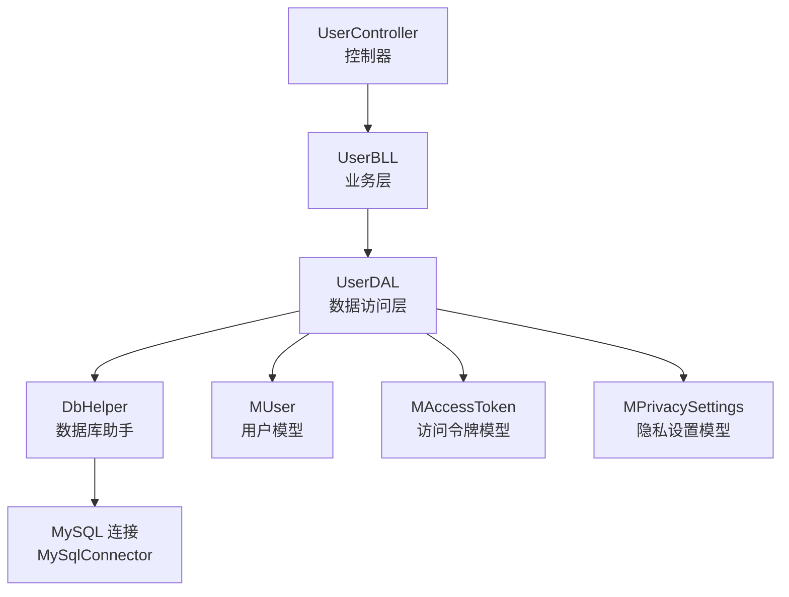
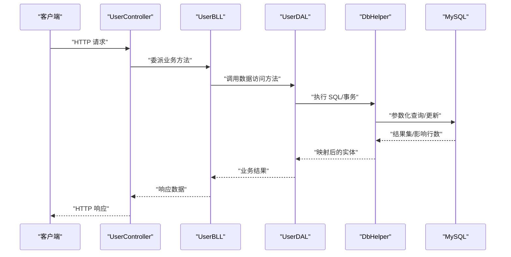
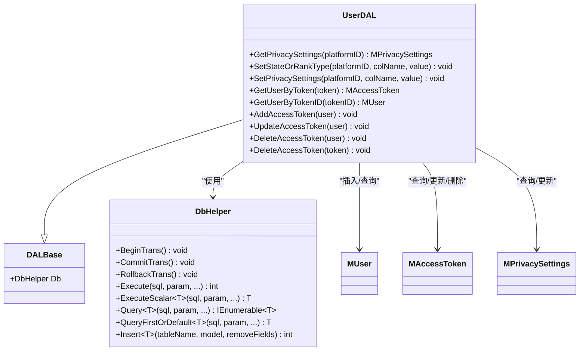
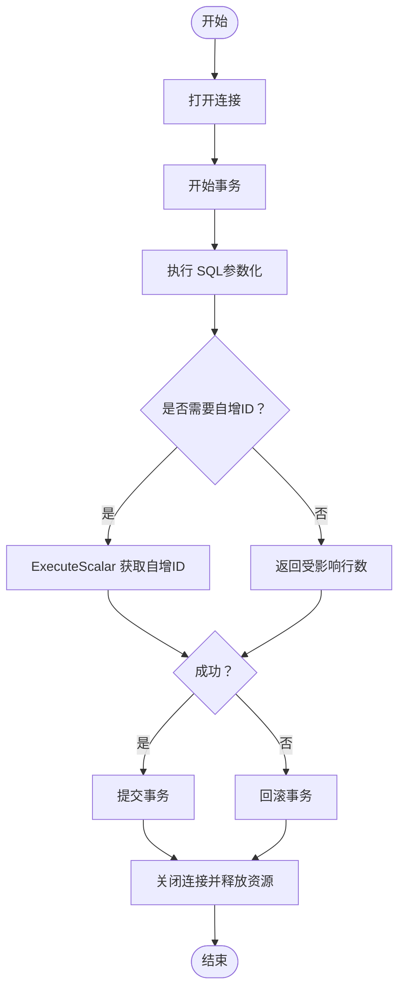
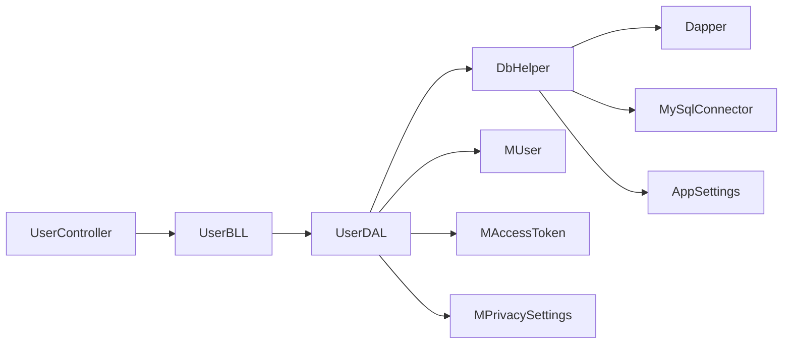

# 用户数据访问层

<cite>
**本文引用的文件**
- [UserDAL.cs](file://SpeedRunners.API/SpeedRunners.DAL/UserDAL.cs)
- [DALBase.cs](file://SpeedRunners.API/SpeedRunners.Utils/DALBase.cs)
- [DbHelper.cs](file://SpeedRunners.API/SpeedRunners.Utils/DbHelper.cs)
- [MUser.cs](file://SpeedRunners.API/SpeedRunners.Model/MUser.cs)
- [MAccessToken.cs](file://SpeedRunners.API/SpeedRunners.Model/User/MAccessToken.cs)
- [MPrivacySettings.cs](file://SpeedRunners.API/SpeedRunners.Model/User/MPrivacySettings.cs)
- [UserBLL.cs](file://SpeedRunners.API/SpeedRunners.BLL/UserBLL.cs)
- [UserController.cs](file://SpeedRunners.API/SpeedRunners/Controllers/UserController.cs)
- [tmdsr.sql](file://mysql-dump/tmdsr.sql)
- [AppSettings.cs](file://SpeedRunners.API/SpeedRunners.Utils/AppSettings.cs)
</cite>

## 目录
1. [简介](#简介)
2. [项目结构](#项目结构)
3. [核心组件](#核心组件)
4. [架构总览](#架构总览)
5. [详细组件分析](#详细组件分析)
6. [依赖关系分析](#依赖关系分析)
7. [性能考虑](#性能考虑)
8. [故障排查指南](#故障排查指南)
9. [结论](#结论)
10. [附录](#附录)

## 简介
本技术文档聚焦于用户数据访问层（UserDAL）及其支撑基础设施，系统性阐述以下内容：
- UserDAL 的数据访问实现：用户隐私设置查询与初始化、状态与排行榜类型更新、访问令牌的查询、新增、更新与删除。
- DALBase 基类的设计模式与通用能力：依赖注入 DbHelper、统一的上下文持有方式。
- DbHelper 工具类的数据库操作封装：事务管理、SQL 构建、参数绑定、结果映射与批量查询。
- 完整的数据库操作 API 文档：方法签名、参数说明、返回值格式与典型调用流程。
- SQL 查询示例与性能优化建议，帮助开发者理解并扩展数据访问功能。

## 项目结构
用户数据访问层位于 SpeedRunners.API 工程下，采用典型的三层结构：
- 控制器层：接收请求并委派给业务层。
- 业务层：编排领域逻辑、参数校验与跨表处理。
- 数据访问层：基于 DbHelper 提供的 Dapper 封装进行 CRUD 操作。
- 模型层：承载实体与 DTO，如用户、访问令牌、隐私设置等。

图表来源
- [UserController.cs](file://SpeedRunners.API/SpeedRunners/Controllers/UserController.cs#L1-L58)
- [UserBLL.cs](file://SpeedRunners.API/SpeedRunners.BLL/UserBLL.cs#L1-L153)
- [UserDAL.cs](file://SpeedRunners.API/SpeedRunners.DAL/UserDAL.cs#L1-L85)
- [DbHelper.cs](file://SpeedRunners.API/SpeedRunners.Utils/DbHelper.cs#L1-L283)
- [MUser.cs](file://SpeedRunners.API/SpeedRunners.Model/MUser.cs#L1-L35)
- [MAccessToken.cs](file://SpeedRunners.API/SpeedRunners.Model/User/MAccessToken.cs#L1-L17)
- [MPrivacySettings.cs](file://SpeedRunners.API/SpeedRunners.Model/User/MPrivacySettings.cs#L1-L23)

章节来源
- [UserController.cs](file://SpeedRunners.API/SpeedRunners/Controllers/UserController.cs#L1-L58)
- [UserBLL.cs](file://SpeedRunners.API/SpeedRunners.BLL/UserBLL.cs#L1-L153)
- [UserDAL.cs](file://SpeedRunners.API/SpeedRunners.DAL/UserDAL.cs#L1-L85)
- [DbHelper.cs](file://SpeedRunners.API/SpeedRunners.Utils/DbHelper.cs#L1-L283)

## 核心组件
- UserDAL：面向用户模块的 DAO 实现，负责隐私设置、令牌管理等数据操作。
- DALBase：抽象基类，统一持有 DbHelper，便于子类复用数据库上下文。
- DbHelper：对 Dapper 的轻量封装，提供事务、参数化执行、查询与批量查询等能力。
- 模型类：MUser、MAccessToken、MPrivacySettings，用于数据传输与映射。

章节来源
- [UserDAL.cs](file://SpeedRunners.API/SpeedRunners.DAL/UserDAL.cs#L1-L85)
- [DALBase.cs](file://SpeedRunners.API/SpeedRunners.Utils/DALBase.cs#L1-L13)
- [DbHelper.cs](file://SpeedRunners.API/SpeedRunners.Utils/DbHelper.cs#L1-L283)
- [MUser.cs](file://SpeedRunners.API/SpeedRunners.Model/MUser.cs#L1-L35)
- [MAccessToken.cs](file://SpeedRunners.API/SpeedRunners.Model/User/MAccessToken.cs#L1-L17)
- [MPrivacySettings.cs](file://SpeedRunners.API/SpeedRunners.Model/User/MPrivacySettings.cs#L1-L23)

## 架构总览
用户访问流程从控制器进入，经由业务层协调，最终落到数据访问层。DbHelper 统一管理连接与事务，保证操作的一致性与可测试性。

图表来源
- [UserController.cs](file://SpeedRunners.API/SpeedRunners/Controllers/UserController.cs#L1-L58)
- [UserBLL.cs](file://SpeedRunners.API/SpeedRunners.BLL/UserBLL.cs#L1-L153)
- [UserDAL.cs](file://SpeedRunners.API/SpeedRunners.DAL/UserDAL.cs#L1-L85)
- [DbHelper.cs](file://SpeedRunners.API/SpeedRunners.Utils/DbHelper.cs#L1-L283)

## 详细组件分析

### UserDAL 数据访问实现
- 隐私设置初始化与查询
  - 若目标平台不存在隐私设置记录，则先插入默认记录，再联合 RankInfo 与 PrivacySettings 查询并映射为 MPrivacySettings。
  - 关键点：LEFT JOIN、IFNULL 默认值、CASE WHEN 状态转换。
- 状态与排行榜类型更新
  - 支持按列名动态更新 RankInfo 的 State 或 RankType。
- 隐私设置项更新
  - 支持按列名更新 PrivacySettings，并在特定列更新时联动 RankType 与其它显示项。
- 访问令牌管理
  - 按令牌或 TokenID 查询用户令牌信息。
  - 新增令牌：利用 DbHelper.Insert 将 MUser 映射为 INSERT 语句并返回自增主键。
  - 更新令牌：按 TokenID 与 PlatformID 更新 Token、ExToken、Browser。
  - 删除令牌：支持按 TokenID 与 PlatformID 删除，或按 Token 删除。

图表来源
- [UserDAL.cs](file://SpeedRunners.API/SpeedRunners.DAL/UserDAL.cs#L1-L85)
- [DALBase.cs](file://SpeedRunners.API/SpeedRunners.Utils/DALBase.cs#L1-L13)
- [DbHelper.cs](file://SpeedRunners.API/SpeedRunners.Utils/DbHelper.cs#L1-L283)
- [MUser.cs](file://SpeedRunners.API/SpeedRunners.Model/MUser.cs#L1-L35)
- [MAccessToken.cs](file://SpeedRunners.API/SpeedRunners.Model/User/MAccessToken.cs#L1-L17)
- [MPrivacySettings.cs](file://SpeedRunners.API/SpeedRunners.Model/User/MPrivacySettings.cs#L1-L23)

章节来源
- [UserDAL.cs](file://SpeedRunners.API/SpeedRunners.DAL/UserDAL.cs#L13-L82)

### DALBase 基类设计模式
- 单一职责：仅持有 DbHelper，避免在子类中重复构造连接与事务。
- 依赖注入：通过构造函数注入 DbHelper，便于替换与测试。
- 可扩展性：子类可直接使用 DbHelper 的所有公开方法，无需关心底层连接细节。

章节来源
- [DALBase.cs](file://SpeedRunners.API/SpeedRunners.Utils/DALBase.cs#L3-L11)

### DbHelper 工具类封装
- 事务管理
  - BeginTrans：打开连接并开始新事务。
  - CommitTrans/RollbackTrans：提交或回滚事务并释放资源。
- 参数化执行
  - Execute：执行非查询语句，返回受影响行数。
  - ExecuteScalar：执行并返回首行首列。
- 查询映射
  - Query/Query<T>/QueryFirstOrDefault<T>：执行查询并将结果映射到对象或动态类型。
  - QueryMultiple：支持多结果集读取。
- 动态插入
  - Insert<T>：根据模型反射生成 INSERT 语句并执行，返回自增主键。
  - AddParamAndGetInsertSql：内部用于拼接 SQL 与参数绑定。

图表来源
- [DbHelper.cs](file://SpeedRunners.API/SpeedRunners.Utils/DbHelper.cs#L34-L54)
- [DbHelper.cs](file://SpeedRunners.API/SpeedRunners.Utils/DbHelper.cs#L103-L106)
- [DbHelper.cs](file://SpeedRunners.API/SpeedRunners.Utils/DbHelper.cs#L117-L120)
- [DbHelper.cs](file://SpeedRunners.API/SpeedRunners.Utils/DbHelper.cs#L68-L73)
- [DbHelper.cs](file://SpeedRunners.API/SpeedRunners.Utils/DbHelper.cs#L75-L93)

章节来源
- [DbHelper.cs](file://SpeedRunners.API/SpeedRunners.Utils/DbHelper.cs#L34-L54)
- [DbHelper.cs](file://SpeedRunners.API/SpeedRunners.Utils/DbHelper.cs#L103-L120)
- [DbHelper.cs](file://SpeedRunners.API/SpeedRunners.Utils/DbHelper.cs#L199-L202)
- [DbHelper.cs](file://SpeedRunners.API/SpeedRunners.Utils/DbHelper.cs#L260-L263)
- [DbHelper.cs](file://SpeedRunners.API/SpeedRunners.Utils/DbHelper.cs#L68-L93)

### 数据库操作 API 文档（UserDAL）
- GetPrivacySettings(platformID)
  - 功能：若不存在隐私设置则初始化，随后联合查询并映射为 MPrivacySettings。
  - 参数：platformID（平台标识）。
  - 返回：MPrivacySettings。
  - 复杂度：一次存在性检查与一次联表查询。
- SetStateOrRankType(platformID, colName, value)
  - 功能：更新 RankInfo 的指定列（如 State 或 RankType）。
  - 参数：platformID、colName、value。
  - 返回：void。
- SetPrivacySettings(platformID, colName, value)
  - 功能：更新 PrivacySettings 的指定列；当更新 RequestRankData 时联动 RankType 与 ShowAddScore。
  - 参数：platformID、colName、value。
  - 返回：void。
- GetUserByToken(token)
  - 功能：按 Token 或 ExToken 查询访问令牌。
  - 参数：token。
  - 返回：MAccessToken。
- GetUserByTokenID(tokenID)
  - 功能：按 TokenID 查询用户信息。
  - 参数：tokenID。
  - 返回：MUser。
- AddAccessToken(user)
  - 功能：向 AccessToken 表插入一条记录，忽略 TokenID 与 RankID（通常由数据库自增或业务计算）。
  - 参数：user（MUser）。
  - 返回：void。
- UpdateAccessToken(user)
  - 功能：按 TokenID 与 PlatformID 更新 Token、ExToken、Browser。
  - 参数：user（MAccessToken）。
  - 返回：void。
- DeleteAccessToken(user)/DeleteAccessToken(token)
  - 功能：支持按用户令牌或令牌值删除。
  - 参数：user（MUser）或 token（字符串）。
  - 返回：void。

章节来源
- [UserDAL.cs](file://SpeedRunners.API/SpeedRunners.DAL/UserDAL.cs#L13-L82)
- [MUser.cs](file://SpeedRunners.API/SpeedRunners.Model/MUser.cs#L8-L35)
- [MAccessToken.cs](file://SpeedRunners.API/SpeedRunners.Model/User/MAccessToken.cs#L7-L16)
- [MPrivacySettings.cs](file://SpeedRunners.API/SpeedRunners.Model/User/MPrivacySettings.cs#L7-L23)

### SQL 查询示例与说明
- 隐私设置初始化与查询（联表）
  - 示例路径：[隐私设置查询](file://SpeedRunners.API/SpeedRunners.DAL/UserDAL.cs#L20-L35)
  - 关键点：LEFT JOIN、IFNULL 默认值、CASE WHEN 状态转换。
- 更新 RankInfo
  - 示例路径：[更新状态/排行类型](file://SpeedRunners.API/SpeedRunners.DAL/UserDAL.cs#L37-L40)
- 更新 PrivacySettings 并联动 RankType
  - 示例路径：[隐私设置更新](file://SpeedRunners.API/SpeedRunners.DAL/UserDAL.cs#L42-L51)
- 访问令牌查询/删除
  - 示例路径：[按令牌查询](file://SpeedRunners.API/SpeedRunners.DAL/UserDAL.cs#L53-L56)、[按 TokenID 查询](file://SpeedRunners.API/SpeedRunners.DAL/UserDAL.cs#L58-L61)、[删除令牌](file://SpeedRunners.API/SpeedRunners.DAL/UserDAL.cs#L74-L82)

章节来源
- [UserDAL.cs](file://SpeedRunners.API/SpeedRunners.DAL/UserDAL.cs#L20-L51)
- [UserDAL.cs](file://SpeedRunners.API/SpeedRunners.DAL/UserDAL.cs#L53-L82)

## 依赖关系分析
- 控制器依赖业务层，业务层依赖数据访问层，数据访问层依赖 DbHelper，DbHelper 依赖 Dapper 与 MySqlConnector。
- UserDAL 依赖 MUser、MAccessToken、MPrivacySettings 作为数据传输对象。
- 配置通过 AppSettings 读取连接字符串，确保连接建立与事务管理的集中控制。

图表来源
- [UserController.cs](file://SpeedRunners.API/SpeedRunners/Controllers/UserController.cs#L1-L58)
- [UserBLL.cs](file://SpeedRunners.API/SpeedRunners.BLL/UserBLL.cs#L1-L153)
- [UserDAL.cs](file://SpeedRunners.API/SpeedRunners.DAL/UserDAL.cs#L1-L85)
- [DbHelper.cs](file://SpeedRunners.API/SpeedRunners.Utils/DbHelper.cs#L1-L283)
- [AppSettings.cs](file://SpeedRunners.API/SpeedRunners.Utils/AppSettings.cs#L16-L19)

章节来源
- [UserBLL.cs](file://SpeedRunners.API/SpeedRunners.BLL/UserBLL.cs#L1-L153)
- [UserDAL.cs](file://SpeedRunners.API/SpeedRunners.DAL/UserDAL.cs#L1-L85)
- [DbHelper.cs](file://SpeedRunners.API/SpeedRunners.Utils/DbHelper.cs#L1-L283)
- [AppSettings.cs](file://SpeedRunners.API/SpeedRunners.Utils/AppSettings.cs#L16-L19)

## 性能考虑
- 使用参数化 SQL 与 Dapper 映射，避免拼接 SQL 带来的性能与安全问题。
- 对频繁查询的表（如 AccessToken、PrivacySettings）建立合适的索引（例如 Token、TokenID、PlatformID），以提升查询效率。
- 合理使用事务：将相关联的更新（如隐私设置联动 RankType）放入同一事务，减少中间状态。
- 批量查询使用 QueryMultiple 时注意结果集顺序与 splitOn 字段，避免不必要的内存占用。
- 在高并发场景下，建议引入连接池与超时控制，结合 AppSettings 的配置项统一管理。

## 故障排查指南
- 事务未提交或回滚导致数据不一致
  - 检查 BeginTrans/CommitTrans/RollbackTrans 是否成对出现且异常被捕获。
  - 参考路径：[事务方法](file://SpeedRunners.API/SpeedRunners.Utils/DbHelper.cs#L34-L54)
- 参数绑定错误或列名不匹配
  - 确认模型属性与表字段一致，避免大小写与特殊字符差异。
  - 参考路径：[动态插入 SQL 构建](file://SpeedRunners.API/SpeedRunners.Utils/DbHelper.cs#L75-L93)
- 查询结果为空但业务逻辑未处理
  - 使用 QueryFirstOrDefault 并在上层判空，避免空引用。
  - 参考路径：[查询FirstOrDefault](file://SpeedRunners.API/SpeedRunners.Utils/DbHelper.cs#L260-L263)
- 登录后令牌失效或权限校验失败
  - 核对令牌有效期与当前用户会话，必要时在业务层增加日志与拦截。
  - 参考路径：[令牌校验与更新](file://SpeedRunners.API/SpeedRunners.BLL/UserBLL.cs#L95-L119)

章节来源
- [DbHelper.cs](file://SpeedRunners.API/SpeedRunners.Utils/DbHelper.cs#L34-L54)
- [DbHelper.cs](file://SpeedRunners.API/SpeedRunners.Utils/DbHelper.cs#L75-L93)
- [DbHelper.cs](file://SpeedRunners.API/SpeedRunners.Utils/DbHelper.cs#L260-L263)
- [UserBLL.cs](file://SpeedRunners.API/SpeedRunners.BLL/UserBLL.cs#L95-L119)

## 结论
本文档系统梳理了用户数据访问层的实现与支撑机制，明确了 UserDAL 的 CRUD 能力、DALBase 的基类设计、DbHelper 的工具封装，并提供了 API 文档、SQL 示例与性能优化建议。通过参数化、事务与模型映射的规范实践，可有效提升系统的稳定性与可维护性。

## 附录
- 数据库表结构参考
  - AccessToken 表：包含 TokenID、PlatformID、Browser、Token、LoginDate、ExToken 等字段。
  - 参考路径：[表定义与样例](file://mysql-dump/tmdsr.sql#L5-L14)
- 配置项
  - 连接字符串键名：ConnectionString。
  - 参考路径：[配置读取](file://SpeedRunners.API/SpeedRunners.Utils/AppSettings.cs#L16-L19)