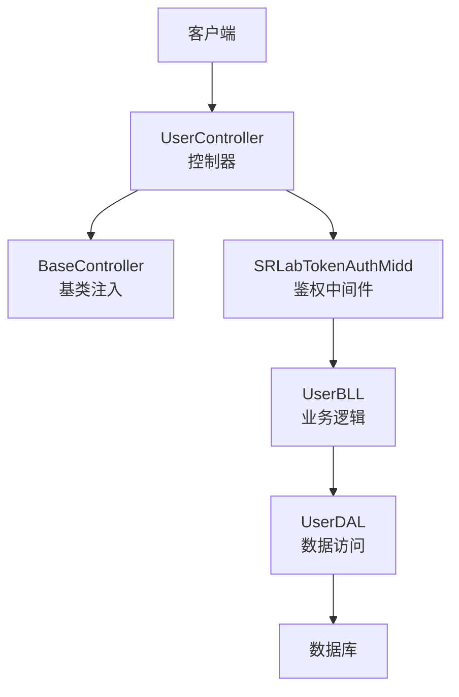
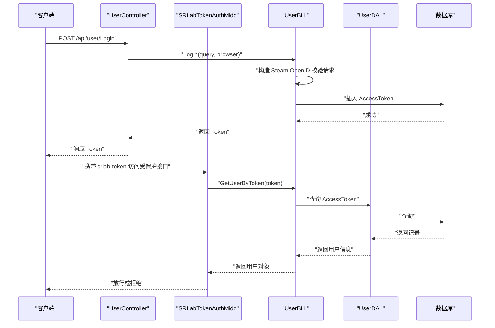
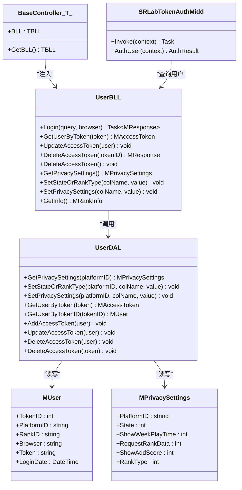
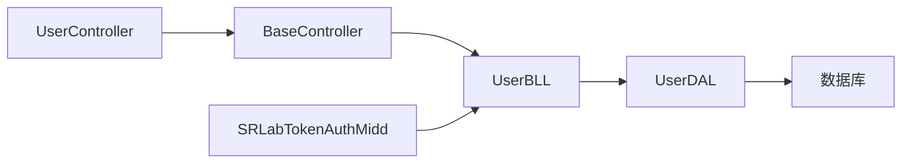

# 用户管理模块

<cite>
**本文引用的文件**
- [SpeedRunners.API/SpeedRunners/Controllers/UserController.cs](file://SpeedRunners.API/SpeedRunners/Controllers/UserController.cs)
- [SpeedRunners.API/SpeedRunners/Controllers/BaseController.cs](file://SpeedRunners.API/SpeedRunners/Controllers/BaseController.cs)
- [SpeedRunners.API/SpeedRunners/Middleware/SRLabTokenAuthMidd.cs](file://SpeedRunners.API/SpeedRunners/Middleware/SRLabTokenAuthMidd.cs)
- [SpeedRunners.API/SpeedRunners.BLL/UserBLL.cs](file://SpeedRunners.API/SpeedRunners.BLL/UserBLL.cs)
- [SpeedRunners.API/SpeedRunners.DAL/UserDAL.cs](file://SpeedRunners.API/SpeedRunners.DAL/UserDAL.cs)
- [SpeedRunners.API/SpeedRunners.Model/MUser.cs](file://SpeedRunners.API/SpeedRunners.Model/MUser.cs)
- [SpeedRunners.API/SpeedRunners.Model/User/MPrivacySettings.cs](file://SpeedRunners.API/SpeedRunners.Model/User/MPrivacySettings.cs)
</cite>

## 目录
1. [简介](#简介)
2. [项目结构](#项目结构)
3. [核心组件](#核心组件)
4. [架构总览](#架构总览)
5. [详细组件分析](#详细组件分析)
6. [依赖关系分析](#依赖关系分析)
7. [性能与安全考量](#性能与安全考量)
8. [故障排查指南](#故障排查指南)
9. [结论](#结论)
10. [附录：API 接口文档](#附录api-接口文档)

## 简介
本技术文档聚焦于用户管理模块，覆盖用户认证流程（Steam OpenID）、OAuth 集成、令牌管理、用户信息与隐私设置、以及业务逻辑层设计。文档以 UserController、UserBLL、UserDAL、自定义中间件与模型类为依据，梳理从请求到数据库的完整链路，并提供面向开发者的可操作建议与最佳实践。

## 项目结构
用户管理相关代码主要分布在以下层次：
- 控制器层：UserController 提供登录、登出、隐私设置等接口入口
- 业务逻辑层：UserBLL 实现登录校验、令牌持久化、隐私设置更新、令牌查询与删除
- 数据访问层：UserDAL 负责令牌、隐私设置、等级信息等数据读写
- 中间件层：SRLabTokenAuthMidd 实现基于 srlab-token 的统一鉴权
- 模型层：MUser、MPrivacySettings 等承载用户与隐私配置的数据结构

图表来源
- [SpeedRunners.API/SpeedRunners/Controllers/UserController.cs](file://SpeedRunners.API/SpeedRunners/Controllers/UserController.cs#L10-L56)
- [SpeedRunners.API/SpeedRunners/Controllers/BaseController.cs](file://SpeedRunners.API/SpeedRunners/Controllers/BaseController.cs#L10-L23)
- [SpeedRunners.API/SpeedRunners/Middleware/SRLabTokenAuthMidd.cs](file://SpeedRunners.API/SpeedRunners/Middleware/SRLabTokenAuthMidd.cs#L31-L101)
- [SpeedRunners.API/SpeedRunners.BLL/UserBLL.cs](file://SpeedRunners.API/SpeedRunners.BLL/UserBLL.cs#L16-L24)
- [SpeedRunners.API/SpeedRunners.DAL/UserDAL.cs](file://SpeedRunners.API/SpeedRunners.DAL/UserDAL.cs#L9-L11)

章节来源
- [SpeedRunners.API/SpeedRunners/Controllers/UserController.cs](file://SpeedRunners.API/SpeedRunners/Controllers/UserController.cs#L10-L56)
- [SpeedRunners.API/SpeedRunners/Controllers/BaseController.cs](file://SpeedRunners.API/SpeedRunners/Controllers/BaseController.cs#L10-L23)
- [SpeedRunners.API/SpeedRunners/Middleware/SRLabTokenAuthMidd.cs](file://SpeedRunners.API/SpeedRunners/Middleware/SRLabTokenAuthMidd.cs#L31-L101)
- [SpeedRunners.API/SpeedRunners.BLL/UserBLL.cs](file://SpeedRunners.API/SpeedRunners.BLL/UserBLL.cs#L16-L24)
- [SpeedRunners.API/SpeedRunners.DAL/UserDAL.cs](file://SpeedRunners.API/SpeedRunners.DAL/UserDAL.cs#L9-L11)

## 核心组件
- 控制器 UserController：暴露登录、登出、隐私设置等接口，标注 [User] 特性表示需鉴权
- 基类 BaseController：负责按需注入 BLL、本地化资源、以及将当前用户上下文传递给 BLL
- 中间件 SRLabTokenAuthMidd：从请求头 srlab-token 取令牌，调用 UserBLL 查询用户并写入服务容器
- 业务逻辑 UserBLL：实现 Steam OpenID 校验、生成令牌、持久化令牌、查询与删除令牌、隐私设置更新
- 数据访问 UserDAL：封装隐私设置初始化、查询、更新，以及令牌增删改查
- 模型 MUser、MPrivacySettings：承载用户令牌与隐私配置字段

章节来源
- [SpeedRunners.API/SpeedRunners/Controllers/UserController.cs](file://SpeedRunners.API/SpeedRunners/Controllers/UserController.cs#L12-L56)
- [SpeedRunners.API/SpeedRunners/Controllers/BaseController.cs](file://SpeedRunners.API/SpeedRunners/Controllers/BaseController.cs#L14-L23)
- [SpeedRunners.API/SpeedRunners/Middleware/SRLabTokenAuthMidd.cs](file://SpeedRunners.API/SpeedRunners/Middleware/SRLabTokenAuthMidd.cs#L54-L101)
- [SpeedRunners.API/SpeedRunners.BLL/UserBLL.cs](file://SpeedRunners.API/SpeedRunners.BLL/UserBLL.cs#L60-L93)
- [SpeedRunners.API/SpeedRunners.DAL/UserDAL.cs](file://SpeedRunners.API/SpeedRunners.DAL/UserDAL.cs#L13-L51)
- [SpeedRunners.API/SpeedRunners.Model/MUser.cs](file://SpeedRunners.API/SpeedRunners.Model/MUser.cs#L8-L33)
- [SpeedRunners.API/SpeedRunners.Model/User/MPrivacySettings.cs](file://SpeedRunners.API/SpeedRunners.Model/User/MPrivacySettings.cs#L7-L21)

## 架构总览
下图展示一次典型“登录”请求的端到端流程，包括 Steam OpenID 校验、令牌生成与持久化、以及后续接口访问的鉴权过程。

图表来源
- [SpeedRunners.API/SpeedRunners/Controllers/UserController.cs](file://SpeedRunners.API/SpeedRunners/Controllers/UserController.cs#L42-L47)
- [SpeedRunners.API/SpeedRunners/Middleware/SRLabTokenAuthMidd.cs](file://SpeedRunners.API/SpeedRunners/Middleware/SRLabTokenAuthMidd.cs#L54-L101)
- [SpeedRunners.API/SpeedRunners.BLL/UserBLL.cs](file://SpeedRunners.API/SpeedRunners.BLL/UserBLL.cs#L60-L93)
- [SpeedRunners.API/SpeedRunners.DAL/UserDAL.cs](file://SpeedRunners.API/SpeedRunners.DAL/UserDAL.cs#L53-L61)

## 详细组件分析

### 控制器层：UserController
- 登录接口：接收 Steam OpenID 回调参数，调用 BLL.Login 并返回 Token
- 登出接口：
  - LogoutOther：按 TokenID 删除其他会话（需权限校验）
  - LogoutLocal：删除当前会话令牌
- 隐私设置接口：SetState、SetRankType、SetShowWeekPlayTime、SetRequestRankData、SetShowAddScore
- 用户信息接口：GetInfo、GetPrivacySettings

章节来源
- [SpeedRunners.API/SpeedRunners/Controllers/UserController.cs](file://SpeedRunners.API/SpeedRunners/Controllers/UserController.cs#L14-L56)

### 基类：BaseController
- 注入泛型 BLL 实例与本地化资源
- 将当前用户上下文（MUser）注入到 BLL，便于业务层直接使用 CurrentUser

章节来源
- [SpeedRunners.API/SpeedRunners/Controllers/BaseController.cs](file://SpeedRunners.API/SpeedRunners/Controllers/BaseController.cs#L14-L23)

### 中间件：SRLabTokenAuthMidd
- 通过请求头 srlab-token 进行鉴权
- 识别接口是否标注 [User] 或 [Persona] 特性决定是否强制鉴权
- 若令牌有效，将用户信息写入服务容器，供后续控制器与业务层使用

章节来源
- [SpeedRunners.API/SpeedRunners/Middleware/SRLabTokenAuthMidd.cs](file://SpeedRunners.API/SpeedRunners/Middleware/SRLabTokenAuthMidd.cs#L54-L101)

### 业务逻辑：UserBLL
- 登录流程：替换 openid.mode 为 check_authentication，向 Steam 发起校验，校验通过后生成 Token 并持久化
- 令牌查询：支持主令牌与备用令牌（ExToken）查询，并对过期刷新窗口做判断
- 令牌更新与删除：支持更新令牌与按 TokenID 删除其他会话，含权限与级别校验
- 隐私设置：封装隐私字段更新与联动逻辑（如 RequestRankData 开启时联动 RankType）

章节来源
- [SpeedRunners.API/SpeedRunners.BLL/UserBLL.cs](file://SpeedRunners.API/SpeedRunners.BLL/UserBLL.cs#L60-L93)
- [SpeedRunners.API/SpeedRunners.BLL/UserBLL.cs](file://SpeedRunners.API/SpeedRunners.BLL/UserBLL.cs#L95-L150)

### 数据访问：UserDAL
- 隐私设置：若不存在则初始化默认记录，随后联合 RankInfo 与 PrivacySettings 返回聚合结果
- 更新：支持 RankType 与隐私字段更新，必要时联动更新 RankType
- 令牌：提供按令牌、按 TokenID 的查询、新增、更新、删除

章节来源
- [SpeedRunners.API/SpeedRunners.DAL/UserDAL.cs](file://SpeedRunners.API/SpeedRunners.DAL/UserDAL.cs#L13-L51)
- [SpeedRunners.API/SpeedRunners.DAL/UserDAL.cs](file://SpeedRunners.API/SpeedRunners.DAL/UserDAL.cs#L53-L82)

### 模型：MUser、MPrivacySettings
- MUser：令牌、平台 ID、浏览器、登录时间等
- MPrivacySettings：平台 ID、状态、RankType、各隐私开关字段

章节来源
- [SpeedRunners.API/SpeedRunners.Model/MUser.cs](file://SpeedRunners.API/SpeedRunners.Model/MUser.cs#L8-L33)
- [SpeedRunners.API/SpeedRunners.Model/User/MPrivacySettings.cs](file://SpeedRunners.API/SpeedRunners.Model/User/MPrivacySettings.cs#L7-L21)

### 类关系图

图表来源
- [SpeedRunners.API/SpeedRunners/Controllers/BaseController.cs](file://SpeedRunners.API/SpeedRunners/Controllers/BaseController.cs#L10-L23)
- [SpeedRunners.API/SpeedRunners/Middleware/SRLabTokenAuthMidd.cs](file://SpeedRunners.API/SpeedRunners/Middleware/SRLabTokenAuthMidd.cs#L18-L101)
- [SpeedRunners.API/SpeedRunners.BLL/UserBLL.cs](file://SpeedRunners.API/SpeedRunners.BLL/UserBLL.cs#L16-L24)
- [SpeedRunners.API/SpeedRunners.DAL/UserDAL.cs](file://SpeedRunners.API/SpeedRunners.DAL/UserDAL.cs#L9-L11)
- [SpeedRunners.API/SpeedRunners.Model/MUser.cs](file://SpeedRunners.API/SpeedRunners.Model/MUser.cs#L8-L33)
- [SpeedRunners.API/SpeedRunners.Model/User/MPrivacySettings.cs](file://SpeedRunners.API/SpeedRunners.Model/User/MPrivacySettings.cs#L7-L21)

## 依赖关系分析
- 控制器依赖基类注入的 BLL，基类再将当前用户上下文注入 BLL
- 中间件在请求进入管线时执行鉴权，成功后将用户信息写入服务容器
- 业务层依赖数据层完成数据库操作
- 数据层依赖通用 DbHelper 执行 SQL

图表来源
- [SpeedRunners.API/SpeedRunners/Controllers/UserController.cs](file://SpeedRunners.API/SpeedRunners/Controllers/UserController.cs#L12-L16)
- [SpeedRunners.API/SpeedRunners/Controllers/BaseController.cs](file://SpeedRunners.API/SpeedRunners/Controllers/BaseController.cs#L14-L23)
- [SpeedRunners.API/SpeedRunners/Middleware/SRLabTokenAuthMidd.cs](file://SpeedRunners.API/SpeedRunners/Middleware/SRLabTokenAuthMidd.cs#L78-L100)
- [SpeedRunners.API/SpeedRunners.BLL/UserBLL.cs](file://SpeedRunners.API/SpeedRunners.BLL/UserBLL.cs#L16-L24)
- [SpeedRunners.API/SpeedRunners.DAL/UserDAL.cs](file://SpeedRunners.API/SpeedRunners.DAL/UserDAL.cs#L9-L11)

## 性能与安全考量
- 登录超时处理：Steam 校验网络异常时返回特定失败码，避免长时间阻塞
- 令牌刷新窗口：对 ExToken 的有效期进行分钟级校验，防止过期令牌被误用
- 权限控制：删除其他会话时校验平台 ID 与登录时间顺序，防止越权操作
- 数据一致性：隐私设置缺失时自动初始化默认记录，避免空值导致的查询异常
- 安全建议：
  - 建议将令牌存储在安全的 HttpOnly Cookie 中，减少 XSS 风险
  - 对外部 OpenID 校验接口增加超时与重试策略
  - 在生产环境启用 HTTPS，确保令牌传输安全

章节来源
- [SpeedRunners.API/SpeedRunners.BLL/UserBLL.cs](file://SpeedRunners.API/SpeedRunners.BLL/UserBLL.cs#L60-L93)
- [SpeedRunners.API/SpeedRunners.BLL/UserBLL.cs](file://SpeedRunners.API/SpeedRunners.BLL/UserBLL.cs#L95-L110)
- [SpeedRunners.API/SpeedRunners.BLL/UserBLL.cs](file://SpeedRunners.API/SpeedRunners.BLL/UserBLL.cs#L121-L140)
- [SpeedRunners.API/SpeedRunners.DAL/UserDAL.cs](file://SpeedRunners.API/SpeedRunners.DAL/UserDAL.cs#L13-L35)

## 故障排查指南
- 未登录访问受保护接口：中间件返回“未登录”错误，确认是否正确携带 srlab-token
- 登录超时：Steam 校验网络异常时返回特定失败码，检查网络连通性与超时配置
- 删除会话失败：若返回“权限不足”或“权限过低”，确认当前会话与目标会话的登录时间顺序
- 隐私设置未生效：确认字段名大小写与联动逻辑（如开启 RequestRankData 会联动 RankType）

章节来源
- [SpeedRunners.API/SpeedRunners/Middleware/SRLabTokenAuthMidd.cs](file://SpeedRunners.API/SpeedRunners/Middleware/SRLabTokenAuthMidd.cs#L42-L46)
- [SpeedRunners.API/SpeedRunners.BLL/UserBLL.cs](file://SpeedRunners.API/SpeedRunners.BLL/UserBLL.cs#L60-L73)
- [SpeedRunners.API/SpeedRunners.BLL/UserBLL.cs](file://SpeedRunners.API/SpeedRunners.BLL/UserBLL.cs#L121-L140)
- [SpeedRunners.API/SpeedRunners.DAL/UserDAL.cs](file://SpeedRunners.API/SpeedRunners.DAL/UserDAL.cs#L42-L51)

## 结论
用户管理模块采用清晰的分层架构：控制器负责接口编排，中间件负责统一鉴权，业务层封装登录、令牌与隐私设置的核心逻辑，数据层专注数据存取。模块已实现基于 Steam OpenID 的认证、令牌的生成与持久化、以及细粒度的隐私设置管理。建议在生产环境中进一步强化令牌存储与传输安全，并完善外部依赖的容错与监控。

## 附录：API 接口文档

- 登录
  - 方法与路径：POST /api/user/Login
  - 请求头：Content-Type: application/json
  - 请求体字段：
    - query：Steam OpenID 回调参数字符串
  - 成功响应字段：
    - Token：登录成功后返回的令牌
  - 失败响应字段：
    - message：错误信息
    - code：错误码（如登录超时返回特定码）

- 获取用户信息
  - 方法与路径：GET /api/user/GetInfo
  - 需要令牌：是
  - 响应：用户等级相关信息

- 获取隐私设置
  - 方法与路径：GET /api/user/GetPrivacySettings
  - 需要令牌：是
  - 响应：隐私设置对象（包含各隐私开关与 RankType）

- 设置状态
  - 方法与路径：POST /api/user/SetState
  - 需要令牌：是
  - 请求体字段：
    - value：整数（状态值）

- 设置等级类型
  - 方法与路径：POST /api/user/SetRankType
  - 需要令牌：是
  - 请求体字段：
    - value：整数（等级类型）

- 设置隐私：显示周游玩时长
  - 方法与路径：POST /api/user/SetShowWeekPlayTime
  - 需要令牌：是
  - 请求体字段：
    - value：整数（0/1）

- 设置隐私：请求排行数据
  - 方法与路径：POST /api/user/SetRequestRankData
  - 需要令牌：是
  - 请求体字段：
    - value：整数（0/1）
  - 说明：开启时会联动 RankType

- 设置隐私：显示加分
  - 方法与路径：POST /api/user/SetShowAddScore
  - 需要令牌：是
  - 请求体字段：
    - value：整数（0/1）

- 其他会话登出
  - 方法与路径：GET /api/user/LogoutOther/{tokenID}
  - 需要令牌：是
  - 参数：
    - tokenID：目标会话的 TokenID

- 本地会话登出
  - 方法与路径：GET /api/user/LogoutLocal
  - 需要令牌：是

- 通用响应结构
  - 成功：
    - code：0
    - message：成功信息
    - data：具体数据（如 Token）
  - 失败：
    - code：非0错误码
    - message：错误信息

- 错误码参考
  - -555：登录超时
  - -401：权限不足（低权限）
  - 其他：根据本地化消息映射的具体错误码

章节来源
- [SpeedRunners.API/SpeedRunners/Controllers/UserController.cs](file://SpeedRunners.API/SpeedRunners/Controllers/UserController.cs#L42-L56)
- [SpeedRunners.API/SpeedRunners.BLL/UserBLL.cs](file://SpeedRunners.API/SpeedRunners.BLL/UserBLL.cs#L60-L93)
- [SpeedRunners.API/SpeedRunners.BLL/UserBLL.cs](file://SpeedRunners.API/SpeedRunners.BLL/UserBLL.cs#L121-L140)
- [SpeedRunners.API/SpeedRunners.DAL/UserDAL.cs](file://SpeedRunners.API/SpeedRunners.DAL/UserDAL.cs#L13-L51)
- [SpeedRunners.API/SpeedRunners/Middleware/SRLabTokenAuthMidd.cs](file://SpeedRunners.API/SpeedRunners/Middleware/SRLabTokenAuthMidd.cs#L42-L46)