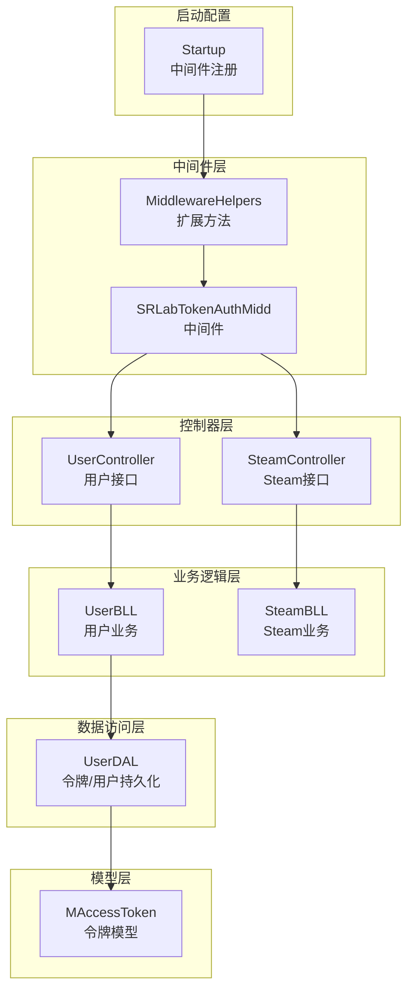
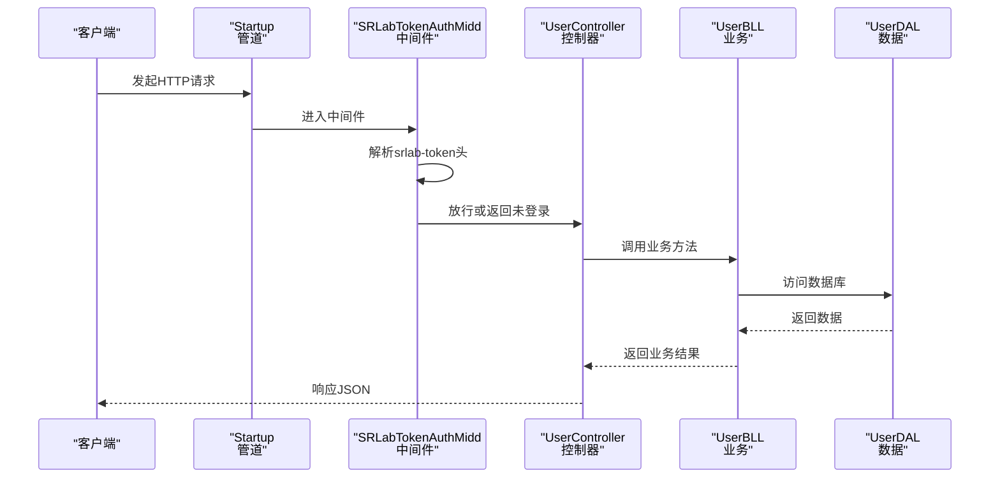
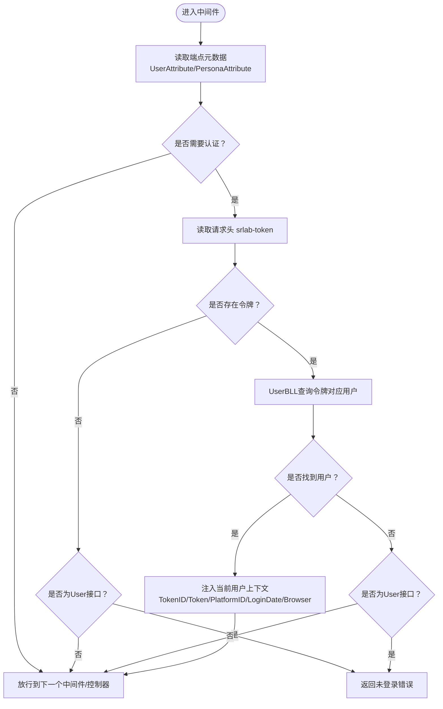
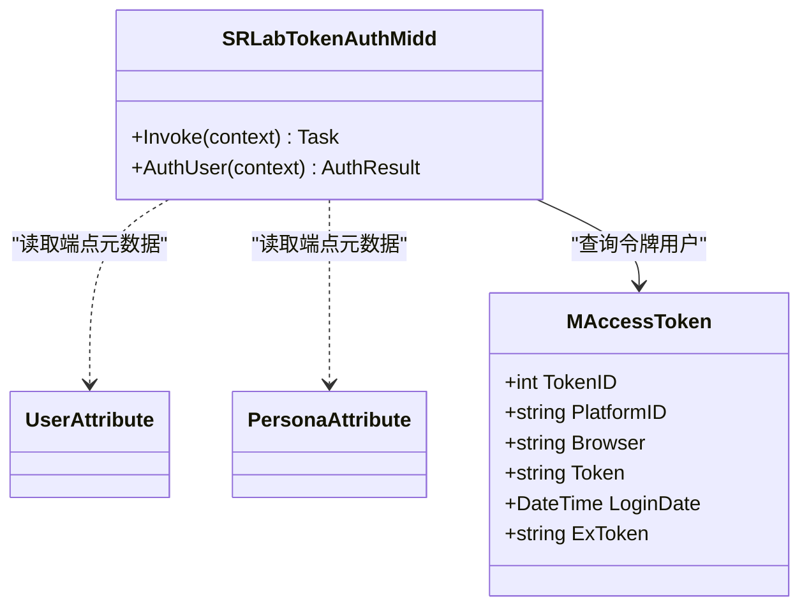
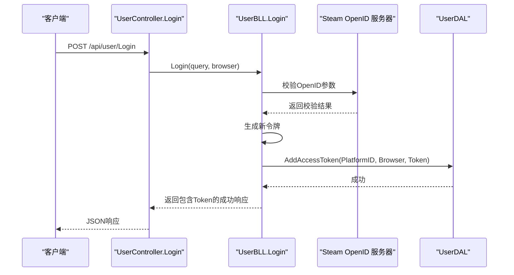
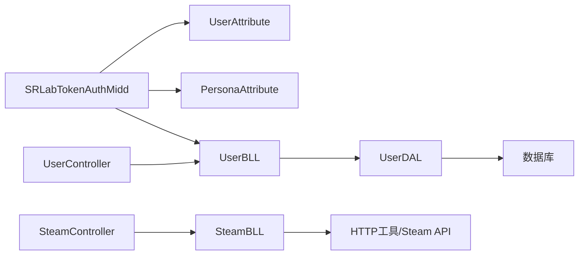

# 用户认证与授权

<cite>
**本文引用的文件**
- [SRLabTokenAuthMidd.cs](file://SpeedRunners.API/SpeedRunners/Middleware/SRLabTokenAuthMidd.cs)
- [MiddlewareHelpers.cs](file://SpeedRunners.API/SpeedRunners/Middleware/MiddlewareHelpers.cs)
- [Startup.cs](file://SpeedRunners.API/SpeedRunners/Startup.cs)
- [UserController.cs](file://SpeedRunners.API/SpeedRunners/Controllers/UserController.cs)
- [SteamController.cs](file://SpeedRunners.API/SpeedRunners/Controllers/SteamController.cs)
- [UserBLL.cs](file://SpeedRunners.API/SpeedRunners.BLL/UserBLL.cs)
- [SteamBLL.cs](file://SpeedRunners.API/SpeedRunners.BLL/SteamBLL.cs)
- [UserDAL.cs](file://SpeedRunners.API/SpeedRunners.DAL/UserDAL.cs)
- [MAccessToken.cs](file://SpeedRunners.API/SpeedRunners.Model/User/MAccessToken.cs)
- [UserAttribute.cs](file://SpeedRunners.API/SpeedRunners.Model/UserAttribute.cs)
- [PersonaAttribute.cs](file://SpeedRunners.API/SpeedRunners.Model/PersonaAttribute.cs)
</cite>

## 目录
1. [简介](#简介)
2. [项目结构](#项目结构)
3. [核心组件](#核心组件)
4. [架构总览](#架构总览)
5. [详细组件分析](#详细组件分析)
6. [依赖关系分析](#依赖关系分析)
7. [性能考虑](#性能考虑)
8. [故障排查指南](#故障排查指南)
9. [结论](#结论)
10. [附录：认证 API 接口规范](#附录认证-api-接口规范)

## 简介
本文件面向开发者，系统性阐述 SpeedRunnersLab 的用户认证与授权实现，重点覆盖：
- 基于 Steam OpenID 的登录流程与令牌生成
- 自定义中间件 SRLabTokenAuthMidd 的请求拦截、令牌解析与权限校验
- 用户会话管理、多设备登录控制与令牌失效处理
- 完整认证相关 API 的请求参数、响应格式与错误处理
- 安全最佳实践与扩展建议

## 项目结构
认证相关能力主要分布在以下层次：
- 中间件层：自定义授权中间件与中间件扩展方法
- 控制器层：用户与 Steam 相关接口
- 业务逻辑层：用户与 Steam 业务逻辑封装
- 数据访问层：令牌与用户信息的持久化
- 模型层：令牌与用户信息的数据模型
- 启动配置：中间件注册与管线装配

图表来源
- [Startup.cs](file://SpeedRunners.API/SpeedRunners/Startup.cs#L64-L84)
- [MiddlewareHelpers.cs](file://SpeedRunners.API/SpeedRunners/Middleware/MiddlewareHelpers.cs#L16-L19)
- [SRLabTokenAuthMidd.cs](file://SpeedRunners.API/SpeedRunners/Middleware/SRLabTokenAuthMidd.cs#L31-L47)
- [UserController.cs](file://SpeedRunners.API/SpeedRunners/Controllers/UserController.cs#L12-L56)
- [SteamController.cs](file://SpeedRunners.API/SpeedRunners/Controllers/SteamController.cs#L8-L27)
- [UserBLL.cs](file://SpeedRunners.API/SpeedRunners.BLL/UserBLL.cs#L60-L93)
- [SteamBLL.cs](file://SpeedRunners.API/SpeedRunners.BLL/SteamBLL.cs#L113-L135)
- [UserDAL.cs](file://SpeedRunners.API/SpeedRunners.DAL/UserDAL.cs#L53-L82)
- [MAccessToken.cs](file://SpeedRunners.API/SpeedRunners.Model/User/MAccessToken.cs#L7-L15)

章节来源
- [Startup.cs](file://SpeedRunners.API/SpeedRunners/Startup.cs#L64-L84)
- [MiddlewareHelpers.cs](file://SpeedRunners.API/SpeedRunners/Middleware/MiddlewareHelpers.cs#L16-L19)

## 核心组件
- 自定义授权中间件 SRLabTokenAuthMidd：在请求进入控制器前进行认证判定，解析令牌并注入当前用户上下文
- 用户控制器 UserController：提供登录、登出（单设备/其他设备）、隐私设置与用户信息接口
- 用户业务逻辑 UserBLL：实现 Steam OpenID 校验、令牌生成与存储、令牌查询与更新、令牌删除
- 数据访问 UserDAL：提供令牌、用户信息的增删改查
- 模型 MAccessToken：令牌与用户信息的数据载体
- 属性 UserAttribute/PersonaAttribute：用于标记接口是否需要登录或个性化返回

章节来源
- [SRLabTokenAuthMidd.cs](file://SpeedRunners.API/SpeedRunners/Middleware/SRLabTokenAuthMidd.cs#L18-L101)
- [UserAttribute.cs](file://SpeedRunners.API/SpeedRunners.Model/UserAttribute.cs#L8-L11)
- [PersonaAttribute.cs](file://SpeedRunners.API/SpeedRunners.Model/PersonaAttribute.cs#L8-L11)
- [UserController.cs](file://SpeedRunners.API/SpeedRunners/Controllers/UserController.cs#L12-L56)
- [UserBLL.cs](file://SpeedRunners.API/SpeedRunners.BLL/UserBLL.cs#L60-L150)
- [UserDAL.cs](file://SpeedRunners.API/SpeedRunners.DAL/UserDAL.cs#L53-L82)
- [MAccessToken.cs](file://SpeedRunners.API/SpeedRunners.Model/User/MAccessToken.cs#L7-L15)

## 架构总览
下图展示从客户端发起请求到控制器执行的完整链路，以及中间件如何在管线中拦截并进行认证。

图表来源
- [Startup.cs](file://SpeedRunners.API/SpeedRunners/Startup.cs#L76-L76)
- [SRLabTokenAuthMidd.cs](file://SpeedRunners.API/SpeedRunners/Middleware/SRLabTokenAuthMidd.cs#L31-L47)
- [UserController.cs](file://SpeedRunners.API/SpeedRunners/Controllers/UserController.cs#L42-L47)
- [UserBLL.cs](file://SpeedRunners.API/SpeedRunners.BLL/UserBLL.cs#L60-L93)
- [UserDAL.cs](file://SpeedRunners.API/SpeedRunners.DAL/UserDAL.cs#L53-L82)

## 详细组件分析

### 中间件：SRLabTokenAuthMidd
- 请求拦截与判定
  - 读取请求端点元数据，识别是否标注了 UserAttribute 或 PersonaAttribute
  - 若均未标注，视为“不需要认证”
  - 若标注 UserAttribute 且缺少令牌，直接返回未登录
  - 若标注 PersonaAttribute 且缺少令牌，允许放行但不注入用户上下文
- 令牌解析与用户上下文注入
  - 从请求头 srlab-token 获取令牌
  - 通过 UserBLL 查询令牌对应的用户信息
  - 将浏览器信息、令牌ID、令牌、平台ID、登录时间等写入当前 MUser 上下文
- 结果返回
  - 认证成功：继续后续管线
  - 认证失败：返回统一错误响应

图表来源
- [SRLabTokenAuthMidd.cs](file://SpeedRunners.API/SpeedRunners/Middleware/SRLabTokenAuthMidd.cs#L31-L101)
- [UserAttribute.cs](file://SpeedRunners.API/SpeedRunners.Model/UserAttribute.cs#L8-L11)
- [PersonaAttribute.cs](file://SpeedRunners.API/SpeedRunners.Model/PersonaAttribute.cs#L8-L11)
- [UserBLL.cs](file://SpeedRunners.API/SpeedRunners.BLL/UserBLL.cs#L95-L111)
- [UserDAL.cs](file://SpeedRunners.API/SpeedRunners.DAL/UserDAL.cs#L53-L56)

章节来源
- [SRLabTokenAuthMidd.cs](file://SpeedRunners.API/SpeedRunners/Middleware/SRLabTokenAuthMidd.cs#L31-L101)

### 类关系图：中间件与属性、模型

图表来源
- [SRLabTokenAuthMidd.cs](file://SpeedRunners.API/SpeedRunners/Middleware/SRLabTokenAuthMidd.cs#L54-L101)
- [UserAttribute.cs](file://SpeedRunners.API/SpeedRunners.Model/UserAttribute.cs#L8-L11)
- [PersonaAttribute.cs](file://SpeedRunners.API/SpeedRunners.Model/PersonaAttribute.cs#L8-L11)
- [MAccessToken.cs](file://SpeedRunners.API/SpeedRunners.Model/User/MAccessToken.cs#L7-L15)

### 登录流程（Steam OpenID）
- 客户端向 UserController.Login 提交 Steam OpenID 参数
- 业务层调用 HTTP 工具向 Steam OpenID 服务器发起校验
- 校验通过后提取 Steam 平台ID，生成新令牌并入库
- 返回统一响应，包含新令牌

图表来源
- [UserController.cs](file://SpeedRunners.API/SpeedRunners/Controllers/UserController.cs#L42-L47)
- [UserBLL.cs](file://SpeedRunners.API/SpeedRunners.BLL/UserBLL.cs#L60-L93)
- [UserDAL.cs](file://SpeedRunners.API/SpeedRunners.DAL/UserDAL.cs#L63-L67)

章节来源
- [UserBLL.cs](file://SpeedRunners.API/SpeedRunners.BLL/UserBLL.cs#L60-L93)

### 令牌生成与存储
- 令牌生成：使用通用工具生成唯一令牌
- 存储字段：平台ID、浏览器、令牌字符串、登录时间
- 数据库表：AccessToken，包含 TokenID、PlatformID、Browser、Token、LoginDate、ExToken

章节来源
- [UserBLL.cs](file://SpeedRunners.API/SpeedRunners.BLL/UserBLL.cs#L77-L87)
- [UserDAL.cs](file://SpeedRunners.API/SpeedRunners.DAL/UserDAL.cs#L63-L67)
- [MAccessToken.cs](file://SpeedRunners.API/SpeedRunners.Model/User/MAccessToken.cs#L7-L15)

### 令牌解析与有效期控制
- 查询逻辑：同时支持 Token 与 ExToken 匹配
- 刷新窗口：当 ExToken 存在时，根据配置的 Refresh 分钟数判断是否过期
- 过期策略：超过刷新窗口则返回空，阻止继续使用

章节来源
- [UserBLL.cs](file://SpeedRunners.API/SpeedRunners.BLL/UserBLL.cs#L95-L111)

### 登出与多设备控制
- 单设备登出：根据当前令牌删除记录，并清空当前用户上下文
- 其他设备登出：按 TokenID 删除指定令牌，校验权限与登录时间顺序，防止越权与低权限操作

章节来源
- [UserController.cs](file://SpeedRunners.API/SpeedRunners/Controllers/UserController.cs#L49-L55)
- [UserBLL.cs](file://SpeedRunners.API/SpeedRunners.BLL/UserBLL.cs#L121-L150)
- [UserDAL.cs](file://SpeedRunners.API/SpeedRunners.DAL/UserDAL.cs#L74-L82)

### Steam 集成
- 提供玩家搜索、列表、在线人数统计等接口
- 内部使用 Steam Web API 与社区接口，结合本地化语言头返回中文翻译后的统计数据

章节来源
- [SteamController.cs](file://SpeedRunners.API/SpeedRunners/Controllers/SteamController.cs#L8-L27)
- [SteamBLL.cs](file://SpeedRunners.API/SpeedRunners.BLL/SteamBLL.cs#L113-L135)
- [SteamBLL.cs](file://SpeedRunners.API/SpeedRunners.BLL/SteamBLL.cs#L209-L237)

## 依赖关系分析
- 中间件依赖
  - 通过端点元数据判断是否需要认证
  - 通过 UserBLL 查询令牌用户
  - 通过 MUser 注入当前用户上下文
- 控制器依赖
  - UserController 依赖 UserBLL
  - SteamController 依赖 SteamBLL
- 业务层依赖
  - UserBLL 依赖 UserDAL
  - SteamBLL 依赖外部 Steam API 与 HTTP 工具
- 数据层依赖
  - UserDAL 依赖数据库访问基类与参数化 SQL

图表来源
- [SRLabTokenAuthMidd.cs](file://SpeedRunners.API/SpeedRunners/Middleware/SRLabTokenAuthMidd.cs#L54-L101)
- [UserAttribute.cs](file://SpeedRunners.API/SpeedRunners.Model/UserAttribute.cs#L8-L11)
- [PersonaAttribute.cs](file://SpeedRunners.API/SpeedRunners.Model/PersonaAttribute.cs#L8-L11)
- [UserController.cs](file://SpeedRunners.API/SpeedRunners/Controllers/UserController.cs#L12-L56)
- [SteamController.cs](file://SpeedRunners.API/SpeedRunners/Controllers/SteamController.cs#L8-L27)
- [UserBLL.cs](file://SpeedRunners.API/SpeedRunners.BLL/UserBLL.cs#L16-L24)
- [SteamBLL.cs](file://SpeedRunners.API/SpeedRunners.BLL/SteamBLL.cs#L18-L23)
- [UserDAL.cs](file://SpeedRunners.API/SpeedRunners.DAL/UserDAL.cs#L9-L11)

章节来源
- [Startup.cs](file://SpeedRunners.API/SpeedRunners/Startup.cs#L76-L76)
- [MiddlewareHelpers.cs](file://SpeedRunners.API/SpeedRunners/Middleware/MiddlewareHelpers.cs#L16-L19)

## 性能考虑
- 中间件查询令牌仅一次，避免重复 IO
- Steam 接口采用异步调用，减少阻塞
- 多任务并发搜索玩家时优先返回游戏信息，缩短等待时间
- 建议
  - 对频繁查询的令牌建立缓存（如 Redis），降低数据库压力
  - 对 Steam API 增加超时与重试策略
  - 对令牌过期检查使用更细粒度的时间窗口与批量清理任务

## 故障排查指南
- 未登录访问受保护接口
  - 现象：返回未登录错误
  - 排查：确认请求头是否携带 srlab-token；确认接口是否标注 UserAttribute
- 令牌无效或过期
  - 现象：认证失败或无法获取用户信息
  - 排查：检查令牌是否存在于 AccessToken 表；若为 ExToken，确认刷新窗口是否过期
- 越权登出其他设备
  - 现象：权限不足或低权限错误
  - 排查：确认当前登录用户与目标 TokenID 所属用户一致；确认目标登录时间晚于当前登录时间
- Steam 接口异常
  - 现象：搜索或统计为空
  - 排查：检查 API Key 配置；确认网络代理与超时设置；查看日志定位具体异常

章节来源
- [SRLabTokenAuthMidd.cs](file://SpeedRunners.API/SpeedRunners/Middleware/SRLabTokenAuthMidd.cs#L43-L46)
- [UserBLL.cs](file://SpeedRunners.API/SpeedRunners.BLL/UserBLL.cs#L121-L140)
- [UserBLL.cs](file://SpeedRunners.API/SpeedRunners.BLL/UserBLL.cs#L104-L108)
- [SteamBLL.cs](file://SpeedRunners.API/SpeedRunners.BLL/SteamBLL.cs#L209-L237)

## 结论
本认证体系以中间件为核心，结合属性标注与业务层令牌管理，实现了基于 Steam OpenID 的登录、令牌生成与存储、多设备登出控制与令牌失效处理。通过清晰的职责分离与可扩展的中间件机制，开发者可以在此基础上进一步增强安全与性能。

## 附录：认证 API 接口规范

- 登录
  - 方法与路径：POST /api/user/Login
  - 请求头：Content-Type: application/json
  - 请求体参数
    - query: Steam OpenID 回调参数（字符串）
    - browser: 浏览器信息（由服务端自动读取，无需传入）
  - 成功响应
    - Token: 新生成的令牌字符串
    - 其他统一响应字段见统一响应模型
  - 错误
    - 登录超时：返回特定错误码与消息
    - 登录失败：返回失败消息

- 获取用户信息
  - 方法与路径：GET /api/user/GetInfo
  - 需要登录：是
  - 响应：用户等级、分数等聚合信息

- 获取隐私设置
  - 方法与路径：GET /api/user/GetPrivacySettings
  - 需要登录：是
  - 响应：隐私设置项

- 设置状态/段位类型
  - 方法与路径：POST /api/user/SetState 与 /api/user/SetRankType
  - 需要登录：是
  - 请求体参数
    - value: 整数值（状态或段位类型）

- 设置隐私选项
  - 方法与路径：POST /api/user/SetShowWeekPlayTime、/api/user/SetRequestRankData、/api/user/SetShowAddScore
  - 需要登录：是
  - 请求体参数
    - value: 整数值（开关类设置）

- 单设备登出
  - 方法与路径：GET /api/user/LogoutLocal
  - 需要登录：是
  - 行为：删除当前令牌并清空上下文

- 其他设备登出
  - 方法与路径：GET /api/user/LogoutOther/{tokenID}
  - 需要登录：是
  - 参数：tokenID（目标令牌ID）
  - 权限校验：仅允许删除同用户下的令牌，且目标令牌登录时间需晚于当前令牌

- Steam 搜索与统计
  - 搜索玩家
    - GET /api/steam/SearchPlayer/{keyWords}
  - 通过 CustomURL 搜索
    - GET /api/steam/SearchPlayerByUrl/{url}
  - 通过 SteamID64 搜索
    - GET /api/steam/SearchPlayerBySteamID64/{steamID64}
  - 获取玩家列表（需 sessionID 与页码）
    - GET /api/steam/GetPlayerList/{userName}/{sessionID}/{pageNo}
  - 获取在线人数
    - GET /api/steam/GetOnlineCount

章节来源
- [UserController.cs](file://SpeedRunners.API/SpeedRunners/Controllers/UserController.cs#L12-L56)
- [SteamController.cs](file://SpeedRunners.API/SpeedRunners/Controllers/SteamController.cs#L8-L27)
- [UserBLL.cs](file://SpeedRunners.API/SpeedRunners.BLL/UserBLL.cs#L60-L93)
- [UserBLL.cs](file://SpeedRunners.API/SpeedRunners.BLL/UserBLL.cs#L121-L150)
- [UserDAL.cs](file://SpeedRunners.API/SpeedRunners.DAL/UserDAL.cs#L53-L82)