# 隐私设置管理

<cite>
**本文档引用的文件**
- [UserController.cs](file://SpeedRunners.API/SpeedRunners/Controllers/UserController.cs)
- [UserBLL.cs](file://SpeedRunners.API/SpeedRunners.BLL/UserBLL.cs)
- [UserDAL.cs](file://SpeedRunners.API/SpeedRunners.DAL/UserDAL.cs)
- [MPrivacySettings.cs](file://SpeedRunners.API/SpeedRunners.Model/User/MPrivacySettings.cs)
- [RankDAL.cs](file://SpeedRunners.API/SpeedRunners.DAL/RankDAL.cs)
- [RankBLL.cs](file://SpeedRunners.API/SpeedRunners.BLL/RankBLL.cs)
- [privacySettings.vue](file://SpeedRunners.UI/src/views/other/privacySettings.vue)
- [user.js](file://SpeedRunners.UI/src/api/user.js)
- [tmdsr.sql](file://mysql-dump/tmdsr.sql)
</cite>

## 目录
1. [简介](#简介)
2. [项目结构](#项目结构)
3. [核心组件](#核心组件)
4. [架构概览](#架构概览)
5. [详细组件分析](#详细组件分析)
6. [依赖关系分析](#依赖关系分析)
7. [性能考虑](#性能考虑)
8. [故障排除指南](#故障排除指南)
9. [结论](#结论)

## 简介

隐私设置管理功能是SpeedRunnersLab项目中的重要组成部分，负责管理用户的隐私偏好设置。该功能允许用户控制其个人数据的可见性，包括周游玩时间显示、排名数据请求、加分显示等隐私控制项。

本系统采用三层架构设计，包括前端Vue.js界面层、后端.NET Core API层和MySQL数据库层。通过严格的权限控制和数据验证机制，确保用户隐私设置的安全性和有效性。

## 项目结构

SpeedRunnersLab项目采用标准的分层架构模式，主要分为以下层次：

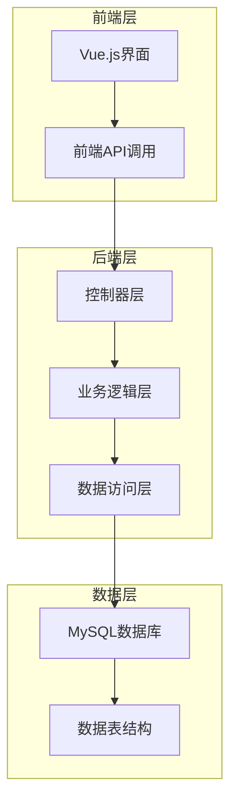

**图表来源**
- [UserController.cs](file://SpeedRunners.API/SpeedRunners/Controllers/UserController.cs#L1-L58)
- [UserBLL.cs](file://SpeedRunners.API/SpeedRunners.BLL/UserBLL.cs#L1-L153)
- [UserDAL.cs](file://SpeedRunners.API/SpeedRunners.DAL/UserDAL.cs#L1-L85)

**章节来源**
- [UserController.cs](file://SpeedRunners.API/SpeedRunners/Controllers/UserController.cs#L1-L58)
- [UserBLL.cs](file://SpeedRunners.API/SpeedRunners.BLL/UserBLL.cs#L1-L153)
- [UserDAL.cs](file://SpeedRunners.API/SpeedRunners.DAL/UserDAL.cs#L1-L85)

## 核心组件

### 数据模型设计

隐私设置功能的核心数据模型是MPrivacySettings类，它定义了用户隐私控制的所有属性：

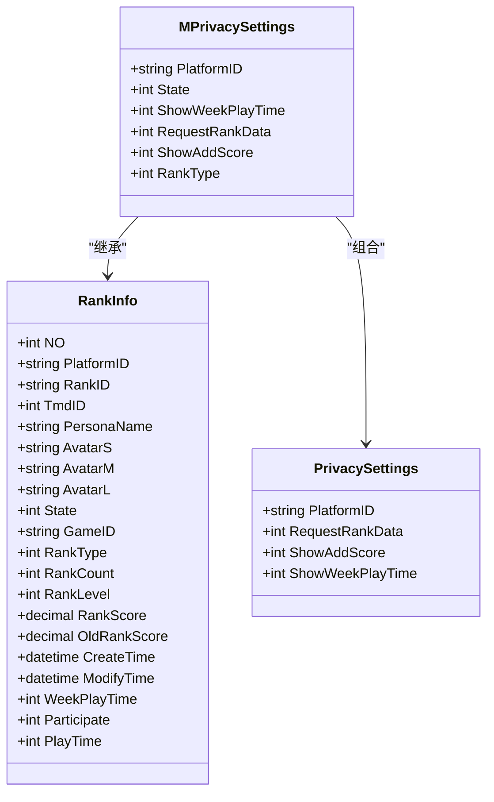

**图表来源**
- [MPrivacySettings.cs](file://SpeedRunners.API/SpeedRunners.Model/User/MPrivacySettings.cs#L1-L23)
- [tmdsr.sql](file://mysql-dump/tmdsr.sql#L372-L397)
- [tmdsr.sql](file://mysql-dump/tmdsr.sql#L552-L564)

### 前端界面组件

隐私设置界面采用Vue.js框架构建，提供了直观的用户交互体验：

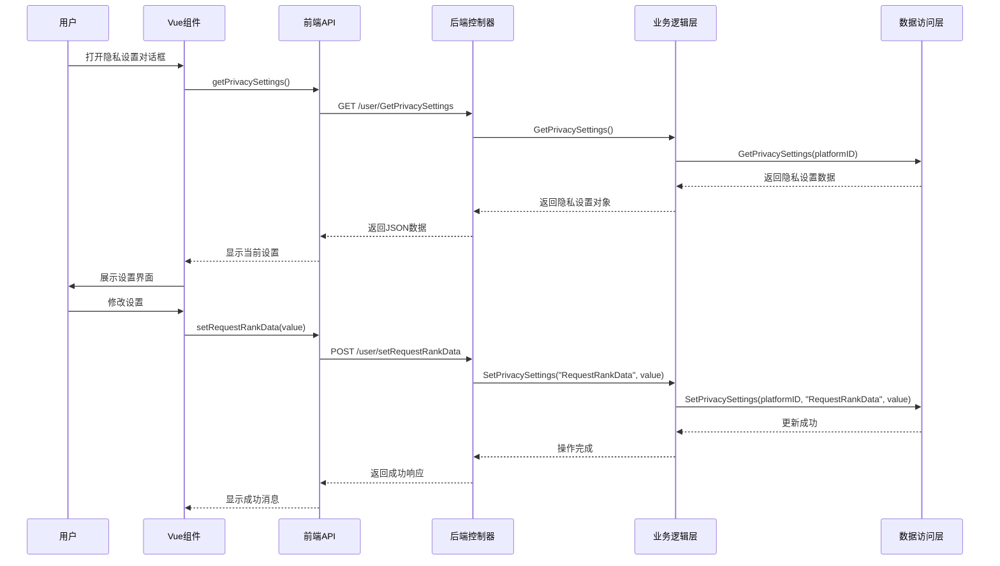

**图表来源**
- [privacySettings.vue](file://SpeedRunners.UI/src/views/other/privacySettings.vue#L1-L169)
- [user.js](file://SpeedRunners.UI/src/api/user.js#L1-L77)
- [UserController.cs](file://SpeedRunners.API/SpeedRunners/Controllers/UserController.cs#L18-L41)

**章节来源**
- [MPrivacySettings.cs](file://SpeedRunners.API/SpeedRunners.Model/User/MPrivacySettings.cs#L1-L23)
- [privacySettings.vue](file://SpeedRunners.UI/src/views/other/privacySettings.vue#L1-L169)
- [user.js](file://SpeedRunners.UI/src/api/user.js#L1-L77)

## 架构概览

隐私设置管理系统采用经典的三层架构模式，确保了良好的可维护性和扩展性：

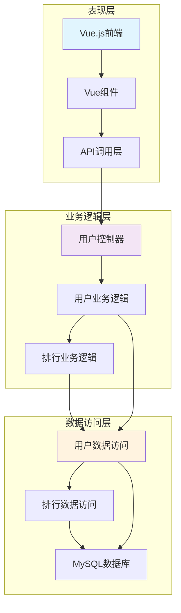

**图表来源**
- [UserController.cs](file://SpeedRunners.API/SpeedRunners/Controllers/UserController.cs#L1-L58)
- [UserBLL.cs](file://SpeedRunners.API/SpeedRunners.BLL/UserBLL.cs#L1-L153)
- [UserDAL.cs](file://SpeedRunners.API/SpeedRunners.DAL/UserDAL.cs#L1-L85)
- [RankBLL.cs](file://SpeedRunners.API/SpeedRunners.BLL/RankBLL.cs#L1-L210)

## 详细组件分析

### 控制器层实现

控制器层负责处理HTTP请求和响应，实现了隐私设置的所有API接口：

#### 用户控制器功能

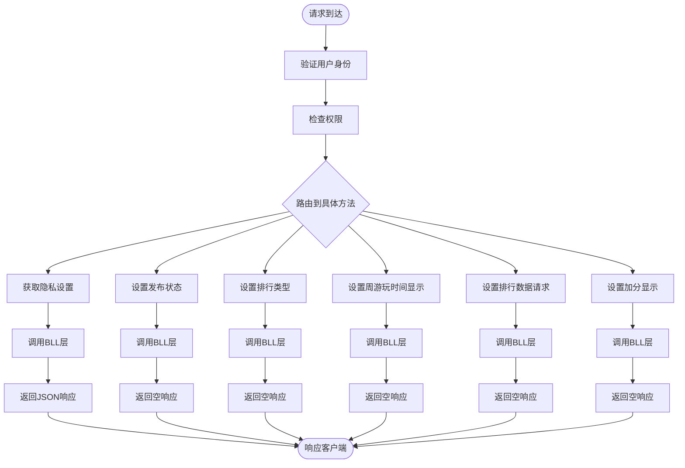

**图表来源**
- [UserController.cs](file://SpeedRunners.API/SpeedRunners/Controllers/UserController.cs#L14-L41)

#### 隐私设置API接口定义

| 接口名称 | HTTP方法 | URL路径 | 功能描述 | 参数 |
|---------|---------|--------|----------|------|
| GetPrivacySettings | GET | /user/GetPrivacySettings | 获取用户隐私设置 | 无 |
| SetState | POST | /user/SetState | 设置发布状态 | value(-1关闭, 0开启) |
| SetRankType | POST | /user/SetRankType | 设置排行类型 | value(1开启, 2关闭) |
| SetShowWeekPlayTime | POST | /user/SetShowWeekPlayTime | 设置周游玩时间显示 | value(0关闭, 1开启) |
| SetRequestRankData | POST | /user/SetRequestRankData | 设置排行数据请求 | value(0关闭, 1开启) |
| SetShowAddScore | POST | /user/SetShowAddScore | 设置加分显示 | value(0关闭, 1开启) |

**章节来源**
- [UserController.cs](file://SpeedRunners.API/SpeedRunners/Controllers/UserController.cs#L18-L41)

### 业务逻辑层实现

业务逻辑层封装了隐私设置的核心业务规则和数据处理逻辑：

#### 用户业务逻辑

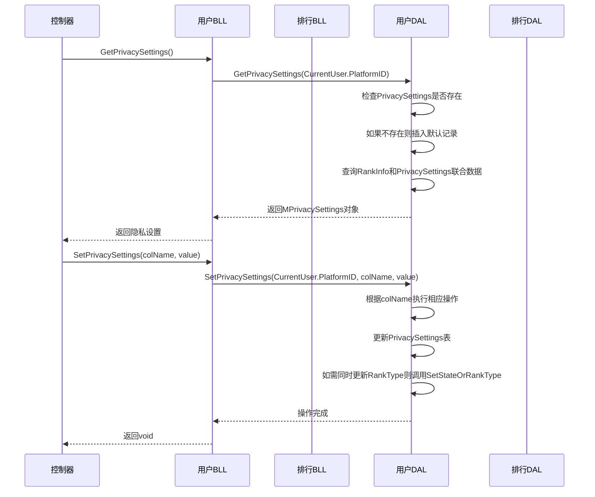

**图表来源**
- [UserBLL.cs](file://SpeedRunners.API/SpeedRunners.BLL/UserBLL.cs#L26-L49)
- [UserDAL.cs](file://SpeedRunners.API/SpeedRunners.DAL/UserDAL.cs#L13-L51)

#### 排行业务逻辑

排行业务逻辑负责处理与隐私设置相关的排行数据查询：

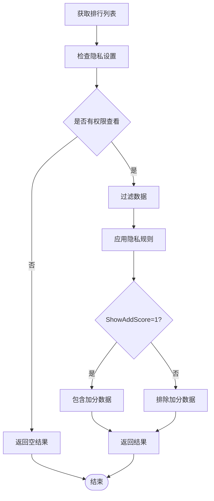

**图表来源**
- [RankBLL.cs](file://SpeedRunners.API/SpeedRunners.BLL/RankBLL.cs#L36-L42)
- [RankDAL.cs](file://SpeedRunners.API/SpeedRunners.DAL/RankDAL.cs#L63-L81)

**章节来源**
- [UserBLL.cs](file://SpeedRunners.API/SpeedRunners.BLL/UserBLL.cs#L26-L49)
- [RankBLL.cs](file://SpeedRunners.API/SpeedRunners.BLL/RankBLL.cs#L36-L42)

### 数据访问层实现

数据访问层负责与MySQL数据库进行交互，实现隐私设置数据的持久化：

#### 数据库表结构

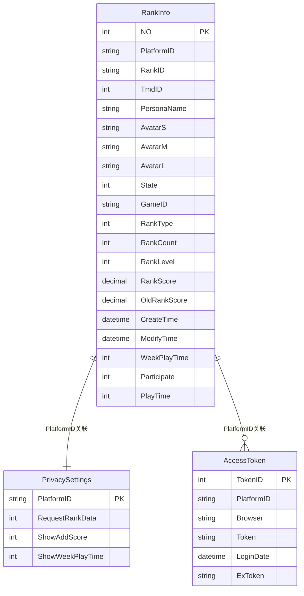

**图表来源**
- [tmdsr.sql](file://mysql-dump/tmdsr.sql#L372-L397)
- [tmdsr.sql](file://mysql-dump/tmdsr.sql#L552-L564)

#### 数据访问逻辑

数据访问层实现了隐私设置的CRUD操作，包括自动初始化和数据同步：

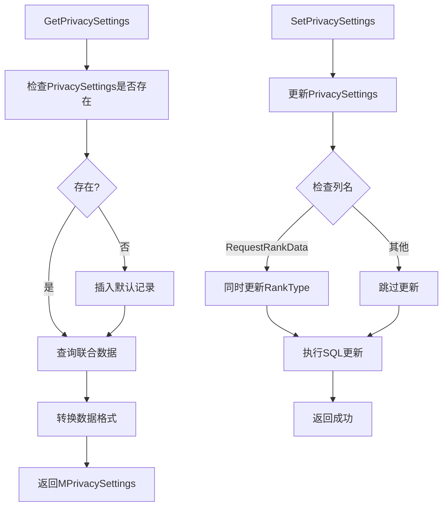

**图表来源**
- [UserDAL.cs](file://SpeedRunners.API/SpeedRunners.DAL/UserDAL.cs#L13-L51)

**章节来源**
- [UserDAL.cs](file://SpeedRunners.API/SpeedRunners.DAL/UserDAL.cs#L13-L51)
- [tmdsr.sql](file://mysql-dump/tmdsr.sql#L372-L397)

### 前端实现细节

前端使用Vue.js框架实现隐私设置界面，提供了直观的用户交互体验：

#### Vue组件功能

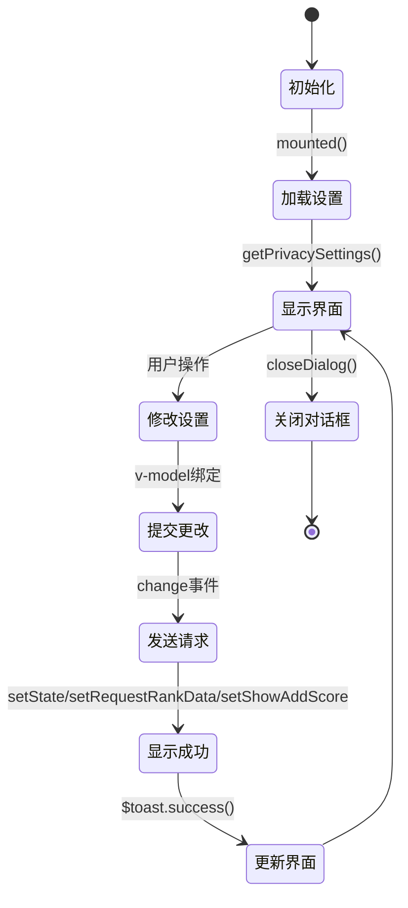

**图表来源**
- [privacySettings.vue](file://SpeedRunners.UI/src/views/other/privacySettings.vue#L118-L169)

#### 前端API调用

前端通过axios库调用后端API，实现了完整的隐私设置管理功能：

| API函数 | 功能描述 | 请求参数 | 返回数据 |
|---------|----------|----------|----------|
| getPrivacySettings() | 获取隐私设置 | 无 | MPrivacySettings对象 |
| setState(value) | 设置发布状态 | { value: -1或0 } | MResponse对象 |
| setRankType(value) | 设置排行类型 | { value: 1或2 } | MResponse对象 |
| setShowWeekPlayTime(value) | 设置周游玩时间显示 | { value: 0或1 } | MResponse对象 |
| setRequestRankData(value) | 设置排行数据请求 | { value: 0或1 } | MResponse对象 |
| setShowAddScore(value) | 设置加分显示 | { value: 0或1 } | MResponse对象 |

**章节来源**
- [privacySettings.vue](file://SpeedRunners.UI/src/views/other/privacySettings.vue#L1-L169)
- [user.js](file://SpeedRunners.UI/src/api/user.js#L1-L77)

## 依赖关系分析

隐私设置管理系统的依赖关系体现了清晰的分层架构设计：

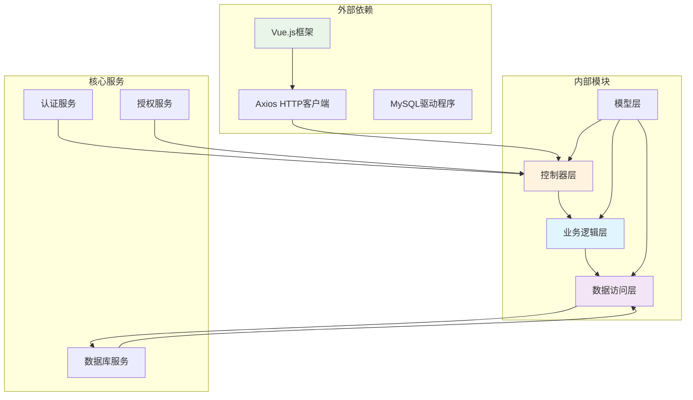

**图表来源**
- [UserController.cs](file://SpeedRunners.API/SpeedRunners/Controllers/UserController.cs#L1-L58)
- [UserBLL.cs](file://SpeedRunners.API/SpeedRunners.BLL/UserBLL.cs#L1-L153)
- [UserDAL.cs](file://SpeedRunners.API/SpeedRunners.DAL/UserDAL.cs#L1-L85)

### 核心依赖关系

系统的关键依赖关系包括：

1. **控制器到业务逻辑层**：控制器依赖业务逻辑层提供的服务
2. **业务逻辑层到数据访问层**：业务逻辑层依赖数据访问层进行数据持久化
3. **数据访问层到数据库**：数据访问层直接操作MySQL数据库
4. **前端到后端API**：前端通过HTTP请求调用后端REST API

**章节来源**
- [UserBLL.cs](file://SpeedRunners.API/SpeedRunners.BLL/UserBLL.cs#L18-L24)
- [UserDAL.cs](file://SpeedRunners.API/SpeedRunners.DAL/UserDAL.cs#L1-L11)

## 性能考虑

隐私设置管理功能在设计时充分考虑了性能优化：

### 数据库性能优化

1. **索引设计**：PlatformID字段作为主键和外键，确保查询效率
2. **连接查询优化**：使用LEFT JOIN连接RankInfo和PrivacySettings表
3. **条件过滤**：通过WHERE子句精确过滤需要的数据

### 缓存策略

1. **会话缓存**：用户令牌和权限信息在内存中缓存
2. **查询结果缓存**：常用的隐私设置查询结果可以缓存
3. **静态资源缓存**：前端静态资源使用浏览器缓存

### 并发控制

1. **事务管理**：关键操作使用数据库事务确保数据一致性
2. **锁机制**：并发更新时使用适当的锁机制
3. **重试机制**：网络异常时提供自动重试功能

## 故障排除指南

### 常见问题及解决方案

#### 隐私设置无法保存

**问题描述**：用户修改隐私设置后，页面刷新发现设置未生效

**可能原因**：
1. 数据库连接异常
2. 权限验证失败
3. 前端状态更新错误

**解决步骤**：
1. 检查数据库连接字符串配置
2. 验证用户登录状态
3. 查看浏览器控制台错误信息
4. 检查后端日志输出

#### 设置项显示异常

**问题描述**：隐私设置界面显示的数值与实际不符

**可能原因**：
1. 数据库默认值设置错误
2. 前端数据绑定问题
3. SQL查询逻辑错误

**解决步骤**：
1. 检查PrivacySettings表的默认值
2. 验证v-model绑定的数据类型
3. 审核SQL查询语句的CASE WHEN逻辑

#### API调用失败

**问题描述**：前端调用隐私设置API时返回错误

**可能原因**：
1. CORS跨域配置问题
2. 认证令牌过期
3. 后端服务异常

**解决步骤**：
1. 检查CORS配置
2. 验证Token有效期
3. 查看后端异常日志

**章节来源**
- [UserDAL.cs](file://SpeedRunners.API/SpeedRunners.DAL/UserDAL.cs#L13-L35)
- [privacySettings.vue](file://SpeedRunners.UI/src/views/other/privacySettings.vue#L133-L169)

## 结论

隐私设置管理功能通过精心设计的三层架构，为用户提供了完善的隐私控制能力。系统具有以下特点：

1. **安全性**：严格的权限验证和数据验证机制
2. **可扩展性**：模块化的架构设计支持功能扩展
3. **易用性**：直观的用户界面和流畅的操作体验
4. **可靠性**：完善的错误处理和异常恢复机制

该功能的成功实现为SpeedRunnersLab项目奠定了坚实的隐私保护基础，用户可以根据自己的需求灵活控制个人信息的可见性，同时保证了系统的整体性能和稳定性。

未来可以在以下方面进一步改进：
- 增加更多的隐私控制选项
- 优化前端用户体验
- 加强数据安全保护
- 提供更详细的隐私设置说明