# 隐私设置管理

<cite>
**本文档引用的文件**
- [UserController.cs](file://SpeedRunners.API/SpeedRunners/Controllers/UserController.cs)
- [UserBLL.cs](file://SpeedRunners.API/SpeedRunners.BLL/UserBLL.cs)
- [UserDAL.cs](file://SpeedRunners.API/SpeedRunners.DAL/UserDAL.cs)
- [MPrivacySettings.cs](file://SpeedRunners.API/SpeedRunners.Model/User/MPrivacySettings.cs)
- [ProfileBLL.cs](file://SpeedRunners.API/SpeedRunners.BLL/ProfileBLL.cs)
- [ProfileDAL.cs](file://SpeedRunners.API/SpeedRunners.DAL/ProfileDAL.cs)
- [AdminHelper.cs](file://SpeedRunners.API/SpeedRunners.Utils/AdminHelper.cs)
- [privacySettings.vue](file://SpeedRunners.UI/src/views/other/privacySettings.vue)
- [user.js](file://SpeedRunners.UI/src/api/user.js)
- [ProfilePrivacyTests.cs](file://SpeedRunners.API/SpeedRunners.Tests/ProfilePrivacyTests.cs)
</cite>

## 更新摘要
**所做更改**
- 隐私系统完全重构：从隐式访客ID检测迁移到显式IsOwnerOrAdmin方法
- 新增ShowProfile字段的详细说明和业务逻辑
- 优化隐私设置检索逻辑，使用GetPlayerInfoAndPrivacy方法
- 增强访问控制机制，明确区分拥有者和管理员权限
- 完善隐私设置API接口的参数验证和默认值处理
- 更新前端隐私设置界面的条件禁用逻辑

## 目录
1. [简介](#简介)
2. [项目结构](#项目结构)
3. [核心组件](#核心组件)
4. [架构概览](#架构概览)
5. [详细组件分析](#详细组件分析)
6. [依赖关系分析](#依赖关系分析)
7. [性能考虑](#性能考虑)
8. [故障排除指南](#故障排除指南)
9. [结论](#结论)

## 简介

隐私设置管理功能是SpeedRunnersLab项目中的重要组成部分，负责管理用户的隐私偏好设置。该功能允许用户控制其个人数据的可见性，包括周游玩时间显示、排名数据请求、加分显示等隐私控制项。

**更新** 本次重大增强引入了完全重构的隐私系统，从隐式的访客ID检测迁移到显式的IsOwnerOrAdmin方法，实现了更加精确和安全的访问控制机制。新增的ShowProfile字段提供了个人主页级别的隐私控制，用户可以完全关闭个人主页的可见性，而管理员也获得了特殊的访问权限。

本系统采用三层架构设计，包括前端Vue.js界面层、后端.NET Core API层和MySQL数据库层。通过严格的权限控制和数据验证机制，确保用户隐私设置的安全性和有效性。

## 项目结构

SpeedRunnersLab项目采用标准的分层架构模式，主要分为以下层次：

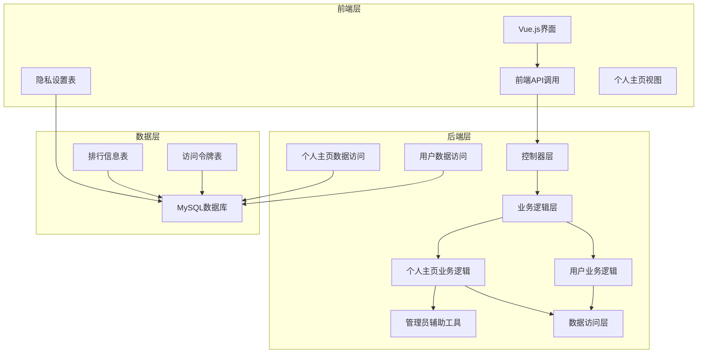

**图表来源**
- [UserController.cs:1-62](file://SpeedRunners.API/SpeedRunners/Controllers/UserController.cs#L1-L62)
- [UserBLL.cs:1-172](file://SpeedRunners.API/SpeedRunners.BLL/UserBLL.cs#L1-L172)
- [ProfileBLL.cs:1-350](file://SpeedRunners.API/SpeedRunners.BLL/ProfileBLL.cs#L1-L350)
- [UserDAL.cs:1-107](file://SpeedRunners.API/SpeedRunners.DAL/UserDAL.cs#L1-L107)
- [ProfileDAL.cs:1-148](file://SpeedRunners.API/SpeedRunners.DAL/ProfileDAL.cs#L1-L148)
- [AdminHelper.cs:1-39](file://SpeedRunners.API/SpeedRunners.Utils/AdminHelper.cs#L1-L39)

**章节来源**
- [UserController.cs:1-62](file://SpeedRunners.API/SpeedRunners/Controllers/UserController.cs#L1-L62)
- [UserBLL.cs:1-172](file://SpeedRunners.API/SpeedRunners.BLL/UserBLL.cs#L1-L172)
- [ProfileBLL.cs:1-350](file://SpeedRunners.API/SpeedRunners.BLL/ProfileBLL.cs#L1-L350)
- [UserDAL.cs:1-107](file://SpeedRunners.API/SpeedRunners.DAL/UserDAL.cs#L1-L107)
- [ProfileDAL.cs:1-148](file://SpeedRunners.API/SpeedRunners.DAL/ProfileDAL.cs#L1-L148)
- [AdminHelper.cs:1-39](file://SpeedRunners.API/SpeedRunners.Utils/AdminHelper.cs#L1-L39)

## 核心组件

### 数据模型设计

隐私设置功能的核心数据模型是MPrivacySettings类，它定义了用户隐私控制的所有属性：

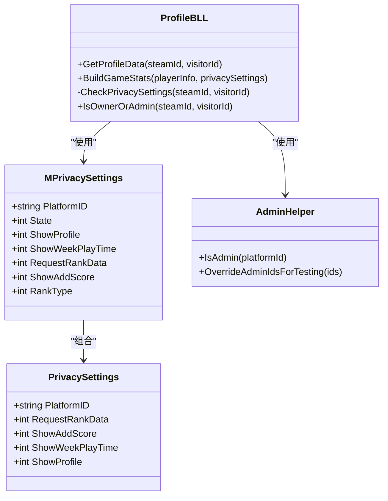

**图表来源**
- [MPrivacySettings.cs:1-38](file://SpeedRunners.API/SpeedRunners.Model/User/MPrivacySettings.cs#L1-L38)
- [ProfileBLL.cs:89-93](file://SpeedRunners.API/SpeedRunners.BLL/ProfileBLL.cs#L89-L93)
- [AdminHelper.cs:27-36](file://SpeedRunners.API/SpeedRunners.Utils/AdminHelper.cs#L27-L36)

### 访问控制机制

新的隐私系统引入了显式的IsOwnerOrAdmin方法，实现了更加精确的访问控制：

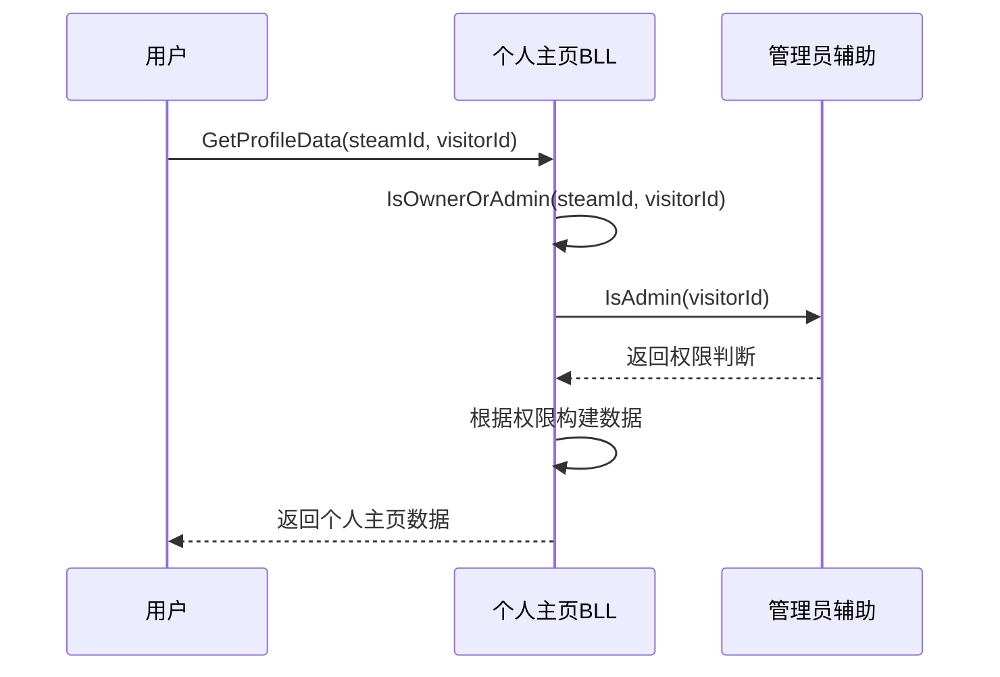

**图表来源**
- [ProfileBLL.cs:69-93](file://SpeedRunners.API/SpeedRunners.BLL/ProfileBLL.cs#L69-L93)
- [AdminHelper.cs:27-28](file://SpeedRunners.API/SpeedRunners.Utils/AdminHelper.cs#L27-L28)

### 前端界面组件

隐私设置界面采用Vue.js框架构建，提供了直观的用户交互体验和智能的条件禁用功能：

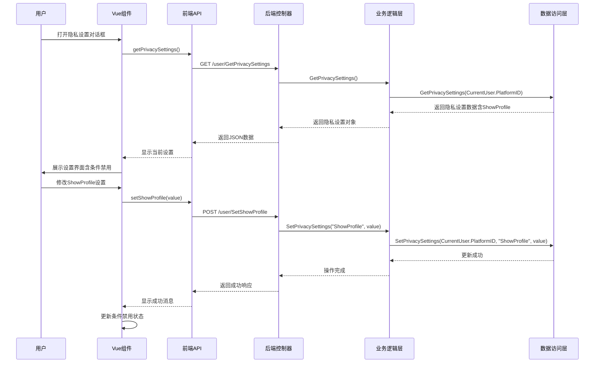

**图表来源**
- [privacySettings.vue:190-201](file://SpeedRunners.UI/src/views/other/privacySettings.vue#L190-L201)
- [user.js:1-85](file://SpeedRunners.UI/src/api/user.js#L1-L85)
- [UserController.cs:20](file://SpeedRunners.API/SpeedRunners/Controllers/UserController.cs#L20)

**章节来源**
- [MPrivacySettings.cs:1-38](file://SpeedRunners.API/SpeedRunners.Model/User/MPrivacySettings.cs#L1-L38)
- [privacySettings.vue:1-201](file://SpeedRunners.UI/src/views/other/privacySettings.vue#L1-L201)
- [user.js:1-85](file://SpeedRunners.UI/src/api/user.js#L1-L85)

## 架构概览

隐私设置管理系统采用经典的三层架构模式，确保了良好的可维护性和扩展性：

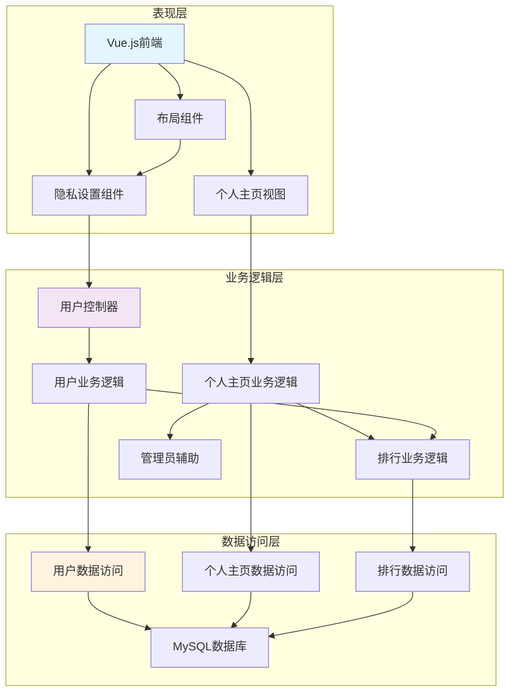

**图表来源**
- [UserController.cs:1-62](file://SpeedRunners.API/SpeedRunners/Controllers/UserController.cs#L1-L62)
- [UserBLL.cs:1-172](file://SpeedRunners.API/SpeedRunners.BLL/UserBLL.cs#L1-L172)
- [ProfileBLL.cs:1-350](file://SpeedRunners.API/SpeedRunners.BLL/ProfileBLL.cs#L1-L350)
- [UserDAL.cs:1-107](file://SpeedRunners.API/SpeedRunners.DAL/UserDAL.cs#L1-L107)
- [ProfileDAL.cs:1-148](file://SpeedRunners.API/SpeedRunners.DAL/ProfileDAL.cs#L1-L148)
- [AdminHelper.cs:1-39](file://SpeedRunners.API/SpeedRunners.Utils/AdminHelper.cs#L1-L39)

## 详细组件分析

### 控制器层实现

控制器层负责处理HTTP请求和响应，实现了隐私设置的所有API接口：

#### 用户控制器功能

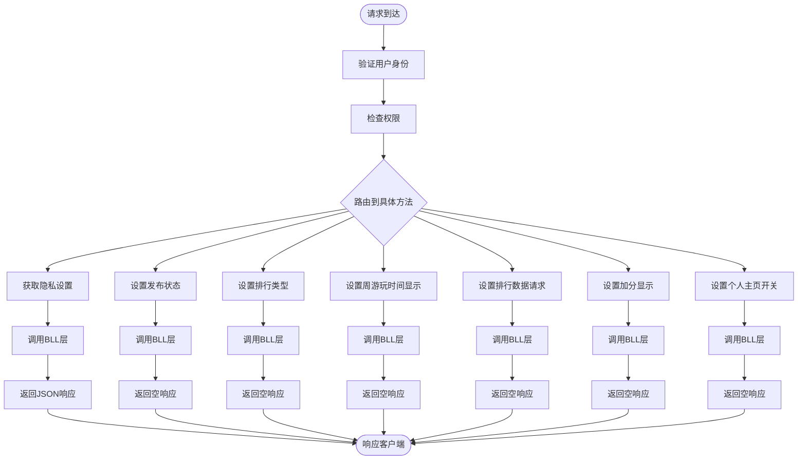

**图表来源**
- [UserController.cs:14-44](file://SpeedRunners.API/SpeedRunners/Controllers/UserController.cs#L14-L44)

#### 隐私设置API接口定义

| 接口名称 | HTTP方法 | URL路径 | 功能描述 | 参数 | 默认值 |
|---------|---------|--------|----------|------|--------|
| GetPrivacySettings | GET | /user/GetPrivacySettings | 获取用户隐私设置 | 无 | 返回完整设置对象 |
| SetState | POST | /user/SetState | 设置发布状态 | value(-1关闭, 0开启) | -1 |
| SetRankType | POST | /user/setRankType | 设置排行类型 | value(1开启, 2关闭) | 2 |
| SetShowWeekPlayTime | POST | /user/setShowWeekPlayTime | 设置周游玩时间显示 | value(0关闭, 1开启) | 0 |
| SetRequestRankData | POST | /user/setRequestRankData | 设置排行数据请求 | value(0关闭, 1开启) | 0 |
| SetShowAddScore | POST | /user/setShowAddScore | 设置加分显示 | value(0关闭, 1开启) | 0 |
| SetShowProfile | POST | /user/setShowProfile | 设置个人主页开关 | value(0关闭, 1开启) | 1 |

**章节来源**
- [UserController.cs:18-44](file://SpeedRunners.API/SpeedRunners/Controllers/UserController.cs#L18-L44)

### 业务逻辑层实现

业务逻辑层封装了隐私设置的核心业务规则和数据处理逻辑：

#### 用户业务逻辑

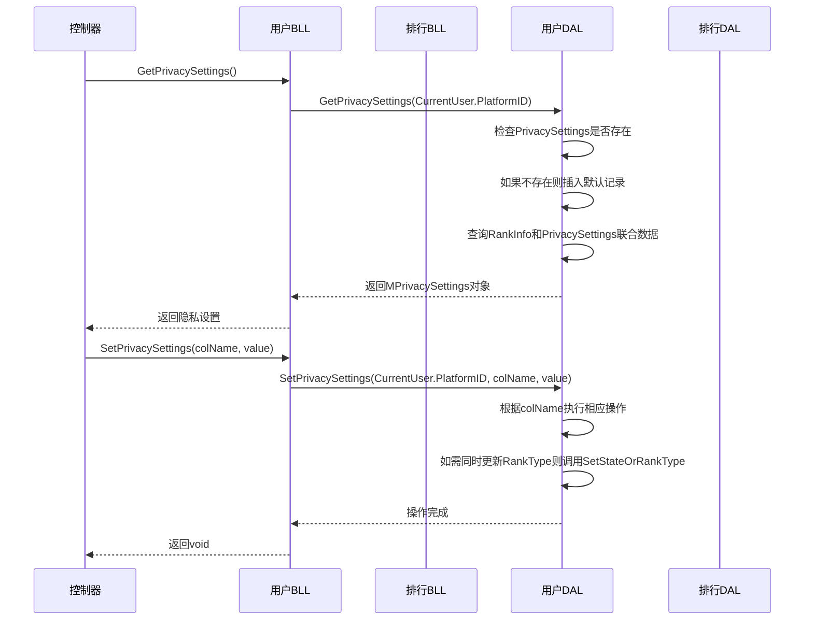

**图表来源**
- [UserBLL.cs:26-63](file://SpeedRunners.API/SpeedRunners.BLL/UserBLL.cs#L26-L63)
- [UserDAL.cs:24-49](file://SpeedRunners.API/SpeedRunners.DAL/UserDAL.cs#L24-L49)

#### 个人主页业务逻辑

个人主页业务逻辑现在包含了复杂的访客/拥有者区分和条件禁用逻辑：

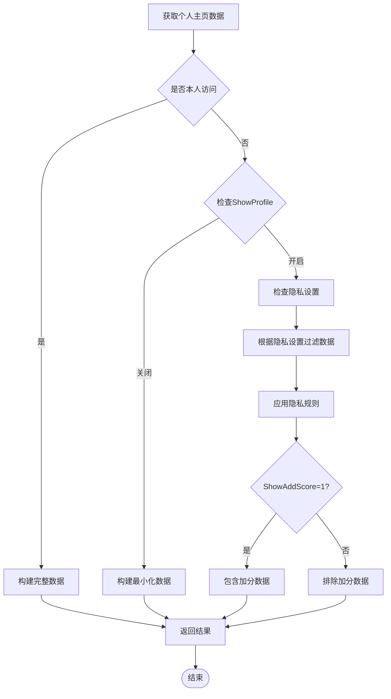

**图表来源**
- [ProfileBLL.cs:29-84](file://SpeedRunners.API/SpeedRunners.BLL/ProfileBLL.cs#L29-L84)

**章节来源**
- [UserBLL.cs:26-63](file://SpeedRunners.API/SpeedRunners.BLL/UserBLL.cs#L26-L63)
- [ProfileBLL.cs:29-84](file://SpeedRunners.API/SpeedRunners.BLL/ProfileBLL.cs#L29-L84)

### 数据访问层实现

数据访问层负责与MySQL数据库进行交互，实现隐私设置数据的持久化：

#### 数据库表结构

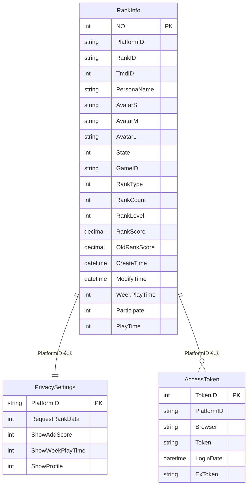

**图表来源**
- [ProfileDAL.cs:18-33](file://SpeedRunners.API/SpeedRunners.DAL/ProfileDAL.cs#L18-L33)
- [UserDAL.cs:24-49](file://SpeedRunners.API/SpeedRunners.DAL/UserDAL.cs#L24-L49)

#### 数据访问逻辑

数据访问层实现了隐私设置的CRUD操作，包括自动初始化和数据同步：

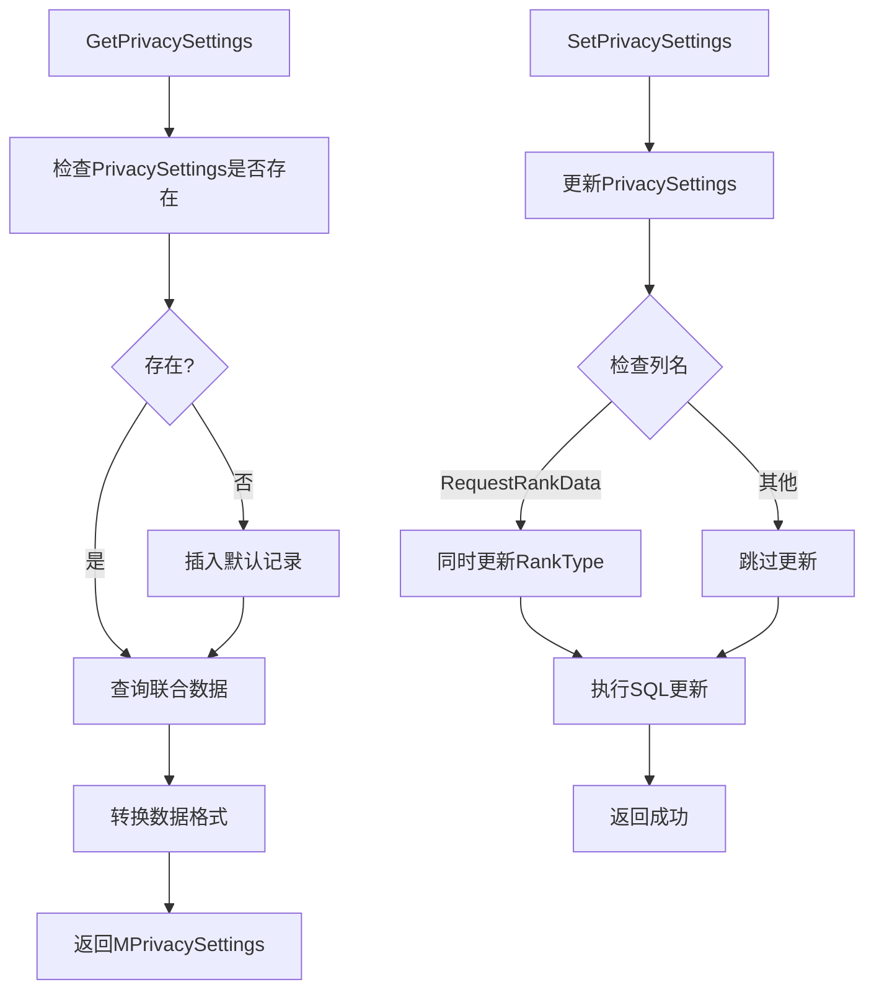

**图表来源**
- [UserDAL.cs:24-73](file://SpeedRunners.API/SpeedRunners.DAL/UserDAL.cs#L24-L73)

**章节来源**
- [UserDAL.cs:24-73](file://SpeedRunners.API/SpeedRunners.DAL/UserDAL.cs#L24-L73)
- [ProfileDAL.cs:18-33](file://SpeedRunners.API/SpeedRunners.DAL/ProfileDAL.cs#L18-L33)

### 前端实现细节

前端使用Vue.js框架实现隐私设置界面，提供了直观的用户交互体验和智能的条件禁用功能：

#### Vue组件功能

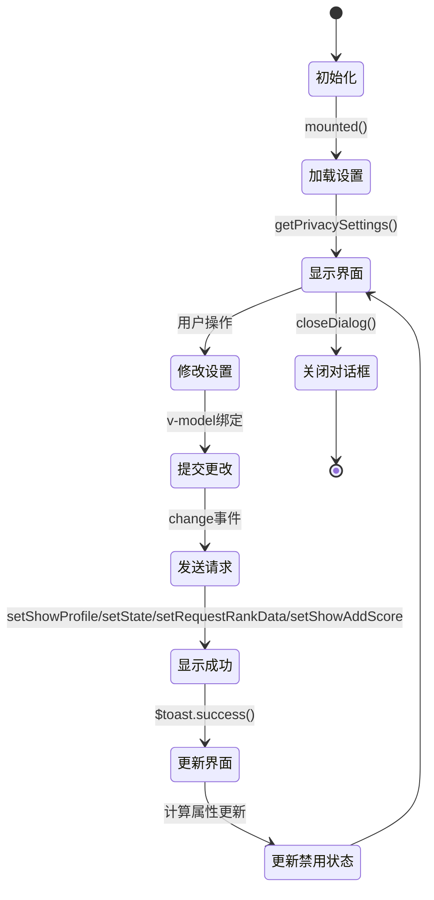

**图表来源**
- [privacySettings.vue:190-201](file://SpeedRunners.UI/src/views/other/privacySettings.vue#L190-L201)

#### 前端API调用

前端通过axios库调用后端API，实现了完整的隐私设置管理功能：

| API函数 | 功能描述 | 请求参数 | 返回数据 | 默认值 |
|---------|----------|----------|----------|--------|
| getPrivacySettings() | 获取隐私设置 | 无 | MPrivacySettings对象 | 包含所有设置项 |
| setState(value) | 设置发布状态 | { value: -1或0 } | MResponse对象 | -1 |
| setRankType(value) | 设置排行类型 | { value: 1或2 } | MResponse对象 | 2 |
| setShowWeekPlayTime(value) | 设置周游玩时间显示 | { value: 0或1 } | MResponse对象 | 0 |
| setRequestRankData(value) | 设置排行数据请求 | { value: 0或1 } | MResponse对象 | 0 |
| setShowAddScore(value) | 设置加分显示 | { value: 0或1 } | MResponse对象 | 0 |
| setShowProfile(value) | 设置个人主页开关 | { value: 0或1 } | MResponse对象 | 1 |

**章节来源**
- [privacySettings.vue:1-201](file://SpeedRunners.UI/src/views/other/privacySettings.vue#L1-L201)
- [user.js:1-85](file://SpeedRunners.UI/src/api/user.js#L1-L85)

### 条件禁用逻辑

新增的条件禁用逻辑确保了设置项之间的合理依赖关系：

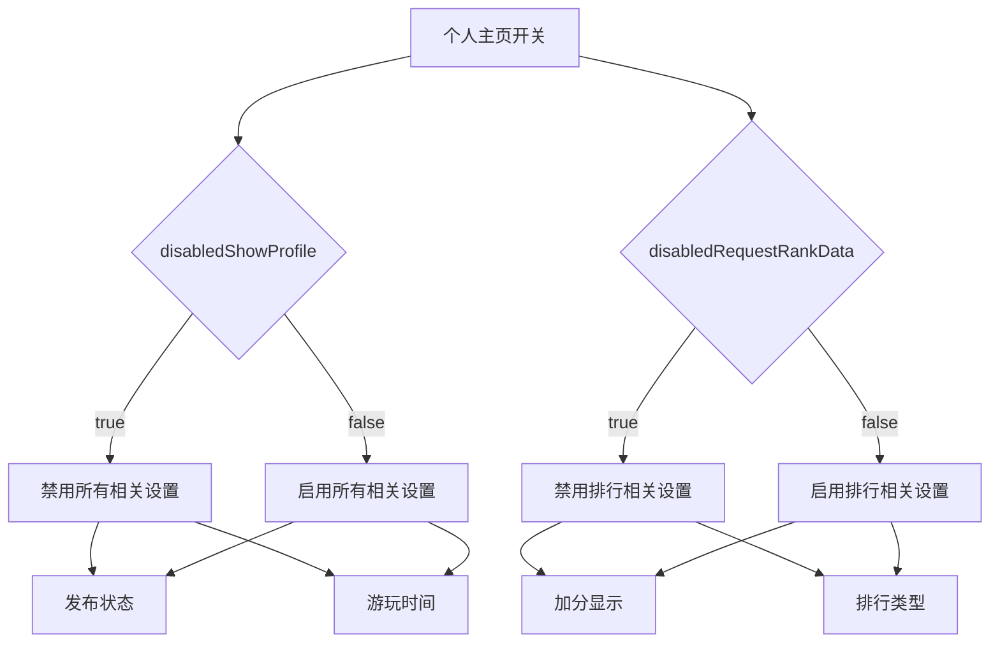

**图表来源**
- [privacySettings.vue:141-151](file://SpeedRunners.UI/src/views/other/privacySettings.vue#L141-L151)

**章节来源**
- [privacySettings.vue:141-151](file://SpeedRunners.UI/src/views/other/privacySettings.vue#L141-L151)

### 访问控制机制

新的隐私系统引入了显式的IsOwnerOrAdmin方法，实现了更加精确的访问控制：

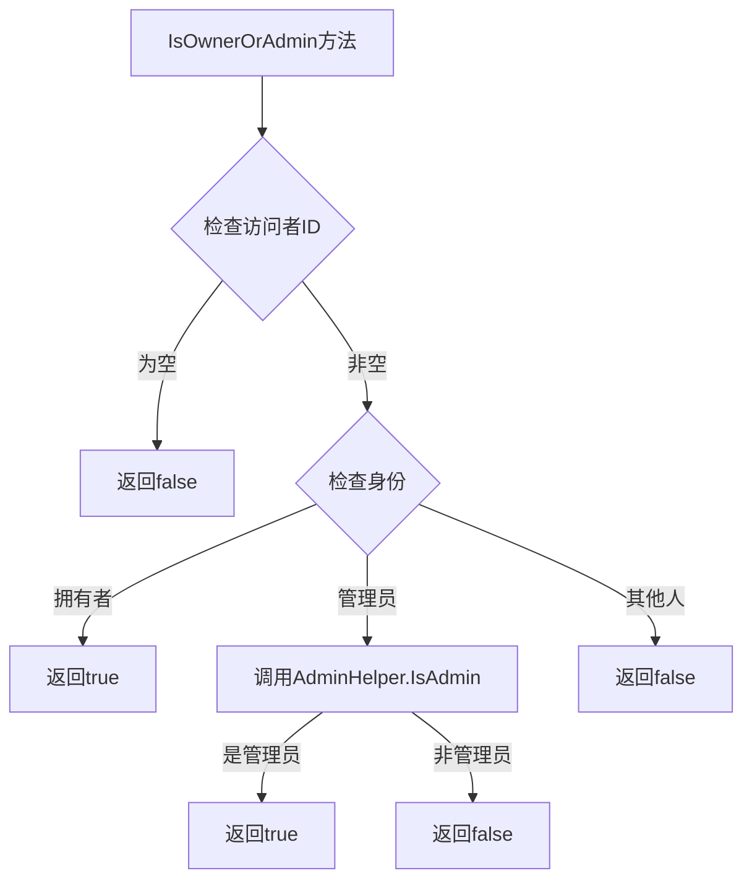

**图表来源**
- [ProfileBLL.cs:89-93](file://SpeedRunners.API/SpeedRunners.BLL/ProfileBLL.cs#L89-L93)

**章节来源**
- [ProfileBLL.cs:89-93](file://SpeedRunners.API/SpeedRunners.BLL/ProfileBLL.cs#L89-L93)

## 依赖关系分析

隐私设置管理系统的依赖关系体现了清晰的分层架构设计：

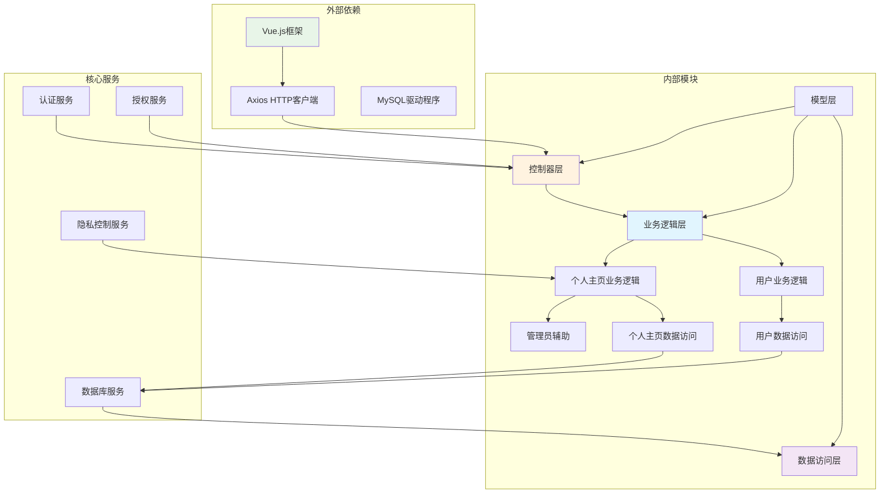

**图表来源**
- [UserController.cs:1-62](file://SpeedRunners.API/SpeedRunners/Controllers/UserController.cs#L1-L62)
- [UserBLL.cs:1-172](file://SpeedRunners.API/SpeedRunners.BLL/UserBLL.cs#L1-L172)
- [ProfileBLL.cs:1-350](file://SpeedRunners.API/SpeedRunners.BLL/ProfileBLL.cs#L1-L350)
- [UserDAL.cs:1-107](file://SpeedRunners.API/SpeedRunners.DAL/UserDAL.cs#L1-L107)
- [ProfileDAL.cs:1-148](file://SpeedRunners.API/SpeedRunners.DAL/ProfileDAL.cs#L1-L148)
- [AdminHelper.cs:1-39](file://SpeedRunners.API/SpeedRunners.Utils/AdminHelper.cs#L1-L39)

### 核心依赖关系

系统的关键依赖关系包括：

1. **控制器到业务逻辑层**：控制器依赖业务逻辑层提供的服务
2. **业务逻辑层到数据访问层**：业务逻辑层依赖数据访问层进行数据持久化
3. **数据访问层到数据库**：数据访问层直接操作MySQL数据库
4. **前端到后端API**：前端通过HTTP请求调用后端REST API
5. **个人主页业务逻辑到隐私设置**：个人主页功能依赖隐私设置进行访问控制
6. **个人主页业务逻辑到管理员辅助**：访问控制依赖AdminHelper进行权限判断

**章节来源**
- [UserBLL.cs:18-24](file://SpeedRunners.API/SpeedRunners.BLL/UserBLL.cs#L18-L24)
- [ProfileBLL.cs:89-93](file://SpeedRunners.API/SpeedRunners.BLL/ProfileBLL.cs#L89-L93)
- [UserDAL.cs:12-21](file://SpeedRunners.API/SpeedRunners.DAL/UserDAL.cs#L12-L21)

## 性能考虑

隐私设置管理功能在设计时充分考虑了性能优化：

### 数据库性能优化

1. **索引设计**：PlatformID字段作为主键和外键，确保查询效率
2. **连接查询优化**：使用LEFT JOIN连接RankInfo和PrivacySettings表
3. **条件过滤**：通过WHERE子句精确过滤需要的数据
4. **默认值优化**：PrivacySettings表使用IFNULL函数提供默认值
5. **批量查询优化**：使用GetPlayerInfoAndPrivacy方法进行一次连接获取多个数据

### 缓存策略

1. **会话缓存**：用户令牌和权限信息在内存中缓存
2. **查询结果缓存**：常用的隐私设置查询结果可以缓存
3. **静态资源缓存**：前端静态资源使用浏览器缓存
4. **个人主页缓存**：个人主页数据可以进行适当缓存

### 并发控制

1. **事务管理**：关键操作使用数据库事务确保数据一致性
2. **锁机制**：并发更新时使用适当的锁机制
3. **重试机制**：网络异常时提供自动重试功能

### 条件禁用优化

1. **前端计算**：条件禁用逻辑在前端计算，减少服务器负载
2. **即时反馈**：用户操作时立即更新禁用状态，提升用户体验
3. **批量更新**：设置项变更时一次性更新所有相关状态

## 故障排除指南

### 常见问题及解决方案

#### 隐私设置无法保存

**问题描述**：用户修改隐私设置后，页面刷新发现设置未生效

**可能原因**：
1. 数据库连接异常
2. 权限验证失败
3. 前端状态更新错误
4. ShowProfile设置影响其他设置项

**解决步骤**：
1. 检查数据库连接字符串配置
2. 验证用户登录状态
3. 查看浏览器控制台错误信息
4. 检查后端日志输出
5. 确认ShowProfile设置的级联影响

#### 设置项显示异常

**问题描述**：隐私设置界面显示的数值与实际不符

**可能原因**：
1. 数据库默认值设置错误
2. 前端数据绑定问题
3. SQL查询逻辑错误
4. 条件禁用逻辑异常

**解决步骤**：
1. 检查PrivacySettings表的默认值
2. 验证v-model绑定的数据类型
3. 审核SQL查询语句的CASE WHEN逻辑
4. 检查计算属性disabledShowProfile和disabledRequestRankData
5. 验证条件禁用逻辑的正确性

#### API调用失败

**问题描述**：前端调用隐私设置API时返回错误

**可能原因**：
1. CORS跨域配置问题
2. 认证令牌过期
3. 后端服务异常
4. 新增的SetShowProfile接口问题

**解决步骤**：
1. 检查CORS配置
2. 验证Token有效期
3. 查看后端异常日志
4. 测试SetShowProfile接口功能
5. 检查控制器权限装饰器配置

#### 个人主页访问异常

**问题描述**：用户无法正常访问个人主页或看到预期内容

**可能原因**：
1. ShowProfile设置为关闭
2. 隐私设置过滤逻辑错误
3. 访客/拥有者判断逻辑问题
4. 数据库查询结果不正确

**解决步骤**：
1. 检查目标用户的ShowProfile设置
2. 验证个人主页业务逻辑的访问控制
3. 确认IsOwnerOrAdmin方法的身份判断逻辑
4. 检查隐私设置对数据过滤的影响
5. 验证BuildGameStats方法的条件判断

#### 访问控制异常

**问题描述**：管理员无法访问个人主页或拥有者权限异常

**可能原因**：
1. AdminHelper.IsAdmin方法返回错误
2. IsOwnerOrAdmin方法逻辑错误
3. 管理员ID配置问题
4. 单元测试覆盖异常

**解决步骤**：
1. 检查AdminPlatformIDs配置
2. 验证AdminHelper.IsAdmin方法的实现
3. 使用ProfilePrivacyTests验证IsOwnerOrAdmin方法
4. 检查OverrideAdminIdsForTesting方法的测试覆盖
5. 确认身份判断的优先级顺序

**章节来源**
- [UserDAL.cs:24-49](file://SpeedRunners.API/SpeedRunners.DAL/UserDAL.cs#L24-L49)
- [ProfileBLL.cs:89-93](file://SpeedRunners.API/SpeedRunners.BLL/ProfileBLL.cs#L89-L93)
- [privacySettings.vue:141-201](file://SpeedRunners.UI/src/views/other/privacySettings.vue#L141-L201)
- [AdminHelper.cs:27-36](file://SpeedRunners.API/SpeedRunners.Utils/AdminHelper.cs#L27-L36)
- [ProfilePrivacyTests.cs:17-45](file://SpeedRunners.API/SpeedRunners.Tests/ProfilePrivacyTests.cs#L17-L45)

## 结论

隐私设置管理功能通过精心设计的三层架构，为用户提供了完善的隐私控制能力。本次重大增强引入了多项重要功能：

### 新增功能特性

1. **完全重构的隐私系统**：从隐式的访客ID检测迁移到显式的IsOwnerOrAdmin方法，实现了更加精确的访问控制
2. **ShowProfile标志**：实现了个人主页级别的隐私控制，用户可以完全关闭个人主页的可见性
3. **管理员特殊权限**：管理员拥有与拥有者相同的访问权限，提高了平台管理效率
4. **条件禁用逻辑**：实现了复杂的设置项依赖关系，确保设置的一致性和合理性
5. **增强的个人主页控制**：完善了个人主页的数据过滤和访问控制机制

### 技术架构优势

1. **安全性**：严格的权限验证和数据验证机制
2. **可扩展性**：模块化的架构设计支持功能扩展
3. **易用性**：直观的用户界面和流畅的操作体验
4. **可靠性**：完善的错误处理和异常恢复机制
5. **智能化**：条件禁用逻辑提升了用户体验和设置的合理性
6. **精确性**：显式的访问控制方法避免了隐式判断的歧义

### 业务价值

该功能的成功实现为SpeedRunnersLab项目奠定了坚实的隐私保护基础，用户可以根据自己的需求灵活控制个人信息的可见性，同时保证了系统的整体性能和稳定性。新增的ShowProfile功能特别重要，它允许用户完全隐藏其个人主页，这对于注重隐私的用户群体具有重要意义。

管理员特殊权限的设计提高了平台的管理效率，管理员可以无缝访问和管理用户数据，同时保持了系统的安全性和一致性。

未来可以在以下方面进一步改进：
- 增加更多的隐私控制选项
- 优化前端用户体验
- 加强数据安全保护
- 提供更详细的隐私设置说明
- 实现更精细的访问控制粒度
- 增强访问日志和审计功能