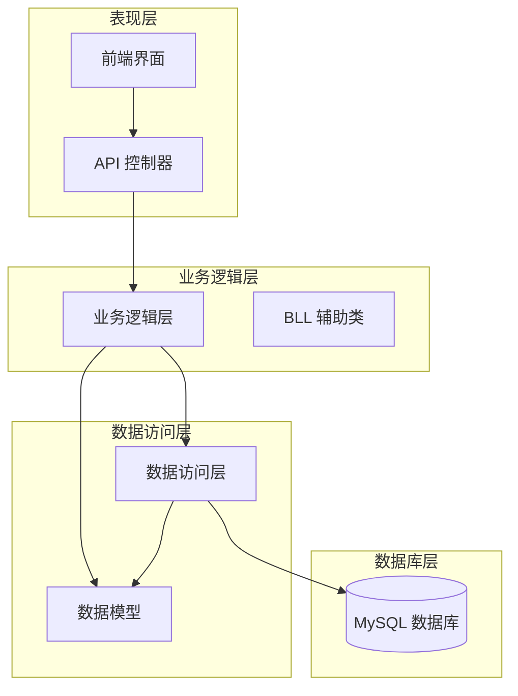
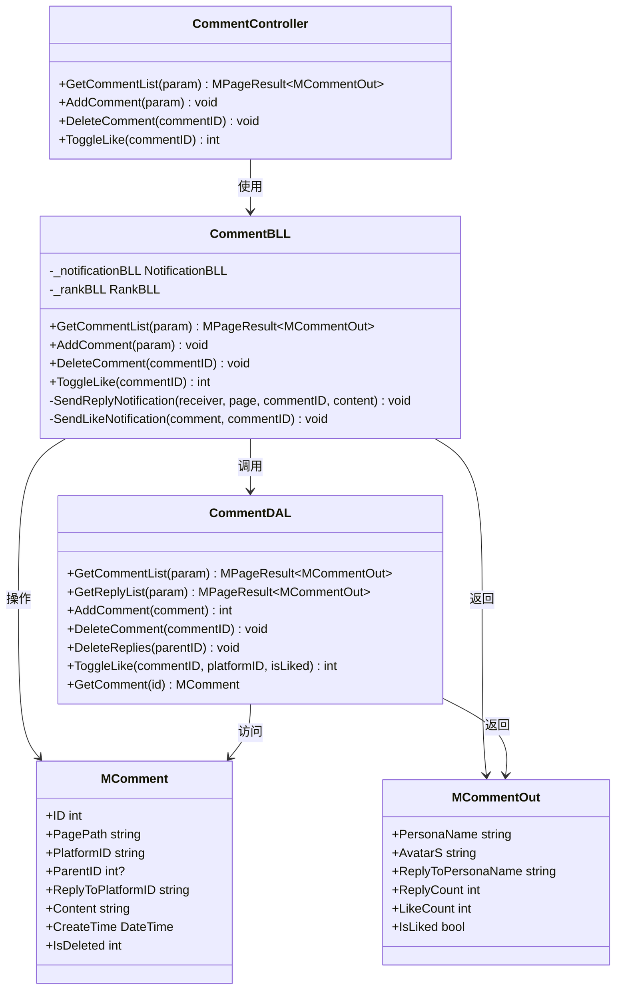
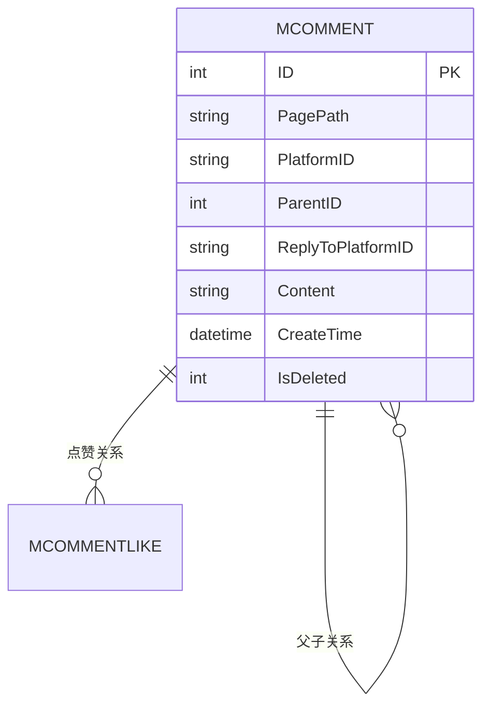
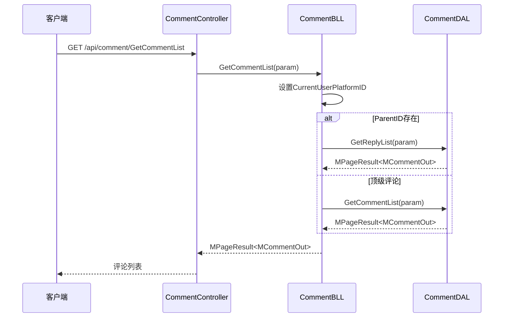
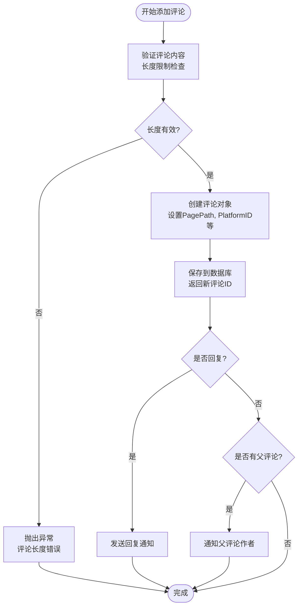
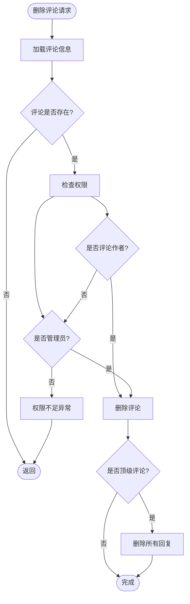
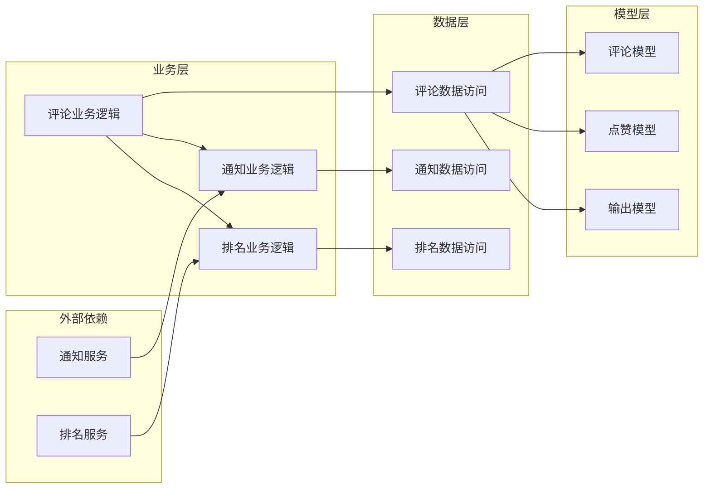

# 评论数据模型

<cite>
**本文档引用的文件**
- [CommentController.cs](file://SpeedRunners.API/SpeedRunners/Controllers/CommentController.cs)
- [CommentBLL.cs](file://SpeedRunners.API/SpeedRunners/BLL/CommentBLL.cs)
- [CommentDAL.cs](file://SpeedRunners.API/SpeedRunners/DAL/CommentDAL.cs)
- [MComment.cs](file://SpeedRunners.API/SpeedRunners/Model/Comment/MComment.cs)
- [MCommentOut.cs](file://SpeedRunners.API/SpeedRunners/Model/Comment/MCommentOut.cs)
- [MCommentParam.cs](file://SpeedRunners.API/SpeedRunners/Model/Comment/MCommentParam.cs)
- [MCommentLike.cs](file://SpeedRunners.API/SpeedRunners/Model/Comment/MCommentLike.cs)
- [README.md](file://README.md)
</cite>

## 目录
1. [简介](#简介)
2. [项目结构](#项目结构)
3. [核心组件](#核心组件)
4. [架构概览](#架构概览)
5. [详细组件分析](#详细组件分析)
6. [依赖关系分析](#依赖关系分析)
7. [性能考虑](#性能考虑)
8. [故障排除指南](#故障排除指南)
9. [结论](#结论)

## 简介

SpeedRunnersLab 是一个基于 ASP.NET Core 的游戏社区平台，专注于速度竞速游戏 SpeedRunners 的相关内容管理。该项目采用经典的三层架构设计，包含前端 Vue.js 应用和后端 .NET Core API。

本文件重点分析评论系统的数据模型设计，该系统支持多级评论、点赞功能、回复通知等核心特性。评论系统作为社区互动的重要组成部分，为用户提供了丰富的交互体验。

## 项目结构

项目采用标准的分层架构模式，主要分为以下层次：

**图表来源**
- [README.md](file://README.md#L1-L5)

**章节来源**
- [README.md](file://README.md#L1-L5)

## 核心组件

评论系统由多个核心组件构成，每个组件都有明确的职责分工：

### 数据模型层
- **MComment**: 评论实体模型，包含评论的基本信息
- **MCommentOut**: 评论输出模型，扩展了用户信息和统计字段
- **MCommentParam**: 评论参数模型，用于输入验证和查询
- **MCommentLike**: 点赞记录模型，跟踪用户的点赞行为

### 业务逻辑层
- **CommentBLL**: 评论业务逻辑处理，包含评论的增删改查和通知功能

### 数据访问层
- **CommentDAL**: 评论数据访问接口，负责与数据库的交互

**章节来源**
- [MComment.cs](file://SpeedRunners.API/SpeedRunners/Model/Comment/MComment.cs#L1-L17)
- [MCommentOut.cs](file://SpeedRunners.API/SpeedRunners/Model/Comment/MCommentOut.cs#L1-L13)
- [MCommentParam.cs](file://SpeedRunners.API/SpeedRunners/Model/Comment/MCommentParam.cs#L1-L18)
- [MCommentLike.cs](file://SpeedRunners.API/SpeedRunners/Model/Comment/MCommentLike.cs#L1-L13)

## 架构概览

评论系统采用典型的 MVC 架构模式，通过控制器-业务逻辑-数据访问的分层设计实现松耦合和高内聚。

**图表来源**
- [CommentController.cs](file://SpeedRunners.API/SpeedRunners/Controllers/CommentController.cs#L1-L33)
- [CommentBLL.cs](file://SpeedRunners.API/SpeedRunners/BLL/CommentBLL.cs#L1-L180)
- [CommentDAL.cs](file://SpeedRunners.API/SpeedRunners/DAL/CommentDAL.cs)
- [MComment.cs](file://SpeedRunners.API/SpeedRunners/Model/Comment/MComment.cs#L1-L17)
- [MCommentOut.cs](file://SpeedRunners.API/SpeedRunners/Model/Comment/MCommentOut.cs#L1-L13)

## 详细组件分析

### 数据模型设计

#### MComment 实体模型
MComment 是评论系统的核心数据模型，采用简洁而完整的设计理念：

**图表来源**
- [MComment.cs](file://SpeedRunners.API/SpeedRunners/Model/Comment/MComment.cs#L5-L15)

关键字段说明：
- **ID**: 评论唯一标识符，主键
- **PagePath**: 页面路径，用于关联到具体的内容页面
- **PlatformID**: 用户平台ID，标识评论作者
- **ParentID**: 父评论ID，支持多级评论嵌套
- **ReplyToPlatformID**: 回复目标用户ID
- **Content**: 评论内容，最大长度2000字符
- **CreateTime**: 创建时间
- **IsDeleted**: 删除标记

#### MCommentOut 输出模型
MCommentOut 在基础模型上扩展了用户信息和统计字段：

| 字段名 | 类型 | 描述 | 用途 |
|--------|------|------|------|
| PersonaName | string | 用户昵称 | 显示评论作者信息 |
| AvatarS | string | 用户头像URL | 评论头像显示 |
| ReplyToPersonaName | string | 目标用户昵称 | 回复场景显示 |
| ReplyCount | int | 回复数量 | 统计子评论数量 |
| LikeCount | int | 点赞数量 | 统计点赞总数 |
| IsLiked | bool | 是否已点赞 | 用户点赞状态 |

**章节来源**
- [MComment.cs](file://SpeedRunners.API/SpeedRunners/Model/Comment/MComment.cs#L1-L17)
- [MCommentOut.cs](file://SpeedRunners.API/SpeedRunners/Model/Comment/MCommentOut.cs#L1-L13)

### 业务逻辑实现

#### 评论列表获取流程
评论列表功能支持两种模式：顶级评论列表和回复列表。

**图表来源**
- [CommentController.cs](file://SpeedRunners.API/SpeedRunners/Controllers/CommentController.cs#L14-L15)
- [CommentBLL.cs](file://SpeedRunners.API/SpeedRunners/BLL/CommentBLL.cs#L23-L39)

#### 评论添加流程
评论添加功能包含输入验证、用户身份确认和通知发送：

**图表来源**
- [CommentBLL.cs](file://SpeedRunners.API/SpeedRunners/BLL/CommentBLL.cs#L44-L80)

**章节来源**
- [CommentBLL.cs](file://SpeedRunners.API/SpeedRunners/BLL/CommentBLL.cs#L23-L80)

### 权限控制机制

评论系统实现了严格的权限控制，确保数据安全和内容质量：

**图表来源**
- [CommentBLL.cs](file://SpeedRunners.API/SpeedRunners/BLL/CommentBLL.cs#L106-L130)

**章节来源**
- [CommentBLL.cs](file://SpeedRunners.API/SpeedRunners/BLL/CommentBLL.cs#L106-L130)

## 依赖关系分析

评论系统各层之间的依赖关系清晰明确，遵循依赖倒置原则：

**图表来源**
- [CommentBLL.cs](file://SpeedRunners.API/SpeedRunners/BLL/CommentBLL.cs#L11-L18)
- [CommentDAL.cs](file://SpeedRunners.API/SpeedRunners/DAL/CommentDAL.cs)

**章节来源**
- [CommentBLL.cs](file://SpeedRunners.API/SpeedRunners/BLL/CommentBLL.cs#L11-L18)

## 性能考虑

### 查询优化策略
1. **分页查询**: 使用 MPageParam 实现分页，避免一次性加载大量数据
2. **条件索引**: PagePath 和 ParentID 字段应建立适当的数据库索引
3. **延迟加载**: 用户信息通过 RankBLL 延迟加载，减少不必要的查询

### 缓存策略
1. **用户信息缓存**: RankBLL 缓存用户头像和昵称信息
2. **统计信息缓存**: 评论的点赞数和回复数可考虑缓存
3. **热点内容缓存**: 高热度页面的评论列表可进行缓存

### 并发控制
1. **乐观锁**: 使用 IsDeleted 字段实现软删除，避免物理删除的并发问题
2. **事务处理**: 关键操作使用 BeginDb 确保数据一致性
3. **重试机制**: 对于临时性数据库连接问题实现重试逻辑

## 故障排除指南

### 常见问题及解决方案

#### 评论内容长度异常
**问题描述**: 评论内容为空或超过2000字符
**解决方法**: 
- 检查前端输入验证
- 确认后端长度限制配置
- 查看本地化资源文件中的错误消息

#### 权限验证失败
**问题描述**: 删除评论时报权限不足错误
**解决方法**:
- 验证当前用户是否登录
- 检查用户是否为评论作者
- 确认管理员权限配置

#### 通知发送失败
**问题描述**: 评论回复或点赞通知未送达
**解决方法**:
- 检查 NotificationBLL 配置
- 验证 RankBLL 用户信息获取
- 查看通知服务日志

**章节来源**
- [CommentBLL.cs](file://SpeedRunners.API/SpeedRunners/BLL/CommentBLL.cs#L46-L48)
- [CommentBLL.cs](file://SpeedRunners.API/SpeedRunners/BLL/CommentBLL.cs#L117-L120)

## 结论

SpeedRunnersLab 的评论数据模型设计体现了良好的软件工程实践，具有以下特点：

1. **清晰的分层架构**: 从数据模型到业务逻辑再到数据访问的完整分层设计
2. **灵活的数据结构**: 支持多级评论嵌套和丰富的用户交互功能
3. **完善的权限控制**: 严格的身份验证和权限管理机制
4. **可扩展的设计**: 模块化的组件设计便于功能扩展和维护

该评论系统为 SpeedRunners 社区提供了稳定可靠的内容管理和用户交互基础，为整个平台的用户体验奠定了重要基础。