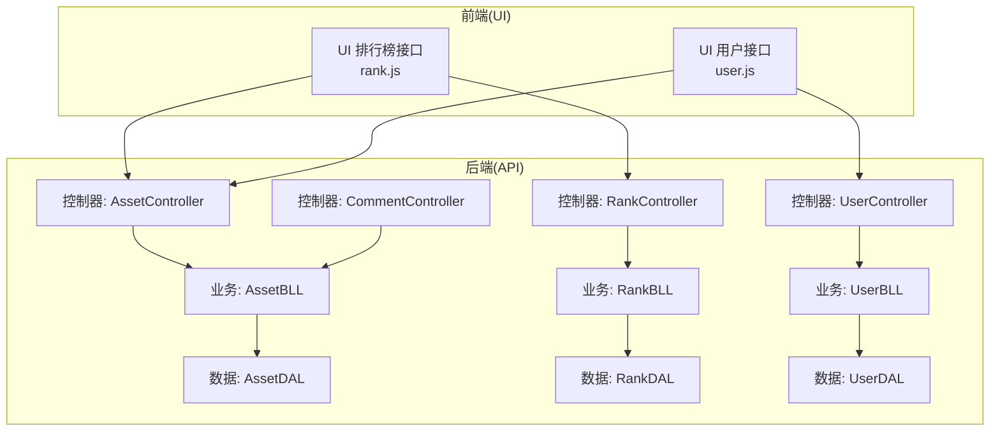
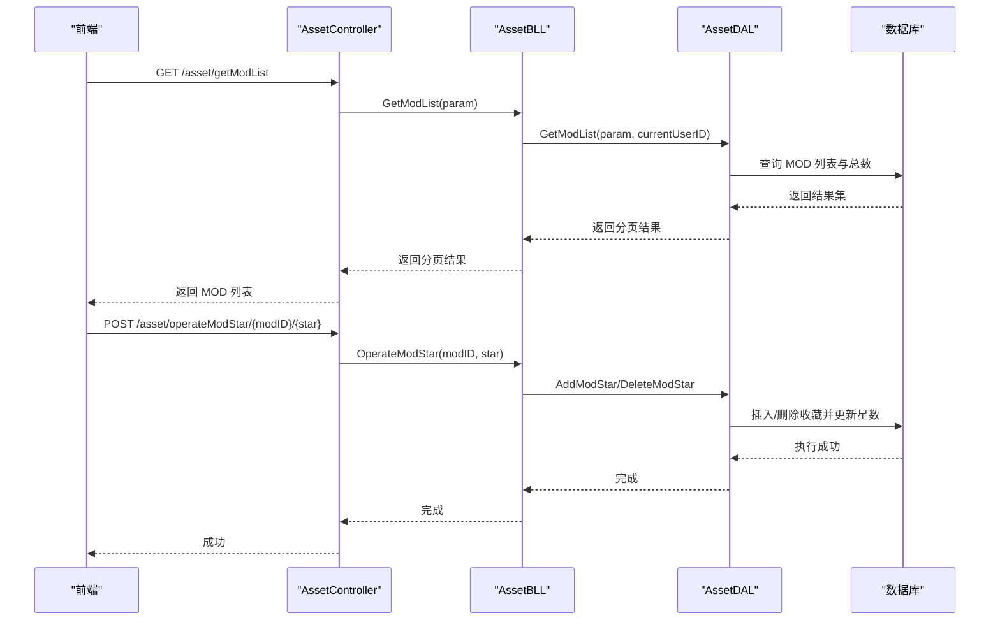
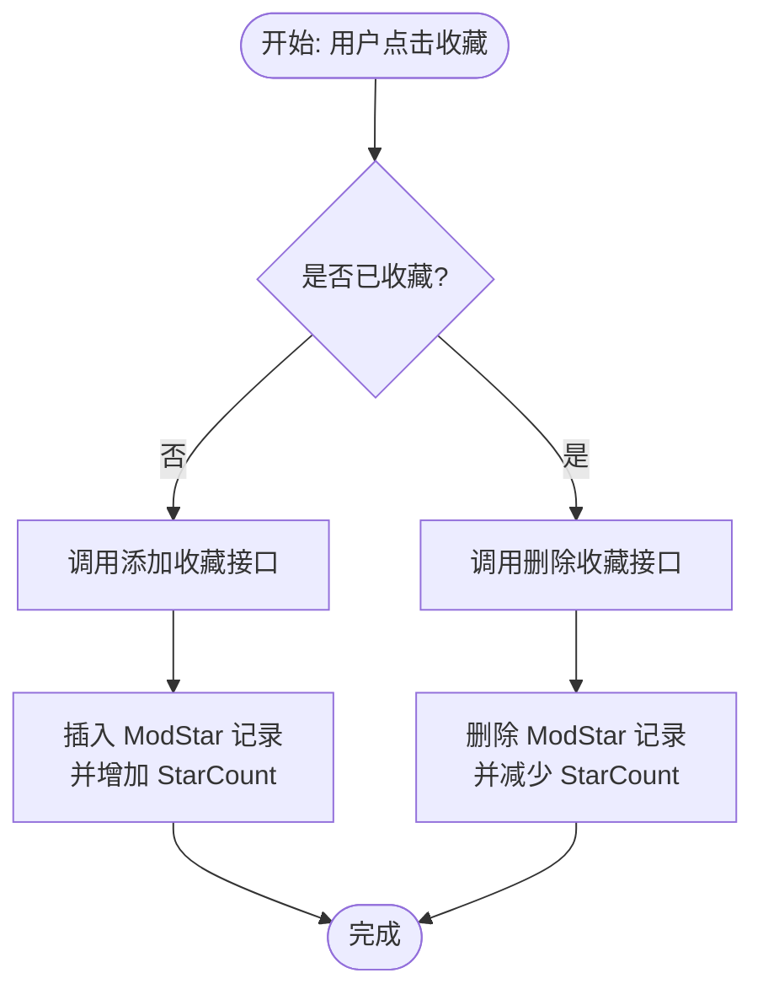
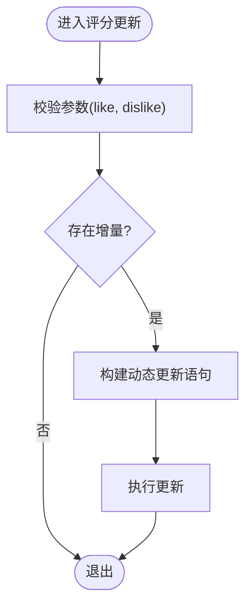
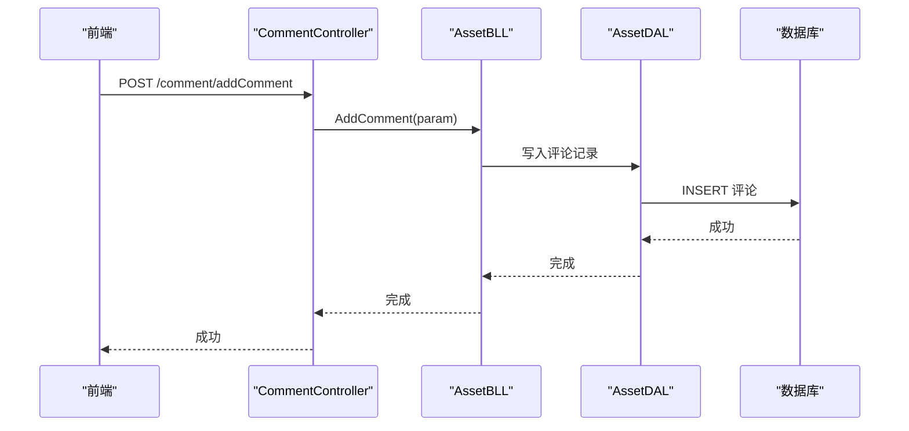
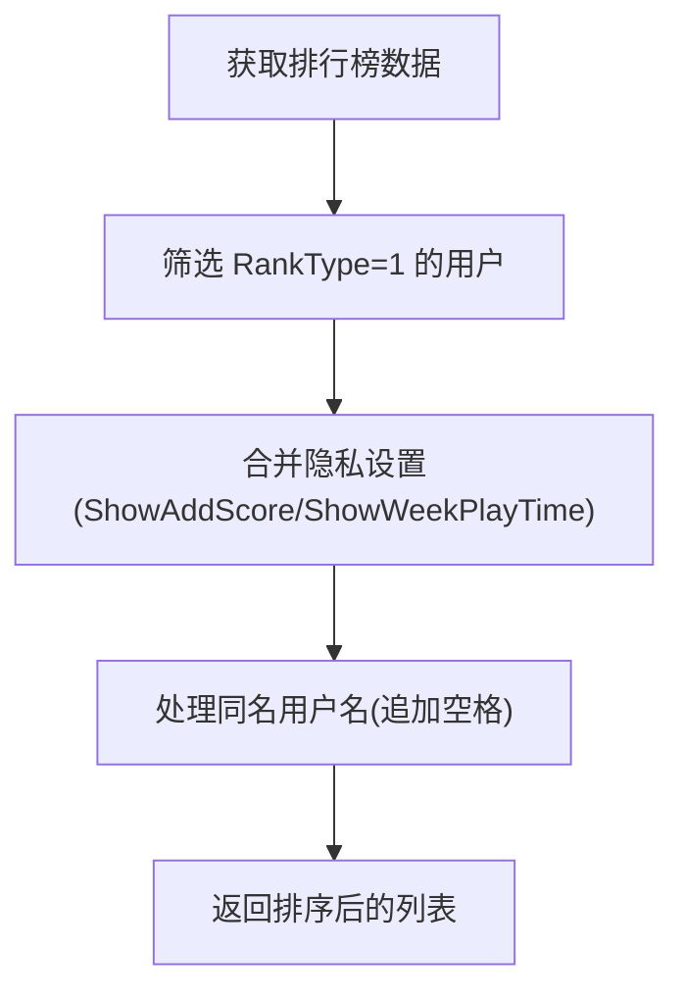
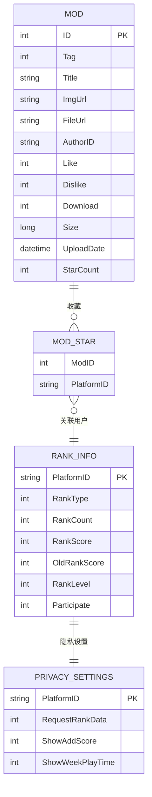
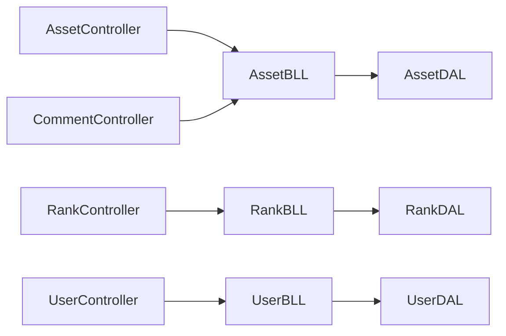

# MOD 互动系统

<cite>
**本文引用的文件**
- [SpeedRunners.API/SpeedRunners.DAL/AssetDAL.cs](file://SpeedRunners.API/SpeedRunners.DAL/AssetDAL.cs)
- [SpeedRunners.API/SpeedRunners.BLL/AssetBLL.cs](file://SpeedRunners.API/SpeedRunners.BLL/AssetBLL.cs)
- [SpeedRunners.API/SpeedRunners/Controllers/AssetController.cs](file://SpeedRunners.API/SpeedRunners/Controllers/AssetController.cs)
- [SpeedRunners.API/SpeedRunners.Model/Asset/MMod.cs](file://SpeedRunners.API/SpeedRunners.Model/Asset/MMod.cs)
- [SpeedRunners.API/SpeedRunners.Model/Asset/MModPageParam.cs](file://SpeedRunners.API/SpeedRunners.Model/Asset/MModPageParam.cs)
- [SpeedRunners.API/SpeedRunners.DAL/RankDAL.cs](file://SpeedRunners.API/SpeedRunners.DAL/RankDAL.cs)
- [SpeedRunners.API/SpeedRunners.BLL/RankBLL.cs](file://SpeedRunners.API/SpeedRunners.BLL/RankBLL.cs)
- [SpeedRunners.API/SpeedRunners/Controllers/RankController.cs](file://SpeedRunners.API/SpeedRunners/Controllers/RankController.cs)
- [SpeedRunners.API/SpeedRunners.DAL/UserDAL.cs](file://SpeedRunners.API/SpeedRunners.DAL/UserDAL.cs)
- [SpeedRunners.API/SpeedRunners.BLL/UserBLL.cs](file://SpeedRunners.API/SpeedRunners.BLL/UserBLL.cs)
- [SpeedRunners.API/SpeedRunners/Controllers/UserController.cs](file://SpeedRunners.API/SpeedRunners/Controllers/UserController.cs)
- [SpeedRunners.API/SpeedRunners/Controllers/CommentController.cs](file://SpeedRunners.API/SpeedRunners/Controllers/CommentController.cs)
- [SpeedRunners.UI/src/api/rank.js](file://SpeedRunners.UI/src/api/rank.js)
- [SpeedRunners.UI/src/api/user.js](file://SpeedRunners.UI/src/api/user.js)
- [mysql-dump/tmdsr.sql](file://mysql-dump/tmdsr.sql)
</cite>

## 目录
1. [引言](#引言)
2. [项目结构](#项目结构)
3. [核心组件](#核心组件)
4. [架构总览](#架构总览)
5. [详细组件分析](#详细组件分析)
6. [依赖关系分析](#依赖关系分析)
7. [性能考量](#性能考量)
8. [故障排查指南](#故障排查指南)
9. [结论](#结论)
10. [附录](#附录)

## 引言
本技术文档围绕 MOD 互动系统展开，重点覆盖以下方面：
- MOD 收藏功能：收藏状态管理、用户偏好记录与收藏列表维护
- MOD 评分与互动：评分规则、平均分计算与评分历史追踪
- MOD 评论功能：评论发布、回复机制与评论审核
- 用户互动数据分析：热门 MOD 排行、互动趋势与用户行为分析
- 数据模型设计、性能优化与扩展方案
- 具体业务逻辑实现与用户体验优化建议

## 项目结构
后端采用三层架构（控制器层、业务层、数据访问层），前端通过统一 API 模块调用后端接口。MOD 互动相关能力主要由资产（Asset）模块承载，同时与排行榜（Rank）、用户（User）模块协同。

图表来源
- [SpeedRunners.API/SpeedRunners/Controllers/AssetController.cs](file://SpeedRunners.API/SpeedRunners/Controllers/AssetController.cs#L1-L48)
- [SpeedRunners.API/SpeedRunners/Controllers/RankController.cs](file://SpeedRunners.API/SpeedRunners/Controllers/RankController.cs#L1-L48)
- [SpeedRunners.API/SpeedRunners/Controllers/UserController.cs](file://SpeedRunners.API/SpeedRunners/Controllers/UserController.cs#L1-L58)
- [SpeedRunners.API/SpeedRunners/Controllers/CommentController.cs](file://SpeedRunners.API/SpeedRunners/Controllers/CommentController.cs#L1-L27)
- [SpeedRunners.API/SpeedRunners.BLL/AssetBLL.cs](file://SpeedRunners.API/SpeedRunners.BLL/AssetBLL.cs#L1-L203)
- [SpeedRunners.API/SpeedRunners.BLL/RankBLL.cs](file://SpeedRunners.API/SpeedRun runners.BLL/RankBLL.cs#L1-L210)
- [SpeedRunners.API/SpeedRunners.BLL/UserBLL.cs](file://SpeedRunners.API/SpeedRunners.BLL/UserBLL.cs#L1-L153)
- [SpeedRunners.API/SpeedRunners.DAL/AssetDAL.cs](file://SpeedRunners.API/SpeedRunners.DAL/AssetDAL.cs#L1-L134)
- [SpeedRunners.API/SpeedRunners.DAL/RankDAL.cs](file://SpeedRunners.API/SpeedRunners.DAL/RankDAL.cs#L1-L175)
- [SpeedRunners.API/SpeedRunners.DAL/UserDAL.cs](file://SpeedRunners.API/SpeedRunners.DAL/UserDAL.cs#L1-L85)

章节来源
- [SpeedRunners.API/SpeedRunners/Controllers/AssetController.cs](file://SpeedRunners.API/SpeedRunners/Controllers/AssetController.cs#L1-L48)
- [SpeedRunners.API/SpeedRunners.BLL/AssetBLL.cs](file://SpeedRunners.API/SpeedRunners.BLL/AssetBLL.cs#L1-L203)
- [SpeedRunners.API/SpeedRunners.DAL/AssetDAL.cs](file://SpeedRunners.API/SpeedRunners.DAL/AssetDAL.cs#L1-L134)

## 核心组件
- 控制器层
  - AssetController：提供 MOD 列表、详情、上传、下载、删除、收藏等接口
  - RankController：提供排行榜、新增积分、小时图表、参与状态等接口
  - UserController：提供用户信息、隐私设置、登录登出等接口
  - CommentController：提供评论列表、添加、删除等接口
- 业务层
  - AssetBLL：封装 MOD 上传令牌生成、下载链接生成、MOD 列表与详情、收藏操作、删除等
  - RankBLL：封装排行榜、新增积分、小时图表、初始化用户数据、参与状态等
  - UserBLL：封装用户信息、隐私设置、登录、令牌管理等
- 数据访问层
  - AssetDAL：封装 MOD 表、ModStar 表的查询、插入、更新、删除
  - RankDAL：封装 RankInfo、RankLog、Sponsor 等表的查询与更新
  - UserDAL：封装 AccessToken、PrivacySettings 等表的查询与更新

章节来源
- [SpeedRunners.API/SpeedRunners/Controllers/AssetController.cs](file://SpeedRunners.API/SpeedRunners/Controllers/AssetController.cs#L1-L48)
- [SpeedRunners.API/SpeedRunners.BLL/AssetBLL.cs](file://SpeedRunners.API/SpeedRunners.BLL/AssetBLL.cs#L1-L203)
- [SpeedRunners.API/SpeedRunners.DAL/AssetDAL.cs](file://SpeedRunners.API/SpeedRunners.DAL/AssetDAL.cs#L1-L134)
- [SpeedRunners.API/SpeedRunners/Controllers/RankController.cs](file://SpeedRunners.API/SpeedRunners/Controllers/RankController.cs#L1-L48)
- [SpeedRunners.API/SpeedRunners.BLL/RankBLL.cs](file://SpeedRunners.API/SpeedRunners.BLL/RankBLL.cs#L1-L210)
- [SpeedRunners.API/SpeedRunners.DAL/RankDAL.cs](file://SpeedRunners.API/SpeedRunners.DAL/RankDAL.cs#L1-L175)
- [SpeedRunners.API/SpeedRunners/Controllers/UserController.cs](file://SpeedRunners.API/SpeedRunners/Controllers/UserController.cs#L1-L58)
- [SpeedRunners.API/SpeedRunners.BLL/UserBLL.cs](file://SpeedRunners.API/SpeedRunners.BLL/UserBLL.cs#L1-L153)
- [SpeedRunners.API/SpeedRunners.DAL/UserDAL.cs](file://SpeedRunners.API/SpeedRunners.DAL/UserDAL.cs#L1-L85)
- [SpeedRunners.API/SpeedRunners/Controllers/CommentController.cs](file://SpeedRunners.API/SpeedRunners/Controllers/CommentController.cs#L1-L27)

## 架构总览
MOD 互动系统以“控制器-业务-数据”分层实现，前后端通过 REST 接口交互。MOD 收藏、下载、列表排序与“NEW”标签均在数据访问层通过 SQL 实现；用户隐私设置影响排行榜与图表展示；评论功能独立于 MOD 主流程但可复用用户认证。

图表来源
- [SpeedRunners.API/SpeedRunners/Controllers/AssetController.cs](file://SpeedRunners.API/SpeedRunners/Controllers/AssetController.cs#L28-L46)
- [SpeedRunners.API/SpeedRunners.BLL/AssetBLL.cs](file://SpeedRunners.API/SpeedRunners.BLL/AssetBLL.cs#L102-L115)
- [SpeedRunners.API/SpeedRunners.DAL/AssetDAL.cs](file://SpeedRunners.API/SpeedRunners.DAL/AssetDAL.cs#L112-L124)

## 详细组件分析

### MOD 收藏功能
- 收藏状态管理
  - 前端请求收藏或取消收藏时，控制器调用业务层，业务层根据 star 参数选择插入或删除收藏记录，并同步更新 MOD 星数
  - 数据访问层通过事务性 SQL 同步写入 ModStar 并更新 MOD 星数
- 用户偏好记录
  - 用户登录后，当前用户标识用于查询其收藏集合，列表返回时标记每个 MOD 的 Star 状态
- 收藏列表维护
  - 列表查询支持仅显示收藏项（OnlyStar），通过用户收藏表过滤 MOD ID 集合

图表来源
- [SpeedRunners.API/SpeedRunners.BLL/AssetBLL.cs](file://SpeedRunners.API/SpeedRunners.BLL/AssetBLL.cs#L102-L115)
- [SpeedRunners.API/SpeedRunners.DAL/AssetDAL.cs](file://SpeedRunners.API/SpeedRunners.DAL/AssetDAL.cs#L112-L124)

章节来源
- [SpeedRunners.API/SpeedRunners/Controllers/AssetController.cs](file://SpeedRunners.API/SpeedRunners/Controllers/AssetController.cs#L40-L42)
- [SpeedRunners.API/SpeedRunners.BLL/AssetBLL.cs](file://SpeedRunners.API/SpeedRunners.BLL/AssetBLL.cs#L102-L115)
- [SpeedRunners.API/SpeedRunners.DAL/AssetDAL.cs](file://SpeedRunners.API/SpeedRunners.DAL/AssetDAL.cs#L16-L72)

### MOD 评分系统
- 评分规则
  - MOD 表包含 Like 与 Dislike 字段，业务层提供批量更新方法，按增量更新
- 平均分计算
  - 当前代码未直接计算平均分字段；如需展示平均分，可在查询层或业务层基于 Like 与 Dislike 计算
- 评分历史追踪
  - 未发现专门的评分历史表；可通过审计日志或扩展 MOD 表字段实现

图表来源
- [SpeedRunners.API/SpeedRunners.DAL/AssetDAL.cs](file://SpeedRunners.API/SpeedRunners.DAL/AssetDAL.cs#L89-L104)
- [SpeedRunners.API/SpeedRunners.BLL/AssetBLL.cs](file://SpeedRunners.API/SpeedRunners.BLL/AssetBLL.cs#L1-L203)

章节来源
- [SpeedRunners.API/SpeedRunners.DAL/AssetDAL.cs](file://SpeedRunners.API/SpeedRunners.DAL/AssetDAL.cs#L89-L104)
- [SpeedRunners.API/SpeedRunners.BLL/AssetBLL.cs](file://SpeedRunners.API/SpeedRunners.BLL/AssetBLL.cs#L1-L203)

### MOD 评论功能
- 评论发布
  - 通过 CommentController 的 AddComment 接口提交评论
- 回复机制
  - 当前仓库未提供评论回复模型与接口；可在评论模型中引入 ParentID 或 ReplyTo 字段并扩展业务层
- 评论审核
  - 当前仓库未提供审核流程；可在评论表增加 Status 字段与审核接口

图表来源
- [SpeedRunners.API/SpeedRunners/Controllers/CommentController.cs](file://SpeedRunners.API/SpeedRunners/Controllers/CommentController.cs#L16-L19)
- [SpeedRunners.API/SpeedRunners.BLL/AssetBLL.cs](file://SpeedRunners.API/SpeedRunners.BLL/AssetBLL.cs#L1-L203)
- [SpeedRunners.API/SpeedRunners.DAL/AssetDAL.cs](file://SpeedRunners.API/SpeedRunners.DAL/AssetDAL.cs#L1-L134)

章节来源
- [SpeedRunners.API/SpeedRunners/Controllers/CommentController.cs](file://SpeedRunners.API/SpeedRunners/Controllers/CommentController.cs#L1-L27)

### 用户互动数据统计分析
- 热门 MOD 排行
  - MOD 列表按“最近一个月上传权重 + 星数×3 + 下载数”的复合排序，且“NEW”标签区分近月上传
- 互动趋势
  - 新增积分图表：按时间段最小分数组合当前分数，计算净增长
  - 小时图表：按周游玩时长排行
- 用户行为分析
  - 用户隐私设置影响排行榜与图表展示（如是否显示周游玩时长、新增积分）

图表来源
- [SpeedRunners.API/SpeedRunners.DAL/RankDAL.cs](file://SpeedRunners.API/SpeedRunners.DAL/RankDAL.cs#L32-L81)
- [SpeedRunners.API/SpeedRunners.BLL/RankBLL.cs](file://SpeedRunners.API/SpeedRunners.BLL/RankBLL.cs#L28-L96)

章节来源
- [SpeedRunners.API/SpeedRunners.DAL/RankDAL.cs](file://SpeedRunners.API/SpeedRunners.DAL/RankDAL.cs#L32-L92)
- [SpeedRunners.API/SpeedRunners.BLL/RankBLL.cs](file://SpeedRunners.API/SpeedRunners.BLL/RankBLL.cs#L28-L96)

### 数据模型设计
- MOD 模型
  - 字段：ID、Tag、Title、ImgUrl、FileUrl、AuthorID、Like、Dislike、Download、Size、UploadDate、StarCount、Star
  - 列表输出模型：IsNew 标记
- 分页参数
  - Tag、OnlyStar、关键词模糊匹配等
- 数据库样例
  - MOD 表包含大量示例数据，可用于验证列表、排序与收藏逻辑

图表来源
- [SpeedRunners.API/SpeedRunners.Model/Asset/MMod.cs](file://SpeedRunners.API/SpeedRunners.Model/Asset/MMod.cs#L7-L26)
- [SpeedRunners.API/SpeedRunners.Model/Asset/MModPageParam.cs](file://SpeedRunners.API/SpeedRunners.Model/Asset/MModPageParam.cs#L7-L12)
- [mysql-dump/tmdsr.sql](file://mysql-dump/tmdsr.sql#L235-L336)

章节来源
- [SpeedRunners.API/SpeedRunners.Model/Asset/MMod.cs](file://SpeedRunners.API/SpeedRunners.Model/Asset/MMod.cs#L1-L28)
- [SpeedRunners.API/SpeedRunners.Model/Asset/MModPageParam.cs](file://SpeedRunners.API/SpeedRunners.Model/Asset/MModPageParam.cs#L1-L13)
- [mysql-dump/tmdsr.sql](file://mysql-dump/tmdsr.sql#L235-L336)

## 依赖关系分析
- 控制器依赖业务层，业务层依赖数据访问层，形成清晰的单向依赖
- MOD 收藏与下载统计依赖数据库事务一致性
- 排行榜与图表依赖隐私设置与用户状态
- 评论功能与 MOD 解耦，便于独立扩展

图表来源
- [SpeedRunners.API/SpeedRunners/Controllers/AssetController.cs](file://SpeedRunners.API/SpeedRunners/Controllers/AssetController.cs#L1-L48)
- [SpeedRunners.API/SpeedRunners/Controllers/RankController.cs](file://SpeedRunners.API/SpeedRunners/Controllers/RankController.cs#L1-L48)
- [SpeedRunners.API/SpeedRunners/Controllers/UserController.cs](file://SpeedRunners.API/SpeedRunners/Controllers/UserController.cs#L1-L58)
- [SpeedRunners.API/SpeedRunners/Controllers/CommentController.cs](file://SpeedRunners.API/SpeedRunners/Controllers/CommentController.cs#L1-L27)
- [SpeedRunners.API/SpeedRunners.BLL/AssetBLL.cs](file://SpeedRunners.API/SpeedRunners.BLL/AssetBLL.cs#L1-L203)
- [SpeedRunners.API/SpeedRunners.BLL/RankBLL.cs](file://SpeedRunners.API/SpeedRunners.BLL/RankBLL.cs#L1-L210)
- [SpeedRunners.API/SpeedRunners.BLL/UserBLL.cs](file://SpeedRunners.API/SpeedRunners.BLL/UserBLL.cs#L1-L153)
- [SpeedRunners.API/SpeedRunners.DAL/AssetDAL.cs](file://SpeedRunners.API/SpeedRunners.DAL/AssetDAL.cs#L1-L134)
- [SpeedRunners.API/SpeedRunners.DAL/RankDAL.cs](file://SpeedRunners.API/SpeedRunners.DAL/RankDAL.cs#L1-L175)
- [SpeedRunners.API/SpeedRunners.DAL/UserDAL.cs](file://SpeedRunners.API/SpeedRunners.DAL/UserDAL.cs#L1-L85)

章节来源
- [SpeedRunners.API/SpeedRunners/Controllers/AssetController.cs](file://SpeedRunners.API/SpeedRunners/Controllers/AssetController.cs#L1-L48)
- [SpeedRunners.API/SpeedRunners.BLL/AssetBLL.cs](file://SpeedRunners.API/SpeedRunners.BLL/AssetBLL.cs#L1-L203)
- [SpeedRunners.API/SpeedRunners.DAL/AssetDAL.cs](file://SpeedRunners.API/SpeedRunners.DAL/AssetDAL.cs#L1-L134)

## 性能考量
- 列表查询
  - 使用分页与复合排序索引，避免全表扫描
  - “NEW”标签与星数权重排序在 SQL 中一次性完成，减少应用层二次处理
- 收藏与下载
  - 收藏与下载计数更新使用原子更新，降低并发冲突
- 隐私设置
  - 排行榜与图表查询中通过 LEFT JOIN 隐私设置表进行过滤，避免额外网络往返
- 建议
  - 对 MOD 表建立必要索引（Tag、UploadDate、StarCount、Download）
  - 对 ModStar 表建立联合索引（ModID, PlatformID）
  - 对 RankInfo 与 RankLog 建立日期与平台索引，提升图表查询效率

## 故障排查指南
- 登录失败
  - 检查 OpenID 校验返回值与异常分支，确认超时与失败场景
- 令牌与权限
  - 删除其他设备登录需校验平台 ID 与登录时间顺序，防止越权
- MOD 删除
  - 仅作者或特定管理员可删除；删除时同步清理对象存储文件

章节来源
- [SpeedRunners.API/SpeedRunners.BLL/UserBLL.cs](file://SpeedRunners.API/SpeedRunners.BLL/UserBLL.cs#L60-L93)
- [SpeedRunners.API/SpeedRunners.BLL/UserBLL.cs](file://SpeedRunners.API/SpeedRunners.BLL/UserBLL.cs#L121-L141)
- [SpeedRunners.API/SpeedRunners.BLL/AssetBLL.cs](file://SpeedRunners.API/SpeedRunners.BLL/AssetBLL.cs#L120-L143)

## 结论
MOD 互动系统以清晰的分层架构实现了收藏、下载、列表排序与排行榜统计等核心功能。通过合理的数据模型与 SQL 设计，系统在保证功能完整性的同时兼顾了性能与可扩展性。后续可在评论回复、评分历史与平均分计算等方面进一步完善，以满足更丰富的用户互动需求。

## 附录
- 前端 API 使用示例
  - 排行榜与图表：通过 rank.js 调用后端接口
  - 用户设置：通过 user.js 设置隐私开关与偏好

章节来源
- [SpeedRunners.UI/src/api/rank.js](file://SpeedRunners.UI/src/api/rank.js#L1-L64)
- [SpeedRunners.UI/src/api/user.js](file://SpeedRunners.UI/src/api/user.js#L1-L77)