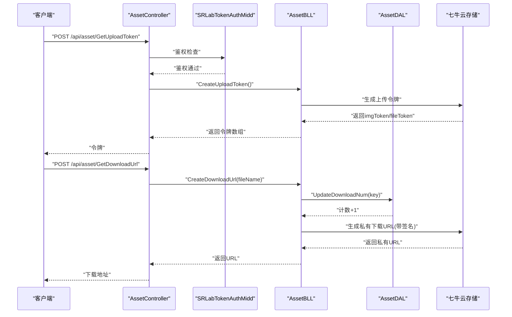
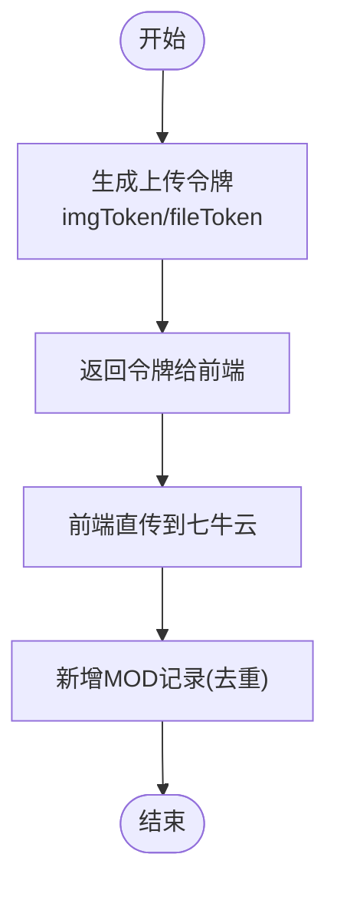
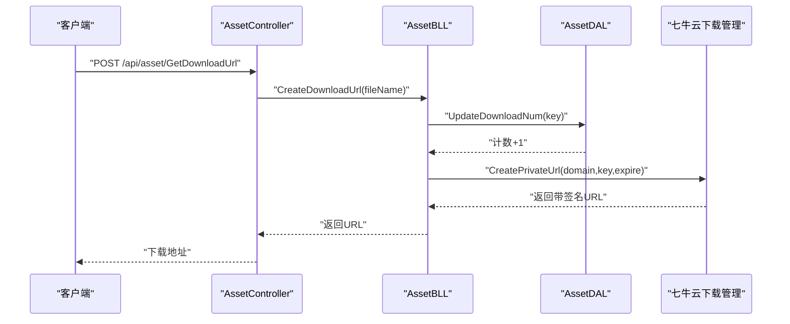
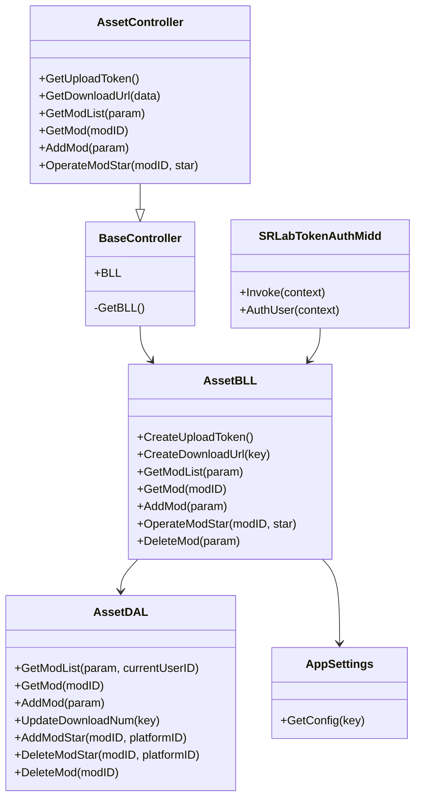

# MOD 存储系统

<cite>
**本文引用的文件**
- [SpeedRunners.API/SpeedRunners/Controllers/AssetController.cs](file://SpeedRunners.API/SpeedRunners/Controllers/AssetController.cs)
- [SpeedRunners.API/SpeedRunners/Controllers/BaseController.cs](file://SpeedRunners.API/SpeedRunners/Controllers/BaseController.cs)
- [SpeedRunners.API/SpeedRunners/Middleware/SRLabTokenAuthMidd.cs](file://SpeedRunners.API/SpeedRunners/Middleware/SRLabTokenAuthMidd.cs)
- [SpeedRunners.API/SpeedRunners/Startup.cs](file://SpeedRunners.API/SpeedRunners/Startup.cs)
- [SpeedRunners.API/SpeedRunners.BLL/AssetBLL.cs](file://SpeedRunners.API/SpeedRunners.BLL/AssetBLL.cs)
- [SpeedRunners.API/SpeedRunners.DAL/AssetDAL.cs](file://SpeedRunners.API/SpeedRunners.DAL/AssetDAL.cs)
- [SpeedRunners.API/SpeedRunners.Model/Asset/MMod.cs](file://SpeedRunners.API/SpeedRunners.Model/Asset/MMod.cs)
- [SpeedRunners.API/SpeedRunners.Model/Asset/MModPageParam.cs](file://SpeedRunners.API/SpeedRunners.Model/Asset/MModPageParam.cs)
- [SpeedRunners.API/SpeedRunners.Utils/AppSettings.cs](file://SpeedRunners.API/SpeedRunners.Utils/AppSettings.cs)
</cite>

## 目录
1. [简介](#简介)
2. [项目结构](#项目结构)
3. [核心组件](#核心组件)
4. [架构总览](#架构总览)
5. [详细组件分析](#详细组件分析)
6. [依赖关系分析](#依赖关系分析)
7. [性能考虑](#性能考虑)
8. [故障排查指南](#故障排查指南)
9. [结论](#结论)
10. [附录](#附录)

## 简介
本技术文档围绕 MOD 存储系统展开，重点解析以下方面：
- 上传机制：上传令牌生成、客户端直传与服务端校验、存储策略（七牛云）。
- 下载机制：私有资源 URL 生成、签名与有效期控制、访问计数更新。
- 文件存储架构：本地存储与云存储（七牛云）结合、CDN 加速。
- 安全管理：访问鉴权、下载 URL 签名、访问日志与审计。
- 配置项、性能优化与故障恢复策略，并提供可落地的部署建议。

## 项目结构
后端采用 ASP.NET Core MVC 架构，按职责分层组织：
- 控制器层：对外暴露资产（MOD）相关接口。
- 业务逻辑层：封装上传/下载/列表查询等业务流程。
- 数据访问层：基于 Dapper 的数据库操作。
- 工具与配置：统一配置读取、通用基类、中间件与启动配置。
- 中间件：自定义 Token 鉴权中间件，拦截并注入当前用户上下文。

```mermaid
graph TB
subgraph "控制器层"
AC["AssetController<br/>上传/下载/列表/增删改"]
end
subgraph "业务层"
BLL["AssetBLL<br/>上传令牌/下载URL/删除/赞助商"]
end
subgraph "数据层"
DAL["AssetDAL<br/>分页/增删改/统计"]
end
subgraph "工具与配置"
CFG["AppSettings<br/>配置读取"]
MID["SRLabTokenAuthMidd<br/>鉴权中间件"]
BASE["BaseController<br/>BLL注入/本地化"]
end
subgraph "外部服务"
QINIU["七牛云存储<br/>上传/下载/删除"]
CDN["CDN加速<br/>cdn-mod/cdn-img"]
end
AC --> BLL
BLL --> DAL
BLL --> CFG
AC --> BASE
BASE --> MID
BLL --> QINIU
AC --> CDN
```

图表来源
- [SpeedRunners.API/SpeedRunners/Controllers/AssetController.cs](file://SpeedRunners.API/SpeedRunners/Controllers/AssetController.cs#L1-L48)
- [SpeedRunners.API/SpeedRunners.BLL/AssetBLL.cs](file://SpeedRunners.API/SpeedRunners.BLL/AssetBLL.cs#L1-L203)
- [SpeedRunners.API/SpeedRunners.DAL/AssetDAL.cs](file://SpeedRunners.API/SpeedRunners.DAL/AssetDAL.cs#L1-L134)
- [SpeedRunners.API/SpeedRunners.Utils/AppSettings.cs](file://SpeedRunners.API/SpeedRunners.Utils/AppSettings.cs#L1-L55)
- [SpeedRunners.API/SpeedRunners/Middleware/SRLabTokenAuthMidd.cs](file://SpeedRunners.API/SpeedRunners/Middleware/SRLabTokenAuthMidd.cs#L1-L123)
- [SpeedRunners.API/SpeedRunners/Controllers/BaseController.cs](file://SpeedRunners.API/SpeedRunners/Controllers/BaseController.cs#L1-L26)

章节来源
- [SpeedRunners.API/SpeedRunners/Controllers/AssetController.cs](file://SpeedRunners.API/SpeedRunners/Controllers/AssetController.cs#L1-L48)
- [SpeedRunners.API/SpeedRunners.BLL/AssetBLL.cs](file://SpeedRunners.API/SpeedRunners.BLL/AssetBLL.cs#L1-L203)
- [SpeedRunners.API/SpeedRunners.DAL/AssetDAL.cs](file://SpeedRunners.API/SpeedRunners.DAL/AssetDAL.cs#L1-L134)
- [SpeedRunners.API/SpeedRunners.Utils/AppSettings.cs](file://SpeedRunners.API/SpeedRunners.Utils/AppSettings.cs#L1-L55)
- [SpeedRunners.API/SpeedRunners/Middleware/SRLabTokenAuthMidd.cs](file://SpeedRunners.API/SpeedRunners/Middleware/SRLabTokenAuthMidd.cs#L1-L123)
- [SpeedRunners.API/SpeedRunners/Controllers/BaseController.cs](file://SpeedRunners.API/SpeedRunners/Controllers/BaseController.cs#L1-L26)

## 核心组件
- 资产控制器：提供获取上传令牌、生成下载 URL、MOD 列表与详情、新增/收藏/删除等接口。
- 业务逻辑层：负责上传令牌生成、私有下载 URL 生成、数据库操作、资源删除、赞助商查询。
- 数据访问层：实现分页查询、新增、点赞/下载计数更新、收藏增删、删除。
- 鉴权中间件：从请求头提取 Token，校验有效性并注入当前用户上下文。
- 配置工具：集中读取 AccessKey/SecretKey、CDN 域名、第三方接口参数等。

章节来源
- [SpeedRunners.API/SpeedRunners/Controllers/AssetController.cs](file://SpeedRunners.API/SpeedRunners/Controllers/AssetController.cs#L16-L46)
- [SpeedRunners.API/SpeedRunners.BLL/AssetBLL.cs](file://SpeedRunners.API/SpeedRunners.BLL/AssetBLL.cs#L22-L47)
- [SpeedRunners.API/SpeedRunners.DAL/AssetDAL.cs](file://SpeedRunners.API/SpeedRunners.DAL/AssetDAL.cs#L16-L131)
- [SpeedRunners.API/SpeedRunners/Middleware/SRLabTokenAuthMidd.cs](file://SpeedRunners.API/SpeedRunners/Middleware/SRLabTokenAuthMidd.cs#L54-L101)
- [SpeedRunners.API/SpeedRunners.Utils/AppSettings.cs](file://SpeedRunners.API/SpeedRunners.Utils/AppSettings.cs#L16-L38)

## 架构总览
系统通过控制器接收请求，经鉴权中间件注入用户上下文后进入业务层；业务层调用数据层与外部存储服务（七牛云），最终返回统一响应格式。

图表来源
- [SpeedRunners.API/SpeedRunners/Controllers/AssetController.cs](file://SpeedRunners.API/SpeedRunners/Controllers/AssetController.cs#L16-L26)
- [SpeedRunners.API/SpeedRunners/Middleware/SRLabTokenAuthMidd.cs](file://SpeedRunners.API/SpeedRunners/Middleware/SRLabTokenAuthMidd.cs#L31-L47)
- [SpeedRunners.API/SpeedRunners.BLL/AssetBLL.cs](file://SpeedRunners.API/SpeedRunners.BLL/AssetBLL.cs#L22-L47)
- [SpeedRunners.API/SpeedRunners.DAL/AssetDAL.cs](file://SpeedRunners.API/SpeedRunners.DAL/AssetDAL.cs#L106-L110)

## 详细组件分析

### 上传令牌生成与文件验证
- 上传令牌生成：业务层使用七牛云 SDK 生成两个作用域的上传令牌（图片与 MOD），分别对应不同存储空间。
- 客户端直传：前端使用返回的令牌直接向七牛云上传，避免服务端中转，降低带宽与延迟。
- 文件验证与入库：新增 MOD 时，若数据库中不存在相同图片键则插入记录；上传计数由下载接口触发更新，确保一致性。

图表来源
- [SpeedRunners.API/SpeedRunners.BLL/AssetBLL.cs](file://SpeedRunners.API/SpeedRunners.BLL/AssetBLL.cs#L22-L36)
- [SpeedRunners.API/SpeedRunners.BLL/AssetBLL.cs](file://SpeedRunners.API/SpeedRunners.BLL/AssetBLL.cs#L79-L87)
- [SpeedRunners.API/SpeedRunners.DAL/AssetDAL.cs](file://SpeedRunners.API/SpeedRunners.DAL/AssetDAL.cs#L79-L87)

章节来源
- [SpeedRunners.API/SpeedRunners.BLL/AssetBLL.cs](file://SpeedRunners.API/SpeedRunners.BLL/AssetBLL.cs#L22-L36)
- [SpeedRunners.API/SpeedRunners.DAL/AssetDAL.cs](file://SpeedRunners.API/SpeedRunners.DAL/AssetDAL.cs#L79-L87)

### 下载链接生成与访问控制
- 私有资源下载：业务层生成带签名的私有下载 URL，并设置有效期（示例为 10 分钟）。
- 访问计数：每次生成下载 URL 时，同步更新数据库中的下载次数。
- CDN 加速：图片与 MOD 资源分别指向不同域名，利用 CDN 提升访问速度。

图表来源
- [SpeedRunners.API/SpeedRunners/Controllers/AssetController.cs](file://SpeedRunners.API/SpeedRunners/Controllers/AssetController.cs#L20-L26)
- [SpeedRunners.API/SpeedRunners.BLL/AssetBLL.cs](file://SpeedRunners.API/SpeedRunners.BLL/AssetBLL.cs#L38-L47)
- [SpeedRunners.API/SpeedRunners.DAL/AssetDAL.cs](file://SpeedRunners.API/SpeedRunners.DAL/AssetDAL.cs#L106-L110)

章节来源
- [SpeedRunners.API/SpeedRunners.BLL/AssetBLL.cs](file://SpeedRunners.API/SpeedRunners.BLL/AssetBLL.cs#L38-L47)
- [SpeedRunners.API/SpeedRunners.DAL/AssetDAL.cs](file://SpeedRunners.API/SpeedRunners.DAL/AssetDAL.cs#L106-L110)

### 文件存储架构与 CDN 配置
- 本地存储：项目未见本地磁盘直存逻辑，主要通过配置读取外部服务密钥与域名。
- 云存储集成：使用七牛云 SDK 进行上传令牌生成、私有下载 URL 生成与资源删除。
- CDN 配置：图片与 MOD 资源分别指向 cdn-img 与 cdn-mod 域名，提升全球访问性能。

章节来源
- [SpeedRunners.API/SpeedRunners.BLL/AssetBLL.cs](file://SpeedRunners.API/SpeedRunners.BLL/AssetBLL.cs#L18-L21)
- [SpeedRunners.API/SpeedRunners.BLL/AssetBLL.cs](file://SpeedRunners.API/SpeedRunners.BLL/AssetBLL.cs#L58-L78)
- [SpeedRunners.API/SpeedRunners.BLL/AssetBLL.cs](file://SpeedRunners.API/SpeedRunners.BLL/AssetBLL.cs#L41-L41)

### 文件安全管理
- 访问鉴权：中间件从请求头读取 srlab-token，校验用户有效性并注入上下文，未登录用户无法访问受保护接口。
- 下载 URL 签名：私有资源通过带过期时间的签名 URL 控制访问，防止外链盗刷。
- 访问日志：系统具备统一响应与过滤器，便于在后续扩展中接入访问日志与审计。

章节来源
- [SpeedRunners.API/SpeedRunners/Middleware/SRLabTokenAuthMidd.cs](file://SpeedRunners.API/SpeedRunners/Middleware/SRLabTokenAuthMidd.cs#L54-L101)
- [SpeedRunners.API/SpeedRunners.BLL/AssetBLL.cs](file://SpeedRunners.API/SpeedRunners.BLL/AssetBLL.cs#L38-L47)
- [SpeedRunners.API/SpeedRunners/Startup.cs](file://SpeedRunners.API/SpeedRunners/Startup.cs#L46-L49)

### 数据模型与分页查询
- MOD 模型：包含标签、标题、图片与文件键、作者平台 ID、点赞/下载/收藏计数、上传时间等字段。
- 分页参数：支持标签筛选、关键词模糊匹配、仅看收藏等条件。
- 排序规则：近一个月上传的 MOD 优先，随后按收藏/下载综合排序。

章节来源
- [SpeedRunners.API/SpeedRunners.Model/Asset/MMod.cs](file://SpeedRunners.API/SpeedRunners.Model/Asset/MMod.cs#L7-L26)
- [SpeedRunners.API/SpeedRunners.Model/Asset/MModPageParam.cs](file://SpeedRunners.API/SpeedRunners.Model/Asset/MModPageParam.cs#L7-L11)
- [SpeedRunners.API/SpeedRunners.DAL/AssetDAL.cs](file://SpeedRunners.API/SpeedRunners.DAL/AssetDAL.cs#L16-L72)

## 依赖关系分析
- 控制器依赖业务层，业务层依赖数据层与配置工具。
- 鉴权中间件在管道早期执行，为后续控制器与业务层提供用户上下文。
- 业务层依赖七牛云 SDK 与数据库访问层，实现上传/下载/删除与计数更新。

图表来源
- [SpeedRunners.API/SpeedRunners/Controllers/AssetController.cs](file://SpeedRunners.API/SpeedRunners/Controllers/AssetController.cs#L14-L46)
- [SpeedRunners.API/SpeedRunners/Controllers/BaseController.cs](file://SpeedRunners.API/SpeedRunners/Controllers/BaseController.cs#L10-L23)
- [SpeedRunners.API/SpeedRunners.BLL/AssetBLL.cs](file://SpeedRunners.API/SpeedRunners.BLL/AssetBLL.cs#L16-L203)
- [SpeedRunners.API/SpeedRunners.DAL/AssetDAL.cs](file://SpeedRunners.API/SpeedRunners.DAL/AssetDAL.cs#L13-L134)
- [SpeedRunners.API/SpeedRunners.Utils/AppSettings.cs](file://SpeedRunners.API/SpeedRunners.Utils/AppSettings.cs#L8-L55)
- [SpeedRunners.API/SpeedRunners/Middleware/SRLabTokenAuthMidd.cs](file://SpeedRunners.API/SpeedRunners/Middleware/SRLabTokenAuthMidd.cs#L18-L101)

章节来源
- [SpeedRunners.API/SpeedRunners/Controllers/AssetController.cs](file://SpeedRunners.API/SpeedRunners/Controllers/AssetController.cs#L14-L46)
- [SpeedRunners.API/SpeedRunners.BLL/AssetBLL.cs](file://SpeedRunners.API/SpeedRunners.BLL/AssetBLL.cs#L16-L203)
- [SpeedRunners.API/SpeedRunners.DAL/AssetDAL.cs](file://SpeedRunners.API/SpeedRunners.DAL/AssetDAL.cs#L13-L134)
- [SpeedRunners.API/SpeedRunners.Utils/AppSettings.cs](file://SpeedRunners.API/SpeedRunners.Utils/AppSettings.cs#L8-L55)
- [SpeedRunners.API/SpeedRunners/Middleware/SRLabTokenAuthMidd.cs](file://SpeedRunners.API/SpeedRunners/Middleware/SRLabTokenAuthMidd.cs#L18-L101)

## 性能考虑
- 上传直传：前端直连七牛云，减少服务端带宽与 CPU 开销。
- CDN 加速：图片与 MOD 资源分别走独立域名，充分利用缓存与就近分发。
- 计数更新：下载 URL 生成时更新下载次数，避免额外查询开销。
- 数据库优化：分页查询使用复合排序与条件拼接，减少无效数据传输。

章节来源
- [SpeedRunners.API/SpeedRunners.BLL/AssetBLL.cs](file://SpeedRunners.API/SpeedRunners.BLL/AssetBLL.cs#L38-L47)
- [SpeedRunners.API/SpeedRunners.DAL/AssetDAL.cs](file://SpeedRunners.API/SpeedRunners.DAL/AssetDAL.cs#L16-L72)

## 故障排查指南
- 上传失败
  - 检查上传令牌是否正确生成与传递。
  - 确认存储空间名称与权限配置。
- 下载失败
  - 校验签名 URL 是否过期。
  - 确认文件键与存储空间一致。
- 访问受限
  - 检查请求头 srlab-token 是否存在且有效。
  - 确认用户平台 ID 是否被识别。
- 数据不一致
  - 核对下载计数更新逻辑与数据库状态。

章节来源
- [SpeedRunners.API/SpeedRunners.BLL/AssetBLL.cs](file://SpeedRunners.API/SpeedRunners.BLL/AssetBLL.cs#L150-L160)
- [SpeedRunners.API/SpeedRunners.BLL/AssetBLL.cs](file://SpeedRunners.API/SpeedRunners.BLL/AssetBLL.cs#L102-L115)
- [SpeedRunners.API/SpeedRunners/Middleware/SRLabTokenAuthMidd.cs](file://SpeedRunners.API/SpeedRunners/Middleware/SRLabTokenAuthMidd.cs#L54-L101)

## 结论
该 MOD 存储系统以七牛云为核心，结合 CDN 与私有签名 URL 实现高效、安全的文件上传与下载。通过鉴权中间件与统一响应体系，保障了访问控制与可观测性。建议在生产环境进一步完善病毒扫描、内容审查与访问日志审计能力，并持续监控 CDN 与存储成本。

## 附录

### 配置项与部署要点
- 配置项
  - AccessKey/SecretKey：用于生成上传与下载签名。
  - AfdianUserID/AfdianToken：赞助商查询所需参数。
  - CDN 域名：cdn-mod 与 cdn-img。
- 部署建议
  - 在生产环境启用 HTTPS 与严格 CORS 策略。
  - 对上传令牌有效期进行动态调整，平衡安全性与用户体验。
  - 使用 CDN 回源策略与缓存刷新机制，确保资源更新及时。

章节来源
- [SpeedRunners.API/SpeedRunners.BLL/AssetBLL.cs](file://SpeedRunners.API/SpeedRunners.BLL/AssetBLL.cs#L18-L21)
- [SpeedRunners.API/SpeedRunners.BLL/AssetBLL.cs](file://SpeedRunners.API/SpeedRunners.BLL/AssetBLL.cs#L58-L78)
- [SpeedRunners.API/SpeedRunners.BLL/AssetBLL.cs](file://SpeedRunners.API/SpeedRunners.BLL/AssetBLL.cs#L41-L41)
- [SpeedRunners.API/SpeedRunners/Startup.cs](file://SpeedRunners.API/SpeedRunners/Startup.cs#L36-L40)