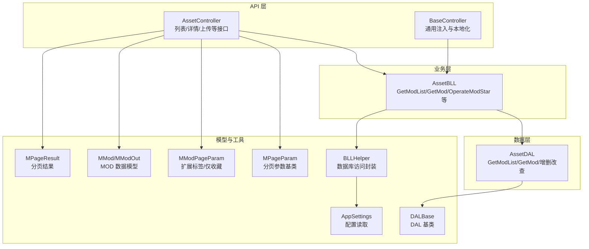
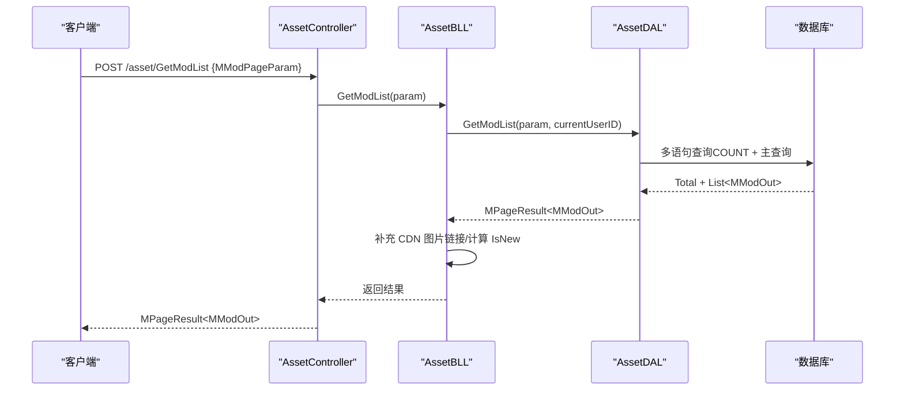
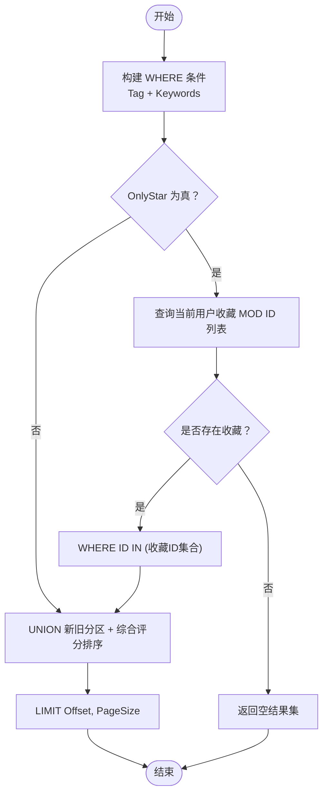
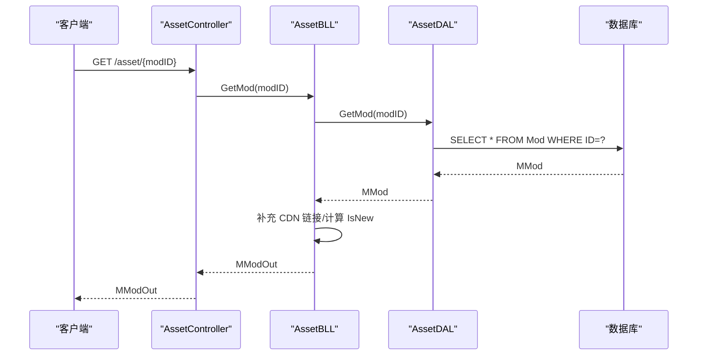
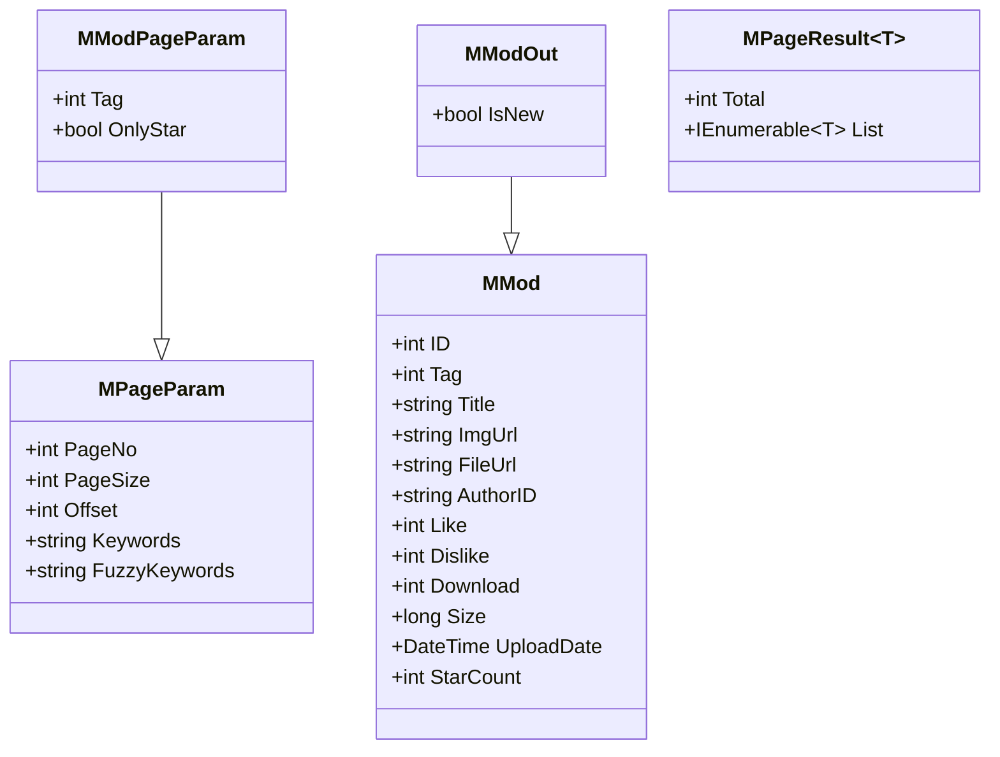
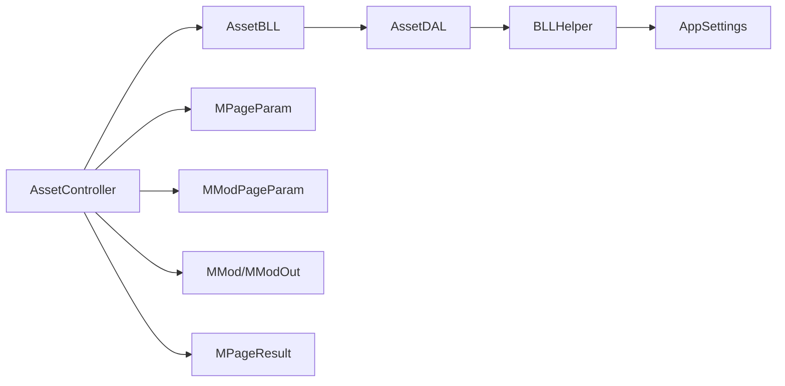

# MOD 查询系统

<cite>
**本文引用的文件**
- [SpeedRunners.API/SpeedRunners/Controllers/AssetController.cs](file://SpeedRunners.API/SpeedRunners/Controllers/AssetController.cs)
- [SpeedRunners.API/SpeedRunners/Controllers/BaseController.cs](file://SpeedRunners.API/SpeedRunners/Controllers/BaseController.cs)
- [SpeedRunners.API/SpeedRunners.BLL/AssetBLL.cs](file://SpeedRunners.API/SpeedRunners.BLL/AssetBLL.cs)
- [SpeedRunners.API/SpeedRunners.DAL/AssetDAL.cs](file://SpeedRunners.API/SpeedRunners.DAL/AssetDAL.cs)
- [SpeedRunners.API/SpeedRunners.Model/Asset/MModPageParam.cs](file://SpeedRunners.API/SpeedRunners.Model/Asset/MModPageParam.cs)
- [SpeedRunners.API/SpeedRunners.Model/Asset/MMod.cs](file://SpeedRunners.API/SpeedRunners.Model/Asset/MMod.cs)
- [SpeedRunners.API/SpeedRunners.Model/MPageParam.cs](file://SpeedRunners.API/SpeedRunners.Model/MPageParam.cs)
- [SpeedRunners.API/SpeedRunners.Model/MPageResult.cs](file://SpeedRunners.API/SpeedRunners.Model/MPageResult.cs)
- [SpeedRunners.API/SpeedRunners/Startup.cs](file://SpeedRunners.API/SpeedRunners/Startup.cs)
- [SpeedRunners.API/SpeedRunners/Program.cs](file://SpeedRunners.API/SpeedRunners/Program.cs)
- [SpeedRunners.API/SpeedRunners/appsettings.json](file://SpeedRunners.API/SpeedRunners/appsettings.json)
- [SpeedRunners.API/SpeedRunners.Utils/AppSettings.cs](file://SpeedRunners.API/SpeedRunners.Utils/AppSettings.cs)
- [SpeedRunners.API/SpeedRunners.Utils/BLLHelper.cs](file://SpeedRunners.API/SpeedRunners.Utils/BLLHelper.cs)
- [SpeedRunners.API/SpeedRunners.Utils/DALBase.cs](file://SpeedRunners.API/SpeedRunners.Utils/DALBase.cs)
</cite>

## 目录
1. [简介](#简介)
2. [项目结构](#项目结构)
3. [核心组件](#核心组件)
4. [架构总览](#架构总览)
5. [详细组件分析](#详细组件分析)
6. [依赖关系分析](#依赖关系分析)
7. [性能考虑](#性能考虑)
8. [故障排查指南](#故障排查指南)
9. [结论](#结论)
10. [附录：接口与使用示例](#附录接口与使用示例)

## 简介
本技术文档围绕 MOD 查询系统进行深入解析，重点覆盖以下方面：
- MOD 列表查询的实现原理：分页参数处理、排序规则、筛选条件（标签、关键词、收藏过滤）。
- MModPageParam 数据模型设计：字段定义、验证规则与默认值。
- MOD 详情获取机制：单个 MOD 的检索与关联数据（如收藏状态）的加载。
- 查询性能优化策略：SQL 查询计划、索引使用建议、缓存与并发控制。
- 接口使用示例与性能调优建议。

## 项目结构
MOD 查询系统位于 API 层控制器、业务层（BLL）、数据层（DAL）以及模型与工具类之间，采用经典的分层架构：
- 控制器层负责请求路由与参数绑定。
- 业务层封装查询与业务逻辑，协调 DAL 并处理响应包装。
- 数据层通过 Dapper 进行 SQL 查询与更新。
- 模型层包含分页参数、分页结果与 MOD 数据模型。
- 工具层提供配置读取、数据库连接与事务封装。

图表来源
- [SpeedRunners.API/SpeedRunners/Controllers/AssetController.cs](file://SpeedRunners.API/SpeedRunners/Controllers/AssetController.cs#L1-L48)
- [SpeedRunners.API/SpeedRunners.BLL/AssetBLL.cs](file://SpeedRunners.API/SpeedRunners.BLL/AssetBLL.cs#L1-L203)
- [SpeedRunners.API/SpeedRunners.DAL/AssetDAL.cs](file://SpeedRunners.API/SpeedRunners.DAL/AssetDAL.cs#L1-L134)
- [SpeedRunners.API/SpeedRunners.Model/Asset/MModPageParam.cs](file://SpeedRunners.API/SpeedRunners.Model/Asset/MModPageParam.cs#L1-L13)
- [SpeedRunners.API/SpeedRunners.Model/Asset/MMod.cs](file://SpeedRunners.API/SpeedRunners.Model/Asset/MMod.cs#L1-L28)
- [SpeedRunners.API/SpeedRunners.Model/MPageParam.cs](file://SpeedRunners.API/SpeedRunners.Model/MPageParam.cs#L1-L15)
- [SpeedRunners.API/SpeedRunners.Model/MPageResult.cs](file://SpeedRunners.API/SpeedRunners.Model/MPageResult.cs#L1-L13)
- [SpeedRunners.API/SpeedRunners.Utils/BLLHelper.cs](file://SpeedRunners.API/SpeedRunners.Utils/BLLHelper.cs#L1-L73)
- [SpeedRunners.API/SpeedRunners.Utils/DALBase.cs](file://SpeedRunners.API/SpeedRunners.Utils/DALBase.cs#L1-L13)
- [SpeedRunners.API/SpeedRunners/Startup.cs](file://SpeedRunners.API/SpeedRunners/Startup.cs#L1-L87)

章节来源
- [SpeedRunners.API/SpeedRunners/Controllers/AssetController.cs](file://SpeedRunners.API/SpeedRunners/Controllers/AssetController.cs#L1-L48)
- [SpeedRunners.API/SpeedRunners/Startup.cs](file://SpeedRunners.API/SpeedRunners/Startup.cs#L1-L87)

## 核心组件
- 分页参数模型 MPageParam：提供 PageNo、PageSize、Offset 与模糊关键词拼接。
- MOD 查询参数 MModPageParam：在 MPageParam 基础上增加 Tag 与 OnlyStar 字段。
- MOD 数据模型 MMod/MModOut：包含 ID、标签、标题、图片/文件链接、作者、评分与下载计数等。
- 分页结果 MPageResult<T>：统一返回 Total 与 List。
- 控制器 AssetController：暴露 GetModList、GetMod 等接口。
- 业务层 AssetBLL：组装查询参数、调用 DAL、补充 CDN 链接、计算 IsNew。
- 数据层 AssetDAL：构建动态 WHERE 条件、UNION 新旧排序、处理 OnlyStar 与收藏状态回填。

章节来源
- [SpeedRunners.API/SpeedRunners.Model/MPageParam.cs](file://SpeedRunners.API/SpeedRunners.Model/MPageParam.cs#L1-L15)
- [SpeedRunners.API/SpeedRunners.Model/Asset/MModPageParam.cs](file://SpeedRunners.API/SpeedRunners.Model/Asset/MModPageParam.cs#L1-L13)
- [SpeedRunners.API/SpeedRunners.Model/Asset/MMod.cs](file://SpeedRunners.API/SpeedRunners.Model/Asset/MMod.cs#L1-L28)
- [SpeedRunners.API/SpeedRunners.Model/MPageResult.cs](file://SpeedRunners.API/SpeedRunners.Model/MPageResult.cs#L1-L13)
- [SpeedRunners.API/SpeedRunners/Controllers/AssetController.cs](file://SpeedRunners.API/SpeedRunners/Controllers/AssetController.cs#L1-L48)
- [SpeedRunners.API/SpeedRunners.BLL/AssetBLL.cs](file://SpeedRunners.API/SpeedRunners.BLL/AssetBLL.cs#L1-L203)
- [SpeedRunners.API/SpeedRunners.DAL/AssetDAL.cs](file://SpeedRunners.API/SpeedRunners.DAL/AssetDAL.cs#L1-L134)

## 架构总览
MOD 查询从控制器进入，经由业务层组装参数与结果，最终由数据层执行 SQL 并返回。查询流程的关键点包括：
- 参数校验与默认值：MPageParam 提供默认 PageNo=1、PageSize=10；Offset 由 PageNo/PageSize 计算。
- 动态筛选：根据 Tag、Keywords 与 OnlyStar 构建 WHERE 子句。
- 排序规则：按“新旧分区 + 综合评分 + 上传时间 + ID”降序。
- 关联数据：根据当前用户平台 ID 回填收藏状态。

图表来源
- [SpeedRunners.API/SpeedRunners/Controllers/AssetController.cs](file://SpeedRunners.API/SpeedRunners/Controllers/AssetController.cs#L28-L34)
- [SpeedRunners.API/SpeedRunners.BLL/AssetBLL.cs](file://SpeedRunners.API/SpeedRunners.BLL/AssetBLL.cs#L49-L62)
- [SpeedRunners.API/SpeedRunners.DAL/AssetDAL.cs](file://SpeedRunners.API/SpeedRunners.DAL/AssetDAL.cs#L16-L72)

## 详细组件分析

### 分页参数与排序规则
- 默认值与偏移量
  - PageNo 默认 1，PageSize 默认 10。
  - Offset = PageSize × (PageNo > 0 ? PageNo : 0) - 1，用于 LIMIT 子句。
- 关键词模糊匹配
  - Keywords 通过 FuzzyKeywords 拼接为 %Keywords% 参与 LIKE 查询。
- 排序策略
  - 使用 UNION 将“近一个月上传”的记录标记为 IsNew=1，其余为 0。
  - 排序键：rowid（综合评分权重），UploadDate，ID，均按降序排列。
- 收藏过滤 OnlyStar
  - 若 OnlyStar=true 且当前用户存在收藏记录，则将 WHERE 限制在该用户的收藏 MOD ID 集合内；否则直接返回空结果。

图表来源
- [SpeedRunners.API/SpeedRunners.DAL/AssetDAL.cs](file://SpeedRunners.API/SpeedRunners.DAL/AssetDAL.cs#L16-L72)
- [SpeedRunners.API/SpeedRunners.Model/MPageParam.cs](file://SpeedRunners.API/SpeedRunners.Model/MPageParam.cs#L1-L15)

章节来源
- [SpeedRunners.API/SpeedRunners.Model/MPageParam.cs](file://SpeedRunners.API/SpeedRunners.Model/MPageParam.cs#L1-L15)
- [SpeedRunners.API/SpeedRunners.DAL/AssetDAL.cs](file://SpeedRunners.API/SpeedRunners.DAL/AssetDAL.cs#L16-L72)

### MModPageParam 数据模型设计
- 字段定义
  - 继承自 MPageParam：PageNo、PageSize、Keywords。
  - 新增 Tag：按标签筛选。
  - 新增 OnlyStar：仅显示当前用户收藏的 MOD。
- 验证规则与默认值
  - PageNo/PageSize 默认值来自基类 MPageParam。
  - Keywords 为空时不会附加 LIKE 条件。
  - OnlyStar 默认 false，表示不过滤收藏。
- 与控制器交互
  - 控制器通过 [FromBody] 绑定 MModPageParam，作为 GetModList 的输入参数。

章节来源
- [SpeedRunners.API/SpeedRunners.Model/Asset/MModPageParam.cs](file://SpeedRunners.API/SpeedRunners.Model/Asset/MModPageParam.cs#L1-L13)
- [SpeedRunners.API/SpeedRunners/Controllers/AssetController.cs](file://SpeedRunners.API/SpeedRunners/Controllers/AssetController.cs#L28-L34)

### MOD 详情获取机制
- 单个 MOD 检索
  - 通过 GetMod(int modID) 查询 MOD 详情。
- 关联数据加载
  - 补充 CDN 图片链接前缀。
  - 计算 IsNew：若 UploadDate 在最近一个月内则为 true。
  - 返回 MModOut（继承 MMod 并新增 IsNew 字段）。

图表来源
- [SpeedRunners.API/SpeedRunners/Controllers/AssetController.cs](file://SpeedRunners.API/SpeedRunners/Controllers/AssetController.cs#L32-L34)
- [SpeedRunners.API/SpeedRunners.BLL/AssetBLL.cs](file://SpeedRunners.API/SpeedRunners.BLL/AssetBLL.cs#L64-L91)
- [SpeedRunners.API/SpeedRunners.DAL/AssetDAL.cs](file://SpeedRunners.API/SpeedRunners.DAL/AssetDAL.cs#L74-L77)

章节来源
- [SpeedRunners.API/SpeedRunners.BLL/AssetBLL.cs](file://SpeedRunners.API/SpeedRunners.BLL/AssetBLL.cs#L64-L91)
- [SpeedRunners.API/SpeedRunners.DAL/AssetDAL.cs](file://SpeedRunners.API/SpeedRunners.DAL/AssetDAL.cs#L74-L77)

### 数据模型类图

图表来源
- [SpeedRunners.API/SpeedRunners.Model/MPageParam.cs](file://SpeedRunners.API/SpeedRunners.Model/MPageParam.cs#L1-L15)
- [SpeedRunners.API/SpeedRunners.Model/Asset/MModPageParam.cs](file://SpeedRunners.API/SpeedRunners.Model/Asset/MModPageParam.cs#L1-L13)
- [SpeedRunners.API/SpeedRunners.Model/Asset/MMod.cs](file://SpeedRunners.API/SpeedRunners.Model/Asset/MMod.cs#L1-L28)
- [SpeedRunners.API/SpeedRunners.Model/MPageResult.cs](file://SpeedRunners.API/SpeedRunners.Model/MPageResult.cs#L1-L13)

## 依赖关系分析
- 控制器依赖业务层：AssetController 通过 BaseController 注入 AssetBLL。
- 业务层依赖数据层：AssetBLL 调用 AssetDAL 完成查询与更新。
- 数据层依赖工具层：通过 BLLHelper 获取数据库连接与事务封装；通过 AppSettings 读取连接字符串。
- 模型层被多层复用：控制器、业务层、数据层共享 MModPageParam、MMod、MPageResult。

图表来源
- [SpeedRunners.API/SpeedRunners/Controllers/AssetController.cs](file://SpeedRunners.API/SpeedRunners/Controllers/AssetController.cs#L1-L48)
- [SpeedRunners.API/SpeedRunners.BLL/AssetBLL.cs](file://SpeedRunners.API/SpeedRunners.BLL/AssetBLL.cs#L1-L203)
- [SpeedRunners.API/SpeedRunners.DAL/AssetDAL.cs](file://SpeedRunners.API/SpeedRunners.DAL/AssetDAL.cs#L1-L134)
- [SpeedRunners.API/SpeedRunners.Utils/BLLHelper.cs](file://SpeedRunners.API/SpeedRunners.Utils/BLLHelper.cs#L1-L73)
- [SpeedRunners.API/SpeedRunners.Utils/AppSettings.cs](file://SpeedRunners.API/SpeedRunners.Utils/AppSettings.cs#L1-L55)
- [SpeedRunners.API/SpeedRunners.Model/MPageParam.cs](file://SpeedRunners.API/SpeedRunners.Model/MPageParam.cs#L1-L15)
- [SpeedRunners.API/SpeedRunners.Model/Asset/MModPageParam.cs](file://SpeedRunners.API/SpeedRunners.Model/Asset/MModPageParam.cs#L1-L13)
- [SpeedRunners.API/SpeedRunners.Model/Asset/MMod.cs](file://SpeedRunners.API/SpeedRunners.Model/Asset/MMod.cs#L1-L28)
- [SpeedRunners.API/SpeedRunners.Model/MPageResult.cs](file://SpeedRunners.API/SpeedRunners.Model/MPageResult.cs#L1-L13)

章节来源
- [SpeedRunners.API/SpeedRunners/Controllers/BaseController.cs](file://SpeedRunners.API/SpeedRunners/Controllers/BaseController.cs#L1-L26)
- [SpeedRunners.API/SpeedRunners/Controllers/AssetController.cs](file://SpeedRunners.API/SpeedRunners/Controllers/AssetController.cs#L1-L48)
- [SpeedRunners.API/SpeedRunners.BLL/AssetBLL.cs](file://SpeedRunners.API/SpeedRunners.BLL/AssetBLL.cs#L1-L203)
- [SpeedRunners.API/SpeedRunners.DAL/AssetDAL.cs](file://SpeedRunners.API/SpeedRunners.DAL/AssetDAL.cs#L1-L134)
- [SpeedRunners.API/SpeedRunners.Utils/BLLHelper.cs](file://SpeedRunners.API/SpeedRunners.Utils/BLLHelper.cs#L1-L73)
- [SpeedRunners.API/SpeedRunners.Utils/AppSettings.cs](file://SpeedRunners.API/SpeedRunners.Utils/AppSettings.cs#L1-L55)

## 性能考虑
- SQL 查询计划与索引建议
  - WHERE 条件涉及 Tag、Title（LIKE）、UploadDate 分区与 ID 排序，建议在以下列建立合适索引：
    - Mod(Tag)
    - Mod(Title)（LIKE 可用前缀索引或全文索引，视业务需求）
    - Mod(UploadDate)
    - Mod(ID)
  - 排序键 rowid（综合评分）可考虑在必要时建立函数索引或物化列以减少表达式开销。
- 分页与 LIMIT
  - Offset 与大分页可能导致慢查询，建议：
    - 使用基于游标（cursor-based pagination）替代 OFFSET/LIMIT。
    - 或对高频查询建立复合索引以加速跳转。
- 收藏过滤 OnlyStar
  - 当 OnlyStar=true 时，先查询用户收藏 ID 集合再 IN 过滤，避免全表扫描；建议在 ModStar(ModID, PlatformID) 建立联合索引。
- CDN 链接与二次查询
  - 业务层对 ImgUrl 进行 CDN 前缀拼接，属于内存处理，不影响数据库性能。
- 缓存策略
  - 对热门 MOD 列表可引入 Redis 缓存（如按 Tag+Keywords 维度），设置合理过期时间。
  - 对 MOD 详情可做短期缓存，结合 ETag/Last-Modified 实现缓存命中。
- 并发与事务
  - 数据层通过 BLLHelper 封装连接与事务，确保异常回滚；对高并发场景建议：
    - 读写分离与只读实例。
    - 合理设置连接池大小与超时。
- 配置与连接
  - 连接字符串通过 AppSettings 读取，建议使用环境变量或密钥管理服务，避免硬编码。

章节来源
- [SpeedRunners.API/SpeedRunners.DAL/AssetDAL.cs](file://SpeedRunners.API/SpeedRunners.DAL/AssetDAL.cs#L16-L72)
- [SpeedRunners.API/SpeedRunners.BLL/AssetBLL.cs](file://SpeedRunners.API/SpeedRunners.BLL/AssetBLL.cs#L49-L62)
- [SpeedRunners.API/SpeedRunners.Utils/AppSettings.cs](file://SpeedRunners.API/SpeedRunners.Utils/AppSettings.cs#L1-L55)
- [SpeedRunners.API/SpeedRunners/Startup.cs](file://SpeedRunners.API/SpeedRunners/Startup.cs#L1-L87)

## 故障排查指南
- 控制器与依赖注入
  - BaseController 会将当前用户信息注入到 BLL，确保接口需要用户身份时可用。
- 数据库连接与异常
  - BLLHelper 在 BeginDb 中捕获异常并回滚事务，定位问题时优先查看异常日志与 SQL 参数绑定。
- 配置项缺失
  - appsettings.json 中的 ConnectionString、AccessKey、SecretKey 等需正确配置，否则可能导致连接失败或上传/下载功能异常。
- 接口返回异常
  - 统一异常过滤与响应包装由 Startup 中的全局过滤器处理，检查过滤器与中间件顺序。

章节来源
- [SpeedRunners.API/SpeedRunners/Controllers/BaseController.cs](file://SpeedRunners.API/SpeedRunners/Controllers/BaseController.cs#L1-L26)
- [SpeedRunners.API/SpeedRunners/Startup.cs](file://SpeedRunners.API/SpeedRunners/Startup.cs#L33-L62)
- [SpeedRunners.API/SpeedRunners/Controllers/AssetController.cs](file://SpeedRunners.API/SpeedRunners/Controllers/AssetController.cs#L1-L48)
- [SpeedRunners.API/SpeedRunners.Utils/BLLHelper.cs](file://SpeedRunners.API/SpeedRunners.Utils/BLLHelper.cs#L30-L45)
- [SpeedRunners.API/SpeedRunners/appsettings.json](file://SpeedRunners.API/SpeedRunners/appsettings.json#L1-L21)

## 结论
MOD 查询系统通过清晰的分层设计实现了灵活的分页、排序与筛选能力。MModPageParam 在 MPageParam 基础上扩展了标签与收藏过滤，配合 AssetDAL 的动态 SQL 与排序策略，满足多样化的查询需求。建议在生产环境中完善索引、引入缓存与游标分页，并加强配置与监控，以进一步提升查询性能与稳定性。

## 附录：接口与使用示例

- 获取 MOD 列表
  - 方法与路径：POST /asset/GetModList
  - 请求体：MModPageParam
    - PageNo：页码，默认 1
    - PageSize：每页数量，默认 10
    - Keywords：关键词（模糊匹配）
    - Tag：标签筛选
    - OnlyStar：仅收藏
  - 响应体：MPageResult<MModOut>
- 获取 MOD 详情
  - 方法与路径：GET /asset/{modID}
  - 路径参数：modID（整数）
  - 响应体：MModOut（包含 IsNew）

性能调优建议
- 索引：在 Mod(Tag)、Mod(Title)、Mod(UploadDate)、Mod(ID) 上建立合适索引；ModStar(ModID, PlatformID) 建联合索引。
- 分页：优先使用游标分页，避免大 Offset。
- 缓存：对热门列表与详情做缓存，设置合理过期与失效策略。
- 监控：记录慢查询与错误日志，持续评估排序键与 WHERE 条件的效率。

章节来源
- [SpeedRunners.API/SpeedRunners/Controllers/AssetController.cs](file://SpeedRunners.API/SpeedRunners/Controllers/AssetController.cs#L28-L34)
- [SpeedRunners.API/SpeedRunners.BLL/AssetBLL.cs](file://SpeedRunners.API/SpeedRunners.BLL/AssetBLL.cs#L49-L91)
- [SpeedRunners.API/SpeedRunners.DAL/AssetDAL.cs](file://SpeedRunners.API/SpeedRunners.DAL/AssetDAL.cs#L16-L72)
- [SpeedRunners.API/SpeedRunners.Model/Asset/MModPageParam.cs](file://SpeedRunners.API/SpeedRunners.Model/Asset/MModPageParam.cs#L1-L13)
- [SpeedRunners.API/SpeedRunners.Model/MPageParam.cs](file://SpeedRunners.API/SpeedRunners.Model/MPageParam.cs#L1-L15)
- [SpeedRunners.API/SpeedRunners.Model/Asset/MMod.cs](file://SpeedRunners.API/SpeedRunners.Model/Asset/MMod.cs#L1-L28)
- [SpeedRunners.API/SpeedRunners.Model/MPageResult.cs](file://SpeedRunners.API/SpeedRunners.Model/MPageResult.cs#L1-L13)