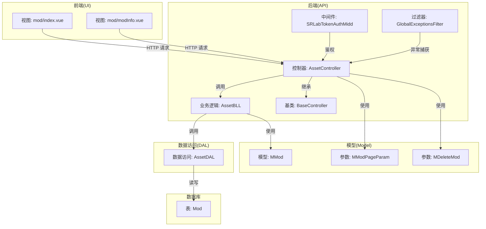
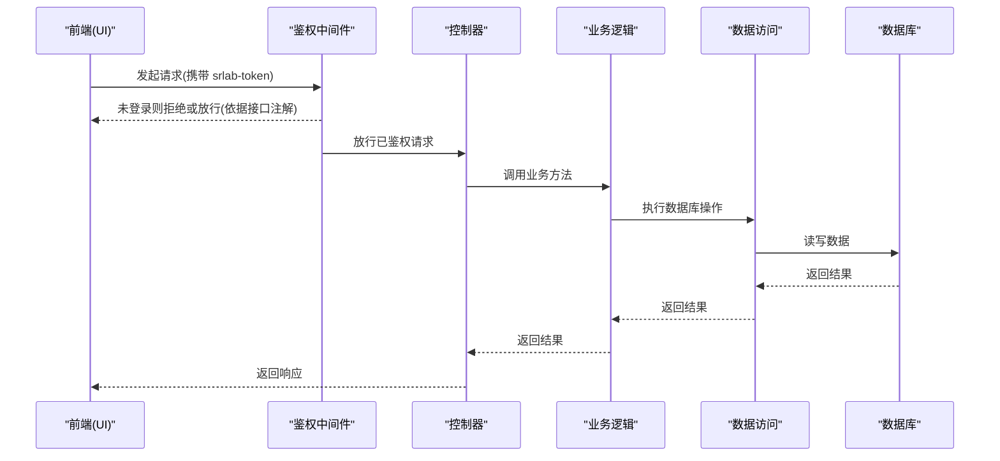
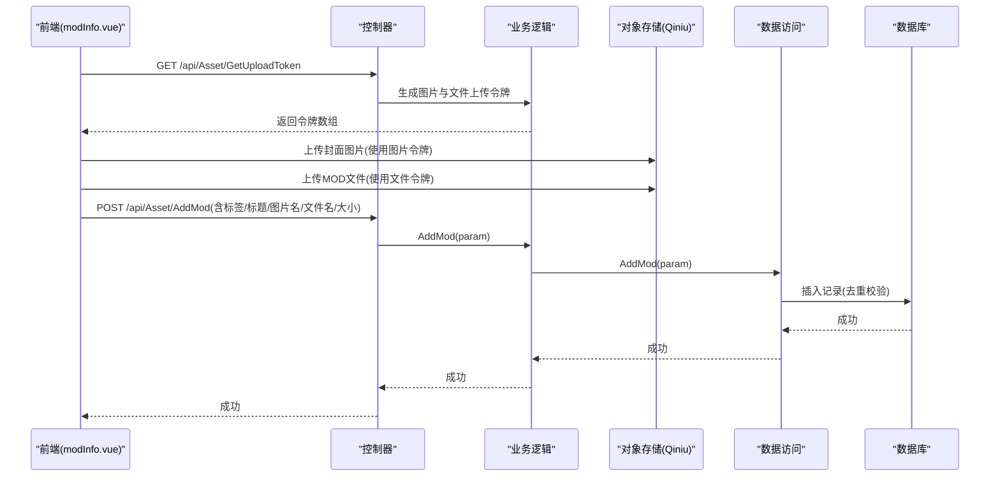
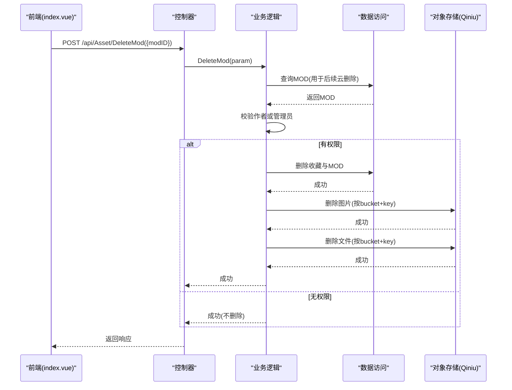
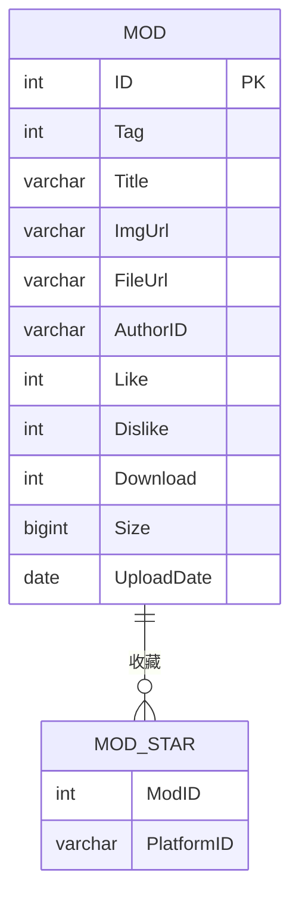
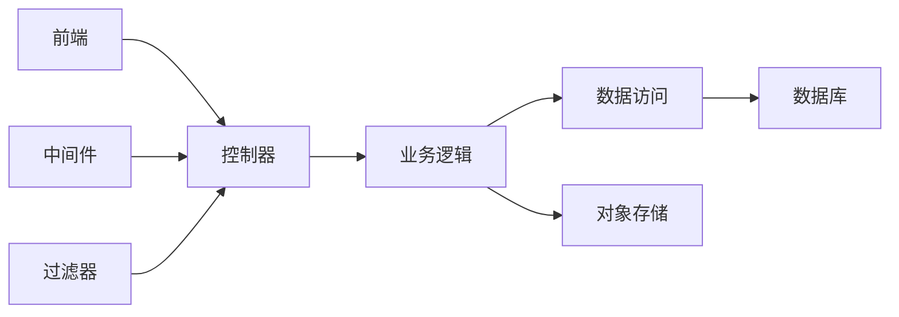

# MOD 生命周期管理

<cite>
**本文引用的文件**
- [SpeedRunners.API/SpeedRunners/Controllers/AssetController.cs](file://SpeedRunners.API/SpeedRunners/Controllers/AssetController.cs)
- [SpeedRunners.API/SpeedRunners/Controllers/BaseController.cs](file://SpeedRunners.API/SpeedRunners/Controllers/BaseController.cs)
- [SpeedRunners.API/SpeedRunners.BLL/AssetBLL.cs](file://SpeedRunners.API/SpeedRunners.BLL/AssetBLL.cs)
- [SpeedRunners.API/SpeedRunners.DAL/AssetDAL.cs](file://SpeedRunners.API/SpeedRunners.DAL/AssetDAL.cs)
- [SpeedRunners.API/SpeedRunners.Model/Asset/MMod.cs](file://SpeedRunners.API/SpeedRunners.Model/Asset/MMod.cs)
- [SpeedRunners.API/SpeedRunners.Model/Asset/MModPageParam.cs](file://SpeedRunners.API/SpeedRunners.Model/Asset/MModPageParam.cs)
- [SpeedRunners.API/SpeedRunners.Model/Asset/MDeleteMod.cs](file://SpeedRunners.API/SpeedRunners.Model/Asset/MDeleteMod.cs)
- [SpeedRunners.API/SpeedRunners/Middleware/SRLabTokenAuthMidd.cs](file://SpeedRunners.API/SpeedRunners/Middleware/SRLabTokenAuthMidd.cs)
- [SpeedRunners.API/SpeedRunners/Filter/GlobalExceptionsFilter.cs](file://SpeedRunners.API/SpeedRunners/Filter/GlobalExceptionsFilter.cs)
- [SpeedRunners.UI/src/views/mod/index.vue](file://SpeedRunners.UI/src/views/mod/index.vue)
- [SpeedRunners.UI/src/views/mod/modInfo.vue](file://SpeedRunners.UI/src/views/mod/modInfo.vue)
- [mysql-dump/tmdsr.sql](file://mysql-dump/tmdsr.sql)
</cite>

## 目录
1. [引言](#引言)
2. [项目结构](#项目结构)
3. [核心组件](#核心组件)
4. [架构总览](#架构总览)
5. [详细组件分析](#详细组件分析)
6. [依赖关系分析](#依赖关系分析)
7. [性能考量](#性能考量)
8. [故障排查指南](#故障排查指南)
9. [结论](#结论)
10. [附录](#附录)

## 引言
本技术文档围绕 MOD 资源的生命周期管理进行系统化梳理，覆盖 MOD 的创建、编辑、删除、状态与可见性控制等关键环节。文档基于实际代码实现，结合前后端交互流程，提供可操作的最佳实践与排障建议，帮助开发者快速理解并实现 MOD 生命周期管理的核心功能。

## 项目结构
MOD 生命周期管理涉及三层架构：前端 UI 层、后端 API 层与数据访问层；同时包含鉴权中间件与全局异常过滤器，确保访问安全与稳定性。

图表来源
- [SpeedRunners.API/SpeedRunners/Controllers/AssetController.cs](file://SpeedRunners.API/SpeedRunners/Controllers/AssetController.cs#L1-L48)
- [SpeedRunners.API/SpeedRunners.BLL/AssetBLL.cs](file://SpeedRunners.API/SpeedRunners.BLL/AssetBLL.cs#L1-L203)
- [SpeedRunners.API/SpeedRunners.DAL/AssetDAL.cs](file://SpeedRunners.API/SpeedRunners.DAL/AssetDAL.cs#L1-L134)
- [SpeedRunners.API/SpeedRunners.Model/Asset/MMod.cs](file://SpeedRunners.API/SpeedRunners.Model/Asset/MMod.cs#L1-L28)
- [SpeedRunners.API/SpeedRunners.Model/Asset/MModPageParam.cs](file://SpeedRunners.API/SpeedRunners.Model/Asset/MModPageParam.cs#L1-L13)
- [SpeedRunners.API/SpeedRunners.Model/Asset/MDeleteMod.cs](file://SpeedRunners.API/SpeedRunners.Model/Asset/MDeleteMod.cs#L1-L11)
- [SpeedRunners.API/SpeedRunners/Middleware/SRLabTokenAuthMidd.cs](file://SpeedRunners.API/SpeedRunners/Middleware/SRLabTokenAuthMidd.cs#L1-L123)
- [SpeedRunners.API/SpeedRunners/Filter/GlobalExceptionsFilter.cs](file://SpeedRunners.API/SpeedRunners/Filter/GlobalExceptionsFilter.cs#L1-L54)
- [mysql-dump/tmdsr.sql](file://mysql-dump/tmdsr.sql#L38-L54)

章节来源
- [SpeedRunners.API/SpeedRunners/Controllers/AssetController.cs](file://SpeedRunners.API/SpeedRunners/Controllers/AssetController.cs#L1-L48)
- [SpeedRunners.API/SpeedRunners.BLL/AssetBLL.cs](file://SpeedRunners.API/SpeedRunners.BLL/AssetBLL.cs#L1-L203)
- [SpeedRunners.API/SpeedRunners.DAL/AssetDAL.cs](file://SpeedRunners.API/SpeedRunners.DAL/AssetDAL.cs#L1-L134)
- [SpeedRunners.API/SpeedRunners.Model/Asset/MMod.cs](file://SpeedRunners.API/SpeedRunners.Model/Asset/MMod.cs#L1-L28)
- [SpeedRunners.API/SpeedRunners.Model/Asset/MModPageParam.cs](file://SpeedRunners.API/SpeedRunners.Model/Asset/MModPageParam.cs#L1-L13)
- [SpeedRunners.API/SpeedRunners.Model/Asset/MDeleteMod.cs](file://SpeedRunners.API/SpeedRunners.Model/Asset/MDeleteMod.cs#L1-L11)
- [SpeedRunners.API/SpeedRunners/Middleware/SRLabTokenAuthMidd.cs](file://SpeedRunners.API/SpeedRunners/Middleware/SRLabTokenAuthMidd.cs#L1-L123)
- [SpeedRunners.API/SpeedRunners/Filter/GlobalExceptionsFilter.cs](file://SpeedRunners.API/SpeedRunners/Filter/GlobalExceptionsFilter.cs#L1-L54)
- [mysql-dump/tmdsr.sql](file://mysql-dump/tmdsr.sql#L38-L54)

## 核心组件
- 控制器层：提供 MOD 列表查询、详情获取、上传令牌生成、下载链接生成、MOD 添加、收藏操作与删除等接口。
- 业务逻辑层：封装上传令牌生成、下载链接生成与计数、MOD 列表分页与排序、新增、收藏增删、删除与云存储清理等业务规则。
- 数据访问层：负责与数据库交互，执行查询、插入、更新与删除操作，并维护收藏关联表。
- 鉴权与异常：通过中间件校验登录态，通过全局异常过滤器统一返回错误信息。
- 前端视图：提供 MOD 列表展示、搜索筛选、收藏切换、上传与下载、删除确认等交互。

章节来源
- [SpeedRunners.API/SpeedRunners/Controllers/AssetController.cs](file://SpeedRunners.API/SpeedRunners/Controllers/AssetController.cs#L1-L48)
- [SpeedRunners.API/SpeedRunners.BLL/AssetBLL.cs](file://SpeedRunners.API/SpeedRunners.BLL/AssetBLL.cs#L1-L203)
- [SpeedRunners.API/SpeedRunners.DAL/AssetDAL.cs](file://SpeedRunners.API/SpeedRunners.DAL/AssetDAL.cs#L1-L134)
- [SpeedRunners.API/SpeedRunners/Middleware/SRLabTokenAuthMidd.cs](file://SpeedRunners.API/SpeedRunners/Middleware/SRLabTokenAuthMidd.cs#L1-L123)
- [SpeedRunners.API/SpeedRunners/Filter/GlobalExceptionsFilter.cs](file://SpeedRunners.API/SpeedRunners/Filter/GlobalExceptionsFilter.cs#L1-L54)
- [SpeedRunners.UI/src/views/mod/index.vue](file://SpeedRunners.UI/src/views/mod/index.vue#L1-L427)
- [SpeedRunners.UI/src/views/mod/modInfo.vue](file://SpeedRunners.UI/src/views/mod/modInfo.vue#L1-L266)

## 架构总览
MOD 生命周期管理遵循“前端 -> 控制器 -> 业务 -> 数据访问 -> 数据库”的标准调用链路。鉴权中间件在进入控制器前拦截请求，确保只有登录用户或公开接口可访问。异常过滤器在生产环境统一捕获未处理异常并返回标准化响应。

图表来源
- [SpeedRunners.API/SpeedRunners/Middleware/SRLabTokenAuthMidd.cs](file://SpeedRunners.API/SpeedRunners/Middleware/SRLabTokenAuthMidd.cs#L31-L101)
- [SpeedRunners.API/SpeedRunners/Controllers/AssetController.cs](file://SpeedRunners.API/SpeedRunners/Controllers/AssetController.cs#L1-L48)
- [SpeedRunners.API/SpeedRunners.BLL/AssetBLL.cs](file://SpeedRunners.API/SpeedRunners.BLL/AssetBLL.cs#L1-L203)
- [SpeedRunners.API/SpeedRunners.DAL/AssetDAL.cs](file://SpeedRunners.API/SpeedRunners.DAL/AssetDAL.cs#L1-L134)

## 详细组件分析

### MOD 创建流程（上传与入库）
- 前端上传流程
  - 生成上传令牌：调用控制器的上传令牌接口，分别获取图片与 MOD 文件的上传令牌。
  - 图片裁剪与上传：使用裁剪组件生成 JPEG 图片并上传至对象存储；文件上传至对象存储。
  - 提交入库：当图片与文件均上传完成后，向后端提交 MOD 元数据（标签、标题、图片名、文件名、大小），由后端写入数据库。
- 后端处理流程
  - 业务层生成上传令牌并返回给前端。
  - 业务层接收 MOD 元数据，设置作者标识并写入数据库。
  - 数据访问层去重校验（以图片地址为依据），避免重复入库。
- 数据验证与存储
  - 前端对图片与文件大小、类型进行基础校验。
  - 后端对重复图片地址进行去重判断，防止重复入库。
  - 数据库存储包含标签、标题、图片地址、文件地址、作者标识、大小与上传日期等字段。

图表来源
- [SpeedRunners.UI/src/views/mod/modInfo.vue](file://SpeedRunners.UI/src/views/mod/modInfo.vue#L177-L246)
- [SpeedRunners.API/SpeedRunners/Controllers/AssetController.cs](file://SpeedRunners.API/SpeedRunners/Controllers/AssetController.cs#L16-L38)
- [SpeedRunners.API/SpeedRunners.BLL/AssetBLL.cs](file://SpeedRunners.API/SpeedRunners.BLL/AssetBLL.cs#L22-L36)
- [SpeedRunners.API/SpeedRunners.BLL/AssetBLL.cs](file://SpeedRunners.API/SpeedRunners.BLL/AssetBLL.cs#L93-L100)
- [SpeedRunners.API/SpeedRunners.DAL/AssetDAL.cs](file://SpeedRunners.API/SpeedRunners.DAL/AssetDAL.cs#L79-L87)

章节来源
- [SpeedRunners.UI/src/views/mod/modInfo.vue](file://SpeedRunners.UI/src/views/mod/modInfo.vue#L177-L246)
- [SpeedRunners.API/SpeedRunners/Controllers/AssetController.cs](file://SpeedRunners.API/SpeedRunners/Controllers/AssetController.cs#L16-L38)
- [SpeedRunners.API/SpeedRunners.BLL/AssetBLL.cs](file://SpeedRunners.API/SpeedRunners.BLL/AssetBLL.cs#L22-L36)
- [SpeedRunners.API/SpeedRunners.BLL/AssetBLL.cs](file://SpeedRunners.API/SpeedRunners.BLL/AssetBLL.cs#L93-L100)
- [SpeedRunners.API/SpeedRunners.DAL/AssetDAL.cs](file://SpeedRunners.API/SpeedRunners.DAL/AssetDAL.cs#L79-L87)

### MOD 编辑与版本控制
- 字段更新
  - 当前实现未提供直接的 MOD 字段更新接口。若需支持编辑，可在控制器与业务层增加对应方法，并在数据访问层实现相应更新 SQL。
- 版本控制
  - 代码库未实现版本字段或版本历史表。如需版本控制，建议在数据库中引入版本号字段与版本记录表，并在业务层提供版本比较与回滚能力。
- 变更记录
  - 未见专门的变更审计日志表。如需变更追踪，可在数据库中新增变更日志表，记录每次操作的用户、时间、字段与旧值新值。

章节来源
- [SpeedRunners.API/SpeedRunners/Controllers/AssetController.cs](file://SpeedRunners.API/SpeedRunners/Controllers/AssetController.cs#L1-L48)
- [SpeedRunners.API/SpeedRunners.BLL/AssetBLL.cs](file://SpeedRunners.API/SpeedRunners.BLL/AssetBLL.cs#L1-L203)
- [SpeedRunners.API/SpeedRunners.DAL/AssetDAL.cs](file://SpeedRunners.API/SpeedRunners.DAL/AssetDAL.cs#L1-L134)

### MOD 删除机制（软删除策略、数据清理与权限控制）
- 权限控制
  - 仅 MOD 作者或特定管理员可删除；否则忽略删除请求。
- 数据清理
  - 业务层先从数据库删除 MOD 记录及其收藏关联，再调用对象存储 SDK 删除对应的图片与文件。
- 返回值
  - 删除成功返回统一的成功响应；若云存储删除失败，返回失败响应并中断后续处理。

图表来源
- [SpeedRunners.UI/src/views/mod/index.vue](file://SpeedRunners.UI/src/views/mod/index.vue#L332-L347)
- [SpeedRunners.API/SpeedRunners/Controllers/AssetController.cs](file://SpeedRunners.API/SpeedRunners/Controllers/AssetController.cs#L24-L26)
- [SpeedRunners.API/SpeedRunners.BLL/AssetBLL.cs](file://SpeedRunners.API/SpeedRunners.BLL/AssetBLL.cs#L120-L143)
- [SpeedRunners.API/SpeedRunners.BLL/AssetBLL.cs](file://SpeedRunners.API/SpeedRunners.BLL/AssetBLL.cs#L150-L160)
- [SpeedRunners.API/SpeedRunners.DAL/AssetDAL.cs](file://SpeedRunners.API/SpeedRunners.DAL/AssetDAL.cs#L126-L131)

章节来源
- [SpeedRunners.UI/src/views/mod/index.vue](file://SpeedRunners.UI/src/views/mod/index.vue#L332-L347)
- [SpeedRunners.API/SpeedRunners/Controllers/AssetController.cs](file://SpeedRunners.API/SpeedRunners/Controllers/AssetController.cs#L24-L26)
- [SpeedRunners.API/SpeedRunners.BLL/AssetBLL.cs](file://SpeedRunners.API/SpeedRunners.BLL/AssetBLL.cs#L120-L143)
- [SpeedRunners.API/SpeedRunners.BLL/AssetBLL.cs](file://SpeedRunners.API/SpeedRunners.BLL/AssetBLL.cs#L150-L160)
- [SpeedRunners.API/SpeedRunners.DAL/AssetDAL.cs](file://SpeedRunners.API/SpeedRunners.DAL/AssetDAL.cs#L126-L131)

### MOD 状态管理（发布、审核与可见性）
- 发布状态
  - 数据库未设置独立的状态字段；通过作者标识与管理员权限控制可见性与删除能力。
- 审核状态
  - 未实现审核流程与审核字段；如需审核，可在数据库中增加审核状态字段并在业务层增加审核接口。
- 可见性控制
  - 列表接口对登录用户与访客区分处理；收藏列表可通过 OnlyStar 参数筛选；前端根据用户登录态显示删除按钮。

章节来源
- [SpeedRunners.API/SpeedRunners.DAL/AssetDAL.cs](file://SpeedRunners.API/SpeedRunners.DAL/AssetDAL.cs#L16-L72)
- [SpeedRunners.API/SpeedRunners/Controllers/AssetController.cs](file://SpeedRunners.API/SpeedRunners/Controllers/AssetController.cs#L28-L42)
- [SpeedRunners.UI/src/views/mod/index.vue](file://SpeedRunners.UI/src/views/mod/index.vue#L143-L158)

### 数据模型与数据库设计
- MOD 表结构
  - 包含主键 ID、标签 Tag、标题 Title、图片地址 ImgUrl、文件地址 FileUrl、作者标识 AuthorID、点赞数 Like、点踩数 Dislike、下载次数 Download、文件大小 Size、上传日期 UploadDate 等字段。
- 收藏关联
  - 收藏表 ModStar 与 MOD 关联，用于记录用户的收藏行为与统计星数。

图表来源
- [mysql-dump/tmdsr.sql](file://mysql-dump/tmdsr.sql#L38-L54)
- [SpeedRunners.API/SpeedRunners.DAL/AssetDAL.cs](file://SpeedRunners.API/SpeedRunners.DAL/AssetDAL.cs#L112-L124)

章节来源
- [mysql-dump/tmdsr.sql](file://mysql-dump/tmdsr.sql#L38-L54)
- [SpeedRunners.API/SpeedRunners.DAL/AssetDAL.cs](file://SpeedRunners.API/SpeedRunners.DAL/AssetDAL.cs#L112-L124)

## 依赖关系分析
- 控制器依赖业务层，业务层依赖数据访问层与外部服务（对象存储）。
- 中间件在控制器之前进行鉴权，过滤器在控制器之后统一处理异常。
- 前端通过 API 接口与后端交互，上传与下载流程依赖对象存储服务。

图表来源
- [SpeedRunners.API/SpeedRunners/Controllers/AssetController.cs](file://SpeedRunners.API/SpeedRunners/Controllers/AssetController.cs#L1-L48)
- [SpeedRunners.API/SpeedRunners.BLL/AssetBLL.cs](file://SpeedRunners.API/SpeedRunners.BLL/AssetBLL.cs#L1-L203)
- [SpeedRunners.API/SpeedRunners.DAL/AssetDAL.cs](file://SpeedRunners.API/SpeedRunners.DAL/AssetDAL.cs#L1-L134)
- [SpeedRunners.API/SpeedRunners/Middleware/SRLabTokenAuthMidd.cs](file://SpeedRunners.API/SpeedRunners/Middleware/SRLabTokenAuthMidd.cs#L1-L123)
- [SpeedRunners.API/SpeedRunners/Filter/GlobalExceptionsFilter.cs](file://SpeedRunners.API/SpeedRunners/Filter/GlobalExceptionsFilter.cs#L1-L54)

章节来源
- [SpeedRunners.API/SpeedRunners/Controllers/AssetController.cs](file://SpeedRunners.API/SpeedRunners/Controllers/AssetController.cs#L1-L48)
- [SpeedRunners.API/SpeedRunners.BLL/AssetBLL.cs](file://SpeedRunners.API/SpeedRunners.BLL/AssetBLL.cs#L1-L203)
- [SpeedRunners.API/SpeedRunners.DAL/AssetDAL.cs](file://SpeedRunners.API/SpeedRunners.DAL/AssetDAL.cs#L1-L134)
- [SpeedRunners.API/SpeedRunners/Middleware/SRLabTokenAuthMidd.cs](file://SpeedRunners.API/SpeedRunners/Middleware/SRLabTokenAuthMidd.cs#L1-L123)
- [SpeedRunners.API/SpeedRunners/Filter/GlobalExceptionsFilter.cs](file://SpeedRunners.API/SpeedRunners/Filter/GlobalExceptionsFilter.cs#L1-L54)

## 性能考量
- 列表查询优化
  - 使用分页参数与条件拼接，避免一次性加载全量数据。
  - 对热门与新 MOD 采用不同排序权重，提升用户体验。
- 下载计数
  - 下载链接生成时更新下载次数，便于统计与排序。
- 上传并发
  - 前端并行上传图片与文件，完成后统一提交入库，减少等待时间。
- 存储成本
  - 对象存储的上传与私有链接生成需合理配置域名与过期时间，避免频繁请求导致成本上升。

章节来源
- [SpeedRunners.API/SpeedRunners.BLL/AssetBLL.cs](file://SpeedRunners.API/SpeedRunners.BLL/AssetBLL.cs#L38-L47)
- [SpeedRunners.API/SpeedRunners.BLL/AssetBLL.cs](file://SpeedRunners.API/SpeedRunners.BLL/AssetBLL.cs#L106-L110)
- [SpeedRunners.API/SpeedRunners.DAL/AssetDAL.cs](file://SpeedRunners.API/SpeedRunners.DAL/AssetDAL.cs#L16-L72)
- [SpeedRunners.UI/src/views/mod/modInfo.vue](file://SpeedRunners.UI/src/views/mod/modInfo.vue#L186-L229)

## 故障排查指南
- 未登录访问受限
  - 若出现未登录提示，请检查请求头是否携带有效的 srlab-token，或确认接口是否需要登录态。
- 上传失败
  - 检查上传令牌是否正确生成，图片与文件大小与类型是否符合要求，对象存储服务是否可用。
- 删除失败
  - 确认当前用户是否为 MOD 作者或管理员；若云存储删除失败，查看返回的错误信息并重试。
- 列表为空
  - 检查筛选条件（标签、关键字、仅收藏）是否过于严格；确认用户登录态与 OnlyStar 参数。

章节来源
- [SpeedRunners.API/SpeedRunners/Middleware/SRLabTokenAuthMidd.cs](file://SpeedRunners.API/SpeedRunners/Middleware/SRLabTokenAuthMidd.cs#L54-L101)
- [SpeedRunners.API/SpeedRunners/Filter/GlobalExceptionsFilter.cs](file://SpeedRunners.API/SpeedRunners/Filter/GlobalExceptionsFilter.cs#L31-L51)
- [SpeedRunners.UI/src/views/mod/modInfo.vue](file://SpeedRunners.UI/src/views/mod/modInfo.vue#L107-L115)
- [SpeedRunners.UI/src/views/mod/index.vue](file://SpeedRunners.UI/src/views/mod/index.vue#L336-L347)

## 结论
本项目实现了 MOD 的基本生命周期管理：创建（上传与入库）、浏览（列表与详情）、收藏与下载计数，以及基于作者与管理员的删除控制。对于编辑、版本控制与审核流程，当前代码库尚未实现，建议在数据库与业务层逐步扩展。通过鉴权中间件与异常过滤器，系统具备良好的安全性与稳定性保障。

## 附录
- 最佳实践
  - 在控制器与业务层增加输入参数校验与边界检查。
  - 对于编辑与删除操作，建议引入软删除与审计日志，便于回溯与恢复。
  - 对象存储上传失败时，应提供重试与降级策略。
  - 列表查询应限制最大分页范围，避免超大数据集查询。
- 扩展建议
  - 新增 MOD 审核状态字段与审核接口。
  - 引入版本号字段与版本历史表，支持版本对比与回滚。
  - 增加 MOD 变更审计日志，记录关键字段变更。