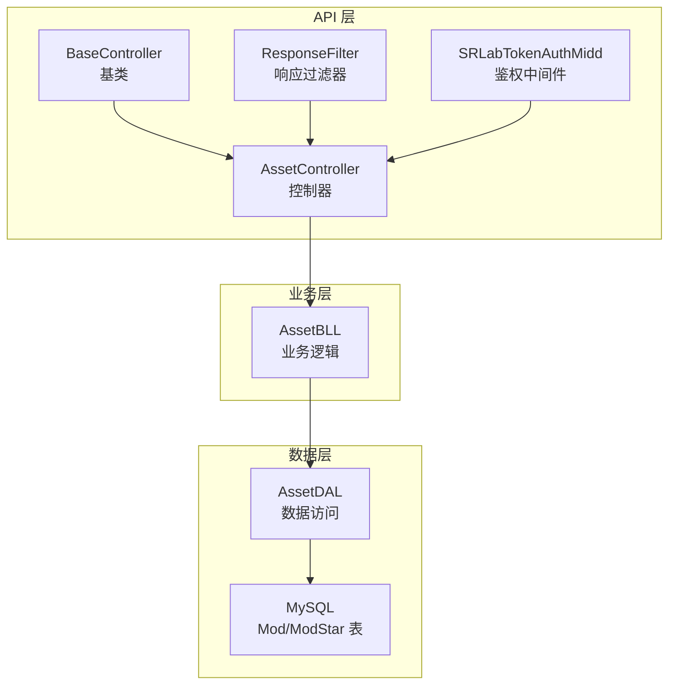
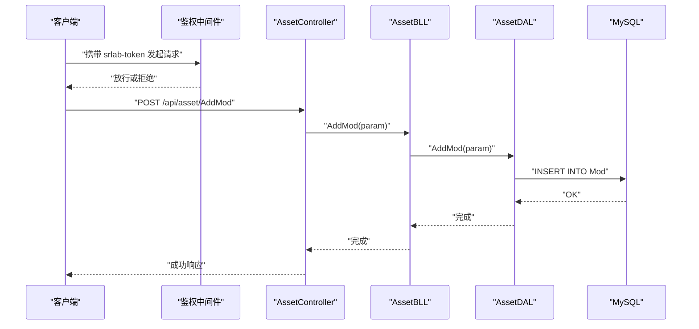
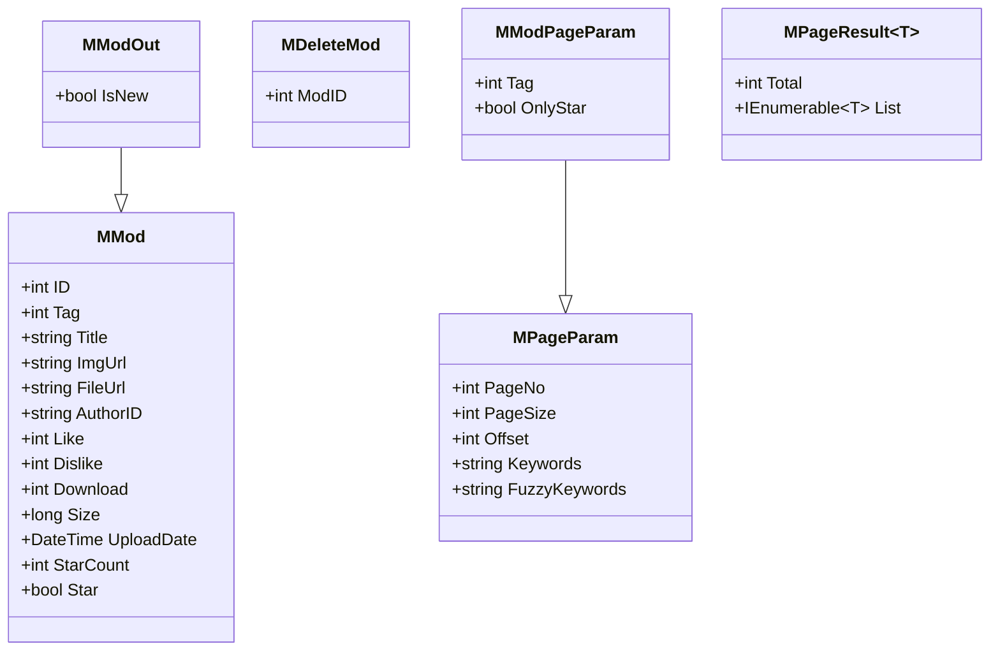
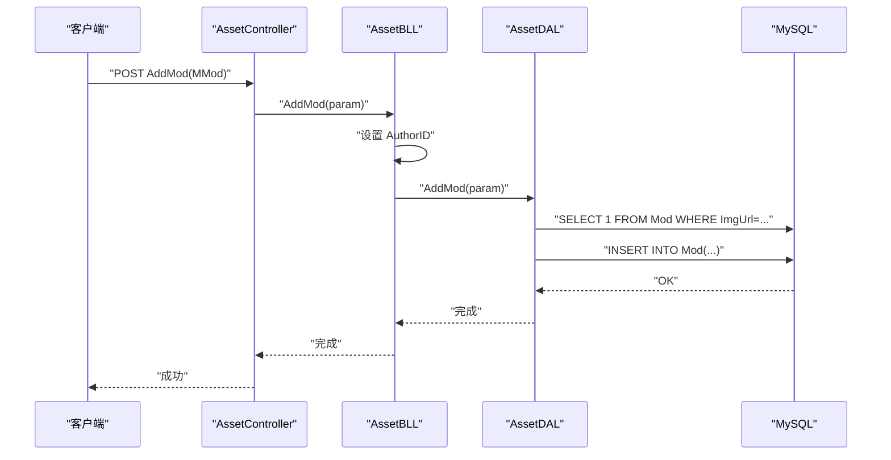
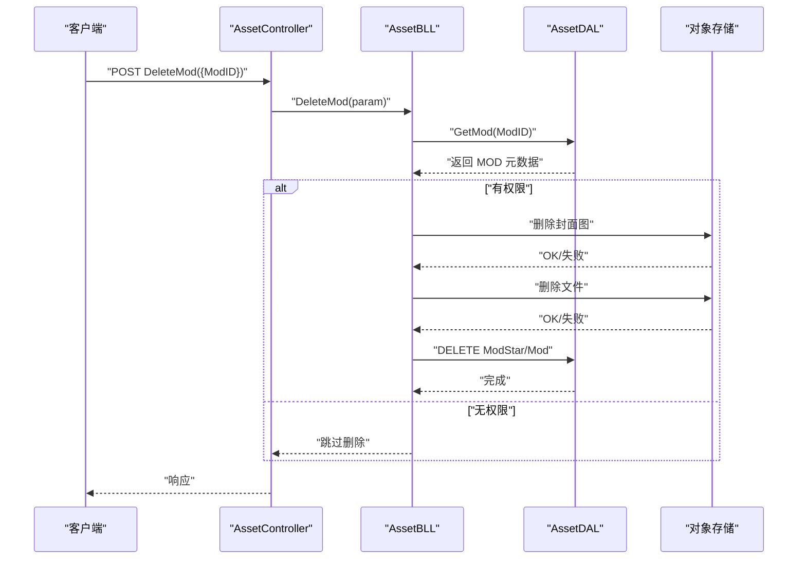
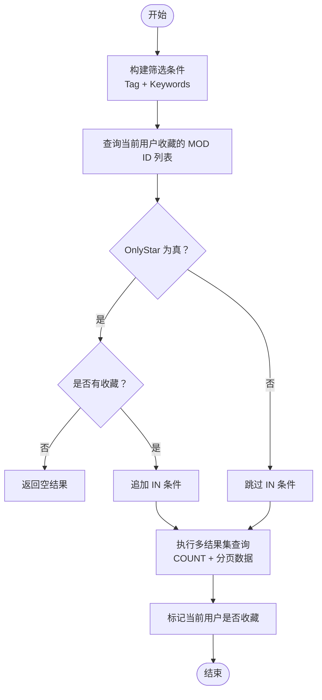
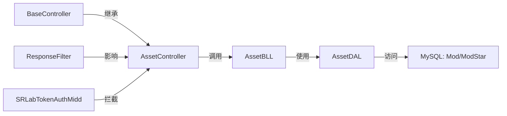
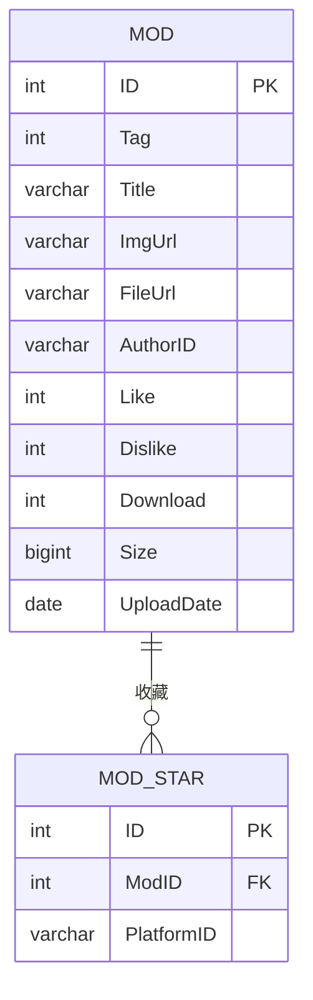

# MOD 管理

<cite>
**本文引用的文件**
- [SpeedRunners.API/SpeedRunners.Model/Asset/MMod.cs](file://SpeedRunners.API/SpeedRunners.Model/Asset/MMod.cs)
- [SpeedRunners.API/SpeedRunners.Model/Asset/MDeleteMod.cs](file://SpeedRunners.API/SpeedRunners.Model/Asset/MDeleteMod.cs)
- [SpeedRunners.API/SpeedRunners.Model/Asset/MModPageParam.cs](file://SpeedRunners.API/SpeedRunners.Model/Asset/MModPageParam.cs)
- [SpeedRunners.API/SpeedRunners.Model/MPageParam.cs](file://SpeedRunners.API/SpeedRunners.Model/MPageParam.cs)
- [SpeedRunners.API/SpeedRunners.Model/MPageResult.cs](file://SpeedRunners.API/SpeedRunners.Model/MPageResult.cs)
- [SpeedRunners.API/SpeedRunners.Model/UserAttribute.cs](file://SpeedRunners.API/SpeedRunners.Model/UserAttribute.cs)
- [SpeedRunners.API/SpeedRunners.Model/PersonaAttribute.cs](file://SpeedRunners.API/SpeedRunners.Model/PersonaAttribute.cs)
- [SpeedRunners.API/SpeedRunners/Controllers/AssetController.cs](file://SpeedRunners.API/SpeedRunners/Controllers/AssetController.cs)
- [SpeedRunners.API/SpeedRunners/Controllers/BaseController.cs](file://SpeedRunners.API/SpeedRunners/Controllers/BaseController.cs)
- [SpeedRunners.API/SpeedRunners.BLL/AssetBLL.cs](file://SpeedRunners.API/SpeedRunners.BLL/AssetBLL.cs)
- [SpeedRunners.API/SpeedRunners.DAL/AssetDAL.cs](file://SpeedRunners.API/SpeedRunners.DAL/AssetDAL.cs)
- [SpeedRunners.API/SpeedRunners/Middleware/SRLabTokenAuthMidd.cs](file://SpeedRunners.API/SpeedRunners/Middleware/SRLabTokenAuthMidd.cs)
- [SpeedRunners.API/SpeedRunners/Filter/ResponseFilter.cs](file://SpeedRunners.API/SpeedRunners/Filter/ResponseFilter.cs)
- [mysql-dump/tmdsr.sql](file://mysql-dump/tmdsr.sql)
</cite>

## 目录
1. [简介](#简介)
2. [项目结构](#项目结构)
3. [核心组件](#核心组件)
4. [架构总览](#架构总览)
5. [详细组件分析](#详细组件分析)
6. [依赖关系分析](#依赖关系分析)
7. [性能考量](#性能考量)
8. [故障排查指南](#故障排查指南)
9. [结论](#结论)
10. [附录](#附录)

## 简介
本技术文档围绕 MOD 资源管理功能进行系统化梳理，覆盖 MOD 的完整生命周期：创建、编辑（本仓库未提供直接编辑接口）、删除与状态控制；深入解析 MMod 数据模型、列表查询（分页、排序、筛选）；详解详情获取、元数据管理与版本控制机制；并给出评分、收藏与评论系统的实现原理与扩展建议。同时，文档包含权限控制、审核流程与内容安全策略的技术细节。

## 项目结构
MOD 管理功能位于 SpeedRunners.API 子项目中，采用经典的三层架构：控制器层负责路由与鉴权特性标注；业务逻辑层封装上传下载令牌生成、列表查询、详情获取、收藏操作与删除等；数据访问层通过 Dapper 执行 SQL 查询与更新；鉴权中间件与响应过滤器贯穿请求链路，统一处理 Token 校验与返回格式。

图表来源
- [SpeedRunners.API/SpeedRunners/Controllers/AssetController.cs](file://SpeedRunners.API/SpeedRunners/Controllers/AssetController.cs#L1-L47)
- [SpeedRunners.API/SpeedRunners/Controllers/BaseController.cs](file://SpeedRunners.API/SpeedRunners/Controllers/BaseController.cs#L1-L26)
- [SpeedRunners.API/SpeedRunners.BLL/AssetBLL.cs](file://SpeedRunners.API/SpeedRunners.BLL/AssetBLL.cs#L1-L203)
- [SpeedRunners.API/SpeedRunners.DAL/AssetDAL.cs](file://SpeedRunners.API/SpeedRunners.DAL/AssetDAL.cs#L1-L134)
- [mysql-dump/tmdsr.sql](file://mysql-dump/tmdsr.sql#L38-L54)

章节来源
- [SpeedRunners.API/SpeedRunners/Controllers/AssetController.cs](file://SpeedRunners.API/SpeedRunners/Controllers/AssetController.cs#L1-L47)
- [SpeedRunners.API/SpeedRunners.BLL/AssetBLL.cs](file://SpeedRunners.API/SpeedRunners.BLL/AssetBLL.cs#L1-L203)
- [SpeedRunners.API/SpeedRunners.DAL/AssetDAL.cs](file://SpeedRunners.API/SpeedRunners.DAL/AssetDAL.cs#L1-L134)

## 核心组件
- 数据模型
  - MMod：MOD 基础实体，包含标签、标题、封面图、文件地址、作者平台 ID、点赞/点踩、下载次数、大小、上传时间、收藏数与是否收藏标记。
  - MModOut：在 MMod 基础上增加“是否新资源”标记，用于前端展示“NEW”标签。
  - MDeleteMod：删除请求体，包含 MOD 标识。
  - MModPageParam：MOD 列表查询参数，继承通用分页参数，新增标签筛选与仅收藏筛选。
  - MPageParam/MPageResult：通用分页输入输出模型。
- 控制器
  - AssetController：提供上传令牌、下载链接生成、MOD 删除、列表查询、详情获取、收藏操作等接口，并通过特性标注区分鉴权需求。
- 业务层
  - AssetBLL：封装上传/下载令牌生成、下载链接生成与计数、列表查询与详情组装、收藏增删、MOD 删除与对象存储清理、赞助商信息拉取。
- 数据层
  - AssetDAL：执行 MOD 列表分页查询、详情读取、新增、收藏增删、删除及下载计数更新；内部使用 Dapper 批量查询与多结果集查询。
- 鉴权与响应
  - SRLabTokenAuthMidd：基于请求端点特性(User/Persona)校验 Token，注入当前用户上下文。
  - ResponseFilter：统一响应结构与 Token 刷新逻辑。

章节来源
- [SpeedRunners.API/SpeedRunners.Model/Asset/MMod.cs](file://SpeedRunners.API/SpeedRunners.Model/Asset/MMod.cs#L1-L28)
- [SpeedRunners.API/SpeedRunners.Model/Asset/MDeleteMod.cs](file://SpeedRunners.API/SpeedRunners.Model/Asset/MDeleteMod.cs#L1-L12)
- [SpeedRunners.API/SpeedRunners.Model/Asset/MModPageParam.cs](file://SpeedRunners.API/SpeedRunners.Model/Asset/MModPageParam.cs#L1-L13)
- [SpeedRunners.API/SpeedRunners.Model/MPageParam.cs](file://SpeedRunners.API/SpeedRunners.Model/MPageParam.cs#L1-L15)
- [SpeedRunners.API/SpeedRunners.Model/MPageResult.cs](file://SpeedRunners.API/SpeedRunners.Model/MPageResult.cs#L1-L13)
- [SpeedRunners.API/SpeedRunners/Controllers/AssetController.cs](file://SpeedRunners.API/SpeedRunners/Controllers/AssetController.cs#L1-L47)
- [SpeedRunners.API/SpeedRunners.BLL/AssetBLL.cs](file://SpeedRunners.API/SpeedRunners.BLL/AssetBLL.cs#L1-L203)
- [SpeedRunners.API/SpeedRunners.DAL/AssetDAL.cs](file://SpeedRunners.API/SpeedRunners.DAL/AssetDAL.cs#L1-L134)
- [SpeedRunners.API/SpeedRunners/Middleware/SRLabTokenAuthMidd.cs](file://SpeedRunners.API/SpeedRunners/Middleware/SRLabTokenAuthMidd.cs#L1-L122)
- [SpeedRunners.API/SpeedRunners/Filter/ResponseFilter.cs](file://SpeedRunners.API/SpeedRunners/Filter/ResponseFilter.cs#L41-L78)

## 架构总览
MOD 管理遵循“控制器-业务-数据-数据库”的分层设计，配合中间件与过滤器完成鉴权与统一响应。下图展示了关键调用序列：

图表来源
- [SpeedRunners.API/SpeedRunners/Controllers/AssetController.cs](file://SpeedRunners.API/SpeedRunners/Controllers/AssetController.cs#L36-L38)
- [SpeedRunners.API/SpeedRunners.BLL/AssetBLL.cs](file://SpeedRunners.API/SpeedRunners.BLL/AssetBLL.cs#L93-L100)
- [SpeedRunners.API/SpeedRunners.DAL/AssetDAL.cs](file://SpeedRunners.API/SpeedRunners.DAL/AssetDAL.cs#L79-L87)

## 详细组件分析

### 数据模型与业务约束
- 字段定义与含义
  - ID：MOD 主键
  - Tag：分类标签
  - Title：标题
  - ImgUrl/FileUrl：封面图与文件的云存储 Key
  - AuthorID：作者平台 ID
  - Like/Dislike：点赞/点踩计数
  - Download：下载次数
  - Size：文件大小
  - UploadDate：上传日期
  - StarCount：收藏数
  - Star：当前登录用户是否已收藏
  - IsNew：是否为近 1 个月内的新资源
- 业务约束
  - 新增时按封面图 Key 去重，避免重复入库
  - 下载链接生成后立即对下载计数加 1
  - 收藏通过 ModStar 关联表记录，同步更新 MOD 的 StarCount
  - 删除 MOD 同步删除其收藏记录，并尝试从对象存储删除对应资源

图表来源
- [SpeedRunners.API/SpeedRunners.Model/Asset/MMod.cs](file://SpeedRunners.API/SpeedRunners.Model/Asset/MMod.cs#L1-L28)
- [SpeedRunners.API/SpeedRunners.Model/Asset/MDeleteMod.cs](file://SpeedRunners.API/SpeedRunners.Model/Asset/MDeleteMod.cs#L1-L12)
- [SpeedRunners.API/SpeedRunners.Model/Asset/MModPageParam.cs](file://SpeedRunners.API/SpeedRunners.Model/Asset/MModPageParam.cs#L1-L13)
- [SpeedRunners.API/SpeedRunners.Model/MPageParam.cs](file://SpeedRunners.API/SpeedRunners.Model/MPageParam.cs#L1-L15)
- [SpeedRunners.API/SpeedRunners.Model/MPageResult.cs](file://SpeedRunners.API/SpeedRunners.Model/MPageResult.cs#L1-L13)

章节来源
- [SpeedRunners.API/SpeedRunners.Model/Asset/MMod.cs](file://SpeedRunners.API/SpeedRunners.Model/Asset/MMod.cs#L1-L28)
- [SpeedRunners.API/SpeedRunners.Model/Asset/MDeleteMod.cs](file://SpeedRunners.API/SpeedRunners.Model/Asset/MDeleteMod.cs#L1-L12)
- [SpeedRunners.API/SpeedRunners.Model/Asset/MModPageParam.cs](file://SpeedRunners.API/SpeedRunners.Model/Asset/MModPageParam.cs#L1-L13)
- [SpeedRunners.API/SpeedRunners.Model/MPageParam.cs](file://SpeedRunners.API/SpeedRunners.Model/MPageParam.cs#L1-L15)
- [SpeedRunners.API/SpeedRunners.Model/MPageResult.cs](file://SpeedRunners.API/SpeedRunners.Model/MPageResult.cs#L1-L13)

### MOD 生命周期管理

#### 创建 MOD
- 接口：POST /api/asset/AddMod
- 流程要点
  - 控制器接收 MMod 参数
  - 业务层设置 AuthorID 为当前用户平台 ID
  - 数据层去重检查后插入 Mod 表
- 复杂度与性能
  - 插入为单表写入，复杂度 O(1)
  - 去重查询为单条存在性判断，索引命中良好

图表来源
- [SpeedRunners.API/SpeedRunners/Controllers/AssetController.cs](file://SpeedRunners.API/SpeedRunners/Controllers/AssetController.cs#L36-L38)
- [SpeedRunners.API/SpeedRunners.BLL/AssetBLL.cs](file://SpeedRunners.API/SpeedRunners.BLL/AssetBLL.cs#L93-L100)
- [SpeedRunners.API/SpeedRunners.DAL/AssetDAL.cs](file://SpeedRunners.API/SpeedRunners.DAL/AssetDAL.cs#L79-L87)

章节来源
- [SpeedRunners.API/SpeedRunners/Controllers/AssetController.cs](file://SpeedRunners.API/SpeedRunners/Controllers/AssetController.cs#L36-L38)
- [SpeedRunners.API/SpeedRunners.BLL/AssetBLL.cs](file://SpeedRunners.API/SpeedRunners.BLL/AssetBLL.cs#L93-L100)
- [SpeedRunners.API/SpeedRunners.DAL/AssetDAL.cs](file://SpeedRunners.API/SpeedRunners.DAL/AssetDAL.cs#L79-L87)

#### 编辑 MOD
- 当前仓库未提供直接编辑接口。若需扩展，可在控制器与业务层新增对应方法，并在数据层执行 UPDATE 操作，注意对 ImgUrl/FileUrl 的幂等性与对象存储一致性。

章节来源
- [SpeedRunners.API/SpeedRunners/Controllers/AssetController.cs](file://SpeedRunners.API/SpeedRunners/Controllers/AssetController.cs#L1-L47)
- [SpeedRunners.API/SpeedRunners.BLL/AssetBLL.cs](file://SpeedRunners.API/SpeedRunners.BLL/AssetBLL.cs#L1-L203)
- [SpeedRunners.API/SpeedRunners.DAL/AssetDAL.cs](file://SpeedRunners.API/SpeedRunners.DAL/AssetDAL.cs#L1-L134)

#### 删除 MOD
- 接口：POST /api/asset/DeleteMod
- 权限与安全
  - 仅 MOD 作者或特定管理员平台 ID 可删除
  - 删除时同步清理对象存储中的封面图与文件
- 流程要点
  - 业务层校验权限与读取 MOD 元数据
  - 数据层级联删除 ModStar 与 Mod
  - 对象存储删除失败则返回错误

图表来源
- [SpeedRunners.API/SpeedRunners/Controllers/AssetController.cs](file://SpeedRunners.API/SpeedRunners/Controllers/AssetController.cs#L24-L26)
- [SpeedRunners.API/SpeedRunners.BLL/AssetBLL.cs](file://SpeedRunners.API/SpeedRunners.BLL/AssetBLL.cs#L120-L143)
- [SpeedRunners.API/SpeedRunners.DAL/AssetDAL.cs](file://SpeedRunners.API/SpeedRunners.DAL/AssetDAL.cs#L126-L131)

章节来源
- [SpeedRunners.API/SpeedRunners/Controllers/AssetController.cs](file://SpeedRunners.API/SpeedRunners/Controllers/AssetController.cs#L24-L26)
- [SpeedRunners.API/SpeedRunners.BLL/AssetBLL.cs](file://SpeedRunners.API/SpeedRunners.BLL/AssetBLL.cs#L120-L143)
- [SpeedRunners.API/SpeedRunners.DAL/AssetDAL.cs](file://SpeedRunners.API/SpeedRunners.DAL/AssetDAL.cs#L126-L131)

#### 状态控制
- 收藏/取消收藏：GET /api/asset/OperateModStar/{modID}/{star}
  - 业务层根据 star 布尔值选择新增或删除收藏记录，并同步更新 StarCount
- 下载计数：POST /api/asset/GetDownloadUrl
  - 生成私有下载链接的同时对 Download 字段加 1

章节来源
- [SpeedRunners.API/SpeedRunners/Controllers/AssetController.cs](file://SpeedRunners.API/SpeedRunners/Controllers/AssetController.cs#L40-L42)
- [SpeedRunners.API/SpeedRunners.BLL/AssetBLL.cs](file://SpeedRunners.API/SpeedRunners.BLL/AssetBLL.cs#L38-L47)
- [SpeedRunners.API/SpeedRunners.BLL/AssetBLL.cs](file://SpeedRunners.API/SpeedRunners.BLL/AssetBLL.cs#L102-L115)
- [SpeedRunners.API/SpeedRunners.DAL/AssetDAL.cs](file://SpeedRunners.API/SpeedRunners.DAL/AssetDAL.cs#L106-L124)

### 列表查询与排序规则
- 接口：POST /api/asset/GetModList
- 分页参数：PageNo、PageSize、Offset、Keywords（模糊匹配）
- 筛选条件：Tag、OnlyStar（仅收藏）
- 排序规则
  - 新资源优先：近 1 个月内上传的 MOD 在排序前列
  - 综合权重：3 × StarCount + Download
  - 时间降序：UploadDate DESC
  - 主键降序：ID DESC
- 性能与复杂度
  - 使用 UNION ALL 将“新资源”与“历史资源”子查询合并，避免多次全表扫描
  - 多结果集查询一次性统计总数与分页数据，减少往返

图表来源
- [SpeedRunners.API/SpeedRunners.DAL/AssetDAL.cs](file://SpeedRunners.API/SpeedRunners.DAL/AssetDAL.cs#L16-L72)
- [SpeedRunners.API/SpeedRunners.BLL/AssetBLL.cs](file://SpeedRunners.API/SpeedRunners.BLL/AssetBLL.cs#L49-L62)

章节来源
- [SpeedRunners.API/SpeedRunners.DAL/AssetDAL.cs](file://SpeedRunners.API/SpeedRunners.DAL/AssetDAL.cs#L16-L72)
- [SpeedRunners.API/SpeedRunners.BLL/AssetBLL.cs](file://SpeedRunners.API/SpeedRunners.BLL/AssetBLL.cs#L49-L62)
- [SpeedRunners.API/SpeedRunners.Model/Asset/MModPageParam.cs](file://SpeedRunners.API/SpeedRunners.Model/Asset/MModPageParam.cs#L1-L13)
- [SpeedRunners.API/SpeedRunners.Model/MPageParam.cs](file://SpeedRunners.API/SpeedRunners.Model/MPageParam.cs#L1-L15)

### 详情获取与元数据管理
- 接口：GET /api/asset/GetMod/{modID}
- 元数据管理
  - 封面图 URL 前缀拼接为 CDN 地址
  - 新资源判定：UploadDate 距今不超过 1 个月
  - 返回 MModOut（含 IsNew）

章节来源
- [SpeedRunners.API/SpeedRunners/Controllers/AssetController.cs](file://SpeedRunners.API/SpeedRunners/Controllers/AssetController.cs#L32-L34)
- [SpeedRunners.API/SpeedRunners.BLL/AssetBLL.cs](file://SpeedRunners.API/SpeedRunners.BLL/AssetBLL.cs#L64-L91)
- [SpeedRunners.API/SpeedRunners.DAL/AssetDAL.cs](file://SpeedRunners.API/SpeedRunners.DAL/AssetDAL.cs#L74-L77)

### 版本控制机制
- 本功能未提供显式的版本号字段或版本历史表。若需版本控制，建议：
  - 在 Mod 表新增 Version 字段与 Updater/UpdateNote 等
  - 引入 ModVersion 历史表，记录每次变更
  - 提供版本对比与回滚接口

章节来源
- [mysql-dump/tmdsr.sql](file://mysql-dump/tmdsr.sql#L38-L54)

### 评分、收藏与评论系统
- 评分
  - 已有 Like/Dislike 字段，可通过业务层方法更新计数（数据层提供更新入口）
- 收藏
  - 已实现收藏/取消收藏，关联表 ModStar 记录用户与 MOD 的关系
- 评论
  - 未在现有代码中发现评论相关实现。若需扩展，建议：
    - 新增 ModComment 表，包含 MOD_ID、AuthorID、Content、ParentID（支持回复）
    - 在 MOD 列表与详情中聚合评论数量与部分热评

章节来源
- [SpeedRunners.API/SpeedRunners.DAL/AssetDAL.cs](file://SpeedRunners.API/SpeedRunners.DAL/AssetDAL.cs#L89-L104)
- [SpeedRunners.API/SpeedRunners.BLL/AssetBLL.cs](file://SpeedRunners.API/SpeedRunners.BLL/AssetBLL.cs#L102-L115)
- [mysql-dump/tmdsr.sql](file://mysql-dump/tmdsr.sql#L357-L365)

### 权限控制、审核流程与内容安全
- 权限控制
  - UserAttribute：要求登录后访问
  - PersonaAttribute：未登录返回公共数据，登录后返回定制数据
  - 鉴权中间件：从请求头提取 srlab-token，校验并注入当前用户上下文
  - 响应过滤器：统一刷新 Token 并附加到响应
- 审核流程
  - 本仓库未提供审核相关字段或流程。若需引入，建议：
    - 在 Mod 表新增 Status/ReviewBy/ReviewAt 等字段
    - 增加审核员角色与审批接口
- 内容安全
  - 上传采用七牛云私有空间与上传策略，避免公开暴露
  - 删除 MOD 时同步清理对象存储资源，防止残留

章节来源
- [SpeedRunners.API/SpeedRunners.Model/UserAttribute.cs](file://SpeedRunners.API/SpeedRunners.Model/UserAttribute.cs#L1-L13)
- [SpeedRunners.API/SpeedRunners.Model/PersonaAttribute.cs](file://SpeedRunners.API/SpeedRunners.Model/PersonaAttribute.cs#L1-L12)
- [SpeedRunners.API/SpeedRunners/Middleware/SRLabTokenAuthMidd.cs](file://SpeedRunners.API/SpeedRunners/Middleware/SRLabTokenAuthMidd.cs#L1-L122)
- [SpeedRunners.API/SpeedRunners/Filter/ResponseFilter.cs](file://SpeedRunners.API/SpeedRunners/Filter/ResponseFilter.cs#L41-L78)
- [SpeedRunners.API/SpeedRunners.BLL/AssetBLL.cs](file://SpeedRunners.API/SpeedRunners.BLL/AssetBLL.cs#L22-L36)
- [SpeedRunners.API/SpeedRunners.BLL/AssetBLL.cs](file://SpeedRunners.API/SpeedRunners.BLL/AssetBLL.cs#L150-L160)

## 依赖关系分析

图表来源
- [SpeedRunners.API/SpeedRunners/Controllers/AssetController.cs](file://SpeedRunners.API/SpeedRunners/Controllers/AssetController.cs#L1-L47)
- [SpeedRunners.API/SpeedRunners/Controllers/BaseController.cs](file://SpeedRunners.API/SpeedRunners/Controllers/BaseController.cs#L1-L26)
- [SpeedRunners.API/SpeedRunners.BLL/AssetBLL.cs](file://SpeedRunners.API/SpeedRunners.BLL/AssetBLL.cs#L1-L203)
- [SpeedRunners.API/SpeedRunners.DAL/AssetDAL.cs](file://SpeedRunners.API/SpeedRunners.DAL/AssetDAL.cs#L1-L134)
- [mysql-dump/tmdsr.sql](file://mysql-dump/tmdsr.sql#L38-L54)

章节来源
- [SpeedRunners.API/SpeedRunners/Controllers/AssetController.cs](file://SpeedRunners.API/SpeedRunners/Controllers/AssetController.cs#L1-L47)
- [SpeedRunners.API/SpeedRunners.BLL/AssetBLL.cs](file://SpeedRunners.API/SpeedRunners.BLL/AssetBLL.cs#L1-L203)
- [SpeedRunners.API/SpeedRunners.DAL/AssetDAL.cs](file://SpeedRunners.API/SpeedRunners.DAL/AssetDAL.cs#L1-L134)

## 性能考量
- 列表查询
  - 使用多结果集与 UNION ALL 减少查询次数
  - 排序字段包含复合权重，兼顾热度与新鲜度
- 写入路径
  - 新增前的去重查询为常数级，建议确保 ImgUrl 建立唯一索引
- 下载计数
  - 下载链接生成即计数，避免并发竞争下的计数延迟

## 故障排查指南
- 无法删除 MOD
  - 检查当前用户是否为作者或管理员平台 ID
  - 查看对象存储删除返回码，确认资源是否存在
- 上传后列表为空
  - 确认封面图 Key 是否重复导致被去重
  - 检查 Tag/Keywords/OnlyStar 筛选条件是否过于严格
- 收藏状态不同步
  - 确认当前用户已登录且 Token 正确
  - 检查 ModStar 关联记录是否正确插入/删除

章节来源
- [SpeedRunners.API/SpeedRunners.BLL/AssetBLL.cs](file://SpeedRunners.API/SpeedRunners.BLL/AssetBLL.cs#L120-L143)
- [SpeedRunners.API/SpeedRunners.DAL/AssetDAL.cs](file://SpeedRunners.API/SpeedRunners.DAL/AssetDAL.cs#L79-L87)
- [SpeedRunners.API/SpeedRunners.DAL/AssetDAL.cs](file://SpeedRunners.API/SpeedRunners.DAL/AssetDAL.cs#L112-L124)

## 结论
MOD 管理功能以清晰的三层架构实现，具备完整的生命周期能力（创建、删除、收藏、下载计数），并在列表查询中通过复合排序与多结果集优化提升了性能。当前未提供编辑接口与评论系统，亦未内置审核流程与版本控制，后续可按需扩展。权限控制与内容安全通过鉴权中间件与对象存储策略得到保障。

## 附录

### 数据库表结构概览

图表来源
- [mysql-dump/tmdsr.sql](file://mysql-dump/tmdsr.sql#L38-L54)
- [mysql-dump/tmdsr.sql](file://mysql-dump/tmdsr.sql#L357-L365)