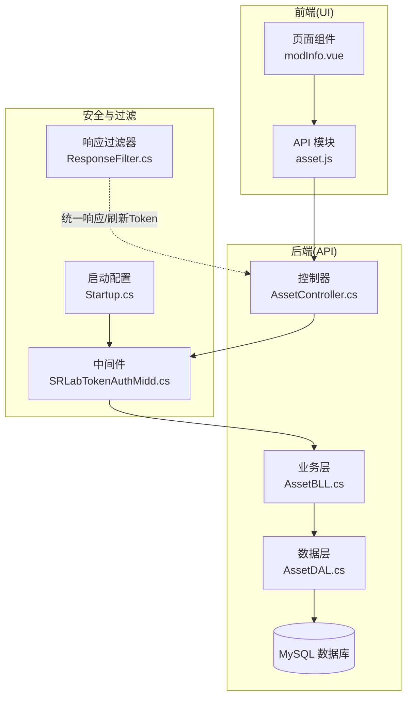
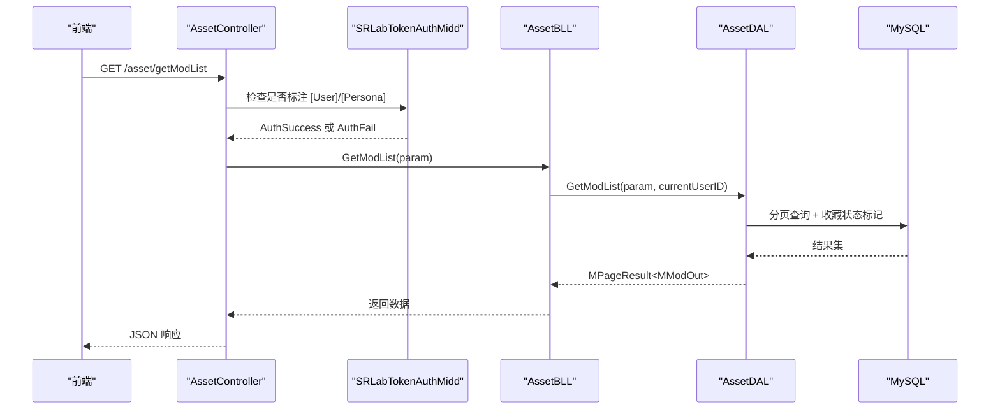
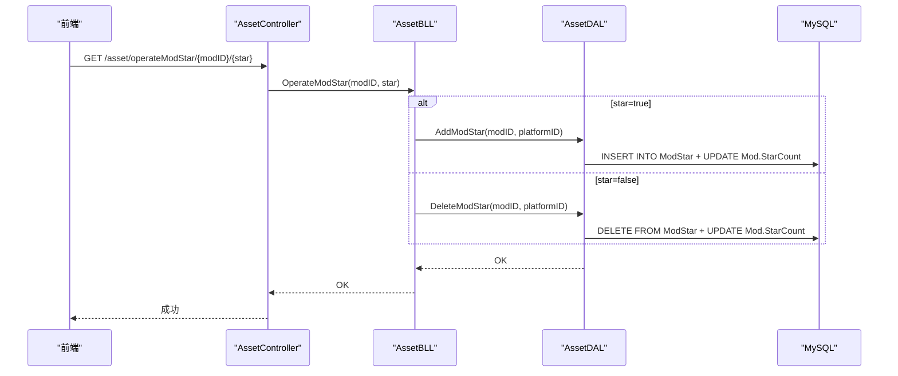
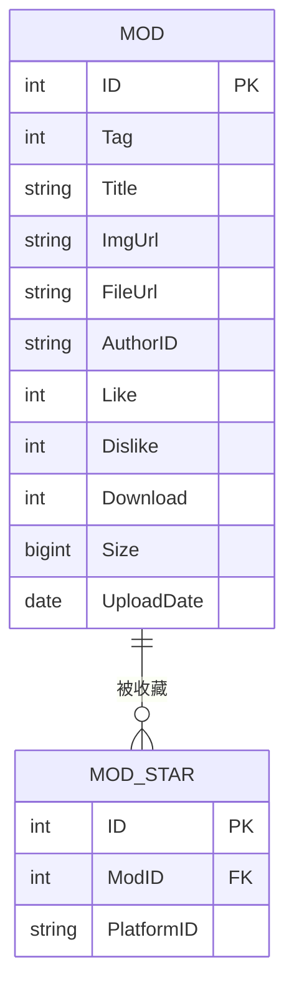
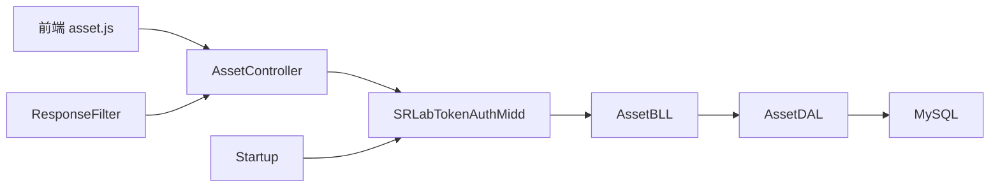

# MOD 评价收藏

<cite>
**本文引用的文件**
- [SpeedRunners.API/SpeedRunners.Model/Asset/MMod.cs](file://SpeedRunners.API/SpeedRunners.Model/Asset/MMod.cs)
- [SpeedRunners.API/SpeedRunners.Model/Asset/MModPageParam.cs](file://SpeedRunners.API/SpeedRunners.Model/Asset/MModPageParam.cs)
- [SpeedRunners.API/SpeedRunners.DAL/AssetDAL.cs](file://SpeedRunners.API/SpeedRunners.DAL/AssetDAL.cs)
- [SpeedRunners.API/SpeedRunners.BLL/AssetBLL.cs](file://SpeedRunners.API/SpeedRunners.BLL/AssetBLL.cs)
- [SpeedRunners.API/SpeedRunners/Controllers/AssetController.cs](file://SpeedRunners.API/SpeedRunners/Controllers/AssetController.cs)
- [SpeedRunners.API/SpeedRunners.Model/UserAttribute.cs](file://SpeedRunners.API/SpeedRunners.Model/UserAttribute.cs)
- [SpeedRunners.API/SpeedRunners.Model/PersonaAttribute.cs](file://SpeedRunners.API/SpeedRunners.Model/PersonaAttribute.cs)
- [SpeedRunners.API/SpeedRunners/Middleware/SRLabTokenAuthMidd.cs](file://SpeedRunners.API/SpeedRunners/Middleware/SRLabTokenAuthMidd.cs)
- [SpeedRunners.API/SpeedRunners/Filter/ResponseFilter.cs](file://SpeedRunners.API/SpeedRunners/Filter/ResponseFilter.cs)
- [SpeedRunners.API/SpeedRunners/Startup.cs](file://SpeedRunners.API/SpeedRunners/Startup.cs)
- [SpeedRunners.API/SpeedRunners.Model/MUser.cs](file://SpeedRunners.API/SpeedRunners.Model/MUser.cs)
- [mysql-dump/tmdsr.sql](file://mysql-dump/tmdsr.sql)
- [SpeedRunners.UI/src/api/asset.js](file://SpeedRunners.UI/src/api/asset.js)
- [SpeedRunners.UI/src/views/mod/modInfo.vue](file://SpeedRunners.UI/src/views/mod/modInfo.vue)
</cite>

## 目录
1. [简介](#简介)
2. [项目结构](#项目结构)
3. [核心组件](#核心组件)
4. [架构总览](#架构总览)
5. [详细组件分析](#详细组件分析)
6. [依赖关系分析](#依赖关系分析)
7. [性能与并发](#性能与并发)
8. [故障排查指南](#故障排查指南)
9. [结论](#结论)
10. [附录：API 接口清单](#附录api-接口清单)

## 简介
本技术文档聚焦于 MOD 的“评价收藏”能力，系统性解析以下内容：
- 评分机制：评分范围、重复评分处理、平均分计算算法
- 收藏功能：收藏状态管理、收藏列表查询、批量操作
- 权限控制：仅登录用户可进行评价与收藏
- API 接口：评分提交、收藏切换与状态查询
- 数据一致性与并发控制：事务边界、原子更新、索引与约束
- 性能优化：查询路径、缓存与索引建议

注意：经代码审计，当前仓库中未发现 MOD 评分字段或评分相关逻辑；本文在“评分机制”部分以“现状说明+设计建议”的方式呈现，帮助后续扩展。

## 项目结构
后端采用三层架构：控制器层负责路由与鉴权特性标注，业务层封装领域逻辑，数据层执行 SQL。前端通过统一 API 模块调用后端接口。



图表来源
- [SpeedRunners.API/SpeedRunners/Controllers/AssetController.cs](file://SpeedRunners.API/SpeedRunners/Controllers/AssetController.cs#L1-L47)
- [SpeedRunners.API/SpeedRunners.BLL/AssetBLL.cs](file://SpeedRunners.API/SpeedRunners.BLL/AssetBLL.cs#L1-L203)
- [SpeedRunners.API/SpeedRunners.DAL/AssetDAL.cs](file://SpeedRunners.API/SpeedRunners.DAL/AssetDAL.cs#L1-L134)
- [SpeedRunners.API/SpeedRunners/Middleware/SRLabTokenAuthMidd.cs](file://SpeedRunners.API/SpeedRunners/Middleware/SRLabTokenAuthMidd.cs#L1-L122)
- [SpeedRunners.API/SpeedRunners/Filter/ResponseFilter.cs](file://SpeedRunners.API/SpeedRunners/Filter/ResponseFilter.cs#L41-L78)
- [SpeedRunners.API/SpeedRunners/Startup.cs](file://SpeedRunners.API/SpeedRunners/Startup.cs#L65-L84)
- [SpeedRunners.UI/src/api/asset.js](file://SpeedRunners.UI/src/api/asset.js#L1-L54)
- [SpeedRunners.UI/src/views/mod/modInfo.vue](file://SpeedRunners.UI/src/views/mod/modInfo.vue#L1-L266)

章节来源
- [SpeedRunners.API/SpeedRunners/Controllers/AssetController.cs](file://SpeedRunners.API/SpeedRunners/Controllers/AssetController.cs#L1-L47)
- [SpeedRunners.API/SpeedRunners.BLL/AssetBLL.cs](file://SpeedRunners.API/SpeedRunners.BLL/AssetBLL.cs#L1-L203)
- [SpeedRunners.API/SpeedRunners.DAL/AssetDAL.cs](file://SpeedRunners.API/SpeedRunners.DAL/AssetDAL.cs#L1-L134)
- [SpeedRunners.API/SpeedRunners/Middleware/SRLabTokenAuthMidd.cs](file://SpeedRunners.API/SpeedRunners/Middleware/SRLabTokenAuthMidd.cs#L1-L122)
- [SpeedRunners.API/SpeedRunners/Filter/ResponseFilter.cs](file://SpeedRunners.API/SpeedRunners/Filter/ResponseFilter.cs#L41-L78)
- [SpeedRunners.API/SpeedRunners/Startup.cs](file://SpeedRunners.API/SpeedRunners/Startup.cs#L65-L84)
- [SpeedRunners.UI/src/api/asset.js](file://SpeedRunners.UI/src/api/asset.js#L1-L54)
- [SpeedRunners.UI/src/views/mod/modInfo.vue](file://SpeedRunners.UI/src/views/mod/modInfo.vue#L1-L266)

## 核心组件
- 控制器层：暴露 MOD 列表、详情、收藏开关等接口，并通过特性标注要求登录态
- 业务层：封装收藏增删、MOD 查询与下载计数更新等逻辑
- 数据层：提供 MOD 列表分页、收藏映射、下载次数更新等 SQL 实现
- 安全中间件：基于请求特性判断是否需要登录，拦截未登录访问
- 响应过滤器：统一对响应体注入 Token 并刷新

章节来源
- [SpeedRunners.API/SpeedRunners/Controllers/AssetController.cs](file://SpeedRunners.API/SpeedRunners/Controllers/AssetController.cs#L1-L47)
- [SpeedRunners.API/SpeedRunners.BLL/AssetBLL.cs](file://SpeedRunners.API/SpeedRunners.BLL/AssetBLL.cs#L102-L115)
- [SpeedRunners.API/SpeedRunners.DAL/AssetDAL.cs](file://SpeedRunners.API/SpeedRunners.DAL/AssetDAL.cs#L112-L124)
- [SpeedRunners.API/SpeedRunners/Middleware/SRLabTokenAuthMidd.cs](file://SpeedRunners.API/SpeedRunners/Middleware/SRLabTokenAuthMidd.cs#L54-L101)
- [SpeedRunners.API/SpeedRunners/Filter/ResponseFilter.cs](file://SpeedRunners.API/SpeedRunners/Filter/ResponseFilter.cs#L57-L78)

## 架构总览
从请求到持久化的完整链路如下：



图表来源
- [SpeedRunners.API/SpeedRunners/Controllers/AssetController.cs](file://SpeedRunners.API/SpeedRunners/Controllers/AssetController.cs#L28-L30)
- [SpeedRunners.API/SpeedRunners.BLL/AssetBLL.cs](file://SpeedRunners.API/SpeedRunners.BLL/AssetBLL.cs#L49-L62)
- [SpeedRunners.API/SpeedRunners.DAL/AssetDAL.cs](file://SpeedRunners.API/SpeedRunners.DAL/AssetDAL.cs#L16-L72)
- [SpeedRunners.API/SpeedRunners/Middleware/SRLabTokenAuthMidd.cs](file://SpeedRunners.API/SpeedRunners/Middleware/SRLabTokenAuthMidd.cs#L54-L101)

## 详细组件分析

### 收藏功能实现
- 收藏状态管理
  - 列表查询时，若当前用户已登录，先查询其收藏的 MOD ID 集合，再将对应条目的 Star 字段置为真
  - 仅登录用户可见“我的收藏”筛选与星标状态
- 收藏列表查询
  - 支持 OnlyStar 参数，仅返回当前用户收藏的 MOD
  - 列表排序综合考虑“是否新”“点赞数”“下载量”，并按上传时间回退排序
- 收藏切换
  - 提供收藏/取消收藏接口，内部通过事务插入或删除收藏记录，并原子性更新 MOD 的 StarCount
- 批量操作
  - 列表筛选支持 OnlyStar，可视为批量“按收藏筛选”
  - 后续可扩展批量收藏/取消收藏接口（建议）



图表来源
- [SpeedRunners.API/SpeedRunners/Controllers/AssetController.cs](file://SpeedRunners.API/SpeedRunners/Controllers/AssetController.cs#L40-L42)
- [SpeedRunners.API/SpeedRunners.BLL/AssetBLL.cs](file://SpeedRunners.API/SpeedRunners.BLL/AssetBLL.cs#L102-L115)
- [SpeedRunners.API/SpeedRunners.DAL/AssetDAL.cs](file://SpeedRunners.API/SpeedRunners.DAL/AssetDAL.cs#L112-L124)

章节来源
- [SpeedRunners.API/SpeedRunners.DAL/AssetDAL.cs](file://SpeedRunners.API/SpeedRunners.DAL/AssetDAL.cs#L16-L72)
- [SpeedRunners.API/SpeedRunners.BLL/AssetBLL.cs](file://SpeedRunners.API/SpeedRunners.BLL/AssetBLL.cs#L49-L62)
- [SpeedRunners.API/SpeedRunners/Controllers/AssetController.cs](file://SpeedRunners.API/SpeedRunners/Controllers/AssetController.cs#L40-L42)

### 评分机制现状与设计建议
- 现状
  - 代码库中未发现 MOD 评分字段或评分相关逻辑
  - 模型 MMod 中存在 Like/Dislike 字段，但未见评分提交接口与平均分计算
- 设计建议（扩展方向）
  - 新增评分表：包含 MOD_ID、用户平台ID、评分值（如 1~5）、唯一约束避免重复评分
  - 评分提交接口：仅登录用户可提交，提交时检查是否存在历史评分并做更新
  - 平均分计算：可在查询 MOD 详情时按评分表聚合计算，或维护一个统计字段定期更新
  - 并发控制：使用数据库事务与唯一索引保证重复评分幂等与一致性

章节来源
- [SpeedRunners.API/SpeedRunners.Model/Asset/MMod.cs](file://SpeedRunners.API/SpeedRunners.Model/Asset/MMod.cs#L7-L22)
- [mysql-dump/tmdsr.sql](file://mysql-dump/tmdsr.sql#L38-L54)

### 权限控制
- 鉴权特性
  - [User]：要求已登录用户
  - [Persona]：未登录返回通用数据，已登录返回定制数据
- 中间件流程
  - 读取请求头 srlab-token
  - 若接口标注 [User] 且无有效 Token，则直接返回未登录错误
  - 若接口标注 [Persona] 或 [User]，则将当前用户上下文注入服务容器
- 响应过滤
  - 对 [User]/[Persona] 接口统一刷新返回 Token

```mermaid
flowchart TD
Start(["进入中间件"]) --> CheckAttr["读取 Endpoint 特性<br/>[User]/[Persona]"]
CheckAttr --> NeedAuth{"是否需要认证？"}
NeedAuth --> |否| Next["放行到下一个中间件"]
NeedAuth --> |是| ReadToken["读取 srlab-token"]
ReadToken --> HasToken{"Token 是否有效？"}
HasToken --> |否 且 [User]| Fail["返回未登录错误"]
HasToken --> |是| SetUser["设置当前用户上下文"]
SetUser --> Next
Fail --> End(["结束"])
Next --> End
```

图表来源
- [SpeedRunners.API/SpeedRunners/Middleware/SRLabTokenAuthMidd.cs](file://SpeedRunners.API/SpeedRunners/Middleware/SRLabTokenAuthMidd.cs#L54-L101)
- [SpeedRunners.API/SpeedRunners/Filter/ResponseFilter.cs](file://SpeedRunners.API/SpeedRunners/Filter/ResponseFilter.cs#L57-L78)
- [SpeedRunners.API/SpeedRunners/Startup.cs](file://SpeedRunners.API/SpeedRunners/Startup.cs#L76-L76)

章节来源
- [SpeedRunners.API/SpeedRunners.Model/UserAttribute.cs](file://SpeedRunners.API/SpeedRunners.Model/UserAttribute.cs#L8-L12)
- [SpeedRunners.API/SpeedRunners.Model/PersonaAttribute.cs](file://SpeedRunners.API/SpeedRunners.Model/PersonaAttribute.cs#L8-L12)
- [SpeedRunners.API/SpeedRunners/Middleware/SRLabTokenAuthMidd.cs](file://SpeedRunners.API/SpeedRunners/Middleware/SRLabTokenAuthMidd.cs#L54-L101)
- [SpeedRunners.API/SpeedRunners/Filter/ResponseFilter.cs](file://SpeedRunners.API/SpeedRunners/Filter/ResponseFilter.cs#L57-L78)
- [SpeedRunners.API/SpeedRunners/Startup.cs](file://SpeedRunners.API/SpeedRunners/Startup.cs#L76-L76)

### 数据模型与表结构
- MOD 表：存储 MOD 基本信息与统计字段（点赞、下载、大小、上传时间等）
- MOD 星标表：记录用户对 MOD 的收藏关系，主键用于去重



图表来源
- [mysql-dump/tmdsr.sql](file://mysql-dump/tmdsr.sql#L38-L54)
- [mysql-dump/tmdsr.sql](file://mysql-dump/tmdsr.sql#L359-L365)

章节来源
- [mysql-dump/tmdsr.sql](file://mysql-dump/tmdsr.sql#L38-L54)
- [mysql-dump/tmdsr.sql](file://mysql-dump/tmdsr.sql#L359-L365)

### 前端交互与上传流程
- 前端通过 API 模块调用后端接口
- 上传封面与 MOD 文件分别获取独立上传 Token，双通道上传完成后提交 MOD 信息
- 收藏状态在列表页根据后端返回的 Star 字段渲染

章节来源
- [SpeedRunners.UI/src/api/asset.js](file://SpeedRunners.UI/src/api/asset.js#L1-L54)
- [SpeedRunners.UI/src/views/mod/modInfo.vue](file://SpeedRunners.UI/src/views/mod/modInfo.vue#L177-L246)

## 依赖关系分析
- 控制器依赖业务层，业务层依赖数据层
- 中间件与响应过滤器贯穿请求生命周期
- 前端通过统一 API 模块与后端交互



图表来源
- [SpeedRunners.API/SpeedRunners/Controllers/AssetController.cs](file://SpeedRunners.API/SpeedRunners/Controllers/AssetController.cs#L1-L47)
- [SpeedRunners.API/SpeedRunners.BLL/AssetBLL.cs](file://SpeedRunners.API/SpeedRunners.BLL/AssetBLL.cs#L1-L203)
- [SpeedRunners.API/SpeedRunners.DAL/AssetDAL.cs](file://SpeedRunners.API/SpeedRunners.DAL/AssetDAL.cs#L1-L134)
- [SpeedRunners.API/SpeedRunners/Middleware/SRLabTokenAuthMidd.cs](file://SpeedRunners.API/SpeedRunners/Middleware/SRLabTokenAuthMidd.cs#L1-L122)
- [SpeedRunners.API/SpeedRunners/Filter/ResponseFilter.cs](file://SpeedRunners.API/SpeedRunners/Filter/ResponseFilter.cs#L41-L78)
- [SpeedRunners.API/SpeedRunners/Startup.cs](file://SpeedRunners.API/SpeedRunners/Startup.cs#L65-L84)
- [SpeedRunners.UI/src/api/asset.js](file://SpeedRunners.UI/src/api/asset.js#L1-L54)

## 性能与并发
- 查询性能
  - 列表查询使用分页与复合排序，建议在 Tag、UploadDate、StarCount、Download 上建立合适索引
  - 收藏状态查询一次性拉取用户收藏集合，避免 N+1 查询
- 写入性能
  - 收藏增删使用单条 INSERT/DELETE + UPDATE，建议在 ModStar(ModID, PlatformID) 上建立唯一索引，确保幂等
- 并发控制
  - 使用数据库事务包裹收藏写入与计数更新，避免竞态
  - 下载计数更新为原子自增，建议在 FileUrl 上加索引
- 缓存建议
  - 列表热门 MOD 可短期缓存，结合 TTL 与失效策略
  - 用户收藏集合可按用户维度缓存，变更时失效

[本节为通用性能指导，无需特定文件引用]

## 故障排查指南
- 未登录访问被拒绝
  - 现象：返回未登录错误
  - 排查：确认请求头是否携带 srlab-token；接口是否标注 [User]；中间件是否正确注入用户上下文
- 收藏状态不同步
  - 现象：列表未显示星标
  - 排查：确认 OnlyStar 参数与用户登录态；检查 ModStar 表是否存在重复记录；核对排序逻辑
- 下载计数未增长
  - 现象：下载链接生成但计数不变
  - 排查：确认下载 URL 生成后是否触发更新；核对 FileUrl 匹配条件

章节来源
- [SpeedRunners.API/SpeedRunners/Middleware/SRLabTokenAuthMidd.cs](file://SpeedRunners.API/SpeedRunners/Middleware/SRLabTokenAuthMidd.cs#L42-L46)
- [SpeedRunners.API/SpeedRunners.DAL/AssetDAL.cs](file://SpeedRunners.API/SpeedRunners.DAL/AssetDAL.cs#L106-L110)

## 结论
- 收藏功能已完整实现：登录态校验、收藏状态管理、列表筛选与原子更新
- 评分机制当前未实现，建议新增评分表与接口，并完善并发控制与一致性保障
- 权限体系清晰：通过特性与中间件实现细粒度访问控制
- 建议持续优化索引与缓存策略，提升查询与写入性能

[本节为总结性内容，无需特定文件引用]

## 附录：API 接口清单
- 获取上传 Token
  - 方法：GET
  - 路径：/asset/getUploadToken
  - 权限：[User]
  - 说明：返回图片与 MOD 文件的上传 Token 数组
- 获取下载地址
  - 方法：POST
  - 路径：/asset/getDownloadUrl
  - 权限：[User]
  - 请求体：fileName
  - 说明：生成私有云下载地址并原子增加下载计数
- 删除 MOD
  - 方法：POST
  - 路径：/asset/deleteMod
  - 权限：[User]
  - 请求体：modID
  - 说明：仅作者或管理员可删除；同时清理云端资源
- 获取 MOD 列表
  - 方法：POST
  - 路径：/asset/getModList
  - 权限：[Persona]
  - 请求体：tag、keywords、onlyStar、分页参数
  - 说明：支持按标签、关键词、仅收藏筛选；返回每条记录的 Star 状态
- 获取 MOD 详情
  - 方法：GET
  - 路径：/asset/getMod/{modID}
  - 权限：[Persona]
  - 说明：返回 MOD 详情（含下载计数、上传时间等）
- 添加 MOD
  - 方法：POST
  - 路径：/asset/addMod
  - 权限：[User]
  - 请求体：tag、title、imgUrl、fileUrl、size
  - 说明：作者自动绑定当前登录用户
- 切换收藏
  - 方法：GET
  - 路径：/asset/operateModStar/{modID}/{star}
  - 权限：[User]
  - 说明：star=true 为收藏，false 为取消；内部原子更新收藏表与计数

章节来源
- [SpeedRunners.API/SpeedRunners/Controllers/AssetController.cs](file://SpeedRunners.API/SpeedRunners/Controllers/AssetController.cs#L16-L42)
- [SpeedRunners.API/SpeedRunners.BLL/AssetBLL.cs](file://SpeedRunners.API/SpeedRunners.BLL/AssetBLL.cs#L22-L47)
- [SpeedRunners.API/SpeedRunners.BLL/AssetBLL.cs](file://SpeedRunners.API/SpeedRunners.BLL/AssetBLL.cs#L102-L115)
- [SpeedRunners.API/SpeedRunners.DAL/AssetDAL.cs](file://SpeedRunners.API/SpeedRunners.DAL/AssetDAL.cs#L16-L72)
- [SpeedRunners.API/SpeedRunners.DAL/AssetDAL.cs](file://SpeedRunners.API/SpeedRunners.DAL/AssetDAL.cs#L106-L110)
- [SpeedRunners.API/SpeedRunners.DAL/AssetDAL.cs](file://SpeedRunners.API/SpeedRunners.DAL/AssetDAL.cs#L112-L124)
- [SpeedRunners.API/SpeedRunners.Model/Asset/MModPageParam.cs](file://SpeedRunners.API/SpeedRunners.Model/Asset/MModPageParam.cs#L7-L12)
- [SpeedRunners.API/SpeedRunners.Model/Asset/MMod.cs](file://SpeedRunners.API/SpeedRunners.Model/Asset/MMod.cs#L7-L22)
- [SpeedRunners.API/SpeedRunners.Model/Asset/MDeleteMod.cs](file://SpeedRunners.API/SpeedRunners.Model/Asset/MDeleteMod.cs#L7-L11)
- [SpeedRunners.API/SpeedRunners.Model/UserAttribute.cs](file://SpeedRunners.API/SpeedRunners.Model/UserAttribute.cs#L8-L12)
- [SpeedRunners.API/SpeedRunners.Model/PersonaAttribute.cs](file://SpeedRunners.API/SpeedRunners.Model/PersonaAttribute.cs#L8-L12)
- [SpeedRunners.UI/src/api/asset.js](file://SpeedRunners.UI/src/api/asset.js#L3-L48)