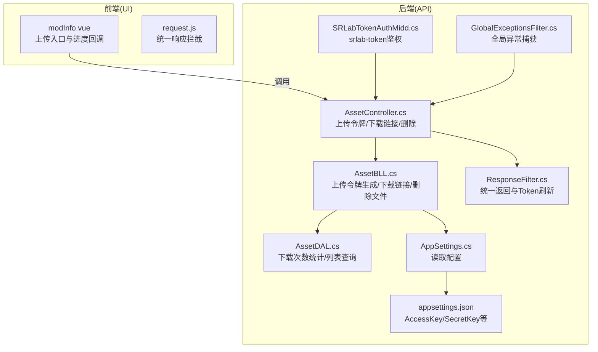
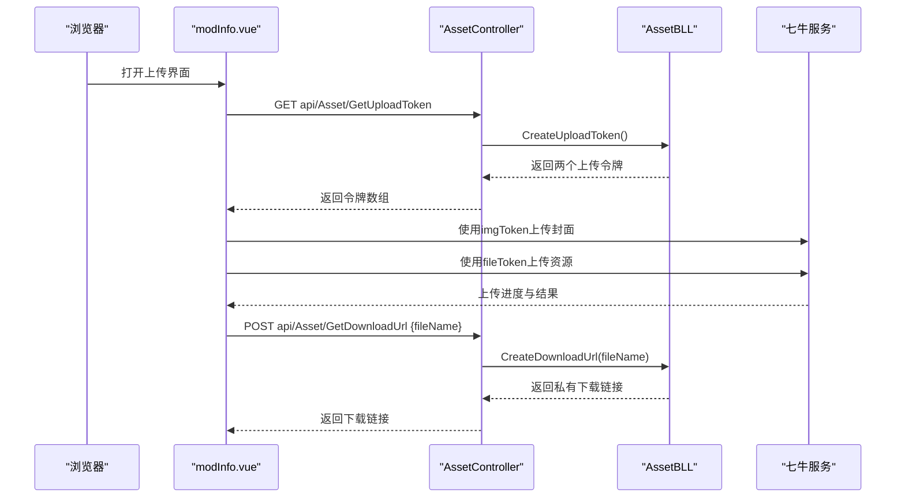
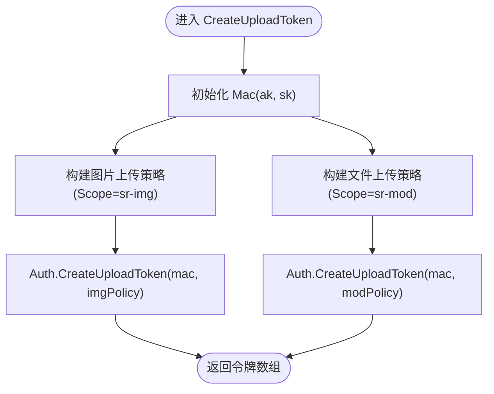
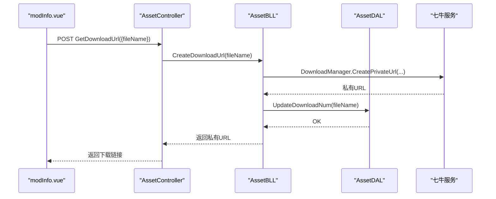
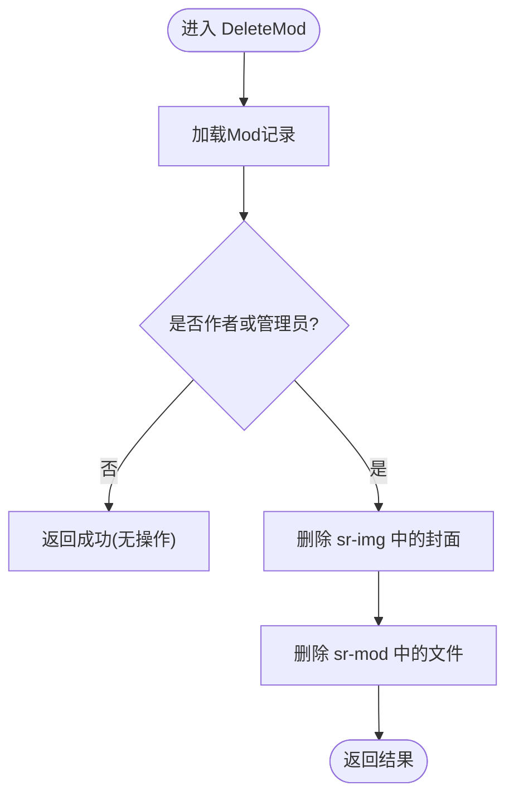
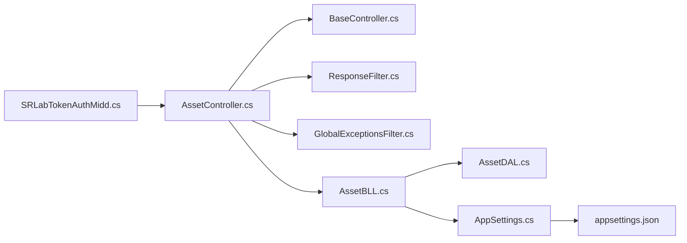

# 文件上传下载

<cite>
**本文引用的文件**
- [SpeedRunners.API/SpeedRunners/Controllers/AssetController.cs](file://SpeedRunners.API/SpeedRunners/Controllers/AssetController.cs)
- [SpeedRunners.API/SpeedRunners.BLL/AssetBLL.cs](file://SpeedRunners.API/SpeedRunners.BLL/AssetBLL.cs)
- [SpeedRunners.API/SpeedRunners.DAL/AssetDAL.cs](file://SpeedRunners.API/SpeedRunners.DAL/AssetDAL.cs)
- [SpeedRunners.API/SpeedRunners/Controllers/BaseController.cs](file://SpeedRunners.API/SpeedRunners/Controllers/BaseController.cs)
- [SpeedRunners.API/SpeedRunners/Startup.cs](file://SpeedRunners.API/SpeedRunners/Startup.cs)
- [SpeedRunners.API/SpeedRunners/Filter/ResponseFilter.cs](file://SpeedRunners.API/SpeedRunners/Filter/ResponseFilter.cs)
- [SpeedRunners.API/SpeedRunners/Filter/GlobalExceptionsFilter.cs](file://SpeedRunners.API/SpeedRunners/Filter/GlobalExceptionsFilter.cs)
- [SpeedRunners.API/SpeedRunners/Middleware/SRLabTokenAuthMidd.cs](file://SpeedRunners.API/SpeedRunners/Middleware/SRLabTokenAuthMidd.cs)
- [SpeedRunners.API/SpeedRunners/Model/MResponse.cs](file://SpeedRunners.API/SpeedRunners/Model/MResponse.cs)
- [SpeedRunners.API/SpeedRunners/Model/Asset/MMod.cs](file://SpeedRunners.API/SpeedRunners/Model/Asset/MMod.cs)
- [SpeedRunners.API/SpeedRunners/Model/Asset/MModPageParam.cs](file://SpeedRunners.API/SpeedRunners/Model/Asset/MModPageParam.cs)
- [SpeedRunners.API/SpeedRunners/Utils/AppSettings.cs](file://SpeedRunners.API/SpeedRunners/Utils/AppSettings.cs)
- [SpeedRunners.API/SpeedRunners/appsettings.json](file://SpeedRunners.API/SpeedRunners/appsettings.json)
- [SpeedRunners.UI/src/views/mod/modInfo.vue](file://SpeedRunners.UI/src/views/mod/modInfo.vue)
- [SpeedRunners.UI/src/utils/request.js](file://SpeedRunners.UI/src/utils/request.js)
</cite>

## 目录
1. [简介](#简介)
2. [项目结构](#项目结构)
3. [核心组件](#核心组件)
4. [架构总览](#架构总览)
5. [详细组件分析](#详细组件分析)
6. [依赖关系分析](#依赖关系分析)
7. [性能与并发](#性能与并发)
8. [故障排查指南](#故障排查指南)
9. [结论](#结论)
10. [附录：API 接口规范](#附录api-接口规范)

## 简介
本技术文档聚焦于 SpeedRunnersLab 项目的“文件上传下载”能力，系统性解析其基于七牛云（Qiniu）的对象存储集成方案。内容涵盖：
- 上传令牌生成机制与签名算法要点
- 上传流程与下载链接创建
- 文件命名策略与存储路径管理
- CDN 加速配置与访问域名
- 完整的上传/下载 API 规范（参数、校验、错误处理、安全）
- 高级功能：格式限制、大小约束、并发上传与断点续传的实现现状与扩展建议

## 项目结构
后端采用分层架构：控制器（Controller）负责路由与鉴权特性标注；业务逻辑（BLL）封装上传/下载与数据库交互；数据访问（DAL）执行 SQL；前端通过 qiniu-js SDK 调用后端接口完成上传。

图表来源
- [SpeedRunners.API/SpeedRunners/Controllers/AssetController.cs](file://SpeedRunners.API/SpeedRunners/Controllers/AssetController.cs#L12-L35)
- [SpeedRunners.API/SpeedRunners.BLL/AssetBLL.cs](file://SpeedRunners.API/SpeedRunners.BLL/AssetBLL.cs#L18-L47)
- [SpeedRunners.API/SpeedRunners.DAL/AssetDAL.cs](file://SpeedRunners.API/SpeedRunners.DAL/AssetDAL.cs#L106-L110)
- [SpeedRunners.API/SpeedRunners/Filter/ResponseFilter.cs](file://SpeedRunners.API/SpeedRunners/Filter/ResponseFilter.cs#L41-L78)
- [SpeedRunners.API/SpeedRunners/Filter/GlobalExceptionsFilter.cs](file://SpeedRunners.API/SpeedRunners/Filter/GlobalExceptionsFilter.cs#L31-L50)
- [SpeedRunners.API/SpeedRunners/Middleware/SRLabTokenAuthMidd.cs](file://SpeedRunners.API/SpeedRunners/Middleware/SRLabTokenAuthMidd.cs#L54-L101)
- [SpeedRunners.API/SpeedRunners/Utils/AppSettings.cs](file://SpeedRunners.API/SpeedRunners/Utils/AppSettings.cs#L16-L38)
- [SpeedRunners.API/SpeedRunners/appsettings.json](file://SpeedRunners.API/SpeedRunners/appsettings.json#L15-L19)
- [SpeedRunners.UI/src/views/mod/modInfo.vue](file://SpeedRunners.UI/src/views/mod/modInfo.vue#L180-L229)
- [SpeedRunners.UI/src/utils/request.js](file://SpeedRunners.UI/src/utils/request.js#L45-L82)

章节来源
- [SpeedRunners.API/SpeedRunners/Controllers/AssetController.cs](file://SpeedRunners.API/SpeedRunners/Controllers/AssetController.cs#L12-L35)
- [SpeedRunners.API/SpeedRunners.BLL/AssetBLL.cs](file://SpeedRunners.API/SpeedRunners.BLL/AssetBLL.cs#L18-L47)
- [SpeedRunners.API/SpeedRunners/Utils/AppSettings.cs](file://SpeedRunners.API/SpeedRunners/Utils/AppSettings.cs#L16-L38)
- [SpeedRunners.API/SpeedRunners/appsettings.json](file://SpeedRunners.API/SpeedRunners/appsettings.json#L15-L19)

## 核心组件
- 控制器层：提供上传令牌、下载链接、删除等接口，并通过特性标注进行用户态鉴权。
- 业务层：封装七牛上传策略、下载私有链接生成、删除资源与下载计数更新。
- 数据访问层：维护 Mod 表与星标表，支持下载次数统计与列表查询。
- 前端：使用 qiniu-js SDK 并发上传封面与资源文件，结合后端返回的上传令牌。

章节来源
- [SpeedRunners.API/SpeedRunners/Controllers/AssetController.cs](file://SpeedRunners.API/SpeedRunners/Controllers/AssetController.cs#L16-L30)
- [SpeedRunners.API/SpeedRunners.BLL/AssetBLL.cs](file://SpeedRunners.API/SpeedRunners.BLL/AssetBLL.cs#L22-L47)
- [SpeedRunners.API/SpeedRunners.DAL/AssetDAL.cs](file://SpeedRunners.API/SpeedRunners.DAL/AssetDAL.cs#L106-L110)
- [SpeedRunners.UI/src/views/mod/modInfo.vue](file://SpeedRunners.UI/src/views/mod/modInfo.vue#L180-L229)

## 架构总览
下图展示从浏览器到七牛对象存储的关键交互路径，包括上传令牌生成、上传与下载链接生成。

图表来源
- [SpeedRunners.API/SpeedRunners/Controllers/AssetController.cs](file://SpeedRunners.API/SpeedRunners/Controllers/AssetController.cs#L16-L22)
- [SpeedRunners.API/SpeedRunners.BLL/AssetBLL.cs](file://SpeedRunners.API/SpeedRunners.BLL/AssetBLL.cs#L22-L47)
- [SpeedRunners.UI/src/views/mod/modInfo.vue](file://SpeedRunners.UI/src/views/mod/modInfo.vue#L180-L229)

## 详细组件分析

### 上传令牌生成（GetUploadToken）
- 令牌类型：针对两类空间分别生成独立上传令牌，便于权限隔离与配额管理。
  - 图片空间：sr-img
  - 模组文件空间：sr-mod
- 签名算法：基于七牛 SDK 的 Mac 与 PutPolicy，使用 AccessKey/SecretKey 对策略 JSON 进行签名。
- 过期时间：当前实现未显式设置过期时间，默认遵循 SDK 默认策略。
- 权限控制：通过 Scope 限定上传空间，避免跨域写入。

图表来源
- [SpeedRunners.API/SpeedRunners.BLL/AssetBLL.cs](file://SpeedRunners.API/SpeedRunners.BLL/AssetBLL.cs#L22-L36)

章节来源
- [SpeedRunners.API/SpeedRunners.BLL/AssetBLL.cs](file://SpeedRunners.API/SpeedRunners.BLL/AssetBLL.cs#L22-L36)
- [SpeedRunners.API/SpeedRunners/Utils/AppSettings.cs](file://SpeedRunners.API/SpeedRunners/Utils/AppSettings.cs#L16-L38)
- [SpeedRunners.API/SpeedRunners/appsettings.json](file://SpeedRunners.API/SpeedRunners/appsettings.json#L15-L19)

### 下载链接创建（GetDownloadUrl）
- 私有链接：使用 DownloadManager 创建带有效期的私有下载地址，默认有效期约 10 分钟。
- 访问域名：默认 cdn 域名为 https://cdn-mod.speedrunners.cn。
- 下载计数：在生成链接时异步更新数据库中的下载次数，确保统计准确。

图表来源
- [SpeedRunners.API/SpeedRunners/Controllers/AssetController.cs](file://SpeedRunners.API/SpeedRunners/Controllers/AssetController.cs#L20-L22)
- [SpeedRunners.API/SpeedRunners.BLL/AssetBLL.cs](file://SpeedRunners.API/SpeedRunners.BLL/AssetBLL.cs#L38-L47)
- [SpeedRunners.API/SpeedRunners.DAL/AssetDAL.cs](file://SpeedRunners.API/SpeedRunners.DAL/AssetDAL.cs#L106-L110)

章节来源
- [SpeedRunners.API/SpeedRunners/Controllers/AssetController.cs](file://SpeedRunners.API/SpeedRunners/Controllers/AssetController.cs#L20-L22)
- [SpeedRunners.API/SpeedRunners.BLL/AssetBLL.cs](file://SpeedRunners.API/SpeedRunners.BLL/AssetBLL.cs#L38-L47)
- [SpeedRunners.API/SpeedRunners.DAL/AssetDAL.cs](file://SpeedRunners.API/SpeedRunners.DAL/AssetDAL.cs#L106-L110)

### 文件命名策略与存储路径管理
- 命名策略：前端对封面与模组文件分别生成唯一文件名，封面以 .jpg 结尾，模组文件保留原始扩展名。
- 存储路径：上传至对应空间（sr-img/sr-mod），文件名即为 key；前端在生成下载链接时直接使用该 key。
- CDN 加速：下载链接默认使用 cdn-mod.speedrunners.cn 或 cdn-img.speedrunners.cn 域名，提升访问速度。

章节来源
- [SpeedRunners.UI/src/views/mod/modInfo.vue](file://SpeedRunners.UI/src/views/mod/modInfo.vue#L174-L214)
- [SpeedRunners.API/SpeedRunners.BLL/AssetBLL.cs](file://SpeedRunners.API/SpeedRunners.BLL/AssetBLL.cs#L58-L78)

### 删除资源（DeleteMod）
- 权限：仅作者或特定管理员可删除。
- 流程：先删除数据库记录，再调用七牛 BucketManager 删除对应 key 的对象。
- 错误处理：若删除失败，返回失败响应；成功则返回成功响应。

图表来源
- [SpeedRunners.API/SpeedRunners.BLL/AssetBLL.cs](file://SpeedRunners.API/SpeedRunners.BLL/AssetBLL.cs#L120-L143)
- [SpeedRunners.API/SpeedRunners.BLL/AssetBLL.cs](file://SpeedRunners.API/SpeedRunners.BLL/AssetBLL.cs#L150-L160)

章节来源
- [SpeedRunners.API/SpeedRunners.BLL/AssetBLL.cs](file://SpeedRunners.API/SpeedRunners.BLL/AssetBLL.cs#L120-L143)
- [SpeedRunners.API/SpeedRunners.BLL/AssetBLL.cs](file://SpeedRunners.API/SpeedRunners.BLL/AssetBLL.cs#L150-L160)

### 列表与详情（GetModList/GetMod）
- 列表：支持标签筛选、关键词模糊搜索、仅看星标等条件，返回带 CDN 前缀的图片链接。
- 详情：返回模组信息，并拼接 CDN 前缀的图片与文件链接。

章节来源
- [SpeedRunners.API/SpeedRunners.BLL/AssetBLL.cs](file://SpeedRunners.API/SpeedRunners.BLL/AssetBLL.cs#L49-L91)
- [SpeedRunners.API/SpeedRunners.DAL/AssetDAL.cs](file://SpeedRunners.API/SpeedRunners.DAL/AssetDAL.cs#L16-L72)

## 依赖关系分析
- 控制器依赖注入：BaseController 通过服务定位器注入具体 BLL，并传递当前用户上下文。
- 鉴权中间件：SRLabTokenAuthMidd 依据接口特性判断是否需要用户态鉴权，从请求头提取 srlab-token 并校验。
- 统一响应：ResponseFilter 在 Action 执行后统一包装返回体并刷新 Token。
- 异常处理：GlobalExceptionsFilter 捕获未处理异常并记录日志，生产环境返回通用提示。

图表来源
- [SpeedRunners.API/SpeedRunners/Middleware/SRLabTokenAuthMidd.cs](file://SpeedRunners.API/SpeedRunners/Middleware/SRLabTokenAuthMidd.cs#L54-L101)
- [SpeedRunners.API/SpeedRunners/Controllers/BaseController.cs](file://SpeedRunners.API/SpeedRunners/Controllers/BaseController.cs#L14-L23)
- [SpeedRunners.API/SpeedRunners/Filter/ResponseFilter.cs](file://SpeedRunners.API/SpeedRunners/Filter/ResponseFilter.cs#L41-L78)
- [SpeedRunners.API/SpeedRunners/Filter/GlobalExceptionsFilter.cs](file://SpeedRunners.API/SpeedRunners/Filter/GlobalExceptionsFilter.cs#L31-L50)
- [SpeedRunners.API/SpeedRunners.BLL/AssetBLL.cs](file://SpeedRunners.API/SpeedRunners.BLL/AssetBLL.cs#L18-L21)
- [SpeedRunners.API/SpeedRunners/Utils/AppSettings.cs](file://SpeedRunners.API/SpeedRunners/Utils/AppSettings.cs#L16-L38)
- [SpeedRunners.API/SpeedRunners/appsettings.json](file://SpeedRunners.API/SpeedRunners/appsettings.json#L15-L19)

章节来源
- [SpeedRunners.API/SpeedRunners/Controllers/BaseController.cs](file://SpeedRunners.API/SpeedRunners/Controllers/BaseController.cs#L14-L23)
- [SpeedRunners.API/SpeedRunners/Middleware/SRLabTokenAuthMidd.cs](file://SpeedRunners.API/SpeedRunners/Middleware/SRLabTokenAuthMidd.cs#L54-L101)
- [SpeedRunners.API/SpeedRunners/Filter/ResponseFilter.cs](file://SpeedRunners.API/SpeedRunners/Filter/ResponseFilter.cs#L41-L78)
- [SpeedRunners.API/SpeedRunners/Filter/GlobalExceptionsFilter.cs](file://SpeedRunners.API/SpeedRunners/Filter/GlobalExceptionsFilter.cs#L31-L50)

## 性能与并发
- 并发上传：前端使用 qiniu-js SDK 并发上传封面与模组文件，分别绑定各自的观察者以跟踪进度。
- CDN 加速：useCdnDomain=true，优先走 CDN 域名，降低源站压力并提升下载速度。
- 下载计数：生成私有链接时异步更新下载次数，避免阻塞主流程。

章节来源
- [SpeedRunners.UI/src/views/mod/modInfo.vue](file://SpeedRunners.UI/src/views/mod/modInfo.vue#L193-L229)
- [SpeedRunners.API/SpeedRunners.BLL/AssetBLL.cs](file://SpeedRunners.API/SpeedRunners.BLL/AssetBLL.cs#L42-L46)

## 故障排查指南
- 上传失败
  - 检查 srlab-token 是否有效，接口是否标注用户态特性。
  - 确认上传令牌是否正确下发，Scope 是否匹配目标空间。
  - 查看 qiniu-js SDK 回调中的错误信息。
- 下载失败
  - 私有链接有效期约为 10 分钟，过期需重新获取。
  - 确认 key 是否存在且未被删除。
- 删除失败
  - 管理器返回非 200 时会返回失败响应，检查七牛返回码与日志。
- 统一响应与异常
  - 前端 request.js 会对 code!=666 的响应弹出错误提示。
  - 生产环境全局异常过滤器会记录请求体与堆栈信息。

章节来源
- [SpeedRunners.API/SpeedRunners/Middleware/SRLabTokenAuthMidd.cs](file://SpeedRunners.API/SpeedRunners/Middleware/SRLabTokenAuthMidd.cs#L54-L101)
- [SpeedRunners.API/SpeedRunners.BLL/AssetBLL.cs](file://SpeedRunners.API/SpeedRunners.BLL/AssetBLL.cs#L150-L160)
- [SpeedRunners.API/SpeedRunners/Filter/GlobalExceptionsFilter.cs](file://SpeedRunners.API/SpeedRunners/Filter/GlobalExceptionsFilter.cs#L31-L50)
- [SpeedRunners.UI/src/utils/request.js](file://SpeedRunners.UI/src/utils/request.js#L45-L82)

## 结论
本方案以七牛云为核心，通过后端签发上传令牌与生成私有下载链接，实现了安全可控的文件上传下载流程。前端采用并发上传与 CDN 加速，兼顾性能与体验。后续可在令牌过期时间、文件大小限制、断点续传等方面进一步完善。

## 附录：API 接口规范

### 通用约定
- 认证方式：请求头携带 srlab-token，部分接口需用户态认证。
- 统一返回：遵循 MResponse 结构，code=666 表示成功，否则为失败。
- 域名与CDN：
  - 图片访问：https://cdn-img.speedrunners.cn/{key}
  - 模组文件访问：https://cdn-mod.speedrunners.cn/{key}

章节来源
- [SpeedRunners.API/SpeedRunners/Model/MResponse.cs](file://SpeedRunners.API/SpeedRunners/Model/MResponse.cs#L3-L27)
- [SpeedRunners.API/SpeedRunners.BLL/AssetBLL.cs](file://SpeedRunners.API/SpeedRunners.BLL/AssetBLL.cs#L58-L78)

### GetUploadToken
- 方法：GET
- 路径：api/Asset/GetUploadToken
- 权限：用户态
- 返回：字符串数组，索引 0 为图片空间令牌，索引 1 为模组文件空间令牌
- 用途：前端使用对应令牌上传封面与模组文件

章节来源
- [SpeedRunners.API/SpeedRunners/Controllers/AssetController.cs](file://SpeedRunners.API/SpeedRunners/Controllers/AssetController.cs#L16-L18)
- [SpeedRunners.API/SpeedRunners.BLL/AssetBLL.cs](file://SpeedRunners.API/SpeedRunners.BLL/AssetBLL.cs#L22-L36)

### GetDownloadUrl
- 方法：POST
- 路径：api/Asset/GetDownloadUrl
- 参数：
  - fileName: string（必填，即上传时使用的 key）
- 权限：用户态
- 返回：string（私有下载链接，有效期约 10 分钟）

章节来源
- [SpeedRunners.API/SpeedRunners/Controllers/AssetController.cs](file://SpeedRunners.API/SpeedRunners/Controllers/AssetController.cs#L20-L22)
- [SpeedRunners.API/SpeedRunners.BLL/AssetBLL.cs](file://SpeedRunners.API/SpeedRunners.BLL/AssetBLL.cs#L38-L47)

### DeleteMod
- 方法：POST
- 路径：api/Asset/DeleteMod
- 参数：
  - modID: int（必填）
- 权限：用户态，仅作者或管理员可删除
- 返回：MResponse（成功或失败）

章节来源
- [SpeedRunners.API/SpeedRunners/Controllers/AssetController.cs](file://SpeedRunners.API/SpeedRunners/Controllers/AssetController.cs#L24-L26)
- [SpeedRunners.API/SpeedRunners.BLL/AssetBLL.cs](file://SpeedRunners.API/SpeedRunners.BLL/AssetBLL.cs#L120-L143)

### GetModList / GetMod
- GetModList
  - 方法：POST
  - 路径：api/Asset/GetModList
  - 参数：MModPageParam（含 Tag、OnlyStar 等）
  - 返回：分页结果，图片 URL 已拼接 CDN 前缀
- GetMod
  - 方法：GET
  - 路径：api/Asset/GetMod/{modID}
  - 返回：单条模组信息，包含 CDN 前缀的图片与文件链接

章节来源
- [SpeedRunners.API/SpeedRunners/Controllers/AssetController.cs](file://SpeedRunners.API/SpeedRunners/Controllers/AssetController.cs#L28-L34)
- [SpeedRunners.API/SpeedRunners.BLL/AssetBLL.cs](file://SpeedRunners.API/SpeedRunners.BLL/AssetBLL.cs#L49-L91)
- [SpeedRunners.API/SpeedRunners/Model/Asset/MModPageParam.cs](file://SpeedRunners.API/SpeedRunners/Model/Asset/MModPageParam.cs#L7-L12)
- [SpeedRunners.API/SpeedRunners/Model/Asset/MMod.cs](file://SpeedRunners.API/SpeedRunners/Model/Asset/MMod.cs#L7-L26)

### 参数校验与安全
- 令牌生成：由后端使用 AccessKey/SecretKey 签名，前端仅持有短期可用令牌，降低泄露风险。
- 下载链接：私有链接带有效期，防止长期暴露。
- 删除权限：严格校验作者身份或管理员权限。
- 统一响应：前后端一致的 code 标准，便于前端统一处理。

章节来源
- [SpeedRunners.API/SpeedRunners.BLL/AssetBLL.cs](file://SpeedRunners.API/SpeedRunners.BLL/AssetBLL.cs#L120-L143)
- [SpeedRunners.API/SpeedRunners.BLL/AssetBLL.cs](file://SpeedRunners.API/SpeedRunners.BLL/AssetBLL.cs#L38-L47)
- [SpeedRunners.UI/src/utils/request.js](file://SpeedRunners.UI/src/utils/request.js#L45-L82)

### 高级功能建议
- 文件格式限制：可在前端与后端共同校验，例如仅允许 .png/.jpg/.zip/.rar/.xnb/.ogg/.srt 等扩展名。
- 大小约束：建议在前端限制上传大小并在后端再次校验，避免超大文件占用存储。
- 并发上传：当前已使用 SDK 并发上传封面与文件，可考虑分片并发与断点续传以优化大文件体验。
- 断点续传：可引入 SDK 的分片上传与断点续传能力，结合服务端令牌与状态管理实现更稳健的上传体验。

章节来源
- [SpeedRunners.UI/src/views/mod/modInfo.vue](file://SpeedRunners.UI/src/views/mod/modInfo.vue#L139-L152)