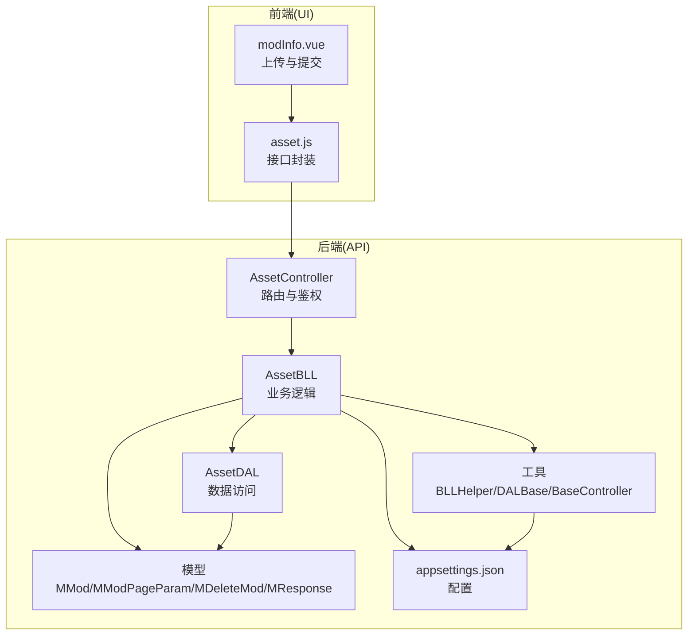
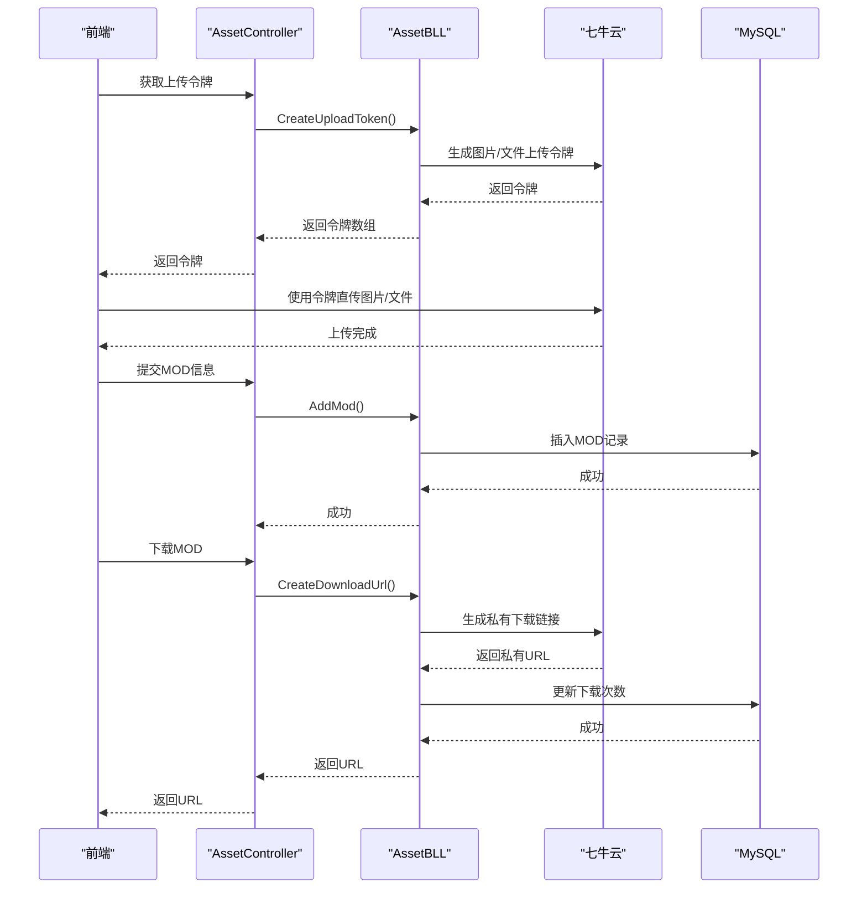
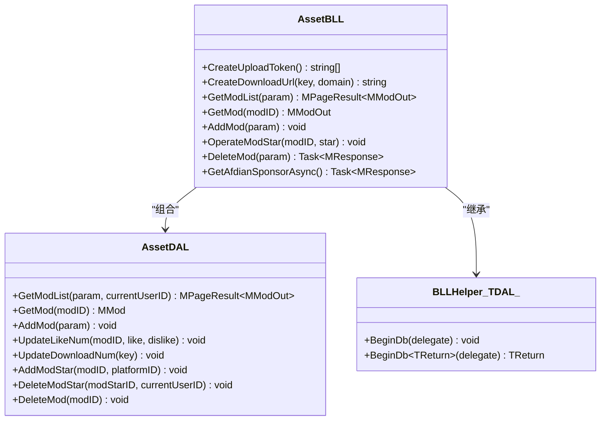
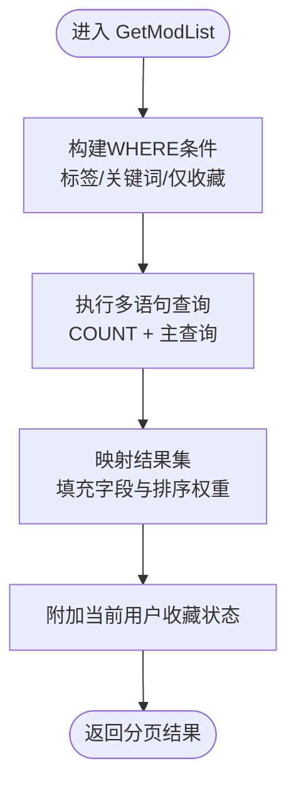
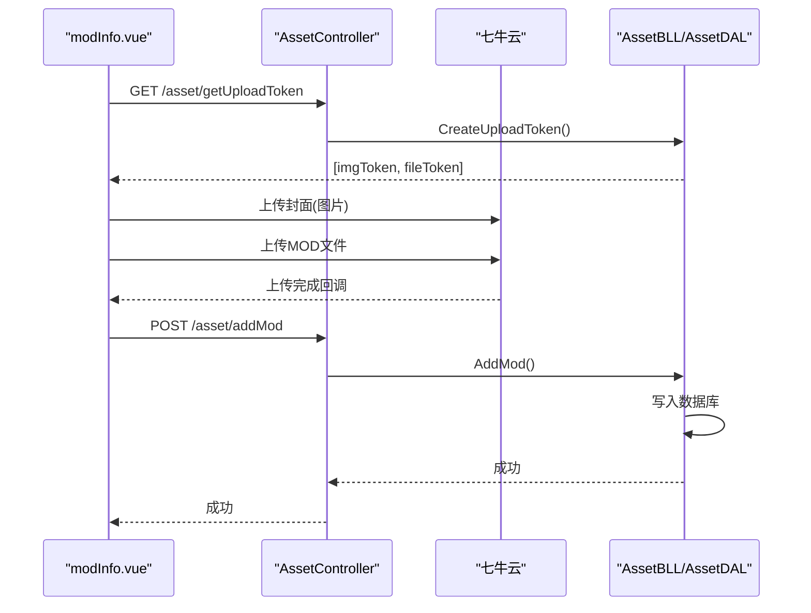
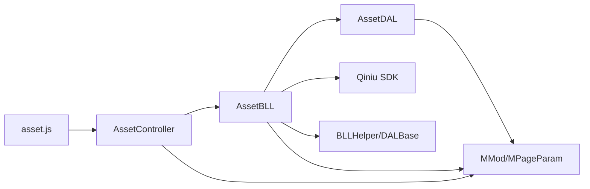

# 资源管理模块

<cite>
**本文引用的文件**
- [AssetBLL.cs](file://SpeedRunners.API/SpeedRunners.BLL/AssetBLL.cs)
- [AssetDAL.cs](file://SpeedRunners.API/SpeedRunners.DAL/AssetDAL.cs)
- [AssetController.cs](file://SpeedRunners.API/SpeedRunners/Controllers/AssetController.cs)
- [MMod.cs](file://SpeedRunners.API/SpeedRunners.Model/Asset/MMod.cs)
- [MModPageParam.cs](file://SpeedRunners.API/SpeedRunners.Model/Asset/MModPageParam.cs)
- [MDeleteMod.cs](file://SpeedRunners.API/SpeedRunners.Model/Asset/MDeleteMod.cs)
- [MPageParam.cs](file://SpeedRunners.API/SpeedRunners.Model/MPageParam.cs)
- [MResponse.cs](file://SpeedRunners.API/SpeedRunners.Model/MResponse.cs)
- [BLLHelper.cs](file://SpeedRunners.API/SpeedRunners.Utils/BLLHelper.cs)
- [DALBase.cs](file://SpeedRunners.API/SpeedRunners.Utils/DALBase.cs)
- [BaseController.cs](file://SpeedRunners.API/SpeedRunners/Controllers/BaseController.cs)
- [appsettings.json](file://SpeedRunners.API/SpeedRunners/appsettings.json)
- [asset.js](file://SpeedRunners.UI/src/api/asset.js)
- [modInfo.vue](file://SpeedRunners.UI/src/views/mod/modInfo.vue)
</cite>

## 目录
1. [简介](#简介)
2. [项目结构](#项目结构)
3. [核心组件](#核心组件)
4. [架构总览](#架构总览)
5. [详细组件分析](#详细组件分析)
6. [依赖关系分析](#依赖关系分析)
7. [性能与并发考虑](#性能与并发考虑)
8. [故障排查指南](#故障排查指南)
9. [结论](#结论)
10. [附录：API 接口规范](#附录api-接口规范)

## 简介
本技术文档围绕资源管理模块（MOD 文件管理系统）进行系统化梳理，重点覆盖以下方面：
- 架构设计与实现原理：控制器层、业务逻辑层、数据访问层、模型与工具层的职责划分与协作方式
- 文件上传、下载、版本控制与存储管理机制：基于七牛云的直传令牌、私有下载链接与 CDN 加速
- 权限控制与访问统计：作者权限校验、下载次数更新、收藏状态维护
- 安全策略：上传令牌签发、私有链接有效期、敏感配置管理
- 完整 API 规范：MOD 列表查询、上传下载、收藏操作、删除等接口
- 错误恢复与并发处理：事务封装、异常回滚、前端并发上传流程

## 项目结构
资源管理模块位于后端 .NET Core 工程中，采用分层架构：
- 控制器层：对外暴露 REST API，负责参数接收与响应包装
- 业务逻辑层：封装业务规则、调用数据访问层、集成第三方服务（七牛云）
- 数据访问层：封装数据库操作，提供 CRUD 与统计功能
- 模型层：定义请求/响应数据结构与分页参数
- 工具层：提供通用的数据库访问封装、基础基类与配置读取

图表来源
- [AssetController.cs](file://SpeedRunners.API/SpeedRunners/Controllers/AssetController.cs#L1-L48)
- [AssetBLL.cs](file://SpeedRunners.API/SpeedRunners.BLL/AssetBLL.cs#L1-L203)
- [AssetDAL.cs](file://SpeedRunners.API/SpeedRunners.DAL/AssetDAL.cs#L1-L134)
- [MMod.cs](file://SpeedRunners.API/SpeedRunners.Model/Asset/MMod.cs#L1-L28)
- [MModPageParam.cs](file://SpeedRunners.API/SpeedRunners.Model/Asset/MModPageParam.cs#L1-L13)
- [MDeleteMod.cs](file://SpeedRunners.API/SpeedRunners.Model/Asset/MDeleteMod.cs#L1-L12)
- [MResponse.cs](file://SpeedRunners.API/SpeedRunners.Model/MResponse.cs#L1-L42)
- [BLLHelper.cs](file://SpeedRunners.API/SpeedRunners.Utils/BLLHelper.cs#L1-L73)
- [DALBase.cs](file://SpeedRunners.API/SpeedRunners.Utils/DALBase.cs#L1-L13)
- [BaseController.cs](file://SpeedRunners.API/SpeedRunners/Controllers/BaseController.cs#L1-L26)
- [appsettings.json](file://SpeedRunners.API/SpeedRunners/appsettings.json#L1-L20)

章节来源
- [AssetController.cs](file://SpeedRunners.API/SpeedRunners/Controllers/AssetController.cs#L1-L48)
- [AssetBLL.cs](file://SpeedRunners.API/SpeedRunners.BLL/AssetBLL.cs#L1-L203)
- [AssetDAL.cs](file://SpeedRunners.API/SpeedRunners.DAL/AssetDAL.cs#L1-L134)
- [MMod.cs](file://SpeedRunners.API/SpeedRunners.Model/Asset/MMod.cs#L1-L28)
- [MModPageParam.cs](file://SpeedRunners.API/SpeedRunners.Model/Asset/MModPageParam.cs#L1-L13)
- [MDeleteMod.cs](file://SpeedRunners.API/SpeedRunners.Model/Asset/MDeleteMod.cs#L1-L12)
- [MPageParam.cs](file://SpeedRunners.API/SpeedRunners.Model/MPageParam.cs#L1-L15)
- [MResponse.cs](file://SpeedRunners.API/SpeedRunners.Model/MResponse.cs#L1-L42)
- [BLLHelper.cs](file://SpeedRunners.API/SpeedRunners.Utils/BLLHelper.cs#L1-L73)
- [DALBase.cs](file://SpeedRunners.API/SpeedRunners.Utils/DALBase.cs#L1-L13)
- [BaseController.cs](file://SpeedRunners.API/SpeedRunners/Controllers/BaseController.cs#L1-L26)
- [appsettings.json](file://SpeedRunners.API/SpeedRunners/appsettings.json#L1-L20)

## 核心组件
- 控制器层：统一路由前缀与鉴权注解，将请求转发至业务层并返回标准化响应
- 业务逻辑层：负责上传令牌生成、私有下载链接生成、MOD 列表与详情查询、收藏增删、MOD 删除与对象存储清理、赞助商信息拉取
- 数据访问层：提供 MOD 列表分页查询、详情读取、新增、点赞/下载计数更新、收藏增删、删除等操作
- 模型与分页：定义 MOD 实体、分页参数、删除参数与统一响应结构
- 工具层：提供数据库连接与事务封装、DAL 基类、控制器基类注入当前用户上下文

章节来源
- [AssetController.cs](file://SpeedRunners.API/SpeedRunners/Controllers/AssetController.cs#L12-L46)
- [AssetBLL.cs](file://SpeedRunners.API/SpeedRunners.BLL/AssetBLL.cs#L22-L62)
- [AssetDAL.cs](file://SpeedRunners.API/SpeedRunners.DAL/AssetDAL.cs#L16-L77)
- [MMod.cs](file://SpeedRunners.API/SpeedRunners.Model/Asset/MMod.cs#L7-L26)
- [MModPageParam.cs](file://SpeedRunners.API/SpeedRunners.Model/Asset/MModPageParam.cs#L7-L11)
- [MDeleteMod.cs](file://SpeedRunners.API/SpeedRunners.Model/Asset/MDeleteMod.cs#L7-L10)
- [MPageParam.cs](file://SpeedRunners.API/SpeedRunners.Model/MPageParam.cs#L3-L13)
- [MResponse.cs](file://SpeedRunners.API/SpeedRunners.Model/MResponse.cs#L3-L22)
- [BLLHelper.cs](file://SpeedRunners.API/SpeedRunners.Utils/BLLHelper.cs#L30-L70)
- [DALBase.cs](file://SpeedRunners.API/SpeedRunners.Utils/DALBase.cs#L3-L11)
- [BaseController.cs](file://SpeedRunners.API/SpeedRunners/Controllers/BaseController.cs#L10-L23)

## 架构总览
资源管理模块遵循经典的三层架构，结合七牛云对象存储与 MySQL 数据库存储，形成“前端直传 + 后端签发 + 数据库记录 + CDN 分发”的完整链路。

图表来源
- [AssetController.cs](file://SpeedRunners.API/SpeedRunners/Controllers/AssetController.cs#L16-L38)
- [AssetBLL.cs](file://SpeedRunners.API/SpeedRunners.BLL/AssetBLL.cs#L22-L47)
- [AssetDAL.cs](file://SpeedRunners.API/SpeedRunners.DAL/AssetDAL.cs#L79-L110)

## 详细组件分析

### 业务逻辑层（AssetBLL）
职责与实现要点：
- 上传令牌生成：为图片与 MOD 文件分别生成七牛云上传令牌，限定存储空间（Scope）
- 私有下载链接：生成带有效期的私有下载地址，并在生成后更新下载次数
- MOD 列表与详情：支持标签过滤、关键词模糊搜索、仅看收藏筛选、新旧排序权重；为图片 URL 统一拼接 CDN 域名
- 收藏管理：根据当前用户平台 ID 进行收藏/取消收藏，同时更新 MOD 的收藏计数
- 删除 MOD：校验作者或管理员权限，删除数据库记录，并同步删除七牛云中的图片与文件资源
- 第三方对接：调用爱发电接口获取赞助商信息

图表来源
- [AssetBLL.cs](file://SpeedRunners.API/SpeedRunners.BLL/AssetBLL.cs#L16-L201)
- [AssetDAL.cs](file://SpeedRunners.API/SpeedRunners.DAL/AssetDAL.cs#L13-L132)
- [BLLHelper.cs](file://SpeedRunners.API/SpeedRunners.Utils/BLLHelper.cs#L7-L72)

章节来源
- [AssetBLL.cs](file://SpeedRunners.API/SpeedRunners.BLL/AssetBLL.cs#L22-L160)
- [AssetBLL.cs](file://SpeedRunners.API/SpeedRunners.BLL/AssetBLL.cs#L162-L200)

### 数据访问层（AssetDAL）
职责与实现要点：
- 列表查询：动态拼接 WHERE 条件（标签、关键词），支持仅看收藏；通过子查询区分“最近一个月”与“更早”的排序权重
- 详情查询：按主键查询单条 MOD
- 新增：去重判断（依据图片 URL），插入时设置上传时间
- 统计更新：点赞/点踩计数更新、下载次数更新
- 收藏：插入/删除收藏记录，并同步更新 MOD 的收藏计数
- 删除：级联删除收藏与 MOD 记录

图表来源
- [AssetDAL.cs](file://SpeedRunners.API/SpeedRunners.DAL/AssetDAL.cs#L16-L72)

章节来源
- [AssetDAL.cs](file://SpeedRunners.API/SpeedRunners.DAL/AssetDAL.cs#L16-L132)

### 控制器层（AssetController）
职责与实现要点：
- 统一路由前缀与动作命名，配合鉴权特性（如 [User]、[Persona]）控制访问级别
- 对外暴露上传令牌、下载链接、MOD 列表、详情、新增、收藏操作、删除、赞助商信息等接口
- 通过 BaseController 注入当前用户上下文，便于业务层进行权限校验

章节来源
- [AssetController.cs](file://SpeedRunners.API/SpeedRunners/Controllers/AssetController.cs#L12-L46)
- [BaseController.cs](file://SpeedRunners.API/SpeedRunners/Controllers/BaseController.cs#L10-L23)

### 模型与分页参数
- MMod/MModOut：定义 MOD 字段集合，输出模型扩展“是否新内容”标记
- MModPageParam：在分页参数基础上增加标签与仅收藏筛选
- MDeleteMod：删除请求参数
- MPageParam：分页参数与偏移量计算
- MResponse：统一响应结构，支持泛型数据返回

章节来源
- [MMod.cs](file://SpeedRunners.API/SpeedRunners.Model/Asset/MMod.cs#L7-L26)
- [MModPageParam.cs](file://SpeedRunners.API/SpeedRunners.Model/Asset/MModPageParam.cs#L7-L11)
- [MDeleteMod.cs](file://SpeedRunners.API/SpeedRunners.Model/Asset/MDeleteMod.cs#L7-L10)
- [MPageParam.cs](file://SpeedRunners.API/SpeedRunners.Model/MPageParam.cs#L3-L13)
- [MResponse.cs](file://SpeedRunners.API/SpeedRunners.Model/MResponse.cs#L3-L41)

### 工具层（BLLHelper/DALBase）
- BLLHelper：提供 BeginDb 无返回值与有返回值两种重载，内部创建 DAL 实例并包裹异常回滚，确保数据库事务一致性
- DALBase：DAL 基类，持有 DbHelper 引用，供具体 DAL 使用

章节来源
- [BLLHelper.cs](file://SpeedRunners.API/SpeedRunners.Utils/BLLHelper.cs#L30-L70)
- [DALBase.cs](file://SpeedRunners.API/SpeedRunners.Utils/DALBase.cs#L3-L11)

### 配置与安全
- 配置项：数据库连接串、七牛云 AccessKey/SecretKey、爱发电用户 ID 与 Token
- 安全策略：上传令牌按空间隔离（图片/文件），下载链接带有效期，删除操作进行权限校验

章节来源
- [appsettings.json](file://SpeedRunners.API/SpeedRunners/appsettings.json#L13-L19)
- [AssetBLL.cs](file://SpeedRunners.API/SpeedRunners.BLL/AssetBLL.cs#L18-L21)
- [AssetBLL.cs](file://SpeedRunners.API/SpeedRunners.BLL/AssetBLL.cs#L120-L143)

### 前端集成与上传流程
- 前端通过接口获取上传令牌，使用七牛云 JS SDK 直传图片与 MOD 文件
- 并发上传：分别订阅图片与文件的上传进度，双方均完成后再提交 MOD 信息
- 文件选择与格式限制：根据 MOD 类型动态设置可接受的扩展名

图表来源
- [asset.js](file://SpeedRunners.UI/src/api/asset.js#L3-L8)
- [modInfo.vue](file://SpeedRunners.UI/src/views/mod/modInfo.vue#L180-L230)

章节来源
- [asset.js](file://SpeedRunners.UI/src/api/asset.js#L1-L54)
- [modInfo.vue](file://SpeedRunners.UI/src/views/mod/modInfo.vue#L139-L230)

## 依赖关系分析
- 控制器依赖业务层，业务层依赖数据访问层与第三方 SDK（七牛云）
- 业务层依赖工具层的数据库访问封装，保证事务与异常处理
- 模型层为各层共享的数据契约
- 前端通过 API 封装与控制器交互

图表来源
- [AssetController.cs](file://SpeedRunners.API/SpeedRunners/Controllers/AssetController.cs#L1-L48)
- [AssetBLL.cs](file://SpeedRunners.API/SpeedRunners.BLL/AssetBLL.cs#L1-L203)
- [AssetDAL.cs](file://SpeedRunners.API/SpeedRunners.DAL/AssetDAL.cs#L1-L134)
- [BLLHelper.cs](file://SpeedRunners.API/SpeedRunners.Utils/BLLHelper.cs#L1-L73)
- [asset.js](file://SpeedRunners.UI/src/api/asset.js#L1-L54)

## 性能与并发考虑
- 并发上传：前端对图片与文件分别发起上传任务，完成后才提交 MOD 信息，避免重复写入
- 数据库查询：列表查询使用多语句一次性返回总数与分页数据，减少往返
- 排序权重：通过子查询区分“最近一个月”与“更早”，并结合收藏与下载计数综合排序
- 事务封装：业务层统一使用 BeginDb 包裹数据库操作，异常自动回滚，保证一致性
- CDN 加速：图片与 MOD 文件 URL 均走 CDN 域名，提升下载性能

章节来源
- [AssetBLL.cs](file://SpeedRunners.API/SpeedRunners.BLL/AssetBLL.cs#L49-L62)
- [AssetDAL.cs](file://SpeedRunners.API/SpeedRunners.DAL/AssetDAL.cs#L43-L71)
- [BLLHelper.cs](file://SpeedRunners.API/SpeedRunners.Utils/BLLHelper.cs#L30-L70)
- [modInfo.vue](file://SpeedRunners.UI/src/views/mod/modInfo.vue#L186-L229)

## 故障排查指南
- 上传失败
  - 检查上传令牌是否正确生成与传递
  - 确认七牛云存储空间 Scope 与域名配置
- 下载失败
  - 私有链接已过期或 Key 不匹配
  - 检查下载次数更新是否正常触发
- 删除失败
  - 确认当前用户是否为作者或管理员
  - 检查对象存储删除返回码与日志
- 数据不一致
  - 关注业务层异常回滚是否生效
  - 核对数据库连接串与权限

章节来源
- [AssetBLL.cs](file://SpeedRunners.API/SpeedRunners.BLL/AssetBLL.cs#L120-L160)
- [AssetDAL.cs](file://SpeedRunners.API/SpeedRunners.DAL/AssetDAL.cs#L106-L131)
- [BLLHelper.cs](file://SpeedRunners.API/SpeedRunners.Utils/BLLHelper.cs#L35-L44)

## 结论
资源管理模块通过清晰的分层设计与七牛云直传能力，实现了 MOD 文件的高效上传、安全下载与便捷管理。业务层在权限控制、收藏统计与删除清理等方面提供了完善的保障，配合前端并发上传流程与 CDN 加速，整体具备良好的可扩展性与可靠性。

## 附录：API 接口规范

- 获取上传令牌
  - 方法：GET
  - 路由：/asset/getUploadToken
  - 鉴权：需要登录
  - 返回：字符串数组，索引 0 为图片上传令牌，索引 1 为文件上传令牌
  - 失败：返回统一响应结构

- 获取下载链接
  - 方法：POST
  - 路由：/asset/getDownloadUrl
  - 请求体：{ fileName: "文件Key" }
  - 鉴权：需要登录
  - 行为：生成带有效期的私有下载链接，并更新下载次数
  - 返回：下载 URL 字符串

- 删除 MOD
  - 方法：POST
  - 路由：/asset/deleteMod
  - 请求体：{ modID: 数字 }
  - 鉴权：需要登录
  - 权限：作者或管理员
  - 行为：删除数据库记录，并删除对象存储中的图片与文件
  - 返回：统一响应结构

- 查询 MOD 列表
  - 方法：POST
  - 路由：/asset/getModList
  - 请求体：分页参数 + 标签 + 仅看收藏
  - 鉴权：需要身份认证
  - 返回：分页结果，包含 MOD 列表与总数；图片 URL 已拼接 CDN 域名

- 查询 MOD 详情
  - 方法：GET
  - 路由：/asset/getMod/{modID}
  - 鉴权：需要身份认证
  - 返回：MOD 详情对象，包含图片与文件 URL、统计信息与收藏状态

- 新增 MOD
  - 方法：POST
  - 路由：/asset/addMod
  - 请求体：MOD 信息（标题、标签、图片/文件 URL、大小等）
  - 鉴权：需要登录
  - 行为：去重判断后插入数据库

- 收藏/取消收藏 MOD
  - 方法：GET
  - 路由：/asset/operateModStar/{modID}/{star}
  - 鉴权：需要登录
  - 参数：star 为布尔值，true 表示收藏，false 表示取消
  - 行为：插入或删除收藏记录，并更新 MOD 收藏计数

- 获取赞助商信息
  - 方法：GET
  - 路由：/asset/getAfdianSponsor
  - 鉴权：公开
  - 行为：调用爱发电开放接口获取赞助商数据
  - 返回：统一响应结构

章节来源
- [AssetController.cs](file://SpeedRunners.API/SpeedRunners/Controllers/AssetController.cs#L16-L46)
- [asset.js](file://SpeedRunners.UI/src/api/asset.js#L3-L54)
- [MModPageParam.cs](file://SpeedRunners.API/SpeedRunners.Model/Asset/MModPageParam.cs#L7-L11)
- [MDeleteMod.cs](file://SpeedRunners.API/SpeedRunners.Model/Asset/MDeleteMod.cs#L7-L10)
- [MResponse.cs](file://SpeedRunners.API/SpeedRunners.Model/MResponse.cs#L3-L41)