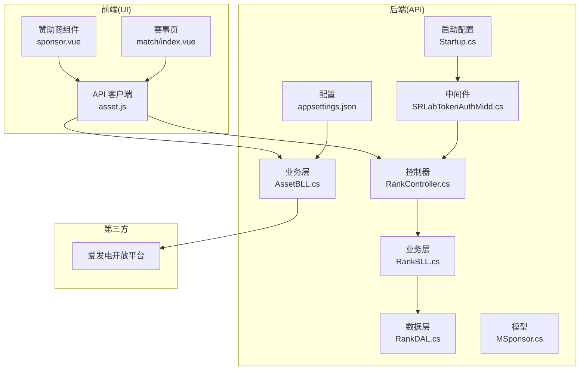
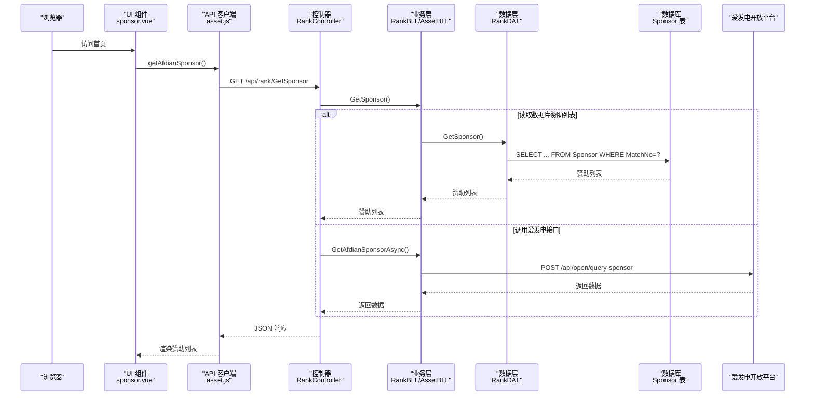
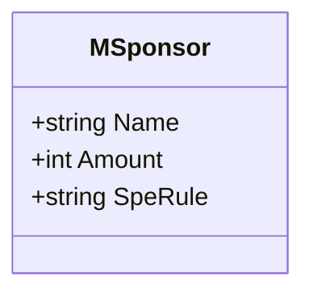
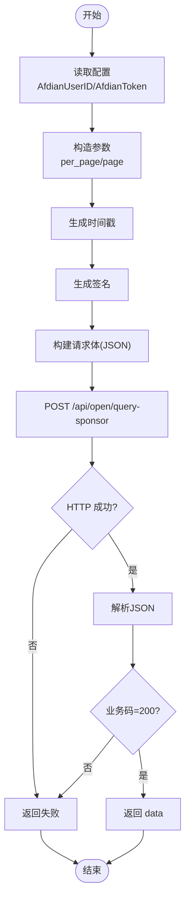
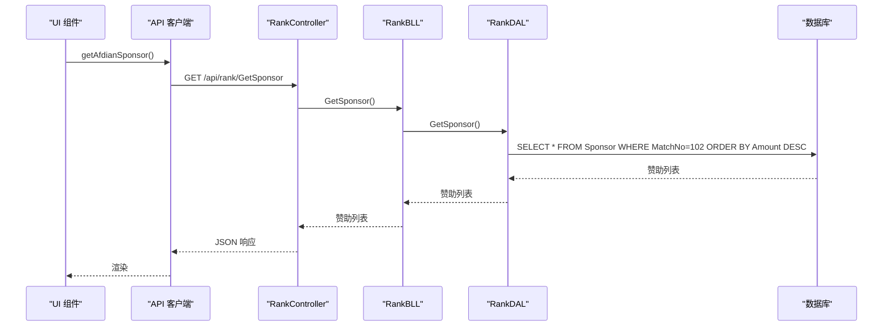
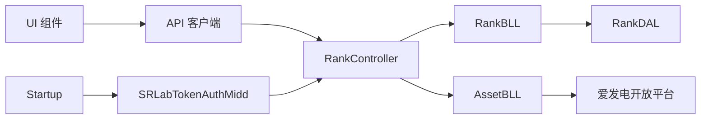

# 赞助商集成

<cite>
**本文引用的文件**
- [SpeedRunners.API/SpeedRunners.BLL/AssetBLL.cs](file://SpeedRunners.API/SpeedRunners.BLL/AssetBLL.cs)
- [SpeedRunners.API/SpeedRunners.BLL/RankBLL.cs](file://SpeedRunners.API/SpeedRunners.BLL/RankBLL.cs)
- [SpeedRunners.API/SpeedRunners.DAL/RankDAL.cs](file://SpeedRunners.API/SpeedRunners.DAL/RankDAL.cs)
- [SpeedRunners.API/SpeedRunners/Controllers/RankController.cs](file://SpeedRunners.API/SpeedRunners/Controllers/RankController.cs)
- [SpeedRunners.API/SpeedRunners.Model/Sponsor/MSponsor.cs](file://SpeedRunners.API/SpeedRunners.Model/Sponsor/MSponsor.cs)
- [SpeedRunners.API/SpeedRunners/Utils/SignatureHelper.cs](file://SpeedRunners.API/SpeedRunners.Utils/SignatureHelper.cs)
- [SpeedRunners.API/SpeedRunners/Startup.cs](file://SpeedRunners.API/SpeedRunners/Startup.cs)
- [SpeedRunners.API/SpeedRunners/Middleware/SRLabTokenAuthMidd.cs](file://SpeedRunners.API/SpeedRunners/Middleware/SRLabTokenAuthMidd.cs)
- [SpeedRunners.API/SpeedRunners/appsettings.json](file://SpeedRunners.API/SpeedRunners/appsettings.json)
- [SpeedRunners.UI/src/views/index/sponsor.vue](file://SpeedRunners.UI/src/views/index/sponsor.vue)
- [SpeedRunners.UI/src/api/asset.js](file://SpeedRunners.UI/src/api/asset.js)
- [SpeedRunners.UI/src/views/match/index.vue](file://SpeedRunners.UI/src/views/match/index.vue)
- [SpeedRunners.Scheduler/Task.cs](file://SpeedRunners.Scheduler/Task.cs)
- [mysql-dump/tmdsr.sql](file://mysql-dump/tmdsr.sql)
</cite>

## 目录
1. [简介](#简介)
2. [项目结构](#项目结构)
3. [核心组件](#核心组件)
4. [架构总览](#架构总览)
5. [组件详解](#组件详解)
6. [依赖关系分析](#依赖关系分析)
7. [性能与可靠性](#性能与可靠性)
8. [故障排查指南](#故障排查指南)
9. [结论](#结论)
10. [附录](#附录)

## 简介
本技术文档围绕“赞助商集成”主题，系统阐述爱发电（Afdian）赞助平台的对接方案，涵盖 API 调用流程、数据同步与状态管理、MSponsor 数据模型设计、接口实现原理（认证机制、签名生成、错误处理）、赞助商展示（排行榜、统计与可视化），以及支付安全、数据隐私与合规性建议。文档同时给出关键调用序列图与类图，帮助读者快速理解端到端实现。

## 项目结构
后端采用三层架构（Controller-BLL-DAL），前端通过 Vue 组件与 API 交互；定时任务模块负责周期性数据维护。赞助商相关能力主要分布在以下位置：
- 后端
  - 控制器：提供对外接口
  - 业务层：封装业务逻辑与第三方调用
  - 数据层：数据库访问与查询
  - 工具：签名生成、中间件、启动配置
- 前端
  - 视图组件：赞助商展示与赞助页面
  - API 封装：统一请求入口

图表来源
- [SpeedRunners.UI/src/views/index/sponsor.vue](file://SpeedRunners.UI/src/views/index/sponsor.vue#L1-L109)
- [SpeedRunners.UI/src/api/asset.js](file://SpeedRunners.UI/src/api/asset.js#L1-L54)
- [SpeedRunners.API/SpeedRunners/Controllers/RankController.cs](file://SpeedRunners.API/SpeedRunners/Controllers/RankController.cs#L1-L48)
- [SpeedRunners.API/SpeedRunners.BLL/RankBLL.cs](file://SpeedRunners.API/SpeedRunners.BLL/RankBLL.cs#L1-L210)
- [SpeedRunners.API/SpeedRunners.BLL/AssetBLL.cs](file://SpeedRunners.API/SpeedRunners.BLL/AssetBLL.cs#L1-L203)
- [SpeedRunners.API/SpeedRunners.DAL/RankDAL.cs](file://SpeedRunners.API/SpeedRunners.DAL/RankDAL.cs#L1-L175)
- [SpeedRunners.API/SpeedRunners/Middleware/SRLabTokenAuthMidd.cs](file://SpeedRunners.API/SpeedRunners/Middleware/SRLabTokenAuthMidd.cs#L1-L123)
- [SpeedRunners.API/SpeedRunners/Startup.cs](file://SpeedRunners.API/SpeedRunners/Startup.cs#L1-L87)
- [SpeedRunners.API/SpeedRunners/appsettings.json](file://SpeedRunners.API/SpeedRunners/appsettings.json#L1-L20)

章节来源
- [SpeedRunners.API/SpeedRunners/Controllers/RankController.cs](file://SpeedRunners.API/SpeedRunners/Controllers/RankController.cs#L1-L48)
- [SpeedRunners.API/SpeedRunners.BLL/RankBLL.cs](file://SpeedRunners.API/SpeedRunners.BLL/RankBLL.cs#L1-L210)
- [SpeedRunners.API/SpeedRunners.BLL/AssetBLL.cs](file://SpeedRunners.API/SpeedRunners.BLL/AssetBLL.cs#L1-L203)
- [SpeedRunners.API/SpeedRunners.DAL/RankDAL.cs](file://SpeedRunners.API/SpeedRunners.DAL/RankDAL.cs#L1-L175)
- [SpeedRunners.API/SpeedRunners/Middleware/SRLabTokenAuthMidd.cs](file://SpeedRunners.API/SpeedRunners/Middleware/SRLabTokenAuthMidd.cs#L1-L123)
- [SpeedRunners.API/SpeedRunners/Startup.cs](file://SpeedRunners.API/SpeedRunners/Startup.cs#L1-L87)
- [SpeedRunners.API/SpeedRunners/appsettings.json](file://SpeedRunners.API/SpeedRunners/appsettings.json#L1-L20)
- [SpeedRunners.UI/src/views/index/sponsor.vue](file://SpeedRunners.UI/src/views/index/sponsor.vue#L1-L109)
- [SpeedRunners.UI/src/api/asset.js](file://SpeedRunners.UI/src/api/asset.js#L1-L54)
- [SpeedRunners.UI/src/views/match/index.vue](file://SpeedRunners.UI/src/views/match/index.vue#L94-L129)
- [mysql-dump/tmdsr.sql](file://mysql-dump/tmdsr.sql#L521-L570)

## 核心组件
- MSponsor 数据模型：承载赞助者名称、赞助金额、特殊规则等字段，用于前后端传输与数据库持久化。
- 赞助信息获取接口：后端通过 AssetBLL 调用爱发电开放 API，构造签名参数并解析响应。
- 赞助商展示接口：RankController 提供 GetSponsor，RankBLL/RankDAL 查询数据库中指定赛事编号的赞助列表。
- 前端展示组件：UI 展示赞助者头像、累计金额与链接入口，并在赛事页以表格形式呈现赞助清单。

章节来源
- [SpeedRunners.API/SpeedRunners.Model/Sponsor/MSponsor.cs](file://SpeedRunners.API/SpeedRunners.Model/Sponsor/MSponsor.cs#L1-L13)
- [SpeedRunners.API/SpeedRunners.BLL/AssetBLL.cs](file://SpeedRunners.API/SpeedRunners.BLL/AssetBLL.cs#L162-L200)
- [SpeedRunners.API/SpeedRunners.BLL/RankBLL.cs](file://SpeedRunners.API/SpeedRunners.BLL/RankBLL.cs#L201-L207)
- [SpeedRunners.API/SpeedRunners.DAL/RankDAL.cs](file://SpeedRunners.API/SpeedRunners.DAL/RankDAL.cs#L169-L172)
- [SpeedRunners.API/SpeedRunners/Controllers/RankController.cs](file://SpeedRunners.API/SpeedRunners/Controllers/RankController.cs#L42-L43)
- [SpeedRunners.UI/src/views/index/sponsor.vue](file://SpeedRunners.UI/src/views/index/sponsor.vue#L1-L109)
- [SpeedRunners.UI/src/views/match/index.vue](file://SpeedRunners.UI/src/views/match/index.vue#L94-L129)

## 架构总览
下图展示了从浏览器到后端控制器、业务层、数据层，再到第三方平台的完整调用链路，以及前端组件如何消费后端接口。

图表来源
- [SpeedRunners.UI/src/views/index/sponsor.vue](file://SpeedRunners.UI/src/views/index/sponsor.vue#L62-L68)
- [SpeedRunners.UI/src/api/asset.js](file://SpeedRunners.UI/src/api/asset.js#L49-L54)
- [SpeedRunners.API/SpeedRunners/Controllers/RankController.cs](file://SpeedRunners.API/SpeedRunners/Controllers/RankController.cs#L42-L43)
- [SpeedRunners.API/SpeedRunners.BLL/RankBLL.cs](file://SpeedRunners.API/SpeedRunners.BLL/RankBLL.cs#L201-L207)
- [SpeedRunners.API/SpeedRunners.BLL/AssetBLL.cs](file://SpeedRunners.API/SpeedRunners.BLL/AssetBLL.cs#L162-L200)
- [SpeedRunners.API/SpeedRunners.DAL/RankDAL.cs](file://SpeedRunners.API/SpeedRunners.DAL/RankDAL.cs#L169-L172)
- [mysql-dump/tmdsr.sql](file://mysql-dump/tmdsr.sql#L521-L570)

## 组件详解

### 1) MSponsor 数据模型
- 字段
  - Name：赞助者名称
  - Amount：赞助金额（单位：分或元，视后端约定）
  - SpeRule：特殊规则描述
- 设计要点
  - 字段简洁，便于前后端传输与数据库存储
  - 与数据库 Sponsor 表结构对应，便于直接映射

图表来源
- [SpeedRunners.API/SpeedRunners.Model/Sponsor/MSponsor.cs](file://SpeedRunners.API/SpeedRunners.Model/Sponsor/MSponsor.cs#L1-L13)

章节来源
- [SpeedRunners.API/SpeedRunners.Model/Sponsor/MSponsor.cs](file://SpeedRunners.API/SpeedRunners.Model/Sponsor/MSponsor.cs#L1-L13)
- [mysql-dump/tmdsr.sql](file://mysql-dump/tmdsr.sql#L521-L570)

### 2) 赞助信息获取接口实现（爱发电）
- 认证与签名
  - 通过配置项读取用户标识与令牌
  - 生成签名：对特定字符串拼接 token、参数、时间戳、用户标识进行哈希计算
- 请求构建
  - 组装 JSON 参数（如 per_page、page）
  - 设置时间戳
  - 发送 POST 请求至爱发电开放接口
- 响应解析
  - 校验 HTTP 状态码
  - 解析 JSON，判断业务状态码，成功时返回 data，失败时返回错误信息

图表来源
- [SpeedRunners.API/SpeedRunners.BLL/AssetBLL.cs](file://SpeedRunners.API/SpeedRunners.BLL/AssetBLL.cs#L162-L200)
- [SpeedRunners.API/SpeedRunners/Utils/SignatureHelper.cs](file://SpeedRunners.API/SpeedRunners.Utils/SignatureHelper.cs#L1-L28)
- [SpeedRunners.API/SpeedRunners/appsettings.json](file://SpeedRunners.API/SpeedRunners/appsettings.json#L18-L19)

章节来源
- [SpeedRunners.API/SpeedRunners.BLL/AssetBLL.cs](file://SpeedRunners.API/SpeedRunners.BLL/AssetBLL.cs#L162-L200)
- [SpeedRunners.API/SpeedRunners/Utils/SignatureHelper.cs](file://SpeedRunners.API/SpeedRunners.Utils/SignatureHelper.cs#L1-L28)
- [SpeedRunners.API/SpeedRunners/appsettings.json](file://SpeedRunners.API/SpeedRunners/appsettings.json#L18-L19)

### 3) 赞助商展示接口（数据库模式）
- 接口路径：GET /api/rank/GetSponsor
- 业务逻辑
  - 控制器调用业务层方法
  - 业务层委托数据层查询指定赛事编号的赞助列表，按金额降序排列
- 前端消费
  - UI 组件在挂载时发起请求，渲染赞助者头像、累计金额与跳转链接

图表来源
- [SpeedRunners.API/SpeedRunners/Controllers/RankController.cs](file://SpeedRunners.API/SpeedRunners/Controllers/RankController.cs#L42-L43)
- [SpeedRunners.API/SpeedRunners.BLL/RankBLL.cs](file://SpeedRunners.API/SpeedRunners.BLL/RankBLL.cs#L201-L207)
- [SpeedRunners.API/SpeedRunners.DAL/RankDAL.cs](file://SpeedRunners.API/SpeedRunners.DAL/RankDAL.cs#L169-L172)
- [SpeedRunners.UI/src/views/index/sponsor.vue](file://SpeedRunners.UI/src/views/index/sponsor.vue#L62-L68)

章节来源
- [SpeedRunners.API/SpeedRunners/Controllers/RankController.cs](file://SpeedRunners.API/SpeedRunners/Controllers/RankController.cs#L42-L43)
- [SpeedRunners.API/SpeedRunners.BLL/RankBLL.cs](file://SpeedRunners.API/SpeedRunners.BLL/RankBLL.cs#L201-L207)
- [SpeedRunners.API/SpeedRunners.DAL/RankDAL.cs](file://SpeedRunners.API/SpeedRunners.DAL/RankDAL.cs#L169-L172)
- [SpeedRunners.UI/src/views/index/sponsor.vue](file://SpeedRunners.UI/src/views/index/sponsor.vue#L62-L68)

### 4) 前端展示组件
- 赞助商组件（首页）
  - 挂载时调用 getAfdianSponsor，设置总数与列表
  - 使用 Tooltip 展示赞助者昵称，Chip 显示累计金额
  - 提供爱发电与 PayPal 的外部链接
- 赛事页赞助表格
  - 展示赞助者名称与金额，配合说明文案

章节来源
- [SpeedRunners.UI/src/views/index/sponsor.vue](file://SpeedRunners.UI/src/views/index/sponsor.vue#L1-L109)
- [SpeedRunners.UI/src/views/match/index.vue](file://SpeedRunners.UI/src/views/match/index.vue#L94-L129)
- [SpeedRunners.UI/src/api/asset.js](file://SpeedRunners.UI/src/api/asset.js#L49-L54)

### 5) 数据库与定时任务
- 数据库表结构
  - Sponsor 表包含 Name、Amount、MatchNo、SpeRule 等字段，MatchNo 作为赛事编号索引
- 定时任务
  - 调度器负责周期性更新天梯分、日志与玩家状态，保障数据新鲜度
  - 与赞助数据无直接耦合，但为整体数据健康提供支撑

章节来源
- [mysql-dump/tmdsr.sql](file://mysql-dump/tmdsr.sql#L521-L570)
- [SpeedRunners.Scheduler/Task.cs](file://SpeedRunners.Scheduler/Task.cs#L1-L349)

## 依赖关系分析
- 控制器依赖业务层，业务层依赖数据层与第三方 SDK
- 中间件在路由前执行，负责 Token 认证与上下文注入
- 前端通过统一 API 客户端访问后端接口

图表来源
- [SpeedRunners.API/SpeedRunners/Controllers/RankController.cs](file://SpeedRunners.API/SpeedRunners/Controllers/RankController.cs#L1-L48)
- [SpeedRunners.API/SpeedRunners.BLL/RankBLL.cs](file://SpeedRunners.API/SpeedRunners.BLL/RankBLL.cs#L1-L210)
- [SpeedRunners.API/SpeedRunners.BLL/AssetBLL.cs](file://SpeedRunners.API/SpeedRunners.BLL/AssetBLL.cs#L1-L203)
- [SpeedRunners.API/SpeedRunners.DAL/RankDAL.cs](file://SpeedRunners.API/SpeedRunners.DAL/RankDAL.cs#L1-L175)
- [SpeedRunners.API/SpeedRunners/Middleware/SRLabTokenAuthMidd.cs](file://SpeedRunners.API/SpeedRunners/Middleware/SRLabTokenAuthMidd.cs#L1-L123)
- [SpeedRunners.API/SpeedRunners/Startup.cs](file://SpeedRunners.API/SpeedRunners/Startup.cs#L1-L87)

章节来源
- [SpeedRunners.API/SpeedRunners/Controllers/RankController.cs](file://SpeedRunners.API/SpeedRunners/Controllers/RankController.cs#L1-L48)
- [SpeedRunners.API/SpeedRunners.BLL/RankBLL.cs](file://SpeedRunners.API/SpeedRunners.BLL/RankBLL.cs#L1-L210)
- [SpeedRunners.API/SpeedRunners.BLL/AssetBLL.cs](file://SpeedRunners.API/SpeedRunners.BLL/AssetBLL.cs#L1-L203)
- [SpeedRunners.API/SpeedRunners.DAL/RankDAL.cs](file://SpeedRunners.API/SpeedRunners.DAL/RankDAL.cs#L1-L175)
- [SpeedRunners.API/SpeedRunners/Middleware/SRLabTokenAuthMidd.cs](file://SpeedRunners.API/SpeedRunners/Middleware/SRLabTokenAuthMidd.cs#L1-L123)
- [SpeedRunners.API/SpeedRunners/Startup.cs](file://SpeedRunners.API/SpeedRunners/Startup.cs#L1-L87)

## 性能与可靠性
- 爱发电接口调用
  - 当前实现为一次性请求，未内置重试与缓存策略
  - 建议：增加指数退避重试、响应缓存（如 Redis）与熔断保护
- 前端渲染
  - 使用 Tooltip 与 Chip 渲染赞助者信息，注意大数据量时的虚拟滚动优化
- 认证与安全
  - 通过中间件拦截未授权访问，Token 注入到上下文
  - 建议：限制请求频率、启用 HTTPS、对敏感配置项加密存储

[本节为通用建议，无需列出章节来源]

## 故障排查指南
- 爱发电接口失败
  - 检查配置项是否正确（AfdianUserID、AfdianToken）
  - 校验签名生成逻辑与时间戳
  - 关注 HTTP 状态码与业务码
- 前端无法显示赞助列表
  - 确认接口返回结构与前端字段映射一致
  - 检查赛事编号是否匹配
- 认证失败
  - 确认请求头中携带正确的 srlab-token
  - 检查中间件是否生效与用户信息注入

章节来源
- [SpeedRunners.API/SpeedRunners.BLL/AssetBLL.cs](file://SpeedRunners.API/SpeedRunners.BLL/AssetBLL.cs#L162-L200)
- [SpeedRunners.API/SpeedRunners/Utils/SignatureHelper.cs](file://SpeedRunners.API/SpeedRunners.Utils/SignatureHelper.cs#L1-L28)
- [SpeedRunners.API/SpeedRunners/appsettings.json](file://SpeedRunners.API/SpeedRunners/appsettings.json#L18-L19)
- [SpeedRunners.API/SpeedRunners/Middleware/SRLabTokenAuthMidd.cs](file://SpeedRunners.API/SpeedRunners/Middleware/SRLabTokenAuthMidd.cs#L54-L101)
- [SpeedRunners.UI/src/views/index/sponsor.vue](file://SpeedRunners.UI/src/views/index/sponsor.vue#L62-L68)

## 结论
本集成方案以清晰的分层架构实现了爱发电赞助数据的获取与展示，结合数据库中的赞助列表满足了不同场景下的需求。建议后续完善错误重试、缓存与安全加固，以提升稳定性与用户体验。

[本节为总结性内容，无需列出章节来源]

## 附录

### A. 支付安全与合规建议
- 仅通过官方开放平台接口获取赞助数据，避免在应用内直接处理支付凭证
- 对敏感配置（如 AfdianToken）进行加密存储与最小权限访问
- 前端不暴露任何支付凭据，仅展示汇总信息与外部跳转链接
- 遵循数据最小化原则，不收集无关的个人身份信息

[本节为通用建议，无需列出章节来源]