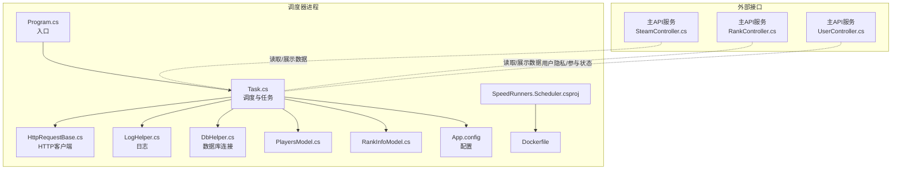
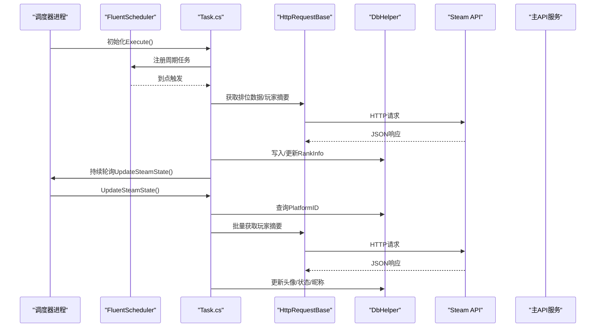
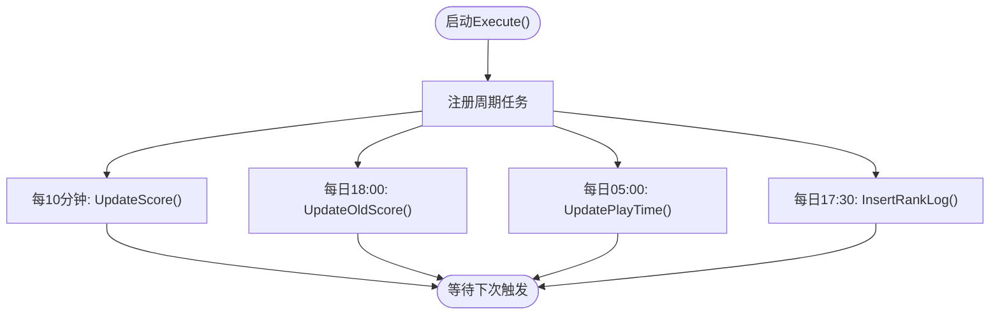
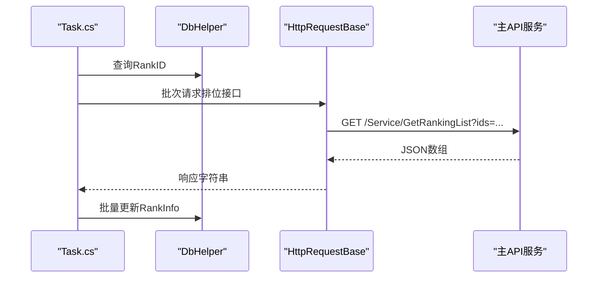
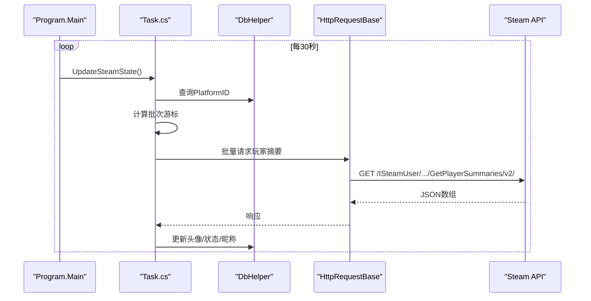
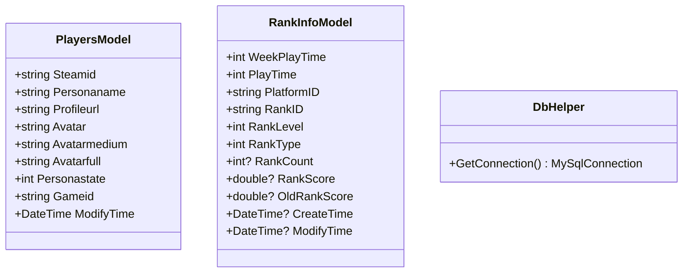
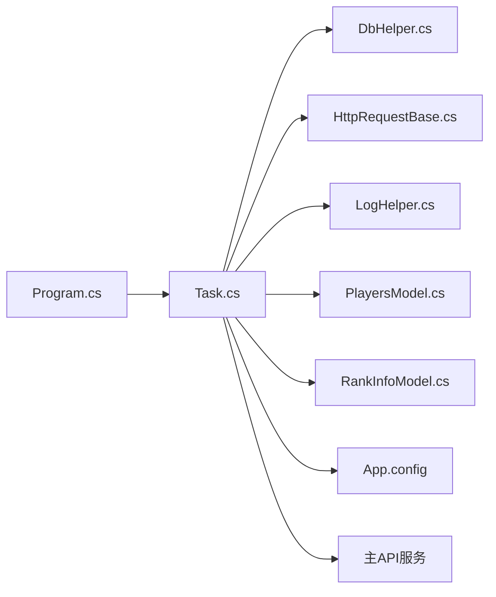

# 定时任务调度器

<cite>
**本文引用的文件**
- [Program.cs](file://SpeedRunners.Scheduler/Program.cs)
- [Task.cs](file://SpeedRunners.Scheduler/Task.cs)
- [DbHelper.cs](file://SpeedRunners.Scheduler/DbHelper.cs)
- [LogHelper.cs](file://SpeedRunners.Scheduler/LogHelper.cs)
- [HttpRequestBase.cs](file://SpeedRunners.Scheduler/HttpRequestBase.cs)
- [PlayersModel.cs](file://SpeedRunners.Scheduler/PlayersModel.cs)
- [RankInfoModel.cs](file://SpeedRunners.Scheduler/RankInfoModel.cs)
- [App.config](file://SpeedRunners.Scheduler/App.config)
- [SpeedRunners.Scheduler.csproj](file://SpeedRunners.Scheduler/SpeedRunners.Scheduler.csproj)
- [Dockerfile](file://SpeedRunners.Scheduler/Dockerfile)
- [SteamController.cs](file://SpeedRunners.API/SpeedRunners/Controllers/SteamController.cs)
- [RankController.cs](file://SpeedRunners.API/SpeedRunners/Controllers/RankController.cs)
- [UserController.cs](file://SpeedRunners.API/SpeedRunners/Controllers/UserController.cs)
</cite>

## 目录
1. [简介](#简介)
2. [项目结构](#项目结构)
3. [核心组件](#核心组件)
4. [架构总览](#架构总览)
5. [详细组件分析](#详细组件分析)
6. [依赖关系分析](#依赖关系分析)
7. [性能考量](#性能考量)
8. [故障排查指南](#故障排查指南)
9. [结论](#结论)
10. [附录](#附录)

## 简介
本文件面向运维与开发人员，系统化梳理 SpeedRunnersLab 定时任务调度器的设计与实现。该调度器基于 FluentScheduler 实现周期性任务编排，负责以下职责：
- 周期性抓取并更新 Steam 头像、状态、昵称等用户资料
- 周期性抓取 SpeedRunners 排位数据（天梯分、场次数、段位）
- 统计并落库“天梯分日志”
- 计算并更新玩家“总游戏时长”和“两周游戏时长”
- 提供日志记录与错误恢复能力
- 通过配置项灵活控制调度频率、并发批次与开关

调度器以独立可执行程序运行，支持容器化部署，并与主 API 服务共享数据库与部分数据模型。

## 项目结构
调度器位于 SpeedRunners.Scheduler 目录，核心文件包括：
- 入口程序：Program.cs
- 调度与业务逻辑：Task.cs
- 数据库连接：DbHelper.cs
- 日志系统：LogHelper.cs
- HTTP 请求封装：HttpRequestBase.cs
- 数据模型：PlayersModel.cs、RankInfoModel.cs
- 配置：App.config
- 项目与容器化：SpeedRunners.Scheduler.csproj、Dockerfile

图表来源
- [Program.cs](file://SpeedRunners.Scheduler/Program.cs#L1-L21)
- [Task.cs](file://SpeedRunners.Scheduler/Task.cs#L1-L349)
- [DbHelper.cs](file://SpeedRunners.Scheduler/DbHelper.cs#L1-L33)
- [LogHelper.cs](file://SpeedRunners.Scheduler/LogHelper.cs#L1-L652)
- [HttpRequestBase.cs](file://SpeedRunners.Scheduler/HttpRequestBase.cs#L1-L43)
- [PlayersModel.cs](file://SpeedRunners.Scheduler/PlayersModel.cs#L1-L20)
- [RankInfoModel.cs](file://SpeedRunners.Scheduler/RankInfoModel.cs#L1-L161)
- [App.config](file://SpeedRunners.Scheduler/App.config#L1-L14)
- [SpeedRunners.Scheduler.csproj](file://SpeedRunners.Scheduler/SpeedRunners.Scheduler.csproj#L1-L29)
- [Dockerfile](file://SpeedRunners.Scheduler/Dockerfile#L1-L23)
- [SteamController.cs](file://SpeedRunners.API/SpeedRunners/Controllers/SteamController.cs#L1-L28)
- [RankController.cs](file://SpeedRunners.API/SpeedRunners/Controllers/RankController.cs#L1-L48)
- [UserController.cs](file://SpeedRunners.API/SpeedRunners/Controllers/UserController.cs#L1-L58)

章节来源
- [Program.cs](file://SpeedRunners.Scheduler/Program.cs#L1-L21)
- [SpeedRunners.Scheduler.csproj](file://SpeedRunners.Scheduler/SpeedRunners.Scheduler.csproj#L1-L29)

## 核心组件
- 调度器入口与主循环
  - 启动后初始化任务计划，随后进入无限循环持续执行 Steam 状态更新
- 任务注册与执行
  - 使用 FluentScheduler 注册多个周期任务：每 10 分钟更新一次天梯分；每日固定时间更新旧分、在线时长、插入日志
- 数据访问层
  - 通过 DbHelper 统一获取 MySQL 连接，使用 Dapper 执行 SQL
- HTTP 与外部 API
  - 通过 HttpRequestBase 创建带超时与代理的 HttpClient，封装异步 GET 方法
  - 调用 Steam Web API 获取玩家摘要、最近游玩与拥有游戏列表
  - 调用主 API 服务提供的公开接口获取排位数据
- 日志系统
  - 使用 NLog 记录 Info/Warn/Error/Fatal/Debug/Trace 等级别日志，同时保留文本文件日志
- 数据模型
  - PlayersModel：Steam 玩家资料字段
  - RankInfoModel：天梯分、场次、段位、头像、状态等

章节来源
- [Task.cs](file://SpeedRunners.Scheduler/Task.cs#L26-L66)
- [Task.cs](file://SpeedRunners.Scheduler/Task.cs#L154-L171)
- [Task.cs](file://SpeedRunners.Scheduler/Task.cs#L225-L246)
- [DbHelper.cs](file://SpeedRunners.Scheduler/DbHelper.cs#L17-L28)
- [HttpRequestBase.cs](file://SpeedRunners.Scheduler/HttpRequestBase.cs#L9-L42)
- [LogHelper.cs](file://SpeedRunners.Scheduler/LogHelper.cs#L10-L651)
- [PlayersModel.cs](file://SpeedRunners.Scheduler/PlayersModel.cs#L7-L19)
- [RankInfoModel.cs](file://SpeedRunners.Scheduler/RankInfoModel.cs#L7-L160)

## 架构总览
调度器采用“单进程 + 轻量调度 + 外部 API 同步”的架构：
- 单进程内同时承载周期任务与持续轮询的 Steam 状态更新
- 通过配置项控制调度频率、并发批次与开关
- 与主 API 服务通过 HTTP 接口交互，不直接依赖内部业务模块

图表来源
- [Program.cs](file://SpeedRunners.Scheduler/Program.cs#L7-L18)
- [Task.cs](file://SpeedRunners.Scheduler/Task.cs#L26-L66)
- [Task.cs](file://SpeedRunners.Scheduler/Task.cs#L225-L246)
- [Task.cs](file://SpeedRunners.Scheduler/Task.cs#L248-L293)
- [HttpRequestBase.cs](file://SpeedRunners.Scheduler/HttpRequestBase.cs#L25-L39)
- [DbHelper.cs](file://SpeedRunners.Scheduler/DbHelper.cs#L23-L28)

## 详细组件分析

### 调度与任务执行（FluentScheduler）
- 任务注册
  - 每 10 分钟：更新天梯分
  - 每日 18:00：更新旧天梯分
  - 每日 05:00：更新总/两周游戏时长
  - 每日 17:30：插入天梯分日志
- 错误处理
  - 使用扩展 ScheduleEx 包裹任务，捕获异常并记录日志，避免中断调度器

图表来源
- [Task.cs](file://SpeedRunners.Scheduler/Task.cs#L34-L59)
- [Task.cs](file://SpeedRunners.Scheduler/Task.cs#L331-L347)

章节来源
- [Task.cs](file://SpeedRunners.Scheduler/Task.cs#L26-L66)
- [Task.cs](file://SpeedRunners.Scheduler/Task.cs#L331-L347)

### 天梯分更新流程
- 查询需要同步的 RankID 列表（排除隐私限制或非排位类型）
- 分批请求主 API 服务的排位接口（按配置的批次大小）
- 解析返回并批量更新 RankInfo 表

图表来源
- [Task.cs](file://SpeedRunners.Scheduler/Task.cs#L154-L171)
- [Task.cs](file://SpeedRunners.Scheduler/Task.cs#L173-L223)
- [RankController.cs](file://SpeedRunners.API/SpeedRunners/Controllers/RankController.cs#L16-L17)

章节来源
- [Task.cs](file://SpeedRunners.Scheduler/Task.cs#L154-L171)
- [Task.cs](file://SpeedRunners.Scheduler/Task.cs#L173-L223)
- [RankController.cs](file://SpeedRunners.API/SpeedRunners/Controllers/RankController.cs#L16-L17)

### Steam 状态与头像更新（持续轮询）
- 主循环每轮从数据库读取所有 PlatformID，按配置的分钟数切片，形成批次
- 每批次调用 Steam API 批量获取玩家摘要，解析并更新头像、状态、昵称等字段
- 支持“停止更新昵称”开关，避免覆盖用户自定义昵称

图表来源
- [Program.cs](file://SpeedRunners.Scheduler/Program.cs#L14-L17)
- [Task.cs](file://SpeedRunners.Scheduler/Task.cs#L225-L246)
- [Task.cs](file://SpeedRunners.Scheduler/Task.cs#L248-L293)
- [HttpRequestBase.cs](file://SpeedRunners.Scheduler/HttpRequestBase.cs#L25-L39)

章节来源
- [Program.cs](file://SpeedRunners.Scheduler/Program.cs#L14-L17)
- [Task.cs](file://SpeedRunners.Scheduler/Task.cs#L225-L246)
- [Task.cs](file://SpeedRunners.Scheduler/Task.cs#L248-L293)

### 数据模型与数据库操作
- PlayersModel：映射 Steam 玩家摘要字段（头像、状态、当前游戏等）
- RankInfoModel：映射天梯分相关字段（分数、场次、段位、头像、状态等）
- 数据库连接：统一从配置读取连接串，使用 Dapper 执行 SQL

图表来源
- [PlayersModel.cs](file://SpeedRunners.Scheduler/PlayersModel.cs#L7-L19)
- [RankInfoModel.cs](file://SpeedRunners.Scheduler/RankInfoModel.cs#L7-L160)
- [DbHelper.cs](file://SpeedRunners.Scheduler/DbHelper.cs#L17-L28)

章节来源
- [PlayersModel.cs](file://SpeedRunners.Scheduler/PlayersModel.cs#L7-L19)
- [RankInfoModel.cs](file://SpeedRunners.Scheduler/RankInfoModel.cs#L7-L160)
- [DbHelper.cs](file://SpeedRunners.Scheduler/DbHelper.cs#L17-L28)

### 日志与监控
- 日志组件
  - NLog 记录 Info/Warn/Error/Fatal/Debug/Trace 级别日志，自动附加模块名与异常
  - 文本文件日志（gb2312 编码），便于运维快速定位问题
- 监控指标
  - 控制台输出关键进度信息（如更新条数、时间戳）
  - 可结合外部日志收集系统统一采集

章节来源
- [LogHelper.cs](file://SpeedRunners.Scheduler/LogHelper.cs#L10-L651)
- [Task.cs](file://SpeedRunners.Scheduler/Task.cs#L68-L78)
- [Task.cs](file://SpeedRunners.Scheduler/Task.cs#L88-L89)
- [Task.cs](file://SpeedRunners.Scheduler/Task.cs#L142-L143)

### 配置与任务参数
- 关键配置项（App.config）
  - ConnectionString：数据库连接串
  - StopUpdateName：是否停止更新昵称（true/false）
  - MinutesNum：Steam 状态更新的切片时长（分钟）
  - SecondNum：HTTP 请求间隔（秒）
  - RunUpdateSteamInfo：是否启用 Steam 状态更新
  - ProxyAddress：HTTP 代理地址
  - ApiKey：Steam API Key
- 调度频率
  - 每 10 分钟：UpdateScore()
  - 每日 05:00：UpdatePlayTime()
  - 每日 17:30：InsertRankLog()
  - 每日 18:00：UpdateOldScore()

章节来源
- [App.config](file://SpeedRunners.Scheduler/App.config#L3-L13)
- [Task.cs](file://SpeedRunners.Scheduler/Task.cs#L19-L23)
- [Task.cs](file://SpeedRunners.Scheduler/Task.cs#L34-L59)

## 依赖关系分析
- 外部依赖
  - FluentScheduler：任务调度
  - Dapper：轻量 ORM
  - MySqlConnector：MySQL 连接
  - Newtonsoft.Json：JSON 解析
  - NLog：日志
  - System.Configuration.ConfigurationManager：读取 App.config
- 内部依赖
  - Program 依赖 Task
  - Task 依赖 DbHelper、HttpRequestBase、LogHelper、模型类
  - 与主 API 服务通过 HTTP 接口交互

图表来源
- [Program.cs](file://SpeedRunners.Scheduler/Program.cs#L7-L18)
- [Task.cs](file://SpeedRunners.Scheduler/Task.cs#L1-L349)
- [DbHelper.cs](file://SpeedRunners.Scheduler/DbHelper.cs#L1-L33)
- [HttpRequestBase.cs](file://SpeedRunners.Scheduler/HttpRequestBase.cs#L1-L43)
- [LogHelper.cs](file://SpeedRunners.Scheduler/LogHelper.cs#L1-L652)
- [PlayersModel.cs](file://SpeedRunners.Scheduler/PlayersModel.cs#L1-L20)
- [RankInfoModel.cs](file://SpeedRunners.Scheduler/RankInfoModel.cs#L1-L161)
- [App.config](file://SpeedRunners.Scheduler/App.config#L1-L14)

章节来源
- [SpeedRunners.Scheduler.csproj](file://SpeedRunners.Scheduler/SpeedRunners.Scheduler.csproj#L10-L17)

## 性能考量
- HTTP 请求节流
  - 天梯分请求按批次延迟（由配置项控制），避免触发限流
  - Steam 玩家摘要请求按批次延迟，降低 API 压力
- 数据库写入
  - 使用 Dapper 批量参数化更新，减少往返次数
- 并发与线程
  - 调度任务与持续轮询在单线程主循环中执行，避免多线程竞争
  - 如需高吞吐，建议拆分为独立线程池或引入更高级调度框架
- 资源复用
  - HttpClient 通过工厂方法创建，建议改为全局单例并配合超时与重试策略

[本节为通用性能建议，不直接分析具体文件]

## 故障排查指南
- 常见问题与定位
  - 天梯分未更新：检查排位接口可达性、请求参数与返回格式；确认隐私设置允许数据请求
  - Steam 头像/状态未更新：检查 ApiKey 与代理配置；查看文本日志中的异常信息
  - 数据库连接失败：核对 ConnectionString；确认数据库服务可用
- 日志定位
  - NLog 文件与文本日志同时存在，优先查看 NLog 的 Info/Warn/Error 级别
  - 控制台输出包含关键进度信息，便于快速判断执行阶段
- 配置校验
  - 确认 MinutesNum、SecondNum、RunUpdateSteamInfo、StopUpdateName 等配置项符合预期
- 外部接口验证
  - 使用主 API 服务的公开接口（如排位列表、在线人数）进行连通性测试

章节来源
- [LogHelper.cs](file://SpeedRunners.Scheduler/LogHelper.cs#L10-L651)
- [Task.cs](file://SpeedRunners.Scheduler/Task.cs#L212-L213)
- [Task.cs](file://SpeedRunners.Scheduler/Task.cs#L318-L320)
- [App.config](file://SpeedRunners.Scheduler/App.config#L3-L13)

## 结论
该调度器以轻量、稳定为目标，通过 FluentScheduler 实现多任务编排，结合 Dapper 与 NLog，完成 Steam 与主 API 服务的数据同步。其配置化设计便于运维按环境调整执行节奏与行为。建议后续在高负载场景下引入更健壮的调度与并发模型，并完善健康检查与告警机制。

[本节为总结性内容，不直接分析具体文件]

## 附录

### 任务配置清单
- 数据库连接串：用于连接主数据库
- 停止更新昵称：true/false，控制是否覆盖用户自定义昵称
- 轮询切片时长（分钟）：决定每轮处理的平台 ID 数量
- 请求间隔（秒）：各批次间延时
- 是否启用 Steam 更新：总开关
- 代理地址：HTTP 代理
- Steam API Key：调用 Steam API 必需

章节来源
- [App.config](file://SpeedRunners.Scheduler/App.config#L3-L13)

### 与主 API 服务的数据交互
- 排位数据
  - 通过主 API 的公开接口获取排位列表，解析后批量更新 RankInfo
- 玩家搜索与在线统计
  - 通过 SteamController 与 RankController 的公开接口进行辅助验证与展示
- 用户隐私设置
  - 通过 UserController 的隐私设置接口影响数据可见性（如 RequestRankData）

章节来源
- [RankController.cs](file://SpeedRunners.API/SpeedRunners/Controllers/RankController.cs#L16-L17)
- [SteamController.cs](file://SpeedRunners.API/SpeedRunners/Controllers/SteamController.cs#L24-L25)
- [UserController.cs](file://SpeedRunners.API/SpeedRunners/Controllers/UserController.cs#L18-L20)