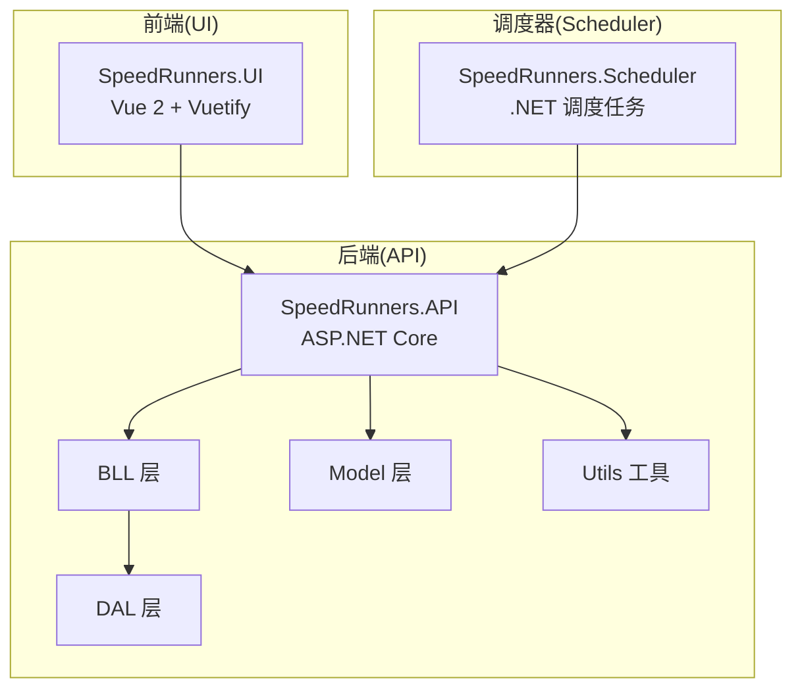
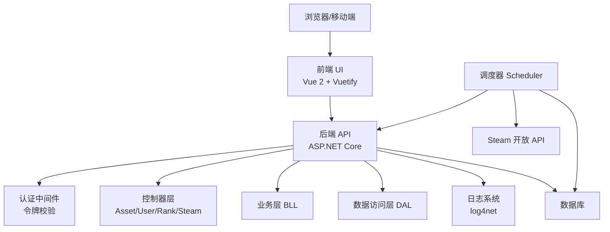
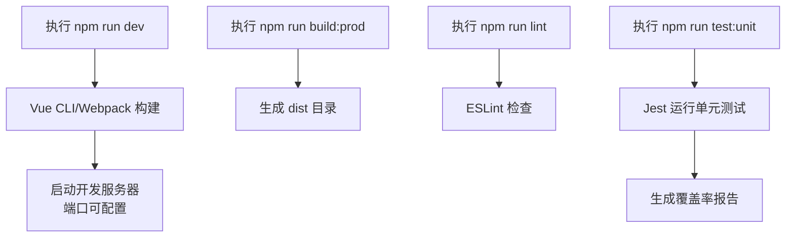
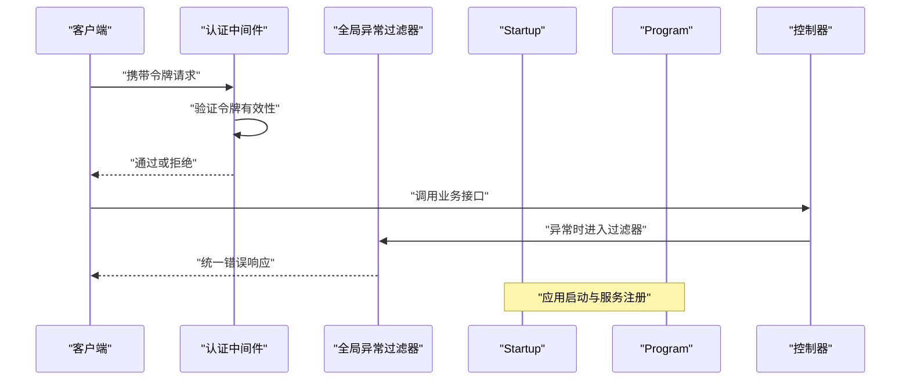
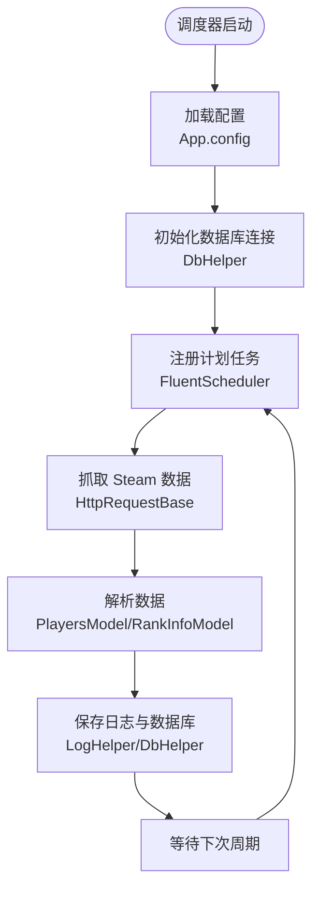
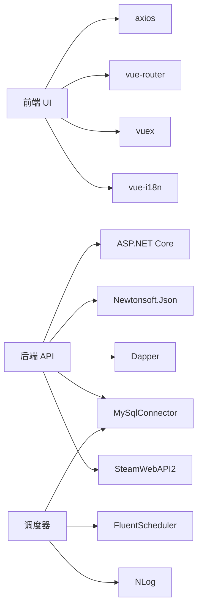

# 开发指南

<cite>
**本文引用的文件**
- [README.md](file://README.md)
- [package.json](file://SpeedRunners.UI/package.json)
- [.eslintrc.js](file://SpeedRunners.UI/.eslintrc.js)
- [babel.config.js](file://SpeedRunners.UI/babel.config.js)
- [vue.config.js](file://SpeedRunners.UI/vue.config.js)
- [jest.config.js](file://SpeedRunners.UI/jest.config.js)
- [postcss.config.js](file://SpeedRunners.UI/postcss.config.js)
- [Dockerfile（API）](file://SpeedRunners.API/Dockerfile)
- [Dockerfile（UI）](file://SpeedRunners.UI/Dockerfile)
- [docker-compose.yml](file://docker-compose.yml)
- [appsettings.Development.json（API）](file://SpeedRunners.API/SpeedRunners/appsettings.Development.json)
- [appsettings.Production.json（API）](file://SpeedRunners.API/SpeedRunners/appsettings.Production.json)
- [Startup.cs（API）](file://SpeedRunners.API/SpeedRunners/Startup.cs)
- [Program.cs（API）](file://SpeedRunners.API/SpeedRunners/Program.cs)
- [SRLabTokenAuthMidd.cs（API 中间件）](file://SpeedRunners.API/SpeedRunners/Middleware/SRLabTokenAuthMidd.cs)
- [GlobalExceptionsFilter.cs（API 过滤器）](file://SpeedRunners.API/SpeedRunners/Filter/GlobalExceptionsFilter.cs)
- [LocaleHeaderRequestCultureProvider.cs（API 本地化）](file://SpeedRunners.API/SpeedRunners/Service/LocaleHeaderRequestCultureProvider.cs)
- [AssetController.cs（API 控制器）](file://SpeedRunners.API/SpeedRunners/Controllers/AssetController.cs)
- [UserController.cs（API 控制器）](file://SpeedRunners.API/SpeedRunners/Controllers/UserController.cs)
- [RankController.cs（API 控制器）](file://SpeedRunners.API/SpeedRunners/Controllers/RankController.cs)
- [SteamController.cs（API 控制器）](file://SpeedRunners.API/SpeedRunners/Controllers/SteamController.cs)
- [BaseController.cs（API 控制器基类）](file://SpeedRunners.API/SpeedRunners/Controllers/BaseController.cs)
- [SpeedRunners.BLL.csproj](file://SpeedRunners.API/SpeedRunners.BLL/SpeedRunners.BLL.csproj)
- [SpeedRunners.DAL.csproj](file://SpeedRunners.API/SpeedRunners.DAL/SpeedRunners.DAL.csproj)
- [SpeedRunners.Model.csproj](file://SpeedRunners.API/SpeedRunners.Model/SpeedRunners.Model.csproj)
- [SpeedRunners.Utils.csproj](file://SpeedRunners.API/SpeedRunners.Utils/SpeedRunners.Utils.csproj)
- [SpeedRunners.csproj（API）](file://SpeedRunners.API/SpeedRunners/SpeedRunners.csproj)
- [SpeedRunners.Scheduler.csproj](file://SpeedRunners.Scheduler/SpeedRunners.Scheduler.csproj)
- [log4net.config（API）](file://SpeedRunners.API/SpeedRunners/log4net.config)
- [log.txt（调度器）](file://SpeedRunners.Scheduler/bin/Debug/netcoreapp3.1/log.txt)
- [DbHelper.cs（调度器）](file://SpeedRunners.Scheduler/DbHelper.cs)
- [Task.cs（调度器）](file://SpeedRunners.Scheduler/Task.cs)
- [PlayersModel.cs（调度器模型）](file://SpeedRunners.Scheduler/PlayersModel.cs)
- [RankInfoModel.cs（调度器模型）](file://SpeedRunners.Scheduler/RankInfoModel.cs)
- [HttpRequestBase.cs（调度器）](file://SpeedRunners.Scheduler/HttpRequestBase.cs)
- [LogHelper.cs（调度器）](file://SpeedRunners.Scheduler/LogHelper.cs)
- [App.config（调度器）](file://SpeedRunners.Scheduler/App.config)
</cite>

## 目录
1. [简介](#简介)
2. [项目结构](#项目结构)
3. [核心组件](#核心组件)
4. [架构总览](#架构总览)
5. [详细组件分析](#详细组件分析)
6. [依赖关系分析](#依赖关系分析)
7. [性能考虑](#性能考虑)
8. [故障排查指南](#故障排查指南)
9. [结论](#结论)
10. [附录](#附录)

## 简介
本开发指南面向 SpeedRunnersLab 团队，目标是帮助新成员快速搭建开发与运行环境，统一代码规范与质量标准，明确测试与调试流程，并提供版本控制、分支管理与发布策略建议。项目采用前后端分离架构：前端基于 Vue 2 + Vuetify，后端基于 ASP.NET Core，结合 Steam 开放 API 提供数据支持。

## 项目结构
项目由三个主要部分组成：
- SpeedRunners.API：ASP.NET Core 后端服务，包含控制器、业务层、数据访问层、模型与通用工具。
- SpeedRunners.UI：Vue 2 前端应用，使用 Vuetify 组件库，构建于 Vue CLI 3。
- SpeedRunners.Scheduler：.NET 调度任务服务，负责定时抓取与处理数据。

图表来源
- [SpeedRunners.csproj（API）](file://SpeedRunners.API/SpeedRunners/SpeedRunners.csproj#L1-L200)
- [SpeedRunners.BLL.csproj](file://SpeedRunners.API/SpeedRunners.BLL/SpeedRunners.BLL.csproj#L1-L200)
- [SpeedRunners.DAL.csproj](file://SpeedRunners.API/SpeedRunners.DAL/SpeedRunners.DAL.csproj#L1-L200)
- [SpeedRunners.Model.csproj](file://SpeedRunners.API/SpeedRunners.Model/SpeedRunners.Model.csproj#L1-L200)
- [SpeedRunners.Utils.csproj](file://SpeedRunners.API/SpeedRunners.Utils/SpeedRunners.Utils.csproj#L1-L200)
- [SpeedRunners.Scheduler.csproj](file://SpeedRunners.Scheduler/SpeedRunners.Scheduler.csproj#L1-L200)

章节来源
- [README.md](file://README.md#L1-L5)
- [SpeedRunners.API/SpeedRunners/SpeedRunners.csproj](file://SpeedRunners.API/SpeedRunners/SpeedRunners.csproj#L1-L200)
- [SpeedRunners.UI/package.json](file://SpeedRunners.UI/package.json#L1-L76)
- [SpeedRunners.Scheduler/SpeedRunners.Scheduler.csproj](file://SpeedRunners.Scheduler/SpeedRunners.Scheduler.csproj#L1-L200)

## 核心组件
- 前端工程化与构建
  - 使用 Vue CLI 3 构建，支持开发服务器、打包、预览与图标优化。
  - ESLint 规则覆盖 Vue 与 JS，统一缩进、分号、空行等风格。
  - Babel 预设用于转译，PostCSS 自动添加浏览器前缀。
  - Jest 单元测试配置，支持 .vue 与 JS 文件的测试与覆盖率收集。
- 后端服务
  - ASP.NET Core 应用，通过 Startup.cs 注册中间件、过滤器与本地化服务。
  - 控制器层提供资产、用户、排行、Steam 相关接口，统一继承 BaseController。
  - 中间件实现令牌认证，全局异常过滤器统一返回格式。
  - 日志使用 log4net，支持多语言资源。
- 调度器
  - 基于 FluentScheduler 的计划任务，定时抓取玩家与排行信息，写入日志与数据库。

章节来源
- [package.json](file://SpeedRunners.UI/package.json#L6-L13)
- [.eslintrc.js](file://SpeedRunners.UI/.eslintrc.js#L1-L199)
- [babel.config.js](file://SpeedRunners.UI/babel.config.js#L1-L6)
- [postcss.config.js](file://SpeedRunners.UI/postcss.config.js#L1-L9)
- [jest.config.js](file://SpeedRunners.UI/jest.config.js#L1-L25)
- [Startup.cs（API）](file://SpeedRunners.API/SpeedRunners/Startup.cs#L1-L200)
- [SRLabTokenAuthMidd.cs（API 中间件）](file://SpeedRunners.API/SpeedRunners/Middleware/SRLabTokenAuthMidd.cs#L1-L200)
- [GlobalExceptionsFilter.cs（API 过滤器）](file://SpeedRunners.API/SpeedRunners/Filter/GlobalExceptionsFilter.cs#L1-L200)
- [LocaleHeaderRequestCultureProvider.cs（API 本地化）](file://SpeedRunners.API/SpeedRunners/Service/LocaleHeaderRequestCultureProvider.cs#L1-L200)
- [AssetController.cs（API 控制器）](file://SpeedRunners.API/SpeedRunners/Controllers/AssetController.cs#L1-L200)
- [UserController.cs（API 控制器）](file://SpeedRunners.API/SpeedRunners/Controllers/UserController.cs#L1-L200)
- [RankController.cs（API 控制器）](file://SpeedRunners.API/SpeedRunners/Controllers/RankController.cs#L1-L200)
- [SteamController.cs（API 控制器）](file://SpeedRunners.API/SpeedRunners/Controllers/SteamController.cs#L1-L200)
- [BaseController.cs（API 控制器基类）](file://SpeedRunners.API/SpeedRunners/Controllers/BaseController.cs#L1-L200)
- [log4net.config（API）](file://SpeedRunners.API/SpeedRunners/log4net.config#L1-L200)
- [SpeedRunners.Scheduler.csproj](file://SpeedRunners.Scheduler/SpeedRunners.Scheduler.csproj#L1-L200)
- [DbHelper.cs（调度器）](file://SpeedRunners.Scheduler/DbHelper.cs#L1-L200)
- [Task.cs（调度器）](file://SpeedRunners.Scheduler/Task.cs#L1-L200)
- [PlayersModel.cs（调度器模型）](file://SpeedRunners.Scheduler/PlayersModel.cs#L1-L200)
- [RankInfoModel.cs（调度器模型）](file://SpeedRunners.Scheduler/RankInfoModel.cs#L1-L200)
- [HttpRequestBase.cs（调度器）](file://SpeedRunners.Scheduler/HttpRequestBase.cs#L1-L200)
- [LogHelper.cs（调度器）](file://SpeedRunners.Scheduler/LogHelper.cs#L1-L200)
- [App.config（调度器）](file://SpeedRunners.Scheduler/App.config#L1-L200)

## 架构总览
下图展示从前端到后端、再到调度器的数据流与交互关系：

图表来源
- [vue.config.js](file://SpeedRunners.UI/vue.config.js#L1-L129)
- [Startup.cs（API）](file://SpeedRunners.API/SpeedRunners/Startup.cs#L1-L200)
- [SRLabTokenAuthMidd.cs（API 中间件）](file://SpeedRunners.API/SpeedRunners/Middleware/SRLabTokenAuthMidd.cs#L1-L200)
- [AssetController.cs（API 控制器）](file://SpeedRunners.API/SpeedRunners/Controllers/AssetController.cs#L1-L200)
- [UserController.cs（API 控制器）](file://SpeedRunners.API/SpeedRunners/Controllers/UserController.cs#L1-L200)
- [RankController.cs（API 控制器）](file://SpeedRunners.API/SpeedRunners/Controllers/RankController.cs#L1-L200)
- [SteamController.cs（API 控制器）](file://SpeedRunners.API/SpeedRunners/Controllers/SteamController.cs#L1-L200)
- [SpeedRunners.Scheduler.csproj](file://SpeedRunners.Scheduler/SpeedRunners.Scheduler.csproj#L1-L200)

## 详细组件分析

### 前端工程化与构建
- 构建与脚本
  - 开发：启动本地服务，自动打开浏览器。
  - 打包：生产与预发布模式分别对应不同环境变量。
  - 预览：本地预览构建产物。
  - 图标：SVG 优化与生成。
- 代码质量
  - ESLint 规则覆盖 Vue 与 JS，强调可读性与一致性。
  - Babel 预设统一转译策略。
  - PostCSS 自动补全浏览器前缀。
- 测试
  - Jest 支持 .vue 与 JS 测试，配置了模块映射与覆盖率输出目录。

图表来源
- [package.json](file://SpeedRunners.UI/package.json#L6-L13)
- [.eslintrc.js](file://SpeedRunners.UI/.eslintrc.js#L1-L199)
- [babel.config.js](file://SpeedRunners.UI/babel.config.js#L1-L6)
- [postcss.config.js](file://SpeedRunners.UI/postcss.config.js#L1-L9)
- [jest.config.js](file://SpeedRunners.UI/jest.config.js#L1-L25)
- [vue.config.js](file://SpeedRunners.UI/vue.config.js#L1-L129)

章节来源
- [package.json](file://SpeedRunners.UI/package.json#L6-L13)
- [.eslintrc.js](file://SpeedRunners.UI/.eslintrc.js#L1-L199)
- [babel.config.js](file://SpeedRunners.UI/babel.config.js#L1-L6)
- [postcss.config.js](file://SpeedRunners.UI/postcss.config.js#L1-L9)
- [jest.config.js](file://SpeedRunners.UI/jest.config.js#L1-L25)
- [vue.config.js](file://SpeedRunners.UI/vue.config.js#L1-L129)

### 后端 API 服务
- 启动与配置
  - Program.cs 与 Startup.cs 定义服务注册与管道配置。
  - appsettings.*.json 提供开发/生产环境配置。
- 中间件与过滤器
  - 认证中间件：校验请求头中的令牌。
  - 全局异常过滤器：统一异常处理与响应格式。
- 控制器层
  - BaseController 提供统一返回结构。
  - AssetController、UserController、RankController、SteamController 分别处理对应业务。
- 本地化与日志
  - LocaleHeaderRequestCultureProvider 支持根据请求头切换语言。
  - log4net.config 配置日志输出。

图表来源
- [Program.cs（API）](file://SpeedRunners.API/SpeedRunners/Program.cs#L1-L200)
- [Startup.cs（API）](file://SpeedRunners.API/SpeedRunners/Startup.cs#L1-L200)
- [SRLabTokenAuthMidd.cs（API 中间件）](file://SpeedRunners.API/SpeedRunners/Middleware/SRLabTokenAuthMidd.cs#L1-L200)
- [GlobalExceptionsFilter.cs（API 过滤器）](file://SpeedRunners.API/SpeedRunners/Filter/GlobalExceptionsFilter.cs#L1-L200)
- [BaseController.cs（API 控制器基类）](file://SpeedRunners.API/SpeedRunners/Controllers/BaseController.cs#L1-L200)
- [AssetController.cs（API 控制器）](file://SpeedRunners.API/SpeedRunners/Controllers/AssetController.cs#L1-L200)
- [UserController.cs（API 控制器）](file://SpeedRunners.API/SpeedRunners/Controllers/UserController.cs#L1-L200)
- [RankController.cs（API 控制器）](file://SpeedRunners.API/SpeedRunners/Controllers/RankController.cs#L1-L200)
- [SteamController.cs（API 控制器）](file://SpeedRunners.API/SpeedRunners/Controllers/SteamController.cs#L1-L200)

章节来源
- [Program.cs（API）](file://SpeedRunners.API/SpeedRunners/Program.cs#L1-L200)
- [Startup.cs（API）](file://SpeedRunners.API/SpeedRunners/Startup.cs#L1-L200)
- [SRLabTokenAuthMidd.cs（API 中间件）](file://SpeedRunners.API/SpeedRunners/Middleware/SRLabTokenAuthMidd.cs#L1-L200)
- [GlobalExceptionsFilter.cs（API 过滤器）](file://SpeedRunners.API/SpeedRunners/Filter/GlobalExceptionsFilter.cs#L1-L200)
- [LocaleHeaderRequestCultureProvider.cs（API 本地化）](file://SpeedRunners.API/SpeedRunners/Service/LocaleHeaderRequestCultureProvider.cs#L1-L200)
- [BaseController.cs（API 控制器基类）](file://SpeedRunners.API/SpeedRunners/Controllers/BaseController.cs#L1-L200)
- [AssetController.cs（API 控制器）](file://SpeedRunners.API/SpeedRunners/Controllers/AssetController.cs#L1-L200)
- [UserController.cs（API 控制器）](file://SpeedRunners.API/SpeedRunners/Controllers/UserController.cs#L1-L200)
- [RankController.cs（API 控制器）](file://SpeedRunners.API/SpeedRunners/Controllers/RankController.cs#L1-L200)
- [SteamController.cs（API 控制器）](file://SpeedRunners.API/SpeedRunners/Controllers/SteamController.cs#L1-L200)
- [appsettings.Development.json（API）](file://SpeedRunners.API/SpeedRunners/appsettings.Development.json#L1-L200)
- [appsettings.Production.json（API）](file://SpeedRunners.API/SpeedRunners/appsettings.Production.json#L1-L200)
- [log4net.config（API）](file://SpeedRunners.API/SpeedRunners/log4net.config#L1-L200)

### 调度器服务
- 功能概述
  - 周期性抓取 Steam 排行与玩家数据，写入日志与数据库。
  - 使用 FluentScheduler 管理任务，DbHelper 封装数据库操作。
- 关键文件
  - Program.cs 启动入口。
  - Task.cs 定义任务逻辑。
  - PlayersModel.cs、RankInfoModel.cs 定义数据模型。
  - DbHelper.cs、LogHelper.cs、HttpRequestBase.cs 提供基础设施。

图表来源
- [SpeedRunners.Scheduler.csproj](file://SpeedRunners.Scheduler/SpeedRunners.Scheduler.csproj#L1-L200)
- [DbHelper.cs（调度器）](file://SpeedRunners.Scheduler/DbHelper.cs#L1-L200)
- [Task.cs（调度器）](file://SpeedRunners.Scheduler/Task.cs#L1-L200)
- [PlayersModel.cs（调度器模型）](file://SpeedRunners.Scheduler/PlayersModel.cs#L1-L200)
- [RankInfoModel.cs（调度器模型）](file://SpeedRunners.Scheduler/RankInfoModel.cs#L1-L200)
- [HttpRequestBase.cs（调度器）](file://SpeedRunners.Scheduler/HttpRequestBase.cs#L1-L200)
- [LogHelper.cs（调度器）](file://SpeedRunners.Scheduler/LogHelper.cs#L1-L200)
- [App.config（调度器）](file://SpeedRunners.Scheduler/App.config#L1-L200)

章节来源
- [SpeedRunners.Scheduler.csproj](file://SpeedRunners.Scheduler/SpeedRunners.Scheduler.csproj#L1-L200)
- [DbHelper.cs（调度器）](file://SpeedRunners.Scheduler/DbHelper.cs#L1-L200)
- [Task.cs（调度器）](file://SpeedRunners.Scheduler/Task.cs#L1-L200)
- [PlayersModel.cs（调度器模型）](file://SpeedRunners.Scheduler/PlayersModel.cs#L1-L200)
- [RankInfoModel.cs（调度器模型）](file://SpeedRunners.Scheduler/RankInfoModel.cs#L1-L200)
- [HttpRequestBase.cs（调度器）](file://SpeedRunners.Scheduler/HttpRequestBase.cs#L1-L200)
- [LogHelper.cs（调度器）](file://SpeedRunners.Scheduler/LogHelper.cs#L1-L200)
- [App.config（调度器）](file://SpeedRunners.Scheduler/App.config#L1-L200)

## 依赖关系分析
- 前端依赖
  - Vue 2、Vuetify、axios、vue-router、vuex、vue-i18n 等。
  - 开发依赖包括 @vue/cli-service、babel、eslint、jest、sass 等。
- 后端依赖
  - ASP.NET Core 生态、EntityFramework 或 Dapper、Newtonsoft.Json、MySqlConnector、SteamWebAPI2 等。
- 调度器依赖
  - FluentScheduler、NLog、System.Configuration、MySqlConnector 等。

图表来源
- [package.json](file://SpeedRunners.UI/package.json#L15-L65)
- [SpeedRunners.BLL.csproj](file://SpeedRunners.API/SpeedRunners.BLL/SpeedRunners.BLL.csproj#L1-L200)
- [SpeedRunners.DAL.csproj](file://SpeedRunners.API/SpeedRunners.DAL/SpeedRunners.DAL.csproj#L1-L200)
- [SpeedRunners.Model.csproj](file://SpeedRunners.API/SpeedRunners.Model/SpeedRunners.Model.csproj#L1-L200)
- [SpeedRunners.Utils.csproj](file://SpeedRunners.API/SpeedRunners.Utils/SpeedRunners.Utils.csproj#L1-L200)
- [SpeedRunners.Scheduler.csproj](file://SpeedRunners.Scheduler/SpeedRunners.Scheduler.csproj#L1-L200)

章节来源
- [package.json](file://SpeedRunners.UI/package.json#L15-L65)
- [SpeedRunners.BLL.csproj](file://SpeedRunners.API/SpeedRunners.BLL/SpeedRunners.BLL.csproj#L1-L200)
- [SpeedRunners.DAL.csproj](file://SpeedRunners.API/SpeedRunners.DAL/SpeedRunners.DAL.csproj#L1-L200)
- [SpeedRunners.Model.csproj](file://SpeedRunners.API/SpeedRunners.Model/SpeedRunners.Model.csproj#L1-L200)
- [SpeedRunners.Utils.csproj](file://SpeedRunners.API/SpeedRunners.Utils/SpeedRunners.Utils.csproj#L1-L200)
- [SpeedRunners.Scheduler.csproj](file://SpeedRunners.Scheduler/SpeedRunners.Scheduler.csproj#L1-L200)

## 性能考虑
- 前端
  - 合理拆分第三方库与公共组件，利用 splitChunks 与 runtimeChunk 降低首屏体积。
  - 关闭不必要的 preload/prefetch 插件以减少无效资源下载。
  - 使用 SVG 精灵与按需加载组件，避免一次性引入过多资源。
- 后端
  - 使用连接池与异步接口，避免阻塞线程。
  - 对外部 API 请求设置超时与重试策略，防止雪崩。
  - 缓存热点数据，减少重复查询。
- 调度器
  - 合理设置任务间隔，避免并发冲突。
  - 异常捕获与日志分级，便于定位性能瓶颈。

## 故障排查指南
- 前端
  - ESLint 报错：检查规则配置与文件语法，确保 .eslintrc.js 与编辑器插件一致。
  - 构建失败：确认 Node 版本满足 engines 字段要求；检查 vue.config.js 的 alias 与 externals。
  - 测试失败：核对 jest.config.js 的模块映射与快照序列化器。
- 后端
  - 认证失败：检查中间件是否正确注入，请求头中令牌格式是否符合预期。
  - 异常未被捕获：确认全局异常过滤器已注册，响应格式是否统一。
  - 日志不输出：核对 log4net.config 的配置与权限。
- 调度器
  - 任务未执行：检查 FluentScheduler 注册与时间配置。
  - 数据库连接失败：核对 App.config 的连接字符串与网络权限。
  - 日志为空：确认 LogHelper 写入路径与权限。

章节来源
- [.eslintrc.js](file://SpeedRunners.UI/.eslintrc.js#L1-L199)
- [vue.config.js](file://SpeedRunners.UI/vue.config.js#L1-L129)
- [jest.config.js](file://SpeedRunners.UI/jest.config.js#L1-L25)
- [SRLabTokenAuthMidd.cs（API 中间件）](file://SpeedRunners.API/SpeedRunners/Middleware/SRLabTokenAuthMidd.cs#L1-L200)
- [GlobalExceptionsFilter.cs（API 过滤器）](file://SpeedRunners.API/SpeedRunners/Filter/GlobalExceptionsFilter.cs#L1-L200)
- [log4net.config（API）](file://SpeedRunners.API/SpeedRunners/log4net.config#L1-L200)
- [SpeedRunners.Scheduler.csproj](file://SpeedRunners.Scheduler/SpeedRunners.Scheduler.csproj#L1-L200)
- [App.config（调度器）](file://SpeedRunners.Scheduler/App.config#L1-L200)
- [LogHelper.cs（调度器）](file://SpeedRunners.Scheduler/LogHelper.cs#L1-L200)

## 结论
本指南提供了从环境搭建、代码规范、测试与调试到版本控制与发布的完整实践建议。建议团队在日常协作中严格遵循统一的工具链配置与质量标准，配合容器化与日志体系，保障系统的稳定性与可维护性。

## 附录

### 开发环境搭建与配置
- 前端
  - 安装 Node.js（满足 engines 要求），使用 npm/yarn 安装依赖。
  - 开发：npm run dev；构建：npm run build:prod；预览：npm run preview；代码检查：npm run lint；测试：npm run test:unit。
- 后端
  - 安装 .NET SDK，还原 NuGet 包，使用 Visual Studio 或命令行启动。
  - 开发环境配置参考 appsettings.Development.json；生产环境参考 appsettings.Production.json。
- 调度器
  - 安装 .NET SDK，配置 App.config 的数据库连接，运行程序。

章节来源
- [package.json](file://SpeedRunners.UI/package.json#L6-L13)
- [SpeedRunners.API/SpeedRunners/appsettings.Development.json](file://SpeedRunners.API/SpeedRunners/appsettings.Development.json#L1-L200)
- [SpeedRunners.API/SpeedRunners/appsettings.Production.json](file://SpeedRunners.API/SpeedRunners/appsettings.Production.json#L1-L200)
- [SpeedRunners.Scheduler/App.config](file://SpeedRunners.Scheduler/App.config#L1-L200)

### 代码规范、命名约定与注释标准
- 前端
  - ESLint 规则：统一缩进、分号、空行、对象属性与数组括号间距等。
  - Vue 组件命名：PascalCase；单行属性不超过阈值；禁用 v-html。
  - JS/TS：优先 const；禁止无用表达式；合理使用解构与模板字符串。
- 后端
  - 类与方法命名：PascalCase；接口以 I 前缀；异常类型以 Exception 结尾。
  - 响应统一：通过 BaseController 返回结构；异常交由全局过滤器处理。
  - 注释：公开 API 与复杂逻辑需提供清晰注释，遵循 XML 文档注释规范。
- 调度器
  - 方法命名：动宾结构；任务名称语义明确；日志记录关键步骤。

章节来源
- [.eslintrc.js](file://SpeedRunners.UI/.eslintrc.js#L16-L199)
- [BaseController.cs（API 控制器基类）](file://SpeedRunners.API/SpeedRunners/Controllers/BaseController.cs#L1-L200)
- [GlobalExceptionsFilter.cs（API 过滤器）](file://SpeedRunners.API/SpeedRunners/Filter/GlobalExceptionsFilter.cs#L1-L200)

### 调试技巧、单元测试与集成测试
- 前端
  - 单元测试：使用 Jest，针对工具函数与组件进行断言；注意模块映射与快照。
  - 集成测试：通过 Vue Test Utils 渲染组件，模拟路由与状态。
- 后端
  - 单元测试：针对业务逻辑与工具类编写测试；使用内存数据库或 Mock。
  - 集成测试：通过 TestServer 或 WebApplicationFactory 启动最小主机。
- 调度器
  - 单元测试：对数据解析与日志写入进行断言；模拟 HTTP 请求。
  - 集成测试：在隔离环境中运行任务，验证数据库写入与日志输出。

章节来源
- [jest.config.js](file://SpeedRunners.UI/jest.config.js#L1-L25)
- [SpeedRunners.Scheduler.csproj](file://SpeedRunners.Scheduler/SpeedRunners.Scheduler.csproj#L1-L200)

### 版本控制流程、分支管理与发布策略
- 分支策略
  - develop：日常开发主分支；release：预发布分支；hotfix：紧急修复分支。
  - feature/*：功能开发；fix/*：缺陷修复；docs/*：文档更新。
- 提交规范
  - 类型：feat、fix、docs、style、refactor、perf、test、build、ci、chore。
  - 格式：type(scope): subject；subject 首字母小写，不以句号结尾。
- 发布流程
  - develop -> release -> tag -> master/hotfix -> develop；每次发布打标签并生成变更日志。

### 容器化与部署
- Docker 配置
  - API 与 UI 各自提供 Dockerfile，结合 docker-compose.yml 统一编排。
  - 建议使用多阶段构建减小镜像体积，暴露必要端口并挂载日志卷。
- 部署建议
  - 使用 Nginx 反向代理静态资源与 API；配置 HTTPS 与限流。
  - 数据库使用独立容器或托管服务，确保备份与迁移脚本。

章节来源
- [Dockerfile（API）](file://SpeedRunners.API/Dockerfile#L1-L200)
- [Dockerfile（UI）](file://SpeedRunners.UI/Dockerfile#L1-L200)
- [docker-compose.yml](file://docker-compose.yml#L1-L200)

### 性能优化建议
- 前端
  - 代码分割与懒加载；SVG 精灵与图片压缩；CDN 加速静态资源。
- 后端
  - 连接池与异步 IO；缓存热点数据；外部 API 超时与熔断。
- 调度器
  - 并发控制与任务去重；异常重试与退避策略；日志轮转。

### 安全编码规范
- 输入校验：所有外部输入必须校验与清理。
- 认证授权：令牌有效期与刷新机制；RBAC 权限控制。
- 日志安全：避免敏感信息泄露；日志脱敏与分级存储。
- 传输安全：HTTPS、CORS 限制、CSRF 防护。

### 代码审查要点
- 代码风格：ESLint/Vetur 规则一致性；注释完整性。
- 安全性：输入校验、权限控制、日志脱敏。
- 性能：避免阻塞操作、合理缓存、资源释放。
- 可测试性：高内聚低耦合、Mock 与测试覆盖。