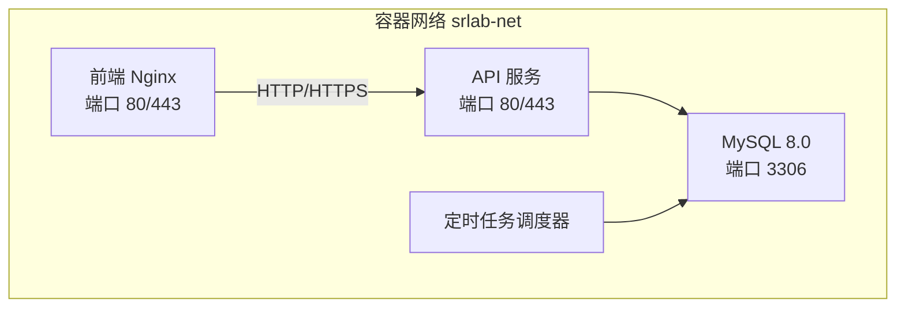
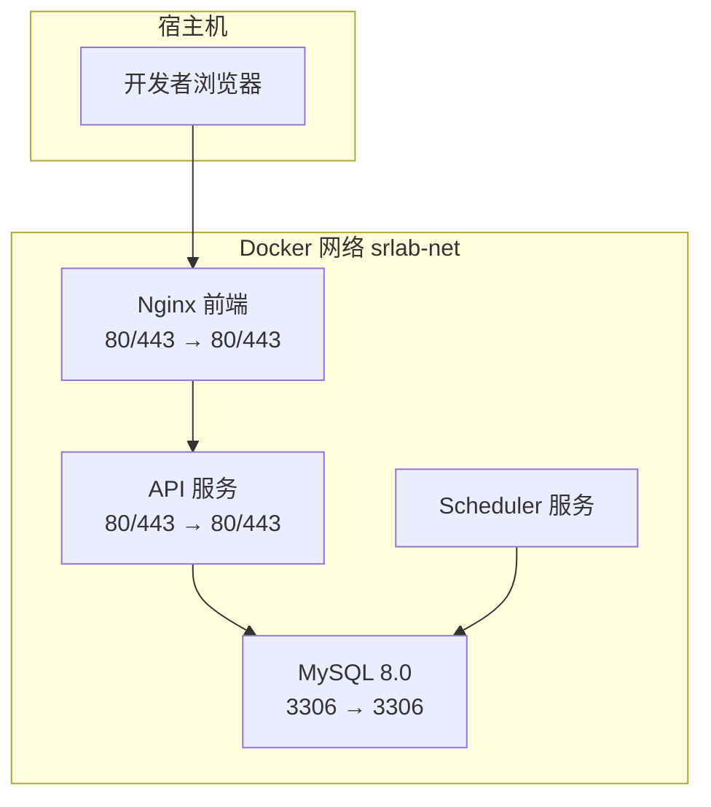
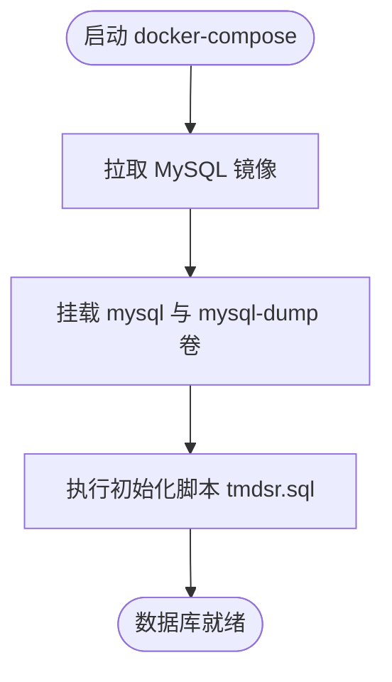
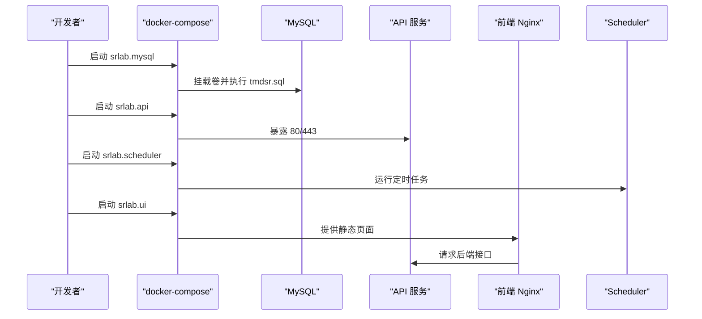
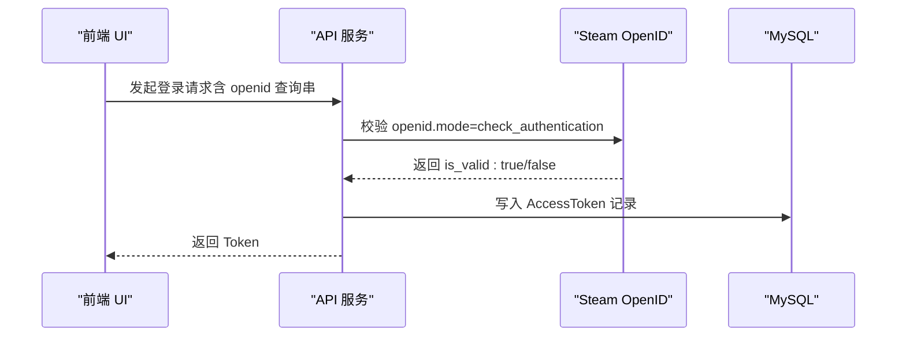
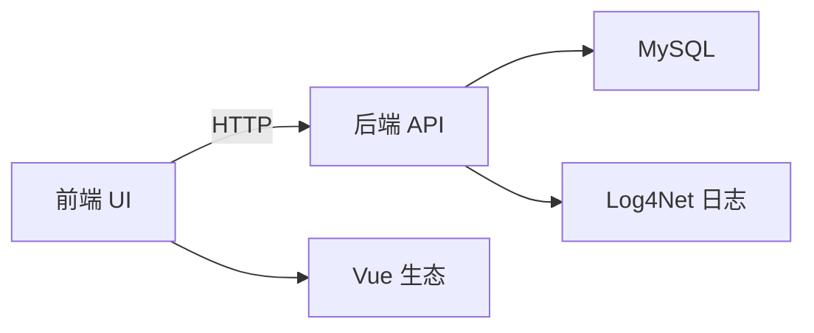

# 快速开始

<cite>
**本文引用的文件**
- [README.md](file://README.md)
- [docker-compose.yml](file://docker-compose.yml)
- [tmdsr.sql](file://mysql-dump/tmdsr.sql)
- [.env.development](file://SpeedRunners.UI/.env.development)
- [package.json](file://SpeedRunners.UI/package.json)
- [vue.config.js](file://SpeedRunners.UI/vue.config.js)
- [Dockerfile（API）](file://SpeedRunners.API/Dockerfile)
- [Dockerfile（UI）](file://SpeedRunners.UI/Dockerfile)
- [Dockerfile（Scheduler）](file://SpeedRunners.Scheduler/Dockerfile)
- [appsettings.json](file://SpeedRunners.API/SpeedRunners/appsettings.json)
- [Program.cs](file://SpeedRunners.API/SpeedRunners/Program.cs)
- [Startup.cs](file://SpeedRunners.API/SpeedRunners/Startup.cs)
- [UserBLL.cs](file://SpeedRunners.API/SpeedRunners.BLL/UserBLL.cs)
- [UserDAL.cs](file://SpeedRunners.API/SpeedRunners.DAL/UserDAL.cs)
</cite>

## 目录
1. [简介](#简介)
2. [项目结构](#项目结构)
3. [核心组件](#核心组件)
4. [架构总览](#架构总览)
5. [详细组件分析](#详细组件分析)
6. [依赖关系分析](#依赖关系分析)
7. [性能注意事项](#性能注意事项)
8. [故障排查指南](#故障排查指南)
9. [结论](#结论)
10. [附录](#附录)

## 简介
本指南面向新加入 SpeedRunnersLab 的开发者，帮助你在最短时间内完成环境搭建、数据库初始化与 Docker 部署，并掌握前后端启动顺序、基础 API 测试与前端页面访问方法。项目采用 Vuetify + Vue 2 + ASP.NET Core 3.1 + Steam 开放 API 技术栈。

## 项目结构
项目由三部分组成：
- 后端 API（ASP.NET Core 3.1）
- 前端 UI（Vue 2 + Vuetify）
- 定时任务调度器（.NET Core 3.1）

图表来源
- [docker-compose.yml](file://docker-compose.yml#L1-L59)

章节来源
- [README.md](file://README.md#L1-L5)
- [docker-compose.yml](file://docker-compose.yml#L1-L59)

## 核心组件
- 后端 API（SpeedRunners.API）
  - 使用 Kestrel 承载 HTTP/HTTPS，启用 CORS、统一异常过滤、响应包装与本地化。
  - 通过配置文件加载数据库连接字符串、Steam API Key、七牛云存储密钥等。
- 前端 UI（SpeedRunners.UI）
  - 基于 Vue CLI 开发，开发服务器默认端口为 9528；生产构建产物由 Nginx 提供静态托管。
  - 开发环境通过 .env.development 指定后端 API 基础地址。
- 定时任务调度器（SpeedRunners.Scheduler）
  - 周期性抓取与更新数据，基于 .NET Core 3.1 运行时。

章节来源
- [Startup.cs](file://SpeedRunners.API/SpeedRunners/Startup.cs#L33-L84)
- [appsettings.json](file://SpeedRunners.API/SpeedRunners/appsettings.json#L1-L21)
- [.env.development](file://SpeedRunners.UI/.env.development#L1-L15)
- [package.json](file://SpeedRunners.UI/package.json#L6-L14)
- [vue.config.js](file://SpeedRunners.UI/vue.config.js#L23-L57)
- [Dockerfile（API）](file://SpeedRunners.API/Dockerfile#L1-L27)
- [Dockerfile（UI）](file://SpeedRunners.UI/Dockerfile#L1-L22)
- [Dockerfile（Scheduler）](file://SpeedRunners.Scheduler/Dockerfile#L1-L23)

## 架构总览
下图展示容器化部署时各服务之间的交互与端口映射。

图表来源
- [docker-compose.yml](file://docker-compose.yml#L3-L59)

## 详细组件分析

### 数据库初始化流程
- 使用 docker-compose 启动 MySQL 容器，并挂载本地 mysql 与 mysql-dump 目录。
- 首次启动时，容器会执行 /docker-entrypoint-initdb.d 下的 SQL 文件，自动导入 tmdsr.sql。
- 导入完成后，数据库中将包含 AccessToken、Match、Mod 等表及初始数据。

图表来源
- [docker-compose.yml](file://docker-compose.yml#L14-L16)
- [tmdsr.sql](file://mysql-dump/tmdsr.sql#L1-L200)

章节来源
- [docker-compose.yml](file://docker-compose.yml#L1-L59)
- [tmdsr.sql](file://mysql-dump/tmdsr.sql#L1-L200)

### 前后端启动顺序与配置
- 启动顺序建议
  1) 启动数据库：docker-compose up srlab.mysql
  2) 初始化数据库：等待 tmdsr.sql 导入完成
  3) 启动 API：docker-compose up srlab.api
  4) 启动调度器：docker-compose up srlab.scheduler
  5) 启动前端：docker-compose up srlab.ui
- 前端开发环境
  - 开发端口：9528（可在 vue.config.js 中调整）
  - API 基础地址：.env.development 中 VUE_APP_BASE_API 指向后端 API
- 后端配置
  - 连接字符串：在 appsettings.json 中设置 ConnectionString
  - 日志与代理：可通过 Proxy.Enable 与 Proxy.Address 控制
  - Steam API Key：ApiKey 字段用于调用 Steam 开放接口
  - 七牛云存储：AccessKey、SecretKey 用于资源上传下载

图表来源
- [docker-compose.yml](file://docker-compose.yml#L3-L59)
- [.env.development](file://SpeedRunners.UI/.env.development#L5)
- [appsettings.json](file://SpeedRunners.API/SpeedRunners/appsettings.json#L13-L14)

章节来源
- [docker-compose.yml](file://docker-compose.yml#L1-L59)
- [.env.development](file://SpeedRunners.UI/.env.development#L1-L15)
- [vue.config.js](file://SpeedRunners.UI/vue.config.js#L23-L57)
- [appsettings.json](file://SpeedRunners.API/SpeedRunners/appsettings.json#L1-L21)

### 登录与鉴权流程（后端）
- 用户通过 Steam OpenID 登录，后端校验有效性后生成 Token 并写入 AccessToken 表。
- 后续请求携带 Token，中间件进行身份验证与权限检查。

图表来源
- [UserBLL.cs](file://SpeedRunners.API/SpeedRunners.BLL/UserBLL.cs#L60-L93)
- [UserDAL.cs](file://SpeedRunners.API/SpeedRunners.DAL/UserDAL.cs#L63-L67)

章节来源
- [UserBLL.cs](file://SpeedRunners.API/SpeedRunners.BLL/UserBLL.cs#L60-L93)
- [UserDAL.cs](file://SpeedRunners.API/SpeedRunners.DAL/UserDAL.cs#L53-L82)

## 依赖关系分析
- 后端依赖
  - 数据库驱动：MySqlConnector（由 docker-compose 挂载的 MySQL 提供）
  - 序列化：Newtonsoft.Json
  - 日志：Log4Net（Program.cs 中注册）
  - 本地化：ASP.NET Core Localization
- 前端依赖
  - Vue 2、Vuetify、axios、路由与状态管理等
  - 构建工具：Vue CLI 3.6.0

图表来源
- [Startup.cs](file://SpeedRunners.API/SpeedRunners/Startup.cs#L33-L62)
- [Program.cs](file://SpeedRunners.API/SpeedRunners/Program.cs#L16-L22)
- [package.json](file://SpeedRunners.UI/package.json#L15-L75)

章节来源
- [Startup.cs](file://SpeedRunners.API/SpeedRunners/Startup.cs#L33-L84)
- [Program.cs](file://SpeedRunners.API/SpeedRunners/Program.cs#L1-L33)
- [package.json](file://SpeedRunners.UI/package.json#L15-L75)

## 性能注意事项
- 前端开发模式下可开启热更新优化（.env.development 中相关配置），生产构建时注意缓存与分包策略（vue.config.js 已配置 splitChunks 与 runtimeChunk）。
- 后端启用同步 IO 以兼容部分第三方库（Startup.cs），生产环境建议评估异步替代方案。
- API 与 UI 均暴露 80/443 端口，建议结合反向代理与证书管理提升安全性与性能。

## 故障排查指南
- 数据库未初始化
  - 症状：首次启动后 API 报数据库连接或表不存在错误
  - 排查：确认 docker-compose 是否正确挂载 mysql 与 mysql-dump，等待容器日志显示 tmdsr.sql 执行完成
- 前端无法访问后端 API
  - 症状：浏览器控制台出现跨域或 404
  - 排查：检查 .env.development 中 VUE_APP_BASE_API 是否指向正确的后端地址；确认 srlab.api 已启动且端口映射正常
- 登录失败或 Token 无效
  - 症状：登录返回超时或后续接口返回权限错误
  - 排查：核对 Steam OpenID 校验链路；检查 AccessToken 表是否写入成功；确认 Refresh 时间配置合理
- 容器间通信异常
  - 症状：API 无法连接 MySQL 或 Scheduler 无法访问数据库
  - 排查：确认所有服务均在同一 Docker 网络 srlab-net；检查 extra_hosts 与 host.docker.internal 映射

章节来源
- [docker-compose.yml](file://docker-compose.yml#L1-L59)
- [.env.development](file://SpeedRunners.UI/.env.development#L5)
- [UserBLL.cs](file://SpeedRunners.API/SpeedRunners.BLL/UserBLL.cs#L60-L93)
- [UserDAL.cs](file://SpeedRunners.API/SpeedRunners.DAL/UserDAL.cs#L53-L82)

## 结论
按照本指南完成环境准备、数据库初始化与 Docker 部署后，你将能够顺利启动后端 API、定时任务与前端页面，并通过浏览器访问前端页面、调用后端接口进行功能验证。遇到问题时，优先检查容器日志、网络连通性与配置文件中的关键参数。

## 附录

### 环境要求与安装清单
- .NET Core 3.1 运行时或 SDK（用于本地开发与调试）
- Node.js 与包管理器（推荐使用 yarn 或 npm）
- Docker 与 docker-compose（用于一键部署）

章节来源
- [Dockerfile（API）](file://SpeedRunners.API/Dockerfile#L3)
- [Dockerfile（UI）](file://SpeedRunners.UI/Dockerfile#L1)
- [Dockerfile（Scheduler）](file://SpeedRunners.Scheduler/Dockerfile#L3)

### 数据库初始化步骤
- 在项目根目录执行 docker-compose，自动拉起 MySQL 并导入 tmdsr.sql
- 确认数据库名称与密码与 docker-compose 中一致
- 初次导入后，数据库中将包含 AccessToken、Match、Mod 等表

章节来源
- [docker-compose.yml](file://docker-compose.yml#L4-L16)
- [tmdsr.sql](file://mysql-dump/tmdsr.sql#L1-L200)

### Docker 部署命令参考
- 启动全部服务：docker-compose up
- 后台运行：docker-compose up -d
- 查看日志：docker-compose logs -f srlab.api / srlab.mysql / srlab.ui / srlab.scheduler
- 停止服务：docker-compose down

章节来源
- [docker-compose.yml](file://docker-compose.yml#L1-L59)

### 前端页面访问与 API 测试
- 前端页面访问
  - 开发环境：http://localhost:9528
  - 生产环境：通过 srlab.ui 暴露的 80/443 端口访问
- API 测试
  - 登录接口：POST /api/user/login（携带 Steam OpenID 查询串）
  - 成功后返回 Token，后续请求在请求头或参数中携带 Token
  - 可使用任意 HTTP 客户端（如 curl、Postman）测试

章节来源
- [vue.config.js](file://SpeedRunners.UI/vue.config.js#L50-L57)
- [.env.development](file://SpeedRunners.UI/.env.development#L5)
- [UserBLL.cs](file://SpeedRunners.API/SpeedRunners.BLL/UserBLL.cs#L60-L93)