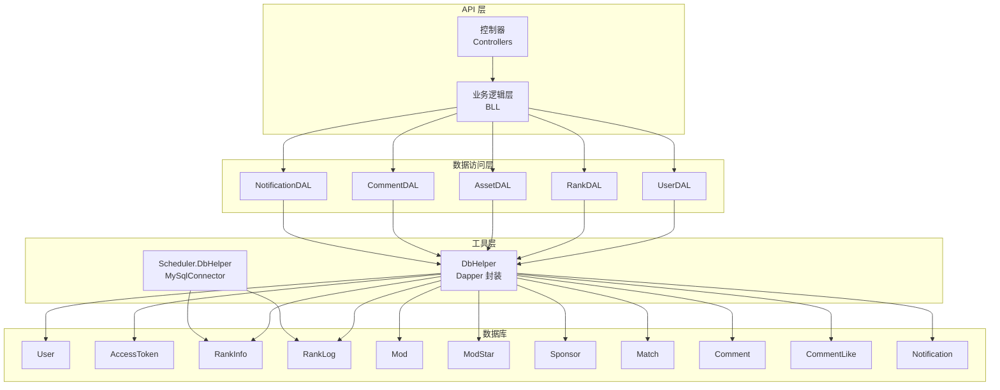
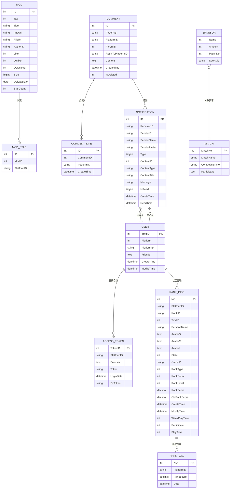
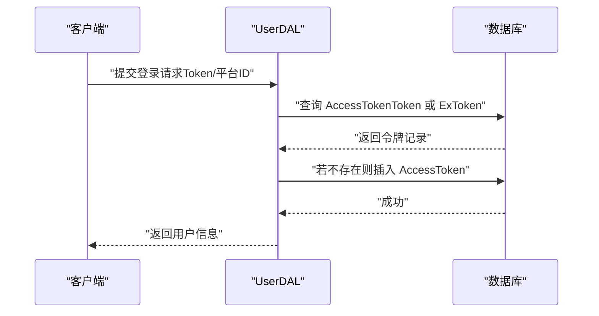
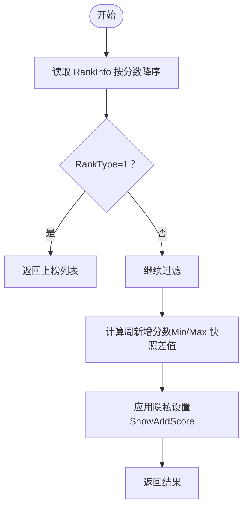
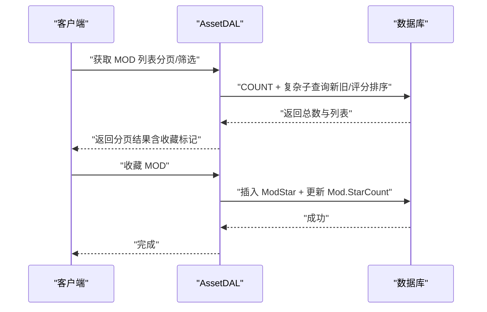
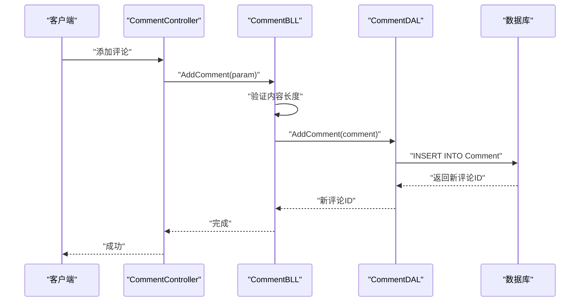
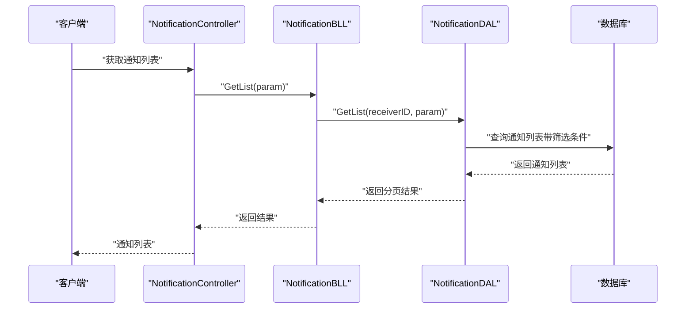
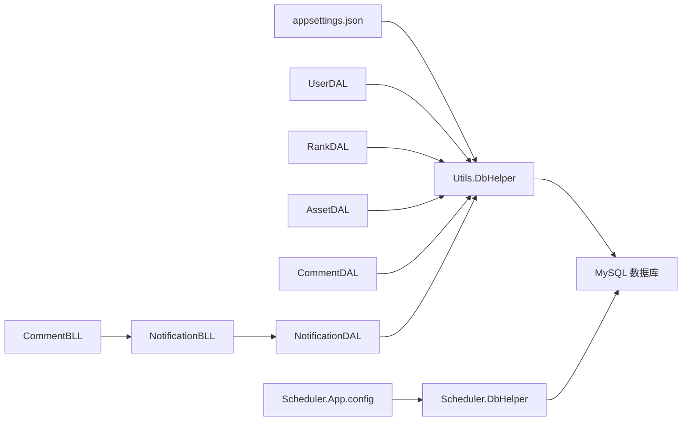

# 数据库设计

<cite>
**本文引用的文件**
- [tmdsr.sql](file://mysql-dump/tmdsr.sql)
- [notification_table.sql](file://mysql-dump/notification_table.sql)
- [DbHelper.cs](file://SpeedRunners.API/SpeedRunners.Utils/DbHelper.cs)
- [DbHelper.cs](file://SpeedRunners.Scheduler/DbHelper.cs)
- [App.config](file://SpeedRunners.Scheduler/App.config)
- [appsettings.json](file://SpeedRunners.API/SpeedRunners/appsettings.json)
- [UserDAL.cs](file://SpeedRunners.API/SpeedRunners.DAL/UserDAL.cs)
- [RankDAL.cs](file://SpeedRunners.API/SpeedRunners.DAL/RankDAL.cs)
- [AssetDAL.cs](file://SpeedRunners.API/SpeedRunners.DAL/AssetDAL.cs)
- [CommentDAL.cs](file://SpeedRunners.API/SpeedRunners.DAL/CommentDAL.cs)
- [NotificationController.cs](file://SpeedRunners.API/SpeedRunners.Controllers/NotificationController.cs)
- [NotificationBLL.cs](file://SpeedRunners.API/SpeedRunners.BLL/NotificationBLL.cs)
- [NotificationDAL.cs](file://SpeedRunners.API/SpeedRunners.DAL/NotificationDAL.cs)
- [MNotification.cs](file://SpeedRunners.API/SpeedRunners.Model/User/MNotification.cs)
- [CommentBLL.cs](file://SpeedRunners.API/SpeedRunners.BLL/CommentBLL.cs)
- [MUser.cs](file://SpeedRunners.API/SpeedRunners.Model/MUser.cs)
- [MAccessToken.cs](file://SpeedRunners.API/SpeedRunners.Model/User/MAccessToken.cs)
- [MRankInfo.cs](file://SpeedRunners.API/SpeedRunners.Model/Rank/MRankInfo.cs)
- [MMod.cs](file://SpeedRunners.API/SpeedRunners.Model/Asset/MMod.cs)
- [MComment.cs](file://SpeedRunners.API/SpeedRunners.Model/Comment/MComment.cs)
- [MCommentLike.cs](file://SpeedRunners.API/SpeedRunners.Model/Comment/MCommentLike.cs)
- [MCommentOut.cs](file://SpeedRunners.API/SpeedRunners.Model/Comment/MCommentOut.cs)
- [MCommentParam.cs](file://SpeedRunners.API/SpeedRunners.Model/Comment/MCommentParam.cs)
- [CommentBLL.cs](file://SpeedRunners.API/SpeedRunners.BLL/CommentBLL.cs)
- [CommentController.cs](file://SpeedRunners.API/SpeedRunners.Controllers/CommentController.cs)
</cite>

## 更新摘要
**变更内容**
- 新增 Notification 表结构与相关业务逻辑
- 更新评论系统以支持消息通知功能
- 增加通知控制器、业务逻辑层和数据访问层
- 完善消息通知的索引设计和查询优化

## 目录
1. [简介](#简介)
2. [项目结构](#项目结构)
3. [核心组件](#核心组件)
4. [架构总览](#架构总览)
5. [详细组件分析](#详细组件分析)
6. [依赖关系分析](#依赖关系分析)
7. [性能考量](#性能考量)
8. [故障排查指南](#故障排查指南)
9. [结论](#结论)
10. [附录](#附录)

## 简介
本文件面向数据库管理员与后端开发者，系统性梳理 SpeedRunnersLab 的 MySQL 数据库整体架构与表结构设计，重点覆盖用户认证、排行榜、MOD 资源、评论系统、消息通知与赞助商等核心模块。文档从数据模型的业务含义出发，解释表间关系、主外键约束与索引策略，给出数据访问模式、缓存与性能优化建议，并提供数据库 Schema 图与 ER 关系图，便于理解与维护。

## 项目结构
数据库层位于 SpeedRunnersLab 后端工程中，采用分层架构：
- 数据访问层（DAL）：封装 SQL 与 Dapper 访问，负责 CRUD 与复杂查询。
- 工具层（Utils）：统一数据库连接与事务管理，提供 Dapper 封装。
- 调度任务（Scheduler）：定时抓取 Steam 排行数据，写入数据库。
- API 层：对外提供接口，调用 DAL 完成业务逻辑。
- 评论系统：新增评论与评论点赞功能，支持分页、回复与通知机制。
- 消息通知系统：新增消息通知功能，支持回复通知和点赞通知。

**图表来源**
- [UserDAL.cs](file://SpeedRunners.API/SpeedRunners.DAL/UserDAL.cs#L1-L85)
- [RankDAL.cs](file://SpeedRunners.API/SpeedRunners.DAL/RankDAL.cs#L1-L175)
- [AssetDAL.cs](file://SpeedRunners.API/SpeedRunners.DAL/AssetDAL.cs#L1-L134)
- [CommentDAL.cs](file://SpeedRunners.API/SpeedRunners.DAL/CommentDAL.cs#L1-L146)
- [NotificationDAL.cs](file://SpeedRunners.API/SpeedRunners.DAL/NotificationDAL.cs#L1-L155)
- [DbHelper.cs](file://SpeedRunners.API/SpeedRunners.Utils/DbHelper.cs#L1-L283)
- [DbHelper.cs](file://SpeedRunners.Scheduler/DbHelper.cs#L1-L32)
- [tmdsr.sql](file://mysql-dump/tmdsr.sql#L1-L571)
- [notification_table.sql](file://mysql-dump/notification_table.sql#L1-L22)

**章节来源**
- [UserDAL.cs](file://SpeedRunners.API/SpeedRunners.DAL/UserDAL.cs#L1-L85)
- [RankDAL.cs](file://SpeedRunners.API/SpeedRunners.DAL/RankDAL.cs#L1-L175)
- [AssetDAL.cs](file://SpeedRunners.API/SpeedRunners.DAL/AssetDAL.cs#L1-L134)
- [CommentDAL.cs](file://SpeedRunners.API/SpeedRunners.DAL/CommentDAL.cs#L1-L146)
- [NotificationDAL.cs](file://SpeedRunners.API/SpeedRunners.DAL/NotificationDAL.cs#L1-L155)
- [DbHelper.cs](file://SpeedRunners.API/SpeedRunners.Utils/DbHelper.cs#L1-L283)
- [DbHelper.cs](file://SpeedRunners.Scheduler/DbHelper.cs#L1-L32)
- [tmdsr.sql](file://mysql-dump/tmdsr.sql#L1-L571)
- [notification_table.sql](file://mysql-dump/notification_table.sql#L1-L22)

## 核心组件
本节概述数据库中最重要的核心表及其职责与字段要点。

- 用户与认证
  - AccessToken：存储令牌、平台 ID、浏览器与登录时间等，TokenID 主键。
  - User：存储社区 ID、平台类型与平台 ID、好友列表、创建/修改时间等，TmdID 主键。
- 排行与日志
  - RankInfo：玩家状态、游戏信息、段位等级、分数、参与状态、周游玩时长等，NO 主键。
  - RankLog：按时间点记录玩家分数快照，NO 主键。
- MOD 资源与收藏
  - Mod：MOD 标签、标题、封面/文件 URL、作者、点赞/踩/下载量、大小、上传日期等，ID 主键。
  - ModStar：用户对 MOD 的收藏关联，ID 主键。
- 评论系统
  - Comment：评论内容、页面路径、父子关系、回复对象、创建时间、删除状态等，ID 主键。
  - CommentLike：评论点赞记录，CommentID+PlatformID 唯一索引，支持用户对评论的点赞/取消点赞。
- 消息通知系统
  - Notification：消息通知记录，包含接收者、发送者、消息类型、关联内容、状态等，ID 主键。
- 赛事与赞助
  - Match：赛事编号、名称、参赛时间、参赛者列表等，MatchNo 主键。
  - Sponsor：赞助商名称、金额、所属赛事编号、特殊规则，MatchNo 建有索引。

**章节来源**
- [tmdsr.sql](file://mysql-dump/tmdsr.sql#L1-L571)
- [notification_table.sql](file://mysql-dump/notification_table.sql#L1-L22)
- [MUser.cs](file://SpeedRunners.API/SpeedRunners.Model/MUser.cs#L1-L35)
- [MAccessToken.cs](file://SpeedRunners.API/SpeedRunners.Model/User/MAccessToken.cs#L1-L17)
- [MRankInfo.cs](file://SpeedRunners.API/SpeedRunners.Model/Rank/MRankInfo.cs#L1-L36)
- [MMod.cs](file://SpeedRunners.API/SpeedRunners.Model/Asset/MMod.cs#L1-L28)
- [MComment.cs](file://SpeedRunners.API/SpeedRunners.Model/Comment/MComment.cs#L1-L17)
- [MCommentLike.cs](file://SpeedRunners.API/SpeedRunners.Model/Comment/MCommentLike.cs#L1-L13)
- [MNotification.cs](file://SpeedRunners.API/SpeedRunners.Model/User/MNotification.cs#L1-L145)

## 架构总览
数据库采用 InnoDB 引擎，字符集为 utf8mb4，行格式为 DYNAMIC。各表之间通过平台 ID（Steam64）与社区 ID（TmdID）建立弱耦合关联，避免强外键带来的维护成本。调度器通过定时任务写入 RankInfo 与 RankLog，API 层通过 DAL 读写数据。新增的评论系统支持嵌套回复与点赞功能，通过 CommentLike 实现用户对评论的点赞/取消点赞。消息通知系统通过 Notification 表实现评论回复和点赞的通知功能。

**图表来源**
- [tmdsr.sql](file://mysql-dump/tmdsr.sql#L1-L571)
- [notification_table.sql](file://mysql-dump/notification_table.sql#L1-L22)

## 详细组件分析

### 用户与认证表（User、AccessToken）
- 设计理念
  - User 以社区 ID（TmdID）为主键，便于跨平台聚合；PlatformID 作为外部标识，用于与 Steam 等平台对接。
  - AccessToken 保存登录态与设备信息，TokenID 主键，支持 Token 与 ExToken 双重校验。
- 字段与约束
  - User：TmdID 主键；Platform、PlatformID 组合唯一性可由应用层保证。
  - AccessToken：TokenID 主键；Token、ExToken 唯一性可由应用层保证。
- 访问模式
  - 登录：插入或更新 AccessToken；查询时支持 Token 或 ExToken 匹配。
  - 隐私设置：通过 PrivacySettings 表（在 DAL 中使用）与 RankInfo 关联，控制榜单可见性与周游玩时长展示。

**图表来源**
- [UserDAL.cs](file://SpeedRunners.API/SpeedRunners.DAL/UserDAL.cs#L53-L82)
- [tmdsr.sql](file://mysql-dump/tmdsr.sql#L5-L14)

**章节来源**
- [UserDAL.cs](file://SpeedRunners.API/SpeedRunners.DAL/UserDAL.cs#L1-L85)
- [tmdsr.sql](file://mysql-dump/tmdsr.sql#L5-L14)
- [MUser.cs](file://SpeedRunners.API/SpeedRunners.Model/MUser.cs#L1-L35)
- [MAccessToken.cs](file://SpeedRunners.API/SpeedRunners.Model/User/MAccessToken.cs#L1-L17)

### 排行与日志表（RankInfo、RankLog）
- 设计理念
  - RankInfo 记录玩家当前状态与统计指标；RankLog 以时间序列记录分数变化，用于趋势分析与图表展示。
- 字段与约束
  - RankInfo：NO 主键；PlatformID 唯一；RankType 控制榜单显示；State 表示在线状态；WeekPlayTime 与 PlayTime 用于周排行。
  - RankLog：NO 主键；Date 作为时间维度；RankScore 记录快照。
- 访问模式
  - 获取榜单：按 RankScore 降序；筛选 RankType=1 的上榜玩家。
  - 周新增分数图表：基于 RankLog 的最小/最大快照差值计算。
  - 周游玩时长图表：筛选 WeekPlayTime>0 并处理重名玩家显示。

**图表来源**
- [RankDAL.cs](file://SpeedRunners.API/SpeedRunners.DAL/RankDAL.cs#L44-L92)
- [tmdsr.sql](file://mysql-dump/tmdsr.sql#L372-L397)

**章节来源**
- [RankDAL.cs](file://SpeedRunners.API/SpeedRunners.DAL/RankDAL.cs#L1-L175)
- [tmdsr.sql](file://mysql-dump/tmdsr.sql#L372-L397)
- [MRankInfo.cs](file://SpeedRunners.API/SpeedRunners.Model/Rank/MRankInfo.cs#L1-L36)

### MOD 资源与收藏表（Mod、ModStar）
- 设计理念
  - Mod 存储 MOD 元数据与统计；ModStar 实现用户收藏功能，避免在 Mod 中冗余存储用户偏好。
- 字段与约束
  - Mod：ID 主键；Tag/Title/FileUrl/ImgUrl/AuthorID/UploadDate 等；Download/Size/Like/Dislike/StarCount 统计字段。
  - ModStar：ID 主键；ModID+PlatformID 唯一性可由应用层保证。
- 访问模式
  - 分页查询：支持标签过滤、关键词模糊搜索、仅收藏过滤；按"新旧"与综合评分排序。
  - 收藏/取消收藏：原子性更新 ModStar 与 Mod 的 StarCount。
  - 下载计数：按 FileUrl 自增 Download。

**图表来源**
- [AssetDAL.cs](file://SpeedRunners.API/SpeedRunners.DAL/AssetDAL.cs#L16-L72)
- [AssetDAL.cs](file://SpeedRunners.API/SpeedRunners.DAL/AssetDAL.cs#L112-L124)
- [tmdsr.sql](file://mysql-dump/tmdsr.sql#L35-L54)

**章节来源**
- [AssetDAL.cs](file://SpeedRunners.API/SpeedRunners.DAL/AssetDAL.cs#L1-L134)
- [tmdsr.sql](file://mysql-dump/tmdsr.sql#L35-L54)
- [MMod.cs](file://SpeedRunners.API/SpeedRunners.Model/Asset/MMod.cs#L1-L28)

### 评论系统表（Comment、CommentLike）
- 设计理念
  - Comment 支持嵌套回复，通过 ParentID 建立父子关系；ReplyToPlatformID 指向被回复用户的平台 ID。
  - CommentLike 实现用户对评论的点赞/取消点赞，使用唯一索引防止重复点赞。
- 字段与约束
  - Comment：ID 主键；PagePath 标识评论所属页面；ParentID 为空表示顶级评论；IsDeleted 支持软删除。
  - CommentLike：ID 主键；CommentID+PlatformID 唯一索引；支持按评论 ID 快速统计点赞数。
- 访问模式
  - 获取评论列表：按创建时间倒序，支持分页与回复计数统计。
  - 获取回复列表：按创建时间正序，支持分页与被回复用户信息展示。
  - 添加评论：验证内容长度，支持顶级评论与回复评论两种模式。
  - 点赞/取消点赞：原子性切换，返回最新点赞数。
  - 删除评论：仅作者或管理员可删除，顶级评论会级联删除所有回复。

**图表来源**
- [CommentController.cs](file://SpeedRunners.API/SpeedRunners.Controllers/CommentController.cs#L17-L20)
- [CommentBLL.cs](file://SpeedRunners.API/SpeedRunners.BLL/CommentBLL.cs#L44-L80)
- [CommentDAL.cs](file://SpeedRunners.API/SpeedRunners.DAL/CommentDAL.cs#L83-L86)

**章节来源**
- [CommentController.cs](file://SpeedRunners.API/SpeedRunners.Controllers/CommentController.cs#L1-L33)
- [CommentBLL.cs](file://SpeedRunners.API/SpeedRunners.BLL/CommentBLL.cs#L1-L183)
- [CommentDAL.cs](file://SpeedRunners.API/SpeedRunners.DAL/CommentDAL.cs#L1-L146)
- [MComment.cs](file://SpeedRunners.API/SpeedRunners.Model/Comment/MComment.cs#L1-L17)
- [MCommentLike.cs](file://SpeedRunners.API/SpeedRunners.Model/Comment/MCommentLike.cs#L1-L13)
- [MCommentOut.cs](file://SpeedRunners.API/SpeedRunners.Model/Comment/MCommentOut.cs#L1-L13)
- [MCommentParam.cs](file://SpeedRunners.API/SpeedRunners.Model/Comment/MCommentParam.cs#L1-L18)

### 消息通知表（Notification）
- 设计理念
  - Notification 表用于存储系统消息通知，支持回复通知和点赞通知两种类型。
  - 通过 ReceiverID 和 SenderID 建立用户间的弱耦合关联，避免强外键约束。
  - 支持消息分类（Type）、状态跟踪（IsRead）和时间戳管理。
- 字段与约束
  - ID 主键：自增 ID。
  - ReceiverID：接收用户平台 ID，建立索引支持快速查询。
  - SenderID：发送用户平台 ID。
  - Type：消息类型（1-回复我，2-收到的点赞）。
  - ContentID：关联内容 ID（如评论 ID）。
  - IsRead：是否已读，默认 0（未读）。
  - CreateTime：创建时间，默认当前时间。
  - ReadTime：阅读时间，用于记录用户查看通知的时间。
- 索引设计
  - idx_receiver：按接收者查询通知列表。
  - idx_receiver_type：按接收者和类型组合查询，支持按类型筛选。
  - idx_receiver_read：按接收者和已读状态组合查询，支持未读统计。
  - idx_create_time：按创建时间排序，支持时间范围查询。
  - idx_unique_check：唯一性检查索引，防止重复通知。
- 访问模式
  - 获取通知列表：支持按类型、已读状态、时间范围筛选，按创建时间倒序排列。
  - 获取未读统计：统计不同类型未读消息数量。
  - 标记已读：支持按 ID 列表或类型批量标记。
  - 清理过期数据：自动清理超过 30 天的历史通知。

**图表来源**
- [NotificationController.cs](file://SpeedRunners.API/SpeedRunners.Controllers/NotificationController.cs#L15-L20)
- [NotificationBLL.cs](file://SpeedRunners.API/SpeedRunners.BLL/NotificationBLL.cs#L15-L18)
- [NotificationDAL.cs](file://SpeedRunners.API/SpeedRunners.DAL/NotificationDAL.cs#L17-L70)

**章节来源**
- [NotificationController.cs](file://SpeedRunners.API/SpeedRunners.Controllers/NotificationController.cs#L1-L48)
- [NotificationBLL.cs](file://SpeedRunners.API/SpeedRunners.BLL/NotificationBLL.cs#L1-L107)
- [NotificationDAL.cs](file://SpeedRunners.API/SpeedRunners.DAL/NotificationDAL.cs#L1-L155)
- [MNotification.cs](file://SpeedRunners.API/SpeedRunners.Model/User/MNotification.cs#L1-L145)

### 赛事与赞助表（Match、Sponsor）
- 设计理念
  - Match 记录赛事基本信息；Sponsor 记录赞助商与金额，MatchNo 建有索引便于按赛事查询。
- 字段与约束
  - Match：MatchNo 主键；Participant 为文本列表，便于快速检索。
  - Sponsor：Name/Amount/MatchNo/SpeRule；MatchNo 建有索引。
- 访问模式
  - 获取赞助商列表：按 MatchNo 过滤并按金额降序。

**章节来源**
- [tmdsr.sql](file://mysql-dump/tmdsr.sql#L21-L30)
- [tmdsr.sql](file://mysql-dump/tmdsr.sql#L522-L531)
- [RankDAL.cs](file://SpeedRunners.API/SpeedRunners.DAL/RankDAL.cs#L169-L172)

## 依赖关系分析
- 连接与配置
  - API 层通过 appsettings.json 提供连接字符串；Utils.DbHelper 封装 Dapper 访问；Scheduler.DbHelper 使用 MySqlConnector 直连数据库。
  - 调度器 App.config 提供独立的连接字符串与运行参数。
- 数据访问依赖
  - UserDAL/RankDAL/AssetDAL/CommentDAL/NotificationDAL 均依赖 Utils.DbHelper 提供的连接与事务能力。
  - DAL 层不直接暴露外键约束，通过应用层逻辑保证一致性（如收藏与 MOD 的原子更新、评论的软删除、通知的去重机制）。
- 业务逻辑依赖
  - CommentBLL 依赖 NotificationBLL 实现评论回复和点赞通知功能。
  - NotificationBLL 提供统一的通知管理接口，支持不同类型通知的创建和查询。

**图表来源**
- [appsettings.json](file://SpeedRunners.API/SpeedRunners/appsettings.json#L1-L20)
- [DbHelper.cs](file://SpeedRunners.API/SpeedRunners.Utils/DbHelper.cs#L1-L283)
- [DbHelper.cs](file://SpeedRunners.Scheduler/DbHelper.cs#L1-L32)
- [App.config](file://SpeedRunners.Scheduler/App.config#L1-L14)
- [CommentBLL.cs](file://SpeedRunners.API/SpeedRunners.BLL/CommentBLL.cs#L12-L19)

**章节来源**
- [appsettings.json](file://SpeedRunners.API/SpeedRunners/appsettings.json#L1-L20)
- [DbHelper.cs](file://SpeedRunners.API/SpeedRunners.Utils/DbHelper.cs#L1-L283)
- [DbHelper.cs](file://SpeedRunners.Scheduler/DbHelper.cs#L1-L32)
- [App.config](file://SpeedRunners.Scheduler/App.config#L1-L14)
- [CommentBLL.cs](file://SpeedRunners.API/SpeedRunners.BLL/CommentBLL.cs#L1-L181)

## 性能考量
- 索引策略
  - RankInfo：按 RankScore 降序查询频繁，建议在 RankScore 上建立索引；PlatformID 作为过滤条件，可考虑复合索引（RankType, RankScore）。
  - RankLog：按 PlatformID 与 Date 聚合，建议（PlatformID, Date）复合索引。
  - Mod：按 Tag、UploadDate、综合评分排序，建议（Tag, UploadDate DESC）或（Tag, rowid DESC）。
  - Comment：按 PagePath 与 ParentID 查询频繁，建议（PagePath, ParentID, CreateTime）复合索引；按 CreateTime 倒序展示。
  - CommentLike：按 CommentID 统计点赞数，建议（CommentID, PlatformID）唯一索引，提升去重效率。
  - Notification：按 ReceiverID 查询频繁，建议（ReceiverID, Type, IsRead, CreateTime）复合索引，支持通知列表查询和未读统计。
  - Sponsor：MatchNo 建有索引，查询按赛事分组合理。
- 查询优化
  - 分页与排序：优先使用覆盖索引减少回表；避免 SELECT *，仅取必要字段。
  - 复杂聚合：使用子查询与 UNION 时，确保 WHERE 条件能命中索引。
  - 评论查询：使用 GridReader 执行多结果集查询，减少往返次数。
  - 通知查询：使用时间范围限制（30天）和类型筛选，避免全表扫描。
- 缓存策略
  - 周排行与新增分数图表可引入 Redis 缓存，定期刷新（如每 5 分钟），热点数据可短期驻留。
  - MOD 列表与详情可缓存静态元数据，结合 ETag/Last-Modified 实现条件 GET。
  - 评论列表可按页面路径缓存，设置较短过期时间（如 1-5 分钟）。
  - 通知列表可缓存最近 30 天的未读统计，设置 1-2 分钟过期时间。
- 写入优化
  - 批量写入：调度器可批量写入 RankLog，减少事务次数。
  - 原子更新：收藏/下载等计数更新使用单条 UPDATE，避免多次往返。
  - 评论点赞：使用唯一索引防止重复，原子性切换点赞状态。
  - 通知发送：使用 24 小时内重复检查机制，避免重复通知。

## 故障排查指南
- 连接问题
  - 检查 appsettings.json 与 Scheduler.App.config 中的连接字符串是否正确。
  - 确认数据库服务可达、账号权限与字符集设置（utf8mb4）。
- 查询异常
  - 若出现慢查询，检查是否缺少必要的索引；关注 Order By 与 Group By 是否命中索引。
  - MOD 列表分页时，确认筛选条件与排序字段已建立合适索引。
  - 评论列表查询时，确认 PagePath、ParentID、CreateTime 等字段已建立复合索引。
  - 通知查询时，确认 ReceiverID、Type、IsRead、CreateTime 等字段已建立合适索引。
- 数据不一致
  - 收藏/下载计数更新需保证原子性，避免并发导致的竞态；必要时使用事务包裹。
  - AccessToken 的 Token/ExToken 更新需严格匹配 TokenID 与 PlatformID。
  - 评论点赞操作需使用唯一索引确保幂等性，避免重复点赞。
  - 评论软删除需同时处理顶级评论与其回复的级联删除。
  - 通知发送需检查 24 小时重复检查机制是否正常工作。
  - 通知清理需确认 30 天过期机制是否按预期执行。

**章节来源**
- [appsettings.json](file://SpeedRunners.API/SpeedRunners/appsettings.json#L13-L13)
- [App.config](file://SpeedRunners.Scheduler/App.config#L4-L5)
- [AssetDAL.cs](file://SpeedRunners.API/SpeedRunners.DAL/AssetDAL.cs#L112-L124)
- [UserDAL.cs](file://SpeedRunners.API/SpeedRunners.DAL/UserDAL.cs#L63-L82)
- [CommentDAL.cs](file://SpeedRunners.API/SpeedRunners.DAL/CommentDAL.cs#L121-L143)
- [NotificationDAL.cs](file://SpeedRunners.API/SpeedRunners.DAL/NotificationDAL.cs#L141-L152)

## 结论
本数据库设计以业务需求为导向，采用轻外键、强应用层一致性的策略，配合 Dapper 与调度器实现高效的数据采集与查询。通过合理的索引与缓存策略，可在高并发场景下保持稳定性能。新增的评论系统进一步丰富了社区互动功能，支持嵌套回复与点赞，为用户提供更好的交互体验。新增的消息通知系统实现了评论回复和点赞的自动化通知功能，通过 Notification 表提供完整的通知管理能力。建议持续监控慢查询与热点数据，逐步完善索引与缓存覆盖范围，保障系统长期可维护性与扩展性。

## 附录
- 数据库初始化脚本：[tmdsr.sql](file://mysql-dump/tmdsr.sql#L1-L571)
- 消息通知表初始化脚本：[notification_table.sql](file://mysql-dump/notification_table.sql#L1-L22)
- API 连接配置：[appsettings.json](file://SpeedRunners.API/SpeedRunners/appsettings.json#L13-L13)
- 调度器连接配置：[App.config](file://SpeedRunners.Scheduler/App.config#L4-L5)
- 数据访问封装：[DbHelper.cs](file://SpeedRunners.API/SpeedRunners.Utils/DbHelper.cs#L1-L283)
- 调度器数据库封装：[DbHelper.cs](file://SpeedRunners.Scheduler/DbHelper.cs#L1-L32)
- 通知控制器：[NotificationController.cs](file://SpeedRunners.API/SpeedRunners.Controllers/NotificationController.cs#L1-L48)
- 通知业务逻辑：[NotificationBLL.cs](file://SpeedRunners.API/SpeedRunners.BLL/NotificationBLL.cs#L1-L107)
- 通知数据访问：[NotificationDAL.cs](file://SpeedRunners.API/SpeedRunners.DAL/NotificationDAL.cs#L1-L155)
- 通知模型定义：[MNotification.cs](file://SpeedRunners.API/SpeedRunners.Model/User/MNotification.cs#L1-L145)
- 评论业务逻辑：[CommentBLL.cs](file://SpeedRunners.API/SpeedRunners.BLL/CommentBLL.cs#L1-L181)
- 评论控制器：[CommentController.cs](file://SpeedRunners.API/SpeedRunners.Controllers/CommentController.cs#L1-L33)