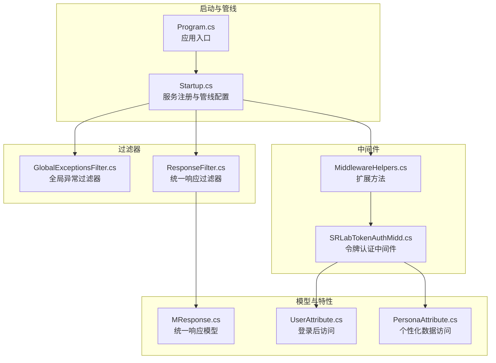
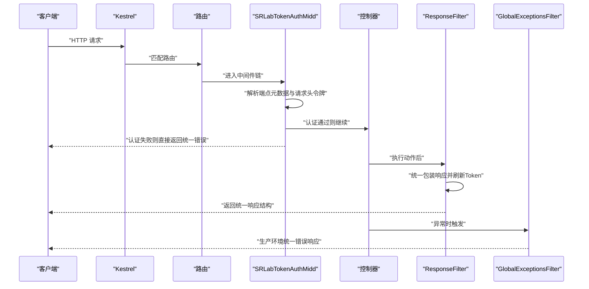
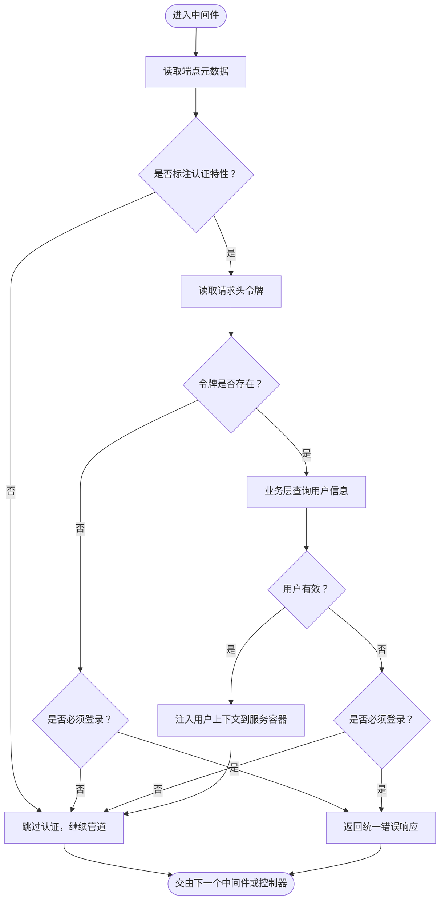
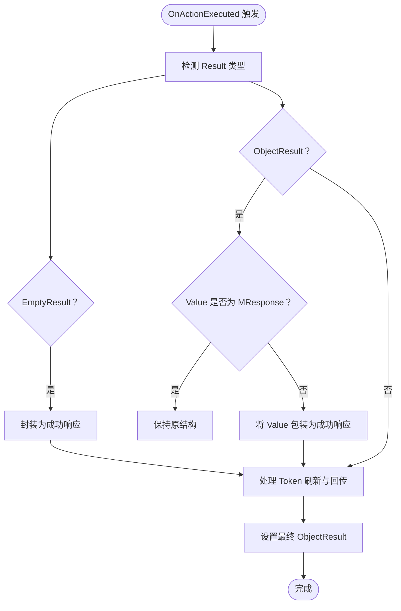
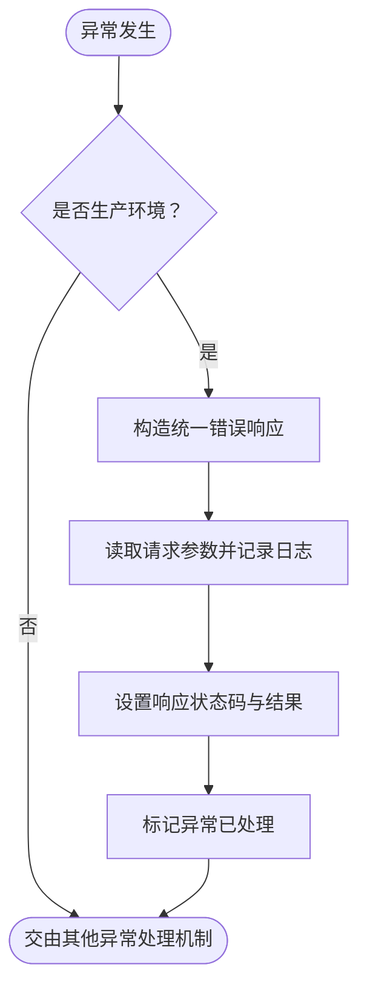
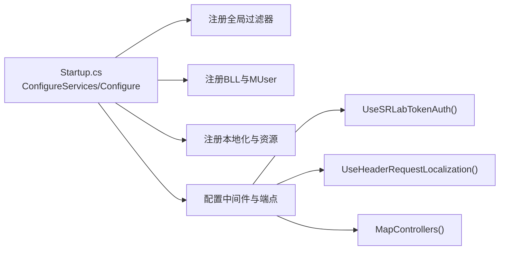
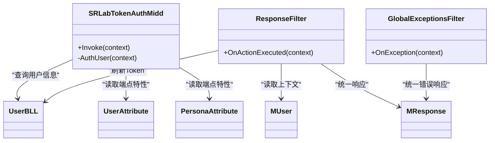

# 中间件与过滤器体系

<cite>
**本文引用的文件**
- [SRLabTokenAuthMidd.cs](file://SpeedRunners.API/SpeedRunners/Middleware/SRLabTokenAuthMidd.cs)
- [MiddlewareHelpers.cs](file://SpeedRunners.API/SpeedRunners/Middleware/MiddlewareHelpers.cs)
- [GlobalExceptionsFilter.cs](file://SpeedRunners.API/SpeedRunners/Filter/GlobalExceptionsFilter.cs)
- [ResponseFilter.cs](file://SpeedRunners.API/SpeedRunners/Filter/ResponseFilter.cs)
- [Startup.cs](file://SpeedRunners.API/SpeedRunners/Startup.cs)
- [Program.cs](file://SpeedRunners.API/SpeedRunners/Program.cs)
- [MResponse.cs](file://SpeedRunners.API/SpeedRunners.Model/MResponse.cs)
- [UserAttribute.cs](file://SpeedRunners.API/SpeedRunners.Model/UserAttribute.cs)
- [PersonaAttribute.cs](file://SpeedRunners.API/SpeedRunners.Model/PersonaAttribute.cs)
- [SRLabTokenAuthMidd.en.resx](file://SpeedRunners.API/SpeedRunners/Resources/SRLabTokenAuthMidd.en.resx)
- [SRLabTokenAuthMidd.zh.resx](file://SpeedRunners.API/SpeedRunners/Resources/SRLabTokenAuthMidd.zh.resx)
</cite>

## 目录
1. [简介](#简介)
2. [项目结构](#项目结构)
3. [核心组件](#核心组件)
4. [架构总览](#架构总览)
5. [详细组件分析](#详细组件分析)
6. [依赖关系分析](#依赖关系分析)
7. [性能考量](#性能考量)
8. [故障排查指南](#故障排查指南)
9. [结论](#结论)
10. [附录](#附录)

## 简介
本文件系统性梳理 SpeedRunnersLab 后端在 ASP.NET Core 中间件与过滤器体系的实现与使用，重点覆盖以下方面：
- 中间件管道工作原理与执行顺序
- 自定义中间件 SRLabTokenAuthMidd 的认证逻辑、请求拦截与权限检查机制
- 全局过滤器设计与实现：GlobalExceptionsFilter 异常处理、ResponseFilter 响应格式化、统一错误码与消息处理
- 生命周期管理、依赖注入配置与异常传播机制
- 中间件链执行流程图与过滤器处理顺序
- 在请求处理管道中的作用与最佳实践

## 项目结构
围绕中间件与过滤器的相关文件组织如下：
- 中间件层：SRLabTokenAuthMidd 及其扩展方法 MiddlewareHelpers
- 过滤器层：GlobalExceptionsFilter（全局异常）、ResponseFilter（统一响应）
- 启动配置：Startup 中注册与装配中间件与过滤器
- 模型与特性：MResponse 统一响应模型、UserAttribute 与 PersonaAttribute 控制认证策略
- 资源：多语言资源用于国际化提示

图表来源
- [Startup.cs](file://SpeedRunners.API/SpeedRunners/Startup.cs#L64-L84)
- [MiddlewareHelpers.cs](file://SpeedRunners.API/SpeedRunners/Middleware/MiddlewareHelpers.cs#L9-L39)
- [SRLabTokenAuthMidd.cs](file://SpeedRunners.API/SpeedRunners/Middleware/SRLabTokenAuthMidd.cs#L13-L123)
- [GlobalExceptionsFilter.cs](file://SpeedRunners.API/SpeedRunners/Filter/GlobalExceptionsFilter.cs#L11-L54)
- [ResponseFilter.cs](file://SpeedRunners.API/SpeedRunners/Filter/ResponseFilter.cs#L9-L114)
- [MResponse.cs](file://SpeedRunners.API/SpeedRunners.Model/MResponse.cs#L1-L42)
- [UserAttribute.cs](file://SpeedRunners.API/SpeedRunners.Model/UserAttribute.cs#L1-L13)
- [PersonaAttribute.cs](file://SpeedRunners.API/SpeedRunners.Model/PersonaAttribute.cs#L1-L13)

章节来源
- [Startup.cs](file://SpeedRunners.API/SpeedRunners/Startup.cs#L32-L84)
- [Program.cs](file://SpeedRunners.API/SpeedRunners/Program.cs#L1-L33)

## 核心组件
- 自定义中间件 SRLabTokenAuthMidd：负责基于请求头令牌进行用户认证，结合端点元数据判断是否需要认证，并在认证失败时返回统一错误响应。
- 全局异常过滤器 GlobalExceptionsFilter：在生产环境下捕获未处理异常，输出统一错误响应并记录日志。
- 统一响应过滤器 ResponseFilter：对控制器返回值进行统一包装，处理空结果、对象结果以及 Token 刷新与回传。
- 启动配置 Startup：注册全局过滤器、中间件、本地化、跨域等；构建请求处理管道。

章节来源
- [SRLabTokenAuthMidd.cs](file://SpeedRunners.API/SpeedRunners/Middleware/SRLabTokenAuthMidd.cs#L13-L123)
- [GlobalExceptionsFilter.cs](file://SpeedRunners.API/SpeedRunners/Filter/GlobalExceptionsFilter.cs#L11-L54)
- [ResponseFilter.cs](file://SpeedRunners.API/SpeedRunners/Filter/ResponseFilter.cs#L9-L114)
- [Startup.cs](file://SpeedRunners.API/SpeedRunners/Startup.cs#L32-L84)

## 架构总览
下图展示请求从进入 ASP.NET Core 管道到返回响应的关键节点与处理顺序，突出中间件与过滤器的职责边界与调用时机。

图表来源
- [Startup.cs](file://SpeedRunners.API/SpeedRunners/Startup.cs#L64-L84)
- [SRLabTokenAuthMidd.cs](file://SpeedRunners.API/SpeedRunners/Middleware/SRLabTokenAuthMidd.cs#L31-L47)
- [ResponseFilter.cs](file://SpeedRunners.API/SpeedRunners/Filter/ResponseFilter.cs#L24-L50)
- [GlobalExceptionsFilter.cs](file://SpeedRunners.API/SpeedRunners/Filter/GlobalExceptionsFilter.cs#L31-L51)

## 详细组件分析

### 中间件：SRLabTokenAuthMidd
- 职责
  - 解析请求头令牌，结合端点元数据判断是否需要认证
  - 对未满足认证条件的请求直接返回统一错误响应
  - 认证成功时将用户上下文写入服务容器，供后续组件使用
- 关键流程
  - 读取端点元数据：UserAttribute、PersonaAttribute
  - 读取请求头 srlab-token
  - 调用业务层查询用户信息并校验有效性
  - 将用户信息注入 MUser，以便后续过滤器刷新 Token
- 执行顺序
  - 在路由与端点映射之后、控制器之前执行
  - 若认证失败，直接结束请求并返回统一错误响应

图表来源
- [SRLabTokenAuthMidd.cs](file://SpeedRunners.API/SpeedRunners/Middleware/SRLabTokenAuthMidd.cs#L31-L101)
- [UserAttribute.cs](file://SpeedRunners.API/SpeedRunners.Model/UserAttribute.cs#L8-L11)
- [PersonaAttribute.cs](file://SpeedRunners.API/SpeedRunners.Model/PersonaAttribute.cs#L8-L11)

章节来源
- [SRLabTokenAuthMidd.cs](file://SpeedRunners.API/SpeedRunners/Middleware/SRLabTokenAuthMidd.cs#L13-L123)
- [MiddlewareHelpers.cs](file://SpeedRunners.API/SpeedRunners/Middleware/MiddlewareHelpers.cs#L9-L19)

### 过滤器：ResponseFilter（统一响应）
- 职责
  - 统一包装控制器返回值为 MResponse 结构
  - 根据端点元数据与用户上下文决定是否刷新并回传 Token
- 关键流程
  - 识别 EmptyResult/ObjectResult 并转换为 MResponse
  - 对非 MResponse 类型的对象调用扩展方法封装为成功结构
  - 根据端点特性与当前用户状态决定 Token 回传策略
  - 调用刷新逻辑：若 Token 已过期则生成新 Token 并更新数据库
- 执行顺序
  - 在控制器动作执行完成后触发，属于后执行过滤器

图表来源
- [ResponseFilter.cs](file://SpeedRunners.API/SpeedRunners/Filter/ResponseFilter.cs#L24-L50)
- [ResponseFilter.cs](file://SpeedRunners.API/SpeedRunners/Filter/ResponseFilter.cs#L57-L83)
- [ResponseFilter.cs](file://SpeedRunners.API/SpeedRunners/Filter/ResponseFilter.cs#L90-L111)
- [MResponse.cs](file://SpeedRunners.API/SpeedRunners.Model/MResponse.cs#L1-L42)

章节来源
- [ResponseFilter.cs](file://SpeedRunners.API/SpeedRunners/Filter/ResponseFilter.cs#L9-L114)
- [MResponse.cs](file://SpeedRunners.API/SpeedRunners.Model/MResponse.cs#L1-L42)

### 过滤器：GlobalExceptionsFilter（全局异常）
- 职责
  - 在生产环境捕获未处理异常，返回统一错误响应
  - 记录请求路径、参数与异常堆栈到日志
- 关键流程
  - 判断环境是否为生产
  - 构造统一错误响应并设置状态码
  - 读取请求体参数用于日志记录
  - 写入日志并标记异常已处理

图表来源
- [GlobalExceptionsFilter.cs](file://SpeedRunners.API/SpeedRunners/Filter/GlobalExceptionsFilter.cs#L31-L51)

章节来源
- [GlobalExceptionsFilter.cs](file://SpeedRunners.API/SpeedRunners/Filter/GlobalExceptionsFilter.cs#L11-L54)

### 启动配置与依赖注入
- 服务注册
  - 全局过滤器：在控制器选项中注册 GlobalExceptionsFilter 与 ResponseFilter
  - 业务层服务：批量注册 BLL 服务
  - 当前用户上下文：注册 MUser 为 Scoped
  - 本地化与资源：注册本地化与资源路径
- 管线配置
  - 开发环境：启用开发异常页面
  - 路由与跨域：启用路由与默认跨域策略
  - 中间件：按顺序注册 SRLabTokenAuthMidd 与本地化中间件
  - 端点：映射控制器

图表来源
- [Startup.cs](file://SpeedRunners.API/SpeedRunners/Startup.cs#L32-L84)

章节来源
- [Startup.cs](file://SpeedRunners.API/SpeedRunners/Startup.cs#L32-L84)
- [Program.cs](file://SpeedRunners.API/SpeedRunners/Program.cs#L14-L31)

## 依赖关系分析
- 组件耦合
  - SRLabTokenAuthMidd 依赖端点元数据（UserAttribute、PersonaAttribute）与业务层 UserBLL 查询用户信息
  - ResponseFilter 依赖 MUser 上下文与 UserBLL 刷新 Token
  - GlobalExceptionsFilter 依赖运行环境与日志记录
- 生命周期
  - MUser 注册为 Scoped，确保每个请求拥有独立上下文
  - 过滤器与中间件均以依赖注入方式获取所需服务
- 异常传播
  - GlobalExceptionsFilter 在生产环境拦截异常并终止传播，避免框架默认错误页
  - 中间件在认证失败时直接写入响应并结束请求

图表来源
- [SRLabTokenAuthMidd.cs](file://SpeedRunners.API/SpeedRunners/Middleware/SRLabTokenAuthMidd.cs#L18-L101)
- [ResponseFilter.cs](file://SpeedRunners.API/SpeedRunners/Filter/ResponseFilter.cs#L14-L111)
- [GlobalExceptionsFilter.cs](file://SpeedRunners.API/SpeedRunners/Filter/GlobalExceptionsFilter.cs#L16-L51)
- [MResponse.cs](file://SpeedRunners.API/SpeedRunners.Model/MResponse.cs#L1-L42)
- [UserAttribute.cs](file://SpeedRunners.API/SpeedRunners.Model/UserAttribute.cs#L8-L11)
- [PersonaAttribute.cs](file://SpeedRunners.API/SpeedRunners.Model/PersonaAttribute.cs#L8-L11)

章节来源
- [SRLabTokenAuthMidd.cs](file://SpeedRunners.API/SpeedRunners/Middleware/SRLabTokenAuthMidd.cs#L13-L123)
- [ResponseFilter.cs](file://SpeedRunners.API/SpeedRunners/Filter/ResponseFilter.cs#L9-L114)
- [GlobalExceptionsFilter.cs](file://SpeedRunners.API/SpeedRunners/Filter/GlobalExceptionsFilter.cs#L11-L54)

## 性能考量
- 中间件链短小精干：仅在必要处进行令牌解析与用户上下文注入，避免重复查询
- 过滤器后置执行：统一响应与 Token 刷新在动作完成后进行，减少对控制器逻辑的侵入
- 生产环境异常快速返回：避免复杂错误页渲染带来的额外开销
- 建议
  - 对频繁访问的公开接口可考虑缓存 Token 校验结果（需配合安全策略）
  - 日志记录建议异步化，避免阻塞响应线程
  - 跨域策略在生产环境应收紧，仅允许必要域名与方法

## 故障排查指南
- 认证失败
  - 确认请求头是否包含 srlab-token
  - 检查端点是否标注 UserAttribute 或 PersonaAttribute
  - 查看中间件返回的统一错误响应与日志
- 统一响应异常
  - 确认控制器返回值类型是否符合预期
  - 检查 ResponseFilter 的 Token 刷新逻辑是否触发
- 全局异常
  - 在生产环境查看日志中记录的请求路径与参数
  - 确认异常是否被 GlobalExceptionsFilter 捕获并处理

章节来源
- [SRLabTokenAuthMidd.cs](file://SpeedRunners.API/SpeedRunners/Middleware/SRLabTokenAuthMidd.cs#L31-L47)
- [ResponseFilter.cs](file://SpeedRunners.API/SpeedRunners/Filter/ResponseFilter.cs#L24-L50)
- [GlobalExceptionsFilter.cs](file://SpeedRunners.API/SpeedRunners/Filter/GlobalExceptionsFilter.cs#L31-L51)

## 结论
本体系通过“中间件前置鉴权 + 过滤器后置统一”的模式，实现了清晰的职责分离与一致的用户体验。中间件负责请求级的安全控制，过滤器负责响应级的标准化与异常兜底。结合依赖注入与本地化资源，整体具备良好的可维护性与国际化能力。建议在生产环境中持续监控日志与异常，结合业务场景优化 Token 刷新策略与跨域配置。

## 附录
- 统一响应模型
  - 成功与失败静态工厂方法，便于控制器快速返回标准结构
- 多语言资源
  - 中英文资源文件用于国际化提示，配合本地化中间件生效

章节来源
- [MResponse.cs](file://SpeedRunners.API/SpeedRunners.Model/MResponse.cs#L1-L42)
- [SRLabTokenAuthMidd.en.resx](file://SpeedRunners.API/SpeedRunners/Resources/SRLabTokenAuthMidd.en.resx#L120-L122)
- [SRLabTokenAuthMidd.zh.resx](file://SpeedRunners.API/SpeedRunners/Resources/SRLabTokenAuthMidd.zh.resx#L120-L122)