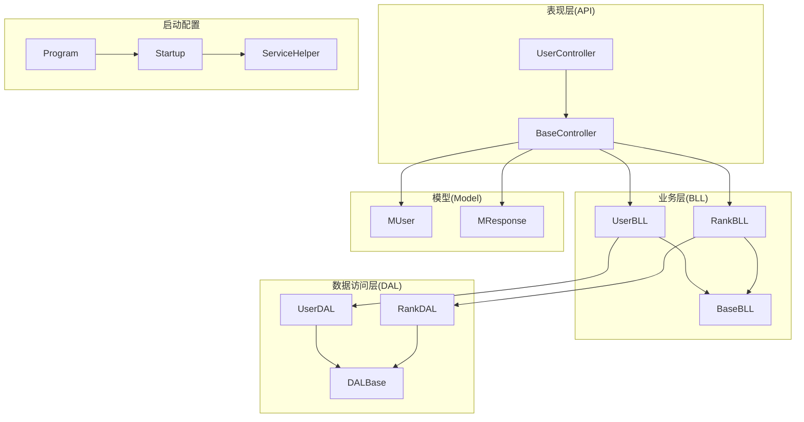
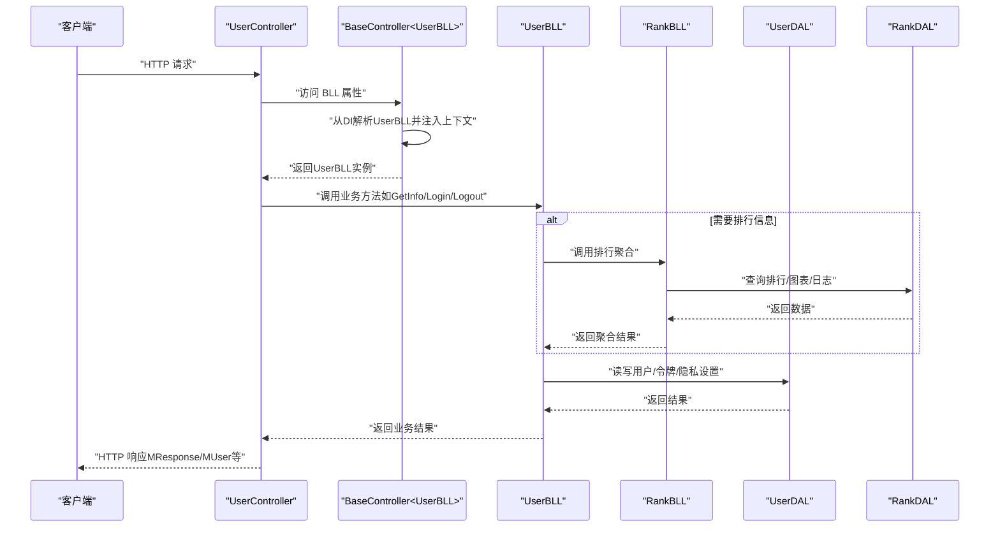
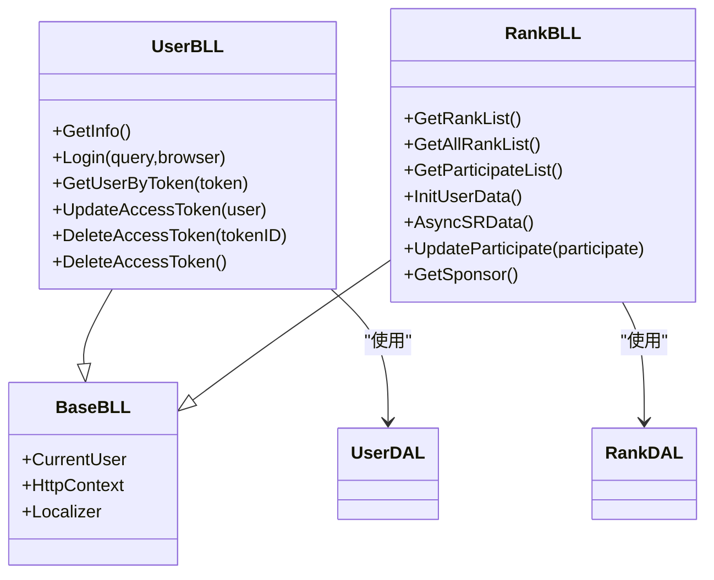
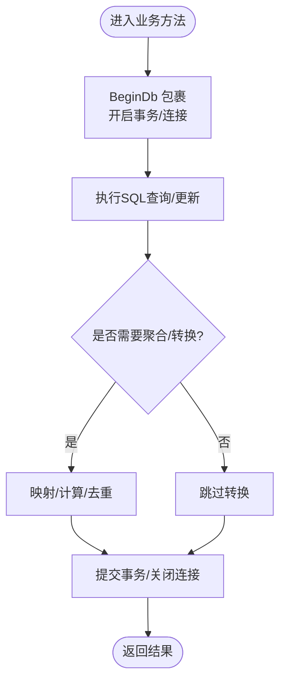
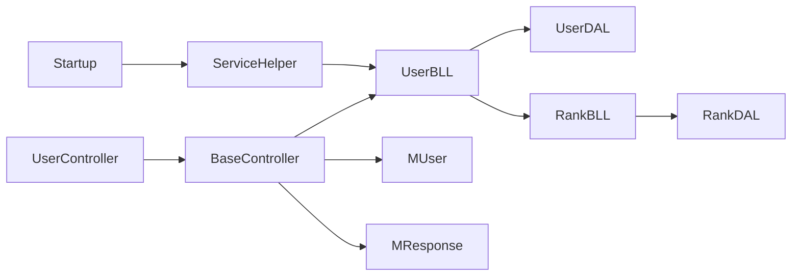

# 分层架构模式

<cite>
**本文引用的文件**
- [Program.cs](file://SpeedRunners.API/SpeedRunners/Program.cs)
- [Startup.cs](file://SpeedRunners.API/SpeedRunners/Startup.cs)
- [BaseController.cs](file://SpeedRunners.API/SpeedRunners/Controllers/BaseController.cs)
- [UserController.cs](file://SpeedRunners.API/SpeedRunners/Controllers/UserController.cs)
- [UserBLL.cs](file://SpeedRunners.API/SpeedRunners.BLL/UserBLL.cs)
- [RankBLL.cs](file://SpeedRunners.API/SpeedRunners.BLL/RankBLL.cs)
- [BaseBLL.cs](file://SpeedRunners.API/SpeedRunners.Utils/BaseBLL.cs)
- [UserDAL.cs](file://SpeedRunners.API/SpeedRunners.DAL/UserDAL.cs)
- [RankDAL.cs](file://SpeedRunners.API/SpeedRunners.DAL/RankDAL.cs)
- [DALBase.cs](file://SpeedRunners.API/SpeedRunners.Utils/DALBase.cs)
- [MUser.cs](file://SpeedRunners.API/SpeedRunners.Model/MUser.cs)
- [MResponse.cs](file://SpeedRunners.API/SpeedRunners.Model/MResponse.cs)
- [ServiceHelper.cs](file://SpeedRunners.API/SpeedRunners/Service/ServiceHelper.cs)
</cite>

## 目录
1. [引言](#引言)
2. [项目结构](#项目结构)
3. [核心组件](#核心组件)
4. [架构总览](#架构总览)
5. [详细组件分析](#详细组件分析)
6. [依赖分析](#依赖分析)
7. [性能考虑](#性能考虑)
8. [故障排查指南](#故障排查指南)
9. [结论](#结论)
10. [附录](#附录)

## 引言
本文件面向 SpeedRunnersLab 的分层架构设计与实现，重点阐述 MVC 变体在该系统中的落地方式：表现层（Controllers）、业务层（BLL）、数据访问层（DAL）、模型层（Model）。文档将说明各层职责、接口契约、依赖关系与数据传递机制，并结合实际代码路径给出调用链路图与流程图，帮助读者快速理解从控制器到数据库的完整执行路径。同时总结分层架构在可维护性、可测试性与可扩展性方面的优势。

## 项目结构
SpeedRunnersLab 采用多项目分层组织，API 层负责请求入口与中间件管线；BLL 层承载业务规则与流程编排；DAL 层封装数据库访问；Model 层提供领域数据结构；Utils 提供通用基础设施（如 BaseBLL、DALBase、DbHelper 等）。

图表来源
- [Program.cs](file://SpeedRunners.API/SpeedRunners/Program.cs#L1-L33)
- [Startup.cs](file://SpeedRunners.API/SpeedRunners/Startup.cs#L1-L87)
- [BaseController.cs](file://SpeedRunners.API/SpeedRunners/Controllers/BaseController.cs#L1-L26)
- [UserController.cs](file://SpeedRunners.API/SpeedRunners/Controllers/UserController.cs#L1-L58)
- [UserBLL.cs](file://SpeedRunners.API/SpeedRunners.BLL/UserBLL.cs#L1-L153)
- [RankBLL.cs](file://SpeedRunners.API/SpeedRunners.BLL/RankBLL.cs#L1-L210)
- [BaseBLL.cs](file://SpeedRunners.API/SpeedRunners.Utils/BaseBLL.cs#L1-L17)
- [UserDAL.cs](file://SpeedRunners.API/SpeedRunners.DAL/UserDAL.cs#L1-L85)
- [RankDAL.cs](file://SpeedRunners.API/SpeedRunners.DAL/RankDAL.cs#L1-L175)
- [DALBase.cs](file://SpeedRunners.API/SpeedRunners.Utils/DALBase.cs#L1-L13)
- [MUser.cs](file://SpeedRunners.API/SpeedRunners.Model/MUser.cs#L1-L35)
- [MResponse.cs](file://SpeedRunners.API/SpeedRunners.Model/MResponse.cs#L1-L42)
- [ServiceHelper.cs](file://SpeedRunners.API/SpeedRunners/Service/ServiceHelper.cs#L1-L26)

章节来源
- [Program.cs](file://SpeedRunners.API/SpeedRunners/Program.cs#L1-L33)
- [Startup.cs](file://SpeedRunners.API/SpeedRunners/Startup.cs#L1-L87)

## 核心组件
- 表现层（Controllers）
  - BaseController<TBLL>：泛型基类，负责从 DI 容器解析 TBLL 实例，注入当前用户上下文与本地化资源，统一为子控制器提供 BLL 访问入口。
  - UserController：继承 BaseController<UserBLL>，暴露具体 API 动作，如获取隐私设置、登录、登出等。
- 业务层（BLL）
  - BaseBLL：抽象基类，提供 CurrentUser、HttpContext、Localizer 等通用能力。
  - UserBLL：封装用户相关业务，如登录校验、令牌管理、隐私设置、状态与等级类型设置等。
  - RankBLL：封装排行、参与度、赞助商等业务，协调 Steam 数据与数据库更新。
- 数据访问层（DAL）
  - DALBase：抽象基类，持有 DbHelper，统一数据库操作入口。
  - UserDAL：封装 AccessToken、PrivacySettings、RankInfo 等表的读写。
  - RankDAL：封装排行列表、图表统计、日志记录等查询与更新。
- 模型层（Model）
  - MUser：当前登录用户上下文实体。
  - MResponse：统一响应结构，支持泛型包装与静态工厂方法。

章节来源
- [BaseController.cs](file://SpeedRunners.API/SpeedRunners/Controllers/BaseController.cs#L1-L26)
- [UserController.cs](file://SpeedRunners.API/SpeedRunners/Controllers/UserController.cs#L1-L58)
- [BaseBLL.cs](file://SpeedRunners.API/SpeedRunners.Utils/BaseBLL.cs#L1-L17)
- [UserBLL.cs](file://SpeedRunners.API/SpeedRunners.BLL/UserBLL.cs#L1-L153)
- [RankBLL.cs](file://SpeedRunners.API/SpeedRunners.BLL/RankBLL.cs#L1-L210)
- [DALBase.cs](file://SpeedRunners.API/SpeedRunners.Utils/DALBase.cs#L1-L13)
- [UserDAL.cs](file://SpeedRunners.API/SpeedRunners.DAL/UserDAL.cs#L1-L85)
- [RankDAL.cs](file://SpeedRunners.API/SpeedRunners.DAL/RankDAL.cs#L1-L175)
- [MUser.cs](file://SpeedRunners.API/SpeedRunners.Model/MUser.cs#L1-L35)
- [MResponse.cs](file://SpeedRunners.API/SpeedRunners.Model/MResponse.cs#L1-L42)

## 架构总览
下图展示了从客户端请求到数据库的完整调用链路，体现典型的分层解耦与依赖注入：

图表来源
- [UserController.cs](file://SpeedRunners.API/SpeedRunners/Controllers/UserController.cs#L1-L58)
- [BaseController.cs](file://SpeedRunners.API/SpeedRunners/Controllers/BaseController.cs#L1-L26)
- [UserBLL.cs](file://SpeedRunners.API/SpeedRunners.BLL/UserBLL.cs#L1-L153)
- [RankBLL.cs](file://SpeedRunners.API/SpeedRunners.BLL/RankBLL.cs#L1-L210)
- [UserDAL.cs](file://SpeedRunners.API/SpeedRunners.DAL/UserDAL.cs#L1-L85)
- [RankDAL.cs](file://SpeedRunners.API/SpeedRunners.DAL/RankDAL.cs#L1-L175)
- [MResponse.cs](file://SpeedRunners.API/SpeedRunners.Model/MResponse.cs#L1-L42)
- [MUser.cs](file://SpeedRunners.API/SpeedRunners.Model/MUser.cs#L1-L35)

## 详细组件分析

### 表现层（Controllers）
- BaseController<TBLL> 泛型基类
  - 通过 HttpContext.RequestServices 解析 TBLL 实例，延迟初始化，避免重复创建。
  - 注入 IStringLocalizer<TBLL> 以支持多语言。
  - 将 MUser 注入到 BLL.CurrentUser，便于后续业务判断与权限控制。
- UserController
  - 继承 BaseController<UserBLL>，直接暴露业务方法，如 GetInfo、GetPrivacySettings、Set*、Login、Logout*。
  - 使用路由约定与特性标注（如 [User]）进行权限约束与参数绑定。

章节来源
- [BaseController.cs](file://SpeedRunners.API/SpeedRunners/Controllers/BaseController.cs#L1-L26)
- [UserController.cs](file://SpeedRunners.API/SpeedRunners/Controllers/UserController.cs#L1-L58)

### 业务层（BLL）
- BaseBLL 抽象基类
  - 提供 CurrentUser、HttpContext、Localizer 字段，作为所有业务类的通用上下文。
- UserBLL
  - 登录流程：通过 Steam OpenID 校验，生成令牌并持久化到 AccessToken。
  - 令牌校验：根据过期策略与额外令牌机制判断有效性。
  - 隐私设置与状态/等级类型设置：通过 BeginDb 块封装事务与数据访问。
  - 与 RankBLL 协作：获取用户排行信息。
- RankBLL
  - 提供排行列表、参与度、图表（新增分数、小时数）等聚合查询。
  - 初始化用户数据：拉取 Steam 数据，合并 RankInfo 与 RankLog。
  - 异步同步 SR 数据：根据拥有情况或已有分数更新 RankInfo 并记录日志。

图表来源
- [BaseBLL.cs](file://SpeedRunners.API/SpeedRunners.Utils/BaseBLL.cs#L1-L17)
- [UserBLL.cs](file://SpeedRunners.API/SpeedRunners.BLL/UserBLL.cs#L1-L153)
- [RankBLL.cs](file://SpeedRunners.API/SpeedRunners.BLL/RankBLL.cs#L1-L210)
- [UserDAL.cs](file://SpeedRunners.API/SpeedRunners.DAL/UserDAL.cs#L1-L85)
- [RankDAL.cs](file://SpeedRunners.API/SpeedRunners.DAL/RankDAL.cs#L1-L175)

章节来源
- [BaseBLL.cs](file://SpeedRunners.API/SpeedRunners.Utils/BaseBLL.cs#L1-L17)
- [UserBLL.cs](file://SpeedRunners.API/SpeedRunners.BLL/UserBLL.cs#L1-L153)
- [RankBLL.cs](file://SpeedRunners.API/SpeedRunners.BLL/RankBLL.cs#L1-L210)

### 数据访问层（DAL）
- DALBase
  - 持有 DbHelper，统一执行 SQL 查询、插入、更新、删除与事务控制。
- UserDAL
  - 隐私设置初始化与更新、状态/等级类型设置、令牌查询/更新/删除。
- RankDAL
  - 排行列表、参与度列表、图表统计（新增分数、周游玩时长）、日志插入、赞助商查询。
  - 名称去重辅助逻辑，用于同名玩家显示差异化后缀。

图表来源
- [UserDAL.cs](file://SpeedRunners.API/SpeedRunners.DAL/UserDAL.cs#L1-L85)
- [RankDAL.cs](file://SpeedRunners.API/SpeedRunners.DAL/RankDAL.cs#L1-L175)
- [DALBase.cs](file://SpeedRunners.API/SpeedRunners.Utils/DALBase.cs#L1-L13)

章节来源
- [DALBase.cs](file://SpeedRunners.API/SpeedRunners.Utils/DALBase.cs#L1-L13)
- [UserDAL.cs](file://SpeedRunners.API/SpeedRunners.DAL/UserDAL.cs#L1-L85)
- [RankDAL.cs](file://SpeedRunners.API/SpeedRunners.DAL/RankDAL.cs#L1-L175)

### 模型层（Model）
- MUser：当前登录用户上下文，包含 TokenID、PlatformID、RankID（基于 PlatformID 计算）、Browser、Token、LoginDate 等字段。
- MResponse：统一响应结构，提供 Success/Fail 工厂方法与泛型包装类 MResponse<T>，配合控制器返回一致的响应格式。

章节来源
- [MUser.cs](file://SpeedRunners.API/SpeedRunners.Model/MUser.cs#L1-L35)
- [MResponse.cs](file://SpeedRunners.API/SpeedRunners.Model/MResponse.cs#L1-L42)

### 启动与依赖注入
- Program：配置日志与宿主，默认使用 Startup。
- Startup：注册 CORS、全局过滤器、本地化、批量注册 BLL、注册 MUser 作用域服务、配置 Kestrel 同步 IO、设置代理。
- ServiceHelper：扫描程序集，批量注册所有实现了 BaseBLL 的具体 BLL 类型为 Scoped。

章节来源
- [Program.cs](file://SpeedRunners.API/SpeedRunners/Program.cs#L1-L33)
- [Startup.cs](file://SpeedRunners.API/SpeedRunners/Startup.cs#L1-L87)
- [ServiceHelper.cs](file://SpeedRunners.API/SpeedRunners/Service/ServiceHelper.cs#L1-L26)

## 依赖分析
- 控制器依赖 BLL：通过 BaseController<TBLL> 从 DI 解析，避免硬编码依赖。
- BLL 依赖 DAL：业务方法内部组合 DAL 实例完成数据读写。
- 上下文注入：BaseController 将 MUser、Localizer、HttpContext 注入到 BLL，确保业务方法具备必要的运行时信息。
- 批量注册：Startup 中通过 ServiceHelper 扫描并注册所有 BLL 类型，降低重复配置成本。

图表来源
- [BaseController.cs](file://SpeedRunners.API/SpeedRunners/Controllers/BaseController.cs#L1-L26)
- [UserController.cs](file://SpeedRunners.API/SpeedRunners/Controllers/UserController.cs#L1-L58)
- [UserBLL.cs](file://SpeedRunners.API/SpeedRunners.BLL/UserBLL.cs#L1-L153)
- [RankBLL.cs](file://SpeedRunners.API/SpeedRunners.BLL/RankBLL.cs#L1-L210)
- [UserDAL.cs](file://SpeedRunners.API/SpeedRunners.DAL/UserDAL.cs#L1-L85)
- [RankDAL.cs](file://SpeedRunners.API/SpeedRunners.DAL/RankDAL.cs#L1-L175)
- [MUser.cs](file://SpeedRunners.API/SpeedRunners.Model/MUser.cs#L1-L35)
- [MResponse.cs](file://SpeedRunners.API/SpeedRunners.Model/MResponse.cs#L1-L42)
- [Startup.cs](file://SpeedRunners.API/SpeedRunners/Startup.cs#L1-L87)
- [ServiceHelper.cs](file://SpeedRunners.API/SpeedRunners/Service/ServiceHelper.cs#L1-L26)

章节来源
- [Startup.cs](file://SpeedRunners.API/SpeedRunners/Startup.cs#L1-L87)
- [ServiceHelper.cs](file://SpeedRunners.API/SpeedRunners/Service/ServiceHelper.cs#L1-L26)

## 性能考虑
- 延迟初始化：BaseController 对 BLL 使用 Lazy<T>，减少不必要的实例化开销。
- 批量注册：ServiceHelper 扫描注册，避免逐项重复配置。
- 事务封装：BLL 内部使用 BeginDb 统一封装事务，减少重复样板代码。
- SQL 参数化：DAL 层使用参数化查询，降低注入风险并提升缓存命中率。
- 日志与中间件：Startup 中配置日志与中间件顺序，有助于定位性能瓶颈与错误路径。

## 故障排查指南
- 登录失败/超时
  - 现象：Login 返回特定失败码或超时提示。
  - 排查：检查 Steam OpenID 校验、网络代理、令牌生成与存储逻辑。
  - 参考路径：[UserBLL.Login](file://SpeedRunners.API/SpeedRunners.BLL/UserBLL.cs#L60-L93)
- 权限不足/低权限
  - 现象：LogoutOther 返回权限错误或低权限提示。
  - 排查：核对 CurrentUser.PlatformID 与目标 TokenID 所属用户是否一致，以及登录时间比较逻辑。
  - 参考路径：[UserBLL.DeleteAccessToken(tokenID)](file://SpeedRunners.API/SpeedRunners.BLL/UserBLL.cs#L121-L141)
- 隐私设置未生效
  - 现象：设置 ShowWeekPlayTime/RequestRankData/ShowAddScore 后查询仍为旧值。
  - 排查：确认初始化逻辑与条件分支，检查 SQL 更新语句是否覆盖了关联字段。
  - 参考路径：[UserDAL.SetPrivacySettings/SetStateOrRankType](file://SpeedRunners.API/SpeedRunners.DAL/UserDAL.cs#L42-L51)
- 图表数据为空
  - 现象：新增分数/周游玩时长图表为空。
  - 排查：确认 RankLog 是否存在、时间范围是否正确、隐私设置是否屏蔽显示。
  - 参考路径：[RankDAL.GetAddedChart/GetHourChart](file://SpeedRunners.API/SpeedRunners.DAL/RankDAL.cs#L44-L92)

章节来源
- [UserBLL.cs](file://SpeedRunners.API/SpeedRunners.BLL/UserBLL.cs#L60-L153)
- [UserDAL.cs](file://SpeedRunners.API/SpeedRunners.DAL/UserDAL.cs#L42-L82)
- [RankDAL.cs](file://SpeedRunners.API/SpeedRunners.DAL/RankDAL.cs#L44-L92)

## 结论
SpeedRunnersLab 的分层架构通过清晰的职责划分与依赖注入，实现了表现层与业务层、数据层的松耦合。控制器仅负责请求接入与参数绑定，业务层集中封装业务规则与流程，数据层专注于数据持久化与查询优化。该架构在可维护性（职责单一）、可测试性（依赖注入与抽象基类）、可扩展性（新增 BLL/DAL/模型无需改动上层）方面具有显著优势。

## 附录
- DTO 设计建议
  - 在业务层与表现层之间引入轻量 DTO，用于序列化与跨层传输，避免直接暴露 Model 实体细节。
  - 对于复杂查询结果（如排行榜、图表），可定义专门的 DTO（如 MRankInfo、MParticipateList）以适配前端渲染。
  - 对外响应统一使用 MResponse/MResponse<T>，保证一致性与可扩展性。