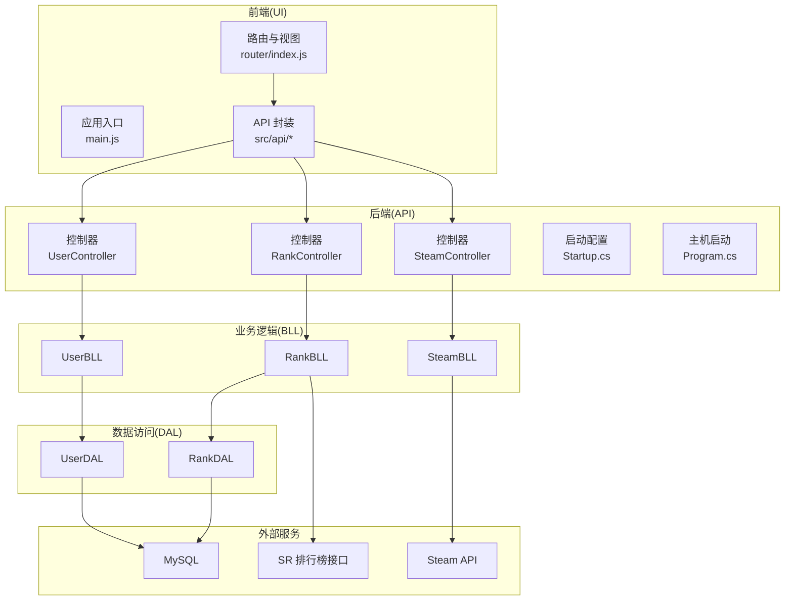
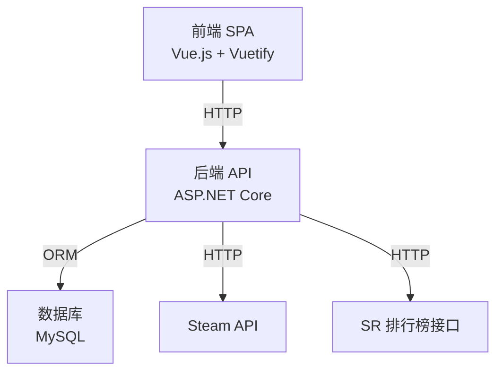
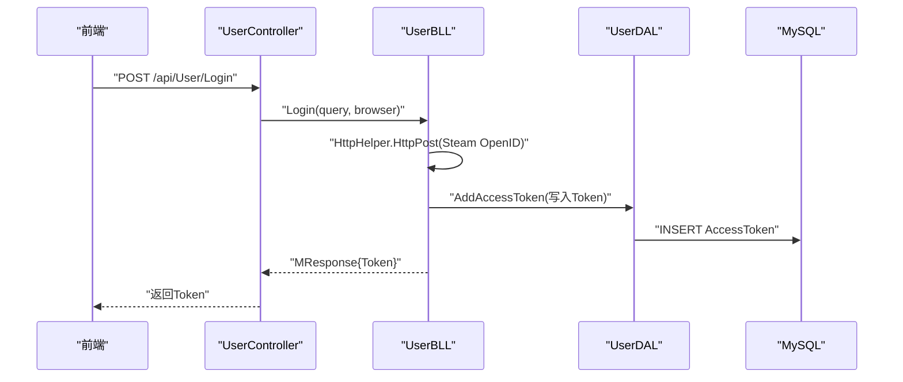
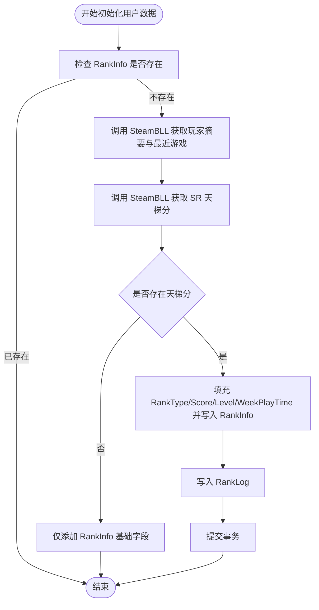
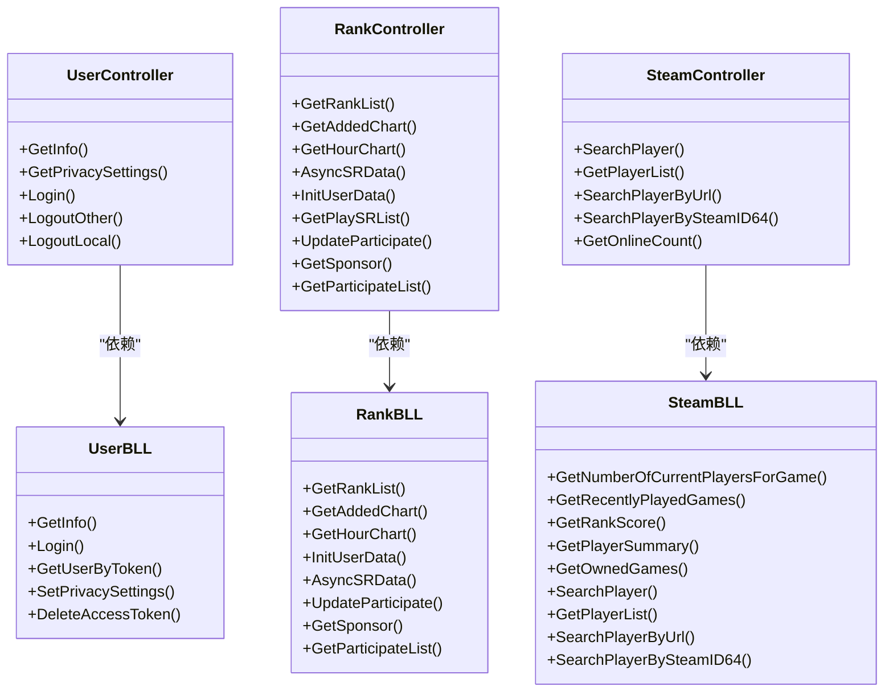
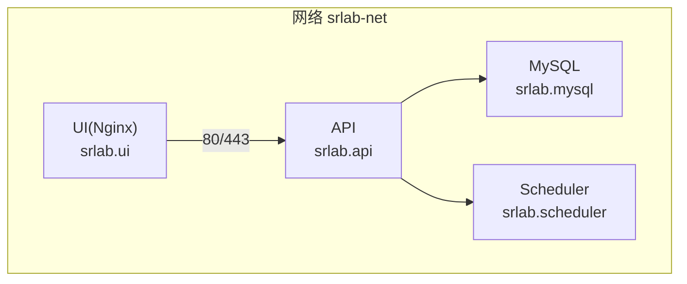

# 整体架构设计

<cite>
**本文引用的文件**
- [README.md](file://README.md)
- [docker-compose.yml](file://docker-compose.yml)
- [Startup.cs](file://SpeedRunners.API/SpeedRunners/Startup.cs)
- [Program.cs](file://SpeedRunners.API/SpeedRunners/Program.cs)
- [UserController.cs](file://SpeedRunners.API/SpeedRunners/Controllers/UserController.cs)
- [RankController.cs](file://SpeedRunners.API/SpeedRunners/Controllers/RankController.cs)
- [SteamController.cs](file://SpeedRunners.API/SpeedRunners/Controllers/SteamController.cs)
- [UserBLL.cs](file://SpeedRunners.API/SpeedRunners.BLL/UserBLL.cs)
- [RankBLL.cs](file://SpeedRunners.API/SpeedRunners.BLL/RankBLL.cs)
- [SteamBLL.cs](file://SpeedRunners.API/SpeedRunners.BLL/SteamBLL.cs)
- [UserDAL.cs](file://SpeedRunners.API/SpeedRunners.DAL/UserDAL.cs)
- [RankDAL.cs](file://SpeedRunners.API/SpeedRunners.DAL/RankDAL.cs)
- [main.js](file://SpeedRunners.UI/src/main.js)
- [router/index.js](file://SpeedRunners.UI/src/router/index.js)
- [package.json](file://SpeedRunners.UI/package.json)
</cite>

## 目录
1. [引言](#引言)
2. [项目结构](#项目结构)
3. [核心组件](#核心组件)
4. [架构总览](#架构总览)
5. [详细组件分析](#详细组件分析)
6. [依赖关系分析](#依赖关系分析)
7. [性能考虑](#性能考虑)
8. [故障排查指南](#故障排查指南)
9. [结论](#结论)
10. [附录](#附录)

## 引言
本项目为 SpeedRunnersLab 的整体架构设计文档，目标是清晰阐述三层架构模式（表现层/API 层、业务逻辑层/BLL 层、数据访问层/DAL 层），说明前后端分离（Vue.js 前端单页应用与 ASP.NET Core API 后端）协作方式，给出微服务化设计思路与服务边界划分，并重点描述四大核心组件：用户管理服务、数据统计服务、MOD 管理服务、Steam 集成功能。文档同时提供系统架构图与部署拓扑图，帮助读者快速理解数据流向与组件间通信机制。

## 项目结构
项目采用多模块分层组织：
- 表现层/前端：基于 Vue.js 的单页应用（SPA），负责页面渲染、路由导航、状态管理与 API 请求封装。
- API 层：ASP.NET Core 控制器层，暴露 RESTful 接口，统一过滤与中间件处理。
- 业务逻辑层（BLL）：封装业务规则与流程编排，协调 DAL 与外部服务。
- 数据访问层（DAL）：封装数据库操作，提供数据持久化能力。
- 定时任务调度：独立的调度服务，用于周期性拉取与同步数据。
- 部署：通过 Docker Compose 编排 MySQL、API、UI（Nginx 反向代理静态资源）、调度服务等服务。

图表来源
- [router/index.js](file://SpeedRunners.UI/src/router/index.js#L1-L133)
- [main.js](file://SpeedRunners.UI/src/main.js#L1-L30)
- [UserController.cs](file://SpeedRunners.API/SpeedRunners/Controllers/UserController.cs#L1-L58)
- [RankController.cs](file://SpeedRunners.API/SpeedRunners/Controllers/RankController.cs#L1-L48)
- [SteamController.cs](file://SpeedRunners.API/SpeedRunners/Controllers/SteamController.cs#L1-L28)
- [Startup.cs](file://SpeedRunners.API/SpeedRunners/Startup.cs#L1-L87)
- [Program.cs](file://SpeedRunners.API/SpeedRunners/Program.cs#L1-L33)
- [UserBLL.cs](file://SpeedRunners.API/SpeedRunners.BLL/UserBLL.cs#L1-L153)
- [RankBLL.cs](file://SpeedRunners.API/SpeedRunners.BLL/RankBLL.cs#L1-L210)
- [SteamBLL.cs](file://SpeedRunners.API/SpeedRunners.BLL/SteamBLL.cs#L1-L448)
- [UserDAL.cs](file://SpeedRunners.API/SpeedRunners.DAL/UserDAL.cs#L1-L85)
- [RankDAL.cs](file://SpeedRunners.API/SpeedRunners.DAL/RankDAL.cs#L1-L175)

章节来源
- [README.md](file://README.md#L1-L5)
- [docker-compose.yml](file://docker-compose.yml#L1-L59)

## 核心组件
- 用户管理服务：负责用户登录、令牌校验、隐私设置、会话管理与多端登出。
- 数据统计服务：提供排行榜、周增分排行、周游玩时长排行、参与度统计、赞助商信息等。
- MOD 管理服务：提供 MOD 列表与详情展示，支持分页参数与筛选。
- Steam 集成：对接 Steam 社区与统计 API，实现玩家搜索、游戏时长、在线人数、个人统计数据查询与本地化翻译。

章节来源
- [UserBLL.cs](file://SpeedRunners.API/SpeedRunners.BLL/UserBLL.cs#L1-L153)
- [RankBLL.cs](file://SpeedRunners.API/SpeedRunners.BLL/RankBLL.cs#L1-L210)
- [SteamBLL.cs](file://SpeedRunners.API/SpeedRunners.BLL/SteamBLL.cs#L1-L448)
- [RankController.cs](file://SpeedRunners.API/SpeedRunners/Controllers/RankController.cs#L1-L48)
- [SteamController.cs](file://SpeedRunners.API/SpeedRunners/Controllers/SteamController.cs#L1-L28)

## 架构总览
系统采用前后端分离架构：
- 前端：Vue.js SPA，通过 axios 发起 HTTP 请求，路由由 Vue Router 管理，状态由 Vuex 管理，国际化由 vue-i18n 提供。
- 后端：ASP.NET Core MVC，统一注册 CORS、全局异常过滤器、响应过滤器、本地化与自定义认证中间件，映射控制器方法为 RESTful 接口。
- 数据库：MySQL，BLL 层通过 DAL 访问，使用 Dapper 等 ORM 工具进行 SQL 映射。
- 外部集成：Steam API 与 SR 排行榜接口，BLL 层负责聚合与缓存策略。
- 部署：Docker Compose 编排，MySQL、API、UI（Nginx）与调度服务分别容器化运行，网络互通。

图表来源
- [package.json](file://SpeedRunners.UI/package.json#L15-L76)
- [Startup.cs](file://SpeedRunners.API/SpeedRunners/Startup.cs#L33-L62)
- [UserBLL.cs](file://SpeedRunners.API/SpeedRunners.BLL/UserBLL.cs#L60-L93)
- [RankBLL.cs](file://SpeedRunners.API/SpeedRunners.BLL/RankBLL.cs#L102-L155)
- [SteamBLL.cs](file://SpeedRunners.API/SpeedRunners.BLL/SteamBLL.cs#L28-L82)

## 详细组件分析

### 用户管理服务（UserBLL）
- 关键职责
  - 登录流程：通过 Steam OpenID 校验，生成令牌并写入 AccessToken 表。
  - 令牌校验：根据 Token 查询用户信息，支持主 Token 与备用 Token（ExToken）刷新策略。
  - 隐私设置：维护 RankInfo 与 PrivacySettings 的联动更新。
  - 会话管理：支持本地登出与远程登出（按 TokenID 删除其他设备会话）。
- 数据流
  - 前端调用 UserController.Login -> BLL.Login -> Steam/OpenID 校验 -> 写入 AccessToken -> 返回 Token。
  - 前端携带 Token 访问受保护接口 -> 中间件解析 Token -> 设置 CurrentUser -> 执行业务逻辑。
- 错误处理
  - 登录超时返回特定错误码；权限不足与低权限场景返回明确提示；令牌过期或无效返回空值。

图表来源
- [UserController.cs](file://SpeedRunners.API/SpeedRunners/Controllers/UserController.cs#L42-L47)
- [UserBLL.cs](file://SpeedRunners.API/SpeedRunners.BLL/UserBLL.cs#L60-L93)
- [UserDAL.cs](file://SpeedRunners.API/SpeedRunners.DAL/UserDAL.cs#L63-L67)

章节来源
- [UserBLL.cs](file://SpeedRunners.API/SpeedRunners.BLL/UserBLL.cs#L1-L153)
- [UserDAL.cs](file://SpeedRunners.API/SpeedRunners.DAL/UserDAL.cs#L1-L85)
- [UserController.cs](file://SpeedRunners.API/SpeedRunners/Controllers/UserController.cs#L1-L58)

### 数据统计服务（RankBLL + SteamBLL）
- 关键职责
  - 排行榜：提供全量/活跃/参与度等榜单查询。
  - 周增分排行与周游玩时长排行：结合 RankLog 与 RankInfo 计算并返回结果。
  - 用户初始化：首次进入时从 Steam 与 SR 排行榜接口拉取用户信息并入库。
  - 异步数据同步：周期性更新用户天梯分与日志。
  - Steam 集成：获取最近游戏、拥有游戏、玩家摘要、在线人数、玩家搜索等。
- 数据流
  - RankBLL.InitUserData -> SteamBLL.GetRankScore + GetPlayerSummary + GetRecentlyPlayedGames -> 写入 RankInfo 与 RankLog。
  - RankBLL.AsyncSRData -> SteamBLL.GetOwnedGames + GetRankScore -> 更新 RankInfo 并写入 RankLog。
  - SteamBLL.SearchPlayer -> 并行尝试多种搜索策略，优先返回游戏信息，否则返回玩家列表。
- 性能与复杂度
  - 分组批量请求 SR 排行榜接口，避免单次请求过大。
  - 使用事务保证 RankInfo 与 RankLog 的一致性写入。

图表来源
- [RankBLL.cs](file://SpeedRunners.API/SpeedRunners.BLL/RankBLL.cs#L102-L155)
- [SteamBLL.cs](file://SpeedRunners.API/SpeedRunners.BLL/SteamBLL.cs#L89-L106)

章节来源
- [RankBLL.cs](file://SpeedRunners.API/SpeedRunners.BLL/RankBLL.cs#L1-L210)
- [RankDAL.cs](file://SpeedRunners.API/SpeedRunners.DAL/RankDAL.cs#L1-L175)
- [SteamBLL.cs](file://SpeedRunners.API/SpeedRunners.BLL/SteamBLL.cs#L1-L448)

### MOD 管理服务
- 当前实现要点
  - MOD 列表与分页参数模型位于 Model 层，控制器与 BLL 层预留了相关实体与参数类型，便于后续扩展。
  - 前端提供 MOD 页面与详情页，配合资产上传与展示功能。
- 设计建议
  - 建议将 MOD 上传与元数据管理拆分为独立服务，包含版本控制、审核流程与 CDN 分发。
  - 与用户管理服务解耦，通过鉴权与权限控制保障资源安全。

章节来源
- [RankController.cs](file://SpeedRunners.API/SpeedRunners/Controllers/RankController.cs#L1-L48)
- [RankBLL.cs](file://SpeedRunners.API/SpeedRunners.BLL/RankBLL.cs#L1-L210)

### Steam 集成
- 功能范围
  - 在线人数查询、玩家搜索（昵称/CustomURL/SteamID64）、玩家列表分页、游戏统计本地化。
- 实现策略
  - 使用 SteamWebAPI2 客户端访问官方 API；对中文统计名称进行本地化映射。
  - 对玩家搜索采用并行策略，优先返回游戏统计信息，否则回退到玩家列表。

章节来源
- [SteamBLL.cs](file://SpeedRunners.API/SpeedRunners.BLL/SteamBLL.cs#L1-L448)
- [SteamController.cs](file://SpeedRunners.API/SpeedRunners/Controllers/SteamController.cs#L1-L28)

## 依赖关系分析
- 控制器到业务层：每个控制器均继承 BaseController<T>，通过依赖注入获取对应 BLL 实例，遵循单一职责与依赖倒置原则。
- 业务层到数据层：BLL 通过 DAL 访问数据库，使用 BeginDb/事务封装保证一致性。
- 外部依赖：Steam API 与 SR 排行榜接口，BLL 层负责聚合与缓存策略，降低前端复杂度。
- 前后端通信：前端通过 axios 调用后端 REST 接口，后端通过中间件与过滤器统一处理请求与响应。

图表来源
- [UserController.cs](file://SpeedRunners.API/SpeedRunners/Controllers/UserController.cs#L1-L58)
- [RankController.cs](file://SpeedRunners.API/SpeedRunners/Controllers/RankController.cs#L1-L48)
- [SteamController.cs](file://SpeedRunners.API/SpeedRunners/Controllers/SteamController.cs#L1-L28)
- [UserBLL.cs](file://SpeedRunners.API/SpeedRunners.BLL/UserBLL.cs#L1-L153)
- [RankBLL.cs](file://SpeedRunners.API/SpeedRunners.BLL/RankBLL.cs#L1-L210)
- [SteamBLL.cs](file://SpeedRunners.API/SpeedRunners.BLL/SteamBLL.cs#L1-L448)

## 性能考虑
- 数据库层面
  - 使用事务保证 RankInfo 与 RankLog 的一致性写入，减少脏读与丢失更新风险。
  - 排行榜查询使用索引友好的条件与排序，必要时引入分页与缓存。
- 接口层面
  - Steam 搜索采用并行策略，优先返回关键信息，缩短首屏等待时间。
  - SR 排行榜接口按批次分组请求，避免单次请求超时。
- 前端层面
  - 使用路由懒加载与按需加载，减少首屏体积。
  - 图表与图片资源采用 CDN 与压缩策略，提升加载速度。

## 故障排查指南
- 登录失败
  - 检查 Steam OpenID 校验返回内容与超时设置；确认 Token 写入成功且前端正确接收。
- 权限错误
  - 确认中间件已解析 Token 并设置 CurrentUser；核对删除会话时的平台 ID 与登录时间比较逻辑。
- 数据未更新
  - 检查 RankBLL.AsyncSRData 与 InitUserData 的触发时机；确认 Steam API 与 SR 排行榜接口可用性。
- 排行榜为空
  - 核对 RankInfo 中 RankType 过滤条件与隐私设置中的显示开关；检查数据库中是否存在数据。

章节来源
- [UserBLL.cs](file://SpeedRunners.API/SpeedRunners.BLL/UserBLL.cs#L121-L150)
- [RankBLL.cs](file://SpeedRunners.API/SpeedRunners.BLL/RankBLL.cs#L161-L191)
- [RankDAL.cs](file://SpeedRunners.API/SpeedRunners.DAL/RankDAL.cs#L32-L42)

## 结论
本架构以三层分离为核心，前后端通过 REST 接口协作，业务层承担编排与聚合职责，数据层专注持久化。用户管理、数据统计、MOD 管理与 Steam 集成四大组件覆盖主要业务场景。建议在现有基础上进一步细化服务边界，引入独立的 MOD 管理与定时同步服务，增强可扩展性与可维护性。

## 附录

### 部署拓扑图

图表来源
- [docker-compose.yml](file://docker-compose.yml#L3-L59)

### 前端技术栈与入口
- 技术栈：Vue 2.x、Vuetify、Vuex、Vue Router、axios、vue-i18n。
- 应用入口：main.js 初始化插件与全局配置，router/index.js 定义路由表。

章节来源
- [package.json](file://SpeedRunners.UI/package.json#L15-L76)
- [main.js](file://SpeedRunners.UI/src/main.js#L1-L30)
- [router/index.js](file://SpeedRunners.UI/src/router/index.js#L1-L133)