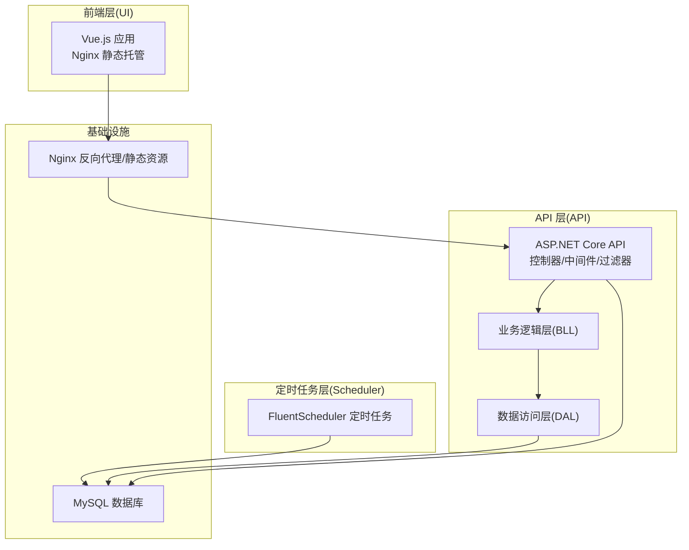
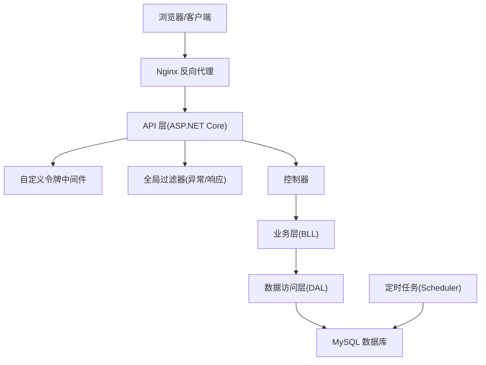
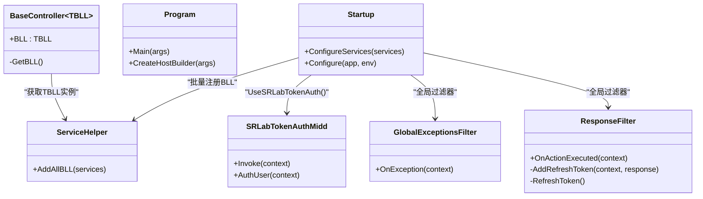
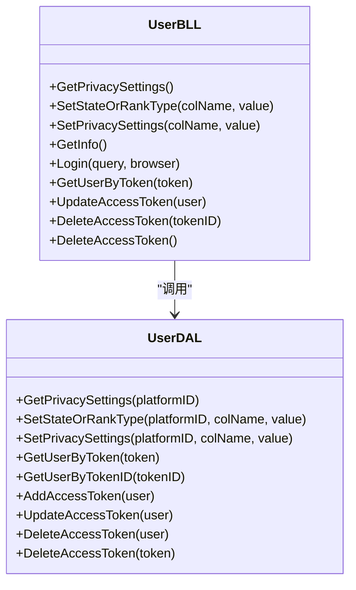
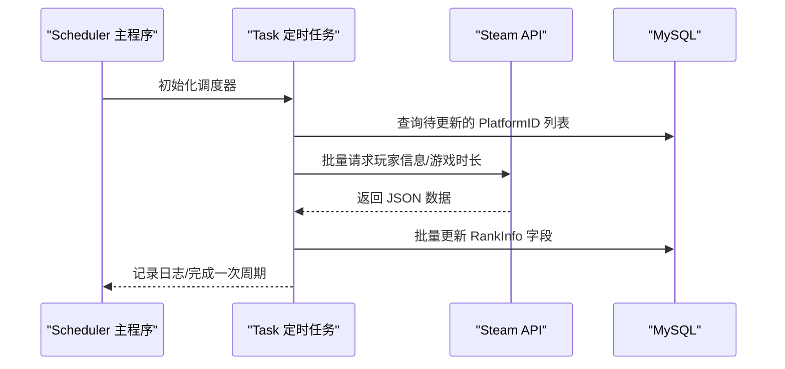
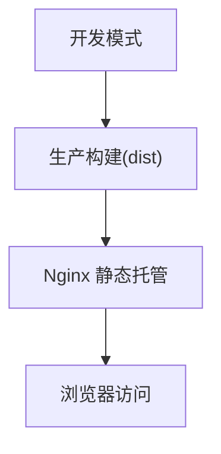
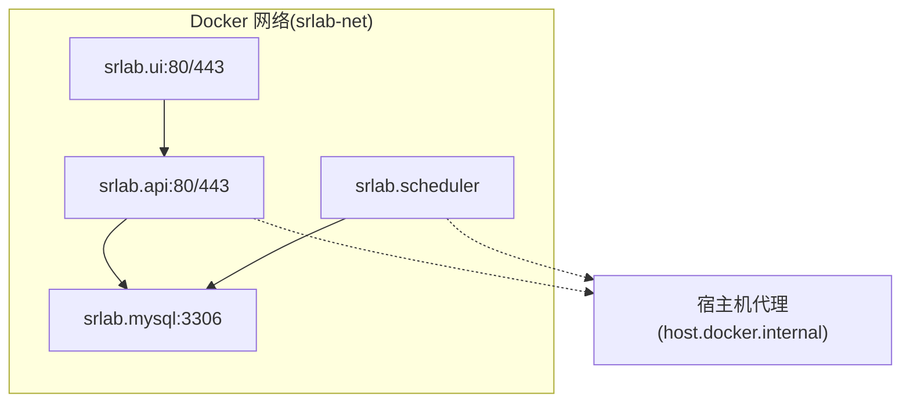
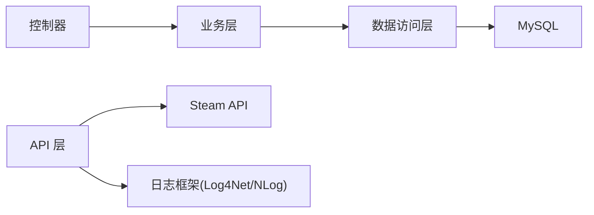

# 系统架构

<cite>
**本文引用的文件**
- [SpeedRunners.API/Startup.cs](file://SpeedRunners.API/SpeedRunners/Startup.cs)
- [SpeedRunners.API/Program.cs](file://SpeedRunners.API/SpeedRunners/Program.cs)
- [SpeedRunners.API/appsettings.json](file://SpeedRunners.API/appsettings.json)
- [SpeedRunners.API/Middleware/SRLabTokenAuthMidd.cs](file://SpeedRunners.API/Middleware/SRLabTokenAuthMidd.cs)
- [SpeedRunners.API/Filter/GlobalExceptionsFilter.cs](file://SpeedRunners.API/Filter/GlobalExceptionsFilter.cs)
- [SpeedRunners.API/Filter/ResponseFilter.cs](file://SpeedRunners.API/Filter/ResponseFilter.cs)
- [SpeedRunners.API/Controllers/BaseController.cs](file://SpeedRunners.API/Controllers/BaseController.cs)
- [SpeedRunners.API/Service/ServiceHelper.cs](file://SpeedRunners.API/Service/ServiceHelper.cs)
- [SpeedRunners.API/Dockerfile](file://SpeedRunners.API/Dockerfile)
- [SpeedRunners.BLL/UserBLL.cs](file://SpeedRunners.API/SpeedRunners.BLL/UserBLL.cs)
- [SpeedRunners.DAL/UserDAL.cs](file://SpeedRunners.API/SpeedRunners.DAL/UserDAL.cs)
- [SpeedRunners.Scheduler/Program.cs](file://SpeedRunners.Scheduler/Program.cs)
- [SpeedRunners.Scheduler/Task.cs](file://SpeedRunners.Scheduler/Task.cs)
- [SpeedRunners.UI/Dockerfile](file://SpeedRunners.UI/Dockerfile)
- [SpeedRunners.UI/vue.config.js](file://SpeedRunners.UI/vue.config.js)
- [docker-compose.yml](file://docker-compose.yml)
</cite>

## 目录
1. [引言](#引言)
2. [项目结构](#项目结构)
3. [核心组件](#核心组件)
4. [架构总览](#架构总览)
5. [详细组件分析](#详细组件分析)
6. [依赖分析](#依赖分析)
7. [性能考量](#性能考量)
8. [故障排查指南](#故障排查指南)
9. [结论](#结论)
10. [附录](#附录)

## 引言
本架构文档面向 SpeedRunnersLab 项目的系统设计与实现，聚焦于前后端分离、微服务化与容器化部署的整体方案。重点阐述 ASP.NET Core API 层、Vue.js 前端层、定时任务调度层的职责边界与协作关系；说明分层架构（表现层、业务层、数据访问层）的设计理念与落地方式；解析中间件体系、过滤器机制与全局异常处理；并给出基于 Docker Compose 的容器化部署架构图与组件交互流程图，最后总结技术选型权衡与性能优化策略。

## 项目结构
项目采用多工程并行组织，按职责划分为三层：
- 表现层（API 层）：ASP.NET Core Web API，负责路由、中间件、过滤器、控制器与统一响应封装。
- 业务层（BLL）：封装领域业务逻辑，协调数据访问与外部服务调用。
- 数据访问层（DAL）：封装数据库操作，提供数据持久化能力。
- 前端层（UI 层）：Vue.js 单页应用，构建后由 Nginx 提供静态资源服务。
- 定时任务层（Scheduler）：独立可执行程序，周期性抓取 Steam 与平台数据并写入数据库。
- 编排与部署：docker-compose 统一编排 MySQL、API、UI、Scheduler 四个服务。

图表来源
- [docker-compose.yml](file://docker-compose.yml#L1-L59)
- [SpeedRunners.API/Startup.cs](file://SpeedRunners.API/SpeedRunners/Startup.cs#L65-L84)
- [SpeedRunners.Scheduler/Task.cs](file://SpeedRunners.Scheduler/Task.cs#L26-L66)

章节来源
- [docker-compose.yml](file://docker-compose.yml#L1-L59)

## 核心组件
- API 层（ASP.NET Core）
  - 启动配置：注册 CORS、本地化、全局过滤器、BLL 服务批量注册、同步 IO 支持等。
  - 中间件链路：路由 -> 跨域 -> 自定义令牌认证 -> 本地化 -> 控制器映射。
  - 控制器基类：通过泛型 BaseBLL 注入当前用户上下文与本地化资源。
- 业务层（BLL）
  - 用户登录、Token 管理、隐私设置、状态与排行类型设置等。
  - 依赖数据访问层与通用工具，封装事务与异常处理。
- 数据访问层（DAL）
  - 针对用户与排行相关表的增删改查，使用参数化 SQL 与 Dapper。
- 前端层（UI）
  - Vue 2.x + Vuetify，构建产物交由 Nginx 提供静态服务。
  - 开发与生产构建配置、资源分包与缓存策略。
- 定时任务层（Scheduler）
  - 使用 FluentScheduler 定时调度，周期抓取 Steam 与平台数据，更新数据库。
- 容器化与编排
  - API、UI、MySQL、Scheduler 分别镜像化，通过 docker-compose 统一网络与端口暴露。

章节来源
- [SpeedRunners.API/Startup.cs](file://SpeedRunners.API/SpeedRunners/Startup.cs#L33-L62)
- [SpeedRunners.API/Controllers/BaseController.cs](file://SpeedRunners.API/Controllers/BaseController.cs#L10-L24)
- [SpeedRunners.BLL/UserBLL.cs](file://SpeedRunners.API/SpeedRunners.BLL/UserBLL.cs#L16-L24)
- [SpeedRunners.DAL/UserDAL.cs](file://SpeedRunners.API/SpeedRunners.DAL/UserDAL.cs#L9-L11)
- [SpeedRunners.UI/vue.config.js](file://SpeedRunners.UI/vue.config.js#L23-L129)
- [SpeedRunners.Scheduler/Task.cs](file://SpeedRunners.Scheduler/Task.cs#L26-L66)
- [docker-compose.yml](file://docker-compose.yml#L1-L59)

## 架构总览
系统采用“前端静态化 + 后端无状态 API + 定时任务离线更新”的组合式架构。API 层作为唯一对外入口，负责鉴权、参数校验、业务编排与统一响应；前端通过 Nginx 提供静态资源与反向代理；定时任务独立运行，避免与在线请求竞争数据库资源；数据库统一由 MySQL 承载。

图表来源
- [SpeedRunners.API/Startup.cs](file://SpeedRunners.API/SpeedRunners/Startup.cs#L65-L84)
- [SpeedRunners.API/Middleware/SRLabTokenAuthMidd.cs](file://SpeedRunners.API/Middleware/SRLabTokenAuthMidd.cs#L31-L47)
- [SpeedRunners.API/Filter/GlobalExceptionsFilter.cs](file://SpeedRunners.API/Filter/GlobalExceptionsFilter.cs#L31-L51)
- [SpeedRunners.API/Filter/ResponseFilter.cs](file://SpeedRunners.API/Filter/ResponseFilter.cs#L24-L50)
- [SpeedRunners.Scheduler/Task.cs](file://SpeedRunners.Scheduler/Task.cs#L26-L66)
- [docker-compose.yml](file://docker-compose.yml#L20-L44)

## 详细组件分析

### API 层（ASP.NET Core）
- 服务注册
  - CORS 策略、全局配置注入、NewtonsoftJson 支持、本地化资源路径、同步 IO 允许。
  - 通过扩展方法批量注册所有 BLL 服务，降低显式注册成本。
- 中间件管线
  - 路由、跨域、自定义令牌认证、本地化、端点映射。
- 过滤器体系
  - 全局异常过滤器：生产环境统一返回结构化错误码与消息，并记录日志。
  - 响应过滤器：统一输出结构、自动刷新 Token 并注入响应头或返回体。
- 控制器基类
  - 泛型 BaseBLL 自动注入当前用户上下文、本地化资源与 HttpContext，减少重复代码。

图表来源
- [SpeedRunners.API/Startup.cs](file://SpeedRunners.API/SpeedRunners/Startup.cs#L33-L62)
- [SpeedRunners.API/Controllers/BaseController.cs](file://SpeedRunners.API/Controllers/BaseController.cs#L10-L24)
- [SpeedRunners.API/Middleware/SRLabTokenAuthMidd.cs](file://SpeedRunners.API/Middleware/SRLabTokenAuthMidd.cs#L31-L101)
- [SpeedRunners.API/Filter/GlobalExceptionsFilter.cs](file://SpeedRunners.API/Filter/GlobalExceptionsFilter.cs#L31-L51)
- [SpeedRunners.API/Filter/ResponseFilter.cs](file://SpeedRunners.API/Filter/ResponseFilter.cs#L24-L111)
- [SpeedRunners.API/Service/ServiceHelper.cs](file://SpeedRunners.API/Service/ServiceHelper.cs#L14-L24)

章节来源
- [SpeedRunners.API/Startup.cs](file://SpeedRunners.API/SpeedRunners/Startup.cs#L33-L84)
- [SpeedRunners.API/Program.cs](file://SpeedRunners.API/SpeedRunners/Program.cs#L9-L31)
- [SpeedRunners.API/Controllers/BaseController.cs](file://SpeedRunners.API/Controllers/BaseController.cs#L10-L24)
- [SpeedRunners.API/Filter/GlobalExceptionsFilter.cs](file://SpeedRunners.API/Filter/GlobalExceptionsFilter.cs#L16-L51)
- [SpeedRunners.API/Filter/ResponseFilter.cs](file://SpeedRunners.API/Filter/ResponseFilter.cs#L14-L113)
- [SpeedRunners.API/Service/ServiceHelper.cs](file://SpeedRunners.API/Service/ServiceHelper.cs#L8-L26)

### 业务层（BLL）与数据访问层（DAL）
- 用户业务（UserBLL）
  - 登录验证（Steam OpenID）、Token 生成与刷新、隐私设置读写、状态与排行类型设置。
  - 依赖 DAL 完成数据库操作，封装 BeginDb 事务模型。
- 数据访问（UserDAL）
  - 针对 AccessToken、RankInfo、PrivacySettings 等表的 CRUD 与联合查询。
  - 使用 Dapper 参数化 SQL，保证安全与性能。

图表来源
- [SpeedRunners.BLL/UserBLL.cs](file://SpeedRunners.API/SpeedRunners.BLL/UserBLL.cs#L16-L152)
- [SpeedRunners.DAL/UserDAL.cs](file://SpeedRunners.API/SpeedRunners.DAL/UserDAL.cs#L9-L84)

章节来源
- [SpeedRunners.BLL/UserBLL.cs](file://SpeedRunners.API/SpeedRunners.BLL/UserBLL.cs#L16-L152)
- [SpeedRunners.DAL/UserDAL.cs](file://SpeedRunners.API/SpeedRunners.DAL/UserDAL.cs#L13-L82)

### 定时任务调度层（Scheduler）
- 调度策略
  - 使用 FluentScheduler 定时注册多个作业：分钟级更新分数、每日更新旧分、每日更新周玩时长、每日插入排行日志。
- 数据抓取与更新
  - 从 Steam API 批量拉取玩家信息与游戏时长，按分组并发控制与延迟策略避免限流。
  - 更新 RankInfo 表字段，包含头像、状态、游戏、修改时间等。
- 异常隔离
  - 通过扩展包装作业，捕获异常并记录日志，避免中断整个调度器。

图表来源
- [SpeedRunners.Scheduler/Program.cs](file://SpeedRunners.Scheduler/Program.cs#L7-L18)
- [SpeedRunners.Scheduler/Task.cs](file://SpeedRunners.Scheduler/Task.cs#L26-L66)
- [SpeedRunners.Scheduler/Task.cs](file://SpeedRunners.Scheduler/Task.cs#L225-L246)
- [SpeedRunners.Scheduler/Task.cs](file://SpeedRunners.Scheduler/Task.cs#L248-L293)

章节来源
- [SpeedRunners.Scheduler/Program.cs](file://SpeedRunners.Scheduler/Program.cs#L7-L18)
- [SpeedRunners.Scheduler/Task.cs](file://SpeedRunners.Scheduler/Task.cs#L26-L66)
- [SpeedRunners.Scheduler/Task.cs](file://SpeedRunners.Scheduler/Task.cs#L81-L144)
- [SpeedRunners.Scheduler/Task.cs](file://SpeedRunners.Scheduler/Task.cs#L154-L171)
- [SpeedRunners.Scheduler/Task.cs](file://SpeedRunners.Scheduler/Task.cs#L225-L293)

### 前端层（UI）与容器化
- 构建与运行
  - 生产构建产物输出至 dist，由 Nginx 提供静态资源服务。
  - Dockerfile 基于 nginx:stable-alpine，暴露 80 端口，前台运行 nginx。
- 开发体验
  - vue.config.js 配置开发服务器、打包优化、SVG 图标加载器、运行时分包等。

图表来源
- [SpeedRunners.UI/Dockerfile](file://SpeedRunners.UI/Dockerfile#L14-L22)
- [SpeedRunners.UI/vue.config.js](file://SpeedRunners.UI/vue.config.js#L23-L129)

章节来源
- [SpeedRunners.UI/Dockerfile](file://SpeedRunners.UI/Dockerfile#L1-L22)
- [SpeedRunners.UI/vue.config.js](file://SpeedRunners.UI/vue.config.js#L23-L129)

### 容器化部署架构
- 服务编排
  - srlab.mysql：MySQL 8.0，挂载初始化脚本与数据卷。
  - srlab.api：ASP.NET Core API，复制发布产物，暴露 80/443。
  - srlab.ui：Nginx 静态站点，映射 conf 与 dist。
  - srlab.scheduler：独立定时任务，按需更新数据库。
- 网络与通信
  - 所有服务加入自定义桥接网络，内部通过服务名互访。
  - API 与 Scheduler 通过 extra_hosts 解析 host.docker.internal，便于代理环境调试。

图表来源
- [docker-compose.yml](file://docker-compose.yml#L3-L59)
- [SpeedRunners.API/Dockerfile](file://SpeedRunners.API/Dockerfile#L25-L27)

章节来源
- [docker-compose.yml](file://docker-compose.yml#L1-L59)
- [SpeedRunners.API/Dockerfile](file://SpeedRunners.API/Dockerfile#L1-L27)
- [SpeedRunners.UI/Dockerfile](file://SpeedRunners.UI/Dockerfile#L1-L22)

## 依赖分析
- 组件耦合
  - 控制器依赖泛型 BaseBLL，BLL 依赖 DAL，形成清晰的单向依赖。
  - API 层通过中间件与过滤器集中处理横切关注点（鉴权、异常、响应）。
- 外部依赖
  - MySQL：用户与排行数据存储。
  - Steam API：玩家信息与时长数据抓取。
  - NLog/Log4Net：日志记录（API 层配置了 Log4Net）。
- 循环依赖
  - 未见直接循环依赖；BLL 对 DAL 的依赖为单向。
- 配置与环境变量
  - appsettings.json 提供数据库连接串、代理、第三方密钥等配置。
  - docker-compose 为各服务注入时区等环境变量。

图表来源
- [SpeedRunners.API/Startup.cs](file://SpeedRunners.API/SpeedRunners/Startup.cs#L33-L62)
- [SpeedRunners.BLL/UserBLL.cs](file://SpeedRunners.API/SpeedRunners.BLL/UserBLL.cs#L60-L93)
- [SpeedRunners.DAL/UserDAL.cs](file://SpeedRunners.API/SpeedRunners.DAL/UserDAL.cs#L53-L82)
- [SpeedRunners.API/appsettings.json](file://SpeedRunners.API/appsettings.json#L1-L21)

章节来源
- [SpeedRunners.API/Startup.cs](file://SpeedRunners.API/SpeedRunners/Startup.cs#L33-L62)
- [SpeedRunners.API/appsettings.json](file://SpeedRunners.API/appsettings.json#L1-L21)

## 性能考量
- API 层
  - 允许同步 IO 以兼容部分第三方库，但建议逐步迁移到异步以提升吞吐。
  - 使用 Newtonsoft.Json 与本地化资源路径，减少序列化与资源加载开销。
- 数据访问
  - Dapper 参数化 SQL，避免拼接；批量更新与分组请求降低往返次数。
- 前端构建
  - 代码分割、运行时分包、移除预加载/预取插件，减少首屏阻塞。
- 定时任务
  - 分批并发与延迟策略，避免触发 Steam API 限流；仅在必要时更新字段，减少无效写入。
- 容器化
  - Nginx 静态托管，减少 API 服务器负载；MySQL 数据卷持久化，保障稳定性。

## 故障排查指南
- 鉴权失败
  - 检查 srlab-token 是否存在，确认中间件是否正确注入 Endpoint 特性标记。
- 统一响应异常
  - 生产环境异常被全局过滤器拦截并返回固定结构，查看日志定位具体接口与参数。
- Token 刷新
  - 检查配置项 Refresh 时间间隔，确认用户登录时间与过期判断逻辑。
- 数据库连接
  - 核对 appsettings.json 中连接串与 docker-compose 环境变量，确保网络可达。
- 定时任务失败
  - 查看日志输出与异常捕获，确认 Steam API Key 与网络连通性。

章节来源
- [SpeedRunners.API/Middleware/SRLabTokenAuthMidd.cs](file://SpeedRunners.API/Middleware/SRLabTokenAuthMidd.cs#L54-L101)
- [SpeedRunners.API/Filter/GlobalExceptionsFilter.cs](file://SpeedRunners.API/Filter/GlobalExceptionsFilter.cs#L31-L51)
- [SpeedRunners.API/Filter/ResponseFilter.cs](file://SpeedRunners.API/Filter/ResponseFilter.cs#L57-L111)
- [SpeedRunners.API/appsettings.json](file://SpeedRunners.API/appsettings.json#L13-L19)
- [SpeedRunners.Scheduler/Task.cs](file://SpeedRunners.Scheduler/Task.cs#L225-L293)

## 结论
本项目通过清晰的分层架构与中间件/过滤器体系，实现了前后端分离与稳定的 API 入口；业务与数据访问解耦，便于演进与测试；定时任务独立运行，避免在线请求干扰；容器化编排统一了开发与生产环境。建议后续在异步化改造、缓存策略与可观测性方面持续优化。

## 附录
- 关键配置参考
  - API 配置：CORS、本地化、日志、数据库连接串、第三方密钥、代理设置。
  - 前端构建：开发端口、资源目录、打包优化、SVG 加载器。
  - 定时任务：调度周期、并发分组、延迟策略、日志记录。
- 部署建议
  - 在生产环境启用 HTTPS 与证书管理，限制 API 访问频率，完善监控与告警。